## **2 UPLI Interface Definition and Operation Rules**

## **2.1 UPLI Interface**

The UPLI defines a logical signaling interface and a protocol by which devices can exchange data and control information through a variety of Request and Response messages. The UPLI Protocol has the following features and benefits:

- Split Requests / Responses improve utilization of interface bandwidth.
- Per UPLI interface port transaction identification tags to support multiple outstanding Requests on the interface port.
- Reads, Writes, and Atomic memory operations

Data transfer is effected through Request / Response message pairs. A Request and its subsequent Response form a Transaction. The following figure illustrates a UPLI Interface:

**Figure 2-1 UALink Protocol Level Interface**

In the UALink Protocol Level Interface, a device that initiates a Transaction by making a Request is called an Originator Device. A device that can respond to a Request is called a Completer Device. Requests are also called Commands. The terms Command and Request are used interchangeably in this specification.

The UALink Protocol Level Interface defines the Requests that can be issued by an Originator and the Responses that shall be returned to the Originator for each Request type.

An Originator Device attaches to the UALink Protocol Level Interface via a UPLI Originator. Similarly, a Completer Device attaches to the UALink Protocol Level Interface via a UPLI Completer.

The Originator Device shall initiate a transaction by issuing a Read, Write, Atomic, UPLI Write Message, or Vendor Defined Command Request. When the Request is completed, the Completer Device shall issue a Response to the Originator Device. Transaction Tags allow the Originator Device to pair Requests with subsequent Responses. All Requests shall require a Response. In most of the figures in this specification, the Originator Devices and Completer Devices will not be shown for clarity.

### **Ultra Accelerator Link Consortium Inc. (UALink) - UALink\_200 Rev 1.0 Specification**

A UPLI interface can be (and is typically) extend through a series of intermediate UPLI interfaces with Intermediate Logic Blocks as show in Figure 2-2 [Extending a UPLI interface through](#page-1-0)  [Intermediate UPLI Interfaces](#page-1-0) below:

**Figure 2-2 Extending a UPLI interface through Intermediate UPLI Interfaces**

The Initial UPLI Interface connected to the Originator Devices is connected to a set of Intermediate Logic Blocks and Intermediate UPLI Interfaces that then ultimately connect to the Final UPLI Interface which is connected to the Completer Devices.

As a typical use case, Figure 2-2 [Extending a UPLI interface through Intermediate UPLI Interfaces](#page-1-0)  corresponds to the single path from a specific Source Accelerator to a specific Destination Accelerator in a UALink use case utilizing a Switch. The first Intermediate Logic Block above represents the logic between a Source Accelerator and a Switch to implement a Transaction Layer Interface, a Data Link Layer Interface, a Physical Interface, and then another Data Link Layer and Transaction Layer Interface between the Source Accelerator and the Switch. The second Intermediate Logic Block represents the Switch core that routes UPLI Requests and Responses. While this figure represents only one path through the Switch from a specific Source Accelerator to a specific Destination Accelerator, the Switch core generally connects to multiple UPLI interfaces, not shown here, from multiple Source Accelerators. The third Intermediate Logic Block represents the Transaction Layer, Data Link Layer, and Physical Interfaces connecting the Switch to the Destination Accelerator.

Generally speaking, but subject to rules explained later in [2.7.9](#page-38-0) , an Intermediate Logic Block may reorder Requests and Responses received from one attached UPLI Interface before forwarding them on to the other attached UPLI Interface.

The UALink Protocol Level Interface contains four channels: The Request (Req) Channel, the Read Response/Data (RdRsp) Channel, the Originator Data (OrigData) Channel, and the Write Response (WrRsp) Channel.

**Figure 2-3 UALink Protocol Level Interface Channels and control signals**

The Request Channel shall contain a Request Address, the Request Type (Read, Write, Atomic, UPLI Write Message, Vendor Defined Command), fields controlling the size of the Request, a Source Accelerator Identifier, a Destination Accelerator Identifier, a Transaction Tag to uniquely identify the Request among outstanding Requests on the Request Channel, and various additional control and parity signals.

The Originator Data Channel shall contain 64 bytes of data for a Beat of a Write Request, Vendor Defined Write class Request, or UPLI Write Message Request (a Write Request, Vendor Defined Write class Request or UPLI Write Message Request may require up to four Beats) or Operand data for an Atomic Request or Vendor Defined Atomic class Request, Byte Enables for data or Operand Data, an indication of which Beat is present, and various additional control and parity signals. The Source Accelerator and Destination Accelerator for the Request are specified by the Request in the Request Channel associated with the Data Beats.

The Read Response/Data Channel shall contain 64 bytes of data for a Beat of the Read Response (a Read Response may require up to four Beats), a Source Accelerator Identifier, a Destination Accelerator Identifier (a swap of the original Request Source and Destination values), a Transaction Tag to identify the Request among outstanding Read Requests from the Request Channel, indicators of the Read Response status, an indication of which Beat is present, and various additional control and parity signals.

The Write Response Channel shall contain a Source Accelerator Identifier, a Destination Accelerator Identifier (a swap of the original Request Source and Destination values), a Transaction Tag to identify the Request among outstanding write Requests from the Request Channel, indicators of the Write Response status, and various additional control and parity signals.

For each of these channels, there is a subset of signals for Credit Management. These signals flow from the Receiver of the Channel to the Source of the Channel. These Credit Management Signals

### **Ultra Accelerator Link Consortium Inc. (UALink) - UALink\_200 Rev 1.0 Specification**

return Credits from the Receiver of the Channel to the Source of the Channel to allow the source to emit new valid Beats on the Channel. The source of the Channel shall not emit a new Beat without possessing the appropriate Credit(s).

The UPLIClk signal is the clock delineating the cycle boundaries on the clock synchronous UALink Protocol Level Interface. The UPLIReset\_N signal is a low-active signal to reset the UALink Protocol Level Interface.

In this specification, similar signals that occur in different channels may be referred to using a shorthand notation. For example, The ReqVld signal in the Request Channel, the RdRspVld signal in the Read Response/Data Channel, the WrRspVld signal in the Write Response Channel, and the OrigDataVld signal in the Originator Data Channel are collectively referred to by the following notation: \*Vld. These signals indicate, in each channel, whether a valid "Beat" of information is present on the channel.

Other examples include:

\*Data: (RdRspData signal in the Read Response/Data Channel; OrigData signal in the Originator Data Channel)

\*CreditVld: (ReqCreditVld signal in the Request Channel; RdRspCreditVld signal in the Read Response/Data Channel; WrRspCreditVld signal in the Write Response Channel; OrigDataCreditVld signal in the Originator Data Channel).

## **2.2 UALink Stack Component**

[Figure 2-4,](#page-4-0) below illustrates the UALink Stack Component which consists of an independent UPLI Originator and an independent UPLI Completer and logic units to implement the UALink Protocol Layers. The UPLI Completer and UPLI Originator within a given UALink Stack shall not communicate directly with one another. Rather, the UPLI Completer and UPLI Originator are connected to an UALink TL (Transport Layer).

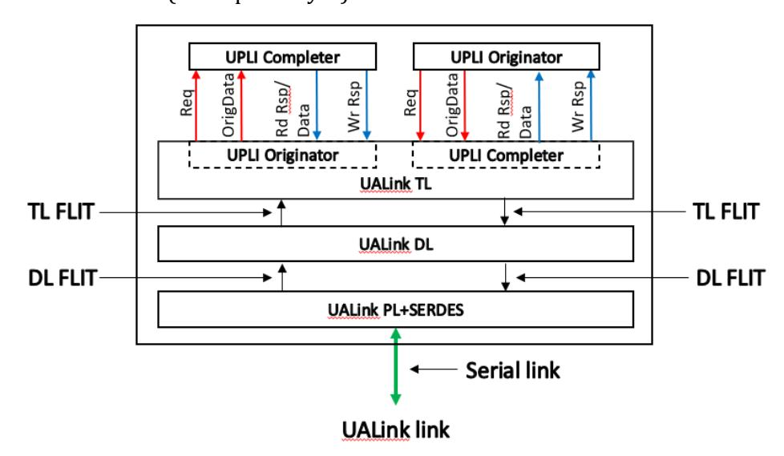

**Figure 2-4 UALink Stack Component**

The UALink TL converts the UPLI Protocol Channels driven by the UPLI Originator and UPLI Completer (Req and OrigData for the UPLI Originator and Rd Rsp/Data and Wr Rsp for the UPLI Completer) into a TL Flit that is passed to the UALink DL Layer. Similarly, the UALink TL receives a TL Flit from the UALink DL that is unpacked into the UPLI Protocol Channels received by the UPLI Completer and the UPLI Originator (Req and OrigData for the Completer and Rd Rsp/Data and Wr Rsp for the Originator).

The UALink DL receives several TL Flits and adds CRC protection and a header to the Flit to form a DL Flit and passes this DL Flit on to the UALink PL. Similarly, the UALink DL receives DL Flits from the UALink PL, strips the CRC and header from that Flit, and forms TL Flits that are passed on to the UALink TL.

The UALink PL receives DL Flits and produces a code word with FEC encoding that is serialized and transmitted to a UALink PL in a connected UALink PL Stack Component. Similarly, the UAlink PL receives a serialized code word with FEC from the UALink PL in the connected UALink Stack Component performs FEC decode and converts that into DL Flit.

To create an interface between an Accelerator and the Switch, two UALink Stack Components are connected as shown below in [Figure 2-5,](#page-5-0) this overall interface shall be bi-directional and symmetric with the UPLI Originator in the Accelerator communicating with the UPLI Completer in the Switch and the UPLI Originator in the Switch communicating with the UPLI Completer in the Accelerator.

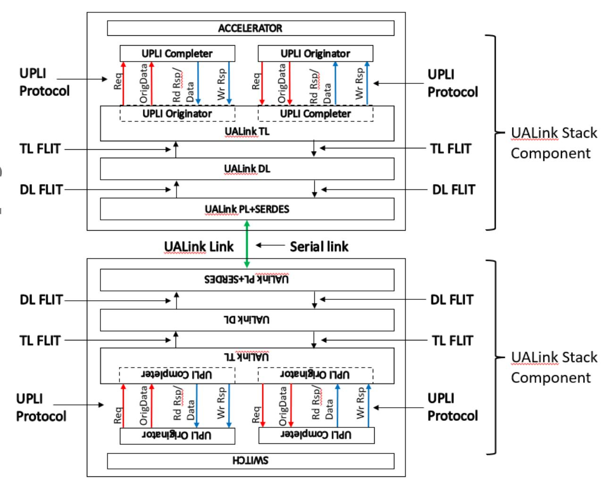

**Figure 2-5 Connected UALink Stack Components**

## **2.3 UALink UPLI Request and Response Paths**

[Figure 2-6](#page-6-0), shows a logical representation of two different Accelerators (ACC "A" and ACC "B") connected through different pairs of UALink Stack Components through a Switch:

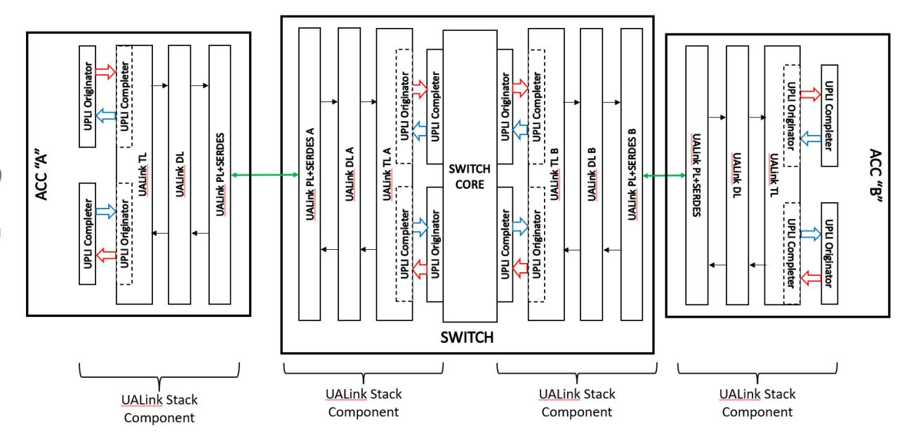

**Figure 2-6 End-to End UALink Connection Between two Accelerators**

To issue a Request from Accelerator A to Accelerator B, the UPLI Originator in Accelerator A shall issue a Request on the Request Channel (and if the Request is a Write, UPLI Write Message, Vendor Defined write Class Command also issues the first Beat of data on the Originator Data Channel. Atomic or Vendor Defined Atomic write Class Commands issue Operand Data on the Originator Data Channel on the first Beat of data on the Originator Data Channel). The UALink TL receives the Request and shall package it into a TL Control Half-Flit (Data Beats shall be packaged as subsequent Data Half-Flits). TL Half-Flits are combined to create a TL Flit and a TL Flit shall consist of two TL Half-Flits. The TL Flit is then modified by the UALink DL to add FEC and CRC and becomes a DL Flit which is then passed through the PHY on Accelerator A as a bitstream to PHY A on the Switch. The PHY A on the Switch is one of several possible PHYs on the Switch where traffic from Accelerator A can be received. The bitstream is reconstituted into the DL Flit by PHY A and passed through UALink DL A and converted to a TL Flit. Finally, the TL Flit passes through UALink TL A and is presented to the UPLI Completer in the Switch attached to UALink TL A.

The UPLI Completer at the Switch attached to UALink TL A shall package the UPLI Protocol elements and the Switch Core shall route these elements to the UPLI Originator attached to UALink TL B that can deliver the Request to Accelerator B. The process of transiting the two UALink Stack Components to reach Accelerator B from the Switch shall be the same process as transiting from Accelerator A to the Switch and terminates at the UPLI Completer in Accelerator B.

When the Request has been processed in Accelerator B, Responses (and data for Read , Vendor Defined Read class Commands , Atomic Requests, or Vendor Defined Atomic class Commands) shall be issued by the UPLI Completer on Accelerator B and pass through the two UALink Stack Components to reach the UPLI Originator connected to UALink TL B. These Responses are routed through the Switch Core and then pass through the two UALink Stack Components starting at the Switch UPLI Completer attached to UALink TL A and terminate at the UPLI Originator in Accelerator A.

The following diagram[, Figure 2-7,](#page-7-0) illustrates the flow of Responses and Requests for a pair of Accelerators. For clarity, this figure omits the UALink DL and UALink PHY blocks. Requests initiated by the Accelerator A UPLI Originator are ultimately sent to the UPLI Completer in Accelerator B. However, the Accelerator A Request is first received by the UPLI Completer in the Switch and is then routed to the UPLI Originator in the Switch ultimately connected to Accelerator B which passes the Request on to Accelerator B's UPLI Completer.

In a similar fashion, the Response for Accelerator A's Request is ultimately sent from the UPLI Completer in Accelerator B to the UPLI Originator in Accelerator A via first the UPLI Originator at the Switch connected to Accelerator B and then the UPLI Completer in the Switch ultimately connected to Accelerator A.

The requests and Responses for Accelerator B's Requests and Responses follow paths that are symmetrical to Accelerator A's requests and Responses, but in the opposite direction.

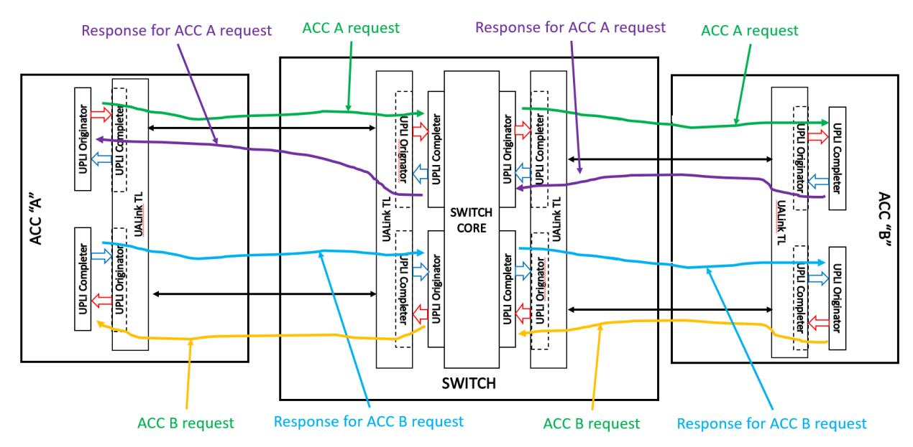

**Figure 2-7 UPLI Request and Response Flows**

## **2.4 Routing a Transaction from End-to-End**

This Section illustrates the flow of a Request from an Originator Device to a Completer Device and the corresponding Response from the Completer Device to the Originator Device.

A UALink station has four UALink lanes which can be bifurcated into one x4, two x2, or four x1 UALink Ports. All UALink stations in a Pod (both on the Switches and at the Accelerators) must be bifurcated in the same manner.

The number of UALink Ports on each Accelerator shall be equal. The Port identifier within a station shall start at 0 and shall be numbered consecutively. UALink Stations shall be numbered contiguously, and a Request or Response is routed from a Source Port of a Switch to a Destination Port of a Switch by routing from the Source Port on the Source Station to the Target Station and then to the Target Port within the station. How a Request or Response is routed from within a Switch is ultimately up to the implementation.

In a Pod, a Physical Switch shall have at least as many Ports as the number of Accelerators in the Pod and the number of Ports on a Physical Switch should equal the Number of Accelerators in the Pod (when the number of Ports on a Physical Switch matches the Number of Accelerators in the system – as shown below in Figure 2-8 [Example system with 32 Accelerators with 32 x1 UALink](#page-8-0)  [Links](#page-8-0) -- the concept of Switch and Physical Switch are equivalent) . This lets each Switch connect to every Accelerator in the Pod via a specific Port. The example system shown below in [Figure 2-8](#page-8-0) illustrates a Pod with 32 Accelerators numbered Accelerators 0, 1, to 31 and 32 Switches numbered 0, 1, to 31.For clarity, certain of the UALink Links have been shown while the other links are omitted.

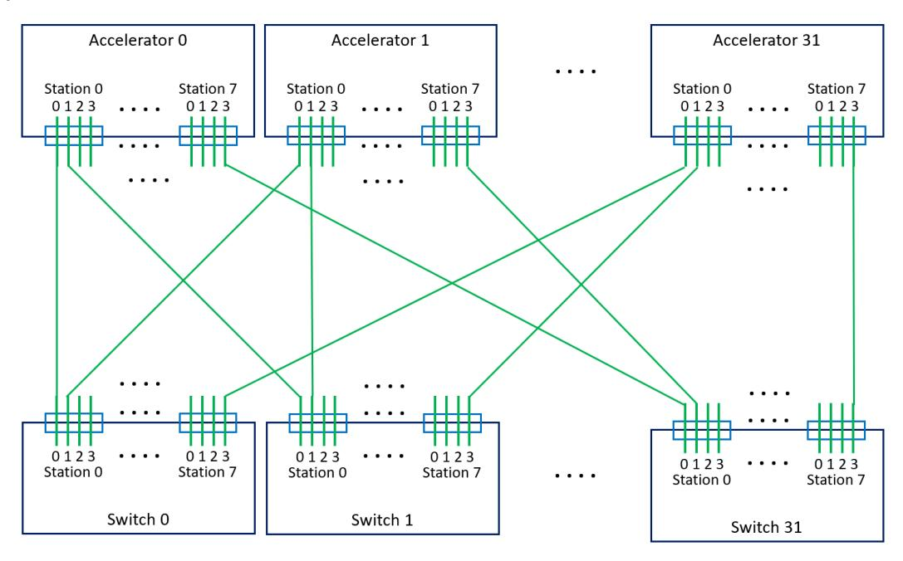

**Figure 2-8 Example system with 32 Accelerators with 32 x1 UALink Links**

The Accelerators and Switches shall use a specific subset of signals in the various UPLI Channels to route and process Requests and data through the system. The rest of the signals within a Channel are conveyed, usually unmodified, with the Transaction. However, specific signals may be modified at various points as the Transaction progresses through the Pod. In addition to the routing signals and the other signals, a set of Credit Management signals shall provide flow control within a each UALink Channel within any given UALink Protocol Level Interface.

Specifically, the Request Channel (Req) shall contain two 10-bit signals, "ReqSrcPhysAccID" and "ReqDstPhysAccID" that specify the Source Accelerator and Destination Accelerator of the Request. In addition, the Request Channel shall contain a 2-bit signal "ReqPortID" that shall control, at certain UALink Protocol Level Interfaces, the routing of the Request onto the bifurcated UALink Links at the associated UALink Stack Component and shall control the Time Division Multiplexing (TDM) of the UALink Protocol Level Interfaces, as described in a later section, at all UALink Protocol Level Interfaces.

The Read Response/Data (RdRsp) Channel shall contain signals "RdRspSrcPhysAccID", "RdRspDstPhysAccID", and "RdRspPortID" and the Write Response (WrRsp) Channel shall contain signals "WrRspSrcPhysAccID", "WrRspDstPhysAccID", and " WrRspPortID". These signals shall function in those UPLI Channels in an analogous way to the respective signals in the Request Channel.

A sample Read Request to address "X" from an Accelerator A (numbered "0") to an Accelerator B (numbered "31") in a Pod connected as shown above (Figure 2-8 [Example system with 32](#page-8-0)  [Accelerators with 32 x1 UALink Links\)](#page-8-0) will be used to illustrate the processing of a transaction using the following figure (Figure 2-9 [Read Request end-to-end flow with Response\)](#page-9-0):

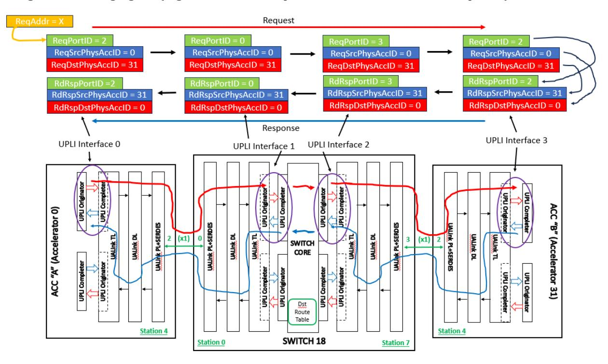

**Figure 2-9 Read Request end-to-end flow with Response**

The Read Request begins with an Originator Device (not shown) forming a Read Request to address "X". Conceptually, Requests can go out any UALink Link on the Accelerator (each UALink Link is attached to a Switch which is capable of routing any Request to any Destination Accelerator). However, generally speaking, to enforce ordering for Requests all accesses within any given 256 byte region of memory must be routed out the same UALink Port (in this example, arbitrarily chosen to be Station 4, Port 2 for the address "X" – see section [2.7.9](#page-38-0) for complete details).

The Read Request is formed at the Originator Device and is issued to the UPLI Originator at Station 4 with an indication to use UALink Port 2, an indication of the Source Accelerator (0 in this example), an indication of the Destination Accelerator (31 in this example), and any other

information associated with the Read Request. The UPLI Originator issues the Request on UALink Protocol Level Interface 0 with ReqPortID set to '2', ReqSrcPhysAccID set to '0' and ReqDstPhysAccID set to '31'. The ReqSrcPhysAccID and ReqDstPhysAccID fields shall remain unchanged from the initial Originator in the Source Accelerator A to the final UPLI Completer in the Destination Accelerator B.

The Read Request is then conveyed across the UALink Link attached to Station 4, Port 2 (as controlled by the ReqPortID value) on Accelerator 0. The ReqPortID value shall not propagated over the UALink Link but rather instead be locally generated at the Switch based on the Port the Read Request entered the Switch. The Read Request enters Switch 18 (the UALink Link at Station 4, Port 2 on all Accelerators are attached to Switch 18 in this example topology) at Station 0, Port 0 (The UALink Links at Station 0, Port 0 on all Switches are attached to Accelerator 0 in this example topology). Based on the entry port at the Switch, a new value for ReqPortID of 0 is assigned and used at UALink Protocol Level Interface 1 in the Switch. The ReqPortID value at Ultra Link Protocol Interface 1 only controls the TDM for the Read Request while transiting UALink Protocol Level Interface 1 into the Switch core.

Once in the Switch core, a look up, based on the ReqDstPhysAccID signal, is performed in the Destination Route Table (Dst Route Table) to determine the proper Station and Port the Read Request should be routed through to get to the destination Accelerator (in this case, Station 7, Port 3 – Accelerator 31 is connected to Station 7, Port 3 on all Switches in this example topology) and routes the Read Request to that station (Station 7) and presents the Read Request on UALink Protocol Level Interface 2 with the newly assigned ReqPortID value of 3.

The UPLI Originator at UALink Protocol Level Interface 2 issues the Read Request which exits the Switch on Port 3 and drops the ReqPortID value. The Read Request then enters Accelerator 31 at Station 4, Port 2 and the value of ReqPortID is regenerated to a value of '2' indicating the Port on which this Request entered Accelerator 31. This regenerated ReqPortID value is used when the Request is issued on UALink Protocol Level Interface 3 and controls the TDM for that interface. The UPLI Completer at UALink Protocol Level Interface 3 retains the value of ReqPortID, ReqSrcPhysAccID, and ReqDstPhysAccID while the Request is being processed by a Completer Device in the Destination Accelerator.

When the information for a Read Response is ready (Read Responses may contain more than one Response Beat), the UPLI Completer at UALink Protocol Level Interface 3 forms a Response Beat with RdRspPortID set to the retained ReqPortID value of '2' and uses the retained Station value to deliver the Response Beat to Station 4. This allows the Completer at UALink Protocol Level Interface 3 to route the Response Beat to the correct output Port and Station without referring to the address of the original Read Request. At UALink Protocol Level Interface 2, the RdRspPortID signal has the regenerated value of '3' reflecting the port the Read Response entered the Switch on.

At UALink Protocol Level Interface 1, the RdRspPortID signal value '0' indicates the Port on Station 0 where the Read Response should exit. This value is obtained from a lookup of the Destination Route Table indexed by RdRspDstAccPhysID at UALink Protocol Level Interface 2 which indicates the destination Accelerator is connected to Port 0, Station 0 on this Switch. Finally, the value of RdRspPortID at UALink Protocol Level Interface 0 is '2', matching the Port the Read Response entered the Source Accelerator. For Read Responses containing more than one Beat of Data, the same process is followed for each Beat.

Writes Requests shall act similarly to Read Requests with the exception that data is issued on the Originator Data Channel to the Destination Accelerator with a single Beat Write Response containing no data being returned.

## **2.5 UPLI Channel Time Division Multiplexing (TDM)**

Each UALink Station driven by an UALink Stack Component can interface to 4 UALink Lanes that can be bifurcated into four x1 UALink Links, two x2 UALink Links, or one x4 UALink Link. The UALink Ports attached to the UALink Links shall be numbered "0" for a x4 bifurcation, "0, 1" for a x2 bifurcation, and "0, 1, 2 ,3" for a x1 bifurcation.

Each Channel in an UALink Protocol Level Interface shall be Time Division Multiplexed (TDM), meaning that for a given cycle, the signals within the UALink Protocol Level Interface channel (aside from the Credit Management signals) are associated with a specific bifurcated Port on the UALink Stack Component attached to a UALink Link. [Figure 2-10](#page-12-0) illustrates an example UALink Stack Component with two associated UALink Protocol Level Interfaces with the UALink station bifurcated into four x1 UALink Links:

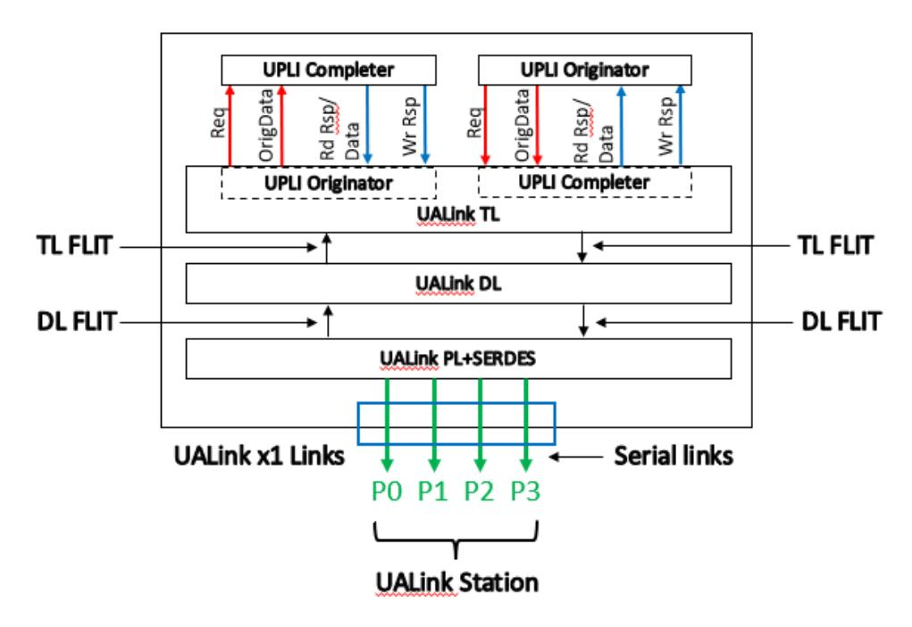

**Figure 2-10 UALink Station with x1 bifurcation**

Each Channel in the UALink Protocol Level Interface in the UALink Stack Component shall have a unique "Valid" signal ("ReqVld" for the Request Channels, "OrigDataVld" for the Originator Data Channels, "RdRspVld" for the Rd Response/Data Channels, and "WrRspVld" for the Write Response Channels) that indicates when valid data is being driven onto the Channel. The "PortID" signal ("ReqPortID" for the Request Channels, "OrigDataPortID" for the Originator Data Channels, "RdRspPortID" for the Rd Response/Data Channels, and "WrRspPortID" for the Write Response Channels) for a given UALink Protocol Level Interface channel shall signify the TDM value for the current cycle when the "Valid" signal for that Channel is asserted and shall be ignored otherwise.

The TDM value shall cycle through a sequence of all the possible Port values (based on the bifurcation) in ascending order, wrapping back to 0 at the maximum value, every 'N' cycles, where N is the number of ports in the station. Valid cycles for a given PortID may only be presented on any UALink Protocol Level Interface Channel every N cycles.

The TDM cycle for the Request Channel and the Originator Data Channel shall be set by the "PortID" signal value on the first ReqVld Beat for that Request Channel (whether the Request is a Read or Vendor Defined Read class Command where the OrigData field is unused or is a Write, Atomic, UPLI

*UPLI Interface Definition and Operation Rules* 42

### **Ultra Accelerator Link Consortium Inc. (UALink) - UALink\_200 Rev 1.0 Specification**

Write Message, Vendor Defined Write class Command, Vendor Defined Atomic class Command, or Atomic Request where the OrigData field is used) and shall remain fixed thereafter for those channels (the Request and Originator Data Channel must be on the same TDM phase to allow the Req and OrigData Channel to both be valid for the first beat of any Request that issues data on the Originator Data Channel). For example, if after reset, if the first valid packet on a Request Channel has a ReqPortID value of '2', the TDM for that Request Channel and Originator Data starts on that cycle with a value of 2 and cycles through the values in the following fashion: 2, 3, 0, 1, 2, 3, 0, 1, . . . thereafter (for a x1 bifurcation. For a x2 bifurcation, the sequence is 0, 1, 0, 1, …. and for a x4 bifurcation the sequence is 0, 0, 0…….). The TDM cycle for the Read Response/Data and Write Response Channels shall be set independently based on the PortID value for the initial Read and Write Response Beats respectively.

The PortID signal for any subsequent "Valid" cycle on the Channel shall match the established TDM value for the current cycle. The explicit PortID signal removes the need for an explicit synchronization sequence to establish the TDM value and allows a receiver to simply use PortID to identify the TDM cycle without having to explicitly track the current TDM cycle (though the receiver implementation can choose to track the TDM cycle to check for the correct TDM cycle value on received Beats). Finally, an explicit PortID signal is useful for debug.

The UALink TL shall be responsible for assembling the various valid packets for differing Ports on the differing UPLI Channels into outbound TL Flits and placing the various received TL Flits onto the correct UPLI TDM cycles on each UPLI Interface.

## **2.6 UALink Protocol Level Interface Flow Control and overall UALink Flow control**

Flow control in the UALink Protocol Level Interface shall utilize a Credit-based control mechanism with Credits being per Port, per UPLI Channel. At initialization or after reset of the UPLI Interface, the Sender side of a UPLI Channel shall have no Credits and the Receiver side of a UPLI channel shall issue an initial set of Credits to the Sender side.

The Receiver shall indicate a Credit or Credits is being initially issued (or, after initialization, being returned) using the following signals:

- A \*CreditVld[3:0] signal (ReqCreditVld[3:0], OrigDataCreditVld[3:0], RdRspCreditVld[3:0], WrRspCreditVld[3:0]) shall indicate a Credit or Credits is being returned to the Sender and for what port (\*CreditVal[0]=1 indicates Port 0 and so on). Credits may be returned on any Port of set of Ports simultaneously by asserting the appropriate signals within \*CreditVld[3:0]. Credit returns shall be independent of the Time Division Multiplexing of the UPLI interface (i.e. Credits for any Port may be returned in any cycle).
- A \*CreditPool[3:0] signal (ReqCreditPool[3:0], OrigDataCreditPool[3:0], RdRspCreditPool[3:0], WrRspCreditPool[3:0]) shall indicate the "type" of the Credit being returned ('0' indicates a VC Credit, '1' indicates a Pool Credit) and for what Port (\*CreditPool[0] indicates the Credit Type for Port0 and so on). This signal shall only be considered valid when the corresponding \*CreditVld[3:0] signal is asserted.
- A set of \*CreditPort[0,1,2,3]VC[1:0] signals (ReqCreditPort0VC[1:0], ReqCreditPort1VC[1:0], ReqCreditPort2VC[1:0], ReqCreditPort3VC[1:0], OrigDataPort0VC[1:0], OrigDataPort1VC[1:0], OrigDataPort2VC[1:0], OrigDataPort3VC[1:0], RdRspCreditPort0VC[1:0], RdRspCreditPort1VC[1:0], RdRspCreditPort2VC[1:0], RdRspCreditPort3VC[1:0], WrRspCreditPort0VC[1:0], WrRspCreditPort1VC[1:0], WrRspCreditPort2VC[1:0], WrRspCreditPort3VC[1:0]) shall indicate the Virtual Channel of the credit being returned for the Channel and Port associated with the signal (for example, ReqCreditPort0VC[1:0] is the Virtual Channel of the credit being returned for the Request Channel on Port0 and similarly for the other signals). This signal shall only be considered valid when the corresponding \*CreditVld[3:0] signal is asserted.
- A set of \*CreditPort[0,1,2,3]Num[1:0] signals (ReqCreditPort0Num[1:0], ReqCreditPort1Num[1:0], ReqCreditPort2Num[1:0], ReqCreditPort3Num[1:0], OrigDataPort0Num[1:0], OrigDataPort1Num[1:0], OrigDataPort2Num[1:0], OrigDataPort3Num[1:0], RdRspCreditPort0Num[1:0], RdRspCreditPort1Num[1:0], RdRspCreditPort2Num[1:0], RdRspCreditPort3Num[1:0], WrRspCreditPort0Num[1:0], WrRspCreditPort1Num[1:0], WrRspCreditPort2Num[1:0], WrRspCreditPort3Num[1:0]) that shall indicate the number of Credits being returned for the channel and port associated with the signal (for example ReqCreditPort0Num[1:0]+1 is the number of Credits being returned for the Request Channel on Port0 and similarly for the other signals).. This signal shall only be considered valid when the corresponding \*CreditVld[3:0] signal is asserted.

At initialization or after Reset, the Receive Side of the UPLI Channel will release a set of Credits corresponding to the available buffering at the Receive side of the UPLI Channel.

The Receive side may issue a set of Pool credits equal to the number of Pool buffers in the Receive side. The Receive side Pool buffers indicated by these Credits shall be able to process UPLI beats for any Virtual Channel. The Receive side may issue a set of VC credits associated with specific Virtual

### **Ultra Accelerator Link Consortium Inc. (UALink) - UALink\_200 Rev 1.0 Specification**

Channels equal to the number of VC buffers in the Receive side for each of the Virtual Channels supported by the Receive side VC buffers. A Receive Side VC buffer need only process UPLI beats for a specific Virtual Channel.

The Receiver Side shall release one of only Pool Credits, only Virtual Channel Credits, or some combination of Pool Credits and Virtual Channel Credits.

When the Receiver side is done releasing the initial Credits, the Receiver side asserts the \*CreditInitDone[3:0] signals (ReqCreditInitDone[3:0], OrigDataCreditInitDone[3:0], RdRspCreditInitDone[3:0], WrRspCreditInitDone[3:0]) as each port finishes. Each signal in \*CreditInitDone[3:0] is associated with a given Port (\*CreditInitDone[2] corresponds to Port 2 on the associated Channel). The \*CreditInitDone[3:0] signals may be asserted independently and once asserted shall remain asserted until the UPLI Interface is reset or powered off.

The Sender side shall monitor the \*CreditInitDone signal until that signal has been asserted an implementation specific number of cycles greater than 1. Once that has occurred, the Sender side shall consider the initial issuance of the Credits to be complete and shall no longer monitor the signal.

The monitoring of the signal for an implementation specific sized burst of asserted values ensures that an error on this signal shorter in duration that the burst length will not errantly terminate the initial credit release early. Further, ignoring the signal after this burst will ensure any subsequent errors on the signal do not impact the Channel.

Once the initial credit release is complete for a given port and Channel, the Send side may start issuing UPLI Beats for that Port and Channel if all other constraints are met. For example, when the Sender wishes to issue a write, it shall have the necessary credits in both the Request Channel (to issue the Request) and the Originator Data Channel (to issue the Beats contiguously and starting with the Request) before the Request can be issued. When a Beat is issued, the Send side shall set the \*VC[1:0] signal (ReqVC[1:0], OrigDataVC[1:s0], RdRspVC[1:0], WrRspVC[1:0]) to indicate the Virtual Channel of the Beat and shall set the \*Pool signal (ReqPool, OrigDataPool, RdRspPool, WrRspPool) to indicate if a Virtual Channel Credit or a Pool Credit was used to issue the beat.

If any Pool Credits were initially released, the sender side shall issue UPLI beats for differing Virtual Channels using those Pool Credits (indicated by setting \*Pool = b'1') according to an allocation of those Pool Credits to the various Virtual Channels that the Sender selects (and which the Sender may vary over time). If any Virtual Channel Credits were initially released, the Sender side shall issue UPLI beats using Virtual Channel Credits for the Virtual Channels (indicated by setting \*Pool = b'0') in accordance with the number of Virtual Channel Credits initially released for each Virtual Channel.

When a UPLI Beat is received at the Receive side, the Virtual Channel of the Beat (\*VC[1:0]) and the Pool indication (\*Pool) shall be recorded by the Receive side and these values are played back to the Sender when returning the Credit for that beat. The Sender side shall return the Credit to the appropriate Pool or Virtual Credit count.

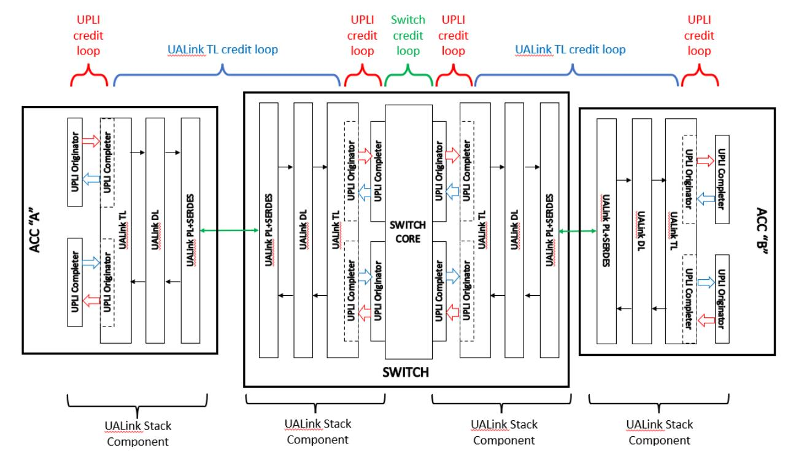

**Figure 2-11 Flow control loops**

The figure above [\(Figure 2-11\)](#page-16-0) illustrates the various flow control Credit loops in the full path between two Accelerators. UALink Protocol Level Interface Credit controls are used at each instance of the UALink Protocol Level Interface along the path. A distinct independent Credit loop mechanism from one UALink TL to the next UALink TL is used to pace Requests and Responses between the UALink TL's.

## **2.7 Interface Signals**

This section describes the signals that make up the UALink Protocol Level Interface and how transactions are conveyed on the various channels of the UALink Protocol Level Interface.

## **2.7.1 Signal Groups**

The UALink Protocol Level Interface shall be organized in the following groups of signals:

- Common signals
- UALink Protocol Level Interface Control signals
- Request Channel
- Read Response/Data Channel
- Write Response Channel
- Originator Data Channel

In this specification, similar signals that occur in different channels may be referred to using a shorthand notation. For example, The ReqVld signal in the Request Channel, the RdRspVld signal in the Read Response/Data Channel, the WrRspVld signal in the Write Response Channel, and the OrigDataVld signal in the Originator Data Channel are collectively referred to by the following notation: \*Vld. These signals shall indicate, in each Channel, whether a valid Beat of information is present on the Channel.

Other examples include:

\*Data: (RdRspData signal in the Read Response/Data Channel; OrigData signal in the Originator Data Channel)

\*CreditVld: (ReqCreditVld signal in the Request Channel; RdRspCreditVld signal in the Read Response/Data Channel; WrRspCreditVld signal in the Write Response Channel; OrigDataCreditVld signal in the Originator Data Channel).

## **2.7.2 Common Signals**

[Table 2-1](#page-17-0) lists the signals that make up the Common Signal group. SOC-pervasive logic shall supply these to each UALink Protocol Level Interface.

**Table 2-1 Common Signals**

| Name        | Size | Description                                                                                    |  |
|-------------|------|------------------------------------------------------------------------------------------------|--|
| UPLIClk     | 1    | Interface clock, sourced from the SOC pervasive logic. UALink Protocol Level Interface signals |  |
|             |      | are synchronous to this clock as well as the UPLIReset_N,                                      |  |
|             |      | *ClkReq, and *ClkAck signals.                                                                  |  |
| UPLIReset_N | 1    | Interface reset signal, active LOW and is asserted and de-asserted and asserted synchronously  |  |
|             |      | to UPLIClk.                                                                                    |  |

The rising edge of UPLIClk shall determine the timing of information transfer across the interface. In general, all signals shall be stable prior to and immediately following the rising edge of UPLIClk.

UPLIReset\_N shall be a negative-active signal (that is, the signal is asserted when the voltage level of the signal is low.) and may be asserted at any time.

## **2.7.3 UPLI Transactions/Channel usage**

A Transaction on the UALink Protocol Level Interface can contain a Read, Write, a Vendor Defined Command, a UPLI Write Message Request, a Vendor Defined UPLI Write Message Request, or an Atomic. These Transactions read from memory, write to memory, atomically modify memory while

optionally returning the original value in memory, or deliver a UPLI message, or performs a Vendor defined operation.

A UPLI transaction consists of multiple cycles (also called "Beats"), which shall occur in a specific order on a specific subset of the UPLI channels (Request, Read Response/Data, Write Response, Originator Data) in the UALink Protocol Level Interface depending on the type of the UPLI Transaction. Transactions shall be issued at the UPLI Originator and shall be processed at the UPLI Completer. The UPLI Completer shall return a Response to the Request on either the Read Response/Data Channel or the Write Response Channel, but not both. Which Channel is used to return a Response shall depends on the transaction type.

Each UPLI transaction shall be initiated by a Request in the Request Channel indicated by the assertion of the Valid Signal (ReqVld) in the Request Channel (a Beat). A Request Beat shall contain other information about the Request involved with routing and identifying the Request such as the Port ID (ReqPortID), the Source Accelerator and Destination Accelerator physical IDs (ReqSrcPhysAccID and ReqDstPhysAccID), and a Transaction Tag to identify the Request from among other Requests (ReqTag). In addition, the Request Beat shall also contains information about the Request such as the Address (ReqAddr), the Command Type (ReqCmd), an indication of the number of doublewords to transfer (ReqLen), and attributes about the Request (ReqAttr) among other fields.

The data returned for a Read Transaction shall be conveyed from the Completer to the Originator as data Beats on the Read Response/Data Channel along with fields providing additional information about the Read Response. This information shall include the status of the Read Transaction (RdRspStatus), which Beat of data is being returned in this beat (RdRspOffset), the total number of Data Beats in the Response (RdRspNumBeats), whether the Beat has been corrupted (RdRspDataError), and if the current Beat is the last Beat to be transmitted (RdRspLast), A Read Response may contain one to four Data Beats.

Read Response Beats shall occur on the Read Response/Data Channel after the Read Request has been received and processed by the Final Completer.

For Write Transactions, the Data shall be conveyed from the Initial Originator to the Final Completer as one to four Data Beat(s) on the Originator Data Channel, each Beat shall Contain the Port ID (OrigPortID) field to provide partial routing information. The first Originator Data Beat for a given transaction shall occur in the same cycle as the Request for the Write. This shall allow the Originator Data beats to inherit the remaining routing and identifying information (ReqSrcPhysAccID, ReqDstPhysAccID, ReqTag) from the Write Request in the Request Channel as well as the number of Data Beats in the Transaction (ReqNumBeats).

A Write Request Beat shall also include information such as a set of Byte Enables to indicate the bytes to be updated in memory (OrigDataByteEn), which Beat of Data is being sent in this Beat (OrigDataOffset), whether this Beat has been corrupted (OrigDataError), and if the current Beat is the last Beat to be transmitted (OrigDataLast).

In the UALink Protocol Level Interface, an Atomic Request can either return the initial value of memory before the modification and atomically modify memory (referred to as an AtomicR command) or only perform the modification of memory (referred to in UPLI as an AtomicNR command).

In addition, all atomic commands (AtomicR and AtomicNR) shall require one or two operands to control the atomic update of memory. For example, an "Atomic add" would require one parameter to specify the value to Atomically add to memory location(s) and a "Compare-and-Swap" would require two parameters: one for the value to initially compare the memory location to, and a value

### **Ultra Accelerator Link Consortium Inc. (UALink) - UALink\_200 Rev 1.0 Specification**

to swap into the memory location if the initial comparison matched. The exact semantics of the various AtomicR/AtomicNR Commands and the number of parameters they need is not specified by this Specification; however all Atomic Commands shall be limited to no more than two parameters.

In the case of an Atomic Request for either an AtomicR Command or an AtomicNR Command, the Transaction proceeds as described above for a Write Request with the exception that the OrigData Channel shall be used to transfer operand data for the Atomic instead of transferring write data. For an AtomicNR Command, the Completer shall provide a Response on the Write Response Channel. For an AtomicR command, the Completer shall return the values initially read from memory as data on the Read Response/Data Channel along with status information about the transaction.

## **2.7.4 Request Channel**

An Originator shall use the Request Channel to request that data be written to or read from the system memory space. [Table 2-2,](#page-20-0) Request Channel Signals, lists the signals that shall make up a Request Channel.

The column labeled Driver indicates whether the Originator or the Completer drives the signal.

**Table 2-2 Request Channel Signals**

| Name                                            | Size (bits) | Driver     | Description                                                                                                                                                                                                                                                                                                                                                                                                                                                                                                                                                                                                                                                                                                                                                                                                                                                                                                                                                                                                                                                                                                                                                                          |
|-------------------------------------------------|----------------|------------|--------------------------------------------------------------------------------------------------------------------------------------------------------------------------------------------------------------------------------------------------------------------------------------------------------------------------------------------------------------------------------------------------------------------------------------------------------------------------------------------------------------------------------------------------------------------------------------------------------------------------------------------------------------------------------------------------------------------------------------------------------------------------------------------------------------------------------------------------------------------------------------------------------------------------------------------------------------------------------------------------------------------------------------------------------------------------------------------------------------------------------------------------------------------------------------|
| Request Channel Information and Control Signals |                |            | These signals are Time Division Multiplexed (TDMed) according to ReqPortID value.                                                                                                                                                                                                                                                                                                                                                                                                                                                                                                                                                                                                                                                                                                                                                                                                                                                                                                                                                                                                                                                                                                    |
| ReqVld                                          | 1              | Originator | Request valid. This signal indicates that the Originator is presenting valid information (a Beat) on this channel.                                                                                                                                                                                                                                                                                                                                                                                                                                                                                                                                                                                                                                                                                                                                                                                                                                                                                                                                                                                                                                                                |
| ReqPortID                                       | 2              | Originator | Request Port ID. Where the Originator drives the Request Channel to a TL, indicates the Port associated with that TL that the Request Channel Beat is to be presented on. For all Originators, ReqPortID indicates the TDM cycle for the Request Channel.                                                                                                                                                                                                                                                                                                                                                                                                                                                                                                                                                                                                                                                                                                                                                                                                                                                                                                                   |
| ReqASI                                          | 2              | Originator | Request Address Space Identifier. For any Request that is not a UPLI Write Message Request or Vendor Defined Command, identifies the address space. For a UPLI Write Message Request, this field is either Reserved or specifies a specific function for the type of the UPLI Write Message Request (the type of UPLI Write Message is specified in the ReqMetaData field) and for a Vendor Defined Command this signal is vendor defined.                                                                                                                                                                                                                                                                                                                                                                                                                                                                                                                                                                                                                                                                                                                            |
| ReqAuthTag                                      | 64             | Originator | Request Authorization Tag. Authorization Tag for the Request. See the Chapter on Security for more details about this signal and Authorization. When Authorization is not active for the Request or ReqVld is de-asserted, this field shall be driven to zero.                                                                                                                                                                                                                                                                                                                                                                                                                                                                                                                                                                                                                                                                                                                                                                                                                                                                                                              |
| ReqSrcPhysAccID                                 | 10             | Originator | Request Source Physical Accelerator ID. Physical Accelerator ID for the Source Accelerator of the Request (i.e. the Accelerator with the Initial UPLI Originator that initiated the Request).                                                                                                                                                                                                                                                                                                                                                                                                                                                                                                                                                                                                                                                                                                                                                                                                                                                                                                                                                                                  |
| ReqDstPhysAccID                                 | 10             | Originator | Request Destination Physical Accelerator ID Physical Accelerator ID for the Destination Accelerator of the Request (i.e. the Accelerator with the Final UPLI Completer that will satisfy the Request)                                                                                                                                                                                                                                                                                                                                                                                                                                                                                                                                                                                                                                                                                                                                                                                                                                                                                                                                                                          |
| ReqTag                                          | 11             | Originator | Request Tag. This field is the Transaction Tag used to uniquely identify each outstanding Request (tag shared across all command types) from the Source Accelerator UALink Port within the Station that issued the Request.                                                                                                                                                                                                                                                                                                                                                                                                                                                                                                                                                                                                                                                                                                                                                                                                                                                                                                                                                    |
| ReqNumBeats                                     | 2              | Originator | Request Number of Data Beats. Indicates the number of Data Beats transferred on the OrigData Channel for this Request for a Write, Vendor Defined Write class Command, Atomic, Vendor Defined Atomic class Command or UPLI Write Message. The number of Data Beats transferred is (ReqNumBeats+1). This field is intended to relieve Switches of the need to compute the number of Beats transferred on the OrigData Channel for the Request from other fields in the interface. Switches shall rely on this field to determine the number of Beats for Requests transferred on the OrigData Channel. This field shall only valid for Requests with ReqCmd[5] = 1 (Atomics, Writes, Vendor Defined Write class Commands, UPLI Write Message Requests, and Vendor Defined UPLI Write Message Requests). For Requests with ReqCmd[5] = 0 that are not Read class Vendor Defined Commands (Reads), this field shall be driven to 0. For Requests that are Read class Vendor Defined Commands, this signal shall be valid and may be, but is not required to be, used to compute the number of Data Beats returned on the Read Response. |
| ReqAddr                                         | 57             | Originator | Request Address. For any Request that is not a UPLI Write Message Request, Vendor Defined Command, or Vendor Defined UPLI Write Message, this field shall specify the Request address. For a UPLI Write Message Request, this field is either Reserved or specifies control information for the UPLI Write Message (the type of the UPLI Write Message shall be specified in the ReqMetadata field). Unless the type of UPLI Write Message defines this field as carrying an address, this field does not specify an address for the UPLI Write Message. UPLI Write Message data is issued as one, two, three, or four 64-byte beats of data without regard to the value in the ReqAddress field. For a Vendor Defined Command, this signal is vendor defined. For Vendor                                                                                                                                                                                                                                                                                                                                                                                 |

| Name                                  | Size (bits) | Driver     | Description                                                                                                                                                                                                                                                                                                                                                                                                                                                                                                                                                                                                                                                                                                                                                                                                                |
|---------------------------------------|----------------|------------|----------------------------------------------------------------------------------------------------------------------------------------------------------------------------------------------------------------------------------------------------------------------------------------------------------------------------------------------------------------------------------------------------------------------------------------------------------------------------------------------------------------------------------------------------------------------------------------------------------------------------------------------------------------------------------------------------------------------------------------------------------------------------------------------------------------------------|
|                                       |                |            | Defined Commands, Vendor Defined UPLI Write Messages, this field is Vendor Defined.                                                                                                                                                                                                                                                                                                                                                                                                                                                                                                                                                                                                                                                                                                                                     |
| ReqCmd                                | 6              | Originator | Request command. This field indicates the Command for this Request and is detailed below.                                                                                                                                                                                                                                                                                                                                                                                                                                                                                                                                                                                                                                                                                                                               |
| ReqLen                                | 6              | Originator | Request Length. For any Request that is not a UPLI Write Message, Vendor Defined UPLI Write Message or Vendor Defined Command, this field indicates number of doublewords of data to be transferred by the transaction Request. The requested transfer size is (ReqLen + 1) doublewords. For a WriteFull Request , this field shall indicate a transfer of either 64, 128, 192, or 256 bytes corresponding to one, two, three or four 64-byte data beats. For a UPLI Write Message Request, this field is either Reserved or specifies a specific function for the type of the UPLI Write Message Request (the type of UPLI Write Message is specified in the ReadMetaData field). For a Vendor Defined Command or Vendor Defined UPLI Write Message Request, this signal is vendor defined. |
| ReqAttr                               | 8              | Originator | Request Attributes. For any Request that is not a UPLI Write Message, a Vendor Defined UPLI Write Message, or a Vendor Defined Command, this field shall specify extended transaction attributes to be used at the Destination Accelerator. The encoding of this field depends on the Request and is detailed below. For a UPLI Write Message Request, this field is either Reserved or specifies a specific function for the type of the UPLI Write Request (the type of the UPLI Write Message is defined by the ReqMetadata field). For a Vendor Defined Command or Vendor Defined UPLI Write Message, this field is vendor defined.                                                                                                                                                            |
| ReqMetaData                           | 8              | Originator | For any Request that is not a UPLI Write Message Request, Vendor Defined UPLI Write Message Request or a Vendor Defined Command, this field shall be an implementation defined control information field conveyed to the Final Completer with the Request. For a UPLI Write Message or Vendor Defined UPLI Write Message, this field specifies the type of the UPLI Write Message as described below. For a Vendor Defined Command, this field is Vendor Defined.                                                                                                                                                                                                                                                                                                                                        |
| ReqVC                                 | 2              | Originator | Request Virtual Channel. Specifies the Virtual Channel of the Request. In UALink 1.0, this field is informational only to the Switch with the exception that this value is returned to the Originator in the Credit Return signals. The Switch has one virtual channel and passes this field through to the Destination Accelerator unchanged.                                                                                                                                                                                                                                                                                                                                                                                                                                                                 |
| ReqPool                               | 1              | Originator | Request Pool. Specifies whether the Request was issued using a Pool Credit (ReqPool = 1) or a Virtual Channel Credit (ReqPool = 0).                                                                                                                                                                                                                                                                                                                                                                                                                                                                                                                                                                                                                                                                                     |
| Request Channel Credit Return signals |                |            | These signals are not Time Division Multiplexed (TDMed). A Credit or Credits for any port may be returned on any cycle.                                                                                                                                                                                                                                                                                                                                                                                                                                                                                                                                                                                                                                                                                                    |
| ReqCreditInitDone                     | 4              | Completer  | Request Credit Initialization Done. When Asserted, indicates to Originator that the initial Credit release for the Port associated with the individual signal is complete (ReqCreditInitDone[2] indicates Port 2 is complete). The individual "done" signals can be asserted independently and once asserted remain asserted until the interface is reset or powered off.                                                                                                                                                                                                                                                                                                                                                                                                                                      |
| ReqCreditVld                          | 4              | Completer  | Request Credit Valid. Indicates a Credit or Credits is being released to the Originator. Credits are per port and a Station may have 1, 2 or 4 ports. ReqCreditVld[n] corresponds to Port[n]. Credits can be released on more than one port simultaneously.                                                                                                                                                                                                                                                                                                                                                                                                                                                                                                                                                       |
| ReqCreditPool                         | 4              | Completer  | Request Credit Pool. Indicates the type of Credit indicated on ReqPool for the Request that consumed the Pool or Virtual Channel Credit or Credits being released. If '0', the Credit or Credits being released is a Virtual Channel Credit and if '1', the Credit or Credits released is a Pool Credit. The ReqVC value for the Request corresponding to the returned Credit or Credits is placed on the appropriate ReqCreditPort[0,1,2,3]VC signal.                                                                                                                                                                                                                                                                                                                                                      |
| ReqCreditPort0VC                      | 2              | Completer  | Request Credit Port 0 Virtual Channel. Indicates the Virtual Channel indicated on ReqVC for the Request that consumed the Pool or Virtual Channel Credit or Credits being released for Port0. Valid when ReqCreditVld[0] is asserted.                                                                                                                                                                                                                                                                                                                                                                                                                                                                                                                                                                                |
| ReqCreditPort1VC                      | 2              | Completer  | Request Credit Port 1 Virtual Channel. Indicates the Virtual Channel indicated on ReqVC for the Request that consumed the Pool or Virtual Channel Credit or Credits being released for Port1. Valid when ReqCreditVld[1] is asserted.                                                                                                                                                                                                                                                                                                                                                                                                                                                                                                                                                                                |
| ReqCreditPort2VC                      | 2              | Completer  | Request Credit Port 2 Virtual Channel. Indicates the Virtual Channel indicated on ReqVC for the Request that consumed the Pool or Virtual Channel Credit or Credits being released for Port2. Valid when ReqCreditVld[2] is asserted.                                                                                                                                                                                                                                                                                                                                                                                                                                                                                                                                                                                |

| Name                           | Size (bits) | Driver     | Description                                                                                                                                                                                                                                                                   |  |
|--------------------------------|----------------|------------|-------------------------------------------------------------------------------------------------------------------------------------------------------------------------------------------------------------------------------------------------------------------------------|--|
| ReqCreditPort3VC               | 2              | Completer  | Request Credit Port 3 Virtual Channel. Indicates the Virtual Channel indicated on ReqVC for the Request that consumed the Pool or Virtual Channel Credit or Credits being released for Port3. Valid when ReqCreditVld[3] is asserted.                                   |  |
| ReqCreditPort0Num              | 2              | Completer  | Request Credit Port 0 Number of Credits. Indicates the number of Credits being returned for Port0 (up to 4, ReqCreditPort0Num+1). Only valid when ReqCreditVld[0] is asserted.                                                                                          |  |
| ReqCreditPort1Num              | 2              | Completer  | Request Credit Port 1 Number of Credits. Indicates the number of Credits being returned for Port0 (up to 4, ReqCreditPort1Num+1). Only valid when ReqCreditVld[1] is asserted.                                                                                          |  |
| ReqCreditPort2Num              | 2              | Completer  | Request Credit Port 2 Number of Credits. Indicates the number of Credits being returned for Port0 (up to 4, ReqCreditPort2Num+1). Only valid when ReqCreditVld[2] is asserted.                                                                                          |  |
| ReqCreditPort3Num              | 2              | Completer  | Request Credit Port 3 Number of Credits. Indicates the number of Credits being returned for Port0 (up to 4, ReqCreditPort3Num+1). Only valid when ReqCreditVld[3] is asserted.                                                                                          |  |
| Request Channel Parity Signals |                |            |                                                                                                                                                                                                                                                                               |  |
| ReqVldParity                   | 1              | Originator | Request Valid Parity. Even parity across ReqVld. Checked every cycle.                                                                                                                                                                                                         |  |
| ReqAddrParity                  | 1              | Originator | Request Address Parity. Even Parity across ReqAddr. Checked only when ReqVld is asserted.                                                                                                                                                                                  |  |
| ReqParity                      | 1              | Originator | Request Parity. ReqParity provides even parity over ReqTag, ReqLen, ReqAttr, ReqCmd, ReqMetaData, ReqVC, ReqSrcPhysAccID, ReqDstPhysAccID, ReqPortID, ReqNumBeats. Checked only when ReqVld is asserted.                                                             |  |
| ReqCreditVldParity             | 1              | Completer  | Request Credit Valid Parity. Even parity across ReqCreditVld. Checked every cycle.                                                                                                                                                                                         |  |
| ReqCreditParity                | 1              | Completer  | Request Credit Parity. Even parity across ReqCreditPort0VC, ReqCreditPort1VC, ReqCreditPort2VC, ReqCreditPort3VC, ReqCreditPort0Num, ReqCreditPort1Num, ReqCreditPort2Num, ReqCreditPort3Num, and ReqCreditPool. Checked in beats where ReqCreditVld is non-zero. |  |

An Originator Device shall use the Request Channel to request the transfer of data to or from the system memory space. The amount of data requested shall be no more than 256 bytes and shall not cross a 256-byte boundary. Up to 64 bytes of data can be transferred in one clock cycle, referred to as a Beat. Transfers larger than 64 bytes are transferred in a series of Beats (also referred to as a Burst).

### **2.7.4.1 ReqASI**

The use of the ReqASI (Request Address Space Identifier) field shall be defined by the Accelerators and is implementation dependent. A possible use of the ReqASI field is to identify Requests that are in-node communication vs cross-node communication. This allows the Accelerators, for example, to identify the different sets of Requests and process translation, protection restrictions, maximum address sizes, etc. differently for the different sets of Requests.

## **2.7.4.2 ReqTag**

Each Originating Device may not reuse a ReqTag (Request Tag) until the last Beat of the Response has been received. Request Tags shall be unique per port.

### **2.7.4.3 ReqAddr**

The ReqAddr (Request Address) field shall provide the byte address of the first doubleword being transferred.

### **2.7.4.4 ReqLen**

The ReqLen (Request Length) field shall specify the number of doublewords to be transferred. The transfer size indicated shall be (ReqLen + 1).

### **2.7.4.5 ReqAttr**

ReqAttr (Request Attributes) shall provide specific attribute information about the Transaction Request. Encoding shall depend on the type of the Request as shown in the following tables.

**Table 2-3 Read, ReqAttr Usage**

| Bit Range    | Sub-field                                                           |
|--------------|---------------------------------------------------------------------|
| ReqAttr[7:4] | Byte enables, last DW. Ignored if the last DW is also the first DW. |
| ReqAttr[3:0] | Byte enables, first DW                                              |

**Table 2-4 Atomic Request ReqAttr Usage**

| Bit Range    | Sub-field                     |
|--------------|-------------------------------|
| ReqAttr[7:4] | Operation Type (OpType[3:0]). |
| ReqAttr[3:2] | Operand Size (OpSize).        |
| ReqAttr[1]   | Reserved                      |
| ReqAttr[0]   | Operation Type (OpType[4]).   |

The Operation Type for the atomic read-modify-write is encoded in OpType[4:0] (ReqAttr[0] concatenated with ReqAttr[7:4]). The precise semantics for the read-modify-write and whether the read-modify-write uses one or two operations is implementation defined.

The operand size OpSize is encoded in ReqAttr[3:2] field as shown below.

**Table 2-5 Atomic OpSize Encoding**

| OpSize | Operand Size |
|--------|--------------|
| 00b    | 32 bits      |
| 01b    | 64 bits      |
| 10b    | 16-bits      |
| 11b    | 8-bits       |

For Writes, the ReqAttr field may be used in an implementation specific manner to convey additional metadata for writes.

For Vendor Defined Commands, the ReqAttr field shall be Vendor Defined.

For UPLI Write Message Requests and Vender Defined UPLI Write Message Requests, the ReqAttr field shall be defined as shown below i[n Table 2-7.](#page-27-0)

### **2.7.4.6 ReqCmd**

The ReqCmd (Request Command) field shall indicate the Command for this Request. When ReqCmd[5] is 1b, the Originator shall transfer data on an Originator Data Channel. For such Commands, in addition to obtaining a Credit from the Request Channel flow control to issue the Request, one or more Credits shall be obtained for the Originator Data Channel.

The legal Command types and legal encoding for the ReqCmd field of the Request Channel is shown i[n Table 2-6,](#page-24-0) below.

The column labeled "Data Channels" lists the Data Channel or Channels utilized by the command and for what purpose. The Resp Chan column indicates whether the Response to the command is returned to the Originator on a Read Response/Data Channel or a Write Response Channel.

ReqCmd [5] = 1 indicates that the command will transfer data on an Originator Data Channel.

• ReqCmd [5:4] = 00 indicates Read type Requests (i.e. Requests that do not have data or byte masks with the Request).

- ReqCmd [5:4] = 10 indicates Write type Requests (i.e. Requests that provide data and possibly byte masks with the Request).
- ReqCmd [5:4] = 11 indicates Atomic type Requests (i.e. Requests that provide Operand Data and byte masks with the Request).

**Table 2-6 Commands**

| UPLI Command                            | ReqCmd            | Data Channels              | Resp  | Description                                                                                             |
|-----------------------------------------|-------------------|----------------------------|-------|---------------------------------------------------------------------------------------------------------|
|                                         |                   |                            | Chan  |                                                                                                         |
| Reserved                                | 00 0000b/00h      |                            |       |                                                                                                         |
|                                         | -                 |                            |       |                                                                                                         |
|                                         | 00-0010b/02h      |                            |       |                                                                                                         |
| Read                                    | 00 0011b/03h      | Rd Rsp/Data (read data) | Read  | Read. I/O Coherent read, up to 256 bytes (4 beats).                                                  |
| Reserved                                | 00 0100b/04h      |                            |       |                                                                                                         |
|                                         | -                 |                            |       |                                                                                                         |
|                                         | 00 0111b/07h      |                            |       |                                                                                                         |
| Reserved for Vendor                     | 00 1000b/08h      |                            |       | Command encodings reserved for Read class                                                               |
| Defined Commands                        | - 00 1111b/0Fh |                            |       | Vendor Defined Commands.                                                                                |
| Reserved                                | 01 0000b/10h      |                            |       |                                                                                                         |
|                                         | -                 |                            |       |                                                                                                         |
|                                         | 10-0111b/27h      |                            |       |                                                                                                         |
| Write                                   | 10 1000b/28h      | Orig Data                  | Write | Write. I/O Coherent write, up to 256 bytes (4                                                           |
|                                         |                   | (write data)               |       | beats).                                                                                                 |
| WriteFull                               | 10 1001b/29h      | Orig Data (write data)  | Write | WriteFull. I/O Coherent store of one or more full (i.e. all Byte Enables for all Beats are asserted) |
|                                         |                   |                            |       | Data Beats.                                                                                             |
| UPLI Write Message                      | 10 1010b/2Ah      | Orig Data                  | Read  | UPLI Write Message, issues a UPLI message from                                                          |
|                                         |                   | (write data)               | or    | the Source Accelerator Originator to the                                                                |
|                                         |                   |                            | Write | Destination Accelerator Completer. The type of                                                          |
|                                         |                   |                            |       | the UPLI message is encoded in the ReqMetaData                                                          |
|                                         |                   |                            |       | field. Depending on the type of UPLI message, the Response is returned on the Read or Write          |
|                                         |                   |                            |       | Response Channel.                                                                                       |
| Reserved                                | 10 1011b/2Bh      |                            |       |                                                                                                         |
|                                         | -                 |                            |       |                                                                                                         |
|                                         | 10-1011b/2Bh      |                            |       |                                                                                                         |
| Reserved for Vendor Defined Commands | 10-1100b/2Ch - |                            |       | Command encodings reserved for Write class Vendor Defined Commands.                                  |
|                                         | 10-1111b/2Fh      |                            |       |                                                                                                         |
| AtomicR                                 | 11 0000b/30h      | Rd Rsp/Data                | Read  | Atomic Return Data. I/O Coherent atomic read                                                            |
|                                         |                   | (returned read             |       | modify-write with data returned.                                                                        |
|                                         |                   | data)                      |       |                                                                                                         |
|                                         |                   | OrigData                   |       |                                                                                                         |
|                                         |                   | (atomic operands)       |       |                                                                                                         |
| Reserved                                | 11-0001b/31h      |                            |       |                                                                                                         |
| AtomicNR                                | 11 0010b/32h      | OrigData                   | Write | Atomic No-Return Data. I/O Coherent atomic                                                              |
|                                         |                   | (atomic                    |       | read-modify-write with no data returned.                                                                |
|                                         |                   | operands)                  |       |                                                                                                         |
| Reserved                                | 11-0011b/33h      |                            |       |                                                                                                         |
|                                         | - 11-0110b/3Bh |                            |       |                                                                                                         |
| Reserved for Vendor                     | 11-1100b/3Ch      |                            |       | Command encodings reserved for Atomic                                                                   |
| Defined Commands.                       | -                 |                            |       | classVendor Defined Commands.                                                                           |
|                                         | 11-1111b/3Fh      |                            |       |                                                                                                         |

### **Reads**

The Read Command shall be the following:

• Read

### **Ultra Accelerator Link Consortium Inc. (UALink) - UALink\_200 Rev 1.0 Specification**

Originators shall perform Read Requests to read data. Requests shall be up to 256 bytes in size and shall not cross a 256-byte boundary. Read Requests shall be considered complete on UPLI when the read Response is returned.

A Read Request shall participate in the local coherence protocol in the Destination Accelerator and shall return a coherent value for the read from that Accelerator.

### **Writes**

The Write Commands shall be the following:

- Write
- WriteFull

Originators shall perform Writes to write data to system memory on the destination Accelerator. Data shall be sent on the Originator Data Channel with valid bytes indicated by the OrigDataByteEn field. Write Requests shall be up to 256 bytes (4 OrigData beats), and shall not cross a 256-byte boundary.

WriteFull Requests shall be Writes that are restricted to being 64, 128, 192, or 256 bytes in length and shall have all Byte Enables active for all the bytes referenced by the WriteFull Request (this allows the Transaction Layer to not transmit the Byte Enables for the write and have the TL at the Destination Accelerator reconstruct the Byte Enables saving link bandwidth).

Write Requests and WriteFull Requests shall participate in the local coherence protocol in the Destination Accelerator and shall update memory and those caches, if any, necessary to perform a coherent update at the Destination Accelerator.

### **Atomics**

The Atomics Commands are the following:

- AtomicR
- AtomicNR

Originators shall issue Atomic Commands to perform atomic (at the Completer) read-modify-write operations. The AtomicR command shall performs an atomic read-modify-write operation and shall return the initial value read from memory. The AtomicNR Command performs an atomic readmodify-write operation in memory and shall not return the initial value read from memory. The exact semantics of how memory is modified and whether the Atomic command requires one or two operands is implementation specific and not defined in this specification.

An Atomic Request shall participate in the local coherence protocol in the Destination Accelerator and shall update memory and whatever caches necessary to perform a coherent update at the Destination Accelerator. If the Atomic is an AtomicR, a coherent value for the location(s) before the update shall be returned.

### **UPLI Write Messages**

The UPLI Write Messages shall consist of the following command:

• UPLI Write Message

The UPLI Write Message shall be a message from the UPLI Originator in the Source Accelerator to the UPLI Completer in the Destination Accelerator. This message shall be conveyed as a Request with semantics similar to an Atomic. The UPLI Write Message shall convey a one to four 64-byte Data Beat payload on the OrigData Channel that may contain no content, the ReqMetaData field shall be used to signify which specific UPLI Write Message type the message is (up to 256 choices).

### **Ultra Accelerator Link Consortium Inc. (UALink) - UALink\_200 Rev 1.0 Specification**

For each UPLI Write Message the required Response for the UPLI Write Message shall be conveyed on either the Read Response/Data Channel or the Write Response Channel based on the UPLI Write Message type (similar to how AtomicR and AtomicNR requests are handled). If the Response to the Write UPLI Message is conveyed on the Read Response/Data Channel, the number of 64-byte Data Beats in the Response is specific to the type of the UPLI Write Message, may vary from a minimum of one Beat to four Beats, and does not have to match the number of 64-byte Data Beats transferred with the UPLI Write Message Request. A set of the values of the ReqMetaData field (0xF0-0xFF) for a UPLI Write Message Request specify Vendor Defined UPLI Write Message types.

The semantic effect(s), if any, in the Source Accelerator or Destination Accelerator due the UPLI Write Message or Vendor Defined UPLI Write Message and/or the associated Response are specific to the particular type of the UPLI Write Message or Vendor Defined UPLI Write Message.

### **Vendor Defined Commands**

The UPLI Interface defines three different classes of Vendor Defined Commands (VDCs): Read class VDCs (ReqCMD = 0x08h-0x0Fh), Write class VDCs (ReqCMD = 0x2Ch-0x2Fh), and Atomic class VDCs (ReqCMD = 0x3Ch-0x3Fh). For each Vendor Defined Command, the following UPLI Request Interface signals shall be Vendor defined: ReqASI, ReqAddr, ReqLen, ReqAttr, and ReqMetaData. The remaining signals in the UPLI Request Interface shall retain the same functionality as for a non-VDC.

The number of UPLI Data Beats transferred on the OrigData channel for a Write class or for an Atomic Class Vendor Defined Request shall be controlled solely by the value of the ReqNumBeats signal in the Vendor Defined Request.

For a Read class Vendor Defined Command or for an Atomic class Vendor Defined Command that returns data, the number of Beats of data returned in the associated Read Response shall be an implementation specific function of signals (possibly including ReqCMD and ReqNumBeats) in the Vendor Defined Command. The number of Data Beats returned in the associated Read Response shall be controlled solely by the RdRspNumBeats signal.

The layout and contents of the Data Beats for Vendor Defined Commands are vendor defined.

Any VDC that accesses memory shall be issued on the same port on the Accelerator that the non-VDCs that have an address within the same 256-byte memory region accessed by the VDC.

No VDC shall access and/or alter more than one 256-byte region of memory.

Read class VDCs shall not issue Data Beat(s) on the OrigData channel and the Response for a Read class VDR shall be returned on the Read Response channel.

Write class VDCs shall issue Data Beat(s) (with associated Byte Enables) on the OrigData Channel and the Response for a Write class VDC shall be returned on the Write Response channel.

Atomic class VDCs shall issue Data Beat(s) on the OrigData Channel and the Response for an Atomic VDC shall be returned on either the Read Response Channel or the Write Response Channel.

### **2.7.4.7 ReqMetaData**

For Requests that are not UPLI Write Message Requests, the ReqMetaData field shall convey implementation defined control information.

For a UPLI Write Message Request, the ReqMetadata field shall indicate the particular type (up to 256) of the UPLI Write Message. The following table indicates the legal UPLI Write Message Request types, how the various fields that may be Reserved or use for the UPLI Write Message and defined for each type, and the number of 64-byte OrigData Beats are sent with the Request:

**Table 2-7 UPLI Write Message Request Types**

| ReqMetaData value | Type                                  | ReqAddr           | ReqASI            | ReqAttr           | # Write Beats/ Content | Response Channel/ # Beats if Read |
|----------------------|---------------------------------------|-------------------|-------------------|-------------------|---------------------------|--------------------------------------|
| 0x00                 | NOP                                   | Reserved          | Reserved          | Reserved          | 1 / Null (all zeros)   | Write                                |
| 0x01                 | KeyRollMsg.ReqChannel                 | Reserved          | Reserved          | Reserved          | 1 / Null (all zeros)   | Write                                |
| 0x02                 | KeyRollMsg.RdRspChannel               | Reserved          | Reserved          | Reserved          | 1 / Null (all zeros)   | Read                                 |
| 0x03                 | KeyRollMsg.WrRspChannel               | Reserved          | Reserved          | Reserved          | 1 / Null (all zeros)   | Write                                |
| 0x04-0xEF            | Reserved                              |                   |                   |                   |                           |                                      |
| 0xF0- 0xFF        | Vendor Defined UPLI Write Messages | Vendor Defined | Vendor Defined | Vendor Defined | Vendor Defined            | Vendor Defined                       |

To ease compatibility issues with future version of the UALink specification, implementations should consume bits of ReqMetaData from the low order bit and leave as many high-order bits of ReqMetaData unused as possible (this will allow future version of the UALink specification to more easily reclaim bits of ReqMetaData for new predefined uses if necessary).

## **2.7.5 Read Response/Data Channel**

The Read Response/Data Channel shall provide the Read Response and Read Response Data for a specific Read Request.

Data shall be returned in the RdRspData field in one or more Beats. A Response shall be matched to the Request that evoked it based on the information in the RdRspTag fields. For a Read Response to correspond to a Read Request the RdRspTag shall match the ReqTag of the Request that initiated the Data Transfer.

The column labeled Driver indicates whether the Originator or the Completer drives the signal.

**Table 2-8 Read Response/Data Channel Signals**

| Name                                                           | Size | Driver    | Description                                                                                                                                                     |
|----------------------------------------------------------------|------|-----------|-----------------------------------------------------------------------------------------------------------------------------------------------------------------|
| Read Response and Data Channel Information and Control signals |      |           |                                                                                                                                                                 |
|                                                                |      |           | These signals are Time Division Multiplexed (TDMed) according the RdRspPortID value.                                                                            |
| RdRspVld                                                       | 1    | Completer | Read Response Valid. This signal indicates that the Completer is presenting valid                                                                               |
|                                                                |      |           | information (a Data Beat) on this Channel.                                                                                                                      |
| RdRspPortID                                                    | 2    | Completer | Read Response/Data Port ID. Where the Completer drives the Read                                                                                                 |
|                                                                |      |           | Response/Data Channel to a TL, indicates the Port associated with that TL that                                                                                  |
|                                                                |      |           | the Read Response/Data Channel Beat is to be presented on. For all Completers,                                                                                  |
|                                                                |      |           | RdRspPortID indicates the TDM cycle for the Read Response/Data Channel.                                                                                         |
| RdRspAuthTag                                                   | 64   | Completer | Read Response Authorization Tag. Authorization Tag for the Read Response. See                                                                                   |
|                                                                |      |           | the Chapter on Security for more details about this signal and Authorization.                                                                                   |
|                                                                |      |           | When Authorization is not active for the Response or RdRspVld is de-asserted, this field shall be driven to zero.                                            |
|                                                                |      |           |                                                                                                                                                                 |
| RdRspSrcPhysAccID                                              | 10   | Completer | Read Response Source Physical Accelerator ID. The source Accelerator ID of the Read Response. This field should contain the value of ReqDstPhysAccID for the |
|                                                                |      |           | Request that caused this Read Response (the Destination Accelerator of the                                                                                      |
|                                                                |      |           | original Request is the source Accelerator of the Read Response). This                                                                                          |
|                                                                |      |           | information is not required for functionality but is useful for debug (the Read                                                                                 |
|                                                                |      |           | Response is routed using the RdRspDstPhysAccID field). Carrying a correct value                                                                                 |
|                                                                |      |           | in this field is optional (i.e. UALink TL or UALink DL may compress this field                                                                                  |
|                                                                |      |           | out). When the field does not contain an accurate value, the field should be                                                                                    |
|                                                                |      |           | driven to zero. Because this field may be inaccurate, it may not be used for a                                                                                  |
|                                                                |      |           | functional purpose.                                                                                                                                             |
| RdRspDstPhysAccID                                              | 10   | Completer | Read Response Destination Physical Accelerator ID. The Destination Accelerator                                                                                  |
|                                                                |      |           | ID of the Read Response. This field shall contain the value of ReqSrcPhysAccID                                                                                  |
|                                                                |      |           | for the Request that caused this Read Response (the Source Accelerator of the                                                                                   |
|                                                                |      |           | original Request is the Destination Accelerator of the Read Response). This field                                                                               |
|                                                                |      |           | is used to route the Read Response back to the Accelerator that originally                                                                                      |
|                                                                |      |           | sourced the Request.                                                                                                                                            |
| RdRspTag                                                       | 11   | Completer | Read Response Transaction Tag. This field contains the value of ReqTag field                                                                                    |
|                                                                |      |           | from the initial Request.                                                                                                                                       |
| RdRspNumBeats                                                  | 2    | Completer | Read Response Number of Data Beats. Indicates the number of Beats for this                                                                                      |
|                                                                |      |           | Read Response. The number of beats transferred is (RdRspNumBeats+1). This                                                                                       |
|                                                                |      |           | signal is intended to allow Switches to gather multiple Beats together more                                                                                     |
|                                                                |      |           | easily into a larger entity for routing and relieve Switches of the need to                                                                                     |
|                                                                |      |           | compute the number of Beats being transferred.                                                                                                                  |
|                                                                |      |           | Switches shall rely on this field to determine the number of beats being                                                                                        |
|                                                                |      |           | transferred for Read Responses.                                                                                                                                 |
| RdRspData                                                      | 512  | Completer | Read Response Data. If the Read was successful, this field carries the requested                                                                                |
|                                                                |      |           | data. The transfer of the requested data may require more than one Data Beat.                                                                                   |
| RdRspStatus                                                    | 4    | Completer | Read Response status. This field indicates the status of the Read Request.                                                                                      |
|                                                                |      |           | RdRspStatus is required to be the same across all beats of a Response.                                                                                          |
| RdRspOffset                                                    | 2    | Completer | Read Response Offset. Indicates the index of the current Data Beat. Data to be                                                                                  |
|                                                                |      |           | returned to the Originator is transferred from the Completer in the RdRspData                                                                                   |
|                                                                |      |           | field in one or more Data Beats. Each Beat is sequentially assigned a number                                                                                    |
|                                                                |      |           | starting at 0 and ending with n-1, based on the order of the data in memory; n is                                                                               |
|                                                                |      |           | the total number of Beats required to transfer the data to be returned. When the                                                                                |
|                                                                |      |           | transfer requires more than one Beat and the transfer is in Multi-Beat Mode, the                                                                                |
|                                                                |      |           | Completer must begin with RdRspOffset 0 and continue in Beat order. In single                                                                                   |
|                                                                |      |           | beat mode, the Beats may come in any order. This field provides the number of                                                                                   |
|                                                                |      |           | the Beat being presented on this transfer cycle.                                                                                                                |

| Name                                                 | Size | Driver     | Description                                                                                                                                                                                                                                                                                                                                                                                                                                                                                        |
|------------------------------------------------------|------|------------|----------------------------------------------------------------------------------------------------------------------------------------------------------------------------------------------------------------------------------------------------------------------------------------------------------------------------------------------------------------------------------------------------------------------------------------------------------------------------------------------------|
| RdRspLast                                            | 1    | Completer  | Read Response Last. This signal is asserted with the last Response Data Beat of a data transfer.                                                                                                                                                                                                                                                                                                                                                                                                |
| RdRspDataError                                       | 1    | Completer  | Read Response Data Error. This field is sent with the same timing as RdRspData and indicates the status (error – or "poisoned" – or not) of the Beat This field shall be ignored when RdRspVld is not asserted. This field may have differing values in the different beats unlike RdRspStatus and this field shall not be used to indicate errors other than parity issues with Data or Byte Enable fields. As one example, Data Response Beats with a RdRspStatus of DECODE_ERROR |
|                                                      |      |            | should provide beats of a fixed data pattern – say all 0xF's – and have RdRspDataError = 0 for these Beats unless a parity error occurred during transmission. The DECODE ERROR is indicated solely by the RdRspStatus field.                                                                                                                                                                                                                                                                |
| RdRspVC                                              | 2    | Completer  | Read Response Virtual Channel. Specifies the Virtual Channel of the read Response. Matches the Virtual Channel of the originating Request (ReqVC). In UALink 1.0, this field is informational only to the Switch with the exception that this value is returned to the Sender in the Credit Return signals. The Switch has one virtual channel and passes this field through to the source Accelerator unchanged.                                                                   |
| RdRspPool                                            | 1    | Completer  | Read Response Pool. Specifies whether the Read Response was issued using a Pool Credit (RdRspPool = 1) or a Virtual Channel Credit (RdRspPool = 0).                                                                                                                                                                                                                                                                                                                                             |
| Read Response and Data Channel Credit Return signals |      |            | These signals are not Time Division Multiplexed (TDMed). A Credit or Credits for any port may be returned on any cycle.                                                                                                                                                                                                                                                                                                                                                                            |
| RdRspCreditInitDone                                  | 4    | Originator | Read Response Credit Initialization Done. When Asserted, indicates to Completer that the initial Credit release for the port associated with the individual signal is complete (RdRspCreditInitDone[2] indicates port 2 is complete). The individual "done" signals can be asserted independently and once asserted remain asserted until the interface is reset or powered off.                                                                                                       |
| RdRspCreditVld                                       | 4    | Originator | Read Response Credit Valid. Indicates a Credit or Credits is being released to the Completer. Credits are per port and a Station may have 1, 2 or 4 ports. RdRspCreditVld[n] corresponds to Port[n]. Credits can be released on more than one port simultaneously.                                                                                                                                                                                                                        |
| RdRspCreditPool                                      | 4    | Originator | Read Response Credit Pool. Indicates the type of Credit indicated on RdRspPool for the Read Response that consumed the Pool or Virtual Channel Credit or Credits being released. If '0', the Credit or Credits being released is a Virtual Channel Credit and if '1', the Credit or Credits released is a Pool Credit. The RdRspVC value for the Write Response corresponding to the returned Credit or Credits is placed on the appropriate RdRspCreditPort[0,1,2,3]VC signal.     |
| RdRspCreditPort0VC                                   | 2    | Originator | Read Response Credit Port 0 Virtual Channel. Indicates the Virtual Channel indicated on RdRspVC for the Read Response that consumed the Pool or Virtual Channel Credit or Credits being released for Port0. Valid when RdRspCreditVld[0] is asserted.                                                                                                                                                                                                                                     |
| RdRspCreditPort1VC                                   | 2    | Originator | Read Response Credit Port 1 Virtual Channel. Indicates the Virtual Channel indicated on RdRspVC for the Read Response that consumed the Pool or Virtual Channel Credit or Credits being released for Port1. Valid when RdRspCreditVld[1] is asserted.                                                                                                                                                                                                                                     |
| RdRspCreditPort2VC                                   | 2    | Originator | Read Response Credit Port 2 Virtual Channel. Indicates the Virtual Channel indicated on RdRspVC for the Read Response that consumed the Pool or Virtual Channel Credit or Credits being released for Port2. Valid when RdRspCreditVld[2] is asserted.                                                                                                                                                                                                                                     |
| RdRspCreditPort3VC                                   | 2    | Originator | Read Response Credit Port 3 Virtual Channel. Indicates the Virtual Channel indicated on RdRspVC for the Read Response that consumed the Pool or Virtual Channel Credit or Credits being released for Port3. Valid when RdRspCreditVld[3] is asserted.                                                                                                                                                                                                                                     |
| RdRspCreditPort0Num                                  | 2    | Originator | Read Response Credit Port 0 Number of Credits. Indicates the number of Credits being returned for Port0 (up to 4, RdRspCreditPort0Num+1). Only valid when RdRspCreditVld[0] is asserted.                                                                                                                                                                                                                                                                                                     |
| RdRspCreditPort1Num                                  | 2    | Originator | Read Response Credit Port 1 Number of Credits. Indicates the number of Credits being returned for Port1 (up to 4, RdRspCreditPort1Num+1). Only valid when RdRspCreditVld[1] is asserted.                                                                                                                                                                                                                                                                                                     |
| RdRspCreditPort2Num                                  | 2    | Originator | Read Response Credit Port 2 Number of Credits. Indicates the number of Credits being returned for Port2 (up to 4, RdRspCreditPort2Num+1). Only valid when RdRspCreditVld[2] is asserted.                                                                                                                                                                                                                                                                                                     |
| RdRspCreditPort3Num                                  | 2    | Originator | Read Response Credit Port 3 Number of Credits. Indicates the number of Credits being returned for Port3 (up to 4, RdRspCreditPort3Num+1). Only valid when RdRspCreditVld[3] is asserted.                                                                                                                                                                                                                                                                                                     |
| Read Response and Data Channel Parity signals        |      |            |                                                                                                                                                                                                                                                                                                                                                                                                                                                                                                    |
| RdRspVldParity                                       | 1    | Completer  | Read Response Valid Parity. Even parity across RdRspVld. Checked every cycle.                                                                                                                                                                                                                                                                                                                                                                                                                      |
|                                                      |      |            |                                                                                                                                                                                                                                                                                                                                                                                                                                                                                                    |

*UPLI Interface Definition and Operation Rules* 59

| Name                 | Size | Driver     | Description                                                                                                                                                                                                                                                                                                                                                                                                                                                                                                                                  |
|----------------------|------|------------|----------------------------------------------------------------------------------------------------------------------------------------------------------------------------------------------------------------------------------------------------------------------------------------------------------------------------------------------------------------------------------------------------------------------------------------------------------------------------------------------------------------------------------------------|
| RdRspDataParity      | 8    | Completer  | Read Response Data Parity. Each bit in RdRspDataParity provides even parity based error protection for 64 bits of the RdRspData field. The number of set bits in RdRspDataParity[i] and RdRspData[((i+1)*64-1):(i*64)] is always even. Even parity must be provided by the completer, including cases when read data was masked due to the length or the address of the command, and beats where RdRspDataError is asserted. Checked only when RdRspVld is asserted. This field is sent with the same timing as RdRspData. |
| RdRspParity          | 1    | Completer  | Read Response Parity. RdRspParity provides even parity over RdRspTag, RdRspStatus, RdRspOffset, RdRspLast, RdRspNumBeats, RdRspVC, RdRspSrcPhysAccID, RdRspDstPhysAccID, RdRspPortID, RdRspDataError. Checked only when RdRspVld is asserted.                                                                                                                                                                                                                                                                                       |
| RdRspCreditVldParity | 1    | Originator | Read Response Credit Valid Pairty. Even parity across RdRspCreditVld. Checked every cycle.                                                                                                                                                                                                                                                                                                                                                                                                                                                |
| RdRspCreditParity    | 1    | Originator | Read Response Credit Parity. Even parity across RdRspCreditPort0VC, RdRspCreditPort1VC, RdRspCreditPort2VC, RdRspCreditPort3VC, RdRspCreditPort0Num, RdRspCreditPort1Num, RdRspCreditPort2Num, RdRspCreditPort3Num, and RdRspCreditPool. Checked in beats where RdRspCreditVld is non-zero.                                                                                                                                                                                                                                      |

### **2.7.5.1 RdRspStatus**

The four-bit RdRspStatus field shall provide a success/fail indication of the read Response. The encoding of RdRspStatus[3:0] field shall be encoded as shown i[n Table 2-9](#page-30-0) an[d Table 2-10.](#page-30-1) The Switch shall deliver the RdRspStatus to the Initial UPLI Originator of the Request.

**Table 2-9 RdRspStatus [3:0] Encoding for Predefined Commands**

| RdRspStatus[3:0] | Response                   | Comment                                                                                                                                                   |
|------------------|----------------------------|-----------------------------------------------------------------------------------------------------------------------------------------------------------|
| 0000b            | OKAY (Normal completion)   | The transaction completed normally.                                                                                                                       |
| 0001b            | Reserved                   |                                                                                                                                                           |
| 0010b            | TARGET ABORT               | Indicates that the end-target of the transaction had an error while handling the transaction or is otherwise unable to complete the transaction.    |
| 0011b            | DECODE ERROR               | Address Decode Error                                                                                                                                      |
| 0100b-0101b      | Reserved                   |                                                                                                                                                           |
| 0110b            | PROTECTION VIOLATION       | Protection violation. Indicates that certain security or protection checks caused the transaction to be aborted. This error is normally persistent. |
| 0111b            | Reserved                   |                                                                                                                                                           |
| 1000b            | CMPTO (Completion Timeout) | The Completer in the destination Accelerator was unable to complete the Request and timed out.                                                         |
| 1001b-1111b      | Reserved                   |                                                                                                                                                           |

**Table 2-10 RdRspStatus[3:0] Encoding for Vendor Defined Command**

| RdRspStatus[3:0] | Response                 | Comment                             |
|------------------|--------------------------|-------------------------------------|
| 0000b            | OKAY (Normal completion) | The transaction completed normally. |
| 0001b-1111b      | Vendor Defined           |                                     |

If RdRspStatus shall indicate an error (TARGET ABORT, DECODE ERROR, PROTECTION VIOLATION, CMPTO), the Completer shall transfer all requested data beats including the assertion of RdRspLast, using Manufactured Data if there is no data available due to the error. A Manufactured Data pattern of all ones (0xFF) is recommended.

If the Data for a Read Response would otherwise be cached in some cache in the Accelerator, this shall be prevented for Read Responses with RdRspStatus indicating an error. The Originator shall not cache the returned Data. In general, any transaction that completes with RdRspStatus indicating

### **Ultra Accelerator Link Consortium Inc. (UALink) - UALink\_200 Rev 1.0 Specification**

an error does shall not alter the cache state of the requested cache line(s) in the Accelerator that is the Source Accelerator for the Request associated with this Response.

For UPLI Write Message Requests that utilize a Read Response but for which the ReqAddr field is either defined as Reserved or used to convey information other than an address, the DECODE ERROR and PROTECTION VIOLATION Response Status values shall not be legal.

## **2.7.5.2 RdRspDataError**

The RdRspDataError (Read Response Data Error) signal is a data "poison" indicator that shall be asserted at any UALink Protocol Level Interface on a Switch or on an Accelerator that detects a parity error on the RdRsp Data Beat, or by the Switch Core detecting an error on Read Response Data (data only, not control signals) according to the Switch soft error detection scheme. This signal is asserted individually for each Beat according to the error state of that Beat.

### **2.7.5.3 RdRspOffset**

The RdRspOffset (Read Response Offset) shall be used to indicate the position of the current Beat in the Read Data being Returned to the originator in the RdRspData field. Each Beat required for a Response shall be sequentially assigned a number starting at 0 and ending with 3 in ascending address order or as defined by a Vendor Defined Command.

Beat 0 (RdRspOffset = 0) shall always contain the initial (lowest addressed) byte of the requested data payload for non-Vendor Defined Commands. Beats 1-3 (if present) shall provide the data in ascending address order for non-Vendor Defined Commands. For Vendor Defined Commands the ordering of the Data Beats shall be Vendor Defined.

## **2.7.6 Write Response Channel**

The Write Response Channel shall provide feedback to the Initial Originator of a Write Request indicating the outcome and completion of the Request at the Final Completer. Responses are matched with Requests based on the Request tag of the Request[. Table 2-11](#page-32-0) lists the signals that make up a Write Response Channel.

The column labeled **Driver** indicates whether the Originator or the Completer drives the signal.

**Table 2-11 Write Response Channel Signals**

| Name                                                   | Size (bits) | Driver    | Description                                                                                                                                                                                                                                                                                                                                                                                                                                                                                                                                                                                                                                                                                                                                                                                                                                                                                                                                               |
|--------------------------------------------------------|----------------|-----------|-----------------------------------------------------------------------------------------------------------------------------------------------------------------------------------------------------------------------------------------------------------------------------------------------------------------------------------------------------------------------------------------------------------------------------------------------------------------------------------------------------------------------------------------------------------------------------------------------------------------------------------------------------------------------------------------------------------------------------------------------------------------------------------------------------------------------------------------------------------------------------------------------------------------------------------------------------------|
| Write Response Channel Information and Control signals |                |           | These signals are Time Division Multiplexed (TDMed) according the WrRspPortID value.                                                                                                                                                                                                                                                                                                                                                                                                                                                                                                                                                                                                                                                                                                                                                                                                                                                                      |
| WrRspVld                                               | 1              | Completer | Write Response Valid. This signal indicates that the Completer is presenting valid information (a Beat) on this channel.                                                                                                                                                                                                                                                                                                                                                                                                                                                                                                                                                                                                                                                                                                                                                                                                                               |
| WrRspPortID                                            | 2              | Completer | Write Response Port ID. Where the Completer drives the Write Response Channel to a TL, indicates the Port associated with that TL that the Write Response Channel Beat is to be presented on. For all Completers, WrRspPortID indicates the TDM cycle for the Write Response Channel.                                                                                                                                                                                                                                                                                                                                                                                                                                                                                                                                                                                                                                                         |
| WrRspAuthTag                                           | 64             | Completer | Write Response Authorization Tag. If the WrRspStatus indicates a value other than ISOLATE, this field shall contain the Authorization Tag for the Write Response. See the Chapter on Security for more details about this signal and Authorization. When Authorization is not active for the Response or WrRspVld is de-asserted, this field is driven to zero. If the WrRspStatus field indicates ISOLATE, this field is a don't care and shall be ignored by the Completer and no Authentication failure shall be generated.                                                                                                                                                                                                                                                                                                                                                                                                       |
| WrRspSrcPhysAccID                                      | 10             | Completer | Write Response Source Physical Accelerator ID. The source Accelerator ID of the Write Response. If the WrRspStatus indicates a value other than ISOLATE, this field shall contain the value of ReqDstPhysAccID for the Request that caused this Write Response (the destination Accelerator of the original Request is the Source Accelerator of the Write Response). This information is not required for functionality but is useful for debug (the Write Response is routed using the WrRspDstPhysAccID). Carrying a correct value in this field is optional (i.e. UALink TL or UALink DL may compress this field out). When the field does not contain an accurate value, the field should be driven to zero. Because this field may be inaccurate, it may not be used for a functional purpose. If the WrRspStatus field indicates ISOLATE, this field is a don't care and shall be ignored by the Completer. |
| WrRspDstPhysAccID                                      | 10             | Completer | Write Response Destination Physical Accelerator ID. The destination Accelerator ID of the Write Response. If the WrRspStatus indicates a value other than ISOLATE, this field shall contain the value of ReqSrcPhysAccID for the Request that caused this Write Response (the Source Accelerator of the original Request is the destination Accelerator of the Write Response). This field is used to route the Write Response back to the Accelerator that originally sourced the Request. If the WrRspStatus field indicates ISOLATE, this field is a don't care and shall be ignored by the Completer.                                                                                                                                                                                                                                                                                                                         |
| WrRspTag                                               | 11             | Completer | Write Response Transaction Tag. If the WrRspStatus indicates a value other than ISOLATE, this field shall contain the value of the ReqTag field from the Request that caused this Write Response. If the WrRspStatus field indicates ISOLATE, this field is a don't care and shall be ignored by the Completer.                                                                                                                                                                                                                                                                                                                                                                                                                                                                                                                                                                                                                               |
| WrRspStatus                                            | 4              | Completer | Write Response status. This field shall indicate the status of the Write Request.                                                                                                                                                                                                                                                                                                                                                                                                                                                                                                                                                                                                                                                                                                                                                                                                                                                                      |
| WrRspVC                                                | 2              | Completer | Write Response Virtual Channel. If the WrRspStatus indicates a value other than ISOLATE, this field shall specify the virtual channel of the Write Response. This signal shall matche the virtual channel of the originating Request (ReqVC). In UALink 1.0, this field is informational only to the Switch with the exception that this value is returned to the Sender in the Credit Return signals. The Switch has one virtual channel and passes this field through to the source Accelerator                                                                                                                                                                                                                                                                                                                                                                                                                                       |

| Name                                         | Size (bits) | Driver     | Description                                                                                                                                                                                                                                                                                                                                                                                                                                                                                         |
|----------------------------------------------|----------------|------------|-----------------------------------------------------------------------------------------------------------------------------------------------------------------------------------------------------------------------------------------------------------------------------------------------------------------------------------------------------------------------------------------------------------------------------------------------------------------------------------------------------|
|                                              |                |            | unchanged. If the WrRspStatus field indicates ISOLATE, this field shall indicate the Virtual Channel Credit used to issue the command if WrRspPool=0.                                                                                                                                                                                                                                                                                                                                         |
| WrRspPool                                    | 1              | Completer  | Write Response Pool. Specifies whether the Write Response was issued using a Pool Credit (WrRspPool = 1) or a Virtual Channel Credit (WrRspPool = 0).                                                                                                                                                                                                                                                                                                                                         |
| Write Response Channel Credit Return signals |                |            |                                                                                                                                                                                                                                                                                                                                                                                                                                                                                                     |
| WrRspCreditInitDone                          | 4              | Originator | These signals are not Time Division Multiplexed (TDMed). A Credit or Credits for any port may be returned on any cycle. Write Response Credit Initialization Done. When Asserted, indicates                                                                                                                                                                                                                                                                                                      |
|                                              |                |            | to Completer that the initial Credit release for the port associated with the individual signal is complete (WrRspCreditInitDone[2] indicates port 2 is complete). The individual "done" signals can be asserted independently and once asserted remain asserted until the interface is reset or powered off.                                                                                                                                                                           |
| WrRspCreditVld                               | 4              | Originator | Write Response Credit Valid. Indicates a Credit or Credits is being released to the Completer. Credits are per port and a Station may have 1, 2 or 4 ports. WrRspCreditVld[n] corresponds to Port[n]. Credits can be released on more than one port simultaneously.                                                                                                                                                                                                                        |
| WrRspCreditPool                              | 4              | Originator | Write Response Credit Pool. Indicates the type of Credit indicated on WrRspPool for the Write Response that consumed the Pool or Virtual Channel Credit or Credits being released. If '0', the Credit or Credits being released is a Virtual Channel Credit and if '1', the Credit or Credits released is a Pool Credit. The WrRspVC value for the Write Response corresponding to the returned Credit or Credits is placed on the appropriate WrRspCreditPort[0,1,2,3]VC signal. |
| WrRspCreditPort0VC                           | 2              | Originator | Write Response Credit Port 0 Virtual Channel. Indicates the Virtual Channel indicated on WrRspVC for the Write Response that consumed the Pool or Virtual Channel Credit or Credits being released for Port0. Valid when RdRspCreditVld[0] is asserted.                                                                                                                                                                                                                                    |
| WrRspCreditPort1VC                           | 2              | Originator | Write Response Credit Port 1 Virtual Channel. Indicates the Virtual Channel indicated on WrRspVC for the Write Response that consumed the Pool or Virtual Channel Credit or Credits being released for Port1. Valid when WrRspCreditVld[1] is asserted.                                                                                                                                                                                                                                    |
| WrRspCreditPort2VC                           | 2              | Originator | Write Response Credit Port 2 Virtual Channel. Indicates the Virtual Channel indicated on WrRspVC for the Write Response that consumed the Pool or Virtual Channel Credit or Credits being released for Port2. Valid when WrRspCreditVld[2] is asserted.                                                                                                                                                                                                                                    |
| WrRspCreditPort3VC                           | 2              | Originator | Write Response Credit Port 3 Virtual Channel. Indicates the Virtual Channel indicated on WrRspVC for the Write Response that consumed the Pool or Virtual Channel Credit or Credits being released for Port3. Valid when WrRspCreditVld[3] is asserted.                                                                                                                                                                                                                                    |
| WrRspCreditPort0Num                          | 2              | Originator | Write Response Credit Port 0 Number of Credits. Indicates the number of Credits being returned for Port0 (up to 4, WrRspCreditPort0Num+1). Only valid when WrRspCreditVld[0] is asserted.                                                                                                                                                                                                                                                                                                  |
| WrRspCreditPort1Num                          | 2              | Originator | Write Response Credit Port 1 Number of Credits. Indicates the number of Credits being returned for Port1 (up to 4, WrRspCreditPort1Num+1). Only valid when WrRspCreditVld[1] is asserted.                                                                                                                                                                                                                                                                                                  |
| WrRspCreditPort2Num                          | 2              | Originator | Write Response Credit Port 2 Number of Credits. Indicates the number of Credits being returned for Port2 (up to 4, WrRspCreditPort2Num+1). Only valid when WrRspCreditVld[2] is asserted.                                                                                                                                                                                                                                                                                                  |
| WrRspCreditPort3Num                          | 2              | Originator | Write Response Credit Port 3 Number of Credits. Indicates the number of credits being returned for Port3 (up to 4, WrRspCreditPort3Num+1). Only valid when WrRspCreditVld[3] is asserted.                                                                                                                                                                                                                                                                                                  |
| Write Response Channel Parity signals        |                |            |                                                                                                                                                                                                                                                                                                                                                                                                                                                                                                     |
| WrRspVldParity                               | 1              | Completer  | Write Response Valid Parity. Even parity across WrRspVld. Checked every cycle.                                                                                                                                                                                                                                                                                                                                                                                                                   |
| WrRspParity                                  | 1              | Completer  | Write Response Parity. WrRspParity provides even parity over WrRspTag, WrRspStatus, WrRspSrcPhysAccID, WrRspDstPhysAccID, WrRspPortID, WrRspVC. Checked only when WrRspVld is asserted.                                                                                                                                                                                                                                                                                                       |
| WrRspCreditVldParity                         | 1              | Originator | Write Response Credit Valid Parity. Even parity across WrRspCreditVld. Checked every cycle.4                                                                                                                                                                                                                                                                                                                                                                                                     |

*UPLI Interface Definition and Operation Rules* 63

| Name              | Size   | Driver     | Description                                                 |
|-------------------|--------|------------|-------------------------------------------------------------|
|                   | (bits) |            |                                                             |
| WrRspCreditParity | 1      | Originator | Write Response Credit Parity. Even parity across            |
|                   |        |            | WrRspCreditPort0VC, WrRspCreditPort1VC, WrRspCreditPort2VC, |
|                   |        |            | WrRspCreditPort3VC, WrRspCreditPort0Num,                    |
|                   |        |            | WrRspCreditPort1Num, WrRspCreditPort2Num,                   |
|                   |        |            | WrRspCreditPort3Num, and WrRspCreditPool. Checked in beats  |
|                   |        |            | where WrRspCreditVld is non-zero.                           |

### **2.7.6.1 WrRspStatus**

### **Table 2-12 WrRspStatus[3:0] Encoding for Predefined Commands**

| WrRspStatus[3:0] | Response                   | Comment                                                                                                                                                                                                         |
|------------------|----------------------------|-----------------------------------------------------------------------------------------------------------------------------------------------------------------------------------------------------------------|
| 0000b            | OKAY (Normal Completion)   | The transaction completed normally                                                                                                                                                                              |
| 0001b            | Reserved                   |                                                                                                                                                                                                                 |
| 0010b            | TARGET ABORT               | Indicates that the end-target of the transaction had an error while handling the transaction or is otherwise unable to complete the transaction.                                                          |
| 0011b            | DECODE ERROR               | Address Decode Error                                                                                                                                                                                            |
| 0100b-0101b      | Reserved                   |                                                                                                                                                                                                                 |
| 0110b            | PROTECTION VIOLATION       | Protection Violation. Indicates that certain security or protection checks caused the transaction to be aborted. This error is normally persistent.                                                       |
| 0111b            | Reserved                   |                                                                                                                                                                                                                 |
| 1000b            | CMPTO (Completion Timeout) | The Completer in the destination Accelerator was unable to complete the Request and timed out.                                                                                                               |
| 1001b-1110b      | Reserved                   |                                                                                                                                                                                                                 |
| 1111b            | ISOLATE                    | Write Response from UALink TL to an Accelerator UPLI Originator to place the UPLI Originator into Isolation Mode. Valid only for UALink TL to UPLI Completer Write Response channel on an Accelerator. |

### **Table 2-13 WrRspStatus[3:0] Encoding for Vendor Defined Commands**

| WrRspStatus[3:0] | Response                 | Comment                                                                                                                                                                                        |
|------------------|--------------------------|------------------------------------------------------------------------------------------------------------------------------------------------------------------------------------------------|
| 0000b            | OKAY (Normal Completion) | The transaction completed normally                                                                                                                                                             |
| 0001b-1110b      | Vendor Defined           |                                                                                                                                                                                                |
| 1111b            | RESERVED                 | A Vendor defined Command shall not use this WrRspStatus encoding. This encoding is used for ISOLATE responses only which is not a legal status response for a Vendor Defined Command. |

## **2.7.7 Originator Data Channel**

The Originator Data Channel shall be utilized to transmit Write Data for Write Requests, Write Data for Vendor Defined Write class Commands, operand data for Atomic Requests, Vendor Defined Atomic class Commands, Message Data for UPLI Write Message Requests and Vendor Defined UPLI Write Requests.

The column labeled **Driver** indicates whether the Originator or the Completer drives the signal.

**Table 2-14 Originator Data Channel Signals**

| Name                                                    | Size (bits)              | Driver     | Description                                                                                                                                                                                                                                                                                                                                                                                                                                                                                                                                                                                          |
|---------------------------------------------------------|-----------------------------|------------|------------------------------------------------------------------------------------------------------------------------------------------------------------------------------------------------------------------------------------------------------------------------------------------------------------------------------------------------------------------------------------------------------------------------------------------------------------------------------------------------------------------------------------------------------------------------------------------------------|
| Originator Data Channel Information and Control signals |                             |            | These signals are Time Division Multiplexed (TDMed) according the OrigDataPortID value.                                                                                                                                                                                                                                                                                                                                                                                                                                                                                                              |
| OrigDataVld                                             | 1                           | Originator | Originator Data Valid. This signal indicates that the Originator is presenting valid information (a data beat) on this channel.                                                                                                                                                                                                                                                                                                                                                                                                                                                                   |
| OrigDataPortID                                          | 2                           | Originator | Originator Data Port ID. Where the Originator drives the Originator Data Channel to a TL, indicates the Port associated with that TL that the Originator Data Channel Beat is to be presented on. For all Originators, OrigDataPortID indicates the TDM cycle for the Originator Data Channel.                                                                                                                                                                                                                                                                                              |
| OrigData                                                | 512                         | Originator | Originator Data. This field contains the data for Writes, Vendor Defined Write class Commands, UPLI Write Message Requests, and Vendor Defined UPLI Write Message Requests. This field also contains the Operand Data for Atomics and Vendor Define Atomic class Commands.                                                                                                                                                                                                                                                                                                                  |
| OrigDataByteEn                                          | 64 (one bit per byte) | Originator | Originator Data Byte Enables. OrigDataByteEn bit for each eight bits of the OrigData field. These signals indicate which byte lanes of OrigData hold valid information.                                                                                                                                                                                                                                                                                                                                                                                                                           |
| OrigDataOffset                                          | 2                           | Originator | Originator Data Offset. Indicates the index of the current Data Beat. Data to be written is transferred from the Originator in the OrigData field in one or more Beats. Each beat is sequentially assigned a number starting at 0 and ending with n-1, based on the order of the data in memory; n is the total number of beats required to transfer the data to be written. When the transfer requires more than one Beat, the originator shall begin with beat 0 and continue in Beat order. This field indicates the number of the Beat being presented on this transfer cycle. |
| OrigDataLast                                            | 1                           | Originator | Originator Data Last. This signal is asserted with the last Data Beat of an Originator Data Transfer.                                                                                                                                                                                                                                                                                                                                                                                                                                                                                             |
| OrigDataError                                           | 1                           | Originator | Originator Data Error. When asserted this signal indicates that the current Data Beat contains a data error.                                                                                                                                                                                                                                                                                                                                                                                                                                                                                      |
| OrigDataVC                                              | 2                           | Originator | Originator Data Virtual Channel. Specifies the Virtual Channel of the Originator Data Beat. Matches the Virtual Channel of the original Request (ReqVC). In UALink 1.0, this field is informational only to the Switch with the exception that this value is returned to the Sender in the Credit Return signals. The Switch has one virtual channel and passes this field through to the Destination Accelerator unchanged.                                                                                                                                                             |
| OrigDataPool                                            | 1                           | Originator | Originator Data Pool. Specifies whether the Originator Data Beat was issued using a Pool Credit (OrigDataPool = 1) or a Virtual Channel Credit (OrigDataPool = 0).                                                                                                                                                                                                                                                                                                                                                                                                                                |
| Originator Data Channel Credit Return signals           |                             |            |                                                                                                                                                                                                                                                                                                                                                                                                                                                                                                                                                                                                      |
|                                                         |                             |            | These signals are not Time Division Multiplexed (TDMed). A Credit or Credits for any port may be returned on any cycle.                                                                                                                                                                                                                                                                                                                                                                                                                                                                              |
| OrigDataCreditInitDone                                  | 4                           | Completer  | Originator Data Credit Initialization Done. When Asserted, indicates to Originator that the initial Credit release for the port associated with the individual signal is complete (OrigDataCreditInitDone[2] indicates port 2 is complete). The individual "done" signals can be asserted independently and once asserted remain asserted until the interface is reset or powered off.                                                                                                                                                                                                   |
| OrigDataCreditVld                                       | 4                           | Completer  | Originator Data Credit Valid. Indicates a Credit or Credits is being released to the Originator. Credits are per port. A Station may have 1, 2 or 4 ports. OrigDataCreditVld[n] corresponds to Port[n]. Credits can be released on more than one port simultaneously.                                                                                                                                                                                                                                                                                                                       |
| OrigDataCreditPool                                      | 4                           | Completer  | Indicates the type of Credit indicated on OrigDataPool for the Originator Data Beat that consumed the Pool or Virtual Channel Credit of Credits being released. If '0', the Credit or Credits being released is a Virtual Channel Credit and if '1', the Credit or Credits released is a Pool Credit. The OrigDataVC value for the Originator Data Beat corresponding to the returned Credit or Credits is placed on the appropriate OrigDataCreditPort[0,1,2,3]VC signal.                                                                                                            |
| OrigDataCreditPort0VC                                   | 2                           | Completer  | Originator Data Credit Port 0 Virtual Channel. Indicates the Virtual Channel indicated on OrigDataVC for the Originator Data Beat that consumed the Pool or Virtual Channel Credit or Credits being released for Port0. Valid when OrigDataCreditVld[0] is asserted.                                                                                                                                                                                                                                                                                                                        |

**Driver Description**

|                                        | (bits) |            |                                                                                                                                                                                                                                                                                                                                                                                                            |
|----------------------------------------|--------|------------|------------------------------------------------------------------------------------------------------------------------------------------------------------------------------------------------------------------------------------------------------------------------------------------------------------------------------------------------------------------------------------------------------------|
| OrigDataCreditPort1VC                  | 2      | Completer  | Originator Data Credit Port 1 Virtual Channel. Indicates the Virtual Channel indicated on OrigDataVC for the Originator Data Beat that consumed the Pool or Virtual Channel Credit or Credits being released for Port1. Valid when OrigDataCreditVld[1] is asserted.                                                                                                                              |
| OrigDataCreditPort2VC                  | 2      | Completer  | Originator Data Credit Port 2 Virtual Channel. Indicates the Virtual Channel indicated on OrigDataVC for the Originator Data Beat that consumed the Pool or Virtual Channel Credit or Credits being released for Port2. Valid when OrigDataCreditVld[2] is asserted.                                                                                                                              |
| OrigDataCreditPort3VC                  | 2      | Completer  | Originator Data Credit Port 3 Virtual Channel. Indicates the Virtual Channel indicated on OrigDataVC for the Originator Data Beat that consumed the Pool or Virtual Channel Credit or Credits being released for Port3. Valid when OrigDataCreditVld[3] is asserted.                                                                                                                              |
| OrigDataCreditPort0Num                 | 2      | Completer  | Originator Data Credit Port 0 Number of Credits. Indicates the number of Credits being returned for Port0 (up to 4, OrigDataCreditPort0Num+1). Only valid when OrigDataCreditVld[0] is asserted.                                                                                                                                                                                                     |
| OrigDataCreditPort1Num                 | 2      | Completer  | Originator Data Credit Port 1 Number of Credits. Indicates the number of Credits being returned for Port1 (up to 4, OrigDataCreditPort1Num+1). Only valid when OrigDataCreditVld[1] is asserted.                                                                                                                                                                                                     |
| OrigDataCreditPort2Num                 | 2      | Completer  | Originator Data Credit Port 2 Number of Credits. Indicates the number of Credits being returned for Port2 (up to 4, OrigDataCreditPort2Num+1). Only valid when OrigDataCreditVld[2] is asserted.                                                                                                                                                                                                     |
| OrigDataCreditPort3Num                 | 2      | Completer  | Originator Data Credit Port 3 Number of Credits. Indicates the number of Credits being returned for Port3 (up to 4, OrigDataCreditPort3Num+1). Only valid when OrigDataCreditVld[3] is asserted.                                                                                                                                                                                                     |
| Originator Data Channel Parity signals |        |            |                                                                                                                                                                                                                                                                                                                                                                                                            |
| OrigDataVldParity                      | 1      | Originator | Originator Data Valid Parity. Even parity across OrigDataVld. Checked every cycle.                                                                                                                                                                                                                                                                                                                         |
| OrigDataParity                         | 8      | Originator | Originator Data Parity. Originator data parity. Each bit in OrigDataParity provides even-parity based error protection for 64 bits of the OrigData field. The number of set bits in OrigDataParity[i] and OrigData[((i+1)*64-1):(i*64)] is always even, including data bytes where the OrigDataByteEn masks some or all bytes in that parity group. Checked only when OrigDataVld is asserted. |
| OrigDataByteEnParity                   | 1      | Originator | Originator Data Byte Enables Parity. Even parity across OrigDataByteEnParity. Checked only when OrigDataVld is asserted.                                                                                                                                                                                                                                                                                |
| OrigDataFieldsParity                   | 1      | Originator | Originator Data Fields Parity. OrigDataFieldsParity provides even parity over OrigDataLast, OrigDataError, OrigDataOffset, OrigDataPortID, OrigDataVC. Checked only when OrigDataVld is asserted.                                                                                                                                                                                                    |
| OrigDataCreditVldParity                | 1      | Completer  | Originator Data Credit Valid Parity. Even parity across OrigDataCreditVld. Checked every cycle.                                                                                                                                                                                                                                                                                                         |
| OrigDataCreditParity                   | 1      | Completer  | Originator Data Credit Parity. Even parity across OrigDataCreditPort0VC, OrigDataCreditPort1VC, OrigDataCreditPort2VC, OrigDataCreditPort3VC, OrigDataCreditPort0Num, OrigDataCreditPort1Num, OrigDataCreditPort2Num, OrigDataCreditPort3Num, and OrigDataCreditPool. Checked in beats where OrigDataCreditVld is non-zero.                                                                    |

### **2.7.7.1 OrigDataError**

**Name Size** 

The OrigDataError (Originator Data Error) signal is a data "poison" indicator that shall be set at any UALink Protocol Level Interface that detects a parity error on the Originator Data, or by the Switch detecting an error on data (data only, not control signals including Byte Enables) according to the Switch soft error detection scheme.

## **2.7.8 Relationships between UPLI Channels and requirements within the Channels**

The following dependencies and rules shall exist between Channel Types and within Channels:

• A UPLI Originator or UPLI Completer shall not transfer any information, including Credits or Request/Response/Data Beats on any channel until it has completed the UALink Protocol Level Interface control handshake.

- A UPLI Originator or UPLI Completer shall not issue a Request Beat, a Read Response/Data Beat, a Write Response Beat, or an Originator Data Beat without having sufficient Credit(s) signaled by the other agent.
- The sender side of a UPLI channel shall be able to unconditionally receive returned Credits for that Channel.
- The first Beat of Originator Data (whether for an Atomic operation, a Write operation, a Write Full, or a UPLI Write Message) for a Request shall be issued on the same cycle as the Request is issued on the Request Channel (i.e. ReqVld and OrigDataVld shall be asserted in the same cycle for all Write and Atomic Requests).
- All Originator Data Beats for any given Write, Write Full, or Atomic Request shall occur as a contiguous series of Data Beats, shall be in ascending address order (i.e. OrigDataOffset starts at 0 and is incremented for each of the up to four Beats in the Originator Data transfer), and the final Beat of an Originator Data transfer shall be indicated by the assertion of OrigDataLast. A consequence of this rule is that an Originator shall obtain Request Channel and Originator Data Channel Credits sufficient to issuing a Write or Atomic Request before issuing the Write or Atomic Request (e.g. a 256-byte Write would require one Request Channel Credit and four Originator Data Channel Credits).
- A consequence of the prior two rules is that Write and Atomic transactions shall not be pipelined on the Request and Originator Data Channels (i.e. when an Originator issues a Write or Atomic Request, the entire set of Originator Data Beats for that Request must be issued before any subsequent Write or Atomic Request may be issued).
- Read Requests may be issued in cycles where Originator Data Beats for a prior Write or Atomic Request are present on the Originator Data Channel (i.e. Read Requests can be pipelined on top of Write and Atomic Request Originator Data Beats).
- To avoid deadlock, once an Originator on an Accelerator has issued a Request, it shall be able to process (or "sink") the Response Beat(s) associated with that Request without any requirements that the Completer processes any other transaction.
- Read Responses may take two different forms which may be freely chosen on each transaction's Read Response:
  - o **Multi-Beat mode**: In this mode, like OrigData transfers, the Read Response/Data Beat(s) shall occurs as a contiguous group of Beats, in ascending address order (i.e. RdRspOffset starts with an initial value of 0 and increments for each of the up to four Beats in the transfer), and the last Read Response/Data beat shall be indicated by the assertion of RdRspLast. In addition, the RdRspNumBeats field shall indicate the number of beats -1 involved in the transfer and is the same for all beats (i.e. RdRspNumBeats=0 indicates one beat and RdRspNumBeats=3 indicates four beats).
  - o **Single Beat mode**: In this mode, the Read Response/Data beat(s) shall be returned as individual Read Response/Data Beats. These individual Beats can occur in any address order but shall include all values necessary for the size of the transfer. The individual Responses can have arbitrary gaps and may be interleaved with unrelated Data Beats. The final Read Response/Data beat to be transferred shall be indicated by the assertion of RdRspLast. A Switch shall keep all single beat read Responses from the same ingress port to egress port in order and shall pass along RdRspLast without modifying it. The RdRspNumBeats shall equal 0 (1 Beat transfer) for all the Beats for a given tag in a Single-Beat mode.
  - o The Read Response/Data Response for a Read transaction that only Requests one Beat of data is the same on the UALink Protocol Level Interface in either mode.
  - o The Switch is not expected to attempt to "gather" the various beats of a Single Beat mode transfer, but rather to individually forward each beat immediately.

• Write Response beats and Read Response/Data beats shall not be blocked from making progress in returning to the Originator.

## **2.7.9 UPLI Request, Read Response, and Write Response ordering.**

The ordering of UPLI Requests is defined independently for each Source/Destination Accelerator pair in terms of the set of Requests issued on an initial UPLI Interface on the given Source Accelerator that are destined for the final UPLI Interface on the Destination Accelerator.

The ordering of UPLI Responses is defined independently for Read and Write Responses and independently for each Destination/Source Accelerator pair in terms of the set of Responses issued from the final UPLI Interface on the given Destination Accelerator that are destined for the initial UPLI Interface on the given Source Accelerator.

If a Vendor Defined Command or a Vendor Defined UPLI Write Message Request requires an address and has semantics that require the Vendor Defined Request to be ordered with other Requests that have an address, the ReqAddr field shall be used to specify that address in the same manner as is used for the other non-vendor defined Requests with an address.

All Requests, whether they have an address or not, shall be ordered based on the ReqAddr signal value as if it that signal contained an address to memory.

All Requests with an address (non-Vendor Defined Reqests with address and Vendor Defined Requests that define the ReqAddr field to be an address and how semantics require they are ordered with other Requests with an address) whose address fall within a given 256-byte region of memory shall egress the Accelerator on the same Port.

In what follows, the term "Strict Ordering Mode" is defined to mean Authentication and Encryption is enabled or Encryption alone is enabled.

When not in Strict Ordering Mode, the set of all-Requests within each 256-byte aligned region of memory issued on the initial UPLI Interface on the Source Accelerator for a given Virtual Channel shall appear on the final UPLI Interface on the Destination Accelerator in that same order (i.e. remain ordered). Implementations may also choose to keep all Requests ordered when not in Strict Ordering Mode.

In Strict Ordering Mode, all Requests issued on the initial UPLI Interface on the Source Accelerator shall remain ordered.

The order that the initial Originator issues Requests on the Source Accelerator and the processing of those Requests on the Destination Accelerator after the final Completer are implementation specific characteristics of the Accelerator not specified by the UALink specification. However, if an Accelerator wishes to maintain coherence – the property that all writes to a given memory location are serialized in some order agreed to by all participants – the Accelerator will need to order at least those Requests addressing overlapping memory locations.

When not in Strict Ordering Mode, Read Responses shall have no ordering requirements among themselves and therefore may appear on the initial UPLI Interface on the Source Accelerator in a different order than they were issued by the Destination Accelerator on the final UPLI Interface (i.e. they may be freely reordered). Write Reponses shall also have no ordering requirements among themselves and may also be freely reordered. There are no ordering requirements between Read Responses and Write Responses when not in Strict Ordering Mode.

When in Strict Ordering Mode, Read Responses shall remain in order amongst themselves, and Write Responses shall remain in order amongst themselves. There are no ordering requirements between Read Responses and Write Responses in Strict Ordering Mode.

A UPLI Originator on the initial UPLI Interface may issue multiple Read, Write, WriteFull or Atomic Requests to a given 256-byte aligned region of memory location before the Responses for previous Requests to the same 256-byte region have been returned.

No ordering between Requests from different Accelerators is guaranteed even if it is known by other means that these Requests were initiated in some order.

## **2.7.10 UPLI Request Single-Copy Atomicity**

A UPLI access is Single-Copy atomic if it is always performed (i.e., the memory locations are updated for writes, and the values to be returned are bound for reads) in its entirety with no visible fragmentation.

That is, if a given set of locations is accessed only by Single-Copy atomic Reads, Single-Copy atomic Writes, or Single-Copy atomic Atomics, each of which accesses all the locations in the set, the values observed by a given Read or the read portion of the Atomic will be the values written by exactly one of the Writes or the write portion of one Atomic, and never a combination of the values written by more than one of the Writes or Atomics or both.

If an operation is not declared to be Single-Copy atomic, it may be decomposed into and performed as a set of smaller disjoint Single-Copy atomic operations, possibly of different sizes. For example, a 64-byte Write could be decomposed into a set of eight 8-byte Single-Copy atomic Write operations that are performed in some arbitrary order. As another example, a 64-byte Read could be decomposed into a set of four 8-byte Single-Copy atomic Read operations and eight 4-byte Single-Copy atomic Read operations that are performed in some arbitrary order.

Any given Read, Write, or Atomic operation not declared to be Single-Copy atomic can be performed in a Single-Copy atomic fashion or can be decomposed (i.e. the decomposition is not mandatory for a non-Single-Copy atomic operation, just allowed).

An Atomic operation that is not Single-Copy atomic can only be decomposed into some subset of operations having sizes that are multiples of the element size of the Atomic.

While a non-Single-Copy atomic operation may be decomposed into a set of smaller disjoint Single-Copy atomic accesses, if two non-Single-Copy atomic operations are ordered for whatever reason (for example due to being in the same 256-byte memory region), all of the constituent decomposed operations of the first non-Single-Copy atomic operation shall be performed before the Response for the non-Single-Copy atomic operation is returned.

While the UPLI and TL interfaces are required to deliver a UPLI operation from the Source accelerator to the Destination accelerator without any decomposition, the Single-Copy atomicity of any given UPLI operation, and the decomposition applied, if any, if the operation is not Single-Copy atomic are implementation specific characteristics of the Destination Accelerator and are not specified by the UALink Specification.

## **2.8 Data/Atomic Operands Transfer**

The UALink Protocol Level Interface has an Originator Data Channel that is sourced from the Originator to the Completer. The Originator Data Channel is used to transfer Write data or Atomic operand data to the Completer. The UALink Protocol Level Interface also has a Read Response/Data Channel which is used to transmit Read data or Atomic read data (for AtomicR Requests) from the Completer to the Originator.

### **Reads**

### **Ultra Accelerator Link Consortium Inc. (UALink) - UALink\_200 Rev 1.0 Specification**

The data transferred for a Read Request consists of a contiguous block of one or more aligned doublewords in a byte addressable system memory address space. The initial address of this block (the address of the least-significant byte of the first doubleword) is equal to the ReqAddr field of the Read Request. Since the address is doubleword aligned, ReqAddr[1:0] is always 2'b00.

The ReqLen field specifies the requested number of doublewords minus one to be transferred (e.g. ReqLen = 0 implies transferring 1 doubleword, the minimum, and ReqLen = 63 implies transferring 64 doublewords, the maximum). The maximum size of a Read Request is 256 bytes (64 doublewords) and a Read Request may not cross a 256-byte boundary.

Data is transferred on the Read Response/Data Channel within the 64-byte RdRspData field. The byte lanes within the RdRspData field are numbered 0 to 63 with byte lane 0 being the low order address. Data bytes transferred on the RdRspData field are placed in their naturally aligned byte lane within the 64-byte RdRspData field (e.g. a byte at address X is always placed in byte lane X mod 64 – for example address 0 is placed in byte lane 0 and address 129 is placed in byte lane 1). Transfers that span a 64-byte boundary or boundaries are transferred using multiple 64-byte Read Response beats. For example, an 8-byte read at address 60 will consist of two beats, one transferring addresses 60-63 on the high order byte lanes 60-63 and one transferring addresses 64-67 on the low order byte lanes 0-3). Each beat in such a multi-beat data Response is transferred exactly once. The beats are ordered from low address to high address in multi-beat mode and in single beat mode may come in any order. Beats are labeled by the RdRspOffset field with a value of 0, 1, 2, or 3 indicating the data beat number in ascending address order (RdRspOffset is 0 for the beat containing the initial doubleword).

To allow for arbitrarily sized and arbitrarily aligned Read accesses down to a single byte, byte enables for the first and last doubleword of the Read access are provided in the ReqAttr[7:0] field. ReqAttr[3:0] provides byte enables to specify the bytes(s) being accessed in the first doubleword (with ReqAttr[3] specifying the enable for the high-order byte in the doubleword and ReqAttr[0] specifying the enable for the low-order byte in the doubleword). ReqAttr[7:4] similarly specifies the bytes being accessed in the last doubleword for accesses of two or more doublewords. For an access of one doubleword, ReqAttr[7:4] is ignored. For accesses of three or more doublewords, all bytes in doublewords that are not the first and last doubleword are assumed to be accessed (i.e. byte enables are provided only for the first and last doublewords).

Bytes within the 64 byte RdRspData field that are masked out by ReqAttr[7:0] or are outside the range called out by ReqAddr/ReqLen are not valid and are ignored by the Originator, however these bytes still participate in the data parity computation.

The following figure illustrates the beat and byte lane assignments for a 16-byte transfer starting at address 0:

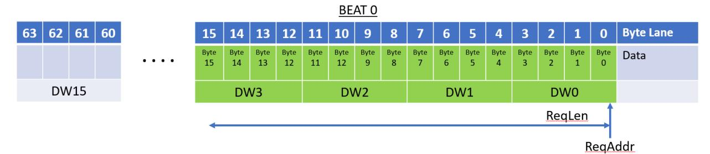

**Figure 2-12 Four DoubleWorld Read Request Not Straddling a 64-Byte Boundary**

Bytes 0 through 15 are transferred in a single beat. The ReqAttr byte enables are all 1's to transfer all bytes in the first and last beat.

The next figure illustrates another 16 byte transfer but starting at byte 56:

**Figure 2-13 Four DoubleWord Read Request Straddling a 64-byte boundary**

Unlike the previous transfer, this transfer spans a 64-byte boundary and therefore must be transferred using multiple data beats.

The next figure illustrates accessing a single byte (byte 54):

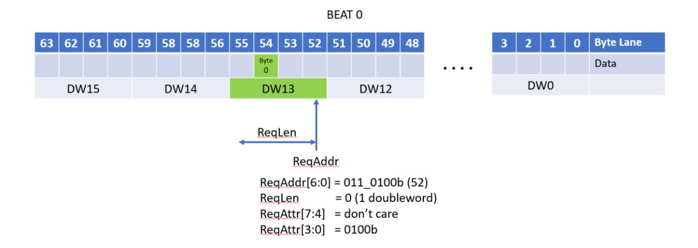

**Figure 2-14 Single Byte Read**

The ReqAddr/ReqLen fields call out a single double word (DW13 at address 52 in the data field), and ReqAttr[3:0] selects the byte (byte 54) to be accessed. ReqAttr[7:4] is ignored.

The next figure illustrates a six byte access necessitating the use of both ReqAttr[7:4] and ReqAttr[3:0]:

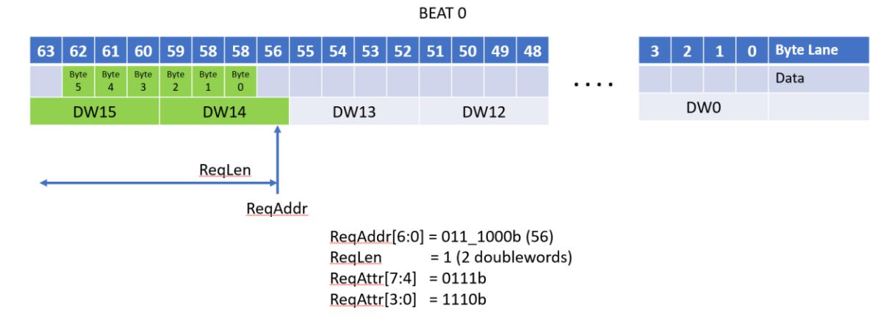

**Figure 2-15 Six Byte Read Access Not Straddling a 64-Byte Boundary**

In a two doubleword transfer, the ReqAttr[7:0] bit control the bytes within the two doublewords that are valid.

The next figure illustrates another two double word transfer, but one that spans a 64-byte boundary:

**Figure 2-16 Four Byte Read Access Straddling a 64-Byte Boundary**

Because the transfer spans a 64-byte boundary, the transfer is broken up into two data beats. The ReqAttr[7:0] field controls which bytes are valid in the two doublewords spread across the two beats.

### **Writes**

Transfers of write data occur on a 64-byte OrigData field in the Originator Data Channel. Like the RdRspData field, the byte lanes of the OrigData field are numbered 0 to 63 from the low order address to the high order address and any given byte of data in a write is transported on the byte lane of the OrigData field that matches the alignment for the byte's address. The ReqAddr/ReqLen fields are defined for Writes as they are for Reads: the address is a doubleword address (ReqAddr[1:0] are 2'b00) and the ReqLen field is the number of doublewords to be transferred minus one. As with Reads, writes can be up to a maximum of 256 bytes and may not cross a 256 byte boundary.

As with Reads, if a Write spans a 64-byte boundary or boundaries (that is not a 256 byte boundary), the transfer utilizes multiple 64 byte beats to transfer the data and each beat is transferred exactly once. The "wrapping" of write data in a beat is not permitted. The first beat of a Write (OrigDataVld asserted) must occur on the same cycle as the Request for that write (ReqVld) and the subsequent data beats (if any) must occur in consecutive cycles in ascending address order. Write data beats are labeled by the OrigDataOffset field with a value of 0, 1, 2, or 3 indicating the data beat number in ascending address order (OrigDataOffset is 0 for the beat containing the initial doubleword).

Write transfers have an additional 64-bit byte enable field – OrigDataByteEn -- that allows for individual bytes within a data beat to written or not in a write transfer. The OrigDataByteEn[0] signal indicates if byte lane 0 is to be written, OrigDataByteEn[1] indicates that byte lane 1 is to be written, and so on. For Write commands (not WriteFull commands), byte enables for byte lanes outside the region called out by ReqAddr/ReqLen must be set to 0. All other byte enables (within the region called out by ReqAddr/ReqLen) may be '0' or '1'. These other byte enables may be sparse – that is there is no requirement that the byte enables must be consecutively set nor is there a requirement that any byte enables be set.

For WriteFull commands, the transfers are restricted to starting on a 64-byte boundary, being a multiple of 64 bytes in length, and not crossing a 256-byte boundary. For these transfers, all byte enables in the beats must be set to '1'.

The follow figure shows the beat and byte lane assignments and the OrigDataByteEn values for a 16-byte write starting at address 0:

**Figure 2-17 Four Doubleword Write Request Not Straddling a 64 Byte Boundary**

The sixteen asserted byte enables starting at OrigDataByteEn[0] cause the first 16 bytes to be written.

The following figure shows a sparse write contained within one beat:

**Figure 2-18 Sixteen Doubleword Write Request Not Straddling a 64-Byte Bounday**

The various byte enables being on or off produce a sparse write. The ReqAddr/ReqLen are such that the write stays within a single beat.

The following figure shows a sparse write spread across two beats:

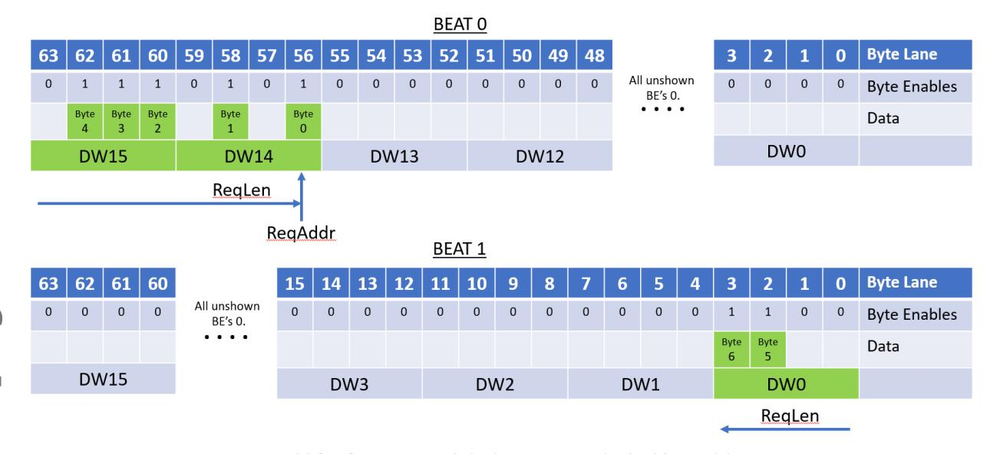

**Figure 2-19 Three Doubleword Write Request Straddling a 64 Byte Boundary**

The various byte enables being on or off produce a sparse write. The ReqAddr/ReqLen are such that the write spreads across two beats. A sparse write can spread across up to four beats.

Unshown in these figures is the case where no byte enables are asserted. In such a case, the beats are still transferred on the OrigData field, but no updates are made to memory.

The following figure shows a 128-byte WriteFull to address 0:

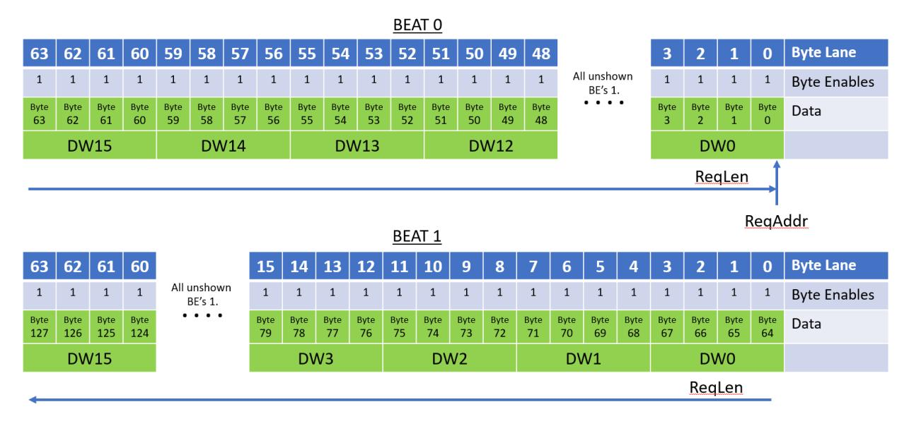

**Figure 2-20 A 128 Byte Write Full Request (Requires Two Beats)**

The WriteFull command allows the TL and PHY layers the option to compress out the byte enables. The byte enables must still appear on the UALink Protocol Level Interface.

### **Atomics**

### **Ultra Accelerator Link Consortium Inc. (UALink) - UALink\_200 Rev 1.0 Specification**

Originators issue Atomic commands to perform I/O coherent atomic (at the completer) readmodify-write operations. The AtomicR commands return the value read in the read-modify-write operation and AtomicNR commands do not return data. The semantics of the various AtomicR or AtomicNR operations are called out by the OpType sub-field in ReqAttr field and the size of the element(s) in memory (4-byte or 8-byte) that the Atomic operates on is specified by the OpSize sub-field in the ReqAttr field. The exact semantics for a given OpType field value is implementation specific as is whether the Atomic needs one operand (a single-operand atomic with one "Op1" operand) or two operands (a double-operand atomic with "Op1" and "Op2" operands).

For all Atomics, the operand data is conveyed on the OrigData bus to the completer. For an AtomicR Atomic, the returned data and Response is conveyed on the Read Response/Data Channel. For an AtomicNR command, the status Response (without any data) is conveyed on the Write Response Channel.

For all Atomics, each aligned 64-byte region of memory is divided into 16 aligned 4-byte elements for a 4-byte atomic or 8 aligned 8-byte elements for an 8-byte atomic. For single operand atomics, ReqAddr must be aligned to the size of the element operated on (4-byte or 8-byte), ReqLen must specify a length that is a multiple of the element size, and the Request may not cross a 64-byte boundary (i.e. all single operand atomics transfer their operand data in a single data beat). The operand value in each element in the OrigData field is used to perform the atomic read-modifywrite for the corresponding location in memory. Similarly, data returned for a given element by an AtomicR Request is placed in the corresponding locations in the RdRspData field.

Each 4 or 8 element in the 64 byte region of memory may be updated or not independently by setting or not setting all the byte enables for the element. All byte enables for each element must either be set to '1' or '0'. Partial byte enables within an element are not permitted. The elements that are updated may be sparse, that is there is no requirement that the elements that are updated are contiguous, nor is there a requirement that any element be updated at all. For an AtomicR Request, data for the elements read are returned in their naturally aligned positions in the RdRspData field. The data returned for an element whose byte enables were not set must be ignored by the Originator and should be driven to all '0's or all '1's by the Completer to prevent security leaks.

The following figure illustrates the byte lane allocation for the Operands and (if present) returned data for an 8-byte single-operand Atomic. The ReqAddr is offset from address '0' and two sparse elements are operated on:

**Figure 2-21 Single Operand (Eight-Byte Operands) Atomic**

The data elements, for an AtomicR, are returned in their naturally aligned byte lanes.

The following figure illustrates the byte lane allocation for the Operands and (if present) returned data for a 4-byte single-operand Atomic. The ReqAddr is at address '0' and five sparse elements are operated on:

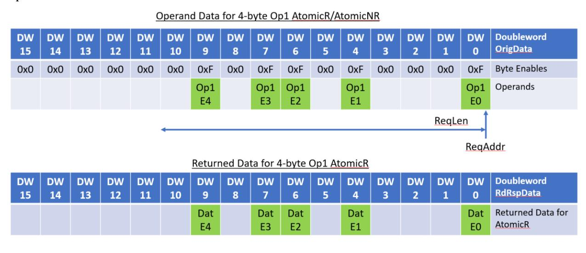

**Figure 2-22 Single Operand (Four-Byte Operands) Atomic**

The data elements, for an AtomicR, are returned in their naturally aligned byte lanes.

The handling of double-operand Atomics is different than single-operand Atomics. The ReqLen for a double-operand always specifies a 64-byte transfer (ReqLen = 15) and the ReqAddr must be aligned on a 32-byte boundary. The double-operand atomic updates the 32 bytes of memory located at the address specified by ReqAddr. The operand data for a double-operand atomic, however, is transferred in one data beat with the Op1 operand data always occurring on byte lanes

0 to 31 on the OrigData field and the Op2 operand data occurring on bytes lanes 32 to 63 on the OrigData field. The placement of the Op1 and Op2 Operand data is unaffected by ReqAddr.

The 32-byte Operand Data fields Op1 and Op2 are each broken up into 8 aligned 4-byte elements in memory for a 4-byte atomic or 4 aligned 8-byte elements for an 8-byte atomic. Corresponding Op1 and Op2 elements, by address, are utilized by the atomic to update the corresponding element in the 32-byte memory region specified by ReqAddr.

As with single-operand Atomics, byte, the OrigDataByteEn byte enables are used to determine if a given element is to be updated and the byte enables may be sparse (dis-contiguous elements may be updated and no element may updated). Similarly to single-operand Atomics, the byte enables for the Op1 and Op2 operands for each element must all be asserted, or none asserted. No partial enables within an element's operands are permitted (a consequence of this condition is that the Op1 operand data byte enables must have the same values as the Op2 operand data byte enables).

The following figure illustrates the byte lane allocation for the Operands and (if present) returned data for an 8-byte double-operand Atomic. The ReqAddr is offset from address '0x20h' and two sparse elements are operated on:

**Figure 2-23 Double Operand (Eight-Byte Operands) Atomic, Data Returned in High 32 Bytes.**

The data elements, for an AtomicR, are returned in their naturally aligned byte lanes relative to the address specified by ReqAddr.

The following figure illustrates the byte lane allocation for the Operands and (if present) returned data for a 4-byte double-operand Atomic. The ReqAddr is at address '0' and four sparse elements are operated on:

**Figure 2-24 Double Operand (Four-Byte Operands) Atomic, Data Returned in Low 32 Bytes.**

The data elements, for an AtomicR, are returned in their naturally aligned byte lanes relative to the address specified by ReqAddr.

While the examples above do not explicitly illustrate one-byte and two-byte Elements in Atomic operations, the obvious substitutions for byte enables, operands and data, and their alignments for one and two-byte elements apply.

A Completer Device that does not support a given Atomic Request returns a SLVERR Response on the appropriate Read Response Channel (for AtomicR Requests) or Write Response Channel (for AtomicNR Requests).