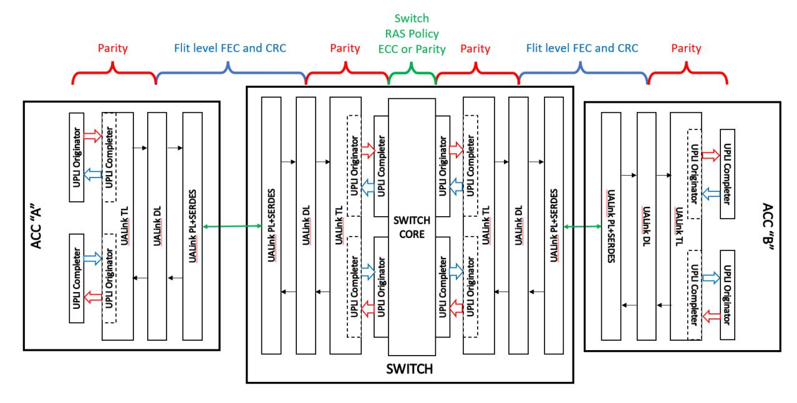
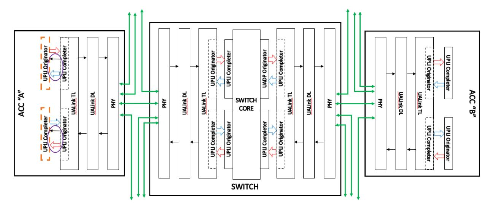
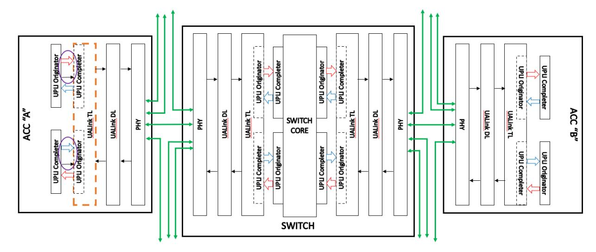
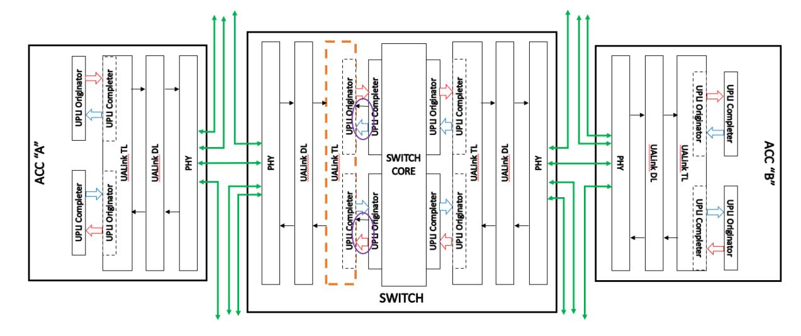
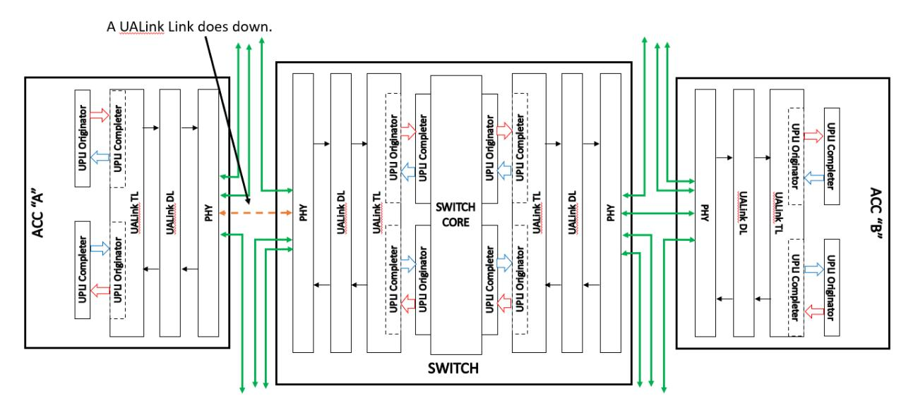
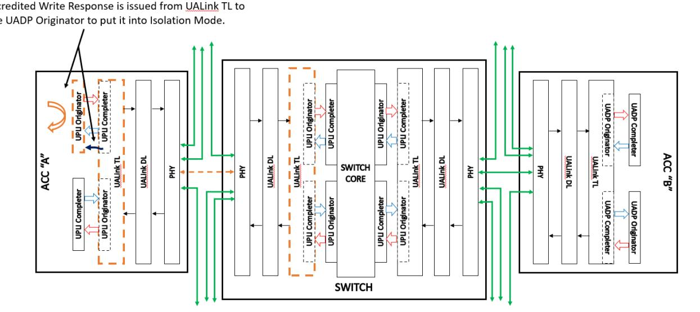
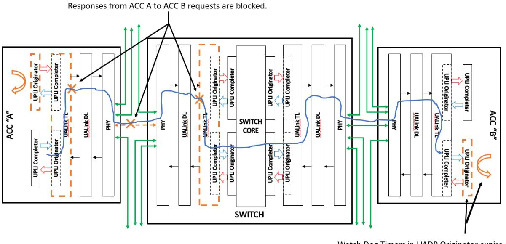
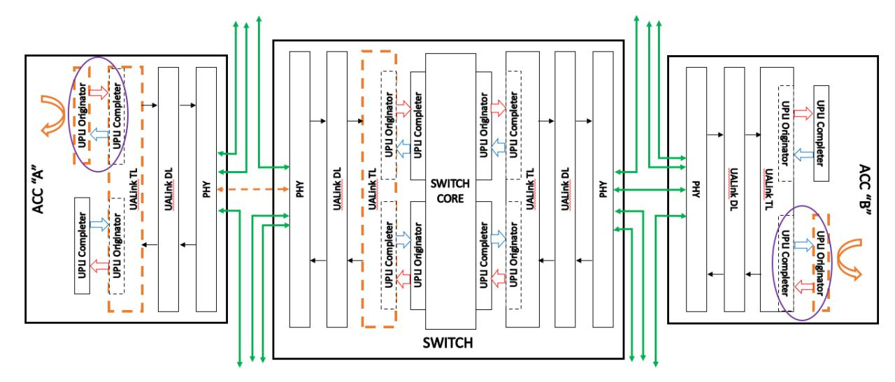

# **3 Reliability, Availability, and Serviceability (RAS)**

# **3.1 RAS Requirements**

Accelerator Pods require a robust fault management system to identify hardware failures and restore normal operations after errors with minimal disruption. This specification defines the Reliability, Availability and Serviceability requirements for Accelerators and Switches that use Ultra Accelerator Link technology.

This specification considers three broad classes of errors,

- Accelerator errors
- Link Down errors
- Switch errors.

and a set of RAS requirements and assumptions:

- A System Node is recommended as the smallest unit of allocation for a Virtual Pod. This recommendation is for simplicity, but implementations may vary. An Accelerator shall be the smallest allowable unit of allocation for a Virtual Pod.
- System Node errors (an error in one of the components in a System Node, e.g. CPU, GPU, PCIe, and other components) should not 'spread' beyond a virtual pod, however in the case where a System Node spans more than one Virtual Pod, the error may spread to all Virtual Pods associated with the System Node.
- Link Down errors shall not 'spread' beyond a Virtual Pod.
- An Accelerator attempts to handle Link Down errors and Switch errors without requiring a reboot of the associated System Node(s), Accelerator(s), or the associated Switch.
- Switches shall be stateless (i.e., Switches do not track Requests nor Responses once sent) and shall not be expected to implement any timeout detection. Accelerators shall implement timers, and timeout detection.
- Since UALink is a network that uses load-store operations (memory-semantic operations), it shall be acceptable for applications to be terminated and restarted when there is a Link Down error, a Switch error or an Accelerator error.
- UALink Data payloads shall be protected with parity or ECC and shall detect data errors that are uncorrectable. On such a detection, that data shall be marked as "poisoned".
- The UALink control path shall be protected and errors shall be isolated to a given port where required (such as Link Down errors – to avoid propagating an error outside the virtual Pod), but are otherwise handled at a coarser grain (i.e. at a given station or possibly all links on a Switch or an Accelerator).
- Component errors on a Switch Platform which may contain one or more Switches, CPU, FPGA, etc., may impact all the Switches in the Switch Platform and require a reset of the Switch Platform. However, Accelerators and other Switches in the Pod shall be able to recover/restart and continue to operate.
- The recovery process from a RAS error shall be controlled by fault management software and firmware running on BMC and host processors. Details of the fault management software may be found in the separate *Ultra Accelerator Link Manageability Specification.*

This specification attempts to simplify the hardware requirements for Switches while placing more responsibility for RAS error handling on Accelerators.

# **3.1.1 End to End Data Protection**

End to End protection of control and data buses shall be provided in UALink from a Source Accelerator to the Destination Accelerator. The protection mechanisms used by various components along this path does not need to be the same. However, an explicit overlap on the protection mechanisms at abutment points between components where the protection mechanism changes shall be required. In other words, the protection mechanism in a prior component along the path shall continue to be checked until the protection mechanism in the subsequent component is established without error on the prior component. This is conceptually shown in [Figure 3-1.](#page-1-0)

**Figure 3-1 UALink End to End Data Protection**

The UALink Protocol Level Interfaces shall be protected by even parity bits (the number of set bits in a protected group including the parity bit itself is even). Each channel within a UALink Protocol Level Interface shall have a separate set of parity signals for the individual channel. Each channel that has a \*Vld signal shall protect the \*Vld signal with a single parity bit. These parity bits shall be checked every cycle to detect extraneous or missing \*Vld assertions.

All other parity bits in the channel (not including the Credit Return Interface) shall be checked in cycles where \*Vld is asserted. For channels with data or byte enables, those fields (OrigData OrigDataByteEn, RdRspData) shall be protected with distinct parity bits to allow for the detection of data errors and poisoning of Beats by setting RdRspDataError or OrigDataError fields in the respective channels.

Each channel shall have one parity bit for the control information, except the Request Channel which shall have a separate bit for the Request address and one parity bit for the other control fields.

Each channel shall have a Credit Return Interface consisting of four \*CreditVld bits and some control fields. The \*CreditVld bits shall be protected by a single \*CreditVldParity signal that shall be checked every cycle to detect extraneous and missing \*CreditVld assertions. The control fields in the Credit Return Interface shall have a single parity bit that shall be checked in cycles that \*CreditVld is asserted.

# Evaluation Copy

### **Ultra Accelerator Link Consortium Inc. (UALink) - UALink\_200 Rev 1.0 Specification**

The DL and PHY layers shall protect DL and TL Flits through FEC (Forward Error Correction) and CRC (Cyclic Redundancy Checks). The UALink Protocol Level Interfaces shall be protected by Parity. However, within the Switch Core, a distinct Error Protection mechanism (possibly utilizing ECC) may be used. If the Switch Core error protection scheme is unable to distinguish between errors involving the data and control fields, the error shall be assumed to have occurred in a control field.

# **3.1.2 RAS Error Types**

UALink RAS errors are divided into several categories:

- 1. UPLI Control Errors
- 2. UPLI Data Errors
- 3. UPLI Protocol Errors
- 4. Switch Core Control Errors
- 5. Switch Core Data Errors
- 6. Link Down Error.

The UALink Protocol Level Interface errors (Control, Data, Protocol) shall be defined as errors that occur at the UALink Protocol Level Interfaces on the Accelerators or on the UALink Protocol Level Interfaces on a Switch. The Link Down error shall be defined as the error that occurs when a UALink Link is disconnected or takes some other failure that renders it inoperable.

A UPLI Control Error shall be defined as a parity error involving the ReqVldParity, RdRspVldParity, WrRspVldParity, or OrigDataVldParity signals (i.e. the parity check signals for the one bit \*Vld signal in each channel), a parity error involving the ReqParity, ReqAddrParity, RdRspParity, WrRspParity, or OrigDataFieldsParity signals (i.e. the parity check signals for the "control" information in each channel), a parity error involving the ReqCreditVldParity, RdRspCreditVldParity, WrRspCreditVldParity, OrigDataCreditVldParity signals (i.e. the parity check signals for the four bit \*CreditVld signals), or a parity error involving the ReqCreditParity, RdRspCreditParity, WrRspCreditParity, OrigDataCreditParity signals (i.e. the parity check signals for the "information" fields in the Credit return interface).

A UPLI Data Error shall be defined as a parity error involving the OrigDataParity, OrigDataByteEnParity, RdRspDataParity signals (i.e. the parity bits protecting the Read Response Channel data field, the Originator Data Channel data field, or the byte enables for the Originator Data Channel).

A UPLI Protocol Error shall be defined as an error where the UPLI protocol is not followed and no UPLI Interface Control or UPLI Data Error occurs. As an example, a Request Channel Beat with a ReqAddr and ReqLen field that calls for a transaction that crosses a 256-byte boundary is a UPLI Protocol Error. Many other possible UPLI Protocol Errors exist and the Switch is shall not be required to check for any given protocol error.

UPLI errors (Control/Data/Protocol) shall be checked at the receiving end of a given UPLI Channel.

A Switch Core Control error shall be defined as an error occurring on control fields in a beat or beats or an error occurring on the data fields (OrigData, RdRspData, OrigDataByteEn) when the Switch error protection mechanism cannot isolate that error to the data fields (e.g. an error on a data field where a Switch ECC protection scheme that mixes data and control fields in a way that an error in the data field is indistinguishable from an error in a control field).

A Switch Core Data error shall be defined as an error occurring on data fields that the Switch can isolate to the data fields (OrigData, RdRspData, OrigDataByteEn) in one or more Beats.

# **3.1.3 RAS Error Handling Mechanisms**

There are three primary RAS error handling mechanisms:

- 1. A TL Drop Mode implemented at the TL's on both the Switch and the Accelerator.
- 2. An Originator Drop Mode implemented at the UPLI Originators and a Completer Drop Mode implemented at the UPLI Completers in the Accelerator and UPLI Completers in the Switch that are not in the TLs.
- 3. An Isolation Mode implemented only at the UPLI Originators in the Accelerators.

Generally speaking, any Drop Mode not in the TL shall cause all traffic for all channels for all ports at the Originator or Completer to be dropped (implementations may choose to limit drop mode to the Channel with the error and/or the port with the error). Drop mode for the TL shall cause all traffic on all channels for either a given port or all ports at both the Completer and the Originator in the TL to be dropped. Whether all ports are dropped or a single port is dropped shall depend on whether the error is a Control Error (generally all ports, but an implementation may choose to only drop the affected port) or a Link Down Error (single port).

Isolation Mode shall be a distinct mechanism from Drop Mode that shall be implemented only at the UPLI Originator in the Accelerators. These UPLI Originators shall be stateful and maintain a history of all the Requests that have been issued by the Originator or that are queued to be issued. This state shall be maintained until the Request has received all Response Beats associated with the Request. Within this state, each Request shall be expected to have a Watch Dog Timer that monitors the amount of time the Request has been outstanding.

When a programmable time limit is reached, the Watch Dog Timer expires and shall cause the UPLI Originator to enter Isolation Mode. Isolation Mode shall block all outbound Request and Originator data traffic for all ports in the Originator and shall discard any inbound Response or Request traffic. In addition, the Originator shall provide "dummy" Completion Timeout Responses for all outstanding Requests. Because the "dummy" Completion Time Out Responses will quickly lead to the termination of processing on the Accelerator, there is no meaningful advantage to perform Isolation Mode to anything less than all ports in the station.

Isolation Mode and Drop Mode at the UPLI Originator on the Accelerator shall be distinct mechanisms though both modes do drop traffic. The UPLI Originator on the Accelerator can be in neither mode, either mode, or both modes.

The following actions occur in Isolation Mode:

- 1. The UPLI Originator shall stop issuing new Requests to the TL (either outstanding Requests in the UPLI Originator or newly arriving Requests at the UPLI Originator) for all ports.
- 2. The UPLI Originator shall provide "dummy" Completion Timeout Responses to all outstanding or newly arriving Requests for all ports in the Originator.
- 3. The UPLI Originator shall discard any Responses, for all ports, received from the UALink TL (the "dummy" Completion Timeout Responses replace the Responses from the Completers).
- 4. The UPLI Originator shall continue to accept returned Credits and shall return any outstanding Credits as normal.
- 5. Implementations may terminate unfinished bursts (Read Responses or Originator Data) due to entering Isolation mode.

The UPLI Originator Isolation Mode shall return a "dummy" Completion Time Out Response to any pending Originator Devices with a Request for that UPLI Originator which shall cause that Originator Device to transition to an "idle" state. This allows that Originator Device to be able to be

### **Ultra Accelerator Link Consortium Inc. (UALink) - UALink\_200 Rev 1.0 Specification**

used again once management software takes appropriate clean up actions and begins executing programs after the error, as specified in the *Ultra Accelerator Link Manageability Specification.*

In contrast to Isolation Mode, the Drop Mode implemented at a UALink TL (whether at the Switch or Accelerator) can apply to an individual port, a subset of the ports, or all the ports in the station depending on the error that invoked UALink TL Drop Mode and which UALink TL (Switch or Accelerator) the error occurred at. UALink TL Drop Mode, whether for a given port or all ports in the UALink TL, shall always apply to all channels for the port or ports affected.

For example, for a Link Down error detected on a Switch, the UALink TL is only allowed to enter UALink TL Drop Mode for the port that whose Link entered a Link Down state. This is to prevent a Link Down error from propagating to other Virtual Pods (if a single Link Down at a station on the Switch were to put all the ports on that Station into UALink TL Drop Mode, that could impact other Virtual Pods associated with the other links in the Station). More than one Link taking a Link Down error in a single station results in a subset of Links in a Station being in UALink TL Drop Mode.

If, however, instead of a Link Down, a UPLI Control error is detected at a UALink TL on the Switch, the UALink TL shall be placed in Drop Mode for all ports. This is because it is impossible, in general, to determine which port is involved in a UPLI Control Error from the signals present in the Beat that took an error: either the parity signal protecting the \*Vld is corrupt and the entire beat including port information is suspect or the \*Vld is correct, but the parity field for the other control fields took an error and the port information is again suspect (with the sole exception of the case of a parity error on the ReqAddr field which is not worth creating an exception for).

While is it conceptually possible to infer the port that took an error from the TDM phase in some cases, this technique will not work for errors on the Credit Return Interfaces that are not managed by TDM. These techniques are not prohibited, but they are not recommended because UPLI Control Errors will typically be handled at a coarser grain by the recovery management software (i.e. UPLI Control Errors on the Switch will typically be handled at at least a Station level if not by resetting the entire Switch Platform, therefore isolating the Drop Mode to a port for these errors provides no meaningful advantage).

When a TL enters into TL Drop Mode at a given port, the following actions occur:

- 1. All traffic (inbound or outbound) for that port between the TL and DL shall be dropped.
- 2. All UPLI traffic inbound to the TL -- the Read Response and Write Response Channels received at the Originator in the TL and the Request and OrigData Channels received at the Completer in the TL-- shall be dropped.
- 3. All UPLI traffic outbound from the UALink TL the Request and Originator Data Channels driven at the TL Originator and the Read Response and Write Response Channels driven at the TL Completer-- shall be dropped.
- 4. The UPLI Originator and the UPLI Completer in the TL may continue to accept returned Credits and may return any outstanding Credits as normal where possible. Certain errors that cause drop mode corrupt information necessary to return credits accurately.
- 5. Implementations may terminate outbound unfinished bursts (Read Responses or Originator Data) due to entering TL Drop mode.

If entering TL Drop Mode due to a UPLI Control Error, the TL shall ensure that corruption does not occur in the system by preventing subsequent Beats for the given channel and port from being delivered.

UPLI Originator Drop Mode and UPLI Completer Drop Mode are similar to TL Drop Mode but shall occur at UPLI Completers and Originators that are not part of a UALink TL and shall be entered as a result of a UPLI Control Error. The UPLI Originator/UPLI Completer Drop Modes can also be limited

## **Ultra Accelerator Link Consortium Inc. (UALink) - UALink\_200 Rev 1.0 Specification**

to a specific port (implementations can also choose to limit the drop mode to the specific Channel that took the error). However, as explained above, it is not possible to always determine the port that took the UPLI Control Error and therefore these drop modes are typically implemented to affect all ports associated with the Originator or Completer (in contrast, the Link Down events that cause the TL Drop Mode to be invoked for a specific port shall be limited to the specific port because the involved port can be trivially determined by which port took the error).

When a UPLI Originator or UPLI Completer not on a UALink TL enters Originator Drop Mode or Completer Drop Mode, the following actions shall occur:

- 1. All subsequent traffic Beats for the Completer or Originator for the channel and port that detected the UPLI Control Error shall be dropped (if the channel is in the middle of an incomplete burst, that burst shall be terminated).
- 2. All subsequent traffic Beats for the other channels and all other ports for the Completer or the Originator shall also be dropped (unless the implementation chooses to limit the drop mode to the port and/or channel detecting the error), however implementations are permitted to complete outstanding bursts on these channels.
- 3. The UPLI Originator or the UPLI Completer may continue to accept returned Credits and may return any outstanding Credits as normal where possible. Certain errors that cause drop mode corrupt information necessary to return credits accurately.

# **3.1.4 UALink RAS Error Handling**

The following sections provides more detailed descriptions of the error handling sequences for the various classes of UALink RAS errors. The table below provides an overview or errors and actions:

|                  |                                                                                                                                                                                                                                                                                                                                                                                                                                                                                                                                                                                                                                                                                                      | Errors and Actions                                                                                                                                                                                                                                                                                                          |                                                                                                                                                                                                                                                                                                                                                                                                                                                                                                                                                                                                                                                                                                 |
|------------------|------------------------------------------------------------------------------------------------------------------------------------------------------------------------------------------------------------------------------------------------------------------------------------------------------------------------------------------------------------------------------------------------------------------------------------------------------------------------------------------------------------------------------------------------------------------------------------------------------------------------------------------------------------------------------------------------------|-----------------------------------------------------------------------------------------------------------------------------------------------------------------------------------------------------------------------------------------------------------------------------------------------------------------------------|-------------------------------------------------------------------------------------------------------------------------------------------------------------------------------------------------------------------------------------------------------------------------------------------------------------------------------------------------------------------------------------------------------------------------------------------------------------------------------------------------------------------------------------------------------------------------------------------------------------------------------------------------------------------------------------------------|
|                  | Link Down                                                                                                                                                                                                                                                                                                                                                                                                                                                                                                                                                                                                                                                                                            | Data Error                                                                                                                                                                                                                                                                                                                  | Control & Protocol Errors                                                                                                                                                                                                                                                                                                                                                                                                                                                                                                                                                                                                                                                                       |
| Switch UALink | - The Switch shall enter Drop Mode at the affected Switch TL for the affected port only. – The TL shall drop traffic in both directions on all channels for the affected port. - The Switch shall notify firmware which will log the error. - All ports on the Station except the port attached to the dropped link shall continue to function. - Returning the Link to an active state shall not have any impact to other ports on the Station. - All UPLI channels attached to the Switch TL shall remain active and maintain their credits throughout the link going down and being returned to                                                   |                                                                                                                                                                                                                                                                                                                             | - Protocol and Control errors shall be handled similarly at the Switch. - Drop Mode shall be entered at the Completer, Originator, or TL that detected the error for all ports. - Traffic shall be dropped in both directions on all channels for the affected ports. - The Switch shall notify firmware which will log the error. - Recovery may require a full reset of the Station or possibly the full Switch to resume operation.                                                                                                                                                                                                                   |
| Switch Core   | an active state. - No action needed in the switch core. - Handled by the Switch TL, Accelerator TL, and the Accelerator Originator.                                                                                                                                                                                                                                                                                                                                                                                                                                                                                                                                                      | - The Data Error signal shall be asserted to indicate poisoned or corrupted data for the corrupted beat. - Good parity shall be generated for the Beat and the data shall be forwarded with the asserted Data Error Signal. - The Switch Core shall Notify firmware which will log the error. | - The Switch shall enter Drop Mode at the egress Originator for all ports. - The Originator shall drop traffic in both directions on all channels for the affected ports. - Log error and notify firmware. - Protocol and Control Errors detected within a switch Core may impact the entire Switch and all virtual Pods, however implementations may choose to reduce the impact, where possible, to a given Station or Stations. - The Switch shall go through a full Reset to resume operation.                                                                                                                                                 |
| Accelerator      | - The affected Accelerator TL shall enter Drop Mode for all ports in the TL (station). - Drop traffic in both directions on all channels for the affected ports. - The affected TL shall issue an ISOLATE Write Response to Originator to cause Originator to enter Isolation Mode. - The affected TL shall notify firmware which will log the error. All UPLI channels attached to the Accelerator TL shall remain active and maintain their credits throughout the link going down and being returned to an active state. - Firmware may choose to reduce the number of active Links before resuming the applications on the Accelerator. |                                                                                                                                                                                                                                                                                                                             | - Protocol and Control Errors at the Accelerator should be handled similarly. - The Originator or Completer that detected the Error shall Enter Drop Mode at the Originator or Completer. - Traffic shall be dropped in both directions on all channels for the affected ports. - The Switch shall notify firmware which will log the error. - Protocol and Control Errors are low probability event and implementations are expected to impact the entire Accelerator for these errors. However, implementations may be able to isolate and recover errors more precisely. - The level of Reset required to resume operation is |

Firmware handling for error log notifications and software interfaces for Station, Accelerator, and Switch resets are specified in the separate *Ultra Accelerator Link Manageability Specification*.

# **3.1.4.1 UPLI Data Error Processing**

A UPLI Data Error (a parity error in the OrigData, RdRspData, or OrigDataByteEn fields) is handled by setting the OrigDataError or RdRspDataError field to indicate the beat has "poisoned" data, replacing the bad parity with good parity, and letting the beat continue through the system to deliver it to the destination Originator Device (Reads) or Completer Device (Writes). Implementations may choose to implement a mode where Data Errors are treated as Control Errors.

# **3.1.4.2 UPLI Control Error Processing**

### **Accelerator UPLI Control Error processing**

The processing of a UPLI Control Error shall depend on whether the error is taken on the Accelerator or on the Switch and at what interface boundary. The next figure illustrates the processing involved in handling a UPLI Control Error that occurs on an Accelerator UALink Protocol Level Interface on an Accelerator.

**Figure 3-2 UPLI Control Error detected at an Originator or Completer not on a UALink TL on an Accelerators**

In [Figure 3-2](#page-7-0) above, the processing for a UPLI Control Error detected at a UPLI Originator or UPLI Completer in an Accelerator is shown (errors are detected on both the received Channels and the received Credit Return Interfaces). Processing these Control Errors involves dropping the bad Deat or returned Credit, placing the detecting UPLI Originator or UPLI Completer into Drop Mode for all channels for all ports (implementations can chose to limit Drop Mode to the specific channel with the error), and signaling firmware by an implementation specific means that the error has occurred. Implementations may choose, either through implementation specific hardware means or in the RAS recovery sequence in firmware to place other TLs, Originators, or Completers in this or other Stations into Drop Mode and to possibly take various links into a link down state (up to and including all Stations and links on the Accelerator). It is acceptable to place all links on an Accelerator into a link down state on a Control Error because these links can only communicate with other Accelerators in the same Virtual Pod.

**Figure 3-3 UPLI Control Error detected at a UALink TL on an Accelerator**

As shown i[n Figure 3-3](#page-8-0) above, the processing of a UPLI Control Error detected at the UALink TL (either at the Originator or Completer) on an Accelerator involves dropping the bad Beat or returned Credit, placing the TL into Drop Mode for all ports and all Channels on both UPLI interfaces (implementations can choose to apply Drop Mode to only one port) and signaling the firmware by an implementation specific means of the error. Implementations may choose, either through implementation specific hardware means or in the RAS recovery sequence in firmware, to place other TLs, Originators, or Completers in this or other Stations into Drop Mode and to possibly take various links into a link down state (up to and including all Stations and links on the Accelerator). Like Control Errors detected on the Accelerator Completers and Originators, it is acceptable to place all links on the Accelerator into a link down state because these Accelerator links can only communicate with Accelerators in the same Virtual Pod. The TL being in Drop Mode will block Responses to the UPLI Originators in the Accelerators in the Virtual Pod causing them to eventually enter Isolation Mode.

## **Switch UPLI Control Errors on the Switch UALink Protocol Level Interfaces**

**Figure 3-4 UPLI Interface Control Error detected at the UALink TL on the Switch**

As shown i[n Figure 3-4](#page-9-0) above, the processing of a UPLI Control Error detected at the UALink TL (either at the Originator or Completer) on the Switch is the same as processing the same error on the Accelerator: the bad Beat is dropped and the TL detecting the error enters Drop Mode for all channels, on all ports, for both UPLI interfaces (implementations may limit this to a port on both interfaces). Implementations may also, either through implementation specific hardware means or in the RAS recovery sequence in firmware, place other TLs, Originators, or Completers in this or other Stations in the Switch into Drop Mode, and to possibly take various links into a link down state (up to and including all Stations and links on the Switch). This is possible because this is a UPLI Control Error and not a Link Down error. For Link Down errors, only the involved port may be affected. The TL being in Drop Mode will block Responses to the UPLI Originators in the Accelerators in the Virtual Pod causing them to eventually enter Isolation Mode.

**Figure 3-5 UPLI Control Error detected at the UPLI Completer on a Switch**

[Figure 3-5](#page-9-1) above illustrates the processing for a UPLI Control Error detected at the UPLI Completer or UPLI Originator at the Switch Core (errors are detected on both the received Channels and the received Credit Return Interfaces). The processing involves dropping the bad Beat or returned

### **Ultra Accelerator Link Consortium Inc. (UALink) - UALink\_200 Rev 1.0 Specification**

Credit, placing the detecting UPLI Completer or UPLI Originator into Drop Mode for all ports (implementations can choose to limit Drop Mode to the specific channel with the error), and signaling firmware by an implementation specific means that the error has occurred. Implementations may choose, either through implementation specific hardware means or in the RAS recovery sequence in firmware to place other TLs, Originators, or Completers in this or other Stations into Drop Mode and to possibly take various links into a link down state (up to and including all Stations and links on the Switch). It is acceptable to place all links on a Switch into a link down state on a Control Error because the Switch is treated as a single point of failure for these errors.

# **Switch UPLI Control Errors within the Switch Core**

**Figure 3-6 UPLI Control Error detected within the Switch Core at the UPLI Originator**

As shown i[n Figure 3-6](#page-10-0) above, the processing for a UALink Interface Control Error detected at Switch egress at the UPLI Originator drops the bad Beat, causes the UPLI Originator to enter Drop Mode for at least the channel on which the error was detected, and signals firmware by an implementation specific means.

# **3.1.4.3 Link Down Error Processing**

The following section describes the sequencing to process a Link Down Error. In UALink, a Link Down Error is intended to be recoverable without resetting the Accelerator or Switch and shall not impact Virtual Pods not utilizing the affected Link.

The various applications running on the Accelerator shall be terminated (as UALink is a load/store architecture, application termination on a Link Down Error is unavoidable), rolled back to a checkpoint, and restarted.

The sequencing for a Link Down Error is described below:

**Figure 3-7 UALink Link goes down**

As shown i[n Figure 3-7](#page-11-0) above, the process begins with a UALink Link going down.

**Figure 3-8 PHYs Inform UALink TLs in Accelerator and Switch Which Enter Drop Mode**

As shown i[n Figure 3-8](#page-11-1) above, the PHYs at both ends of the down UALink Link shall determine the link is down and communicate to the two UALink TLs indicating which port has gone into a Link Down state.

The UALink TL in the Accelerator shall go in Drop Mode for all ports. The UPLI Originator will be going into Isolation Mode in the next step, and therefore it is not useful in this case to enter Drop Mode in the UALink TL on the Accelerator only for the port associated with the dropped link.

On the Switch, however, the UALink TL shall go into Drop Mode only for the affected port. Going into Drop Mode for any other ports could impact Accelerators not in the Virtual Pods which shall not be permitted for a Link Down Error.

**Figure 3-9 Placing the Accelerator UPLI Originator Into Isolation Mode**

As shown above in [Figure 3-9,](#page-12-0) the UALink TL shall issue a credited Write Response of "Isolate" to the UPLI Originator which shall cause the UPLI Originator to enter Isolation Mode. This shall prevent the Accelerator from creating new traffic for the dropped link (an all links in the Station).

**Figure 3-10 Other Accelerators Time Out**

As shown i[n Figure 3-10](#page-12-1) above, once the Accelerator UPLI Originator is in Isolation Mode, the Accelerator UALink TL is in Drop Mode, the link is down, and the UALink TL on the Switch is in Drop Mode for the affected ports, Responses from Accelerator A to Accelerator B's Requests may be blocked. This shall cause the Watch Dog Timers in Accelerator B's UPLI Originator(s) to time out and enter Isolation Mode.

**Figure 3-11 Link Down Error Processing Complete**

The final state of the system for a Link Down Error is shown above i[n Figure 3-11.](#page-13-0) The UPLI Originators in both Accelerators shall be in a "safe" state (both in Isolation Mode) and no new traffic shall be generated by these Accelerators (including the other Accelerators in the Virtual Pod, not shown in the figure, that have also timed out). At this point, system management software can gain control of the Accelerators and recover the system, and redispatch applications on the Accelerators. The relevant interfaces for system management software are documented in the separate *Ultra Accelerator Link Manageability Specification.*