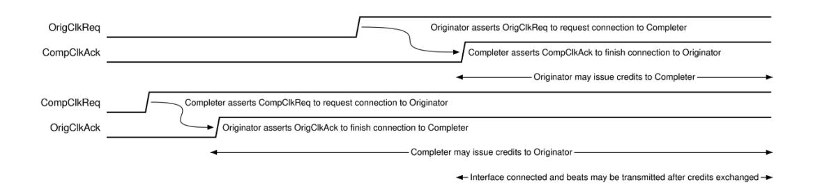
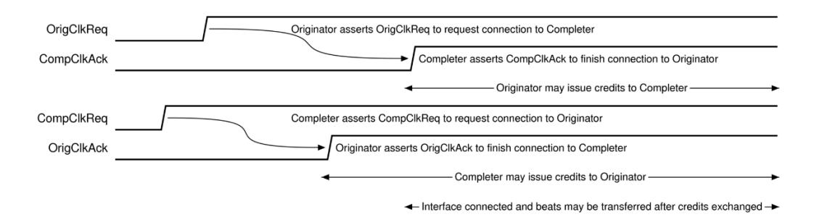

# **4 UPLI Interface Reset, Signaling, and Connection**

#### **4.1 UPLI Interface Reset**

**Figure 4-1 UPLI Interface Reset Requirements.**

The system reset signal UPLIReset\_N shall be a negative-active signal that shall be used to initialize the interface logic. No state information shall be retained across a reset event (an assertion followed by a de-assertion of UPLIReset\_N). Any established Credits shall be reset and any outstanding transactions shall be terminated and shall not receive a Response.

The assertion (negative-going edge) of UPLIReset\_N and the de-assertion (rising edge) of UPLIReset\_N shall be synchronous to the clock: UPLIClk. When the UPLIReset\_N signal is first asserted, the \*Vld, \*CreditVLD and interface control signals \*ClkReq and \*ClkAck signals shall transition to their inactive values in an implementation specific number of cycles which may vary for each signal, but shall be before the UPLIReset\_N signal is de-asserted. The UPLIReset\_N signal shall remain asserted for an implementation specific minimum interval to allow the interface to reset and the valid signals and interface connection signals to transition to their de-asserted values before UPLIReset\_N is de-asserted.

Any attempt to reconnect the interface by asserting either of the \*ClkReq signals (described below) shall not occur until at least one cycle after the de-assertion of UPLIReset\_N signal as shown in Figure 4-1 [UPLI Interface Reset Requirements.](#page-0-0)

### **4.2 UPLI Interface Signaling Requirements**

When the Source Originator or Completer has not asserted its \*Vld signal for a given channel, all of the command and data information on that channel is not valid and shall be ignored. For example, there is no requirement that ReqCmd has a valid encoding when ReqVld is de-asserted or that the parity signals on the OrigData or RdRsp Channels are consistent with the data on those channels when OrigDatVld or RdRspVld, respectively, is de-asserted. The validity of the \*CreditVld signals and associated Credit management signals (driven from the receiver Completer or Originator side of the UPLI interface) shall not be impacted by the \*Vld signal.

All signals on the UPLI interface shall be synchronous to a common clock (UPLIClk) supplied by system pervasive logic. Source logic switching and signal propagation times shall be expected to be such that there is sufficient time margin to the next rising clock edge to allow simple combinatorial logic on the receiving side of the interface.

## **4.3 UPLI Interface Control**

A UALink Protocol Level Interface shall provide signals that allow the interface to be connected (brought into an active state), either at power up or after a reset of the interface, in an ordered sequence (the Connection Handshake Protocol) that eliminates race conditions that might corrupt the transfer of information across the interface. The Connection Handshake Protocol may be orchestrated by state machines on both sides of the interface or coordinated directly by SOC-level logic and/or management firmware. Both the Originator and Completer shall be powered and actively clocked for the Connection Handshake Protocol to proceed.

In the following diagrams and discussion, "Originator" shall refer to the Originator for the UALink Protocol Level Interface and "Completer" shall refer to the Completer for the UALink Protocol Level Interface. The interface control signals used in the Connection Handshake Protocol shall be the OrigClkReq, OrigClkAck, CompClkReq, and CompClkAck signals.

An Originator shall use the OrigClkReq signal to request the connection of the Originator to Completer Channels and Credit Return Interfaces (the Request Channel, Originator Data Channel, Read Response/Data Credit Return Interface, and Write Response Credit Return Interface). The Completer shall respond with the CompClkAck signal to acknowledge the Originator's request and indicate the Completer's ability to accept information on those Channels and Credit Return Interfaces. Once the Originator is connected to the Completer, the Originator may transfer Credits to the Completer, but the Completer shall not send Beats to the Originator until the Completer to Originator connection is also completed. Finally, the Originator shall not send Beats to the Completer until the Originator has Credits to do so. The Completer to Originator connection shall be completed before the Credits from the Completer can be transferred to the Originator.

The Completer shall use the CompClkReq signal to request the connection of the Completer to Originator Channels and Credit Return Interfaces (the Read Response/Data Channel, Write Response Channel, Request Credit Return Interface, Originator Data Credit Return Interface). The Originator shall respond with the OrigClkAck signal to acknowledge the Completer's request and indicate the Originator's ability to accept information on those Channels and Credit Return Interfaces. Once the Completer is connected to the Originator, the Completer may transfer Credits to the Originator, but the Originator may not send Beats to the Completer until the Originator to Completer connection is also completed. Finally, the Completer shall not send Beats to the Originator until the Completer has Credits to do so. The Originator to Completer connection shall be completed before the Credits from the Originator can be transferred to the Completer.

In order to transfer Beats, the Originator shall be connected to the Completer and the Completer shall be connected to the Originator (and appropriate Credits transferred) implying all four interface control signals: \*ClkReq and \*ClkAck shall be asserted before Beats can be transferred across the interface.

Either the Completer or the Originator may hold off the completion of the connection by delaying its \*ClkAck response or deferring its assertion of \*ClkReq. Prior to asserting \*ClkAck the acknowledging Completer or Originator shall be prepared to latch valid information presented by the requesting agent on any of the requesting agent's outbound channels. Once an Originator or Completer asserts any of \*ClkReq or \*ClkAck, it shall not de-assert that signal until UPLIReset\_N is asserted. The Completer may wait for the Originator to establish the connection first, or both sides may independently connect. It shall not be legal for the Originator to wait for a Completer to establish the connection first.

#### **Ultra Accelerator Link Consortium Inc. (UALink) - UALink\_200 Rev 1.0 Specification**

The following figures show the UPLI Connection Handshake Protocol with the Originator connecting first [\(Figure 4-2\)](#page-3-0), the Completer connecting first [\(Figure 4-3\)](#page-3-1), and finally, both Originator and Completer connecting concurrently [\(Figure 4-4\)](#page-3-2).

**Figure 4-2 UPLI Connection Handshake Protocol – Originator connects first**

**Figure 4-3 UPLI Connection Handshake Protocol – Completer connects first**

**Figure 4-4 UPLI Connection Handshake Protocol – Originator and Completer connecting concurrently**