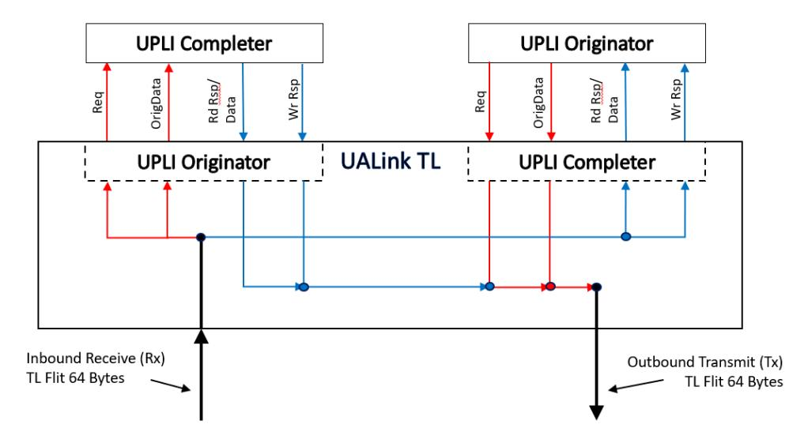
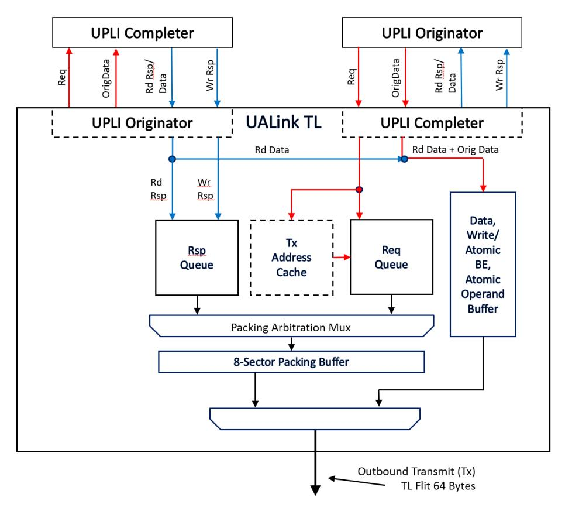
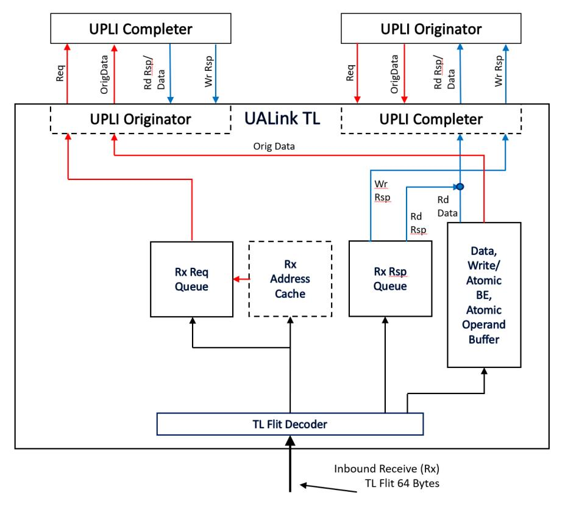
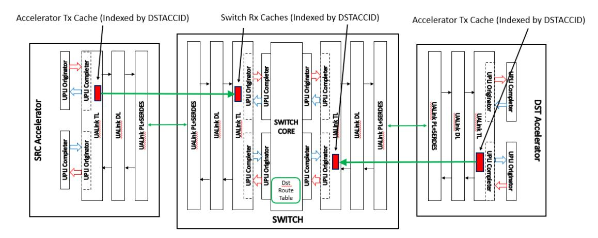
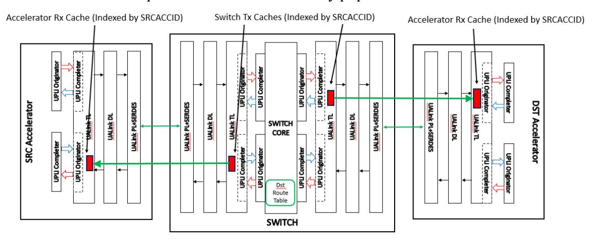
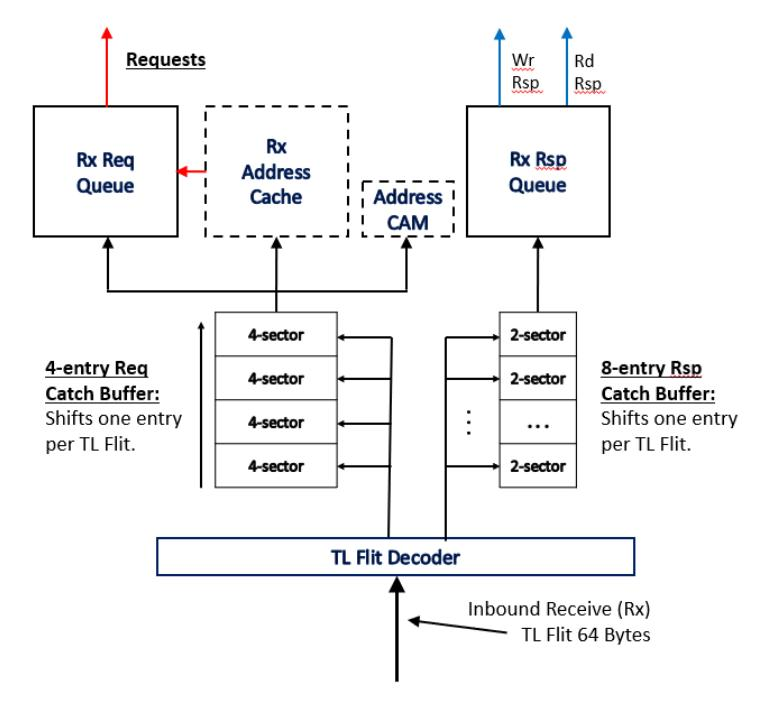
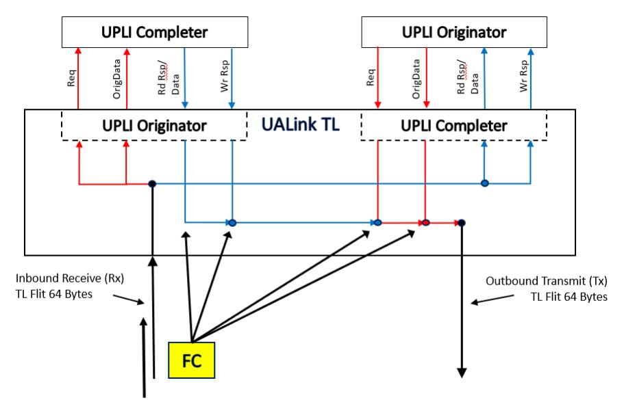

# **5 Transaction Layer (TL)**

The UALink Transaction Layer (TL Layer) is responsible for converting UPLI beats from the inbound (to the TL) channels from the two UPLI interfaces connected to the UALink TL into TL Flits on the outbound or Transmit (Tx) TL Flit Channel. The TL also converts TL Flits received from the inbound or Receive (Rx) TL Flit Channel into UPLI beats for the outbound (from the TL) UPLI channels on the two UPLI interfaces connected to the UALink TL.

**Figure 5-1: TL Flit connections to UPLI interfaces**

The figure above[, TL Flit connections to UPLI interfaces,](#page-0-0) schematically illustrates the connections between the various channels for the two UPLI interfaces attached to a UALink TL and their relationship to the Tx and Rx TL Flit Channels. Because of the symmetry of the interfaces, the format for both the Receive and Transmit Flits are the same. The 64-byte Transmit Flit and Receive Flit Channels each encode the information for a UPLI Request Channel, Originator Data Channel, Read Response/Data Channel, and Write Response Channel.

## **5.1 TL Flit and Half Flit formats**

### **5.1.1 TL Flit and TL Control and Data Half-Flit formats and Sequencing**

Each 64-byte TL Flit is divided into an Upper and a Lower 32-byte Half-Flit and the 64-byte TL Flit is also divided into sixteen 4-byte Sectors numbered from the least-significant 4-byte sector in the TL Flit as shown below in [Table 5-1: TL Flit organization:](#page-1-0)

|                                          |    |    |    |    |    |   |   | 64-byte TL Flit |   |   |   |   |   |   |   |
|------------------------------------------|----|----|----|----|----|---|---|-----------------|---|---|---|---|---|---|---|
| Upper TL Half-Flit Lower TL Half-Flit |    |    |    |    |    |   |   |                 |   |   |   |   |   |   |   |
| 15                                       | 14 | 13 | 12 | 11 | 10 | 9 | 8 | 7               | 6 | 5 | 4 | 3 | 2 | 1 | 0 |

#### **Table 5-1: TL Flit organization**

A TL Half-Flit may be a Control Half-Flit, a Data Half-Flit, a Message Half-Flit, or an Authentication Tags (AuthTags) Half-Flit.

The Control Half-Flit shall be used to encode the following information:

- Requests (Reads, Writes, AtomicR, AtomicNR)
- Read Responses (but not the data associated with them note that an AtomicR Request causes a Read Response)
- Write Responses (Note that an AtomicNR Request causes a Write Response).
- Flow Control/NOP information.

In the Control Half-Flit, Requests can be encoded in 4 or 2 sector fields, the Responses can be encoded in 2 or 1 sector Fields, and the Flow Control (FC) information and the NOP indications are each encoded using one sector. A special control Half-Flit called the NOP Half Flit consists of eight NOP indications. The alignment of Control Half-Flit fields shall be according to the table below:

| Field Type                   | Legal Sector Footprint               |
|------------------------------|--------------------------------------|
| 4 sector Request             | 7654 or 3210                         |
| 2 sector Compressed Request  | 76 or 54 or 32 or 10                 |
| 2 sector Response            | 76 or 54 or 32 or 10                 |
| 1 sector Compressed Response | 7 or 6 or 5 or 4 or 3 or 2 or 1 or 0 |
| Flow Control/NOP Information | 7 or 6 or 5 or 4 or 3 or 2 or 1 or 0 |

**Table 5-2: Control Half Flit Field Footprints and Sizes**

Within the Control Half-Flit, the various field types, subject to the footprints and sizes indicated above, may be freely intermingled. Any unused sector in the Control Half-Flit shall be a NOP field.

The Flow Control Field shall consist of four multi-bit signals:

- Request CMD: indicates Credits for Requests in TL Control Half-Flits.
- Response CMD: indicates Credits for Read Responses (not the associated data) or Writes Responses.
- Request Data: indicates Credits for 64-byte data buffers to hold data for TL Requests for Write, WriteFull, AtomicR/AtomicNR Operand Data, and UPLI Write Message UPLI Requests.
- Response Data: indicates Credits for 64-byte data buffers to hold data for TL Read Reponses.

Each of these signals independently indicates a number of credits being returned and furthermore each signal independently indicates if the credits are Pool Credits or Credits associated with a specific Virtual Channel. While a Control Half-Flit may contain more than one Flow Control (FC) Field, only one Flow Control Field in the Control Half-Flit shall contain a non-zero number of Credits value for any Virtual Channel or Pool Credits for each of the above signals. This is intended to allow the logic updating credit values to logically OR the Credit count values in the various signals from all the FC sectors together when forming an update value for a specific Pool or Virtual Channel Credit type rather than having to logically ADD the differing count values together.

A Data Half-Flit is used to encode the following information:

• Read Response Data (Read and AtomicR operations)

- Write Data (Write, WriteFull, UPLI Write Message, and AtomicNR operations)
- Byte Enables (Write and AtomicR/AtomicNR operations).
- Atomic Operand Data (AtomicR and AtomicNR operations),

A series of 32-byte Data Half-Flits shall be used to encode the data for a Read Response or a Write Request. Read Response Data and Write Data on the UPLI interface are 1, 2, 3 or 4 64-byte beats (64, 128, 196, 256 bytes in total) which are transferred in 2, 4, 6, or 8 32-byte TL Data Half-Flits that convey data in the same order as the UPLI beats, respectively, as shown in the examples below. For Write and Vendor Defined Commands that issue data beats on the UPLI OrigData Channel, a 32 byte Write Data Half-Flit containing the Byte Enables shall be appended to the end of the Data Half-Flits for the Request. For WriteFulls, no such Data Half-Flit shall be appended. A full 32-byte Half-Flit, capable of transferring byte enables for up to 256-byte transfers, shall be used regardless of the data transfer width. No effort is made to optimize the Byte Enable overhead for Writes or Vendor Defined Commands. WriteFulls, that do not require Byte Enables, are the overwhelmingly common use case.

Atomic Operands and Byte Enables for both AtomicR and AtomicNR operations are transferred on the UPLI interface in a single 64-byte data beat on the UPLI OrigData Channel which shall then be encoded into three consecutive 32-byte TL Data Half-Flits. The first two 32-byte TL Data Half-Flits shall be the Operand Data and the third TL Data Half Flit shall contain the Byte Enables for the Atomic. The Operands for an Atomic shall be aligned in the two 32-byte TL Data Half-Flits in the same manner as the Operand Data is aligned on the UPLI OrigData Channel. The Byte Enables shall be aligned within the 32-byte Half-Flit according to the bytes within the 256-byte memory block that the Atomic is altering (e.g. the byte enables for a 64-byte Atomic at address 128 would occupy bytes 16 through 23 in the Data Half-Flit). The Read Response Data for an AtomicR shall be transferred as two ascending 32-byte TL Data Half-Flits for both OP1 and OP1/OP2 AtomicR operations.

An Authentication Tags (AuthTags) Half-Flit shall be used to convey up to four 8-byte Authentication Tags, one for each of the, up to total of four, Requests, Read Responses, or Write Responses in a Control Half-Flit when the TL channel is operating in a security mode that enables Authentication or Encryption. When an Authentication Tag is unused in an AuthTags Half-Flit it shall be set to a value of zero. See the Security Section for details on how Authentication and/or Encryption is enabled and how Authentication Tags are generated. A given TL Channel shall either have Authentication enabled for all the traffic within the TL Channel or none of the traffic in the TL Channel.

The determination of whether a given Half Flit is a Control Half-Flit, a Data Half-Flit, or an AuthTags Half-Flit is not indicated within the Half-Flit itself but instead shall be inferred from the sequencing of the Half-Flits on the interface.

In the mode where Authentication is disabled, the first Half-Flit (in the Lower TL Half-Flit) shall be interpreted as a Control Half-Flit. If this Control Half Flit calls for Data Half-Flits (contains a Read Response Field, Write Request Field, UPLI Write Message, Vendor Defined Command that issues data beats on the UPLI OrigData Channel or AtomicR/AtomicNR Request Field: these will be referred to hereafter as "Data Request Fields"), the subsequent Half-Flits shall be interpreted as Data Half-Flits until the appropriate number of Half-Flits have occurred to satisfy the Data Request Fields in the Control Half-Flit (unless the final Data Half-Flit called for occurs in the lower Half-Flit). The order of the data Half-Flits shall correspond to the order for the Data Request Fields in the Control Half-Flit starting with the low order (lowest numbered sector) Data Request Field and then following though the remaining Data Request Field(s) in ascending order.

If the final Data Half-Flit implied by a Control Half-Flit would occur in a lower Half-Flit in the TL Flit, that final Data Half-Flit shall be "swapped" into the upper Half-Flit in the TL Flit and the lower Half-Flit shall be interpreted as the next Control Half-Flit. This "swapping" causes the non-NOP Control Half-Flit, if present, to always be in the lower Half-Flit of the overall TL Flit.

More generally, a TL Flit may only contain one non-NOP Control Half-Flit and that non-NOP Control Half-Flit shall be in the lower TL Half-Flit. Therefore, if the lower Half-Flit of a TL Flit is a non-NOP Control Half-Flit that does not imply subsequent Data Half-Flits, the upper Flit shall be a NOP Control Half-Flit (when Authentication is disabled). When a NOP Control Half-Flit is required by the TL protocol, as in this case, the NOP Half-Flit is referred to as a MANDATORY NOP Half-Flit. These restrictions on the number and placement of non-NOP Control Half-Flits significantly reduce complexity in the decoder logic and the catch buffer logic (described below in [5.7\)](#page-24-0).

If Authentication is enabled, the TL Half-Flit immediately following a TL Control Half-Flit that contains Requests or Responses shall be an AuthTags Half-Flit containing the Authentication Tags for the Requests and Responses in the TL Control Half-Flit. The Control Half-Flit and its corresponding AuthTag Half-Flit shall always occur in the same TL Flit.

However, in Authentication mode if the final Data Half-Flit implied by the most recent Control Half-Flit is swapped into the upper Half-Flit as described above, the Control Half-Flit in the lower Half-Flit shall only contain Flow Control or NOPs Fields. The upper Half-Flit of this "swapped" Flit is already occupied by the trailing Data Half-Flit and therefore the AuthTags Flit cannot be put there. Any pending Requests or Responses may be placed in the Control Half-Flit in the next (or a subsequent) TL Flit.

Because an AuthTags Half-Flit cannot contain more than four Authentication Tags, in Authentication mode, the non-NOP Control Half-Flit shall be limited to having a total of at most four Requests, Read Responses, and/or Write Responses.

The order of the Authentication Tags in the AuthTags Half-Flit shall follow the order of the Requests and Responses in the control Half-Flit. That is, the low-order AuthTag corresponds to the lowerorder Request or Response and so on through the Control Half-Flit and AuthTags Half-Flit. If any Authorization Tags in the AuthTags Half-Flit are not used, they shall be set to zero.

#### **5.1.2 TL Message Flit Format and Sequencing**

In addition to the two 32-byte Half-Flits in a TL Flit, a one-bit Message Indicator shall be included for each of the two Half-Flits as shown below (M1 for the Upper TL Half-Flit and M0 for the Lower TL Half-Flit):

|     |                                                                  |    |    |    |    |    |   |   | 64-byte TL Flit |   |   |   |   |   |   |   |   |
|-----|------------------------------------------------------------------|----|----|----|----|----|---|---|-----------------|---|---|---|---|---|---|---|---|
| Msg | Upper TL Half-Flit 32bytes Msg Lower TL Half-Flit 32 bytes |    |    |    |    |    |   |   |                 |   |   |   |   |   |   |   |   |
| M1  | 15                                                               | 14 | 13 | 12 | 11 | 10 | 9 | 8 | M0              | 7 | 6 | 5 | 4 | 3 | 2 | 1 | 0 |

#### **Table 5-3: TL Flit with Message Indicator Bits**

When the Message Indicator is b'1', a TL Half-Flit is interpreted as a Message TL Half-Flit as shown below in [Table 5-4: Message TL Half-Flit:](#page-4-0)

| Msg                                | 32-byte TL Half-Flit             |                       |
|------------------------------------|----------------------------------|-----------------------|
| Msg Indicator Bit (M1/M0) | 31-byte Message Specific Payload | 1-byte Msg Type |

**Table 5-4: Message TL Half-Flit**

If the Msg Indication Bit is set to b'1', the low order byte (not sector) of the 32-byte TL Half-Flit shall be interpreted as a Msg Type indication allowing for 256 distinct message types. The remaining 31 bytes in the TL Half Flit are the Message Specific Payload.

When a TL Message Half-Flit occurs in the stream of TL Flits the sequencing of the Half-Flits shall be delayed for any inserted TL Message Half-Flits with two exceptions.

The first exception is when an implementation chooses to have a TL Message Flit in the Lower Half-Flit of the TL Flit that would have otherwise been a Control Half-Flit. In this case, the Control Half-Flit that would otherwise have been in that lower Half-Flit cannot be delayed into the upper Half-Flit. The Upper Half-Flit will either be another TL Message Flit, a MANDATORY NOP TL Half-Flit, or be the final Data-Half Flit from the immediately preceding Control Half-Flit that implied Data Half-Flits that is being swapped into the upper Half-Flit.

The second exception is a "Data Poisoned" TL Message Half-Flit that is used to indicate corrupt Data Half-Flits. As explained below in [5.3,](#page-9-0) rather than delaying the TL Half-Flits, the Data Poisoned TL Message Half-Flit instead indicates the poisoned Half-Flit by replacing the Data Half-Flit that is corrupted. Data Poisoned TL Message Half-Flit's are only legal in TL Half-Flits that would otherwise have been Data Half-Flits delivering data or Atomic Operands (but not Byte Enables).

When Authentication is enabled, a TL Message Half-Flit shall not replace an AuthTags TL Half-Flit.

# **5.2 TL Flit Sequencing and Packing Examples**

In the Flit Sequence examples shown below, the examples are constructed in a way that the lower TL Half Flit in the TL Flit immediately after the last illustrated TL Flit will be interpreted as a Control Half-Flit (i.e. the examples stop when the next Control Half-Flit would occur).

The following example, [Table 5-5,](#page-5-0) illustrates a single 4-sector Read Request Followed by the Mandatory NOP Half Flit (a Control Half-Flit that consists of only NOPs and is required to be present in the given TL Half-Flit for protocol reasons, as opposed to a Control Half-Flit that also consists only of NOPs, but could have contained Requests, Responses, or Flow Control Fields).

#### **Ultra Accelerator Link Consortium Inc. (UALink) - UALink\_200 Rev 1.0 Specification**

|      |                                                                     |                    |  |               |  |  |  | 64-byte TL Flit |  |  |                    |  |     |     |     |     |
|------|---------------------------------------------------------------------|--------------------|--|---------------|--|--|--|-----------------|--|--|--------------------|--|-----|-----|-----|-----|
|      |                                                                     | Upper TL Half-Flit |  |               |  |  |  |                 |  |  | Lower TL Half-Flit |  |     |     |     |     |
|      | 15 14 13 12 11 10 9 8 7 6 5 4 3 |                    |  |               |  |  |  |                 |  |  |                    |  |     |     | 1   | 0   |
| Flit |                                                                     |                    |  |               |  |  |  |                 |  |  |                    |  |     |     |     |     |
| 0    |                                                                     |                    |  | MANDATORY NOP |  |  |  |                 |  |  | Req0 (Read)        |  | NOP | NOP | NOP | NOP |

**Table 5-5: An 8-sector Request (Read) followed by a Mandatory NOP Half Flit.**

The following example, [Table 5-6,](#page-5-1) illustrates a 4-sector 256-byte WriteFull request. As a WriteFull Request, no byte enables need to be appended to the Data Half-Flits. The last Data Half-Flit is swapped to the upper TL Half-Flit and the next Control Half Flit is placed in the lower TL Half-Flit of the final TL Flit. The Control Half-Flit is shown (arbitrarily) containing a Flow Control (FC) indicator in sector 3.

|      |    |                    |    |             |    |    |   | 64-byte TL Flit |     |     |                    |             |     |     |     |     |
|------|----|--------------------|----|-------------|----|----|---|-----------------|-----|-----|--------------------|-------------|-----|-----|-----|-----|
|      |    | Upper TL Half-Flit |    |             |    |    |   |                 |     |     | Lower TL Half-Flit |             |     |     |     |     |
|      | 15 | 14                 | 13 | 12          | 11 | 10 | 9 | 8               | 7   | 6   | 5                  | 4           | 3   | 2   | 1   | 0   |
| Flit |    |                    |    |             |    |    |   |                 |     |     |                    |             |     |     |     |     |
| 0    |    |                    |    | Req0.Data.0 |    |    |   |                 |     |     | Req0 (WriteFull)   |             | NOP | NOP | NOP | NOP |
| 1    |    |                    |    | Req0.Data.2 |    |    |   |                 |     |     |                    | Req0.Data.1 |     |     |     |     |
| 2    |    |                    |    | Req0.Data.4 |    |    |   |                 |     |     |                    | Req0.Data.3 |     |     |     |     |
| 3    |    |                    |    | Req0.Data.6 |    |    |   |                 |     |     |                    | Req0.Data.5 |     |     |     |     |
| 4    |    |                    |    | Req0.Data.7 |    |    |   |                 | NOP | NOP | NOP                | NO          | FC  | NOP | NOP | NOP |

**Table 5-6: A 4 sector Request (WriteFull 256 bytes) followed by a Control Half Flit with Flow Control.**

The following example, [Table 5-7,](#page-6-0) illustrates a 4-sector 192-byte Write request. As a Write Request, a byte enable Data Half-Flit is appended to the end of the Data Half-Flits conveying the data for the Write.

|      |    |                    |    |                  |             |    |   | 64-byte TL Flit |     |     |                    |             |   |   |             |   |
|------|----|--------------------|----|------------------|-------------|----|---|-----------------|-----|-----|--------------------|-------------|---|---|-------------|---|
|      |    | Upper TL Half-Flit |    |                  |             |    |   |                 |     |     | Lower TL Half-Flit |             |   |   |             |   |
|      | 15 | 14                 | 13 | 12               | 11          | 10 | 9 | 8               | 7   | 6   | 5                  | 4           | 3 | 2 | 1           | 0 |
| Flit |    |                    |    |                  |             |    |   |                 |     |     |                    |             |   |   |             |   |
| 0    |    |                    |    |                  | Req0.Data.0 |    |   |                 | NOP | NOP | NOP                | NOP         |   |   | Req0(Write) |   |
| 1    |    |                    |    |                  | Req0.Data.2 |    |   |                 |     |     |                    | Req0.Data.1 |   |   |             |   |
| 2    |    |                    |    |                  | Req0.Data.4 |    |   |                 |     |     |                    | Req0.Data.3 |   |   |             |   |
| 3    |    |                    |    | Req0.ByteEnables |             |    |   |                 |     |     |                    | Req0.Data.5 |   |   |             |   |

**Table 5-7: A 4 sector Request (Write 192 bytes) followed by a Control Half Flit with Flow Control**

The following example, [Table 5-8,](#page-6-1) illustrates a 2-sector 64-byte Write request (Req0) which will require byte enables, a NOP (sector 2), a Flow Control (FC) indication (sector 3), and finally a 4 sector AtomicR request. The first two Half-Flits control the Req0 data, followed by the Byte Enables for Req0. The next Half-Flits contain the Operands for the Req1 Atomic. The Byte Enables for the Req1 Atomic are swapped into the upper TL Half-Flit and the Control Half-Flit in the lower TL Half Flit illustrates multiple Flow Control Fields in a single Control Half-Flit.

|      |    |                    |    |                        |             |    |   | 64-byte TL Flit |     |                    |    |                       |    |     |     |      |
|------|----|--------------------|----|------------------------|-------------|----|---|-----------------|-----|--------------------|----|-----------------------|----|-----|-----|------|
|      |    | Upper TL Half-Flit |    |                        |             |    |   |                 |     | Lower TL Half-Flit |    |                       |    |     |     |      |
|      | 15 | 14                 | 13 | 12                     | 11          | 10 | 9 | 8               | 7   | 6                  | 5  | 4                     | 3  | 2   | 1   | 0    |
| Flit |    |                    |    |                        |             |    |   |                 |     |                    |    |                       |    |     |     |      |
| 0    |    |                    |    |                        | Req0.Data.0 |    |   |                 |     | Req1 (AtomicR)     |    |                       | FC | NOP |     | Req0 |
| 1    |    |                    |    | Req0.ByteEnables       |             |    |   |                 |     |                    |    | Req0.Data.1           |    |     |     |      |
| 2    |    |                    |    | Req1.AtomicOperands.1  |             |    |   |                 |     |                    |    | Req1.AtomicOperands.0 |    |     |     |      |
|      |    |                    |    | Req1.AtomicByteEnables |             |    |   |                 | NOP | NOP                | FC | NOP                   | FC | FC  | NOP | NOP  |

**Table 5-8: A 2-sector Request (64 byte write), NOP, FC, and 4-sector AtomicR request**

The following example, [Table 5-9,](#page-7-0) illustrates a 4-sector AtomicNR Req0, and a 4-sector AtomicR request. Req1. Req0 and Req1 each requires two TL Half-Flits to convey the Operands and one TL Half-Flit to convey the Byte Enables. The Req1 Atomic Byte Enables are swapped into the upper TL Half-Flit.

|      |    |    |                        |                       |    |    |   | 64-byte TL Flit |     |                    |     |     |     |                       |     |     |
|------|----|----|------------------------|-----------------------|----|----|---|-----------------|-----|--------------------|-----|-----|-----|-----------------------|-----|-----|
|      |    |    | Upper TL Half-Flit     |                       |    |    |   |                 |     | Lower TL Half-Flit |     |     |     |                       |     |     |
|      | 15 | 14 | 13                     | 12                    | 11 | 10 | 9 | 8               | 7   | 6                  | 5   | 4   | 3   | 2                     | 1   | 0   |
| Flit |    |    |                        |                       |    |    |   |                 |     |                    |     |     |     |                       |     |     |
| 0    |    |    |                        | Req0.AtomicOperands.0 |    |    |   |                 |     | Req1 (AtomicR)     |     |     |     | Req0 (AtomicNR)       |     |     |
| 1    |    |    | Req0.AtomicByteEnables |                       |    |    |   |                 |     |                    |     |     |     | Req0.AtomicOperands.1 |     |     |
| 2    |    |    |                        | Req1.AtomicOperands.1 |    |    |   |                 |     |                    |     |     |     | Req1.AtomicOperands.0 |     |     |
|      |    |    | Req1.AtomicByteEnables |                       |    |    |   |                 | NOP | NOP                | NOP | NOP | NOP | NOP                   | NOP | NOP |

**Table 5-9: A 2-sector Request (64 byte write), NOP, FC, and 4-sector AtomicR request**

The following example, [Table 5-10,](#page-7-1) illustrates a 2-sector 256-byte Write request (Req0 which will require byte enables), a 256-byte WriteFull request (Req1 which will not require byte enables), and finally, a 4-sector AtomicNR Request (Req2). The last Data Half-Flits called for by the Control Half-Flit is swapped into the upper Half-Flit in the final TL Flit and the lower Half-Flit is shown containing a Flow Control Field.

|      |    |                    |    |                        |             |    |   | 64-byte TL Flit |    |     |                    |                       |     |      |     |      |
|------|----|--------------------|----|------------------------|-------------|----|---|-----------------|----|-----|--------------------|-----------------------|-----|------|-----|------|
|      |    | Upper TL Half-Flit |    |                        |             |    |   |                 |    |     | Lower TL Half-Flit |                       |     |      |     |      |
|      | 15 | 14                 | 13 | 12                     | 11          | 10 | 9 | 8               | 7  | 6   | 5                  | 4                     | 3   | 2    | 1   | 0    |
| Flit |    |                    |    |                        |             |    |   |                 |    |     |                    |                       |     |      |     |      |
| 0    |    |                    |    |                        | Req0.Data.0 |    |   |                 |    |     | Req2 (AtomicNR)    |                       |     | Req1 |     | Req0 |
| 1    |    |                    |    |                        | Req0.Data.2 |    |   |                 |    |     |                    | Req0.Data.1           |     |      |     |      |
| 2    |    |                    |    |                        | Req0.Data.4 |    |   |                 |    |     |                    | Req0.Data.3           |     |      |     |      |
| 3    |    |                    |    |                        | Req0.Data.6 |    |   |                 |    |     |                    | Req0.Data.5           |     |      |     |      |
| 4    |    |                    |    | Req0.ByteEnables       |             |    |   |                 |    |     |                    | Req0.Data.7           |     |      |     |      |
| 5    |    |                    |    |                        | Req1.Data.1 |    |   |                 |    |     |                    | Req1.Data.0           |     |      |     |      |
| 6    |    |                    |    |                        | Req1.Data.3 |    |   |                 |    |     |                    | Req1.Data.2           |     |      |     |      |
| 7    |    |                    |    |                        | Req1.Data.5 |    |   |                 |    |     |                    | Req1.Data.4           |     |      |     |      |
| 8    |    |                    |    |                        | Req1.Data.7 |    |   |                 |    |     |                    | Req1.Data.6           |     |      |     |      |
| 9    |    |                    |    | Req2.AtomicOperands.1  |             |    |   |                 |    |     |                    | Req2.AtomicOperands.0 |     |      |     |      |
| 10   |    |                    |    | Req2.AtomicByteEnables |             |    |   |                 | FC | NOP | NOP                | NOP                   | NOP | NOP  | NOP | NOP  |

**Table 5-10: A 2-sector Request (256 byte write), 2-sector Request (256-byte WriteFull), and a 4-sector AtomicNR**

The following example, [Table 5-11,](#page-8-0) illustrates an example with Authentication enabled. The AuthTags Half-Flit is shown with Authentication Tags (AuthTag0, AuthTag1, AuthTag2) for the three Requests (two WriteFulls and an AtomicNR) in the Lower TL Half-Flit and the final AuthTag has a value of '0'. The final Data Half-Flit called out by the Control Half-Flit is swapped into the upper Half-Flit in Flit 10.

|      |    |                    |    |                        |             |          |   | 64-byte TL Flit |     |     |                    |                       |    |      |     |      |
|------|----|--------------------|----|------------------------|-------------|----------|---|-----------------|-----|-----|--------------------|-----------------------|----|------|-----|------|
|      |    | Upper TL Half-Flit |    |                        |             |          |   |                 |     |     | Lower TL Half-Flit |                       |    |      |     |      |
|      | 15 | 14                 | 13 | 12                     | 11          | 10       | 9 | 8               | 7   | 6   | 5                  | 4                     | 3  | 2    | 1   | 0    |
| Flit |    |                    |    |                        |             |          |   |                 |     |     |                    |                       |    |      |     |      |
| 0    |    | 0                  |    | AuthTag2               |             | AuthTag1 |   | AuthTag0        |     |     | Req2 (AtomicNR)    |                       |    | Req1 |     | Req0 |
| 1    |    |                    |    |                        | Req0.Data.1 |          |   |                 |     |     |                    | Req0.Data.0           |    |      |     |      |
| 2    |    |                    |    |                        | Req0.Data.3 |          |   |                 |     |     |                    | Req0.Data.2           |    |      |     |      |
| 3    |    |                    |    |                        | Req0.Data.5 |          |   |                 |     |     |                    | Req0.Data.4           |    |      |     |      |
| 4    |    |                    |    |                        | Req0.Data.7 |          |   |                 |     |     |                    | Req0.Data.6           |    |      |     |      |
| 5    |    |                    |    |                        | Req1.Data.1 |          |   |                 |     |     |                    | Req1.Data.0           |    |      |     |      |
| 6    |    |                    |    |                        | Req1.Data.3 |          |   |                 |     |     |                    | Req1.Data.2           |    |      |     |      |
| 7    |    |                    |    |                        | Req1.Data.5 |          |   |                 |     |     |                    | Req1.Data.4           |    |      |     |      |
| 8    |    |                    |    |                        | Req1.Data.7 |          |   |                 |     |     |                    | Req1.Data.6           |    |      |     |      |
| 9    |    |                    |    | Req2.AtomicOperands.1  |             |          |   |                 |     |     |                    | Req2.AtomicOperands.0 |    |      |     |      |
| 10   |    |                    |    | Req2.AtomicByteEnables |             |          |   |                 | NOP | NOP | FC                 | NOP                   | FC | FC   | NOP | NOP  |

**Table 5-11: Authentication mode example matching the prior example.**

The following example, [Table 5-12,](#page-9-1) illustrates a single 4-sector Read Request and two 2-sector Compressed Read Requests each accessing 128 bytes on the Tx TL Channel and the subsequent Mandatory NOP Half Flit followed by the corresponding Read Responses and data on the Rx Channel for the TL which occur later in time.

|      |                                          |                                                                              |  |  |               |  |  | (Tx Channel) 64-byte TL Flit |  |  |             |  |  |      |  |      |
|------|------------------------------------------|------------------------------------------------------------------------------|--|--|---------------|--|--|---------------------------------|--|--|-------------|--|--|------|--|------|
|      | Upper TL Half-Flit Lower TL Half-Flit |                                                                              |  |  |               |  |  |                                 |  |  |             |  |  |      |  |      |
|      | 15                                       | 14 13 12 11 10 9 8 7 6 5 4 3 2 1 0 |  |  |               |  |  |                                 |  |  |             |  |  |      |  |      |
| Flit |                                          |                                                                              |  |  |               |  |  |                                 |  |  |             |  |  |      |  |      |
| 0    |                                          |                                                                              |  |  | MANDATORY NOP |  |  |                                 |  |  | Req2 (Read) |  |  | Req1 |  | Req0 |

|      |    |                    |    |    |             |    |   | (Rx Channel) 64-byte TL Flit |     |                    |     |             |     |          |     |     |
|------|----|--------------------|----|----|-------------|----|---|---------------------------------|-----|--------------------|-----|-------------|-----|----------|-----|-----|
|      |    | Upper TL Half-Flit |    |    |             |    |   |                                 |     | Lower TL Half-Flit |     |             |     |          |     |     |
|      | 15 | 14                 | 13 | 12 | 11          | 10 | 9 | 8                               | 7   | 6                  | 5   | 4           | 3   | 2        | 1   | 0   |
| Flit |    |                    |    |    |             |    |   |                                 |     |                    |     |             |     |          |     |     |
| 0    |    |                    |    |    | Rsp0.Data.0 |    |   |                                 |     | RdRsp1             |     | RdRsp2      | NOP | CRR 0 | NOP | NOP |
| 1    |    |                    |    |    | Rsp0.Data.2 |    |   |                                 |     |                    |     | Rsp0.Data.1 |     |          |     |     |
| 2    |    |                    |    |    | Rsp2.Data.0 |    |   |                                 |     |                    |     | Rsp0.Data.3 |     |          |     |     |
| 3    |    |                    |    |    | Rsp2.Data.2 |    |   |                                 |     |                    |     | Rsp2.Data.1 |     |          |     |     |
| 4    |    |                    |    |    | Rsp1.Data.0 |    |   |                                 |     |                    |     | Rsp2.Data.3 |     |          |     |     |
| 5    |    |                    |    |    | Rsp1.Data.2 |    |   |                                 |     |                    |     | Rsp1.Data.1 |     |          |     |     |
| 6    |    |                    |    |    | Rsp1.Data.3 |    |   |                                 | NOP | NOP                | NOP | NOP         | NOP | NOP      | NOP | NOP |

**Table 5-12: Read Requests and Associated Read Responses.**

## **5.3 Indicating Data Corruption in TL Data Half-Flits.**

When an error occurs on a UPLI Data Beat (either a Read Response Data Beat or an Originator Data Beat as indicated by the UPLI RdRspDataError or UPLI OrigDataError signal) any subsequent TL Data Half-Flit carrying that data shall indicate that the Data Half-Flit is corrupted An Accelerator may mark any received corrupted data as "poisoned" in any caching structures or take whatever actions are required at the Accelerator for corrupted data. The corrupt data indication shall be carried through the various subsequent TL interfaces and UPLI interfaces (via the UPLI RdRspDataError signal or the UPLI OrigDataError signal) until the data reaches the Accelerator ultimately receiving the data.

To avoid significant buffering complexity and an acknowledgement protocol loop, this indication shall be carried coincident with the data Half-Flit that is corrupted on the TL Flits (the UPLI RdRspDataError signal and the UPLI OrigDataError signal in the UPLI Interfaces are already coincident with the corrupted data beat).

To indicate corrupt data in the TL Flits, the Data Half-Flit that would be carrying the corrupted data shall be replaced with a TL Flit Message with Message Type 0x20 (Poisoned Data). The remaining bytes aside from the low-order byte indicating the Message Type in the Corrupted Data-Half Flit are undefined and may, for example, be whatever the current value of the data was for those bytes or may be set to any value. The TL Flit Message with Message Type 0x20 (Poisoned Data) shall only be used in TL Half-Flits that would have been Data Half-Flits conveying data. Because the UPLI Interface indications for corrupted data (RdRspDataError or OrigDataError) cover a 64-byte UPLI data beat, pairs of TL Data Half-Flits (each with 32 bytes of data) shall be replaced with TL Message Flits indicating Poisoned data when an error occurs.

Any errors occurring on the TL Rx interface (detected by an implementation specific error detection scheme) are uncorrectable and constitute a fatal error that cannot be addressed by poisoning data. The Rx TL interface on which the error occurs stops forwarding all received TL Flits after an error is detected. Errors detected on the TL Tx interface are managed by the UALink DL.

The example below, [Table 5-13,](#page-10-0) illustrates a 256-byte WriteFull whose second 64-byte UPLI beat has been corrupted. The Req0.Data.2 and Req0.Data.3 TL Half Flits are replaced with TL Message Flits to indicate the corrupted Half-Flits (Data Half-Flits for Write/WriteFull/Read Response Data are always corrupted in pairs corresponding to the Half-Flits for the corrupted 64-byte UPLI Data Beat). When the Data arrives at the Accelerator that is consuming the data, the OrigDataError signal for the second UPLI beat will be set based on the TL Messages.

|      |    |                    |    |    |                            |    |   | 64-byte TL Flit |     |     |                    |             |     |                            |     |     |
|------|----|--------------------|----|----|----------------------------|----|---|-----------------|-----|-----|--------------------|-------------|-----|----------------------------|-----|-----|
|      |    | Upper TL Half-Flit |    |    |                            |    |   |                 |     |     | Lower TL Half-Flit |             |     |                            |     |     |
|      | 15 | 14                 | 13 | 12 | 11                         | 10 | 9 | 8               | 7   | 6   | 5                  | 4           | 3   | 2                          | 1   | 0   |
| Flit |    |                    |    |    |                            |    |   |                 |     |     |                    |             |     |                            |     |     |
| 0    |    |                    |    |    | Req0.Data.0                |    |   |                 |     |     | Req0 (WriteFull)   |             | NOP | NOP                        | NOP | NOP |
| 1    |    |                    |    |    | TL Msg: Data Poisoned 0x20 |    |   |                 |     |     |                    | Req0.Data.1 |     |                            |     |     |
| 2    |    |                    |    |    | Req0.Data.4                |    |   |                 |     |     |                    |             |     | TL Msg: Data Poisoned 0x20 |     |     |
| 3    |    |                    |    |    | Req0.Data.6                |    |   |                 |     |     |                    | Req0.Data.5 |     |                            |     |     |
| 4    |    |                    |    |    | Req0.Data.7                |    |   |                 | NOP | NOP | NOP                | NOP         | FC  | NOP                        | NOP | NOP |

**Table 5-13: 256-byte WriteFull with corrupt second 64-byte beat.**

The following example, [Table 5-14,](#page-10-1) illustrates a corrupted Operand Data for an Atomic. The Req1.AtomicOperands.1 and Req1.AtomicOperands.0 Half-Flits are both replaced with TL Msgs to indicated Poisoned Beats (all Operand Data for Atomic is 64 bytes on a single UPLI Data beat, so both are corrupted or neither are corrupted). Byte Enables for Atomics are considered part of information conveyed on the UPLI Request Channel and therefore are not subject to poisoning. Errors on Control signals cause the various UPLI Interfaces to enter Drop Mode instead.

|      |    |                    |    |                            |    |    |   |   | 64-byte TL Flit |                    |    |                            |    |     |     |      |
|------|----|--------------------|----|----------------------------|----|----|---|---|-----------------|--------------------|----|----------------------------|----|-----|-----|------|
|      |    | Upper TL Half-Flit |    |                            |    |    |   |   |                 | Lower TL Half-Flit |    |                            |    |     |     |      |
|      | 15 | 14                 | 13 | 12                         | 11 | 10 | 9 | 8 | 7               | 6                  | 5  | 4                          | 3  | 2   | 1   | 0    |
| Flit |    |                    |    |                            |    |    |   |   |                 |                    |    |                            |    |     |     |      |
| 0    |    |                    |    | Req0.Data.0                |    |    |   |   |                 | Req1 (AtomicR)     |    |                            | FC | NOP |     | Req0 |
| 1    |    |                    |    | Req0.ByteEnables           |    |    |   |   |                 |                    |    | Req0.Data.1                |    |     |     |      |
| 2    |    |                    |    | TL Msg: Data Poisoned 0x20 |    |    |   |   |                 |                    |    | TL Msg: Data Poisoned 0x20 |    |     |     |      |
|      |    |                    |    | Req1.AtomicByteEnables     |    |    |   |   | NOP             | NOP                | FC | NOP                        | FC | FC  | NOP | NOP  |

**Table 5-14: An example illustrating corrupted Atomic Operand data.**

## **5.4 TL Write Flit Sequence Encoding Efficiency Examples.**

This section shows some examples of WriteFull requests and response with various packing efficiencies. These examples assume symmetric write traffic between Accelerators where both Accelerators send an equal number of WriteFull requests to the other accelerator. Consequently, each Accelerator will return a Write Response for each WriteFull Request received and therefore the number of Write Responses received at each Accelerator in the pair will match. This symmetric WriteFull pattern is the most common use case for UALink.

The efficiency of the link is defined as the number data bytes transferred divided by the number of data bytes transferred plus all other bytes transferred.

Note that in all the write efficiency examples below, the Write Responses shown in the example are not related to the WriteFull Requests showing in the example (hence the Requests being labeled with numbers 0, 1, 2 … and the Responses being labeled with letters A, B, C….). The Responses correspond to Requests that were sent earlier in time and are not shown in the examples.

#### **5.4.1 Single WriteFull Request and Single WriteFull Response**

The following example, [Table 5-15,](#page-11-0) illustrates a single 4-sector 256-byte WriteFull Request, Req0, and a single 2-sector Write Response, WrRspA, in the first Control Half Flit along with a NOP sector and a Flow Control Indicator sector and similar Control Half-Flit with a WriteFull Request, Req1, and a Write Response, WrRspB. The transfer for both Writes and the Write Responses and Flow Control/NOPs takes nine flits for 9\*64=576 total bytes transferred with 8\*64=512 bytes of data transferred for an efficiency of 512/576 = 88.89%.

|      |    |                    |    |    |             |    |   | 64-byte TL Flit |   |   |                    |   |             |        |     |    |
|------|----|--------------------|----|----|-------------|----|---|-----------------|---|---|--------------------|---|-------------|--------|-----|----|
|      |    | Upper TL Half-Flit |    |    |             |    |   |                 |   |   | Lower TL Half-Flit |   |             |        |     |    |
|      | 15 | 14                 | 13 | 12 | 11          | 10 | 9 | 8               | 7 | 6 | 5                  | 4 | 3           | 2      | 1   | 0  |
| Flit |    |                    |    |    |             |    |   |                 |   |   |                    |   |             |        |     |    |
| 0    |    |                    |    |    | Req0.Data.0 |    |   |                 |   |   | Req0 (WriteFull)   |   |             | WrRspA | NOP | FC |
| 1    |    |                    |    |    | Req0.Data.2 |    |   |                 |   |   |                    |   | Req0.Data.1 |        |     |    |
| 2    |    |                    |    |    | Req0.Data.4 |    |   |                 |   |   |                    |   | Req0.Data.3 |        |     |    |
| 3    |    |                    |    |    | Req0.Data.6 |    |   |                 |   |   |                    |   | Req0.Data.5 |        |     |    |
| 4    |    |                    |    |    | Req0.Data.7 |    |   |                 |   |   | Req1 (Write Full)  |   |             | WrRspB | NOP | FC |
| 5    |    |                    |    |    | Req1.Data.1 |    |   |                 |   |   |                    |   | Req1.Data.0 |        |     |    |
| 6    |    |                    |    |    | Req1.Data.3 |    |   |                 |   |   |                    |   | Req1.Data.2 |        |     |    |
| 7    |    |                    |    |    | Req1.Data.5 |    |   |                 |   |   |                    |   | Req1.Data.4 |        |     |    |
| 8    |    |                    |    |    | Req1.Data.7 |    |   |                 |   |   |                    |   | Req1.Data.6 |        |     |    |

**Table 5-15 A single 4-sector Request (WriteFull 256 bytes) and a 2-sector Write Response.**

#### **5.4.2 WriteFull Requests and Compressed WriteFull Responses**

The following example, [Table 5-16,](#page-12-0) illustrates three 4-sector 256-byte WriteFull Requests (Req0, Req1, Req2) and three unrelated single-sector Write Responses (CWR A, CWR B, CWR C) for previous (unshown) Write Requests, and a Flow Control Sector in two Control Half Flits. This packing allows for three 256-byte WriteFull Requests to be controlled by two Control Half Flits. The transfer for all three Writes and the Write Responses and Flow Control takes thirteen flits for 13\*64= 832 total bytes transferred with 12\*64=768 bytes of data transferred for an efficiency of 768/832 = 92.31%.

|      |    |                    |    |    |             |    |   |   | 64-byte TL Flit |                    |   |   |             |          |                  |    |
|------|----|--------------------|----|----|-------------|----|---|---|-----------------|--------------------|---|---|-------------|----------|------------------|----|
|      |    | Upper TL Half-Flit |    |    |             |    |   |   |                 | Lower TL Half-Flit |   |   |             |          |                  |    |
|      | 15 | 14                 | 13 | 12 | 11          | 10 | 9 | 8 | 7               | 6                  | 5 | 4 | 3           | 2        | 1                | 0  |
| Flit |    |                    |    |    |             |    |   |   |                 |                    |   |   |             |          |                  |    |
| 0    |    |                    |    |    | Req0.Data.0 |    |   |   |                 | Req1 (WriteFull)   |   |   |             |          | Req0 (WriteFull) |    |
| 1    |    |                    |    |    | Req0.Data.2 |    |   |   |                 |                    |   |   | Req0.Data.1 |          |                  |    |
| 2    |    |                    |    |    | Req0.Data.4 |    |   |   |                 |                    |   |   | Req0.Data.3 |          |                  |    |
| 3    |    |                    |    |    | Req0.Data.6 |    |   |   |                 |                    |   |   | Req0.Data.5 |          |                  |    |
| 4    |    |                    |    |    | Req1.Data.0 |    |   |   |                 |                    |   |   | Req0.Data.7 |          |                  |    |
| 5    |    |                    |    |    | Req1.Data.2 |    |   |   |                 |                    |   |   | Req1.Data.1 |          |                  |    |
| 6    |    |                    |    |    | Req1.Data.4 |    |   |   |                 |                    |   |   | Req1.Data.3 |          |                  |    |
| 7    |    |                    |    |    | Req1.Data.6 |    |   |   |                 |                    |   |   | Req1.Data.5 |          |                  |    |
| 8    |    |                    |    |    | Req1.Data.7 |    |   |   |                 | Req2 (Write Full)  |   |   | CWR C    | CWR B | CWR A         | FC |
| 9    |    |                    |    |    | Req2.Data.1 |    |   |   |                 |                    |   |   | Req2.Data.0 |          |                  |    |
| 10   |    |                    |    |    | Req2.Data.3 |    |   |   |                 |                    |   |   | Req2.Data.2 |          |                  |    |
| 11   |    |                    |    |    | Req2.Data.5 |    |   |   |                 |                    |   |   | Req2.Data.4 |          |                  |    |
| 12   |    |                    |    |    | Req2.Data.7 |    |   |   |                 |                    |   |   | Req2.Data.6 |          |                  |    |

**Table 5-16 Three 4 sector WriteFull 256 byte Requests and three Compressed Write Responses.**

## **5.4.3 Compressed WriteFull Requests and Compressed WriteFull Responses**

The efficiency can be further increased by resorting to Compressed (2-sector) WriteFull Requests and Compressed (1-sector) Write Responses. The following example[, Table 5-17](#page-13-0) illustrates four 2 sector 256-byte Compressed WriteFull Requests (CWReq3, CWReq2, CWReq1, CWReq0) and four single-sector Compressed Write Responses (CWR A, CWR B, CWR C, CWR D) and two Flow Control Sectors in two Control Half Flits. This packing allows for four 256-byte WriteFull Requests to be controlled by two Control Half Flits. The transfer for all four Writes and the Write Responses and Flow Control takes seventeen flits for 17\*64= 1088 total bytes transferred with 16\*64=1024 bytes of data transferred for an efficiency of 1024/1088 = 94.12%.

|      |    |                    |    |    |             |    |   |   | 64-byte TL Flit |                    |   |        |             |          |     |    |
|------|----|--------------------|----|----|-------------|----|---|---|-----------------|--------------------|---|--------|-------------|----------|-----|----|
|      |    | Upper TL Half-Flit |    |    |             |    |   |   |                 | Lower TL Half-Flit |   |        |             |          |     |    |
|      | 15 | 14                 | 13 | 12 | 11          | 10 | 9 | 8 | 7               | 6                  | 5 | 4      | 3           | 2        | 1   | 0  |
| Flit |    |                    |    |    |             |    |   |   |                 |                    |   |        |             |          |     |    |
| 0    |    |                    |    |    | Req0.Data.0 |    |   |   | CWReq1          |                    |   | CWReq0 | CWR B    | CWR A | NOP | FC |
| 1    |    |                    |    |    | Req0.Data.2 |    |   |   |                 |                    |   |        | Req0.Data.1 |          |     |    |
| 2    |    |                    |    |    | Req0.Data.4 |    |   |   |                 |                    |   |        | Req0.Data.3 |          |     |    |
| 3    |    |                    |    |    | Req0.Data.6 |    |   |   |                 |                    |   |        | Req0.Data.5 |          |     |    |
| 4    |    |                    |    |    | Req1.Data.0 |    |   |   |                 |                    |   |        | Req0.Data.7 |          |     |    |
| 5    |    |                    |    |    | Req1.Data.2 |    |   |   |                 |                    |   |        | Req1.Data.1 |          |     |    |
| 6    |    |                    |    |    | Req1.Data.4 |    |   |   |                 |                    |   |        | Req1.Data.3 |          |     |    |
| 7    |    |                    |    |    | Req1.Data.6 |    |   |   |                 |                    |   |        | Req1.Data.5 |          |     |    |
| 8    |    |                    |    |    | Req1.Data.7 |    |   |   | CWReq3          |                    |   | CWReq2 | CWR D    | CWR C | NOP | FC |
| 9    |    |                    |    |    | Req2.Data.1 |    |   |   |                 |                    |   |        | Req2.Data.0 |          |     |    |
| 10   |    |                    |    |    | Req2.Data.3 |    |   |   |                 |                    |   |        | Req2.Data.2 |          |     |    |
| 11   |    |                    |    |    | Req2.Data.5 |    |   |   |                 |                    |   |        | Req2.Data.4 |          |     |    |
| 12   |    |                    |    |    | Req2.Data.7 |    |   |   |                 |                    |   |        | Req2.Data.6 |          |     |    |
| 13   |    |                    |    |    | Req3.Data.1 |    |   |   |                 |                    |   |        | Req3.Data.0 |          |     |    |
| 14   |    |                    |    |    | Req3.Data.3 |    |   |   |                 |                    |   |        | Req2.Data.2 |          |     |    |
| 15   |    |                    |    |    | Req3.Data.5 |    |   |   |                 |                    |   |        | Req3.Data.4 |          |     |    |
| 16   |    |                    |    |    | Req3.Data.7 |    |   |   |                 |                    |   |        | Req3.Data6  |          |     |    |

**Table 5-17 Four 2 sector WriteFull 256-byte Requests and four Compressed Write Responses.**

### **5.4.4 Maximum Efficiency WriteFulls.**

This example, [Table 5-18,](#page-14-0) removes both NOP Sectors and one Flow Control Indicator Sector from the prior example and replaces them with another Compressed (2-sector) WriteFull Request and a Compressed (1-sector) Write Response. This allows the two Control Half Flits to effect five 256-byte writes in 20 Flits for 21\*64=1344 total bytes transferred with 5\*256=1280 data bytes transferred for an efficiency of 1280/1344=95.24%. This is the maximum efficiency for WriteFull requests.

|      |    |    |                    |    |             |    |   |   | 64-byte TL Flit |        |                    |        |             |          |          |    |
|------|----|----|--------------------|----|-------------|----|---|---|-----------------|--------|--------------------|--------|-------------|----------|----------|----|
|      |    |    | Upper TL Half-Flit |    |             |    |   |   |                 |        | Lower TL Half-Flit |        |             |          |          |    |
|      | 15 | 14 | 13                 | 12 | 11          | 10 | 9 | 8 | 7               | 6      | 5                  | 4      | 3           | 2        | 1        | 0  |
| Flit |    |    |                    |    |             |    |   |   |                 |        |                    |        |             |          |          |    |
| 0    |    |    |                    |    | Req0.Data.0 |    |   |   |                 | CWReq2 |                    | CWReq1 | CWR B    | CWR A | CWReq0   |    |
| 1    |    |    |                    |    | Req0.Data.2 |    |   |   |                 |        |                    |        | Req0.Data.1 |          |          |    |
| 2    |    |    |                    |    | Req0.Data.4 |    |   |   |                 |        |                    |        | Req0.Data.3 |          |          |    |
| 3    |    |    |                    |    | Req0.Data.6 |    |   |   |                 |        |                    |        | Req0.Data.5 |          |          |    |
| 4    |    |    |                    |    | Req1.Data.0 |    |   |   |                 |        |                    |        | Req0.Data.7 |          |          |    |
| 5    |    |    |                    |    | Req1.Data.2 |    |   |   |                 |        |                    |        | Req1.Data.1 |          |          |    |
| 6    |    |    |                    |    | Req1.Data.4 |    |   |   |                 |        |                    |        | Req1.Data.3 |          |          |    |
| 7    |    |    |                    |    | Req1.Data.6 |    |   |   |                 |        |                    |        | Req1.Data.5 |          |          |    |
| 8    |    |    |                    |    | Req2.Data.0 |    |   |   |                 |        |                    |        | Req1.Data.7 |          |          |    |
| 9    |    |    |                    |    | Req2.Data.2 |    |   |   |                 |        |                    |        | Req2.Data.1 |          |          |    |
| 10   |    |    |                    |    | Req2.Data.4 |    |   |   |                 |        |                    |        | Req2.Data.3 |          |          |    |
| 11   |    |    |                    |    | Req2.Data.6 |    |   |   |                 |        |                    |        | Req2.Data.5 |          |          |    |
| 12   |    |    |                    |    | Req2.Data.7 |    |   |   |                 | CWReq4 |                    | CWReq3 | CWR E    | CWR D | CWR C | FC |
| 13   |    |    |                    |    | Req3.Data.1 |    |   |   |                 |        |                    |        | Req3.Data.0 |          |          |    |
| 14   |    |    |                    |    | Req3.Data.3 |    |   |   |                 |        |                    |        | Req3.Data.2 |          |          |    |
| 15   |    |    |                    |    | Req3.Data.5 |    |   |   |                 |        |                    |        | Req3.Data.4 |          |          |    |
| 16   |    |    |                    |    | Req3.Data.7 |    |   |   |                 |        |                    |        | Req3.Data.6 |          |          |    |
| 17   |    |    |                    |    | Req4.Data.1 |    |   |   |                 |        |                    |        | Req4.Data.0 |          |          |    |
| 18   |    |    |                    |    | Req4.Data.3 |    |   |   |                 |        |                    |        | Req4.Data.2 |          |          |    |
| 19   |    |    |                    |    | Req4.Data.5 |    |   |   |                 |        |                    |        | Req4.Data.4 |          |          |    |
| 20   |    |    |                    |    | Req4.Data.7 |    |   |   |                 |        |                    |        | Req4.Data6  |          |          |    |

**Table 5-18: Five 2 sector WriteFull 256-byte Requests and Five Compressed Write Responses.**

#### **5.4.5 Maximum Efficiency WriteFulls with Authentication.**

This example, [Table 5-19,](#page-15-0) illustrates the maximum efficiency possible for Write Full Requests with Authentication Enabled. Two Compressed Write Requests and two Compressed Write Responses with a NOP and a Flow Control Field make up the Control Half-Flit. Another sixteen Half-Flits deliver the Write Data for both Write Requests allowing for the transfer of 512 bytes of data in nine 64-byte TL Flits (9\*64 = 576 total bytes transferred) for an efficiency of 512/576 = 88.89%, or a net loss of (95.24 – 88.89) = 6.35% over the max efficiency case without Authentication enabled.

|      |    |                    |    |          |             |          |   | 64-byte TL Flit |   |        |                    |        |             |          |     |    |
|------|----|--------------------|----|----------|-------------|----------|---|-----------------|---|--------|--------------------|--------|-------------|----------|-----|----|
|      |    | Upper TL Half-Flit |    |          |             |          |   |                 |   |        | Lower TL Half-Flit |        |             |          |     |    |
|      | 15 | 14                 | 13 | 12       | 11          | 10       | 9 | 8               | 7 | 6      | 5                  | 4      | 3           | 2        | 1   | 0  |
| Flit |    |                    |    |          |             |          |   |                 |   |        |                    |        |             |          |     |    |
| 0    |    | AuthTag1           |    | AuthTag0 |             | AuthTagB |   | AuthTagA        |   | CWReq1 |                    | CWReq0 | CWR B    | CWR A | NOP | FC |
| 1    |    |                    |    |          | Req0.Data.1 |          |   |                 |   |        |                    |        | Req0.Data.0 |          |     |    |
| 2    |    |                    |    |          | Req0.Data.3 |          |   |                 |   |        |                    |        | Req0.Data.2 |          |     |    |
| 3    |    |                    |    |          | Req0.Data.5 |          |   |                 |   |        |                    |        | Req0.Data.4 |          |     |    |
| 4    |    |                    |    |          | Req0.Data.7 |          |   |                 |   |        |                    |        | Req0.Data.6 |          |     |    |
| 5    |    |                    |    |          | Req1.Data.1 |          |   |                 |   |        |                    |        | Req1.Data.0 |          |     |    |
| 6    |    |                    |    |          | Req1.Data.3 |          |   |                 |   |        |                    |        | Req1.Data.2 |          |     |    |
| 7    |    |                    |    |          | Req1.Data.5 |          |   |                 |   |        |                    |        | Req1.Data.4 |          |     |    |
| 8    |    |                    |    |          | Req1.Data.7 |          |   |                 |   |        |                    |        | Req1.Data.6 |          |     |    |

**Table 5-19: Two 2 sector WriteFull 256-byte Requests and Two Compressed Write Responses.**

#### **5.4.6 Maximum Efficiency Reads.**

This example, [Table 5-20,](#page-16-0) shows the maximum efficiency achievable with all Reads, which matches the efficiency achievable with WriteFulls. Only one TL Flit stream is shown and the five Compressed Read Responses (CRR0, CRR1, CRR2, CRR3, CRR4) are for Requests issued on the Tx Flit stream for this TL and are returned on this Rx Flit Stream. The Compressed Read Requests (CRReq0, CRReq1, CRReq2, CRReq3) are Read Requests issued by this TL on the Tx Flit stream ands will have Responses (unshown) later in time. The total number of bytes transferred is 1344 bytes and the

useful data transferred is 1280 bytes for an efficiency of 1280/1344 = 95.24% as it was for WriteFull case.

|      |    |    |                    |    |             |    |   |   | 64-byte TL Flit |        |                    |        |             |          |          |    |
|------|----|----|--------------------|----|-------------|----|---|---|-----------------|--------|--------------------|--------|-------------|----------|----------|----|
|      |    |    | Upper TL Half-Flit |    |             |    |   |   |                 |        | Lower TL Half-Flit |        |             |          |          |    |
|      | 15 | 14 | 13                 | 12 | 11          | 10 | 9 | 8 | 7               | 6      | 5                  | 4      | 3           | 2        | 1        | 0  |
| Flit |    |    |                    |    |             |    |   |   |                 |        |                    |        |             |          |          |    |
| 0    |    |    |                    |    | Rsp0.Data.0 |    |   |   |                 | CRReqB |                    | CRReqA | CRR 2    | CRR 1 | CRR 0 | FC |
| 1    |    |    |                    |    | Rsp0.Data.2 |    |   |   |                 |        |                    |        | Rsp0.Data.1 |          |          |    |
| 2    |    |    |                    |    | Rsp0.Data.4 |    |   |   |                 |        |                    |        | Rsp0.Data.3 |          |          |    |
| 3    |    |    |                    |    | Rsp0.Data.6 |    |   |   |                 |        |                    |        | Rsp0.Data.5 |          |          |    |
| 4    |    |    |                    |    | Rsp1.Data.0 |    |   |   |                 |        |                    |        | Rsp0.Data.7 |          |          |    |
| 5    |    |    |                    |    | Rsp1.Data.2 |    |   |   |                 |        |                    |        | Rsp1.Data.1 |          |          |    |
| 6    |    |    |                    |    | Rsp1.Data.4 |    |   |   |                 |        |                    |        | Rsp1.Data.3 |          |          |    |
| 7    |    |    |                    |    | Rsp1.Data.6 |    |   |   |                 |        |                    |        | Rsp1.Data.5 |          |          |    |
| 8    |    |    |                    |    | Rsp2.Data.0 |    |   |   |                 |        |                    |        | Rsp1.Data.7 |          |          |    |
| 9    |    |    |                    |    | Rsp2.Data.2 |    |   |   |                 |        |                    |        | Rsp2.Data.1 |          |          |    |
| 10   |    |    |                    |    | Rsp2.Data.4 |    |   |   |                 |        |                    |        | Rsp2.Data.3 |          |          |    |
| 11   |    |    |                    |    | Rsp2.Data.6 |    |   |   |                 |        |                    |        | Rsp2.Data.5 |          |          |    |
| 12   |    |    |                    |    | Rsp2.Data.7 |    |   |   |                 | CRReqE |                    | CRReqD | CRR 4    | CRR 3 | CRReqC   |    |
| 13   |    |    |                    |    | Rsp3.Data.1 |    |   |   |                 |        |                    |        | Rsp3.Data.0 |          |          |    |
| 14   |    |    |                    |    | Rsp3.Data.3 |    |   |   |                 |        |                    |        | Rsp3.Data.2 |          |          |    |
| 15   |    |    |                    |    | Rsp3.Data.5 |    |   |   |                 |        |                    |        | Rsp3.Data.4 |          |          |    |
| 16   |    |    |                    |    | Rsp3.Data.7 |    |   |   |                 |        |                    |        | Rsp3.Data.6 |          |          |    |
| 17   |    |    |                    |    | Rsp4.Data.1 |    |   |   |                 |        |                    |        | Rsp4.Data.0 |          |          |    |
| 18   |    |    |                    |    | Rsp4.Data.3 |    |   |   |                 |        |                    |        | Rsp4.Data.2 |          |          |    |
| 19   |    |    |                    |    | Rsp4.Data.5 |    |   |   |                 |        |                    |        | Rsp4.Data.4 |          |          |    |
| 20   |    |    |                    |    | Rsp4.Data.7 |    |   |   |                 |        |                    |        | Rsp4.Data6  |          |          |    |

**Table 5-20: Five 2 sector Read 256-byte Requests and Five Compressed Read Responses.**

## **5.4.7 Maximum Efficiency Reads with Authentication.**

The following example, [Table 5-21,](#page-17-0) illustrates the maximum efficiency possible for Read Requests with Authentication Enabled (using 256- byte Read Requests). Two Compressed Read Requests and two Compressed Read Responses with a NOP and a Flow Control Field make up the Control Half-Flit. Another sixteen Half-Flits deliver the Read Data for both the Write Requests allowing for the transfer of 512 bytes of data in nine 64-byte TL Flits (9\*64 = 576 total bytes transferred) for an

efficiency of 512/576 = 88.89%, or a net loss of (95.24 – 88.89) = 6.35% over the max efficiency case without Authentication enabled.

|      |    |          |                    |          |             |          |   | 64-byte TL Flit |        |   |                    |   |             |          |     |    |
|------|----|----------|--------------------|----------|-------------|----------|---|-----------------|--------|---|--------------------|---|-------------|----------|-----|----|
|      |    |          | Upper TL Half-Flit |          |             |          |   |                 |        |   | Lower TL Half-Flit |   |             |          |     |    |
|      | 15 | 14       | 13                 | 12       | 11          | 10       | 9 | 8               | 7      | 6 | 5                  | 4 | 3           | 2        | 1   | 0  |
| Flit |    |          |                    |          |             |          |   |                 |        |   |                    |   |             |          |     |    |
| 0    |    | AuthTag1 |                    | AuthTag0 |             | AuthTagB |   | AuthTagA        | CRReqB |   | CRReqA             |   | CRR 1    | CRR 0 | NOP | FC |
| 1    |    |          |                    |          | Rsp0.Data.1 |          |   |                 |        |   |                    |   | Rsp0.Data.0 |          |     |    |
| 2    |    |          |                    |          | Rsp0.Data.3 |          |   |                 |        |   |                    |   | Rsp0.Data.2 |          |     |    |
| 3    |    |          |                    |          | Rsp0.Data.5 |          |   |                 |        |   |                    |   | Rsp0.Data.4 |          |     |    |
| 4    |    |          |                    |          | Rsp0.Data.7 |          |   |                 |        |   |                    |   | Rsp0.Data.6 |          |     |    |
| 5    |    |          |                    |          | Rsp1.Data.1 |          |   |                 |        |   |                    |   | Rsp1.Data.0 |          |     |    |
| 6    |    |          |                    |          | Rsp1.Data.3 |          |   |                 |        |   |                    |   | Rsp1.Data.2 |          |     |    |
| 7    |    |          |                    |          | Rsp1.Data.5 |          |   |                 |        |   |                    |   | Rsp1.Data.4 |          |     |    |
| 8    |    |          |                    |          | Rsp1.Data.7 |          |   |                 |        |   |                    |   | Rsp1.Data.6 |          |     |    |

**Table 5-21: Two 2-sector Read 256-byte Requests and Two Compressed Read Responses.**

#### **5.4.8 Maximum Efficiency With Mixed Reads and Writes.**

The following example, [Table 5-22,](#page-18-0) shows a maximum efficiency achievable with a mixture of Reads and WriteFulls, which matches the efficiency achievable with WriteFulls. Only one TL Flit stream is shown with Write Requests 1, 2, and 4, Read Requests 0 and 3, Write Responses B, D, and E, and Read Responses A and C. The total number of bytes transferred is 1344 bytes and the useful data transferred is 1280 bytes for an efficiency of 1280/1344 = 95.24% as it was for WriteFull case.

**Table 5-22 Three Write, Two Read Maximum Efficiency Example**

|      |    |    |                    |    |             |    |   |   | 64-byte TL Flit |                    |   |         |                 |                 |                 |    |
|------|----|----|--------------------|----|-------------|----|---|---|-----------------|--------------------|---|---------|-----------------|-----------------|-----------------|----|
|      |    |    | Upper TL Half-Flit |    |             |    |   |   |                 | Lower TL Half-Flit |   |         |                 |                 |                 |    |
|      | 15 | 14 | 13                 | 12 | 11          | 10 | 9 | 8 | 7               | 6                  | 5 | 4       | 3               | 2               | 1               | 0  |
| Flit |    |    |                    |    |             |    |   |   |                 |                    |   |         |                 |                 |                 |    |
| 0    |    |    |                    |    | RspA.Data.0 |    |   |   |                 | CWrReq2            |   | CWrReq1 | CWr Rsp B | CRd Rsp A | CRdReq0         |    |
| 1    |    |    |                    |    | RspA.Data.2 |    |   |   |                 |                    |   |         | RspA.Data.1     |                 |                 |    |
| 2    |    |    |                    |    | RspA.Data.4 |    |   |   |                 |                    |   |         | RspA.Data.3     |                 |                 |    |
| 3    |    |    |                    |    | RspA.Data.6 |    |   |   |                 |                    |   |         | RspA.Data.5     |                 |                 |    |
| 4    |    |    |                    |    | Req1.Data.0 |    |   |   |                 |                    |   |         | RspA.Data.7     |                 |                 |    |
| 5    |    |    |                    |    | Req1.Data.2 |    |   |   |                 |                    |   |         | Req1.Data.1     |                 |                 |    |
| 6    |    |    |                    |    | Req1.Data.4 |    |   |   |                 |                    |   |         | Req1.Data.3     |                 |                 |    |
| 7    |    |    |                    |    | Req1.Data.6 |    |   |   |                 |                    |   |         | Req1.Data.5     |                 |                 |    |
| 8    |    |    |                    |    | Req2.Data.0 |    |   |   |                 |                    |   |         | Req1.Data.7     |                 |                 |    |
| 9    |    |    |                    |    | Req2.Data.2 |    |   |   |                 |                    |   |         | Req2.Data.1     |                 |                 |    |
| 10   |    |    |                    |    | Req2.Data.4 |    |   |   |                 |                    |   |         | Req2.Data.3     |                 |                 |    |
| 11   |    |    |                    |    | Req2.Data.6 |    |   |   |                 |                    |   |         | Req2.Data.5     |                 |                 |    |
| 12   |    |    |                    |    | Req2.Data.7 |    |   |   |                 | CWReq4             |   | CRdReq3 | CW Rsp E  | CW Rsp D  | CRd Rsp C | FC |
| 13   |    |    |                    |    | RspD.Data.1 |    |   |   |                 |                    |   |         | RspD.Data.0     |                 |                 |    |
| 14   |    |    |                    |    | RspD.Data.3 |    |   |   |                 |                    |   |         | RspD.Data.2     |                 |                 |    |
| 15   |    |    |                    |    | RspD.Data.5 |    |   |   |                 |                    |   |         | RspD.Data.4     |                 |                 |    |
| 16   |    |    |                    |    | RspD.Data.7 |    |   |   |                 |                    |   |         | RspD.Data.6     |                 |                 |    |
| 17   |    |    |                    |    | Req4.Data.1 |    |   |   |                 |                    |   |         | Req4.Data.0     |                 |                 |    |
| 18   |    |    |                    |    | Req4.Data.3 |    |   |   |                 |                    |   |         | Req4.Data.2     |                 |                 |    |
| 19   |    |    |                    |    | Req4.Data.5 |    |   |   |                 |                    |   |         | Req4.Data.4     |                 |                 |    |
| 20   |    |    |                    |    | Req4.Data.7 |    |   |   |                 |                    |   |         | Req4.Data6      |                 |                 |    |

## **5.5 TL Tx and Rx Dataflow and Tx and Rx Compression Caches**

The following figure gives a more detailed schematic description of a representative datapath in the UALink TL for the Outbound Tx Flit interface.

**Figure 5-2: UALink TL Tx Dataflow.**

Outbound Requests are routed to a Request Queue and the Tx Address Cache Request is referenced to determine if the address of the Request has been sent previously and is cached in the Receiver Rx cache in the UALink TL on the other end of the UALink (if present – the Tx and Rx Address Caches are optional and if they are not implemented, the interface only uses Uncompressed Requests that are marked to not load the absent Rx Address Cache). If the Tx Address Cache hits, a Compressed Request that omits many of the address bits and some other information may be used for the Request. If not, and this Request address can be cached, the Request address is typically, but not always, loaded in the Tx Address Cache and the uncompressed Request will indicate whether or not to load the cache at the receiving end of the UALink. If the Tx Address Cache is loaded, future Requests may then be issued as Compressed Requests and the Receive Address Cache will reconstitute the omitted address bits. If, however, for implementation specific reasons, the Transmit cache cannot be loaded or the implementations chooses not to load the Transmit cache for this specific Request, an Uncompressed Request indicating to not load the Rx Address Cache shall be sent.

The Receive cache shall be controlled by the Transmit cache and shall be kept in lockstep with the Transmit cache (the Transmit cache may be cleared at any time and no Compressed Requests will be sent until the Transmit cache is reloaded which will also reload the Receive Cache; Individual entries in the Transmit cache may be invalidated at any time).

Requests are kept in order between the Transmit cache and the Receive cache by the intervening UALink DL and PHY layers, therefore guaranteeing that Requests arrive at the Receive Cache in the order they were processed at the Transmit cache.

The Read Responses (not data) and Write Responses are queued in a Response queue. These can be drained opportunistically and out of order to fill in slots in the Control Half Flit.

The Responses (Read and Write) as well as the Requests are selected by Picking Logic and passed through the Packing Arbitration Mux into an 8-sector Packing Buffer to produce the next Control Half-Flit.

The Read Response Data, Write Data, Byte Enables for Atomics and Writes, and Atomic Operands are held in a Data Buffer and drained in the order required by the sequence of the Data Request Fields in the Control Half Flit. The data buffer consists of 64-byte buffers holding two TL Half-Flits. The Write and Atomic Byte Enables may be held in a set of parallel 8-byte buffers per 64-byte data buffer (in the limit, all the data could be for 64-byte Writes that each need byte enables). An alternative implementation could place the Byte Enables in the Request queue instead of in the data queues.

A final mux stage selects between the 8-Sector Packing Buffer and the Data Buffer to emit Control Half Flits or Data Half Flits onto the interface.

The following figure[, Figure 5-3: UALink TL Rx Dataflow,](#page-20-0) gives a more detailed schematic description of a representative datapath in the UALink TL for the Inbound Rx Flit interface.

**Figure 5-3: UALink TL Rx Dataflow**

The Inbound TL Rx Flit interface is first processed by a TL Flit Decoder which decodes the Flit into Read Response and Write Data, Write and Atomic Byte Enables, Atomic Operand Data, Requests, and Responses. The Requests (and their Authorization Tags if present) are passed to the Rx

*Transaction Layer (TL)* 118

#### **Ultra Accelerator Link Consortium Inc. (UALink) - UALink\_200 Rev 1.0 Specification**

Address Cache and Request (Req) Queue for processing. If the Request is an uncompressed Request the Request is placed directly into the Req Queue and if the uncompressed Request is marked to load the Rx Cache for future accesses, the appropriate Rx Address Cache Entry is loaded and validated. If the Request is a compressed request, the Rx Address Cache provides the untransmitted address bits which are loaded with the Request into the Req Queue. The Read Responses (not Data) and the Write Responses are placed in a Response (Rsp) Queue. The Read Response and WriteData and Atomic Operand Data are loaded into 64-byte buffers holding two TL Half-Flits (the Atomic Operand Data only occupies half of the 64-byte buffer). The Write and Atomic Byte Enables are held in a set of parallel 8-byte buffers per 64-byte data buffer (in the limit, all the data could be for 64-byte Writes that each need byte enables).

Requests are loaded into the Request queue in the order they are received from the TL Flit Decoder. The Requests are unloaded from the Rx Request Queue onto the UPLI Request interface according to the current UPLI Ordering mode (either strictly in order or in at least 256-byte region order). The Responses are unloaded into the Rx Rsp Queue and then onto the appropriate Read or Write Response interface in any order (the Read Response and Write Data as well as Write and Atomic Byte Enables and Atomic Operand Data are unloaded as needed with their corresponding Requests or Responses).

The Tx and Rx Address Caches shall conform to the following characteristics which allow for four concurrently active streams between any two Accelerators:

- The caches are up to (and are typically) 4-way set associative.
- The caches control up to 1024 congruence classes (cache rows), one per supported Accelerator. The caches on a Switch shall be sized to match the maximum number of ports the Switch may accommodate (the maximum number of ports a switch may accommodate sets the limit on the maximum number of Accelerators in the Pod). The caches on an Accelerator shall be sized to accommodate the maximum number of Accelerators expected in the Pod in which the Accelerator may occur.
- The caches can process at least one lookup or update of a cache entry per cycle. The lookup result is available an implementation defined fixed number of cycles later. The result of an update is available to a subsequent lookup a defined fixed number of cycles later (that may be different than the cache read latency).
- The Tx and Rx caches are indexed by the SRCACCID and DSTACCID field values in the UPLI Request Channel.
- The indexing of a given Tx cache/Rx cache pair is controlled by the Tx cache.
- Address Caches must meet resiliency requirements (Bit Error Rate) of the product. Any errors detected shall initiate a link down and/or Drop Mode for the TL containing the Address Cache.

The figure below, [Figure 5-4: Indexing of Accelerator Tx Address Caches/Switch Rx Address Caches](#page-22-0) , illustrates the indexing of the Accelerator Tx Address Caches and Switch Rx Address Caches:

**Figure 5-4: Indexing of Accelerator Tx Address Caches/Switch Rx Address Caches**

All Requests issued by a given Accelerator will have only one value for the ReqSrcPhysAccID[9:0] signal: the identifier of the given Accelerator. This renders the ReqSrcPhysAccID field unsuitable to index the Accelerator Tx Address Cache. Instead, the Tx Address Caches on the Accelerators (and therefore the Rx Address Caches on the Switch) shall be indexed by the ReqDstPhysAccID[9:0] signal value in the UPLI Reqest Interface in order to fully populate the caches.

**Figure 5-5: Indexing of Switch Tx Address Caches/Accelerator Rx Address Caches**

The figure above[, Figure 5-5: Indexing of Switch Tx Address Caches/Accelerator Rx Address Caches](#page-22-1)  , illustrates the indexing of the Switch Tx Address Caches and Accelerator Rx Address Caches. The Requests issued by a Switch TL will have at most four values for ReqDstPhysAccID[9:0] – depending on bifurcation, for the up to four Accelerators attached to the given UALink TL instance. This renders the ReqDstPhysAccID signal unsuitable to index the Switch Tx Address Cache. Instead, the Tx Caches on the Switch (and therefore the Rx Caches on the Accelerators) shall be indexed by the ReqSrcPhysAccID[9:0] signal value in the UPLI Request Interface in order to fully populate the caches.

## **5.6 TL Tx and Rx Address Cache Synchronization.**

This section describes a set of rules in the TL Flit protocol that ensure that the Tx and Rx Address Caches remain synchronized.

### **5.6.1 CLOAD and CWAY control signals**

Uncompressed Requests have a 1-bit signal called CLOAD (or Cache Load) that indicates to the Rx Address Cache that the address in the Uncompressed Request shall be loaded into the Rx Cache (when CLOAD=1). An additional 2-bit signal CWAY (Cache Way) shall indicate what way in the Congruence Class (row) in the Rx Cache shall be loaded with the address.

The Congruence Class shall be selected by the SRCACCID[9:0] signal value (for Tx caches in the Switch and their corresponding Rx Address Caches in the Accelerators) or by the DSTACCID[9:0] signal value (for Tx caches in the Accelerators and their corresponding Rx Address Caches in the Switches) as explained above.

The CWAY signal value in an uncompressed Request shall only have meaning if the CLOAD signal is b'1'.

Compressed Requests also have a 2-bit CWAY signal that indicates the way in the Congruence Class indexed by SRCACCID[9:0] or DSTACCID[9:0] that should be utilized to reconstitute the rest of the address bits not transmitted in a Compressed Request.

As shown below in Table 5-23 [Address Cache Loading Request Availability](#page-23-0) , a Request that loads the RX Address Cache shall be available to all subsequent Compressed Requests even in the same Control Half-Flit (i.e. Req0's loaded value of the cache must be available to Compressed Requests Req1/Req2/Req3) until that entry is overwritten in the Address Rx Cache. This does not mean the address cache itself must immediately hit on a write as described below with respect to the optional Address CAM logic in Figure 5-6 [TL Receive Catch Buffer Dataflow.](#page-26-0)

|      |    |                                                                                                    |  |  |               |  |  | 64-byte TL Flit |     |                    |     |     |     |  |                           |  |
|------|----|----------------------------------------------------------------------------------------------------|--|--|---------------|--|--|-----------------|-----|--------------------|-----|-----|-----|--|---------------------------|--|
|      |    | Upper TL Half-Flit                                                                                 |  |  |               |  |  |                 |     | Lower TL Half-Flit |     |     |     |  |                           |  |
|      | 15 | 14 13 12 11 10 9 8 7 6 5 4 3 2 1 0                       |  |  |               |  |  |                 |     |                    |     |     |     |  |                           |  |
| Flit |    |                                                                                                    |  |  |               |  |  |                 |     |                    |     |     |     |  |                           |  |
| 0    |    | Compressed Compressed Req0(Read A) MANDATORY NOP Req2 (Rd A) Req1 (Rd A) CLOAD=1 |  |  |               |  |  |                 |     |                    |     |     |     |  |                           |  |
| 1    |    |                                                                                                    |  |  | MANDATORY NOP |  |  | NOP             | NOP | NOP                | NOP | NOP | NOP |  | Compressed Req3 (Rd A) |  |

**Table 5-23 Address Cache Loading Request Availability**

## **5.6.2 Address Cache sequencing at the Tx Address Cache and Rx Address Cache**

The Tx and Rx Address Caches shall follow a set of rules to ensure the Address Caches are properly synchronized:

- A TL Tx cache may always issue an Uncompressed Request (with CLOAD=0) regardless of whether the address of the Request is valid or invalid in the TL Tx cache.
- If a TL Tx cache issues an Uncompressed Request with CLOAD=1, the entry at the appropriate congruence class and way (CWAY) shall be loaded (or invalidated) in the Tx cache and not be overwritten by another Request before the Uncompressed Request is issued in the TL Tx Channel.
- A TL Tx may not issue a Compressed Request unless the address for that Request hits in the Tx cache and the matching entry in the Tx Cache will not be overwritten by another Request before the Compressed Request is issued in the TL Tx Channel.

- Requests are ordered within a Control Half-Flit from the low order byte to the high order byte.
- A Request is considered "issued" when it is placed in the Control Half-Flit in the position in which it will appear on the TL Tx Channel.
- The Rx cache shall update the entry specified by CWAY and SRCACCID[9:0] or DSTACCID[9:0] for any Uncompressed Request that has CLOAD=1.
- The results of a CLOAD = 1 Request that updates the TL Rx Cache shall be available to any subsequent matching Compressed Request within the TL Control Half-Flit or any later TL Control Half-Flit until that entry is overwritten in the TL Rx cache (this requires that writes to the Rx Address Cache are available in the next cycle or external Address CAM logic, as described above, provide the newly written value until the Address Cache can directly provide the written value).
- Once an entry is loaded into the TL Rx Cache, it may not be invalidated, but instead it may only be replaced by a subsequent CLOAD=1 Uncompressed Request.

## **5.7 TL Control Half-Flit Request/Response Field packing limits.**

This section describes TL Flit protocol rules that limit the number of Requests and Responses in the TL Control Half-Flits generated at the Transmit TL to prevent the Transmit TL from overrunning the Request/Response queuing structures in the Receive TL. In particular, the number of Requests and Responses the Transmit TL can issue in any given TL Flit shall be source rate limited to match the capacity of the Receive TL to absorb those Requests and Responses.

At the Transmit TL, Requests that can be issued in any Flit shall be limited to a maximum of four including outstanding Requests issued in the previous TL Flits that have not been retired plus any Requests to be issued in the current TL Flit. Requests shall be retired at the rate of one Request per TL Flit at the Receive TL. Therefore, in any given Flit, at least one Flit may be issued).

Responses shall be similarly rate limited with a limit of eight including outstanding Responses issued in the previous TL Flits that have not been retired plus any Responses to be issued in the current TL Flit. Responses shall be retired at a rate of one Response per TL Flit at the Receive TL. Therefore, in any given Flit, at least one Flit may be issued.

For example, as shown below in Table 5-24 [Request Packing without Data Half-Flits,](#page-25-0) if four Requests are legally issued in a given TL Flit, at most one Request may be issued in the following TL Flit. One of the four Requests issued in the first TL Flit will have been retired when the second TL Flit arrives at the Receiver TL. Similarly, a third TL Flit in such a sequence could again issue one Request. For any TL Flit that does not issue a Request, the number of allowable Requests increases by one Request (up to a maximum of four). The "Req Cnt" column below indicates the maximum allowable number of Requests that may be issued in that TL Flit:

|      |    |                                                                   |    |    |               |    |   | 64-byte TL Flit |     |                    |           |           |     |           |     |           |            |
|------|----|-------------------------------------------------------------------|----|----|---------------|----|---|-----------------|-----|--------------------|-----------|-----------|-----|-----------|-----|-----------|------------|
|      |    | Upper TL Half-Flit                                                |    |    |               |    |   |                 |     | Lower TL Half-Flit |           |           |     |           |     |           |            |
|      | 15 | 14                                                                | 13 | 12 | 11            | 10 | 9 | 8               | 7   | 6                  | 5         | 4         | 3   | 2         | 1   | 0         |            |
| Flit |    |                                                                   |    |    |               |    |   |                 |     |                    |           |           |     |           |     |           | Req Cnt |
| 0    |    | MANDATORY NOP Req3 (Rd) Req2 (Rd) Req1 (Rd) Req0 (Rd) |    |    |               |    |   |                 |     |                    |           |           |     |           |     | 4         |            |
| 1    |    |                                                                   |    |    | MANDATORY NOP |    |   |                 | NOP | NOP                |           | Req4 (Rd) | NOP | NOP       | NOP | NOP       | 1          |
| 2    |    |                                                                   |    |    | MANDATORY NOP |    |   |                 | NOP | NOP                | NOP       | NOP       | NOP | NOP       |     | Req5 (Rd) | 1          |
| 3    |    |                                                                   |    |    | MANDATORY NOP |    |   |                 | NOP | NOP                | NOP       | NOP       | NOP | NOP       | NOP | NOP       | 1          |
| 4    |    |                                                                   |    |    | MANDATORY NOP |    |   |                 |     |                    | Req7 (Rd) |           |     | Req6 (Rd) | NOP | NOP       | 2          |
| 5    |    |                                                                   |    |    | MANDATORY NOP |    |   |                 |     |                    | Req8 (Rd) |           | NOP | NOP       | NOP | NOP       | 1          |

**Table 5-24 Request Packing without Data Half-Flits**

The following table, Table 5-25 [Request Pacing with Data Half-Flits,](#page-25-1) illustrates the behavior of the allowable number of Requests in a given TL Flit when data tenures are present. The Control Half-Flit consists of two 64-byte WriteFull Requests (Req0/Req1) followed by two 64-byte Write Requests (which each need ByteEnables). Even in this extreme case of only 64 bytes being transferred per Requests, the Data Half-Flits necessary to transfer the 64 bytes provide time for the Receiver TL to retire the Requests and be able to receive fully populated Control Half-Flits on the next Control Half-Flit (the Read Example above does not directly illustrate this pattern because the Read Data Responses occur later in time, but in the aggregate, each Request Requires at least 64 bytes of Data which requires one TL Flit which allows for the Receive TL to retire the Request). With larger transfer sizes (128 to 256 Bytes) per request, the Control Half-Flits are naturally spaced out farther allowing the Receive TL more than adequate time to unpack Control Half-Flits.

|      |    |                    |    |    |                  |    |   |   | 64-byte TL Flit |                    |      |             |     |      |     |            |   |
|------|----|--------------------|----|----|------------------|----|---|---|-----------------|--------------------|------|-------------|-----|------|-----|------------|---|
|      |    | Upper TL Half-Flit |    |    |                  |    |   |   |                 | Lower TL Half-Flit |      |             |     |      |     |            |   |
|      | 15 | 14                 | 13 | 12 | 11               | 10 | 9 | 8 | 7               | 6                  | 5    | 4           | 3   | 2    | 1   | 0          |   |
| Flit |    |                    |    |    |                  |    |   |   |                 |                    |      |             |     |      |     | Req Cnt |   |
| 0    |    |                    |    |    | Req0.Data.0      |    |   |   | Req3            |                    | Req2 |             |     | Req1 |     | Req0       | 4 |
| 1    |    |                    |    |    | Req1.Data.0      |    |   |   |                 |                    |      | Req0.Data.1 |     |      |     |            | 1 |
| 2    |    |                    |    |    | Req2.Data.0      |    |   |   |                 |                    |      | Req1.Data.1 |     |      |     |            | 2 |
| 3    |    |                    |    |    | Req2.ByteEnalbes |    |   |   |                 |                    |      | Req2.Data.1 |     |      |     |            | 3 |
| 4    |    |                    |    |    | Req3.Data.1      |    |   |   |                 |                    |      | Req3.Data.0 |     |      |     |            | 4 |
| 5    |    |                    |    |    | Req3.ByteEnables |    |   |   | NOP             | NOP                | NOP  | NOP         | NOP | NOP  | NOP | NOP        | 4 |

**Table 5-25 Request Pacing with Data Half-Flits**

The source rate limitations for Responses shall follow the same behavior as described above for Requests with the exception that the maximum allowable number of Responses is eight instead of fourC.

The following figure, Figure 5-6 [TL Receive Catch Buffer Dataflow,](#page-26-0) provides a more detailed schematic representation of the "catch buffers" for processing Inbound Receive (Rx) TL Flits in the Receive TL.

**Figure 5-6 TL Receive Catch Buffer Dataflow**

The TL Flit Decoder processes the non-NOP Control Half-Flit to produce an ordered list of the Responses and Requests that are present. The Catch Buffers shift one entry into the Rx Req and Rx Rsp Queues per incoming TL Flit.

The Requests are loaded in order into the Request Catch Buffer starting at the first non-empty entry in the buffer (accounting for the buffer shift per TL Flit) and Responses are similarly loaded into the Response Catch Buffer. Each entry in the catch buffer is sized to accommodate the largest Request or Response to allow for the case where the given Catch Buffer is full, but a series of TL Flits containing maximum sized Requests or Responses (or both) occur. This will fill the Catch Buffer with maximum sized entries.

The Address CAM is an optional address pipeline of the last "n" addresses that have been entered into the Rx Address Cache but are not yet available to a subsequent read of the Rx Address Cache (if the value written to the cache can be read in the cycle immediately after the write, the Address CAM is not necessary). Reads of the address cache preferentially take the value from the Address CAM. As writes become available from the Rx Address Cache, they fall out of the Address CAM, if implemented.

The Transmitter TL source rate limitations allow a TL Control Half-Flit to be fully populated with either the maximum number of Requests (four) or Responses (eight) provided there are no outstanding Requests or Responses, respectively. The source rate limitations shall be independent of the limitations placed on the Transmitter TL by Flow Credits (described in [5.8\)](#page-28-0). The source rate limitations prevent the Transmitter TL from overrunning the catch buffers in the Receiver TL. The Flow Control limitations prevent the Transmitter TL from overrunning the Req/Rsp/Data queues that are after the catch buffers in the Receiver TL.

#### **Ultra Accelerator Link Consortium Inc. (UALink) - UALink\_200 Rev 1.0 Specification**

A one-sector Flow Control Field (described in more detail below in [5.9.6\)](#page-39-0) in a Control Half-Flit contains indications for 4 classes of Credits and each class of Credit may independently return Credits for a given one of four Virtual Channel or a Pool Credit (usable for a transfer for any Virtual Credit). A TL Control Half-Flit may be fully populated with up to eight Flow Control Fields. A Receiving TL shall process all Credit counter updates at the rate of the incoming TL Flits (i.e. all updates for a given TL Flit shall be processed in a manner that places no restrictions on the number of Flow Control Fields in the next TL Flit).

To facilitate this per TL-Flit processing rate, no more than one of the Credit Class indications across all the Flow Control Fields present in a given Control Half-Flit may have a non-zero value for a given Virtual Channel or Pool. This allows the Credit Class values for all Flow Control Fields to be OR reduced into a set of Pool and Virtual Channel update values per Credit Class which can then be applied simultaneously to the Credit counters (i.e. the Flow Control Fields have no catch buffer structures like the Requests and Responses).

## **5.8 TL Flow Control**

The Flow Control between UALink TLs shall be managed by means of Credits for the Request and Response Fields in TL Control Half-Flits, and Credits for pairs of TL Data Half-Flits carrying data (Read Response Data, Write Data, and Atomic Operands). Byte Enables for Writes, while delivered in a TL Data Half-Flit, are presumed to be held in dedicated side buffers associated with either the data or the Request and therefore do not require separate Credits. A Data Credit shall reserve a 64 byte data Buffer.

A Credit is either a Pool Credit that can be used with a Request, Response, or Data on any Virtual Channel or a Virtual Channel Credit that shall only be used with a Request, Response, or Data specifically associated with one of the four Virtual Channels.

**Figure 5-7: Flow Control Field Relation to Credit Channels.**

The Figure above, [Figure 5-7: Flow Control Field Relation to Credit Channels.,](#page-28-1) illustrates the relationship between a Flow Control Field received on the Inbound Receive (Rx) TL Flit Channel and the information on the outgoing UPLI Channels this Flow Control Field manages.

The Flow Control Field consists of signals for four classes of Credits: Request CMD, Response CMD, Request Data, Response Data as shown in the following table:

|               | Flow Control Field Signals                                                                                                                                                                                                                                                                                                                    |
|---------------|-----------------------------------------------------------------------------------------------------------------------------------------------------------------------------------------------------------------------------------------------------------------------------------------------------------------------------------------------|
| Request CMD   | Credits for Uncompressed or Compressed Requests in TL Control Half Flits.                                                                                                                                                                                                                                                                  |
| Response CMD  | Credits for Uncompressed or Compressed Read Reponses (not the Data for the Read Responses) or Uncompressed or Compressed Write Responses in the TL Control Half-Flits.                                                                                                                                                                  |
| Request Data  | Credits for 64-byte data buffers used to hold data for Write and WriteFull Requests, Operand Data for AtomicR/AtomicNR Requests, Vendor Defined Commands with Data, andUPLI Write Message Requests. Byte Enables are held in dedicated buffers associated with the Data or Request and therefore do not require explicit Credits. |
| Response Data | Credits for 64-byte data buffers used to hold data for Read Responses (which have no associated Byte Enables).                                                                                                                                                                                                                             |

**Table 5-26: Flow Control Field Signals**

To allow for the worst case Write Example (se[e 5.4.4\)](#page-13-1) a single Flow Control Field must be able to return at least 20 Data Credits each and 5 CMD Credits each. Therefore, the Flow Control Field signals returning the Request Data Credits and Response Data Credits are 8 bits each (5 bit to allow returning 20 credits, 2 bits to identify the virtual channel, and 1 bit to identify if these are Pool Credits or Virtual Channel Credits). The Flow Control Field signals returning the Request CMD and Response CMD Credits are 6 bits each (3 bits to return 5 credits, 2 bits to indicate the virtual channel, and 1 bit to identify if these are Pool Credits or Virtual Channel Credits). All four signals together consume 28 bits (the upper 4 bits of the Field are used to indicate the Field Type – FTYPE, explained below), filling the 32-bit single Sector Flow Control Field.

In summary, a single Flow Control Field can return up to 31 Credits for each of the Request Data Credits and Response Data Credits and up to 7 Credits for each of the Request CMD Credits and Response CMD Credits and each of these signals may independently choose to indicate Pool or Virtual Channel Credits.

At initialization, both UALink TLs connected together through DL and PHY blocks shall be programmed by an implementation specific means with the number of Credits and their types (Pool or Virtual Credit) for the Requests, Responses, and Data that the Rx portion of that TL can hold. Both UALink TLs shall have no Credits to issue TL Control Half-Flit Fields or Data Half-Flits. Each UALink TL shall issue one or more Flow Control Fields on their Outbound Transmit (Tx) Flit Channel to indicate the available buffering that the issuing TL has to receive Control Half-Flit Fields and Data Half-Flits for each class (Request CMD, Response CMD, Request Data, Response Data) of TL Credits. The receiving TL shall record the number of Credits, their class, virtual channel if necessary, and type (Pool or Virtual Channel). When the initial issuance of the Credits has been completed, an Initial Credit Release Complete TL Message Half-Flit indicating that the initial Credit release is complete shall be issued by the TL.

The set of Credits issued for each class may be Pool Credits, Virtual Channel Credits, or a combination of Pool and Virtual Channel Credits. A Pool Credit may be used to issue a Request, Response, or data associated with any Virtual Channel according to an allocation of pool credits to Virtual Channels controlled by the transmitting TL. The transmitting TL may vary the allocation of Pool Credits to Virtual Channels over time but shall never have more Pool Credits outstanding than

#### **Ultra Accelerator Link Consortium Inc. (UALink) - UALink\_200 Rev 1.0 Specification**

were initially issued. A Virtual Channel Credit shall be used to issue a Request, Response, or data only for the Virtual Channel associated with the Credit.

Once the initial Credits are completely issued, the TL may start issuing Requests, Responses, or Data. Each Request or Response has a "Pool" signal that indicates, when set to b'1', that the Request or Response was issued using a Pool Credit and when set to b'0' and indicates a Virtual Channel Credit associated with the Virtual Channel (VCHAN) field in that Request or Response when set to b'1'. The TL Receiving the Request or the Response shall record the value of the Virtual Channel and Pool signals on the Request or Response and shall use those values to form the values in the Flow Control Field to return the Credit back to the originator of the Request or Response.

The Data Credits for any Data or Atomic Operand Data shall inherit the Pool and Virtual Channel values from their associated Request or Rd Response. The Virtual Channel and Pool values are not indicated directly in the Data Half-Flits.

The UALink TL may optionally support a Shared Data Buffer mode. In Shared Data Buffer mode, the Pool Credits for the Request Data and Response Data buffers may be shared. In other words, the Pool Credits initially issued for Request Data may be used to issue TL Data Half-Flits for Response Data and vice-versa. In Shared Data Buffer mode, the initial issuance of the Data Credits may be all for one class (Request Data or Response Data) or the other (or Credits may be released in both classes). The TL issuing Credits indicates to the TL receiving the Credits whether Shared Data Buffer mode is supported or not by an indication in the Initial Credit Release Complete TL Message Half-Flit. The low-order bit of the 31-byte Message Specific Payload for the TL message shall be a flag indicating that Shared Data Buffer mode is supported when the bit is set to b'1' and not supported when the bit is set to b'0'. The transmit side of a TL shall accommodate being issued zero credits for one class of Data Credits or another if the Shared Data Buffer mode is enabled. If Shared Data Buffer mode is not enabled, the TL initially issuing Credits shall issue at least some credits for both classes of Data Credits.

The Flow Control Field that returns zero pool credits for all 4 classes of Credits has a value of x'0000\_0000' and is the NOP Field.

## **5.9 TL Control Field Bit Assignments and Legal TL Message Flit Types**

The Fields within a TL Control Half-Flit may be any of the following Field Types:

| • | Uncompressed Requests                            | 4 sectors  |
|---|--------------------------------------------------|------------|
| • | Uncompressed Responses                           | 2 sectors. |
| • | Compressed Request                               | 2 sectors  |
| • | Compressed Response for Single-Beat Read         | 1 sector   |
| • | Compressed Response for Write or Multi-Beat Read | 1 sector   |
| • | Flow Control/NOP Indication                      | 1 sector   |

The high-order 4 bits (providing for 16 possible Field Types) of a field indicate the Field Type and implicitly the number of sectors contained within the Field.

The following table lists the legal values for the Field Type high-order 4 bit of the Control Field:

|       | TL Control Half-Flit Field legal Field Type Encodings (upper 4 bits of Control Field). |  |  |  |  |
|-------|----------------------------------------------------------------------------------------|--|--|--|--|
| Value | Message Type                                                                           |  |  |  |  |
| 0x0   | Flow Control Pool/NOP Indication.                                                      |  |  |  |  |
| 0x1   | Uncompressed Request                                                                   |  |  |  |  |
| 0x2   | Uncompressed Response                                                                  |  |  |  |  |
| 0x3   | Compressed Request                                                                     |  |  |  |  |
| 0x4   | Compressed Response for Single-Beat Read Response                                      |  |  |  |  |
| 0x5   | Compressed Response for Write or Multi-Beat Read Response                              |  |  |  |  |

**Table 5-27: TL Control Half-Flit Message Type Values**

The following table lists the legal TL Message Half-Flits:

|       | Defined TL Message Half-Flits                         |  |  |  |  |
|-------|-------------------------------------------------------|--|--|--|--|
| Value | Message Type                                          |  |  |  |  |
| 0x00  | NOP TL Message Half-Flit                              |  |  |  |  |
| 0x20  | Poisoned Data TL Message Half-Flit                    |  |  |  |  |
| 0x01  | Initial Credit Release Complete TL Message Half-Flit. |  |  |  |  |

**Table 5-28: Legal TL Message Half-Flits**

#### **5.9.1 Uncompressed Request Field**

An uncompressed Request can be used to indicate any of the legal UPLI Requests without conditions (Compressed Requests can be utilized for only a subset of the legal UPLI Requests). An Uncompressed Requests consists of 4 sectors.

**Table 5-29 Uncompressed Request Field Signals**

| Uncompressed Request Field (FTYPE = 0x01) signals |                |           |                                                                                                                                                                                                                                                                                                                                                                                                      |
|---------------------------------------------------|----------------|-----------|------------------------------------------------------------------------------------------------------------------------------------------------------------------------------------------------------------------------------------------------------------------------------------------------------------------------------------------------------------------------------------------------------|
| Name                                              | Size (bits) | Position  | Description                                                                                                                                                                                                                                                                                                                                                                                          |
| FTYPE                                             | 4              | [127:124] | Field Type. This signal, with a value of 0x01, indicates the Field is an Uncompressed Request Field.                                                                                                                                                                                                                                                                                              |
| CMD                                               | 6              | [123:118] | Command. This signal carries the UPLI ReqCmd signal value for this Request.                                                                                                                                                                                                                                                                                                                       |
| VCHAN                                             | 2              | [117:116] | Virtual Channel. This signal carries the UPLI ReqVC signal value for this Request.                                                                                                                                                                                                                                                                                                                |
| ASI                                               | 2              | [115:114] | Address Space Identifier. This signal carries the UPLI ReqASI signal value for this Request.                                                                                                                                                                                                                                                                                                      |
| TAG                                               | 11             | [113:103] | Tag. This signal carries the UPLI ReqTag signal value for this Request.                                                                                                                                                                                                                                                                                                                           |
| POOL                                              | 1              | [102]     | Pool. This signal indicates whether the TL is utilizing a Pool Credit to issue this Request or a Virtual Channel Credit. The value on this signal is independent of the ReqPool signal on the UPLI interface (TL Credit management is independent of UPLI Credit Management).                                                                                                            |
| ATTR                                              | 8              | [101:94]  | Attribute. This signal carries the UPLI ReqAttr signal for this Request.                                                                                                                                                                                                                                                                                                                          |
| LEN                                               | 6              | [93:88]   | Length. This signal carries the UPLI ReqLen signal value for this Request.                                                                                                                                                                                                                                                                                                                        |
| METADATA                                          | 8              | [87:80]   | Metadata. This signal carries the UPLI ReqMetadata signal value for this Request.                                                                                                                                                                                                                                                                                                                 |
| ADDR                                              | 55             | [79:25]   | Address. This signal carries the UPLI ReqAddr[56:2] signal value for this Request. This is a doubleword aligned address.                                                                                                                                                                                                                                                                       |
| SRCACCID                                          | 10             | [24:15]   | Source Accelerator ID. This signal carries the UPLI ReqSrcPhysAccID signal value for this Request.                                                                                                                                                                                                                                                                                                |
| DSTACCID                                          | 10             | [14:5]    | Destination Accelerator ID. This signal carries the UPLI ReqDstPhysAccId signal value for this Request.                                                                                                                                                                                                                                                                                           |
| CLOAD                                             | 1              | [4]       | Cache Load. This signal, when equal to '1', indicates that the Receiver TL should load ReqAddr[56:20] (ADDR[54:18]) into the Rx Address Cache at the way indicated by CWAY and at the row indicated by either SRCACCID[9:0] (for Rx Caches on Accelerators) or DSTACCID[9:0] (for Rx Address Caches on Switches). When this signal equals '0', the Rx Address Cache is not loaded. |
| CWAY                                              | 2              | [3:2]     | Cache Way. Designates which way of the Address Cache to load the UPLI signal ReqAddr[56:20] (ADDR[54:18]) into when CLOAD='1'. This signal is only valid when CLOAD='1'.                                                                                                                                                                                                                       |
| NUMBEATS                                          | 2              | [1:0]     | Number of Beats. This signal indicates the number of Data Beats that will be transferred for this Request if CMD[5] = b'1' either to transport Atomic Operands, Data for a Write or Write Full, on any Vendor Defined Commands.                                                                                                                                                             |
| TOTAL BITS:                                       | 128            | 4 Sectors |                                                                                                                                                                                                                                                                                                                                                                                                      |

### **5.9.2 Uncompressed Response Field**

An uncompressed Response can be used to indicate any of the legal UPLI Responses without conditions (Compressed Responses can only be utilized for a subset of the legal UPLI Responses). An Uncompressed Requests consists of 2 sectors.

**Table 5-30 Uncompressed Response Field Signals**

| Uncompressed Response Field (FTYPE = 0x2) signals |                |          |                                                                                                                                                                                                                                                                                                                                                                                                                                                                                                                                                                                                                                                                                                                                  |
|---------------------------------------------------|----------------|----------|----------------------------------------------------------------------------------------------------------------------------------------------------------------------------------------------------------------------------------------------------------------------------------------------------------------------------------------------------------------------------------------------------------------------------------------------------------------------------------------------------------------------------------------------------------------------------------------------------------------------------------------------------------------------------------------------------------------------------------|
| Name                                              | Size (bits) | Position | Description                                                                                                                                                                                                                                                                                                                                                                                                                                                                                                                                                                                                                                                                                                                      |
| FTYPE                                             | 4              | [63:60]  | Field Type. This signal, with a value of0x2, indicates the Field is an Uncompressed Response Field.                                                                                                                                                                                                                                                                                                                                                                                                                                                                                                                                                                                                                           |
| VCHAN                                             | 2              | [59:58]  | Virtual Channel. This field carries the UPLI RdRspVC or WrRspVC signal value (determined by the RD/WR signal value).                                                                                                                                                                                                                                                                                                                                                                                                                                                                                                                                                                                                       |
| TAG                                               | 11             | [57:47]  | Tag. This field carries the UPLI RdRspTag or WrRspTag signal value (determined by the RD/WR signal value).                                                                                                                                                                                                                                                                                                                                                                                                                                                                                                                                                                                                                    |
| POOL                                              | 1              | [46]     | Pool. This signal indicates whether the TL is utilizing a Pool Credit or a Virtual Channel Credit to issue this Response. The value on this signal is independent of the RdRspCreditPool or WrRspCreditVC signal on the UPLI interface (TL Credit management is independent of UPLI Credit Management).                                                                                                                                                                                                                                                                                                                                                                                                              |
| LEN                                               | 2              | [45:44]  | Length. This signal carries the value of the UPLI RdRspNumBeats signal for Multi-Beat Read Responses. The LEN field is only meaningful for Multi-Beat Read Responses. Single Beat Read Responses and all Write Responses are always one beat, the LEN field is not valid, and this field should be set to b'00'.                                                                                                                                                                                                                                                                                                                                                                                                  |
| OFFSET                                            | 2              | [43:42]  | Offset. This signal carries the value of the UPLI RdRspOffset signal for Single-Beat Read Responses. For Write Responses (no data is returned with a Write Response) and Multi-Beat Read Responses (the TL is responsible for recreating the RdRspOffset values in the burst transfer), this signal is not valid and should be set to b'00'.                                                                                                                                                                                                                                                                                                                                                                      |
| STATUS                                            | 4              | [41:38]  | Status. This signal carries the value of the UPLI RdRspStatus or WrRspStatus signals (determined by the RD/WR signal value).                                                                                                                                                                                                                                                                                                                                                                                                                                                                                                                                                                                               |
| RD/WR                                             | 1              | [37]     | Read/Write Indicator. This signal indicates whether the Response is a Read or a Write Response (note: AtomicNR Requests cause a Write Response, and AtomicR Requests cause a Read Response).                                                                                                                                                                                                                                                                                                                                                                                                                                                                                                                            |
| LAST                                              | 1              | [36]     | Last. This signal carries the value of the UPLI RdRspLast signal. This signal is valid only for Read Responses and should be set to b'0' for Write Responses.                                                                                                                                                                                                                                                                                                                                                                                                                                                                                                                                                              |
| SRCACCID                                          | 10             | [35:26]  | Source Accelerator ID. This field carries the UPLI RdRspSrcPhysAccID or WrRspSrcPhysAccID signal value for this Response depending on whether the Response is for a Read, Write/WriteFull, or an Atomic/AtomicNR Request (identified by the TAG value for this Response). (Note: the SRCACCID signal value, if carried, on the Response is equal to the DSTACCID signal value on the corresponding Request). The SRCACCID value is not required functionally but is useful for debug. Implementations may choose to not carry the SRCACCID value through the TL and/or Switch. When the signal does not contain an accurate value, it should be drive to zero on corresponding UPLI interfaces. |
| DSTACCID                                          | 10             | [25:16]  | Destination Accelerator ID. This field carries the UPLI RdRspDstPhysAccID or WrRspDstPhysAccID signal depending on whether the Response is for a Read, Write/WriteFull, or an AtomicR/AtomicNR (identified by the TAG value). (Note: the DSTACCID signal value on the Response is equal to the SRCACCID signal value on the corresponding Request). This signal is used to route the Response back to the Accelerator that originally sourced the Request.                                                                                                                                                                                                                                               |

*Transaction Layer (TL)* 131

#### **Ultra Accelerator Link Consortium Inc. (UALink) - UALink\_200 Rev 1.0 Specification**

| Uncompressed Response Field (FTYPE = 0x2) signals |        |           |                                                   |  |  |
|---------------------------------------------------|--------|-----------|---------------------------------------------------|--|--|
| Name Size Position Description           |        |           |                                                   |  |  |
|                                                   | (bits) |           |                                                   |  |  |
| SPARE(S)                                          | 16     | [15:0]    | Sixteen bits are unassigned in this field format. |  |  |
| TOTAL BITS:                                       | 64     | 2 Sectors |                                                   |  |  |

#### **5.9.3 Compressed Request Field**

A Compressed Request may be used for a specific subset of UPLI Requests. If the Request is not in this specific subset (see Table 5-33 [Compressed Request Command Encoding](#page-36-0) below), an Uncompressed Request shall be used. To issue a compressed Request, the Request shall hit in the Tx Address Cache and the entry that hit shall not be removed or invalidated before the Request is issued to the Tx TL Flit Channel. A Compressed Request is 2 sectors as opposed to the 4 sectors for an Uncompressed Request. This is achieved by encoding the UPLI ReqCmd signal (by only supporting a subset of the Commands) and ReqLen signal (by insisting that the address of the Request is aligned on a 64 byte boundary and the request is a multiple of 64 bytes in length, and does not cross a 256 byte boundary) into smaller signals and omitting the ReqAttr, ReqAddr[56:20], and ReqMetaData[7:3] signals. The TL shall not be required to issue a Compressed Request and may choose to issue an Uncompressed Request even if conditions would otherwise have permitted the issuance of a Compressed Request.

**Table 5-31 Compressed Request Field Signals**

| Compressed Request Field (FTYPE = 0x3) signals |                |           |                                                                                                                                                                                                                                                                                                            |
|------------------------------------------------|----------------|-----------|------------------------------------------------------------------------------------------------------------------------------------------------------------------------------------------------------------------------------------------------------------------------------------------------------------|
| Name                                           | Size (bits) | Position  | Description                                                                                                                                                                                                                                                                                                |
| FTYPE                                          | 4              | [63:60]   | Field Type. This signal, with a value of 0x3, indicates the Field is a Compressed Request Field.                                                                                                                                                                                                        |
| CMD                                            | 3              | [59:57]   | Command. This signal carries a compressed version of the UPLI ReqCmd signal value for this Request. See Table 5-33 Compressed Request Command Encoding below for details.                                                                                                                            |
| VCHAN                                          | 2              | [56:55]   | Virtual Channel. This signal carries the UPLI ReqVC signal value for this Request.                                                                                                                                                                                                                      |
| ASI                                            | 2              | [54:53]   | Address Space Identifier. This signal carries the UPLI ReqASI signal value for this Request.                                                                                                                                                                                                            |
| TAG                                            | 11             | [52:42]   | Tag. This signal carries the UPLI ReqTag signal value for this Request.                                                                                                                                                                                                                                 |
| POOL                                           | 1              | [41]      | Pool. This signal indicates whether the TL is utilizing a Pool Credit to issue this Request or a Virtual Channel Credit. The value on this signal is independent of the ReqPool signal on the UPLI interface (TL Credit management is independent of UPLI Credit Management).                  |
| LEN                                            | 2              | [40:39]   | Length. This signal carries a compressed version of the UPLI ReqLen signal value for this Request. A value of '0' indicates a 64-byte transfer, a value of '1' indicates a 128- byte transfer, a value of '2' indicates a 192 byte transfer, and a value of '3' indicates a 256 byte transfer. |
| METADATA                                       | 3              | [38:36]   | Metadata. This signal carries the UPLI signal ReqMetaData[2:0]. The remaining bits of Metadata are not carried and must have a value of b'00000'.                                                                                                                                                    |
| ADDR                                           | 14             | [35:22]   | Address. This signal carries the UPLI ReqAddr[19:6] signal value indicating the aligned 64-byte block within the previously cached 1MB region for this Request that is being addressed. UPLI signal ReqAddr[56:20] are reconstituted from the Rx Address Cache.                                |
| SRCACCID                                       | 10             | [21:12]   | Source Accelerator ID. This field carries the UPLI ReqSrcPhysAccID signal value for this Request.                                                                                                                                                                                                       |
| DSTACCID                                       | 10             | [11:2]    | Destination Accelerator ID. This field carries the UPLI ReqDstPhysAccId signal value for this Request.                                                                                                                                                                                                  |
| CWAY                                           | 2              | [1:0]     | Cache Way. Designates which way of the Address Cache to use to reconstitute UPLI signal ReqAddr[56:20] for this Request.                                                                                                                                                                             |
| TOTAL BITS:                                    | 64             | 2 Sectors |                                                                                                                                                                                                                                                                                                            |

The following table lists the set of conditions that shall be met in order to issue a Compressed Request:

**Table 5-32 Compressed Request Usage Restrictions.**

|               | Compressed Request Useage Restrictions                                                                                                                                                                     |
|---------------|------------------------------------------------------------------------------------------------------------------------------------------------------------------------------------------------------------|
| CMD           | The command requested shall be compressible (i.e. must be one of the command types listed in the table)                                                                                              |
| ATTR          | Reads: The UPLI ReqAttr field shall have a value 0xFF (i.e. all bytes are enabled). Writes: The ReqAttr field shall have a value of 0x00. Atomics are not supported in Compressed Requests. |
| LEN           | The access must be 64, 128, 192, or 256 bytes.                                                                                                                                                          |
| ADDR          | The address of the Request must be on a 64 byte alignment and the transfer must not cross a 256 byte boundary.                                                                                       |
| METADATA      | ReqMetadata[7:2] shall be b'000000'.                                                                                                                                                                       |
| Address Cache | The Address of the Request shall hit in the Address Cache and the entry in the Address Cache shall not be overwritten (or invalidated) before the Compressed Request is issued.                |

The following table lists the encodings and legal Commands for the Compressed Request CMD signal. Commands outside of those listed below shall not be supported in Compressed Requests (including Vender Defined Commands which are never Compressed).

**Table 5-33 Compressed Request Command Encoding**

| Compressed Request Command Encoding |           |  |  |
|-------------------------------------|-----------|--|--|
| 000                                 | Read      |  |  |
| 001                                 | Reserved  |  |  |
| 010                                 | Reserved  |  |  |
| 011                                 | Reserved  |  |  |
| 100                                 | Write     |  |  |
| 101                                 | Reserved  |  |  |
| 110                                 | WriteFull |  |  |
| 111                                 | Reserved  |  |  |

### **5.9.4 Compressed Response Field for Single Beat Read Response**

The following table illustrates the signals within a Compressed Response for a Single Beat Read Response:

**Table 5-34 Compressed Response for Single Beat Read Field Signals**

| Name        | Size (bits) | Position | Description                                                                                                                                                                                                                                                                                                                         |
|-------------|----------------|----------|-------------------------------------------------------------------------------------------------------------------------------------------------------------------------------------------------------------------------------------------------------------------------------------------------------------------------------------|
| FTYPE       | 4              | [31:28]  | Field Type. This signal, with a value of 0x4, indicates the Field is a Compressed Response for a Single Beat Read Response.                                                                                                                                                                                                   |
| VCHAN       | 2              | [27:26]  | Virtual Channel. This signal carries the UPLI RdRspVC signal value.                                                                                                                                                                                                                                                              |
| TAG         | 11             | [25:15]  | Tag. This signal carries the UPLI RdRspTag signal value.                                                                                                                                                                                                                                                                            |
| POOL        | 1              | [14]     | Pool. This signal indicates whether the TL is utilizing a Pool Credit or a Virtual Channel Credit to issue this Response. The value on this signal is independent of the RdRspCreditPool or WrRspCreditVC signal on the UPLI interface (TL Credit management is independent of UPLI Credit Management).              |
| DSTACCID    | 10             | [13:4]   | Destination Accelerator ID. This signal carries the UPLI RdRspDstPhysAccID signal value (Note: the DSTACCID signal value on the Response is equal to the SRCACCID signal value on the corresponding Request). This signal is used to route the Response back to the Accelerator that originally sourced the Request. |
| OFFSET      | 2              | [3:2]    | Offset. This signal carries the value of the UPLI RdRspOffset signal.                                                                                                                                                                                                                                                            |
| LAST        | 1              | [1]      | Last. This signal carries the value of the UPLI RdRspLast signal.                                                                                                                                                                                                                                                                |
| SPARE(S)    | 1              | [0]      | One bit is unassigned in this field format.                                                                                                                                                                                                                                                                                         |
| TOTAL BITS: | 32             | 1 Sector |                                                                                                                                                                                                                                                                                                                                     |

The TL shall not be required to issue a Compressed Response. Even if the conditions to issue a Compressed Response are met, the TL may issue an Uncompressed Response. The following table lists the set of conditions that shall be met to issue a Compressed Request for a Single-Beat Read Response:

**Table 5-35 Compressed Response for Single-Beat Read Response Usage Restrictions.**

| Compressed Response for Single-Beat Read Response Usage Restrictions |                                                                                                  |  |  |
|-------------------------------------------------------------------------|--------------------------------------------------------------------------------------------------|--|--|
| STATUS                                                                  | The STATUS field of the response must have a value of b'0000': "OKAY (Normal Completion)". |  |  |

### **5.9.5 Compressed Response Field for a Write or Multi-Beat Read Response**

The following table illustrates the signals within a Compressed Response for a Write Response or a Multi-Beat Read Response:

**Table 5-36 Compressed Response for Write or Multi-Beat Read Field Signals**

| Compressed Response Field (FTYPE = 0x5) signals Name | Size   | Position | Description                                                                                                                                                                                                                                                                                                                                              |
|---------------------------------------------------------|--------|----------|----------------------------------------------------------------------------------------------------------------------------------------------------------------------------------------------------------------------------------------------------------------------------------------------------------------------------------------------------------|
|                                                         | (bits) |          |                                                                                                                                                                                                                                                                                                                                                          |
| FTYPE                                                   | 4      | [31:28]  | Field Type. This signal, with a value of 0x5, indicates the Field is a Compressed Response for a Single Beat Read Response.                                                                                                                                                                                                                        |
| VCHAN                                                   | 2      | [27:26]  | Virtual Channel. This signal carries the UPLI RdRspVC or WrRspVC signal value.                                                                                                                                                                                                                                                                        |
| TAG                                                     | 11     | [25:15]  | Tag. This signal carries the UPLI RdRspTag or WrRspTag signal value.                                                                                                                                                                                                                                                                                  |
| POOL                                                    | 1      | [14]     | Pool. This signal indicates whether the TL is utilizing a Pool Credit or a Virtual Channel Credit to issue this Response. The value on this signal is independent of the RdRspCreditPool or WrRspCreditVC signal on the UPLI interface (TL Credit management is independent of UPLI Credit Management).                                   |
| DSTACCID                                                | 10     | [13:4]   | Destination Accelerator ID. This signal carries the UPLI RdRspDstPhysAccID or WrRspDstPhysAccID signal value (Note: the DSTACCID signal value on the Response is equal to the SRCACCID signal value on the corresponding Request). This signal is used to route the Response back to the Accelerator that originally sourced the Request. |
| LEN                                                     | 2      | [3:2]    | Length. This signal carries the values for the UPLI RdRspNumBeats signal for a Read Response and b'00' for a Write Response. This signal is only valid for a Read Response and indicates the number of contiguous 64-byte data beats to be returned.                                                                                         |
| RD/WR                                                   | 1      | [1]      | This signal indicates whether the Response is a Read Response or a Write Response (b'1' is a Read, b'0' is a Write)                                                                                                                                                                                                                                |
| SPARE(S)                                                | 1      | [0]      | One bit is unassigned in this field format.                                                                                                                                                                                                                                                                                                              |
| TOTAL BITS:                                             | 32     | 1 Sector |                                                                                                                                                                                                                                                                                                                                                          |

The TL shall not be required to issue a Compressed Response. Even if the conditions to issue a Compressed Response are met, the TL may issue an Uncompressed Response. The following table lists the set of conditions that shall be met to issue a Compressed Request for a Single-Beat Read Response:

**Table 5-37 Compressed Response for Write or Multi-Beat Read Response Usage Restrictions.**

| Compressed Response for Single-Beat Read Response Usage Restrictions |                                                                                                  |  |  |
|-------------------------------------------------------------------------|--------------------------------------------------------------------------------------------------|--|--|
| STATUS                                                                  | The STATUS field of the response must have a value of b'0000': "OKAY (Normal Completion)". |  |  |

### **5.9.6 Flow Control/NOP Field.**

The following table illustrates the signals within a Flow Control/NOP Field.

**Table 5-38 Flow Control/NOP Field**

| Name        | Size (bits) | Position | Description                                                                                                                                                                                                                                                                                                                                                                                                                               |
|-------------|----------------|----------|-------------------------------------------------------------------------------------------------------------------------------------------------------------------------------------------------------------------------------------------------------------------------------------------------------------------------------------------------------------------------------------------------------------------------------------------|
| FTYPE       | 4              | [31:28]  | Field Type. This signal, with a value of 0, indicates the Field is a Flow Control/NOP field.                                                                                                                                                                                                                                                                                                                                           |
| ReqCmd      | 6              | [27:22]  | Request Cmd. Returns the Request Command Credits (i.e. Credits for Requests from the UPLI Request Channel). The field format is 'tvvccc' where 't' is a type field (0=pool, 1=VC) of the Credits, 'vv' is the Virtual Channel of the Credits (valid only if t = 1), and 'ccc' is the number of Credits being returned (0 to 7).                                                                                            |
| RspCmd      | 6              | [21:16]  | Response Cmd. Returns the Response Command Credits (i.e. Credits for Rd Responses (not data) and the Wr Responses from the Requests from the UPLI Rd Response/Data and Write Response Channels). The field format is 'tvvccc' where 't' is a type field (0=pool, 1=VC) of the Credits, 'vv' is the Virtual Channel of the Credits (valid only if t = 1), and 'ccc' is the number of Credits being returned (0 to 7). |
| ReqData     | 8              | [15:8]   | Request Data. Returns the Request Data Credits (i.e. Credits for data from the UPLI OrigData Channel). The field format is 'tvvccccc' where 't' is a type field (0=pool, 1=VC) of the Credits, 'vv' is the Virtual Channel of the Credits (valid only if t = 1), and 'ccccc' is the number of Credits being returned (0 to 31).                                                                                            |
| RspData     | 8              | [7:0]    | Response Data. Returns the Respopnse Data Credits (i.e. Credits for data from the UPLI Read Response/Data Channel). The field format is 'tvvccccc' where 't' is a type field (0=pool, 1=VC) of the Credits, 'vv' is the Virtual Channel of the Credits (valid only if t = 1), and 'ccccc' is the number of Credits being returned (0 to 31).                                                                               |
| TOTAL BITS: | 32             | 1 Sector |                                                                                                                                                                                                                                                                                                                                                                                                                                           |

## **5.10 Recommended TL backoff modes.**

The following is a list of backoff modes that are recommended to be implemented in a UALink TL:

- A mode to limit the number of Uncompressed Requests that can be packed into a Control Half-Flit to be 1 (at most 2 Uncompressed Requests can be packed into a Control Half-Flit).
- A mode to limit the number of Compressed Requests that can be packed into a Control Half-Flit to be 1, 2, or 3 (at most 4 Compressed Requests can be packed into a Control Half-Flit).
- A mode to limit the number of Uncompressed Responses that can be packed into a Control Half-Flit to be 1, 2, or 3 (at most 4 Uncompressed Responses can be packed in a Control Half-Flit).
- A mode to control the number of Compressed Responses that can be packed into a Control Half-Flit to be 1, 2, 3, 4, 5, 6, or 7 (at most 8 Compressed Responses can be packed into a Control Half-Flit).
- A mode to control the number of Flow Control/NOP indications that can be packed into a Control Half-Flit to be 1, 2, 3, 4, 5, 6, or 7 (at most 8 Compressed Responses can be packed into a Control Half-Flit).

The above modes are only meant to limit the number of the type of item that may be packed into a Control Half-Flit. The allowed placements of the items within a Control Half-Flit are not affected.

- A mode to disable the TL Tx Address Cache.
- A mode to disable the TL Rx Address Cache.