# **6 Data Link**

# **6.1 Overview**

The Block diagram is shown below. The Data Link sits between the Transaction layer and the Physical Layer. The Data Link packs 64-byte Flits from the transaction layer into 640 Bytes Flits for the Physical Layer. The Data Link also provides a message service between link partners that originates and terminates at the Data Link layer. The message service is used for advertising the Transaction Layer rate, querying device and port ID on connected Link Partner, and other functions. The message service also provides for a UART style communication between link partners, intended for F/W communications. Link level replay is provided on a 640 Byte Flit basis. A 32-bit CRC is computed and checked and is part of the 640 Byte Flit.

> Physical Layer Data Link Transaction Layer Link Level Replay Flit Packing DL Message Service Tx Pacing/Rx rate adaptaion

**Figure 6-1 DL block Diagram** 

# **6.2 Data Link Features**

# **6.2.1 Packing Flits**

The main function of the Data Link in the egress direction is to pack 64-byte Flits from the Transaction Layer into 640-byte DL Flits and unpack 640-byte DL Flits into 64-byte Flits for the transaction layer in the ingress direction. DL messages are also packed into DL Flits.

# **6.2.2 DL message service**

In band DL to DL messages are supported via alternate segments that are packed into the 640-byte DL Flit payload, along with the TL Flits data. DL to DL messages provide support for the following:

- F/W message sequencing via UART
- Negotiating Channel online/offline.
  - o Channel 0 For TL Flits
  - o Channel 4 For DL UART messages
- Advertising transaction layer rates
- Requesting Link Partners Device ID and port number

# **6.2.3 UART**

The UART provides a communication path between firmware agents on both sides of a given link. Hardware driven credit-based flow control is provided across the link via DL messages to prevent Rx buffer overflow.

The initial use case for the UART is to enable vendor defined communication between link partners. Security may also make use of the UART. Future version may define additional standard-based communication.

Se[e Figure 6-2,](#page-2-0) Firmware writes to the UART Tx buffer, and the data is inserted into the DL Flit and transmitted to the link partner. The receiving DL removes the data from the DL Flit and places it in the UART Rx buffer. Firmware on the receiving side reads the data.

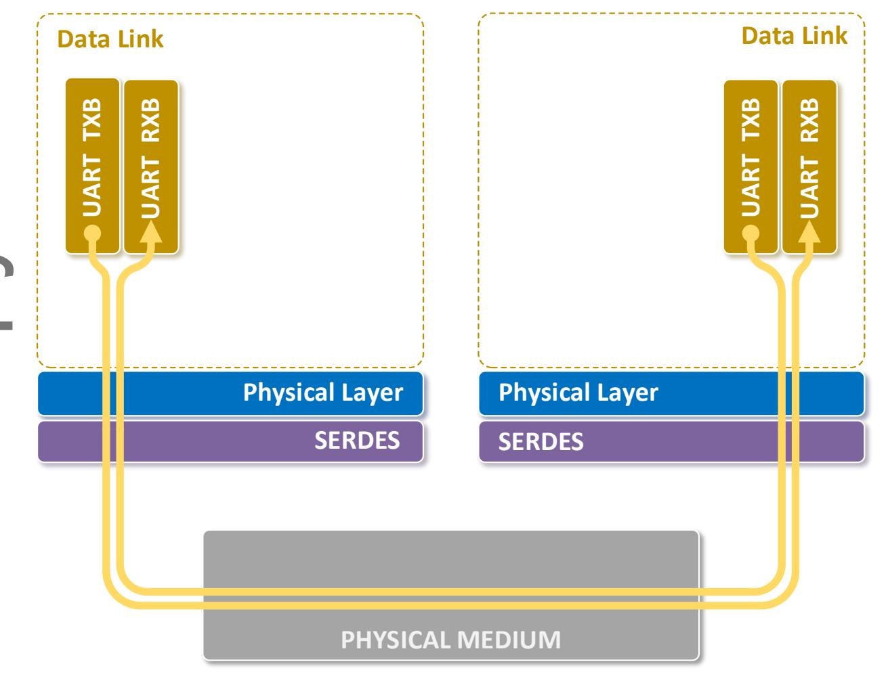

Figure 6-2 UART

### 6.2.4 Tx Pacing, Rx Rate Adaptation

Tx Pacing provides a mechanism for a link partner to limit the transmission rate of TL Flits from its link partner. This enables Accelerators to operate their UPLI Clock at lower than line rate and not overflow its Rx FIFO in the Rx rate adaption logic.

# **6.3 Flit Format**

# **6.3.1 DL Flit Overview**

The 640B Flit is comprised of five segments. Each segment is comprised of an integer number of sectors. A sector is 4 bytes. The number of sectors per segment varies based on header and CRC placement in the segment and is described below. The half segment allocation is also described and defines how far to zero fill when there is no TL Flit to pack, see [Figure 6-5.](#page-8-0)

| Segment Header | Number of payload Sectors | Number of payload bytes | Half Segment Sector ranges |
|-------------------|------------------------------------|-------------------------------|-------------------------------|
| SH0               | 32 Sectors                         | 128-bytes                     | [0:15], [16:31]               |
| SH1               | 32 Sectors                         | 128-bytes                     | [32:47], [48:63]              |
| SH2               | 32 Sectors                         | 128-bytes                     | [64:79],[80:95]               |
| SH3               | 31 Sectors                         | 124-bytes                     | [96:111],[112:126]            |
| SH4               | 30 Sectors                         | 120-bytes                     | [127:142],[143:156]           |

**Table 6-1 Sector Allocation per Segment**

The FH[2:0] fields contain the Flit Header information. This indicates the type of Flit, and sequence number to aid in link level replay, and other information. This is described in detail in sectio[n 6.3.2.](#page-4-0)

The segment header (SH) defines the starting content for that segment.

The 4-byte CRC is calculated over the entire contents of the DL Flit.

The diagram below describes the placement different non data fields of the DL Flit:

- FH[2:0] Flit header
- SH[4:0] segment headers
- CRC
- Segment payload

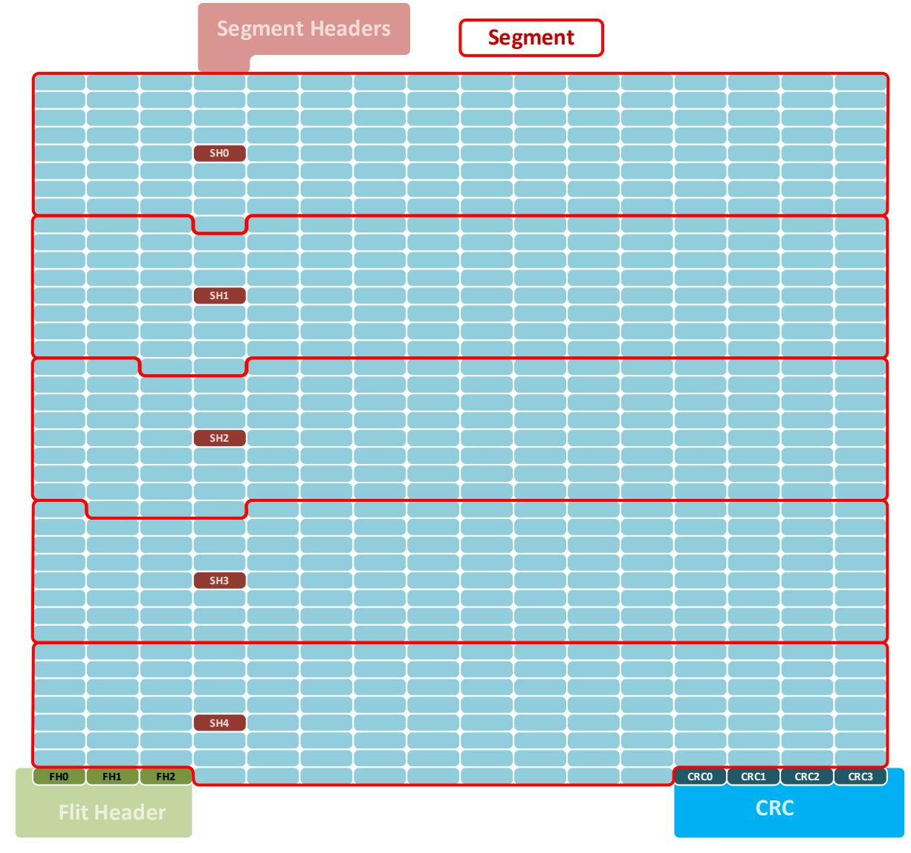

**Figure 6-3 DL 640-Byte Flit Overview**

# **6.3.2 Flit Header**

See sectio[n 6.6.2.](#page-27-0) 

# **6.3.3 Segment Header**

The segment header describes the TL Flit sequence that starts in the segment. Up to two 64-byte TL Flits are contained in a TL Flit sequence. The Segment payload may be less than the 128-bytes, and some segments may contain alternative sectors, therefore some of the TL Flit sequence will carry over into the next segment.

The segment header is 8 bits. The field encodings are shown below. TL Flit[0] and Message[0], indicate the presence of a TL Flit and message data associated with the first TL Flit that is packed into the segment, if present, se[e Figure 6-5.](#page-8-0) TL Flit[1] and Message[1] are associated with the second TL Flit if present.

| Field Name  | Position | Description                                                                                                    |
|-------------|----------|----------------------------------------------------------------------------------------------------------------|
| DLAltSector | [0]      | DL Alternative sector 0b-No alternative sector in segment 1b-DL alternative sector in segment            |
| Reserved    | [1]      | Reserved                                                                                                       |
| Message[0]  | [3:2]    | TL Flit[0] Message bit indicators if TL Flit[0] is not present then reserved else Message bit indicators |
| TL Flit[0]  | [4]      | TL Flit[0] present 0b - TL Flit[0] not present 1b - TL Flit[0] present                             |
| Message[1]  | [6:5]    | TL Flit[1] Message bit indicators if TL Flit[1] is not present then reserved else Message bit indicators |
| TL Flit[1]  | [7]      | TL Flit present 0b - TL[1] Flit not present 1b - TL[1] Flit present                                |

**Table 6-2 Segment Header**

#### **6.3.3.1 DL Alternative Sector**

When the DLAltSector bit is set, this indicates that the segment contains an alternative sector. A sector is 4 bytes. The Alternative sectors are used for carrying DL-DL messages, see section [6.3.4.](#page-5-0) 

#### **6.3.3.2 TL Flit Present**

When this bit is set it indicates that there is TL Flit that starts in this segment.

#### **6.3.3.3 Message**

When there is TL Flit that starts in this segment, this field contains the 2-bit message bits with it, 1 bit for each ½ TL Flit. The message data is simply meta data that is carried transparently over the DL, with the associated TL Flit.

# **6.3.4 Flit packing rules**

The diagram below describes the DL Flit field locations including segment payload details. The Sx.By describes the sector number in the segment (Sx), and the byte number in the segment(By).

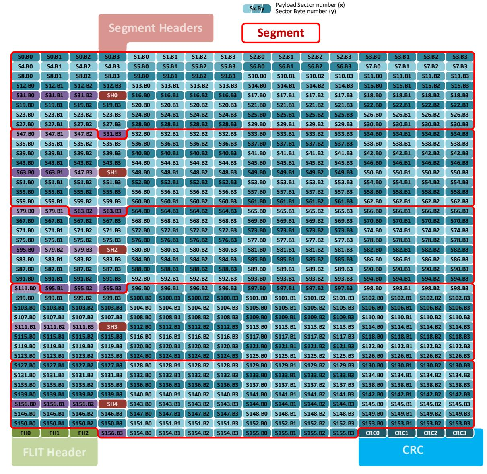

Figure 6-4 DL Flit with segment details

The following describe the Flit packing rules.

- The DL Flit packer operates on a sector basis, a sector is 4 bytes.
- DL Alternative sectors have priority, if an DL alternative sector is indicated then it is placed in the first sector of the segment, before the current TL Flit, or carry over from a previous TL Flit. The first sector is the lowest sector number in the segment see Table 6-1.
- A TL Flit takes up sixteen sectors (64-bytes).
- A DL message (Alternative sectors) takes up one sector (4-bytes).
- There shall be at least one unallocated sector in the segment to start adding a TL Flit.
- If a TL Flit does not pack into the current segment the remainder is carried over to the next segment.
- The SH is encoded as 0x00 when no TL Flits and no DL message start in the segment.
- TL Flits shall be packed in the order received.
- Up to 2 TL Flits start packing into a segment.

- TL Flits shall be packed on the fly to reduce transmitter latency, the first tick of the packer may not have a TL Flit[0] to pack, the remaining ½ segment is zero filled, the 2'nd tick of the packer may have a TL Flit[1] available, and that starts to pack, if sectors are available. See [Table 6-2](#page-5-1) for ½ segment definition.
- In the special case where the first ½ segment is filled with a previous TL Flit carry over and an alternative sector, and there is a TL Flit to add, it is designated TL Flit[0].
- Note: with a 512-bit (64-byte) data path, a DL Flit is packed every 10 clock ticks. DL overhead of 12 bytes (and occasional DL messages) is such that TL Flits cannot be continuously packed every 2 ticks. Other data widths are possible, the same packing behavior shall be met.

Packing flow described below (see [Figure 6-5\)](#page-8-0):

- 1. Start packing a segment.
- 2. If there is a DL ALT sector, it is placed in the first sector of the segment and continue.
- 3. If there is carry over from the previous Segment pack it in sector order and continue.
- 4. If TL Flit[0] is available, on this clock tick, then start packing it in sector order into the current segment and continue, else zero unallocated sectors to the end of the half segment and goto [\(6\)](#page-7-0).
- 5. If TL Flit[0] completes packing continue, else save remaining TL Flit[0] in carry over and done.
- 6. If there are unallocated sectors continue, else done.
- 7. If TL Flit[1] is available, on this clock tick, then start packing it in sector order into the current segment else zero remaining unallocated sectors and done.
- 8. If TL Flit[1] packing is completed then done, else save remaining TL Flit[1] in carry over and done.
- 9. goto [\(1\)](#page-7-1)

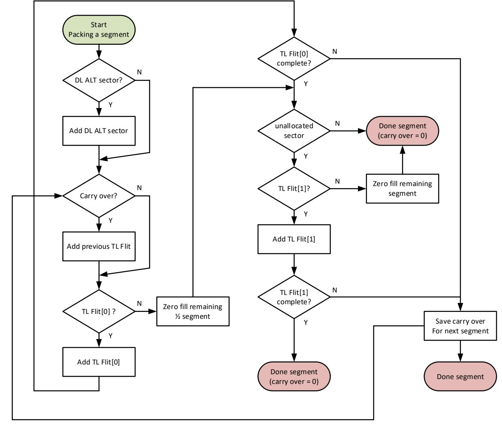

**Figure 6-5 Flit packing flow chart**

# **6.3.5 TL Flit to DL Flit Mapping**

In the following examples the TL Flit is shown in mirrored view so that it aligns with the logical view of the DL Flit. The DL Flit sequential ordering is left to right, top to bottom, i.e., in the order of sector and byte numbering.

[Figure 6-6](#page-9-0) describes that TL Flit[0] starts packing into segment[0]. The message bits[1:0] along with TL Flit[0] present is encoded into SH0. TL Flit sector[0] maps to DL Flit sector[0], and so on.

In this example there is no carry over from a previous TL Flit.

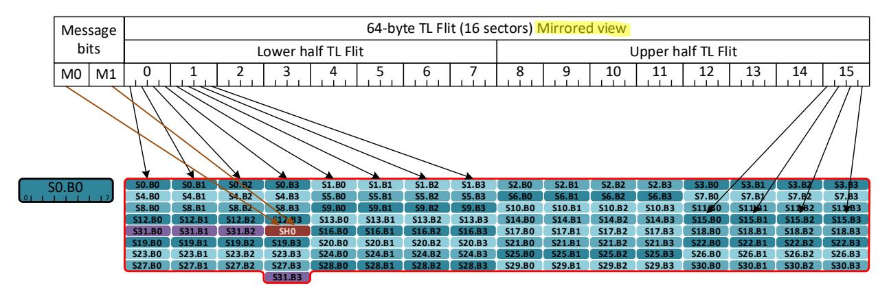

**Figure 6-6 TL Flit[0] example 1**

[Figure 6-7](#page-9-1) describes that TL Flit[1] starts packing into segment[0]. The message bits[1:0] along with TL Flit[1] present is encoded into SH0. TL Flit sector[0] maps to DL Flit sector[16], and so on.

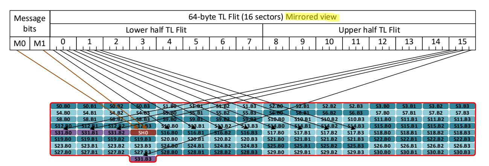

**Figure 6-7 TL Flit[1] example 1**

[Figure 6-8](#page-10-0) describes that TL Flit[0] starts packing into segment[4]. The message bits[1:0] along with TL Flit[0] present is encoded into SH4. TL Flit sector[0] maps to DL Flit sector[143], and so on, into the next segment and DL Flit.

There is no space for TL Flit[1].

In this example there is an alternative sector and a previous carry over up to sector[142].

Figure 6-8 TL Flit[0] example 2

#### 6.3.6 DL Flit to 64B/66B encoding

The DI Flit to 64B/66B encoding is shown below. The DL Flit is redrawn with the same width as the 64-bit PCS interface, and show reflected in the x-axis. The sequence is left to right, bottom to top, i.e., in sector order. The Sync Header (SH) is set to 0b01 for data code.

• Note: The Sync Header is added in the RS layer. The DL only transmits and receives data Flits.

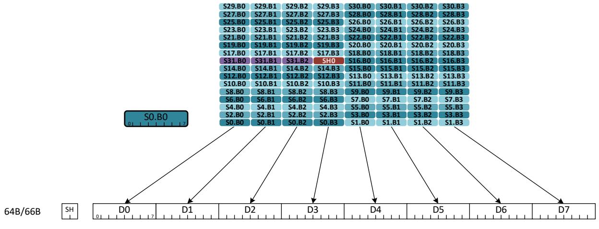

Figure 6-9 DL Flit to 64B/66B Encoding

#### 6.3.7 CRC

A 4-byte CRC is calculated and placed in the last bytes in the DL Flit.

The CRC calculation follows 802.3, see clause 3.2.9 Frame Check Sequence (FCS) field. The CRC is calculated over the entire 640Bytes, with the CRC field padded to 0x0.

The CRC is transmitted in the following order: x0, x1, … x31. This is the reverse order compared to IEEE 802.3 FCS. CRC[0] contains bits x0, x1, … x7, CRC[1] contains bits x8, x1, … x15, etc.

# **6.4 DL messages**

Reserved fields shall be set to 0x0 and shall be ignored by receiving link partner.

# **6.4.1 Message Overview**

#### **6.4.1.1 Message Types**

Any Segment of the DL Flit may contain an DL alternative sector (DLAltSector ). The DLAltSector is used to send DL messages. DL messages originate at the DL and terminate at the DL.

All messages have bit 0 as a reserved.

A summary of the message classes and types are shown below.

| Message class (mclass) | code   | Message Type (mtype)           | code  |
|---------------------------|--------|-----------------------------------|-------|
| Basic Messages            | 0b0000 | No-Op message                     | 0b000 |
|                           |        | TL Rate Notification              | 0b100 |
|                           |        | Device ID Request                 | 0b101 |
|                           |        | Port Number Request and Response  | 0b110 |
| Control Messages          | 0b1000 | DL Channel On/Offline negotiation | 0b100 |
| UART Messages             | 0b0001 | UART Stream Transport Message     | 0b000 |
|                           |        | UART Stream Credit Update         | 0b001 |
|                           |        | UART Stream Reset Request         | 0b110 |
|                           |        | UART Stream Reset Response        | 0b111 |

**Table 6-3 DL Message Types**

#### **6.4.1.2 Message arbitration**

There are several sources of messages. All messages are a single DWord sequence, except for UART Stream Transport Message. This can be up to 33 Dwords. UART Stream Transport Message shall be packed sequentially into each Segment, which may span multiple Flits. Other DL message shall be blocked while the UART Stream Transport Message is transmitted.

There are two levels of arbitration. The first Level is within each Message type. Round Robin is used between each of the Basic Messages, to select a potential winner for the group. Round Robin is used between each of the Control Messages, to select a potential winner for the group. Round Robin is used between each of the UART Messages, to select a potential winner for the group. The final level of arbitration is round robin between the Basic Message group, the Control Message group, and the UART Message group.

# **6.4.2 Basic Messages**

Basic messages are used to send information from one link partner to another, or to request information from one link partner to another. There is no negotiation.

#### **6.4.2.1 Generic Flow**

#### **6.4.2.1.1 Single Request**

The single request flow is shown below. In this case the local link partner makes a request, and the remote link partner shall accept the request with an Ack response.

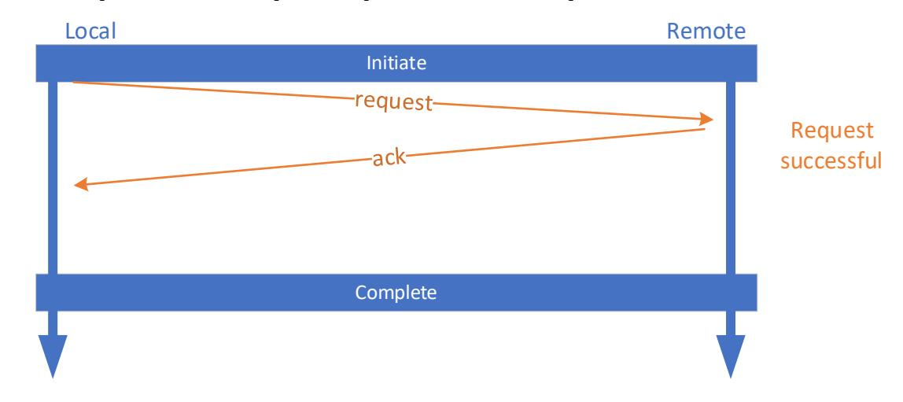

**Figure 6-10 Single Request Flow**

#### **6.4.2.1.2 Two Requests**

It is possible that two request are made at the same time with the same mclass and mtype. These requests are independent and thus operate as two independent sequences. This is shown below.

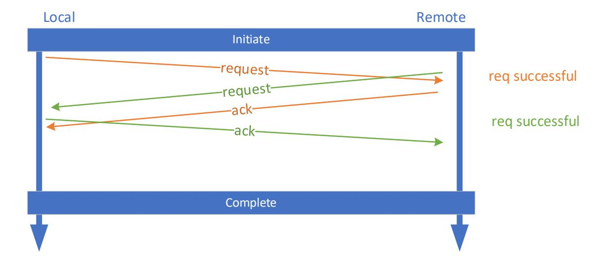

**Figure 6-11 Two Requests Flow**

#### **6.4.2.2 TL Rate Notification**

The TL Rate Notification Message is a message used to convey change in the TL rate (clock frequency) to a connected link partner. The use case of this message is described in section [6.5](#page-25-0)[6.4.4.](#page-20-0) It is a unidirectional message only for notification. The link partner shall respond with an Ack with in 1us of the request.

| Field      | Bit   | Description                                                     |  |
|------------|-------|-----------------------------------------------------------------|--|
| Compressed | 0     | Set to 0, not supported                                         |  |
| Reserved   | 1     | Reserved                                                        |  |
| mclass     | 5:2   | Message Class                                                   |  |
| mtype      | 8:6   | Message Type                                                    |  |
| Reserved   | 11:9  | Reserved                                                        |  |
| Ack        | 12    | 0: Request message                                              |  |
|            |       | 1: Response message                                             |  |
| Reserved   | 15:13 | Reserved                                                        |  |
| Rate       | 31:16 | TL rate, only valid for Request message, reserved otherwise. |  |

**Table 6-4 TL Rate Notification**

Rate is expressed as 50.0 KHz per lsb. Full rate at 1562.5 MHz is coded at 31, 250, decimal. The reference clock rate 156.25 MHz would be coded as 3,125, decimal. The reference clock rate is the minimum rate that shall be supported.

A 1x4, 800G DL is assumed to be 512 bits wide at 1562.5 MHz, and thus 512 \* 1562.5 MHz = 800Gbps. Other data widths are possible and shall normalize to 512-bit width. A 2x2, 400G DL per link is assumed to be 256 bits wide at 1562.5 MHz, and thus 256 \* 1562.5 MHz = 400Gbps. Other data widths are possible and shall normalize to 256-bit width. A 4x1, 200G DL per link is assumed to be 128 bits wide at 1562.5 MHz, and thus 128 \* 1562.5 MHz = 200Gbps. Other data widths are possible and shall normalize to 128-bit width. **Note**: There is overhead in the DL Flit, 4 bytes CRC, 3 bytes Flit header, and 5 bytes segment header. There are 628-bytes of TL payload per 640-byte DL Flit. Backpressure from the Tx pipeline will naturally limit the throughput to (628/640)\*200 = 196.25 Gbps. This is equivalent to a register setting of 30,664, decimal, or 1533.20 MHz.

#### **6.4.2.3 Device ID Request**

To aid in the determination of the scale out network topology a Link partner can request the ID of its link partner. The link partner shall respond within 1.0 us of the request. If the Link partner has not been configured with an ID, then it returns 0x0 in the Valid bit, as well as the ID field. The requesting link partner advertises its ID if known, in the request.

When the Ack field is Request:

- Valid indicates if the ID is valid.
- Type indicates switch or Accelerator.
- ID indicates the requestor ID, set to 0x0 if valid is set to 0x0.

When the Ack field is Response:

- Valid indicates if the ID is valid.
- Type indicates switch or Accelerator.
- ID indicates the responder ID, set to 0x0 if valid is set to 0x0.

| Field      | Bit   | Description                               |
|------------|-------|-------------------------------------------|
| Compressed | 0     | Set to 0, not supported                   |
| Reserved   | 1     | Reserved                                  |
| mclass     | 5:2   | Message Class                             |
| mtype      | 8:6   | Message Type                              |
| Reserved   | 11:9  | Reserved                                  |
| Ack        | 12    | 0: Request message 1: Response message |
| Reserved   | 15:13 | Reserved                                  |
| ID         | 25:16 | 10-bit Switch or accelerator ID           |
| Reserved   | 28:26 | Reserved                                  |
| Type       | 30:29 | 0: for a switch                           |
|            |       | 1: for an accelerator other reserved   |
| Valid      | 31    | 0: if ID is not valid                     |
|            |       | 1: if ID is valid                         |

**Table 6-5 Device ID Request**

#### **6.4.2.4 Port Number Request and Response**

To aid in the determination of the scale up network topology a Link partner can request the port number of its partner, attached on the link. The link partner shall respond with in 1us of the request. If the Link partner has not been configured with its port number, then it returns 0x0 in the Valid bit, and the port number field is undefined and set to 0x0. The requesting link partner advertises its port number if known, in the request.

When the Ack field is Request:

- Valid indicates if the number is valid.
- Port number indicates the port number of the device, if valid is set.

When the Ack field is Response:

- Valid indicates if the number is valid.
- Port number indicates the port number of the device, if valid is set .

| Field      | Bit  | Description             |
|------------|------|-------------------------|
| Compressed | 0    | Set to 0, not supported |
| Reserved   | 1    | Reserved                |
| mclass     | 5:2  | Message Class           |
| mtype      | 8:6  | Message Type            |
| Reserved   | 11:9 | Reserved                |

| Ack         | 12    | 0: Request message 1: Response message                    |
|-------------|-------|--------------------------------------------------------------|
| Reserved    | 15:13 | Reserved                                                     |
| Port number | 27:16 | 10-bit port number.                                          |
| Reserved    | 30:28 | Reserved                                                     |
| Valid       | 31    | 0: if port number is not valid 1: if port number is valid |

**Table 6-6 Port ID Request**

#### **6.4.2.5 No-OP Message**

No-Op messages are used only in UART reset sequences. 40 No-Op messages shall be transmitted during UART reset sequence to flush any data between the transmitter and receiver. The mtype and mclass fields are set according to [Table 6-3.](#page-11-0) No-Op messages are not ACK'd.

| Field      | Bit  | Description             |  |
|------------|------|-------------------------|--|
| Compressed | 0    | Set to 0, not supported |  |
| Reserved   | 1    | Reserved                |  |
| mclass     | 5:2  | Message Class           |  |
| mtype      | 8:6  | Message Type            |  |
| Reserved   | 31:9 | Reserved                |  |

**Table 6-7 No-Op Message**

# **6.4.3 Control Messages**

Control messages are used by the DL to negotiate a change in operation on the Link. Once the Negotiation completes successfully the change takes place. If the negotiation unsuccessfully completes , then no change occurs. The Link is peer to peer and either link partner may request a change. Some link partner types (i.e., Switches) are not permitted to initiate some requests.

Once a link partner receives a request it shall not schedule a request of the same mclass and mtype, until the current request completes. It is possible for two requests to occur at the same time, or near the same time, such that two conflicting or identical request exists, of the same mclass and mtype. When a request is made any subsequent request of the same mclass mtype that is received the link partner shall not respond with a decision pending, it shall respond with an Ack or Nack.

There is a resolution function, for each mtype, such that conflicting requests resolve to one request being Ack'd and the other request being Nack'd.

#### **6.4.3.1 Generic Flow**

#### **6.4.3.1.1 Single Successful Request Flow**

The single successful request flow is shown below. In this case the local link partner makes a request, and the remote link partner accepts the request with an Ack. The local link partner transmits a confirming ACK to the remote link partner.

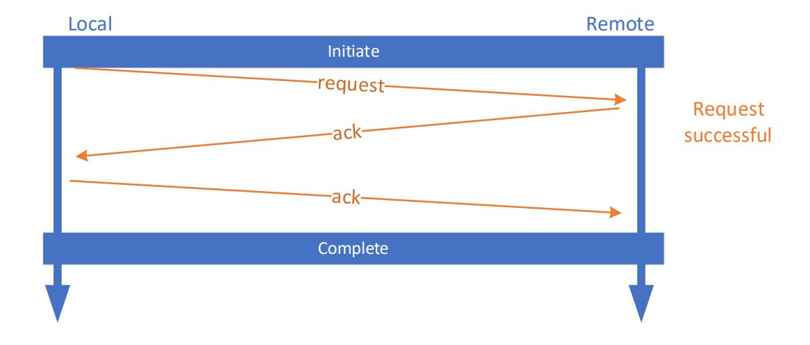

**Figure 6-12 Single Successful Request Flow**

#### **6.4.3.1.2 Single Unsuccessful Request Flow**

The single unsuccessful request flow is shown below. In this case the local link partner makes a request, and the remote link partner rejects the request with an Nack.

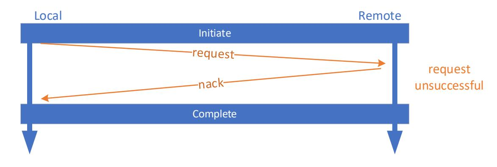

**Figure 6-13 Single Unsuccessful Request Flow**

#### **6.4.3.1.3 Single decision pending Request Flow**

The single decision pending request flow is shown below. In this case the local link partner makes a request, and the remote link partner responds with decision pending Decision. The Remote link partner is required to issue a request later. The Local link partner shall not issue the same mclass mtype request until after the Remote link partner issues a new request of the decision pending mclass and mtype and it is completed.

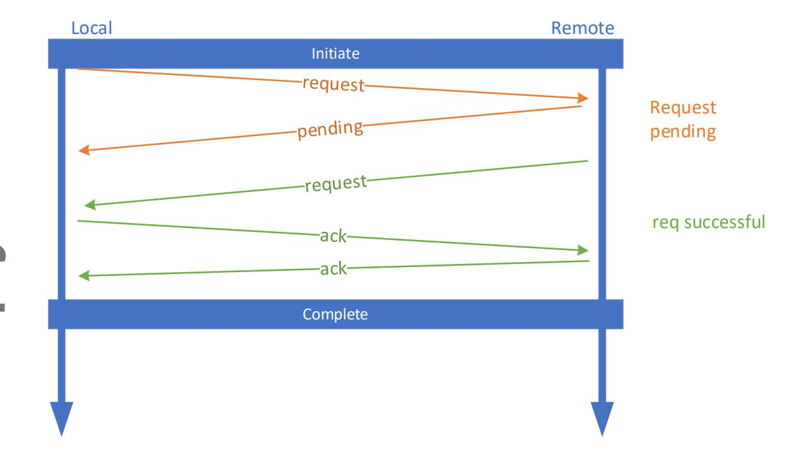

**Figure 6-14 Single decision pending Request Flow**

#### **6.4.3.1.4 Conflicting Request Flow**

The conflicting request flow is shown below. In this scenario both local and remote link partners make a request before they have received the conflicting request. The remote link partner compares its transmitted request to the received request, and determines that the received request should be acknowledged, and sends the Ack. The Loal link partner compares its transmitted request to the received request and determines that the received request should not be acknowledged and sends the Nack. The local link partner receives the Ack and sends the confirming Ack to the remote link partner.

The local link partner is required to transmit the Nack and Ack in the order shown. Responses relating to received requests or responses shall be in the order received. The resolution function is the same in both link partners, so that they both decide consistently how to resolve the conflict.

# Complete Initiate req successful req unsuccessful Local Remote

**Figure 6-15 Conflicting request flow**

#### **6.4.3.1.5 Identical Request Flow**

The identical request flow is shown below. In this scenario both local and remote link partners make a request before they have received the same request. The remote link partner compares its request to the received request, and determines that the received request should be acknowledged, and sends the Ack. The Loal link partner compares its request to the received request, and determines that the received request should be acknowledged and sends the Ack. The local link partner receives the Ack and sends the confirming Ack to the remote link partner. The remote link partner receives the Ack and sends the confirming Ack to the local link partner.

Both local/remote link partners are required to send the Acks in the order shown. Responses relating to received requests or responses shall be in the order received. The resolution function is the same in both link partners, so that they both decide consistently how to resolve the conflict.

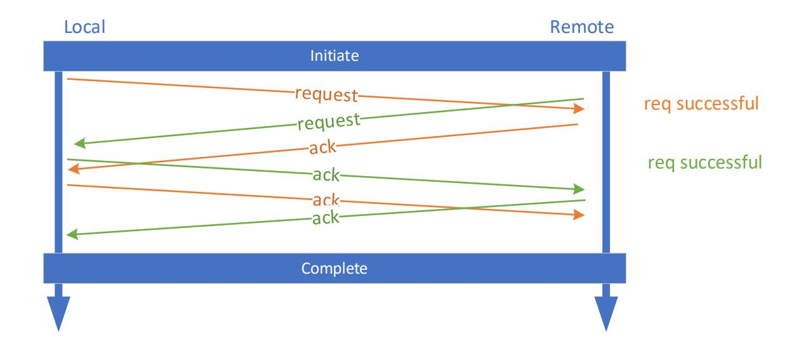

**Figure 6-16 Identical Request Flow** 

### **6.4.3.2 DL Channel Online/Offline Negotiation Message**

The format is shown below. These messages are used to negotiate the Channel offline and online. By default, all Channels are offline after reset.

The Following Channel are defined:

- Channel 0: TL Flits
- Channel 4: DL UART

When a Channel is offline it shall not transmit data associated with that Channel. Received Channel data that are offline is silently discarded. When Channel 0 is offline, transmitted DL Flits shall have the TL Flit[1:0] set to 0 in the segment header. When Channel 4 is offline, transmitted DL Flits shall not have mtype set to 0b0001 in alternative sectors, i.e., UART Messages.

There are only two states online and offline, thus it is not possible to have conflicting requests from each link partner. Requests for the current state are not permitted. If a request is received for the current state, it is Ack'd, and an error is logged by the link partner that received the request.

When a request is received a response (Ack, Nack, or decision pending) shall be transmitted within 1.0 us. When a request is received for a Channel online (and the current state is offline for that Channel) the response shall be Ack or decision pending. The link partner that responded with decision pending to an online request shall transmit a request for Channel online with in 10ms. When a request is received for a Channel offline (and the current state is online for that Channel) the response shall be Ack.

When the Channel.Command field is Request:

- Channel.TargetState indicates the desired online/offline state of the transmitting linkpartner.
- Channel.Response is reserved and shall be set to 0x0.

When the Channel.Command field is decision pending:

- Channel.TargetState is reserved and shall be set to 0x0.
- Channel.Response is the requested Channel.TargetState that it received from the remote link-partner.

When the Channel.Command field is Ack or Nack:

- Channel.TargetState indicates the desired online/offline state of the transmitting linkpartner.
- Channel.Response is the requested Channel.TargetState that it received from the remote link-partner.

| Field               | Bit   | Description                                                                             |
|---------------------|-------|-----------------------------------------------------------------------------------------|
| Compressed          | 0     | Set to 0, not supported                                                                 |
| Reserved            | 1     | Reserved                                                                                |
| mclass              | 5:2   | Message Class                                                                           |
| mtype               | 8:6   | Message Type                                                                            |
| Reserved            | 15:9  | Reserved                                                                                |
| Channel.TargetState | 19:16 | 0xxx: Channel offline 1xxx: Channel online xNNN: Channel ID                       |
| Channel.Command     | 23:20 | 0100: Request 0110: Ack 0111: NAck 1000: decision pending others: reserved. |
| Channel.Response    | 27:24 | 0xxx: Channel offline 1xxx: Channel online xNNN: Channel ID                       |
| Reserved            | 31:28 | Reserved                                                                                |

**Table 6-8 Channel Negotiation** 

# **6.4.4 UART Messages**

### **6.4.4.1 Protocol Overview**

The UART provides a mechanism for sending data across a fraction of the link bandwidth between a UART Transmit Buffer on one end and a UART Receive Buffer on the other end. It is a bidirectional protocol. 32-bits may be sent as an alternative sector every segment. A segment is 1024 bit, thus approximately 3% of the link bandwidth could be utilized for UART Stream Transport Messages.

The UART Stream Transport Message has variable length, and the length is indicated in the first DWord of the UART Stream Transport Message. The First DWord is not stored in the UART Transmit Buffer or UART Receiver Buffer. The length of the UART Stream Transport Message is determined dynamically as a function of available credits and UART Transmit Buffer fill. Subsequent Dwords are the message data and is stored in the UART Transmit Buffer and UART Receiver Buffer.

# Evaluation Copy

#### **Ultra Accelerator Link Consortium Inc. (UALink) - UALink\_200 Rev 1.0 Specification**

The recommended UART Transmit Buffer and UART Receive Buffer is 128 Dwords each, per stream. Currently a single stream is defined, however there is provision for up to 8 streams in the stream ID fields.

#### **6.4.4.1.1 Initialization**

The initial state of the UART Transmit Buffer and UART Receive Buffer shall be empty. Channel 4 shall be enabled prior to operation. The initial state of the transmit and receive credit counters shall be 0, i.e., the transmitter has no credits to send data.

#### **6.4.4.1.2 Stream Reset**

The stream reset sequence is described below:

- 1. Local F/W determines a UART stream reset is required.
- 2. The UART stream is disabled.
- 3. The UART Transmit Buffer and UART Receive Buffers for the affected stream is flushed.
- 4. The credit counts for the disabled stream are reset to 0x0.
- 5. Any subsequent writes to the disabled UART Transmit Buffer are discarded.
- 6. Any subsequent receive data from the link partner for the disabled stream is discarded. Error reporting on these discards are suppressed pending the completion of the reset handshake
- 7. all DL messages (all classes, all types) are blocked to prevent further pollution.
- 8. 40 DL No-Op Messages are transmitted to ensure run-out of any existing UART Stream Transport Message
- 9. A UART Stream Reset Request Message is transmitted.
- 10. DL messages (all classes, all types) are unblocked to allow forward progress.
- 11. Wait for UART Stream Reset Response with status = SUCCESS
  - a. After a 10ms timeout, if a Reset Response with status = SUCCESS is not returned, loop back to step [\(7\)](#page-21-0)
- 12. Normal operation resumes

The Remote link partner that receives the UART Stream Reset Request Message performs the following sequence:

- 1. The UART stream is disabled.
- 2. The UART Transmit Buffer and UART Receive Buffers for the affected stream is flushed.
- 3. The credit counts for the disabled stream are reset to 0x0.
- 4. Any subsequent writes to the disabled UART Transmit Buffer are discarded.
- 5. A UART Stream Reset Response Message is transmitted with status = SUCCESS.
- 6. Normal operation resumes.

#### **6.4.4.1.3 Flow Control**

Flow control is managed by two modulo 2^12 Credit Counters, per direction one in the receiver (Receiver Credit Counter) and one in the transmitter (Transmit Credit Counter). During initialization both counters are set to 0x0. Each count value represents a DWord.

The Receiver Credit Counter rules are described below.

- Receiver Credit Counter is initialized to 0 during reset.
- When reset is released Receiver Credit Counter is updated to the size of the UART Receiver Buffer.

- When a DWord is read out of UART Receive Buffer, the Receiver Credit Counter is incremented by 1.
- If Channel 4 is enabled, then a UART Stream Credit Update is scheduled for transmission with the Receiver Credit Counter value in the DataFCSeq field under the following conditions:
  - o No UART Stream Credit Update have been scheduled since reset.
  - o When Receiver Credit Counter is incremented, and 4 Flits have been Transmitted.

The Transmit Credit Counter rules are described below.

- Transmit Credit Counter is initialized to 0 during reset.
- The Transmit Credit Counter is updated every time a UART Stram Transport Message is sent.

A UART Stream Transport Message shall be scheduled when all the following are true:

- Channel 4 is enabled.
- The UART Transmit Buffer has a DWord or more in it.
- The most recently received DataFCSeq field from the UART Stream Credit Update minus the local Transmit Credit Counter, using modulo 2^12 subtraction, is greater than 0. This indicates that there is room in the UART Receive Buffer.

The length field of the UART Stream Transport Message is set to the minimum of:

- The result of the modulo subtraction above minus 1
- The UART Transmitter Buffer fill minus 1
- 32 minus 1

#### **6.4.4.1.4 Vendor Defined Packet TLV**

There is no relationship between the UART Stream transport Message length and the Length of the Vendor Defined Packet. Shown below illustrates a Vendor Defined Packet [i] that spans 3 UART Stream Transport Messages. The first DWord of the Vendor Defined Packet shown below, is a TL describing the Type and Length of Vendor Defined Packet, the subsequent 3 Dwords V[2:0] describe the Value of the message.

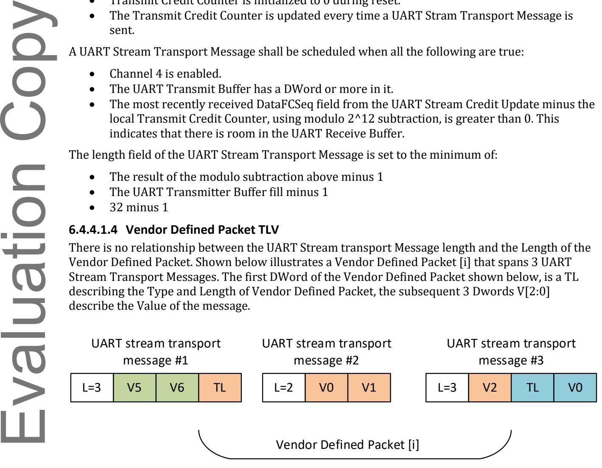

**Figure 6-17 Vendor Defined Packet**

The first DWord of the Vendor Defined Packet is described below.

| Field  | Bit | Description                                                                              |
|--------|-----|------------------------------------------------------------------------------------------|
| Length | 7:0 | Payload Length -1 0x00: payload length = 1 DWord 0XFF: payload length = 256 DWords |

| Type      | 15:8  | Message type                                                                                                             |
|-----------|-------|--------------------------------------------------------------------------------------------------------------------------|
| Vendor ID | 31:16 | The vendor ID assigned by the PCI-SIG to the vendor that defined this packet, or 0xFFFF for UALink defined packet. |

**Table 6-9 Vendor Defined Packet Type Length (TL) DWord**

#### **6.4.4.2 UART Stream Reset Request**

The UART Stream Reset Request message is shown below. This is sent to initiate a reset sequence, either for a single stream, or all streams.

| Field      | Bit   | Description                                |
|------------|-------|--------------------------------------------|
| Compressed | 0     | Set to 0, not supported                    |
| Reserved   | 1     | Reserved                                   |
| mclass     | 5:2   | Message Class                              |
| mtype      | 8:6   | Message Type                               |
| Stream ID  | 11:9  | 000: stream 0 others reserved           |
| allStreams | 12    | 0: only stream indicated 1: all streams |
| Reserved   | 31:13 | Reserved                                   |

**Table 6-10 UART Stream Reset Request**

#### **6.4.4.3 UART Stream Reset Response**

The UART Stream Reset Response message is shown below. This is sent to report the status of a reset sequence, either for a single stream, or all streams.

| Field      | Bit   | Description                                |  |
|------------|-------|--------------------------------------------|--|
| Compressed | 0     | Set to 0, not supported                    |  |
| Reserved   | 1     | Reserved                                   |  |
| mclass     | 5:2   | Message Class                              |  |
| mtype      | 8:6   | Message Type                               |  |
| Stream ID  | 11:9  | 000: stream 0 others reserved           |  |
| allStreams | 12    | 0: only stream indicated 1: all streams |  |
| Status     | 15:13 | 000: success others reserved            |  |
| Reserved   | 31:16 | Reserved                                   |  |

#### **Table 6-11 UART Stream Reset Response**

#### **6.4.4.4 UART Stream Transport Message**

The UART Stream Transport Message is shown below. The UART Stream Transport Message is transmitted a DWord at a time via 32-bits per segment. The message length is specified in Dwords as indicated. The maximum length of the payload is 32 DWords. The maximum length of the transport message is 33 Dwords. The UART Stream Transport Message shall be transmitted continuously, i.e., without another DL messages inserted between any of the UART Stream Transport Message Dwords.

| Field           | Bit                     | Description                                                            |
|-----------------|-------------------------|------------------------------------------------------------------------|
| Compressed      | 0                       | Set to 0, not supported                                                |
| Reserved        | 1                       | Reserved                                                               |
| mclass          | 5:2                     | Message Class                                                          |
| mtype           | 8:6                     | Message Type                                                           |
| Stream ID       | 11:9                    | 000: stream 0 others reserved                                       |
| Reserved        | 26:12                   | Reserved                                                               |
| Length          | 31:27                   | Length of payload +1 DWords, i.e. length = 0 means 1 DWord payload. |
| DWord payload 0 | 63:32                   | First payload DWord                                                    |
| DWord payload 1 | 95:64                   | Second payload DWord, if needed.                                       |
| DWord payload n | (n+2)*32- 1:(n+1)*32 | N'th payload DWord, if needed.                                         |

**Table 6-12 UART Stream transport message**

#### **6.4.4.5 UART Stream Credit Update**

The UART Stream Credit Update message is shown below. This is used to advertise credit availability from receiver to transmitter.

| Field      | Bit   | Description                        |
|------------|-------|------------------------------------|
| Compressed | 0     | Set to 0, not supported            |
| Reserved   | 1     | Reserved                           |
| mclass     | 5:2   | Message Class                      |
| mtype      | 8:6   | Message Type                       |
| Stream ID  | 11:9  | 000: stream 0 others reserved   |
| Reserved   | 19:12 | Reserved                           |
| DataFCSeq  | 31:20 | Data flow control sequence update. |

**Table 6-13 UART Stream Credit Update**

# 6.5 Transmitter Pacing

#### 6.5.1 Overview

The transaction buffers are in the TL, and credit-based flow control guarantees that there is always room in the receive TL buffers. The TL is clocked by the UPLI Clock. Accelerators are permitted to change their UPLI Clock to a lower frequency such that its throughput is lower than the physical layer throughput.

**Note**: Changing to a lower clock frequency is a power reduction mechanism often used in accelerators and CPUs.

Transmitter Pacing is required on the transmitting device to prevent the DL Rx FIFO overflow on the receiving device, when the receiving UPLI Clock is operating at a lower frequency. The Rx FIFO is written at a rate derived from the recovered clock. This rate is 800Gb/s by default and is implemented as 512-bits (64-byes) at 1562.5MHz = 800Gb/s. The read rate could be slower if the UPLI Clock has been reduced, thus causing the Rx FIFO to fill up.

Pacing is defined as the rate that a Tx Flit from the TL is admitted to the DL Tx FIFO. The DL modulates at "Ready" signal to the TL indicating on which of the clock ticks' data may transfer.

• Note: The "ready" signal is one possible implementation, others are possible. This is for illustration purposes only.

Figure 6-18 Pacing

#### **6.5.2** Switch

Switches are required to run at a fixed UPLICLK, such that the throughput is 800Gb/s, 512-bits at 1562.5MHz. If the Accelerator changes its UPLICLK it sends a TL Rate Notification Message to the Switch. The Switch adjusts the transmit pacing rate to avoid Rx FIFO overflows in the accelerator based on receiving this message.

# **6.5.3 Accelerator**

Accelerators are permitted to change their UPLI Clock. If the Accelerator intends to change its UPLI Clock it shall inform its link partner of this via TL rate notification messages . It is permitted to have both accelerators on a link operating at different rates. It is permitted that accelerators independently changing their rates at the same time.

# **6.5.4 Sequence**

The following rules apply to UPLI Clock rate change:

- 1. Default rate is 800G bits/s or 1562.5MHz.
- 2. Only Accelerators may change their UPLI Clock frequency.
- 3. Changing the UPLI Clock frequency requires reprograming a PLL, therefore an intermediate UPLI Clock frequency between rates changes shall be to the reference clock of 156.25MHz. Switching between PLL derived clock and 156.25 MHz reference clock is performed with a glitchless clock mux.
- 4. When an accelerator intends to change its UPLI Clock frequency:
  - a. Adjust its Tx pacing to the reference clock rate.
  - b. Transmit a TL Rate Notification Message for the reference clock rate.
  - c. Wait for TL Rate Notification Message ACK.
  - d. Mux its UPLI Clock to the reference clock.
  - e. Adjust its PLL for the to the new UPLI Clock frequency.
  - f. Mux its UPLI Clock to the new PLL frequency, with Tx pacing set to the link partner's rate if it has a lower UPLI Clock rate.
  - g. Transmit a TL Rate Notification Message for the new clock rate.
  - h. Wait for TL Rate Notification Message ACK.
  - i. Done.
- 5. When a link partner receives a TL rate notification message:
  - a. It registers this value.
  - b. It adjusts its Tx pacing if needed (i.e., link partner has advertised a lower rate).
  - c. Transmits with a TL Rate Notification Message ACK within 1.0 us.
  - d. Done.

# **6.6 Link Level Replay**

# **6.6.1 Overview**

Link level replay ensures guaranteed in order delivery of DL Flits in the presence of bit errors that cannot be corrected by the physical layer FEC. The Transmitter keeps a copy of payload Flits (i.e., not NOP Flits), until the receiver positively acknowledges them. The unacknowledged Flits are stored in the TxReplay buffer. The TxReplay buffer shall be large enough to cover the round-trip time (RTT) of the link otherwise the link will not be able to run at full bandwidth. If the TxReplay buffer is full, waiting for positive acknowledgments (ACKs), new DL payload Flits shall not be transmitted. In their place NOP Flits are transmitted. If the TxReplay buffer is full or in a replay state, the DL shall back pressure the TL and not accept any additional TL Flits and ensure that no accepted TL Flits are lost.

The PCS Receiver performs FEC correction prior to forwarding the Flit to the DL, only Flits that pass FEC correction are forwarded to the DL. The CRC is check in the DL. If the CRC fails, then the DL Flit is deemed bad, and the Flit is discarded.

# Evaluation Copy

#### **Ultra Accelerator Link Consortium Inc. (UALink) - UALink\_200 Rev 1.0 Specification**

If the CRC is good, then one of the following occur: a standard replay is scheduled by the Receiver via a Replay Request when the receiver determines the received sequence numbers are out of order or an Ack is scheduled when the receiver determines the received sequence numbers are in order.

When the Transmitter receives an Ack the TxReplay buffer removes entries up to and including the sequence number indicated by ackReqSeq field in the Ack. When the Transmitter receives a Standard Replay Request, it starts replaying all DL Payload Flits, currently held in the transmit replay buffer, starting with the sequence number indicated by the ackReqSeq field in the Replay Request . A Replay Request is not an implicit Ack; no entries are removed from the TxReplay buffer when a Replay Request is received.

When Replay Requests are sent, three Replay Requests shall be sent, to improve reliability, all requesting the same sequence number. Upon receiving a new Replay Request, the receiver shall ignore subsequent Replay Requests during the Replay Request Ignore Window. The three copies of the Replay Request shall be issued as quickly as possible such that no more than one copy of the Replay Request will be sent in each FEC-interleave group.

• Note: this ensures that the loss of any one FEC-interleave group will result in the loss of no more than one copy of the Replay Request.

There are two formats for Flit headers:

- 1. **Explicit Sequence Number Flit**: this Flit carries the full 9-bit sequence number, but no information regarding Ack or Replay Request
- 2. **Command Flit**: this Flit carries only the lower 3-bits of the sequence number, as well as Ack or Replay Request indication, and the full 9-bit sequence number that is being Acked or replay requested.

When a Command Flit is received, the full 9-bit sequence number can generally be calculated based on previously received full 9-bit sequence number (Explicit Flit), and subsequent 3-bit sequence numbers (command Flit). The receiver performs checks to ensure that this can be calculated unambiguously. If the sequence number cannot be unambiguously determined a replay is triggered. The transmitter schedules Explicit Flits every 7 Flits to aid the calculation being unambiguous.

# **6.6.2 Flit Header**

#### **6.6.2.1 Explicit Sequence Number Flit Header**

The Explicit Sequence Number Flit (or "Explicit Flit" for short) header is shown below. This contains the full 9-bit sequence number. There is no Ack or Replay Request indication.

| Field    | Bit   | Description                                                                                                                                                                                          |
|----------|-------|------------------------------------------------------------------------------------------------------------------------------------------------------------------------------------------------------|
| op       | 23:21 | When payload ==0 (NOP): 0b000: NOP Flit others: Reserved When payload ==1: 0b000: Original transmission of payload Flit "org" 0b001: Replay of payload Flit "rpy" others: Reserved |
| payload  | 20    | 1: payload Flit 0: NOP Flit                                                                                                                                                                       |
| reserved | 19:17 | Reserved                                                                                                                                                                                             |

| flitSeqNo | 16:8 | Sequence number of Flit. This is the full 9-bit value. |
|-----------|------|--------------------------------------------------------|
| reserved  | 7:0  | Reserved                                               |

**Table 6-14 Explicit Sequence Number Flit Header**

#### **6.6.2.2 Command Flit Header**

The Command header is shown below. This contains the full 9-bit sequence number for the Flits that is being acknowledged or not acknowledged, along with the lower 3-bits of the flitSeqNo, identified as flitSeqLo.

| Field     | Bit   | Description                                                                                                                                  |
|-----------|-------|----------------------------------------------------------------------------------------------------------------------------------------------|
| op        | 23:21 | 0b010: Ack 0b011: Standard Replay Request "rpy" others: Reserved                                                                       |
| payload   | 20    | 1: payload Flit 0: NOP Flit                                                                                                               |
| ackReqSeq | 19:11 | Full sequence number of Ack Flit that is being acknowledged or Sequence number of the Replay Request. This is the full 9-bit value. |
| flitSeqLo | 10:8  | Lower 3 bits of Flit Sequence Number.                                                                                                        |
| reserved  | 7:0   | Reserved                                                                                                                                     |

**Table 6-15 Command Flit Header**

# **6.6.3 Term Definitions**

#### **6.6.3.1 Explicit Sequence Number Flit**

A Payload Flit with op equal to 0b000 or 0b001. A NOP Flit with op 0b000. This uses the format described in [Table 6-14.](#page-28-0) Explicit Flits contain the full 9-bit sequence number.

#### **6.6.3.2 Command Flit**

A payload or NOP Flit with op equal 0b010 or 0b011. In other words, an Ack or Replay Request Flit.

#### **6.6.3.3 Ack Flit**

A Flit with Replay op 0b010. This uses the format described i[n Table 6-15.](#page-28-1)

#### **6.6.3.4 Standard Replay Request Flit**

A Flit with Replay op 0b011. This uses the format described i[n Table 6-15.](#page-28-1)

#### **6.6.3.5 Standard Replay Request**

A Replay Request that requests a replay of all DL Payload Flits starting from a specified sequence number.

#### **6.6.3.6 Tx Replay Buffer**

The buffer which stores information for transmitted DL Payload Flits until the DL Payload Flit has been acknowledged by the Link partner.

# Evaluation Copy

# **6.6.3.7 Rx Replay Buffer**

The buffer which stores information for received DL Payload Flits, until the DL Payload Flit has been released to and consumed by the Receiver.

**Ultra Accelerator Link Consortium Inc. (UALink) - UALink\_200 Rev 1.0 Specification**

#### **6.6.3.8 Replay Request Ignore Window**

A time window in which received Replay Request Flits are ignored so that only a single replay action will be triggered from the multiple copies of the Replay Request that were issued.

# **6.6.4 Rx Flags and Counters**

#### **6.6.4.1 Rx\_seq\_calc**

This 9-bit value is calculated based on the received Flit. Command or Explicit header type as follows.

If Flit is an Explicit Flit:

• Rx\_seq\_calc = flitSeqNo

Else: # Command Flit

• delta\_lo = (flitSeqLo - Rx\_last\_seq\_calc & 0x7) % 8

If delta\_lo == 0 and flit is payload:

- o delta\_lo = 8
- Rx\_seq\_calc = (Rx\_last\_seq\_calc + delta\_lo) % 512

Default value is 0x1FF.

#### **6.6.4.2 Rx\_last\_seq\_calc**

This 9-bit value is updated based on the Rx\_seq\_calc calculation of the last Flit received. Default value is 0x1FF. Se[e Rx Enqueuing Rules.](#page-32-0)

#### **6.6.4.3 Rx\_last\_ack**

This 9-bit value is updated based on the ackReqSeq field of the last Ack Flit received. Default value is 0x1FF. See [Rx Ack and Replay Request Processing Rules.](#page-31-0)

#### **6.6.4.4 Rx\_bad\_crc\_count**

This 3-bit value incremented based receiving Flits with bad CRC. The counter does not roll over and saturates at 0x7. Bad CRC can lead to sequence number ambiguity resulting in a loss of sync between Rx\_last\_seq\_calc at the receiver and the actual sequence number that the Flit was created with. Default value is 0x0. Se[e Rx Ingress Rules.](#page-31-1)

#### **6.6.4.5 Rx\_unexpected\_count**

This 8-bit value is incremented based on receiving Flits with unexpected sequence number while the Rx is in the replay state. The counter does not roll over and saturates at 0xFF. Default value is 0x0. See [Rx Enqueuing Rules.](#page-32-0) 

#### **6.6.4.6 Rx\_replay\_limit**

This 8-bit value set the limit in Flit times that will trigger resending Replay Requests. Default value is 50. This should be set to twice the round-trip latency of the link, in Flit times. See [Rx Enqueuing](#page-32-0)  [Rules.](#page-32-0)

#### **6.6.4.7 Rx\_ambiguous**

This flag indicates if the received flitSeqLo field is ambiguous. This occurs when too many CRC errors occur in a row declaring that future reception of a flitSeqLo field is untrustworthy. Default value is 0x0. See [Rx Ingress Rules.](#page-31-1)

#### **6.6.4.8 Rx\_replay**

This flag indicates if the Rx is in a replay state or not. Default value is 0x0. See [Rx Enqueuing Rules.](#page-32-0)

#### **6.6.4.9 Rx\_replay\_ignore\_count**

This 4-bit value defines the remaining number of flits for which a received Replay Request will be ignored. This counter counts down and saturates at 0x0. Default value is 0x0. See [Rx Ingress Rules.](#page-31-1) 

# **6.6.5 Tx Flags and Counters**

#### **6.6.5.1 Tx\_replay\_req\_seq\_no**

This 9-bit value holds the sequence number that will be sent 3 times as replica Replay Requests. Default value is 0x0. See [Tx Scheduling.](#page-33-0)

#### **6.6.5.2 Tx\_replay\_req\_count**

This 2-bit value indicates how many Replay Requests are left to send. This counter counts down and saturates at 0x0. Default value is 0x0. See [Rx Enqueuing Rules](#page-32-0) and [Tx Scheduling.](#page-33-0)

#### **6.6.5.3 Tx\_last\_seq**

This 9-bit value indicates the last sequence number added to TxReplay. This number is incremented for each payload Flit added to the TxReplay buffer. A 9-bit value is stored in the TxReplay buffer along with the Flit, the transmitted Flit may ultimately use the 3-bit flitSeqLo field for a command Flit. Default value is 0x1FF. Se[e Flit sequence number rules,](#page-31-2) [Rx Ack and Replay Request Processing](#page-31-0)  [Rules,](#page-31-0) an[d Tx Source Flit Rules.](#page-33-1) 

#### **6.6.5.4 Tx\_replay**

Evaluation Copy

This 1-bit value indicates if the Tx is in a replay state or not. Default value is 0x0. See [Tx Enqueue](#page-33-2)  [Rules](#page-33-2) an[d Tx Source Flit Rules.](#page-33-1) 

#### **6.6.5.5 Tx\_first\_replay**

This 1-bit value indicates the first Flit of a replay, and it shall be transmitted as an Explicit Sequence Number Flit . Default value is 0x0. See [Rx Ack and Replay Request Processing Rules](#page-31-0) an[d Tx](#page-33-0)  [Scheduling.](#page-33-0) 

#### **6.6.5.6 Tx\_explicit\_count**

This 3-bit value determines when an Explicit Sequence Number Flit shall be sent. This down counter saturates at 0x0 forcing an Explicit Sequence Number Flit to be sent. Default value is 0x7. Se[e Tx Scheduling.](#page-33-0) 

#### **6.6.5.7 Tx\_ack\_counter**

While unacknowledged DL Payload Flits are present in the Tx Replay Buffer, this 24-bit counter keeps track of the time, in Flit times, waiting since the last received ack . Default value is 0x0. See [Tx](#page-34-0)  [Forward progress.](#page-34-0)

#### **6.6.5.8 Tx\_ack\_time\_out**

This 24-bit register is programed with the threshold for the Tx\_ack\_counter. Default value is calculated for 1ms. With 200AUI-1 Flit time is 25ns, and thus default setting is 40,000. See [Tx](#page-34-0)  [Forward progress.](#page-34-0)

# **6.6.6 General Rules**

#### **6.6.6.1 Flit sequence number rules**

- Valid Flit Sequence Numbers are 1 to 511, 0 is reserved for future use. 511 wraps to 1.
  - o Any (sequence number expression)%511 implicitly wraps 511 to 1.
- NOP Flits do not consume a Flit Sequence Number.
- A NOP Flit uses Tx\_last\_seq for its sequence number.
- A payload Flit uses Tx\_last\_seq + 1 for its sequence number when it is added to the TxReplay buffer.

#### **6.6.6.2 Rx Ingress Rules**

When an ingress Flit is received:

- Rx\_replay\_ignore\_count is decremented by 1, saturates at 0x0.
- If the CRC check passes, then proceed with both:
  - o [Rx Ack and Replay Request Processing Rules](#page-31-0) and
  - o [Rx Enqueuing Rules](#page-32-0)
- Else # the CRC fails
  - o Rx\_bad\_crc\_count += 1
  - o If Rx\_bad\_crc\_count >= 7 then set Rx\_ambiguous to 1
  - o If Rx\_replay = 1 then Rx\_unexpected\_count += 1
  - o Discard Flit
  - o increment CRC error counter

#### **6.6.6.3 Rx Ack and Replay Request Processing Rules**

When an ingress Flit is received that passes CRC Check:

- A Command Flit with ackReqSeq equal to 0 is dropped and error is logged.
- If both of the following are true:
  - o The DL Flit is a Replay Request Flit
  - o Rx\_replay\_ignore\_count equals 0x0

#### Then

- o If both are true:
  - (ackReqSeq Rx\_last\_ack -1)% 511 <=256
  - (Tx\_last\_seq ackReqSeq )%511<= 256

#### Then

- Set TxReplay to 1
- Set Tx\_first\_replay to 1
- Set Rx\_replay\_ignore\_count to 12
- Schedule replay with the ackReqSeq from the received Flit as the next Flit to transmit

#### Else

- Ignore the DL Replay Request command in the ingress DL Flit
- Optionally Log unexpected Replay Request

Else if the DL Flit contains an Ack command, then:

- o If both are true:
  - (ackReqSeq Rx\_last\_ack)% 511 <=256

▪ (Tx\_last\_seq – ackReqSeq)%511<= 256 Then

- Rx\_last\_ack = ackReqSeq
- Remove all DL payload Flits with sequence number lower than or equal to Rx\_last\_ack from the TxReplay buffer.

Else

- Ignore the DL Ack command in the ingress DL Flit
- Optionally Log unexpected Ack

The term ackReqSeq above is from the Flit header field for the received Flit.

An example is shown below of a TxReplay buffer with sequence numbers 5 through 9. The Rx\_last\_ack variable is set to 4 as that is the last Ack that was received. Tx\_last\_seq variable is set to 9 the most recent entry in the TxReplay buffer. Modulo math is ignored for simplicity.

The Ack should have an ackReqSeq number 4 or greater. An Ack could be sending the same ackReqSeq 4, for example that was the last DL Flit received. An ackReqSeq number lower than 4 would be unexpected. The Ack should have an ackReqSeq number 9 or less. It would be unexpected to receive an Ack for a higher sequence number than what the transmitter has sent.

The Replay Request should have an ackReqSeq number 5 or greater. A Replay Request could be sending ackReqSeq 5, which indicates to Replay all unacknowledged DL payload Filts with sequence number 5 and higher. An ackReqSeq number lower than 4 would be unexpected, those sequence numbers are not in the TxReplay buffer. The Replay Request should have an ackReqSeq number 9 or less. Sequence numbers 10 and higher are not in the TxReplay buffer.

The ackReqSeq that falls outside of the expected range are ignored.

**Figure 6-19 Ack Replay Request valid range**

#### **6.6.6.4 Rx Enqueuing Rules**

When an ingress Flit is received that passes CRC Check:

- An Explicit Flit with flitSeqNo equal to 0 is dropped and error is logged.
- If at least one of the following are true regarding the received Flit:

*Data Link* 171

Evaluation Copy

- o It is an Explicit Sequence Number Flit
- o Rx\_ambiguous == 0 and Rx\_replay == 0

#### Then

- o If either of the following are true: # expected sequence number
  - Flit is NOP and Rx\_seq\_calc == Rx\_last\_seq\_calc
  - Flit is payload and Rx\_seq\_calc == Rx\_last\_seq\_calc +1

#### Then:

- if payload Flit: add Flit to receive queue
- Clear Rx\_unexpected\_count to 0
- Rx\_last\_seq\_calc = Rx\_seq\_calc
- Clear Rx\_replay to 0
- Clear Rx\_ambiguous to 0
- Clear Rx\_bad\_crc\_count to 0

Else if Rx\_replay == 0 then: # unexpected sequence number and not in Replay

- Set Tx\_replay\_req\_count to 3
- Set Rx\_replay to 1
- Clear Rx\_unexpected\_count to 0

Else If Rx\_replay == 1 then:

- o Rx\_unexpected\_count += 1
- o If Rx\_unexpected\_count >= Rx\_replay\_limit
  - Set Tx\_replay\_req\_count to 3
  - Clear Rx\_bad\_crc\_count to 0

#### **6.6.6.5 Tx Enqueue Rules**

All the following shall be true, for TxReplay to accept a Flit:

- Tx\_replay == 0
- TxReplay buffer is not full
- There are no more than 255 unacknowledged Flits in TxReplay

When the TxReplay is accepting Flits, the DL shall provide Flits back-to-back. Flits can be either payload or NOP.

#### **6.6.6.6 Tx Source Flit Rules**

At every Flit interval a Flit shall be transmitted, assuming it is in the appropriate [DL Link States.](#page-38-0) Flits are be sourced from the TxReplay buffer, during a Standard Replay. Flits are sourced from the normal data flow when not in a Standard Replay. The following describe the rules:

- If Tx\_replay == 1 and there are Flits that are scheduled for replay, then:
  - o Send the next Replay Flit
  - o If all Flits are sent:
    - Set Tx\_replay to 0
- Else: # Tx\_replay == 0
  - o Send the Flit from the DL stream. If the Flit is a payload, then the Flit is added to TxReplay

#### **6.6.6.7 Tx Scheduling**

The scheduler decides what type of Flit to send. The rules for this are described below.

- Update Tx\_explicit\_count -= 1
- If Tx\_first\_replay == 1 then:
  - o Clear Tx\_first\_replay to 0
  - o Set Tx\_explicit\_count to 0x7
  - o Set op to Replay (0b001)
- Else if Tx\_explicit\_count <= 0 then:
  - o Set Tx\_explicit\_count to 0x7
  - o If Tx\_replay ==1 then:
    - Set op to Replay (0b001)
  - o Else:
    - Set op to Original (0b000)
- Else if Tx\_replay\_req\_count > 0 and this is a new codeword group since last Replay Request was sent then:
  - o If Tx\_replay\_req\_count == 3 then:
    - Set Tx\_replay\_req\_seq\_no to Rx\_last\_seq\_calc + 1
  - o Tx\_replay\_req\_count -= 1
  - o Set op to Replay Request (0b011)
  - o Set ackReqSeq to Tx\_replay\_req\_seq\_no
- Else:
  - o Set op to Ack (0b010)
  - o Set ackReqSeq to Rx\_last\_seq\_calc

#### **6.6.6.8 Tx Forward progress**

The Tx\_ack\_counter is decremented when there are unacknowledged Flits in the Tx Replay buffer, saturating at 0x0. The Tx\_ack\_counter is rearmed to Tx\_ack\_time\_out when an Ack is received that removes Flits from the Tx Replay buffer. If the Tx\_ack\_counter reaches 0 then the DL enters the DL Idle state.

#### **6.6.6.9 Rx Flow Chart**

The Rx Flow chart is shown below. Implicit in sectio[n 6.6.6.4](#page-32-0) is that Flits are dropped unless they are explicitly enqueued. This diagram shows the explicit Flit drop and optional error counters being incremented.

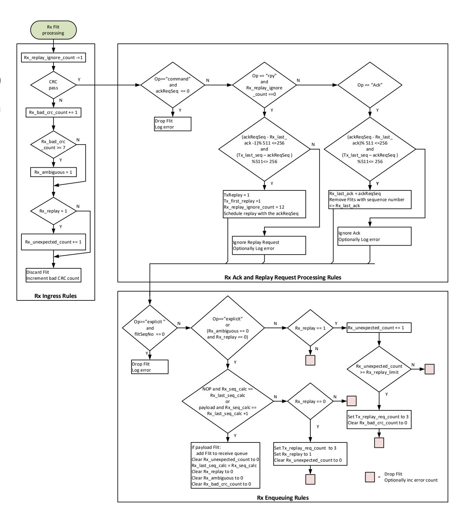

**Figure 6-20 Rx Flow Chart**

#### **6.6.6.10 Tx Flow Chart**

The Tx Flow chart is shown Below.

**Figure 6-21 Tx Flow Chart**

#### 6.6.7 Round Trip Time

The TxReplay buffer should be sized to cover the round-trip time of the Link, to prevent stalling the transmit pipeline. Once the TxReplay buffer is full the DL will stop accepting data from the TL, and NOP DL Flits will be sent.

The diagram in Figure 6-22 depicts the elements of round-trip time.

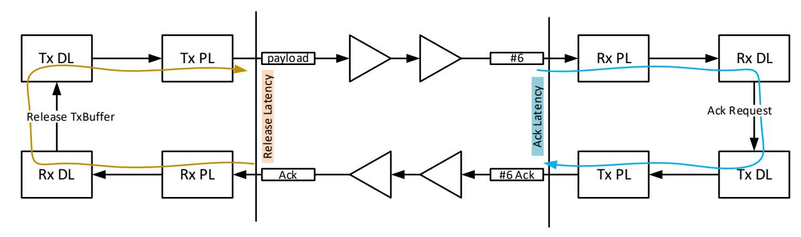

Figure 6-22 Round Trip Time

**Ack Latency**: This is the time from the first bit of an Explicit Sequence Number Flit received to the first bit of the Ack Flit, for the indicated sequence number, transmitted. This shall include any worst-case scheduling delay see section 6.6.6.7. Measured at the package pins.

**Release Latency**: This is the time from the first bit of an Ack Flit received to the first bit of the Payload Flit transmitted, when the TxReplay buffer is in a stalled state due to lack of Ack Flits. Measured at the package pins.

**Channel Latency**: This is the propagation time through the channel. This could include up to two Retimers and includes cable and other interconnect delays.

The RRT is equal to the sum of the Ack Latency + Release Latency + 2x channel latency.

Device vendors should publish their Ack Latency and Release Latency on the data sheets, as well Retimer Vendors should publish their latency on the data sheets.

For example, a RTT = 1,000ns for 200GBASE-KR1/CR1 would equal 25,000 bytes, or 40 Flits, rounded up.

# **6.7 Link State and Errors**

# **6.7.1 DL Link States**

The DL link state diagram is shown below.

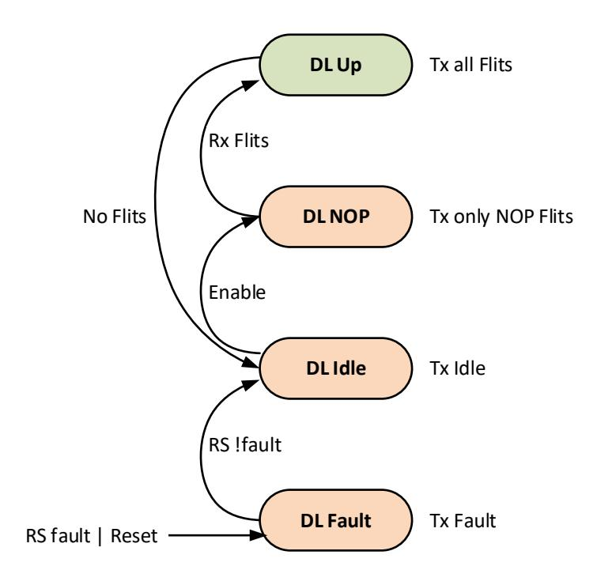

**Figure 6-23 DL Link State**

The DL has the flowing states:

#### **6.7.1.1 DL Fault**

The transmitter shall send Idle if receiving remote fault or send remote fault if a local fault is detected, in accordance with the Link Fault Signaling state machine in the RS. DL Fault is the reset state and can be entered from any state if a local or remote fault is indicated via the Link Fault Signaling state machine in the RS. The DL is link down in this state.

• The next state is DL Idle if the RS is not indicating any fault condition. The RS indicates fault condition when receiving local or remote faults from the PCS.

#### **6.7.1.2 DL Idle**

The transmitter shall send Idle. The DL is link down in this state.

- The next state is DL Fault if RS indicates a fault.
- The next state is DL NOP if enabled via a higher layer.

#### **6.7.1.3 DL NOP**

The transmitter will send only NOP DL Flits. The RS will inject codewords containing alignment markers or all Idle into the data stream as required. The replay state machine shall not expect ACKs in this state, the link partner may only be transmitting Idle. The DL is link down in this state.

- The next state is DL Fault if RS indicates a fault.
- The next state is DL Up if ten NOP DL Flits have been sent and two consecutive DL flits are received, the received DL Flits may be NOP Flits or payload Flits.

#### **6.7.1.4 DL Up**

The transmitter will send only NOP DL Flits or payload DL Flits. The RS will inject codewords containing alignment markers or all Idle into the data stream as required. The DL is link up in this state.

- The next state is DL Fault if RS indicates a fault.
- The next state is DL Idle if four consecutive control Flits are received by the RS.
- The next state is DL Idle if directed from an error containment event, se[e 6.7.4.](#page-39-0)
- The next state is DL Idle if directed from a time out event, see [6.6.6.8.](#page-34-0)

Note: four consecutive control Flits received by the RS, indicates that the link partner has moved to a link down state.

# **6.7.2 Correctable Errors**

Correctable errors are bit errors that may occur in the layers below the DL Replay function. These bit errors are either corrected by the PCS FEC or fail CRC and are replayed. FEC correction statistics are provided in the PCS FEC logic. CRC error counts, and replay counts are provided in the replay logic.

# **6.7.3 Uncorrectable Errors**

Uncorrectable errors may occur at layers above the DL replay function. These data and control paths shall have appropriate parity protection to detect soft or hard errors.

# **6.7.4 Error Containment**

The goal of error containment is to prevent propagation of data that is known to have errors.

#### **6.7.4.1 RS and PCS**

Error containment below the DL replay, i.e., RS and PCS is covered by FEC and CRC replay. Only data that passes FEC correction and DL CRC check is forwarded to the TL.

#### **6.7.4.2 Data Link**

Ingress Direction: After unpacking, the DL transfers TL Flits to the TL. If any TL Flits are determined to be in error, via parity error or other means, they are flagged as errored to the TL or dropped before transfer to the TL. Subsequent TL Flits are dropped.

Egress Direction: When the TL indicates an errored TL, or a parity error is detected during packing, the CRC for the DL Flit is inverted. This guarantees the DL Flit will fail CRC check at the link partner. Subsequent DL Flits are not sent to the RS, including NOP Flits.

In both cases above the DL goes link down, via a state transition to DL Idle.