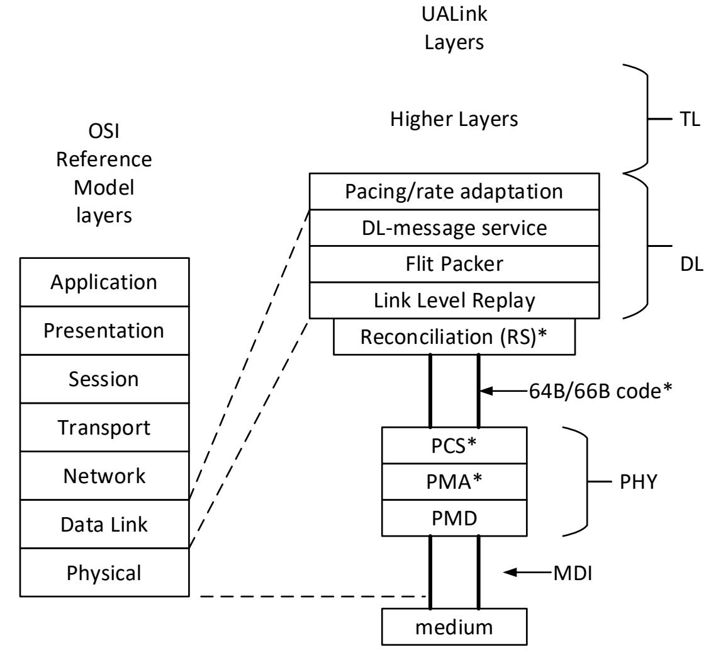
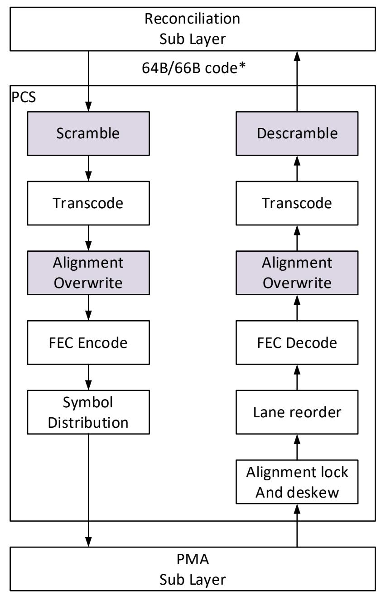
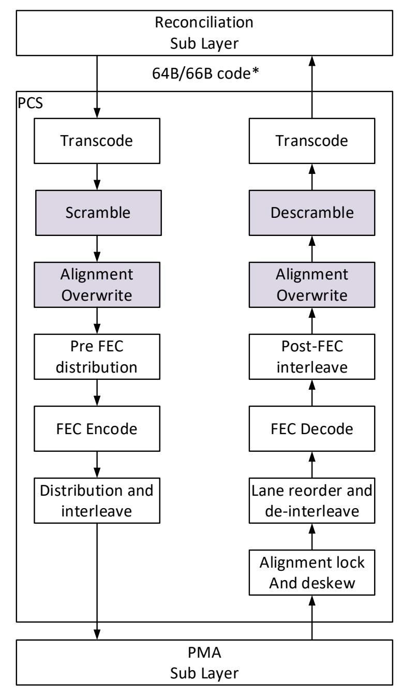

# **7 Physical Layer**

# **7.1 Introduction**

UALink Phy is based on 802.3 Ethernet Phy. UALink is defined for 1, 2, or 4 serial lanes running at a serial rate of 212.5Gbps (200GBASE-KR1/CR1, 400GBASE-KR2/CR2, 800GBASE-KR4/CR4) , as well as a lower speed serial rate option of 106.25Gbps (100GBASE-KR1/CR1, 200GBASE-KR2/CR2, 400GBASE-KR4/CR4).

The block diagram is shown below, where \* indicates modifications from IEEE 802.3. The PCS/PMA operates in additional codeword interleave modes, with reduced interleave, to achieve better FEC latency at the cost of decreased burst error correction. The PMD is unmodified from 802.3. Auto Negotiation and Link Training AN/LT is unmodified from 802.3. The 64B/66B encoding is a subset of what 802.3 supports.

The PCS and RS require additional behavior to synchronize DL Flits to codewords, so that 640-byte Flits from the DL fit exactly into one RS(544, 514) codeword. This will optimize latency and minimize replay Flits. The DL generates a CRC as part of each 640-byte DL Flit.

**Figure 7-1 Physical Layer Block Diagram**

#### **Ultra Accelerator Link Consortium Inc. (UALink) - UALink\_200 Rev 1.0 Specification**

Each port of a station can operate at a different data rate under certain error conditions and shall be capable of operating at a different data rates. The expected normal operation is that all Links of a Pod operate at the same data rate. All ports of a station shall be configured to operate at the same width. Port configuration, i.e. 1x4, 2x2, or 4x1 is determined prior to link training via front side network. All bifurcation modes should be supported. At least one bifurcation mode shall be supported.

The RS/PCS/PMA clauses from the 802.3 spec for 100Gbps serial that are defined for UALink are shown below. 100Gbps operation shall be supported.

| Rate             | RS  | FEC, PCS | PMA | interleave |
|------------------|-----|----------|-----|------------|
| 100GBASE-KR1/CR1 | 81  | 82, 91   | 135 | 1-way      |
| 200GBASE-KR2/CR2 | 117 | 119      | 120 | 2-way      |
| 400GBASE-KR4/CR4 | 117 | 119      | 120 | 2-way      |

**Table 7-1 100Gbps Serial Clauses**

The PCS/PMA clauses from the 802.3 spec for 200Gbps serial are shown below. 200Gbps shall be supported. These include the standard interleaves for 802.3 as well as latency reduced modes. The additional UALink latency reduced modes are strongly encouraged but not required.

| Rate                | RS  | PCS | PMA | Codeword interleave |       |                        |  |
|---------------------|-----|-----|-----|---------------------|-------|------------------------|--|
|                     |     |     |     | 802.3               |       | UALink latency reduced |  |
| 200GBASE KR1/CR1 | 117 | 119 | 176 | 4-way               | 2-way | 1-way                  |  |
| 400GBASE KR2/CR2 | 117 | 119 | 176 | 4-way               | 2-way |                        |  |
| 800GBASE KR4/CR4 | 170 | 172 | 176 | 4-way               |       |                        |  |

**Table 7-2 200Gbps Serial Clauses**

# **7.2 Reconciliation Sublayer (RS)**

# **7.2.1 Introduction**

The 64B/66B block encoding is used between the RS and PCS to describe the optional logical interface between the DL sublayer and the physical layer device.

UALink RS supports a subset of functions based on 802.3 RS Clauses listed below for reference.

- Based on clause 81 for CGMII
- Based on clause 117 for 200GMII and 400GMII
- Based on clause 170 for 800GMII

UALink RS supports the following functionality:

- The RS adapts the Flit format of the DL into a stream of 64B/66B blocks.
- Each data direction is independent.
- The RS generates continuous data or control 64B/66B blocks on the transmit path and expects continuous data or control 64B/66B blocks on the receive path.
- The RS participates in link fault detection and reporting by monitoring the receive path for status reports that indicate an unreliable link and generating status reports on the transmit path to report detected link faults to the peer on the remote end of the connecting link.
- Indicate local/remote fault to the DL, to aid in DL link up, link down determination.
- Support only a subset of 802.3 64B/66B encodings.
- Provides DL Flit to codeword alignment. Each 640-byte Flit that the DL generates shall fit exactly into one RS(544,514) codeword.
- Indication to PCS when alignment markers shall be overwritten in the Tx direction, and indication of when alignment markers are received in the Rx direction.
- Indication to DL for start of receive Flit.
- Indication to DL if the received Flit is a control Flit or a data Flit. Only data Flits are passed to the DL. Receiving control Flits Vs Data Flits is used in the DL for link up, link down determination in the DL Link State Machine.

# **7.2.2 Data Flow**

The UALink RS transmits a continuous stream of data or control 64B/66B blocks in the transmit direction and expects a continuous flow of data or control 64B/66B blocks on the receive path. When transmitting Data 64B/66B blocks they are back-to-back, there is no start or terminates blocks demarking the beginning and end of the DL Flit. A transmitted "Flit Code Sequence" consists of 80 consecutive 64B/66B code blocks. A transmitted Flit Code Sequence will have all data code blocks or all control code blocks. Data Flit Code Sequences originate and terminate at the DL. Control Flit Code Sequences originate and terminate at the RS.

From the DL perspective a Data Flit consists of 20, 256 blocks (640 bytes). These are logically serialized/deserialized by the RS into 80, 64B/66B, a Flit Code Sequence.

# **7.2.3 DL Flits**

By default, DL Flit Code Sequences are transmitted by the RS, the DL shall always provide DL Flits (either NOP or payload) to the RS. Only under fault conditions, DL link down (Idle state) or for

alignment marker insertion or Idle Codes for rate adaptation, will the RS transmit a Control Flit Code Sequence and block the DL from sending a DL Flit Code Sequence.

# **7.2.4 Control Flits**

Control Flits Code Sequence are used for the following purposes:

- 1. Link fault signaling
  - a. Local fault
  - b. Remote fault
- 2. When to overwrite alignment markers in Tx Direction.
- 3. When a Flit contains alignment markers in Rx Direction.
- 4. Idle transmission or reception
  - a. for rate matching
  - b. in response to receiving remote fault.

# **7.2.4.1 Idle Flit Code Sequence**

An Idle Flit Code Sequence consists of 80 consecutive 64B/66B control blocks with a block type of 0x1E, and every control code is /I/ in the 64B/66B block.

Idle Flit Code Sequences are transmitted as follows:

- When receiving remote fault indication.
- When the DL is in DL idle link state
- When the DL is in DL up or DL NOP states, see sectio[n 7.3.5](#page-9-0) for rate matching

## **7.2.4.2 Idle Start Flit Code Sequence**

An Idle Start Flit Code Sequence consists of 80 consecutive 64B/66B control blocks with the same content as an Idle Flit Code Sequence except the first eight transmitted 64B/66B control block has a block type of 0x78, and all data bytes are set to 0x00.

Idle Start Flit Code Sequences are transmitted as follows:

• When the RS determines that it is time to send an alignment marker, and the RS determines that it should not be sending Fault Flits, i.e. it is sending data Flits.

## **7.2.4.3 Fault Flit Code Sequence**

A fault Flit Code Sequence consists of 80 consecutive 64B/66B control blocks with a block type of 0x4B, indicating a sequence ordered set. There are two types of fault Flit Code Sequences, local and remote.

Fault Flit Code Sequences are transmitted as follows:

• During certain fault states.

## **7.2.4.4 Fault Start Flit Code Sequence**

A Fault Start Flit Code Sequence consists of 80 consecutive 64B/66B control blocks with the same content as a Fault Flit Code Sequence except the first eight transmitted 64B/66B control block has a block type of 0x78, and all data bytes are set to 0x00.

Fault Start Flit Code Sequences are transmitted as follows:

• When the RS determines that it is time to send an alignment marker, and the RS also determines that it should be sending Fault Flits.

# **7.2.4.5 Start Flit Code Sequences**

There are 2 types of start Flit Code Sequences, Idle Start Flit Code Sequences and Fault Start Flit Code Sequences. These Start Flit Code Sequences are transmitted RS to PCS to indicate the start of a Flit Code Sequence, and to indicate to the PCS when to overwrite an alignment marker. The Flit that is transmitted by the PCS will have the alignment markers in the first four to sixteen 256B/256B block codes, as a function of PCS clause.

# **7.2.4.6 Alignment Marker (AM) Flit Code Sequence**

Alignment marker Flit Code Sequences are only used in the Rx direction PCS to RS and are used by the RS to determine receive Flit alignment. An AM Flit Code Sequence consists of 80 consecutive 64B/66B control blocks. The first n transmitted 64B/66B control blocks have a block type of 0x78, and all data bytes are set to 0xFF. The remaining 64B/66B blocks have a block type of 0x1E, and every control code is /I/ in the 64B/66B block.

The value of n is a function of the length of the alignment markers, which is Clause and data rate dependent:

- Clause 91, 100G: 5\*4 = 20 64B/66B blocks
- Clause 119, 200G: = 4\*4 = 16 64B/66B blocks
- Clause 119, 400G: = 8\*4 = 32 64B/66B blocks
- Clause 172, 800G: = 16\*4 = 64 64B/66B blocks

#### AM Flits are transmitted as follows:

• AM flit Code Sequences are sent only when the PCS has achieved alignment lock. They are sent when the PCS is expected or does receive a codeword containing the alignment marker. Bit errors may impact alignment marker detection, this occurs prior to FEC decode. The AM Flit replaces the received Flit containing the alignment marker.

# **7.2.5 Data and Control Blocks and Codes**

A subset of control blocks and codes are supported from 802.3 Clause 82. The supported block codes are shown below.

| Input                      | Sync |            |                                                                                                          |                | В              | lock f         | Paylo          | ad             |   |                |                |                |
|----------------------------|------|------------|----------------------------------------------------------------------------------------------------------|----------------|----------------|----------------|----------------|----------------|---|----------------|----------------|----------------|
| Data                       | 0    | 0          |                                                                                                          |                |                |                |                | 65             |   |                |                |                |
| Data Block Format          |      |            |                                                                                                          |                |                |                |                |                |   |                |                |                |
| $D_0D_1D_2D_3D_4D_5D_6D_7$ | 01   | $D_0$      | D 0 D 1 D 2 D 3 D 4 D 5 D 6 |                |                |                |                |                |   | D 7 |                |                |
| Control Block Format       |      | Block Type |                                                                                                          |                |                |                |                |                |   |                |                |                |
| $C_0C_1C_2C_3C_4C_5C_6C_7$ | 10   | 0x1E       | C 0                                                                                           | $C_1$          | C 2 |                | C 3 | C,             | 1 | C 5 | C 6 | C 7 |
| $S_0D_1D_2D_3D_4D_5D_6D_7$ | 10   | 0x78       | $D_1$                                                                                                    | D 2 |                | D 3 |                | D 4 |   | D 5 | $D_6$          | D 7 |
| $O_0D_1D_2D_3Z_4Z_5Z_6Z_7$ | 10   | 0x4B       | $D_1$                                                                                                    | D 2 |                | D 3 | O 0 | 0x000_0000     |   |                |                |                |

Figure 7-2 64B/66B Block Codes

Data blocks use Sync header 01. Control blocks use sync header 10.

- Block type 0x1E is used for:
  - o Idle, C0 to C7 contain control codes for /I/.
  - o Error, C0 to C7 contain control codes for /E/.
- Block type 0x78 is used for:
  - o start of Flit indication for Flits related to alignment markers, i.e., Idle Start Flit, Fault Start Flit, and AM Flit.
- Block type 0x4B is used for:
  - o sequential ordered sets to indicate local or remote fault.

The sequential ordered set definition is shown below.

| Lane0    | Lane1 | Lane2 | Lane3 | Lane4 | Lane5 | Lane6 | Lane7 | Description          |
|----------|-------|-------|-------|-------|-------|-------|-------|----------------------|
| Sequence | 0x00  | 0x00  | 0x00  | 0x00  | 0x00  | 0x00  | 0x00  | Reserved             |
| Sequence | 0x00  | 0x00  | 0x01  | 0x00  | 0x00  | 0x00  | 0x00  | Local fault          |
| Sequence | 0x00  | 0x00  | 0x02  | 0x00  | 0x00  | 0x00  | 0x00  | Remote fault         |
| Sequence | 0x00  | 0x00  | 0x03  | 0x00  | 0x00  | 0x00  | 0x00  | Link Interruption |

**Table 7-3 Sequential Ordered Sets** 

The following control codes are supported.

| Control Character | Notation | 64B/66B code |  |  |
|-------------------|----------|--------------|--|--|
| Idle              | /I/      | 0x00         |  |  |
| Error             | /E/      | 0x1E         |  |  |

#### 7.2.6 Link fault signaling

Link fault signaling follows the 802.3 clause 81.3.4 with the exceptions described below.

Sublayers within the PHY are capable of detecting faults that render a link unreliable for communication. Upon recognition of a fault condition a PHY sublayer indicates Local Fault status on the data path. When this Local Fault status reaches an RS, the RS stops sending DL data Flits, and

Physical Layer

#### **Ultra Accelerator Link Consortium Inc. (UALink) - UALink\_200 Rev 1.0 Specification**

continuously generates a Remote Fault Flits on the transmit data path. When a Remote Fault Flit is received by an RS, the RS stops sending DL data Flits, and continuously generates Idle Flits. When the RS no longer receives fault status messages, it returns to normal operation, sending DL data Flits.

In the transmit direction all Link Fault indication shall transition on a Flit boundary. In the receive direction Link Fault indication is not required to transition on a Flit boundary, Retimers may not transition on a Flit boundary.

• Note: Standard Ethernet Retimers are not Flit aware.

The Link Fault sate diagram in 81.3.4 is modified as follows:

- When an AM Flit is received col\_cnt is not updated.
- 64B/66B encoding is used.

# **7.2.7 Flit and Lane Alignment**

In the transmit direction Start Flit Code Sequences are send at the interval required for the PCS to transmit alignment markers as a function of data rate:

- 100G: every 4,096 Flits
- 200G: every 4,096 Flits
- 400G: every 8,192 Flits
- 800G: every 16,384 Flits

The PCS shall overwrite the first n 257-bit blocks with alignment markers as a function of data rate:

- 100G: the first 5, 257-bit blocks
- 200G: the first 4, 257-bit blocks
- 400G: the first 8, 257-bit blocks
- 800G: the first 16, 257-bit blocks

The Start Flit Code Sequence in the transmit direction provides Flit synchronization to the PCS, so that each Flit is packed into a RS(5440, 5140) codeword.

In the Receive direction the alignment markers provide lane deskew and reorder to the PCS. In addition, the Start Flit Code Sequence is converted to an AM Flit Code Sequence by the PCS, and this provides Flit synchronization for the RS.

# **7.2.8 Receive State Machine**

The RS in the Rx direction shall determine the alignment of each group of 80 \* 64B/66B blocks that are destined for the DL. The receipt of the first 64B/66B block from the AM Flit indicates the nominal timing for each group of 80 \* 64B/66B blocks. Due to rate matching and Idle insertion or deletion this timing may need to be adjusted.

If Idles are inserted between DL Flits in the PCS for rate matching, then these Idles are consumed by the RS, the sync header indicates 0b10 for control codes. In addition, Idles are also found in the groups of the 80 \* 64B/66B blocks corresponding to Idle Flit Code Sequence, Idle Start Flit Code Sequence, or AM Flit Code Sequence . These are also consumed by the RS.

If Idles are removed from Idle Flit Code Sequence, Idle Start Flit Code Sequence, or AM Flit Code Sequence, the DL Flit will occur earlier than the nominal 80 \* 64B/66B block.

When the RS receives a sync header of 0b01 indicating data and the previous sync header was 0b10 indicating control, this always indicates the start of a Data Flit and all 80 \* 64B/66B blocks are sent to the DL. When the RS receives a sync header of 0b01 indicating data and a Data Flit was just received and sent to the DL, then the next 80 \* 64B/66B blocks are sent to the DL. This indicates the typical case of back-to-back DL Flits.

# **7.3 PCS/PMA modifications**

# **7.3.1 Introduction**

The various PCS/PMA clauses of 802.3 are modified in several ways:

- 1. Alignment markers frequency is determined by the RS, and they are used in the normal purpose of lane deskew and lane reorder, and in addition to align Flits to RS(544, 514) codewords.
- 2. Provide reduced codeword interleave ways to reduce latency.
- 3. No decode encode, the interface is specified at 64B/66B encoding.

# **7.3.2 DL Flit to PCS codeword alignment**

In Order to maintain DL Flit to PCS codeword alignment The RS designates an entire Flit for the purpose of transmitting the alignment markers. The PCS operation is slightly different than 802.3. Alignment markers are not inserted which would impact Flit to codeword alignment. Alignment markers are overwritten into the designated Start Flit Code Sequences.

In the transmit direction the PCS overwrites the first several 257-bit blocks (same step as alignment insertion) of the Start Flit Code Sequence with the alignment markers specified in the 802.3 clauses (91, 119, 172). The PCS uses the Start Flit Code Sequence to align groups of 80, 64B/66B blocks into one RS(544, 514) code word.

In the receive direction the Flit Code Sequences containing (or should contain) the alignment markers are converted to AM Flit Code Sequences in the PCS and used for Flit alignment by the RS. Flit Code Sequences are sent only when the PCS has achieved alignment. The AM Flit Code Sequence replaces the received Flit Code Sequence according to the alignment lock determined in the PCS.

The alignment markers on the wire are identical to 802.3, and serve the same purpose, lane deskew, and an additionally provide DL Flit alignment on Receive.

When developing the IP that exposes the 64B/66B interface between RS and PCS the DL Flit to PCS codeword alignment shall implement as specified in this chapter.

When developing IP that does not expose the 64B/66B interface, the DL Flit to codeword alignment may be implemented with a different mechanism, providing the behavior is identical on the wire, e.g. one DL Flit is contained in one codeword, and the codewords containing the alignment markers are as specified. For example, an implementation could have the PCS alignment insertion logic send a pulse to the RS indicating when it is inserting the alignment marker, and the RS would send the appropriate 256B/257B blocks, such that the insertion occurs just before the appropriate 256B/257B blocks. On the receive side the alignment markers are removed, and a side band signal indicates this, such that the RS can determine DL Flit alignment.

# **7.3.3 Reduced FEC interleave**

Additional PCS/PMA behavior at 200G and 400G that is different than 802.3 is defined as shown below. These options have less codeword interleave, and thus faster FEC decode time, with higher post FEC BER.

| Rate             | RS  | PCS  | PMA  | interleave |
|------------------|-----|------|------|------------|
| 200GBASE-KR1/CR1 | 117 | 119* | 176* | 1-way      |
| 200GBASE-KR1/CR1 | 117 | 119  | 176* | 2-way      |
| 400GBASE-KR2/CR2 | 117 | 172  | 176* | 2-way      |

**Table 7-4 Reduced Interleave FEC**

# **7.3.4 Decode Encode**

UALink is specified at the 64B/66B encoding level, and such encode/decode from xGMI is not defined.

# **7.3.5 Rate Matching**

The Tx RS injects Idle Flit code sequences at a rate of every 1024 codewords when the DL is in the DL up or DL NOP state, except when a codeword containing the alignment marker is sent. The codeword containing the alignment markers contain Idle Codes, which can be used for rate matching.

• Note: there are no natural idle code blocks with UALink as the DL Flits are packed exactly into a code word. With Ethernet there is IPG which results in sufficient idle code blocks for rate matching or clock compensation on the Rx.

When the DL is in the DL Idle or DL Fault state, there are continuous Idle codes, or sequence ordered sets to remove/add if needed for rate adaption.

See IEEE 802.3 clauses, 82.2.3.6 Idle (/I/) and 82.2.3.9 ordered set (/O/), for rules on rate matching.

Addition or removal of Idle codes or removal of sequence ordered sets shall occur on a 64B/66B block basis. This rule is more restrictive than clauses 82.2.3.6.

• Note: implementations that do not expose IP and the 64B/66B interface may choose to use a 256B/257B interface to skip the transcoding step. In this case the addition or removal of Idle codes or removal of sequence ordered sets shall occur on a four naturally aligned 64B/66B block or a single 256B/257B block.

\* Modified clauses for interleave.

# Evaluation Copy

#### **Ultra Accelerator Link Consortium Inc. (UALink) - UALink\_200 Rev 1.0 Specification**

The insertion of Idle Codes may occur between Data Flits and shall not occur in the middle of a Data Flit. Idle codes may be deleted from codewords containing alignment markers, or from an Idle code sequence, as needed.

The following subsections describe the transmit sequence when the DL is in the DL up or DL NOP state.

# **7.3.5.1 Tx Sequence 200GBASE-KR1/CR1**

The Tx sequence is as follows; alignment markers sent every 4096 codewords.

- 1. Codeword 0: Idle Start Flit Code Sequence, i.e. alignment marker indication
- 2. Codeword 1-1023: NOP or payload Flits
- 3. Codeword 1024: Idle Flit Code Sequence
- 4. Codeword 1025- 2047: NOP or payload Flits
- 5. …
- 6. Codeword 4096: Idle Start Flit Code Sequence, i.e. alignment marker indication
- 7. …

## **7.3.5.2 Tx Sequence 400GBASE-KR2/CR2**

The Tx sequence is as follows; alignment markers sent every 8192 codewords.

- 1. Codeword 0: Idle Start Flit Code Sequence, i.e. alignment marker indication
- 2. Codeword 1-1023: NOP or payload Flits
- 3. Codeword 1024: Idle Flit Code Sequence
- 4. Codeword 1025- 2047: NOP or payload Flits
- 5. …
- 6. Codeword 8192: Idle Start Flit Code Sequence, i.e. alignment marker indication
- 7. …

## **7.3.5.3 Tx Sequence 800GBASE-KR4/CR4**

The Tx sequence is as follows; alignment markers sent every 16384 codewords.

- 1. Codeword 0: Idle Start Flit Code Sequence, i.e. alignment marker indication
- 2. Codeword 1-1023: NOP or payload Flits
- 3. Codeword 1024: Idle Flit Code Sequence
- 4. Codeword 1025- 2047: NOP or payload Flits
- 5. …
- 6. Codeword 16384: Idle Start Flit Code Sequence, i.e. alignment marker indication
- 7. …

# **7.3.6 Back-to-Back DL Flits**

640-byte DL Flits are sent continuously, there is no IPG, start or terminate between DL Flits. With the exceptions noted above for control Flits, i.e. alignment markers and rate matching.

# **7.4 PCS and FEC for 100GBASE-R**

802.3 PCS Clause 82 and FEC Clause 91 are used for 100GBASE-KR1/CR1. Shown below is a simplified block diagram. Simplified in that UALink does not include the conversion of 20 FEC lanes into 4 PCS lanes, and the mapping of alignment markers. Colored blocks indicate changes from 802.3.

**Figure 7-3 100GBASE-R**

# **7.4.1 Removed functional Blocks**

Several functional blocks are made redundant when Clause 91 is added to clause 82. These are not present with UALink.

*Physical Layer* 191

# **7.4.1.1 Transmit direction**

- Clause 82.2.6 Block distribution
- Clause 82.2.7 Alignment marker Insertion
- Clause 91.5.2.1 Lane block synchronization
- Clause 91.5.2.2 Alignment lock and deskew
- Clause 91.5.2.3 Lane reorder
- Clause 91.5.2.4 Alignment marker removal

# **7.4.1.2 Receive Direction**

- Clause 91.5.3.6 Block distribution
- Clause 91.5.3.7 Alignment marker mapping and insertion
- Clause 82.2.12 block synchronization
- Clause 82.2.13 PCS Lane deskew
- Clause 82.2.14 PCS Lane reorder
- Clause 82.2.15 alignment marker removal

# **7.4.2 Transmit Function**

# **7.4.2.1 Scrambler**

See 802.3 clause 82.2.5, with the following additional requirements. The Start Flit Code Sequence's first twenty 64B/66B blocks bypass the scrambler, and the scrambler is not advanced. This allows the Alignment Overwrite block to decode the Start Flit Code Sequence and overwrite the first five 256B/257B blocks with the required alignment marker.

# **7.4.2.2 Transcode**

See 802.3 clause 91.5.2.5.

## **7.4.2.3 Alignment Marker Overwrite**

When a Start Flit Code Sequence is detected the alignment marker overwrite replaces the first five 256B/257B blocks with the alignment marker specified in 91.5.2.6.

# **7.4.2.4 FEC Encode**

See 802.3 clause 91.5.2.7. Only RS(544, 514) is supported.

# **7.4.2.5 Symbol distribution**

See 802.3 clause 91.5.2.8.

# **7.4.2.6 Transmit bit ordering**

See 802.3 clause 91.5.2.9.

# **7.4.3 Receive Function**

# **7.4.3.1 Alignment Lock and Deskew**

See 802.3 91.5.3.1. Static and dynamic deskew not required, this is a single lane.

## **7.4.3.2 Lane Reorder**

See 802.3 clause 91.5.3.2.

## **7.4.3.3 FEC decode**

See 802.3 clause 91.5.3.3. Only RS(544, 514) is supported.

# **7.4.3.4 Alignment Overwrite**

The Flit Code Sequence that is expected to contain the alignment markers (there could be bit errors) based on the alignment lock, is converted to an AM Flit Code Sequence.

## **7.4.3.5 Transcoder**

See 802.3 clause 91.5.3.5.

## **7.4.3.6 Descrambler**

See 802.3 clause 82.2.16, with the following additional requirements. The first twenty 64B/66B blocks of an AM Flit Code Sequence bypass the descrambler, and the descrambler is not advanced. The remaining sixty 64B/66B blocks of an AM Flit Code Sequence are descrambled, and the descrambler is advanced. This enables the RS to decode the AM Flit, and the Rx descrambler to stay synchronized with the Tx scrambler.

# **7.5 PCS for 200GBASE-R and 400GBASE-R**

802.3 Clause 119 PCS is used for 200GBASE-KR1/CR1, 200GBASE-KR2/CR2, 400GBASE-KR2/CR2 and 400GBASE-KR4/CR4. Shown below is the modified block diagram to support UALink. Colored blocks indicate changes from 802.3.

**Figure 7-4 200GBASE-R & 400GBASE-R**

# **7.5.1 Transmit Function**

# **7.5.1.1 Transcode**

See 802.3 clause 119.2.4.2.

# **7.5.1.2 Scrambler**

See 802.3 clause 119.2.4.3, with the following additional requirements. The Start Flit Code Sequence's first four/eight 256B/257B blocks bypass the scrambler, for 200G/400G operation. This allows the Alignment Overwrite block to decode the Start Flit Code Sequence and overwrite the first four or eight 256B/257B blocks with the required alignment marker.

# **7.5.1.3 Alignment Marker Overwrite**

When a Start Flit Code Sequence is detected the alignment marker overwrite replaces the first four 256B/257B blocks with the alignment marker specified in 119.2.4.4.1 for 200GBASE-R, or the first eight 256B/257B blocks with the alignment marker specified in 119.2.4.4.2 for 400GBASE-R.

## **7.5.1.4 Pre-FEC distribution**

See 802.3 clause 119.2.4.5.

# **7.5.1.5 FEC Encoder**

See 802.3 clause 119.2.4.6.

# **7.5.1.6 Distribution and interleave**

See 802.3 clause 119.2.4.7.

## **7.5.1.7 Transmit bit ordering**

See 802.3 clause 119.2.4.8.

# **7.5.1.8 Test pattern generator**

See 802.3 clause 119.2.4.9.

# **7.5.2 Receive Function**

## **7.5.2.1 Alignment Lock and deskew**

See 802.3 clause 119.2.5.1.

# **7.5.2.2 Lane reorder and de-interleave**

See 802.3 clause 119.2.5.2.

# **7.5.2.3 FEC decoder**

See 802.3 clause 119.2.5.3.

# **7.5.2.4 Post FEC interleave**

See 802.3 clause 119.2.5.4.

## **7.5.2.5 Alignment Marker Overwrite**

The Flit Code Sequence that is expected to contain the alignment markers (there could be bit errors) based on the alignment lock, is converted to an AM Flit Code Sequence.

## **7.5.2.6 Descrambler**

See 802.3 clause 119.2.5.6, with the following additional requirements. The first four/eight 256B/257B blocks of an AM Flit Code Sequence bypass the descrambler, and the descrambler is not advanced, for 200G/400G operation. The remaining sixteen/twelve 256B/257B blocks of an AM Flit Code Sequence are descrambled, and the descrambler is advanced. This enables the RS to decode the AM Flit Code Sequence, and the Rx descrambler to stay synchronized with the Tx scrambler.

# **7.5.2.7 Transcoder**

See 802.3 clause 119.2.5.7.

# **7.6 PCS for 800GBASE-R**

802.3 Clause 172 PCS is used for 800GBASE-KR4/CR4. Shown below is the modified block diagram to support UALink. Colored blocks indicate changes from 802.3.

**Figure 7-5 800GBASE-R**

# **7.6.1 Transmit Function**

# **7.6.1.1 Block Distribution**

See 802.3 clause 172.2.4.3.

# **7.6.1.2 Transcoder**

See 802.3 clause 172.2.4.4.

#### **Ultra Accelerator Link Consortium Inc. (UALink) - UALink\_200 Rev 1.0 Specification**

# **7.6.1.3 Scrambler**

See 802.3 clause 172.2.4.5, with the following additional requirements. The Start Flit Code Sequence's first sixteen 256B/257B blocks bypass the scramblers. There are two flows, each flow bypasses the eight 256B/257B blocks. This allows the Alignment Overwrite block to decode the Start Flit Code Sequence and overwrite the first eight 256B/257B blocks (per flow) with the required alignment markers.

# **7.6.1.4 Alignment Marker Overwrite**

When a Start Flit Code Sequence is detected the alignment marker overwrites the first eight 256B/257B blocks with the alignment marker specified in 172.2.4.6. There are two flows, each flow overwrites the first eight 256B/257B blocks, see figure 172-3 in 802.3 spec.

# **7.6.1.5 Pre-FEC distribution**

See 802.3 clause 172.2.4.7.

# **7.6.1.6 FEC Encoder**

See 802.3 clause 172.2.4.8.

# **7.6.1.7 Symbol distribution**

See 802.3 clause 172.2.4.9.

# **7.6.1.8 Transmit bit ordering**

See 802.3 clause 172.2.4.10.

# **7.6.1.9 Test Pattern Generation**

See 802.3 clause 172.2.4.11.

Evaluation Copy

# **7.6.2 Receive Function**

## **7.6.2.1 Alignment lock and deskew**

See 802.3 clause 172.2.4.1.

## **7.6.2.2 Lane reorder and de-interleave**

See 802.3 clause 172.2.4.2.

# **7.6.2.3 FEC decode**

See 802.3 clause 172.2.4.3.

# **7.6.2.4 Post FEC interleave**

See 802.3 clause 172.2.4.4.

## **7.6.2.5 Alignment Marker Overwrite**

The Flit Code Sequence that is expected to contain the alignment markers (there could be bit errors) based on the alignment lock, is converted to an AM Flit Code Sequence. There are two flows, each flow creates ½ an Interleaved AM Flit Code Sequence. Even 64B/66B blocks on flow 0, odd 64B/66B blocks on flow 1. Each ½ AM Flit Code Sequence is identical and contains the following:

- Thirty-two 64B/66B block type of 0x78, and all data bytes are set to 0xF
  - o Transcoded to Eight 256B/257B blocks
- Eight 64B/66B block type of 0x78, and all data bytes are set to 0xFF
  - o Transcoded to Two 256B/257B blocks

# **7.6.2.6 Descrambler**

See 802.3 clause 172.2.4.6, with the following additional requirements. The first eight 256B/257B blocks (per flow) of an AM Flit Code Sequence bypass the descrambler, and the descrambler is not advanced. The remaining twelve 256B/257B blocks of an AM Flit Code Sequence are descrambled, and the descrambler is advanced. This enables the RS to decode the AM Flit, and the per flow Rx descrambler to stay synchronized with the per flow Tx scrambler.

## **7.6.2.7 Transcoder**

See 802.3 clause 172.2.4.7.

# **7.6.2.8 Block collection**

See 802.3 clause 172.2.4.8.

# **7.7 Low Latency FEC Interleave**

# **7.7.1 400GBASE-KR2/CR2 (2-way interleave)**

802.3 specification defines 4-way interleave of 400GBASE-KR2/CR2. 2-way interleave occurs in the PCS via 10-bit distribution to two FEC encoders, see Clause 119.2.4.8. An additional 2-way interleave occurs in the PMA via delaying odd symbols 2 codewords, see Clause 176.4.2.4.2, for a total of 4-way interleaving.

UALink defines a mode of operation for 2-way interleave.

- Clause 176.4.2.4.2 in the transmit direction is modified as follows: The PMA does not perform the additional two codeword delay.
- Clause 176.4.3.3 in the receive direction is modified as follows: The PMA adds a delay of only one FEC symbol to each even lane (not 69 FEC symbols).

# **7.7.2 200GBASE-KR1/CR1 (2-way interleave)**

802.3 specification defines 4-way interleave of 200GBASE-KR1/CR1. 2-way interleave occurs in the PCS via 10-bit distribution to two FEC encoders, see Clause 119.2.4.8. An additional 2-way interleave occurs in the PMA via delaying odd symbols 2 codewords, see Clause 176.4.2.4.2, for a total of 4-way interleaving.

UALink defines a mode of operation for 2-way interleave.

- Clause 176.4.2.4.2 in the transmit direction is modified as follows: The PMA does not perform the additional two codeword delay.
- Clause 176.4.3.3 in the receive direction is modified as follows: The PMA adds a delay of only one FEC symbol to each even lane (not 137 FEC symbols).

# **7.7.3 200GBASE-KR1/CR1 (1-way interleave)**

802.3 specification defines 4-way interleave of 200GBASE-KR1/CR1. 2-way interleave occurs in the PCS via 10-bit distribution to two FEC encoders, see Clause 119.2.4.8. An additional 2-way interleave occurs in the PMA via delaying odd symbols 2 codewords, see Clause 176.4.2.4.2, for a total of 4-way interleaving.

UALink defines a mode of operation for 1-way interleave.

• Clause 176.4.2.4.2 in the transmit direction is modified as follows: The PMA does not perform the additional two codeword delay.

#### **Ultra Accelerator Link Consortium Inc. (UALink) - UALink\_200 Rev 1.0 Specification**

• Clause 176.4.3.3 in the receive direction is modified as follows: The PMA adds a delay of one FEC symbol to each even lane (not 137 FEC symbols).

Note: RS symbols are interleaved in symbol-pairs (consistent with CL176).

In addition, the PCS does not perform 10-bit symbol distribution to two FEC encoders, to reduce to 1-way interleave.

# **7.7.3.1 PCS Transmit changes**

Clause 119.2.4.5 Pre-FEC distribution is not performed and a single FEC encoder is used. 802.3 figure 119-10 is updated as follows.

**Figure 7-6 200GBASE-KR1/CR1, 1-Way Interleave** 

## **7.7.3.2 PCS Receive changes**

The following Clauses of 802.3 are modified:

• Clause 119.2.5.2 Lane reorder and de-interleave, de-interleave is not performed, and the single stream is sent to a single FEC decode.

*Physical Layer* 201

• Clause 119.2.5.4 Post FEC interleave is not performed, there is a single stream from the FEC decode.