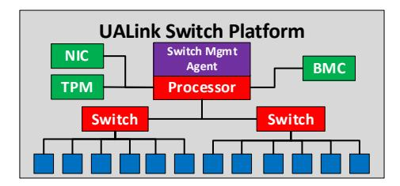
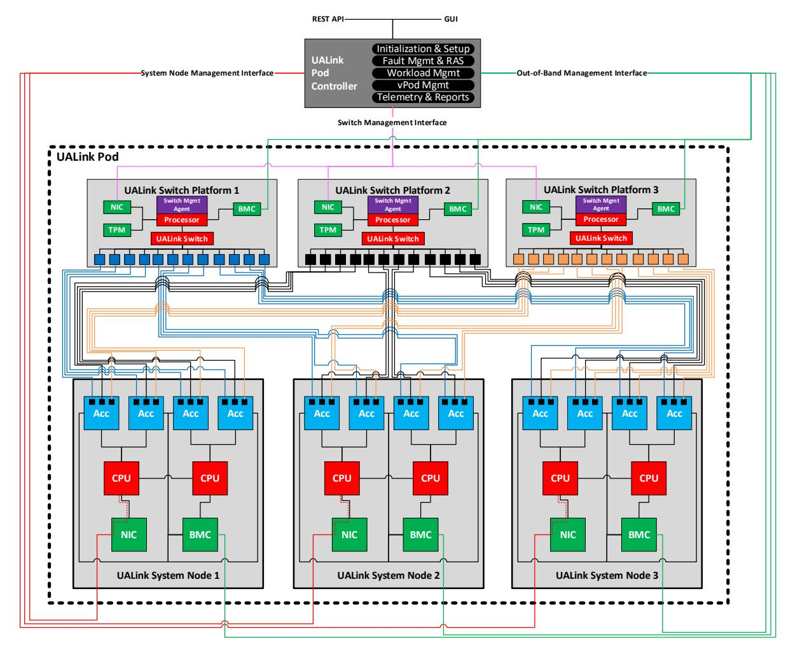

# **8 Manageability Requirements**

A UALink Pod is comprised of one or more UALink Accelerators connected via the UALink fabric, and managed by a UALink Pod Controller. Each Accelerator is hosted on a UALink System Node, and Accelerator traffic may be routed through the UALink fabric via UALink Switches. Multiple UALink Pods may be connected to create even larger Accelerator clusters; however, inter-Pod communication is outside the scope of this specification. While a brief overview of these components and their management interfaces is provided below, the full solution is documented in the separate *Ultra Accelerator Link Manageability Specification.*

## **8.1 UALink Accelerators and System Nodes**

UALink System Nodes shall contain at least one UALink Accelerator, at least one high-performance host CPU to schedule and launch compute jobs, and at least one network interface. Commonly, a System Node should also include a baseboard management controller (BMC) for chassis management tasks and an interface for out-of-band management. The System Node acts as an OS Domain in that a single instance of an operating system or hypervisor may utilize all Accelerators in the System Node, or assign them to tenant Virtual Machines (VMs).

Each System Node shall host one or more Node Management Agents that communicate with the Pod Controller as specified in the *Ultra Accelerator Link Manageability Specification.* Node Management Agents perform fabric management functions on the System Node such as adding Accelerator(s) on the System Node to a Virtual Pod by configuring the UALink ports. In the case of SR-IOV enabled Accelerators, the Node Management Agents shall only communicate with the Physical Function (PF) drivers that run in the host OS domain and are outside the trust boundary of any confidential VM.

In aggregate across the Pod, the System Nodes may host up to 1024 Accelerators. Accelerators targeted for a Confidential Compute[1](#page-0-0) use case must support a minimum baseline of security features.

The following figure illustrates one possible UALink System node with four UALink Accelerators (each with three ports), two host CPUs, a NIC, and a BMC.

**Figure 8-1 UALink System Node**

## **8.2 UALink Switches and Switch Platforms**

*Manageability Requirements* 203

1 https://confidentialcomputing.io/

UALink Switches are responsible for routing traffic between Accelerators, and are managed by software/firmware called a Switch Management Agent. Physical Switches are implemented in hardware, but may be partitioned into multiple Switches for purposes of routing and creating Virtual Pods.

Often, Physical Switches are hosted on Switch Platforms that run the Switch Management Agent on a processor (such as an x86 CPU or a Baseboard Management Controller). The processor is attached to each Physical Switch via a high-speed interface such as PCIe, as well as to a network interface for communication with the Pod Controller. Commonly, for security and identity purposes, a Switch Platform contains one or more e/iRoTs (Root of Trust) and/or a trusted platform module (TPM). A Switch Platform may contain a separate BMC for platform management.

The Switch Management Agent shall interface with the Switches as specified in the *Ultra Accelerator Link Manageability Specification.* Detailed requirements for UALink Switches are included in the *Switch Requirements* chapter of this specification.

The following figure illustrates one possible UALink Switch Platform with a Switch Management Agent running on a processor, managing two Physical Switches each with six ports. In this implementation, the processor and Physical Switches are separate devices. The Switch Platform also contains a NIC, a TPM, and a BMC separate from the processor.

**Figure 8-2. A UALink Switch Platform**

## **8.3 UALink Pod Controller**

The UALink Pod Controller software shall act as the centralized manager of the Pod's resources, and should run external to the System Nodes and Switch Platforms under its management. Its responsibilities include:

- Pod resource configuration
- Validation of Pod wiring against UALink rules and user-defined policies
- Allocation and assignment of Accelerator IDs
- Setup and teardown for Switch routing
- Managing Pod RAS including error recovery and log collection
- Pod health management
- Pod telemetry collection

The Pod Controller interacts with several interfaces relating to the Pod:

- It connects with each Node Management Agent to assign Accelerator IDs.
- It connects with each Switch Management Agent to configure ports and set up routing information for the Pod.
- It may connect to each Switch Platform or System Node's BMC to do out-of-band management such as via Redfish[2](#page-1-0) .

*Manageability Requirements* 204

2 https://www.dmtf.org/standards/redfish

• It may present one or more Pod-external interfaces such as a REST API, GUI, or command terminal.

A singular Pod Controller manages the Pod at any given time. However, implementations should consider Pod Controller architectures that permit high availability/redundancy/failover.

The following figure illustrates a UALink Pod containing a Pod Controller, three Switch Platforms, and three System Nodes. Each Switch Platform features a single Physical Switch with twelve ports, managed by a Switch Management Agent. Each System Node features four Accelerators, each with three ports. The Pod Controller utilizes multiple logical interfaces for both managing the Pod as well as for interaction outside of the Pod.

**Figure 8-3. A UALink Pod managed by a Pod Controller**

## **8.4 UALink Virtual Pods**

A workload may require all the Accelerators in a Pod to meet its compute needs or it may require only a subset of the Accelerators. To use the Pod resources efficiently, the Pod Controller may permit partitioning the Pod into Virtual Pods. The Virtual Pods are assignable to individual tenants, allowing multiple tenants to share the Pod and run their workload in their respective partitions concurrently. These Virtual Pods may be restricted to a single Accelerator within a System Node,

may encompass multiple Accelerators within the same System Node, or may span multiple System Nodes (up to all the Accelerators in the Pod) via the Switches. Virtual Pods also require compute and network resources (i.e., for use by virtual machines that run on the System Node's host CPUs).

An Accelerator shall not belong to more than a single Virtual Pod at a given time. Further, Accelerators that are members of a Virtual Pod shall be assigned as a whole; fractional assignment of Accelerators is not permitted in a Virtual Pod. If SR-IOV is utilized on an SR-IOV capable Accelerator, only a single SR-IOV Virtual Function (VF) shall be configured (even when the Accelerator supports multiple VFs). The VF shall be assigned to the VM on the System Node to which the Accelerator is attached.

Each System Node participating in a Virtual Pod hosts the tenant VM, and the appropriate Accelerators on the System Node are assigned to that VM. The VM hosts the device driver, e.g. VF drivers for SR-IOV supported Accelerators, that send control messages to the Accelerator for configuring the Accelerator including the UALink ports (VM/VF specific configuration) and programming the device for data transfers between VM and Accelerator and between peer Accelerators in a Virtual Pod.

The following figure illustrates a UALink Pod that has been partitioned by the Pod Controller into three Virtual Pods. Virtual Pod 1 contains a subset of the Accelerators in System Node 1. Virtual Pod 2 contains a subset of the Accelerators in both System Nodes 1 and 2. Virtual Pod 3 contains all the accelerators in System Node 3. One Accelerator on System Node 2 is not part of any Virtual Pod and is excluded from routing tables on the Switches.

**Figure 8-4. A UALink Pod partitioned into three Virtual Pods**

## **8.5 Manageability Workflows**

The requirements for managing a UALink Pod are documented in the *Ultra Accelerator Link Manageability Specification*, including workflows for:

#### **Ultra Accelerator Link Consortium Inc. (UALink) - UALink\_200 Rev 1.0 Specification**

- Accelerator and Switch admission to the Pod
- Pod topology discovery and validation
- Switch configuration including partitioning and routing table setup
- Virtual Pod creation
- Link, Accelerator, and Switch failure and recovery
- Error reporting such as drop counters and link state changes
- Accelerator telemetry such as transmit/receive statistics
- Switch telemetry such as port-level statistics and Switch health reporting