## **9 Security**

The UALink link Protection feature, referred to as UALinkSec, is intended to protect traffic on a UALink network from a physically present adversary; the adversary might be present at the time of the attack or may have placed a device (e.g., an interposer) to snoop or tamper with the UALink traffic. Additionally, in platforms that support Confidential Computing (CC), UALinkSec protects the Tenant data on a UALink network from the infrastructure provider and from other Tenants potentially collocated on the same UALink cluster. CC implies that a Trusted Execution Environment (e.g., Intel TDX, AMD SEV and ARM CCA) exists on the platform; the TEE under the control of the Tenant is responsible for UALinkSec configuration. When enabled, UALinkSec minimally provides data confidentiality and optionally data integrity (including replay protection). The next section provides an example of system used to illustrate UALinkSec principles followed by the Security Model in Section [9.3.](#page-1-0)

## **9.1 References**

SPDM: Security Protocol and Data Model (SPDM) over MCTP Binding Specification:

<https://www.dmtf.org/dsp/DSP0275>

AES-GCM: NIST Special Publication 800-38D Recommendation for Block Cipher Modes of Operation- Galois/Counter Mode (GCM) and GMAC:

<https://nvlpubs.nist.gov/nistpubs/Legacy/SP/nistspecialpublication800-38d.pdf>

NIST Recommendation for Block Cipher Modes of Operation: Galois/Counter Mode (GCM) and GMAC:

<https://csrc.nist.gov/pubs/sp/800/38/d/final>

TDISP: Refer to PCIe Express specification for TDISP:

<https://pcisig.com/specifications>

Key Derivation Function: NIST reference for Key Derivation Functions<https://nvlpubs.nist.gov/nistpubs/SpecialPublications/NIST.SP.800-56Cr2.pdf>

## **9.2 System Overview**

An UALink Pod is comprised of a set of System Nodes each of which may have one or more accelerators. Each accelerator will have one or more UALink ports. The accelerators within the POD communicate with each other via a switch-based UALink fabric. It is assumed that every accelerator in a POD can communicate with every other accelerator in the POD. The Pod shall be managed by a central Pod Controller software, running on platform(s) outside of the Pod, that works in concert

## **Ultra Accelerator Link Consortium Inc. (UALink) - UALink\_200 Rev 1.0 Specification**

with Node Management Agents on the System Node. The system software such as host OS and hypervisor are responsible for performing actual resource management and scheduling on each System Node as directed by the Pod Controller.

When a tenant workload needs to run on a Pod, the Pod Controller may create a Virtual Pod that contains the number of accelerators needed by the tenant and configure the accelerator's UALink ports as well as the UALink switches for communication within that Virtual Pod. Each System Node shall run tenant software, such as a tenant VM, and the accelerators (including the UALink ports) that are part of tenant's Virtual Pod shall be assigned to the tenant VM, with the actual assignment tasks performed by the OS or hypervisor on the System Nodes.

The tenant VMs on each System Node shall configure the accelerators including programming of tenant specific keys. The tenant VMs belonging to different System Nodes may communicate using frontside networking regarding configuration and programming of accelerators in the Virtual Pod level.

There are two distinct role-based software execution domains; one is the infrastructure owner controlled remote and local management software (and firmware) that manage compute and networking resources at Pod and System Node level and the other is the tenant software that run on the compute resources assigned to it and use the UALink network to allow its accelerators to access each other's data. The UALink security for confidential computing use requires HW enforced isolation of these two execution domains to provide strong security assurance to the tenant application in presence of potential SW and HW exploits in the datacenter,

For more details on the manageability aspects of an UALink pod including virtual POD creation and POD lifecycle, refer to the manageability chapter in this specification.

## **9.3 Security model**

This section describes the security objectives for the UALink Link Protection feature, the corresponding TCB (Trusted Computing Base) and the adversary profile and capabilities.

One of the use cases for the UALink protection feature is Confidential Computing (CC). Confidential Computing mandates the most stringent threat model for the use cases envisioned, where the Infrastructure provider is not trusted. As such, the security model presented in this section is defined with CC in mind; UALinkSec aims at providing the owner of a Virtual Pod (called the Tenant hereafter) control over the security of its data, without reliance on the Infrastructure provider to meet the security objectives stated below.

## **9.3.1 Security objectives:**

The UALink link protection feature aims at providing confidentiality and optional integrity (including replay protection) for data exchanged between accelerators belonging to the same Virtual Pod.

These security objectives are qualified by the adversary profile and capabilities described in Section [9.3.3.](#page-2-0)

Note: Availability is not in scope for the UALink link protection feature, and it is considered the responsibility of the infrastructure provider.

## **9.3.2 Trusted Computing Base (TCB)**

The TCB describes the trusted elements that UALinkSec relies on to meet its security objectives:

- The *Tenant* is at the heart of the TCB as it deploys TVM (aka Trusted OS domains) that control the accelerators in the Virtual Pod assigned by the Pod controller
- All the accelerators (hardware and firmware) belonging to the Virtual Pod assigned to the Tenant are trusted, after they are brought in TCB. The accelerators in an OS domain are brought in TCB by the TVM through standard secure mechanisms for authentication and attestation (e.g., SPDM, DICE) that are out of scope for the UALinkSec specifications. For instance, if the accelerators are attached through PCIe to the Host CPUs running the TVM, the PCI SIG TDISP standard should be leveraged by the TVM to bring the accelerators in TCB.

For clarity, the untrusted agents are captured below. However, the list is not exhaustive, and any agents not listed as part of the TCB shall be considered untrusted:

- The UALink switch hardware and firmware are not trusted.
- All control and management firmware and software provided by the infrastructure provider are untrusted, including the hypervisor running on the Host CPU as well as the Pod controller software and firmware running on a BMC or potentially as a service process on Host CPUs.
  - o Note: Our threat model addresses the scenario where a host SW arbitrarily adds or removes a Virtual Pod member with malicious intent.

## **9.3.3 Adversary profile and capabilities**

[Table 9-1](#page-2-1) below describes the types of attack the adversary can attempt to mount an exploit.

**Table 9-1 Possible attack types**

| Adversary tools        | Description                                                                                                                      | Adversary goal                                                                                                                                          |
|------------------------|----------------------------------------------------------------------------------------------------------------------------------|---------------------------------------------------------------------------------------------------------------------------------------------------------|
| Transaction snooping   | The adversary extracts UALink packets at any accessible interface to read, analyze UALink traffic                          | Read cleartext. Retrieve ciphertext to observe and analyze patterns.                                                                                 |
| Transaction corruption | The adversary either replaces genuine packets on UALink link with chosen ones or flip specific bits of packets in transit. | The purpose of the adversary is to get the corrupted packets accepted and consumed at destination.                                                |
| Transaction replay     | The adversary records packets and injects them later on.                                                                      | The purpose of the adversary is to get the replayed packets accepted and consumed at destination.                                                 |
| Transaction deletion   | The adversary intercepts and drops a packet sent by a source in order for the destination to never receive it.             | The purpose of the adversary is to get the destination to consume stale data, for instance by preventing a memory location from being updated. |
| Transaction injection  | The adversary crafts a packet it injects toward an accelerator of its chance.                                                 | The purpose of the adversary is to get the injected packets accepted and consumed at destination.                                                 |
| Endpoint spoofing      | The adversary assumes the identity of a valid endpoint                                                                        | The purpose of the adversary is to steal sensitive data by sending read requests or receiving read response.                                      |

UALinkSec aims at countering two types of adversaries: physically present and remote adversaries.

## **Ultra Accelerator Link Consortium Inc. (UALink) - UALink\_200 Rev 1.0 Specification**

The *Physically present adversary* may be an Infrastructure provider employee, a system debugger or an intruder getting physical access to the UALink Network to perform the malicious operations specified in [Table 9-1](#page-2-1) and build a successful exploit. Such an adversary may:

- Perform a live attack while being physically present, e.g., by probing the UALink links
- Place an interposer to snoop or inject packets in live traffic at a later time
- Replace accelerators with vulnerable ones or from malicious manufacturers, untrusted by the Tenant

The *Remote adversary* typically leverages firmware or software vulnerabilities in the system to gain access to the UALink traffic and perform the malicious operations specified in [Table 9-1](#page-2-1) and build a successful exploit.

Note: An adversary may be a hybrid of the two profiles above, where a physically present adversary (e.g., system debugger) leverages a vulnerable firmware or software to build a successful exploit.

## **9.3.4 Security Assumptions**

UALinkSec has been defined with the following security assumptions:

- It is expected that the platform security solution and the accelerator design provide a mechanism for the Tenant to securely configure the UALink endpoint (e.g. configure encryption settings) and program the Tenant specific master key(s). The exact mechanism is out of scope for the UALink specification and is implementation specific.
- The UALink fabric is ordered, i.e., packets are processed cryptographically in the same order at the source and at the destination.
- Packet headers for both request and response are expected to be encrypted to meet the UALinkSec security objectives, except fields required for routing, request/response compression and flow control. When integrity protection is enabled, fields required for routing, request/response compression and flow control are integrity protected but shall remain in plaintext.
- When an accelerator is accepted by the Tenant as part of its Virtual Pod and UALinkSec is enabled, all the traffic is protected with UALinkSec, i.e., we do not support mixing protected and unprotected traffic.
- Key materials shall be adequately protected in the accelerator to minimally meet the threat model defined in this specification. How this is achieved is outside the scope of this specification and implementation specific.
- The firmware and software ingredients in TCB are free from vulnerabilities and are not exploitable by the adversary.
- The hardware ingredients in TCB are free from defects and their capabilities (e.g., privilege debug capability) cannot be exploited by the adversary.

## **9.3.5 Threat model**

Threat model is given i[n Table 9-2](#page-4-0) below:

**Table 9-2 Threat model**

| Threat description                                                                                                                                                             | Mitigation                                                                                                                                                                                                                                                                                                                                                                                                                                                                                                                                                                                                                                                                                                                                                                   |
|--------------------------------------------------------------------------------------------------------------------------------------------------------------------------------|------------------------------------------------------------------------------------------------------------------------------------------------------------------------------------------------------------------------------------------------------------------------------------------------------------------------------------------------------------------------------------------------------------------------------------------------------------------------------------------------------------------------------------------------------------------------------------------------------------------------------------------------------------------------------------------------------------------------------------------------------------------------------|
| 1. Adversary gets access to UALinkSec secrets (e.g., keys or encrypted traffic)                                                                                          | UALink traffic is encrypted on interfaces accessible to the adversary. Keys are kept inside the accelerators. It is the responsibility of the accelerator manufacturer to properly protect key storage and programing from Adversaries in scope for UALinkSec. The following requirements shall be met:                                                                                                                                                                                                                                                                                                                                                                                                                                                             |
|                                                                                                                                                                                | Secrets shall not be included in unencrypted headers A monotonic counter is used to generate the Invocation field of the IV Follow the recommended number of key invocation limit before refreshing the key.                                                                                                                                                                                                                                                                                                                                                                                                                                                                                                                                                           |
| 2. Adversary injects chosen UALink packets or corrupts packets between two UALink ports                                                                               | When integrity protection is enabled, an integrity tag is calculated at the destination port and verified against the integrity tag carried in the received packet. Since the adversary does not have the key, an injected or corrupted packet is detected by failure of the verification of the integrity tag. Note: when integrity protection is not enabled, the decryption of the injected or corrupted packet will likely result in unexpected behavior as decryption will use a different counter                                                                                                                                                                                                                                                       |
| 3. Adversary replays UALink packets                                                                                                                                         | value than the one used for encryption of the packet. When integrity protection is enabled, an integrity tag is verified at the destination port. The integrity tag computation is based on a counter (nonce) that is incremented for each packet received. When the adversary replays a packet, the counter used by the destination port for integrity tag calculation is different than the counter that was used for the tag carried with the replayed packet, resulting in a tag mismatch and replay detection. Note: when integrity protection is not enabled, the decryption of the replayed packet will likely result in unexpected behavior as decryption will use a different counter value than the one used for encryption of the packet. |
| 4. Adversary intercepts and drops packet(s) between two UALink ports                                                                                                     | When integrity protection is enabled, an integrity tag is verified at the destination port. The integrity tag computation is based on a counter (nonce) that is incremented for each packet received. The dropped packet is detected as soon as the next packet is received, as a counter mismatch triggers a failure of the integrity tag verification.                                                                                                                                                                                                                                                                                                                                                                                                            |
| 5. Adversary leverages a vulnerability in the switch to snoop on traffic or inject traffic                                                                               | The switch is outside the TCB and only sees encrypted and integrity protected traffic. It does not have the key required to properly encrypt and integrity protect UALink packets. As a result, any attack from the switch is mitigated in the same way as for Threat 1, 2, 3 and 4 above.                                                                                                                                                                                                                                                                                                                                                                                                                                                                          |
| 6. Adversary (i.e., infrastructure provider) includes a vulnerable accelerator (e.g., running known vulnerable firmware) in the Virtual Pod offered to the Tenant. | UALinkSec requires the Tenant to authenticate and attest the accelerators in the Virtual Pod before distributing the secret keys necessary to send and receive encrypted UALink traffic. Through authentication and attestation, the Tenant verifies the accelerators offered by the infrastructure provider meet its policy requirements.                                                                                                                                                                                                                                                                                                                                                                                                                          |
| 7. Adversary swaps an accelerator with malicious one after initial authentication and attestation                                                                     | UALinkSec provides runtime binding. The initial accelerator authentication and attestation at Virtual Pod creation/acceptance by the Tenant, is extended through the life of the Virtual Pod by establishing the shared secret used for traffic encryption. If the adversary swaps a genuine device with a malicious one, the malicious device cannot participate in the Virtual Pod traffic as it does not know the necessary secret key to send and receive traffic.                                                                                                                                                                                                                                                                                           |
| 8. Brute force attack by observing cipher text on UALink link and knowledge of plaintext from workload analysis. Goal of the adversary is to retrieve the key.     | UALinkSec uses AES-GCM with 256b following NIST recommendations – to prevent adversary from retrieving the secret key or plaintext from ciphertext.                                                                                                                                                                                                                                                                                                                                                                                                                                                                                                                                                                                                                       |

## **9.4 UALink System Security**

The confidential computing capable UALink system is assumed to have baseline TEE capabilities on each system node.

Following assumptions are made about the UALink system

- A Pod may have a mix of confidential and non-confidential Virtual Pods running concurrently
- An accelerator that is part of a multi-accelerator virtual POD shall be assigned to a single tenant e.g. single VM if virtualized. An accelerator that is partitioned into multiple virtual functions (i.e., multiple virtual accelerator instances) and assigned to multiple VMs shall not be added to a Virtual Pod and shall not be allowed to access the UALink fabric.

## **Ultra Accelerator Link Consortium Inc. (UALink) - UALink\_200 Rev 1.0 Specification**

- UALink subsystem shall be disabled and isolated from all other accelerator subsystems if the accelerator is not configured for communicating via UALink fabric. The accelerators that are not configured for scale-up shall not allow access to or from the UALink fabric to prevent network attacks
- CC and non-CC workloads shall be in separate virtual PODs

The following security features are assumed on the CPU:

- Shall be TEE capable allowing Tenant data and control on the host to be protected in a TVM.
- Shall support TEE-IO to allow bringing TEE capable accelerators into TVM's TCB.. While UALinkSec does not mandate it, it is recommended that CPU has TEE-IO support (for e.g., AMD SEV-IO and Intel TDX Connect) for devices that are TEE Device Interface Security Protocol (TDISP) compliant.
- Shall support accelerator authentication and link encryption on the link between host and device

The accelerator is assumed to be TEE capable with secure interface to the host to enable TEE-IO with TVM. Accelerator is assumed to have support for:

- TDISP version 1.2 or above or equivalent security protocol. It shall allow locking the device configuration, providing device report and status and enabling secure MMIO and DMA.
- A unique cryptographic device identifier and device attestation enabling establishment of authenticated secure session between host and the accelerator. It is recommended that The accelerator shall support DMTF defined SPDM protocol or equivalent for device attestation and secure session setup between TEE security manager (TSM) on the host and Device Security Manager (DSM) on the device.
- If virtualization is supported, device shall provide HW enforced isolation of PF and VF.

The system security architecture described below assumes accelerator to be TDISP compliant and describes the security workflow using TDISP context. If implementation uses some other device security protocol, the system security architecture shall be adapted accordingly. The choice of device security protocol does not affect UALinkSec directly but may affect security workflow such as UALink key programming.

[Figure 9-1](#page-6-0) shows a system level view of confidential computing in a pod. The components that are not in Tenant's TCB include Pod controllers, Node Management Agents, host OS, PF drivers and hypervisor. These perform resource management, allocation and scheduling as they would for a non-confidential computing use case. The TCB includes TVM, TSM and the accelerator, including the UALink ports. The switches are outside the TCB.

The TVM shall verify the attestation of Virtual Pod's compute elements and verify the correctness of Virtual Pod configuration before running its application. This may be done by a Confidential Cluster Manager (CCM) within the TVM as shown in [Figure 9-1.](#page-6-0)

Pod controller

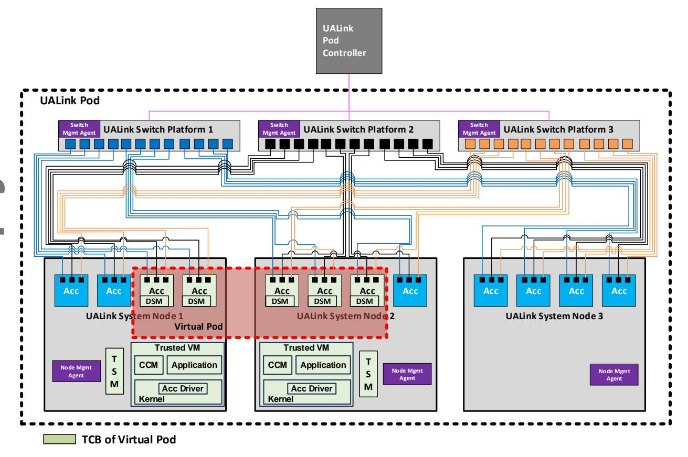

[JSON Extraction](_page_6_Figure_2.json)

Figure 9-1 System level view of confidential computing in a pod

A Tenant running a Virtual Pod spanning several System nodes shall have a TVM on each of its System nodes. The TVMs on different System nodes attest each other and establish cryptographically protected session with each other. All communication between TVMs shall occur via the front-end network and is encrypted and integrity protected. Pod controller

When creating a confidential computing Virtual Pod, the initial steps for creating a Virtual Pod maybe similar to a a non-CC Virtual Pod creation. TVMs shall perform a set of security steps to verify attestation of all devices in the TCB and verify the correct construction and configuration of the Virtual Pod. If verification succeeds, TVM shall lock the configuration of the accelerators (including the UALink port configurations) and program UALink keys in the UALink ports before starting the workload. A lead TVM, typically the one running on the System node where the workload was first initiated, should gather the security configuration of all accelerator members via the TVMs on other nodes and verify that they have been configured correctly as per Tenant's security policy. An important check includes ensuring all accelerators in the Virtual Pod have unique identifiers. The lead TVM should then generates the UALink master keys and distributes it to other TVMs over secure channel. All TVMs shall then program the keys into the UALink ports in the local accelerators via a secure interface.

The secure key programming interface shall provide confidentiality, integrity and replay protection of the keys in accordance with the security model described earlier. Secure key programming interface may be in the form of device specific interface exposed to the VF driver allowing TVM to program the keys through secure memory mapped interface in the virtual function hardware.

Alternately, the keys may be delivered from TVM to the UALink port using SPDM messages between TSM and DSM. These are implementation choices as long as the security requirements are met.

The accelerators shall be assigned accelerator identifiers by the Pod Controller when the pod comes up and is configured. This accelerator identifier serves as the identity of the transmitter and receiver in the UALink transactions and shall be unique across the virtual pod. Since Pod controller is outside the TCB and is not trusted to ensure uniqueness of accelerator identifiers, when a Virtual Pod is created, the lead TVM is responsible for getting accelerator identifiers of all accelerators in the Virtual Pod from all subordinate TVMs in the virtual Pod and ensuring they are unique.

## **9.5 Encryption and authentication scheme for UALink**

To meet the security objectives, UALink standard uses AES-GCM. AES-GCM data processing is performed in the protocol/functional layer as shown in [Figure 9-2](#page-7-0) below:

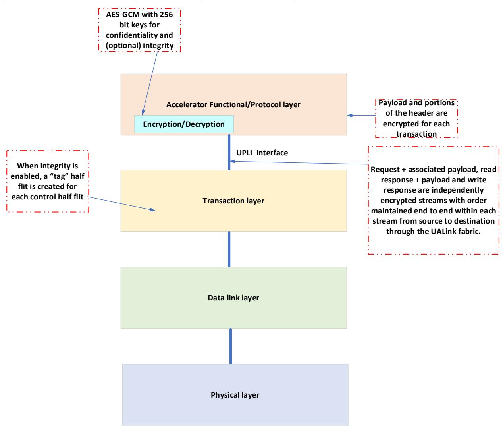

[JSON Extraction](_page_7_Figure_6.json)

**Figure 9-2 Encryption and Authentication touch points in UALink stack**

AES-GCM for UALink will have the following parameters:

- A. Key size 256 Bit
- B. Tag size 8Bytes or 0B (i.e., Tag is optional).

Encryption is done on a per UALink transaction basis. The encrypted transaction along with the optional tag is sent over the UPLI interface to the transaction layer. The transaction layer is expected to send the transaction along with the tag by creating a tag half flit that accompanies the control half flit as illustrated in the example flit format i[n Figure 9-3](#page-8-0) below:

|      |             | 64-byte TL Flit |                    |          |    |          |             |             |                    |             |        |   |          |          |     |    |
|------|-------------|-----------------|--------------------|----------|----|----------|-------------|-------------|--------------------|-------------|--------|---|----------|----------|-----|----|
|      |             |                 | Upper TL Half-Flit |          |    |          |             |             | Lower TL Half-Flit |             |        |   |          |          |     |    |
|      | 15          | 14              | 13                 | 12       | 11 | 10       | 9           | 8           | 7                  | 6           | 5      | 4 | 3        | 2        | 1   | 0  |
| Flit |             |                 |                    |          |    |          |             |             |                    |             |        |   |          |          |     |    |
| 0    |             | AuthTag1        |                    | AuthTag0 |    | AuthTagB |             | AuthTagA    | CWReq1             |             | CWReq0 |   | CWR B | CWR A | NOP | FC |
| 1    | Req0.Data.1 |                 |                    |          |    |          |             | Req0.Data.0 |                    |             |        |   |          |          |     |    |
| 2    |             | Req0.Data.3     |                    |          |    |          |             |             | Req0.Data.2        |             |        |   |          |          |     |    |
| 3    |             | Req0.Data.5     |                    |          |    |          |             |             | Req0.Data.4        |             |        |   |          |          |     |    |
| 4    |             | Req0.Data.7     |                    |          |    |          |             |             | Req0.Data.6        |             |        |   |          |          |     |    |
| 5    |             | Req1.Data.1     |                    |          |    |          |             |             |                    | Req1.Data.0 |        |   |          |          |     |    |
| 6    | Req1.Data.3 |                 |                    |          |    |          | Req1.Data.2 |             |                    |             |        |   |          |          |     |    |
| 7    |             | Req1.Data.5     |                    |          |    |          |             |             | Req1.Data.4        |             |        |   |          |          |     |    |
| 8    |             | Req1.Data.7     |                    |          |    |          |             |             |                    | Req1.Data.6 |        |   |          |          |     |    |

**Figure 9-3 Example of UALink TL flit with the "Tag" half flit**

The order of the tags in the tag half flit shall be exactly same as the order of the requests/responses in control half flit. Note that the tag is for request + payload or response + payload in case the request or response has an accompanying payload.

## **9.5.1 AES-GCM IV format**

AES-GCM encryption and authentication needs a 96-bit Initialization vector (IV) concatenated with a 32-b block counter (as defined in the NIST AES-GCM specification) as input to the AES engine along with the key to perform encryption and authentication. The format of 96 bit IV for UALink is defined in [Table 9-3](#page-8-1) below:

**Table 9-3 IV Format**

| IV [95:0]   |                       |
|-------------|-----------------------|
| FIXED FIELD | Invocation field      |
| [95:32]     | [31:0]                |
|             |                       |
|             | Counter ( Incremented |
|             | for every new UALink  |
| Set to 0    | transaction)          |

In UALink accelerators, the block counter is reset to 0 for each new transaction.

## **9.5.2 Control Half-Flit field encryption**

UALink Control Half-Flit fields are only partially encrypted as certain sub-fields are necessary for routing and flow control. The only sub-fields that are encrypted are Address [17:2] , UPLI transaction identifier Tag and ASI in requests. The only sub-field that is encrypted in responses is the UPLI transaction identifier Tag.

## **9.5.3 Control Half-Flit field authentication**

The following Control Half-Flit sub-fields are integrity protected:

Request channel signals that are encrypted and authenticated are given i[n Table 9-4](#page-9-0) below:

**Table 9-4 Request channel signals that are encrypted and authenticated**

| Name            | Authenticate                  | Encrypt | Visible on the wire? | Reason for not authenticating | Reason for not encrypting                                                |
|-----------------|-------------------------------|---------|-------------------------|----------------------------------|--------------------------------------------------------------------------------|
| ReqVld          | No                            | No      | No                      | Not visible on the wire       | Not visible on the wire                                                     |
| ReqPortID       | No                            | No      | No                      | Not visible on the wire       | Not visible on the wire                                                     |
| ReqASI          | Yes                           | No      | Yes                     | N/A                              | Potentially used by switch                                               |
| ReqAuthTag      | N/A                           | N/A     | Yes                     | N/A                              | N/A                                                                            |
| ReqSrcPhysAccID | Yes                           | No      | Yes                     | N/A                              | Used by switch                                                              |
| ReqDstPhysAccID | Yes                           | No      | Yes                     | N/A                              | Used by switch                                                              |
| ReqTag          | Yes                           | Yes     | Yes                     | N/A                              | N/A                                                                            |
| ReqNumBeats     | Yes                           | No      | Yes                     | N/A                              | Used by switch                                                              |
| ReqAddr         | All bits are authenticated | [17:2]  | Yes                     | N/A                              | Bits [56:18] may be removed by TL due to the compression scheme |

| Name        | Authenticate | Encrypt | Visible on the wire? | Reason for not authenticating | Reason for not encrypting                   |
|-------------|--------------|---------|-------------------------|----------------------------------|---------------------------------------------------|
| ReqCmd      | Yes          | No      | Yes                     | N/A                              | Used by switch                                 |
| ReqLen      | Yes          | No      | Yes                     | N/A                              | Used by switch                                 |
| ReqMetadata | Yes          | No      | Yes                     | N/A                              | Modified in TL due to compression scheme |
| ReqVC       | No           | No      | Yes                     | Modified by switch            | Modified by switch                             |
| ReqPool     | No           | No      | Yes                     | Modified by switch            | Modified by switch                             |

Read response channel signals that are encrypted and authenticated are given in [Table 9-5](#page-10-0) below:

**Table 9-5 Read response channel signals that are authenticated and encrypted**

| Name              | Authenticate | Encrypt | Visible on the wire? | Reason for not authenticating | Reason for not encrypting |
|-------------------|--------------|---------|----------------------------|----------------------------------|---------------------------------|
| RdRspVld          | No           | No      | No                         | Not visible on the wire       | Not visible on the wire      |
| RdRspPortID       | No           | No      | No                         | Not visible on the wire       | Not visible on the wire      |
| RdRspAuthTag      | N/A          | N/A     | Yes                        | N/A                              | N/A                             |
| RdRspSrcPhysAccID | Yes          | No      | Yes                        | N/A                              | Used by switch               |
| RdRspDstPhysAccID | Yes          | No      | Yes                        | N/A                              | Used by switch               |
| RdRspTag          | Yes          | Yes     | Yes                        | N/A                              | N/A                             |
| RdRspNumBeats     | Yes          | No      | Yes                        | N/A                              | Used by switch               |

| Name           | Authenticate | Encrypt | Visible on the wire? | Reason for not authenticating | Reason for not encrypting                   |
|----------------|--------------|---------|----------------------------|----------------------------------|---------------------------------------------------|
| RdRspData      | Yes          | Yes     | Yes                        | N/A                              | N/A                                               |
| RdRspStatus    | Yes          | No      | Yes N/A                 |                                  | Modified in TL due to compression scheme |
| RdRspOffset    | Yes          | No      | Yes                        | N/A                              | Used by switch                                 |
| RdRspLast      | Yes          | No      | Yes                        | N/A                              | Used by switch                                 |
| RdRspDataError | No           | No      | Yes                        | Not visible on the wire       | Not visible on the wire                        |
| RdRspVC        | No           | No      | Yes                        | Modified by switch            | Modified by switch                             |
| RdRspPool      | No           | No      | Yes                        | Modified by switch            | Modified by switch                             |

## **Ultra Accelerator Link Consortium Inc. (UALink) - UALink\_200 Rev 1.0 Specification**

For the write response channel, signals that are encrypted and authenticated are given i[n Table 9-6](#page-12-0) below:

**Table 9-6 Write response channel signals that are authenticated and encrypted**

| Name              | Authenticate | Encrypt | Visible on the wire? | Reason for not authenticating | Reason for not encrypting                   |
|-------------------|--------------|---------|----------------------------|----------------------------------|---------------------------------------------------|
| WrRspVld          | No           | No      | No                         | Not visible on the wire       | Not visible on the wire                        |
| WrRspPortID       | No           | No      | No                         | Not visible on the wire       | Not visible on the wire                        |
| WrRspAuthTag      | N/A          | N/A     | Yes                        | N/A                              | N/A                                               |
| WrRspSrcPhysAccID | Yes          | No      | Yes                        | N/A                              | Used by switch                                 |
| WrRspDstPhysAccID | Yes          | No      | Yes                        | N/A                              | Used by switch                                 |
| WrRspTag          | Yes          | Yes     | Yes                        | N/A                              | N/A                                               |
| WrRspStatus       | Yes          | No      | Yes                        | N/A                              | Modified in TL due to compression scheme |
| WrRspVC           | No           | No      | Yes                        | Modified by switch            | Modified by switch                             |
| WrRspPool         | No           | No      | Yes                        | Modified by switch            | Modified by switch                             |

For the originator data channel, signals that are encrypted and authenticated are given i[n Table 9-7](#page-12-1) below:

**Table 9-7 Originator data channel signals that are authenticated and encrypted**

| Name        | Authenticate | Encrypt | Visible on the wire? | Reason for not authenticating | Reason for not encrypting |
|-------------|--------------|---------|----------------------------|----------------------------------|---------------------------------|
| OrigDataVld | No           | No      | No                         | Not visible on the wire       | Not visible on the wire      |

| Name           | Authenticate | Encrypt | Visible on the wire? | Reason for not authenticating | Reason for not encrypting |
|----------------|--------------|---------|----------------------------|----------------------------------|---------------------------------|
| OrigDataPortID | No           | No      | No                         | Not visible on the wire       | Not visible on the wire      |
| OrigData       | Yes          | Yes     | Yes                        | N/A                              | N/A                             |
| OrigDataByteEn | Yes          | Yes     | Yes                        | N/A                              | N/A                             |
| OrigDataOffset | Yes          | No      | Yes                        | N/A                              | Used by switch               |
| OrigDataLast   | Yes          | No      | Yes                        | N/A                              | Used by switch               |
| OrigDataError  | No           | No      | No                         | Not visible on the wire       | Not visible on the wire      |
| OrigDataVC     | No           | No      | Yes                        | Modified by switch            | Modified by switch           |
| OrigDataPool   | No           | No      | Yes                        | Modified by switch            | Modified by switch           |

## **9.5.4 Data authentication and encryption**

All bytes of data and associated Byte Enables (if any) are encrypted and (optionally) integrity protected for writes, atomic requests and read responses as described i[n Table 9-5](#page-10-0) and [Table 9-7.](#page-12-1)

## **9.5.5 Poisoned data handling with security enabled**

Encryption engine will skip the data beat that has poison indication set while doing encryption and authentication tag generation. Encryption engine shall include the poison indicator bits (4 bits in total for 256B) in the authentication tag generation process. The encryption engine shall set all bytes of the poisoned beat to 0 before sending it on UPLI interface. The poison indicator shall be passed along with each data beat to the transmit path of the TL. The TL shall replace each poisoned data beat with 2 32B "poison" messages.

On the receive path, TL will decode the poison messages and assert the poison indicator for the corresponding 64B data beat on the UPLI interface. TL shall ensure that all bytes of the 64B poisoned data beat is 0 on UPLI interface. The decryption engine will skip poisoned data bytes during the decryption and authentication tag check process. Decryption engine shall include the UPLI poison indicator bits in the authentication tag check process.

## **9.5.6 ISOLATE response handling**

Decryption engine shall ignore ISOLATE response – ISOLATE response shall not be decrypted or integrity checked.

## **9.5.7 Modes of operation**

An implementation can choose to support:

- 1. No security features
- 2. Encryption only
- 3. Encryption and integrity

In case an implementation has encryption only, then the following modes shall be supported:

- 1. Encryption enabled
- 2. Encryption disabled

In case an implementation has encryption and integrity, then the following modes shall be supported:

- 1. Encryption enabled
- 2. Encryption and integrity enabled
- 3. Encryption and integrity disabled

## **9.5.8 Ordering requirements imposed due to AES-GCM**

AES-GCM requires the sender and receiver to keep the varying part of the IV (essentially the 32-bit Invocation field) in lockstep with each other.

To achieve lockstep operation of sender (encryption) and receiver side (decryption), UALink transactions are grouped into three independent streams with transactions belonging to the same stream being kept strictly in order while travelling from a given source port to a given destination port through the UALink fabric.

The streams are defined as follows:

- A. Request stream this stream has Read requests, Write requests + associated payload and Atomic requests + associated payload.
- B. Read response stream this stream has Read responses + associated payload and atomic requests + associated payload.
- C. Write response stream this stream has write responses

## **9.5.8.1 Notes on ordering**

- There are no ordering requirements between different streams.
- There are no ordering requirements between traffic from different source ports to a given destination port.
- There are no ordering requirements between traffic from a given source port to different destination ports.

## **9.5.9 Authentication and Encryption/Decryption Implementation in an UALink port**

## **9.5.9.1 Key and other security state management**

An UALink port is assumed to have transmit logic (TX) and receive logic (RX)[. Figure 9-4](#page-16-0) below summarizes the per destination accelerator state elements maintained in TX of a port for authentication and encryption in a 1024 accelerator system:

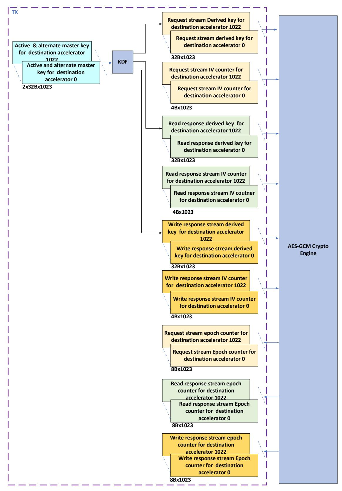

[JSON Extraction](_page_16_Figure_2.json)

**Figure 9-4 Security related state elements in UALink port TX for a 1024 accelerator system** 

## **Ultra Accelerator Link Consortium Inc. (UALink) - UALink\_200 Rev 1.0 Specification**

It is assumed that a given UALink port's TX can only reach a single port on a remote accelerator; therefore, the UALink port TX only needs to maintain state on a per destination accelerator basis. As shown i[n Figure 9-4,](#page-16-0) the TX of each UALink port will maintain an active master key and an alternate master key for each destination accelerator that it can reach. Note that these keys are unique for that port TX, destination accelerator combination – no other port TX will have the same key values. Secondly, it will maintain a per stream IV field counter for each destination accelerator. Thirdly, it will maintain a derived key per stream for each destination accelerator. Lastly, it will maintain an Epoch counter per stream for each destination accelerator. The per stream epoch counter counts the number of times a new key has been derived for a particular stream from the same active master key.

Note: Epoch counters shall be at least 32 bits in width. In this Specification, the illustrations assume counters with a width of 64 bits.

Note: It is assumed that an accelerator will not send transactions to itself through the UALink fabric.

[Figure 9-4](#page-16-0) below summarizes the security related state elements in an UALink RX for a 1024 accelerator system:

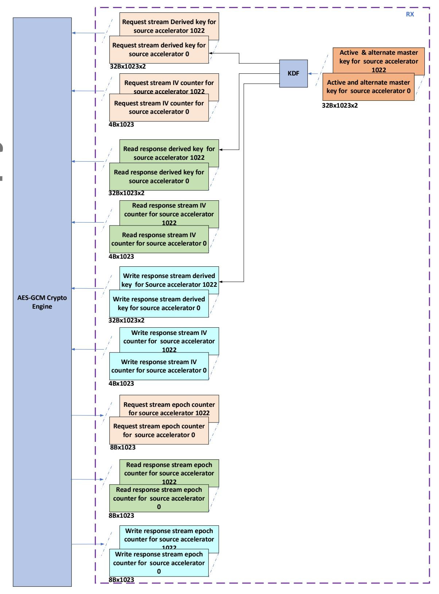

[JSON Extraction](_page_18_Figure_2.json)

**Figure 9-5 Security related state elements in UALink RX for a 1024 accelerator system**

As shown i[n Figure 9-5](#page-18-0)[Figure 9-4,](#page-16-0) the RX of each UALink port will maintain an active master key and an alternate master key for each source UALink accelerator that it can get transactions from.

## **Ultra Accelerator Link Consortium Inc. (UALink) - UALink\_200 Rev 1.0 Specification**

Note that these keys are unique for that port RX, source accelerator combination – no other port TX will have the same key values. Secondly, it will maintain a per stream IV field counter for each source accelerator. Thirdly, it will maintain a per stream derived key for each source accelerator. Lastly, it will maintain an Epoch counter per stream for each source accelerator. The per stream epoch counter counts the number of times a new key has been derived for a particular stream from the same active master key.

## **9.5.9.1.1 Master key management**

As mentioned in previously, an UALink TX has an active master key and an alternate master key for each destination accelerator. Similarly, an UALink RX has an active master key and an alternate master key for each source accelerator. These keys are configured by secure SW/FW. UAlink RX and TX is expected to offer a secure interface to SW/FW for programming two master keys. At any instant, one of the two programmed keys is the "active" key and the other is the "alternate" key. Determination of whether a particular key is active or alternate in UALLink TX/RX is done in the following way:

- When the two keys are programmed in for the very first time and secure transmission enabled, hardware selects one of the two keys as the "active" key.
- Later, when a key swap flow is triggered, HW promotes the alternative key to become the active key. When this happens, the original active key is marked as stale by hardware and software is expected to program a new key replacing the stale key.

Hardware shall have mechanisms to ensure that a stale key is never selected as active key. If the key swap flow is triggered and alternate key is marked as stale, the hardware shall stop processing new transactions for that destination/from that source and report an error event to the security processor in the accelerator. The security processor upon receiving this error event, shall report to the CCM(TVM) that manages the accelerator with information about the Port number that reported the event.

• Hardware shall provide mechanisms for SW to replace a stale key with a fresh key.

## **9.5.9.1.2 Master keys maintained by RX and TX in an UALink system – an illustration**

As described previously, given a source accelerator A and a destination accelerator B, the active master key, alternate master key pair that accelerator B 's UALink port RX maintains for accelerator A as a source will be identical to the active master key, alternate master key pair maintained by UALink port TX on A for accelerator B as a destination. This is illustrated in [Figure](#page-20-0)  [9-6](#page-20-0) below:

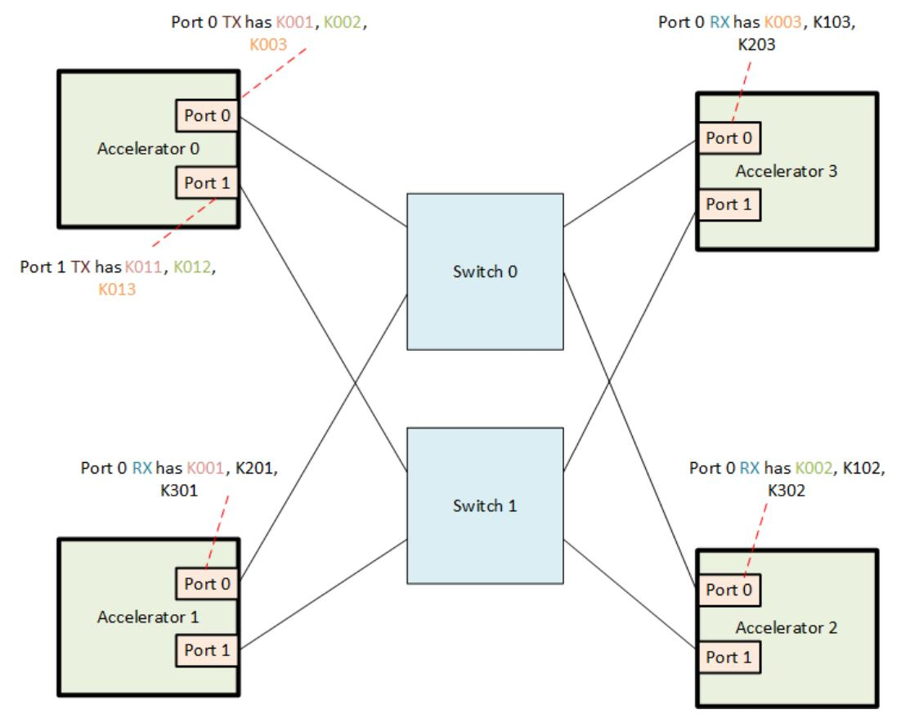

[JSON Extraction](_page_20_Figure_2.json)

**Figure 9-6 Illustration of master keys maintained by UALink Port RX and TX in a UALink system**

In [Figure 9-6](#page-20-0) , Accelerator 0 port 0 TX has key pair K001 for Accelerator 1 as the destination and Accelerator 1 port 0 RX has the same key pair K001 for Accelerator 0 as the source. Similarly, Accelerator 0 port 0 TX has key pair K002 for Accelerator 2 as the destination and Accelerator 2 port 0 RX has the same key pair K002 for Accelerator 0 as the source.

## **9.5.9.1.3 Illustration of security State requirements in TX and RX**

To understand the security state requirements in more detail, the 4-accelerator system example shown below i[n Figure 9-7](#page-21-0) is helpful:

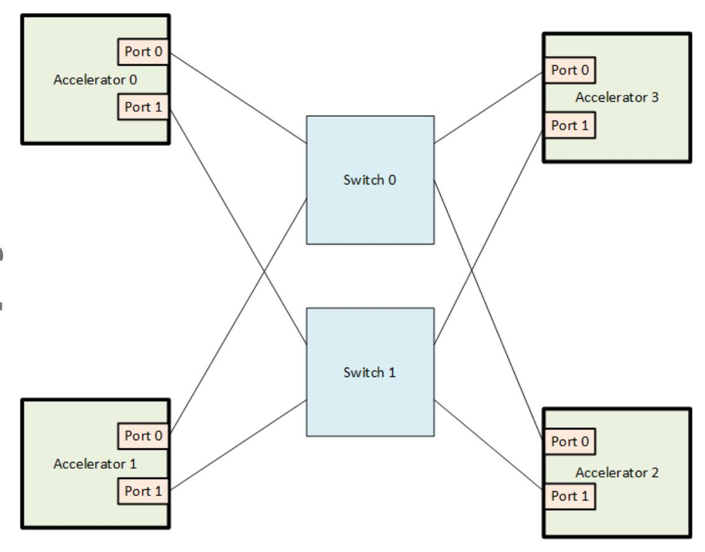

[JSON Extraction](_page_21_Figure_2.json)

**Figure 9-7 A 4 accelerator UALink system example**

In the system shown i[n Figure 9-7,](#page-21-0) accelerator 0 Port 0 TX has the following state:

- 1. Active Master Key for transactions to Accelerator 1, 2, and 3 (3 x 32B)
- 2. Alternate Master Key for transactions to Accelerator 1, 2, and 3 (3x32B)
- 3. Invocation field for stream 0 to Accelerator 1, 2, and 3 (3x4B)
- 4. Invocation field for stream 1 to Accelerator 1, 2, and 3 (3x4B)
- 5. Invocation field for stream 2 to Accelerator 1, 2, and 3 (3x4B)
- 6. Epoch counter for transactions on stream 0 to accelerator 1, 2, and 3 (3x4B)
- 7. Epoch counter for transactions on stream 1 to accelerator 1, 2, and 3 (3x4B)
- 8. Epoch counter for transactions on stream 2 to accelerator 1, 2, and 3 (3x4B)
- 9. Current derived key for stream 0 to Accelerator 1, 2, and 3 (3x32B)
- 10. Current derived key for stream 1 to Accelerator 1, 2, and 3 (3x32B)
- 11. Current derived key for stream 2 to Accelerator 1, 2, and 3 (3x32B)
- 12. Next derived key for stream 0 to Accelerator 1, 2, and 3 (3x32B)
- 13. Next derived key for stream 1 to Accelerator 1, 2, and 3 (3x32B)
- 14. Next derived key for stream 2 to Accelerator 1, 2, and 3 (3x32B)

In the system shown i[n Figure 9-7,](#page-21-0) accelerator 0 Port 0 RX has the following state:

- 1. Active Master Key for transactions from Accelerator 1, 2, and 3 (3 x 32B)
- *Security* 229 2. Alternate Master Key for transactions from Accelerator 1, 2, and 3 (3x32B)

## **Ultra Accelerator Link Consortium Inc. (UALink) - UALink\_200 Rev 1.0 Specification**

- 3. Invocation field for stream 0 from Accelerator 1, 2, and 3 (3x4B)
- 4. Invocation field for stream 1 from Accelerator 1, 2, and 3 (3x4B)
- 5. Invocation field for stream 2 from Accelerator 1, 2, and 3 (3x4B)
- 6. Epoch counter for transactions on stream 0 from accelerator 1, 2, and 3 (3x4B)
- 7. Epoch counter for transactions on stream 1 from accelerator 1, 2, and 3 (3x4B)
- 8. Epoch counter for transactions on stream 2 from accelerator 1, 2, and 3 (3x4B)
- 9. Current Derived key for stream 0 from Accelerator 1, 2, and 3 (3x32B)
- 10. Current Derived key for stream 1 from Accelerator 1, 2, and 3 (3x32B)
- 11. Current Derived key for stream 2 from Accelerator 1, 2, and 3 (3x32B)
- 12. Next derived key for stream 0 from Accelerator 1, 2, and 3 (3x32B)
- 13. Next derived key for stream 1 from Accelerator 1, 2, and 3 (3x32B)
- 14. Next derived key for stream 2 from Accelerator 1, 2, and 3 (3x32B)

Similar state requirements exist for Accelerator 0 port 1, Accelerator 1 port0, Accelerator 1 port 1, Accelerator 2 port0, Accelerator 2 port 1, Accelerator 3 port 0 and Accelerator 3 port 1 in this example system.

## **9.5.9.2 TX implementation**

As mentioned in section [9.5.9.1,](#page-15-0) in an UALink port TX, there will be an active master key and an alternate master key for each destination accelerator that is reachable from that TX. The active key is fed into a NIST approved Key Derivation Function (KDF) defined i[n 9.5.15](#page-41-0) to generate a derived key for each stream. This derived key is then used along with a per stream 96-bit IV defined i[n 9.5.1](#page-8-2)  to encrypt transactions belonging to each stream. If the invocation field counter (IV counter) value of a stream becomes equal to a software configured "derived key expiry" threshold or to the hardware threshold (if "derived key expiry" not configured by SW) of 2^32 -1, then a new key derivation is triggered for that stream, and that stream's "Epoch" counter is incremented. The key derivation flow requires a "context" input as defined in the NIST specification referenced in [9.5.15](#page-41-0) . The context input formation is detailed in section [9.5.9.4](#page-29-0) . The key derivation flow is detailed in Section [9.5.9.2.1](#page-22-0). If the sum of the three stream "Epoch" counter values reaches a software configured "Master key expiry" threshold or if one of the three Epoch counters is about to roll over (i.e., 2^n -1 for a n-bit Epoch counter), then a key swap is triggered where the alternate master key is made the active master key. As soon as master key swap is done, the epoch counter is reset for all three streams that uses the master key and a key derivation is done for all three streams with the new active master key as the input. The key swap flow is detailed in Section [9.5.9.2.2](#page-23-0) .. The key swap flow uses the "KeyRollMSG.ReqChannel" , "KeyRollMSG.RdRspChannel" and "KeyRollMSGWrRspChannel" Requests.For details of the three "KeyRollMSG" requests in terms of format, crediting etc., refer to the UPLI Interface chapter and Transaction layer chapter. The IV counter shall be 0 for the very first transaction that TX encrypts using a new derived key.

## **9.5.9.2.1 TX Stream-Key derivation flow**

A Stream key derivation flow can be triggered by SW during initialization by writing to a configuration register bit or by HW (whenever the derived key expiry threshold is hit or when the IV invocation field reaches 2^32 -1 – HW threshold) – the key derivation flow will take the key whose active bit is set to 1 as input to KDF and derive a new key. If a new stream key is required and the active key is not valid, then an error is signaled and all further processing of traffic to the destination accelerator is stopped.

The Stream-key derivation flow in TX is illustrated in [Figure 9-8](#page-23-1) below:

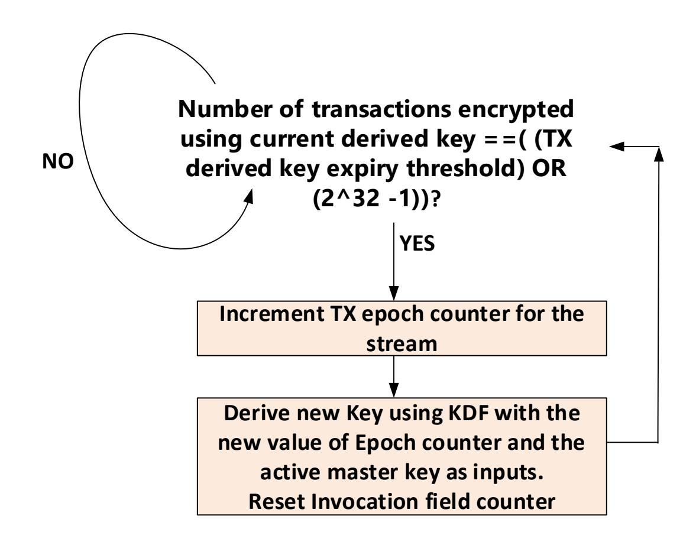

[JSON Extraction](_page_23_Figure_3.json)

**Figure 9-8 Stream-Key derivation flow in UALink port TX**

The key derivation flow is done on a per stream basis for each destination accelerator.

Note: Programmers should ensure that the threshold is not programmed with too low a value – otherwise, key rolls and key derivations might be unsustainably frequent.

## **9.5.9.2.2 TX Master key swap flow**

The Master key swap flow actions in TX is illustrated i[n Figure 9-9](#page-24-0) below:

[JSON Extraction](_page_24_Figure_2.json)

**Figure 9-9 Key swap flow in UALink port TX**

The key swap flow is done on a per stream basis for each destination accelerator.

## **Ultra Accelerator Link Consortium Inc. (UALink) - UALink\_200 Rev 1.0 Specification**

Note: if the TX times out on the KeyRollMSG request it sends as part of the key swap flow for a particular destination accelerator, then it will report an error to the security processor and stop processing of traffic to that destination accelerator.

In addition, a key swap results in an event being raised to the security processor in the accelerator to indicate that the active master key has expired. Please refer to Sectio[n 9.5.11](#page-40-0) for details on the actions that the security processor is expected to take upon receiving the active master key expiry event.

## **9.5.9.3 RX implementation**

As mentioned in section [9.5.9.1,](#page-15-0) in an UALink port RX, there will be an active master key and an alternate master key for each accelerator that can send transactions to it. The active key is fed into a NIST approved Key Derivation Function (KDF) to generate a derived key for each stream received from the corresponding accelerator. This derived stream specific key is then used along with a per stream IV to decrypt transactions belonging to each stream. If the Invocation field (IV counter) value becomes greater than a software configured "derived key expiry" threshold, then a new key derivation is triggered. The key derivation flow is detailed in Sectio[n 9.5.9.3.1.](#page-25-0) Key derivation requires a "context" input as defined in the NIST specification referenced in section [9.5.15](#page-41-0) . The context input formation is detailed in section [9.5.9.4](#page-29-0) The master key swap in RX is triggered by the source accelerator TX. The master key swap flow involves three "KeyRollMSG" request – response pairs – one for each stream from the source accelerator. When the RX receives a KeyRollMSG.ReqChannel request on the request stream, it shall switch to doing decryption using the key derived from the new active key on the very first request received after the "KeyRollMSG.ReqChannel" request. For the read response channel, the RX shall switch to doing decryption using the key derived from the new active key from the very first response received after the response for the "KeyRollMSG.RdRspChannel" request. For the write response channel, the RX shall switch to doing decryption using the key derived from the new active key from the very first response received after the response for the "KeyRollMSG.WrRspChannel" request. These sequence of actions are illustrated i[n Figure 9-11.](#page-27-0) To achieve this instantaneous switch, RX is expected to pre-compute and keep the derived key ready by running the KDF using the alternate master key long before the sum of stream epoch counters hit the master key expiry threshold – recommended method is to derive the new key as soon as valid bit of the alternate master key goes from 0 to 1. For creating a key swap for read response stream and write response stream, RX shall send a "KeyRollMSG.RdRspChannel" request for the read response stream and a "KeyRollMSG.WrRspChannel" request for the write response stream to the remote TX that sent the "KeyRollMSG.ReqChannel" request for request stream as shown in [Figure 9-12](#page-28-0) . The key swap flow actions within RX are detailed in Sectio[n 9.5.9.3.2](#page-26-0) below. The IV counter shall be 0 for the very first transaction decrypted by RX using a new derived key.

## **9.5.9.3.1 RX Stream Key derivation flow**

In the RX, there are two scenarios in which a stream key derivation is done:

1. Pre-computing a derived key using the alternate master key in preparation for a key swap. It is recommended that this is done when the valid bit of the alternate master key goes from

- 0 to 1. This means RX needs storage for two sets of derived keys for each stream. This precomputation ensures that upon a key swap, the derived key using the new active master key is instantaneously available.
- 2. When the derived key expiry threshold is hit for a stream or when the IV invocation field for a stream reaches 2^32 -1. This flow is detailed below i[n Figure 9-10.](#page-26-1). If a new stream key needs to be derived and the active key is not valid, then an error is signaled and all further processing of traffic from the source accelerator is stopped.

The key derivation flow is illustrated i[n Figure 9-10](#page-26-1) below:

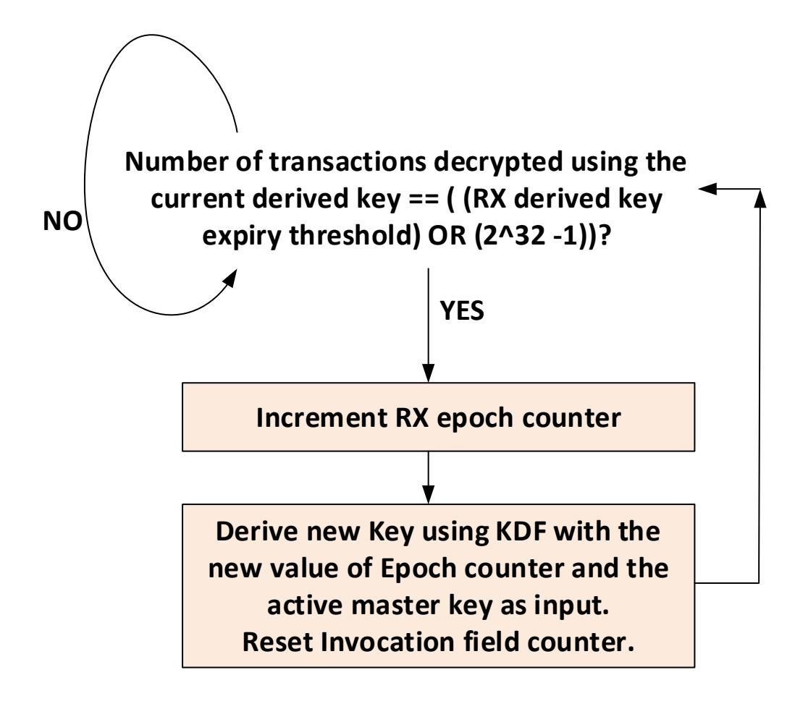

[JSON Extraction](_page_26_Figure_5.json)

**Figure 9-10 Key derivation flow in UALink Port RX**

## **9.5.9.3.2 RX Key swap flow**

The key swap flow is illustrated i[n Figure 9-11](#page-27-0) below:

[JSON Extraction](_page_27_Figure_2.json)

**Figure 9-11 Key switch flow in UALink port RX**

Note: If the RX times out on any of the KeyRollMSG requests it sends as part of the key switch flow for a particular source accelerator, then it will report an error to the security processor and stop processing of traffic from that source accelerator.

Note that RX can optionally raise an error if a HW threshold or a SW configured threshold is crossed before a key swap request is received.

The interactions between a source accelerator and a destination accelerator for the key swap flow is illustrated in Figure 9-12 below:

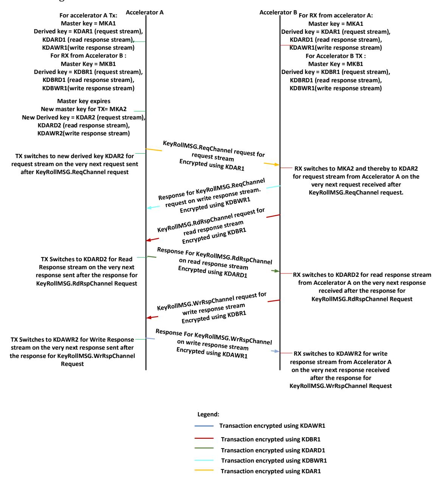

[JSON Extraction](_page_28_Figure_5.json)

Figure 9-12 Source accelerator - Destination accelerator interactions for key swap flow

### 9.5.9.4 Context input for key derivation

Key derivation requires a "Context" input (considered as part of "FixedInfo" in NIST KDF specification) in both RX and TX.

There are two cases to consider:

- 1. When the master key is being swapped. In this case, the "Context" input shall be the following: {0x0, Stream ID}
- 2. When the master key is NOT being swapped. In this case, the Context input shall be the following: {Stream epoch counter value, Stream ID}

Note: The Stream ID field shall be two bits in width.

### 9.5.9.5 AES-GCM Message and Auxiliary Authentication Data

Table 9-8 Request Channel Fields for AAD and MSG - Non Write or UPLI Write Message Request

|                                       | 9.5.9.5 AES-                                                                                                                                                                                                                                                                                                                                                                                                                               | -GCM N  | lessage and Au                        | xiliary Authe    | nticatio | on Data     |             |         |           |              |                |
|---------------------------------------|--------------------------------------------------------------------------------------------------------------------------------------------------------------------------------------------------------------------------------------------------------------------------------------------------------------------------------------------------------------------------------------------------------------------------------------------|---------|---------------------------------------|------------------|----------|-------------|-------------|---------|-----------|--------------|----------------|
|                                       | This section specifies the mapping order of the UPLI channels fields for AES-GCM Auxiliary Authentication Data (AAD) and the Message (MSG) to be encrypted on TX or Decrypted on the RX.                                                                                                                                                                                                                                                |         |                                       |                  |          |             |             |         |           |              |                |
| , , , , , , , , , , , , , , , , , , , | TAG is the hashing of the AAD and the Cypher text after MSG Encryption.  To simplify implementation and align to the AES block size of 128 bits, MSG size is always a multiple of 128 bits, when the plaintext width is not a multiple of the 128-bit, it will be 0s-padded. The receiving side is responsible to reconstruct the padded portion of the Cypher text before recalculating the TAG as padding is not transmitted on the link |         |                                       |                  |          |             |             |         |           |              |                |
| ,                               | Γhe AAD is al , pits, it will be                                                                                                                                                                                                                                                                                                                                                                                             | -       | nultiple of 32 b ded.              | its, when the w  | vidth of | concatenate | e fields is | not a m | ultiple ( | of 32        |                |
| ' , ) 1                            |                                                                                                                                                                                                                                                                                                                                                                                                                                            | the req | w the fields con Juest type, the f | _                |          |             |             |         | paralle   | l            |                |
| )                                     |                                                                                                                                                                                                                                                                                                                                                                                                                                            |         |                                       | ds for AAD and M | ICC No.  |             |             | ъ       | ~a.t      |              |                |
|                                       |                                                                                                                                                                                                                                                                                                                                                                                                                                            | - -  | RegSrcPhysAccID                       |                  | Т        | T           | Г           | ı       |           | RegAttr      | RegMetada      |
| AAD                                   | Table Size_padded 96                                                                                                                                                                                                                                                                                                                                                                                                                       | ReqASI  | ReqSrcPhysAccID                       | ReqDstPhysAccID  | ReqTag   | ReqNumBeats | ReqAddr     | ReqCmd  | ReqLen 6  | ReqAttr 8 | ReqMetada 8 |

### Table 9-9 Originator Data Channel Fields for AAD and MSG (partial-word write or UPLI Write Message Request)

|     | Size_padded | OrigDataByteEn | OrigData | OrigDataOffset | OrigDataLast |
|-----|-------------|----------------|----------|----------------|--------------|
| AAD | 32          |                |          | 2              | 1            |
| MSG | 640         | 64             | 512      |                |              |

### Table 9-10 Originator Data Channel Fields for AAD and MSG (Full Write)

|     | Size_padded | OrigData | OrigDataOffset | OrigDataLast |
|-----|-------------|----------|----------------|--------------|
| AAD | 32          |          | 2              | 1            |

| MSG | 512 | 512 |  |
|-----|-----|-----|--|

**Table 9-11 Read Response channel fields for AAD and MSG**

|     | Size_padded | RdRspSrcPhysAccID | RdRspDstPhysAccID | RdRspTag | RdRspNumBeats | RdRspData | RdRspStatus | RdRspOffset | RdRspLast |
|-----|-------------|-------------------|-------------------|----------|---------------|-----------|-------------|-------------|-----------|
| AAD | 32          | 10                | 10                |          | 2             |           | 4           | 2           | 1         |
| MSG | 640         |                   |                   | 11       |               | 512       |             |             |           |

**Table 9-12 Write Response channel fields for AAD and MSG**

|     | Size_padded | WrRspSrcPhysAccID | WrRspDstPhysAccID | WrRspTag | WrRspStatus | RdRspLast |
|-----|-------------|-------------------|-------------------|----------|-------------|-----------|
| AAD | 32          | 10                | 10                |          | 4           | 1         |
| MSG | 128         |                   |                   | 11       |             |           |

The table below describes the mapping of **AAD** bits for **request**. Address field is double-word aligned and Addr[1:0] are always 0. These 2 bits are not encrypted and neither authenticated. The AAD size is 96 bits with 6 padded zeroes.

**Table 9-13 Mapping Request Channel AAD bits**

|                   |                       |   |                      |             |             | AAD for Req = 96bits |                      |   |                 |  |  |  |
|-------------------|-----------------------|---|----------------------|-------------|-------------|----------------------|----------------------|---|-----------------|--|--|--|
|                   |                       |   |                      |             |             | bits                 |                      |   |                 |  |  |  |
|                   |                       | 7 | 6                    | 5           | 4           | 3                    | 2                    | 1 | 0               |  |  |  |
|                   | 0 ReqMetadata[7:0] |   |                      |             |             |                      |                      |   |                 |  |  |  |
| 1 ReqAttr[7:0] |                       |   |                      |             |             |                      |                      |   |                 |  |  |  |
|                   | 2                     |   | ReqCmd[1:0]          | ReqLen[5:0] |             |                      |                      |   |                 |  |  |  |
|                   | 3                     |   | ReqAaddr[23:18]      | ReqCmd[5:2] |             |                      |                      |   |                 |  |  |  |
|                   | 4                     |   | ReqAaddr[31:24]      |             |             |                      |                      |   |                 |  |  |  |
| By                | 5                     |   |                      |             |             | ReqAaddr[39:32]      |                      |   |                 |  |  |  |
| te s           | 6                     |   |                      |             |             | ReqAaddr[47:40]      |                      |   |                 |  |  |  |
|                   | 7                     |   |                      |             |             | ReqAaddr[55:48]      |                      |   |                 |  |  |  |
|                   | 8                     |   | ReqDstPhysAccID[3:0] |             |             | ReqNBeats[1:0]       |                      |   | ReqAaddr[57:56] |  |  |  |
|                   | 9                     |   | ReqSrcID[1:0]        |             |             |                      | ReqDstPhysAccID[9:4] |   |                 |  |  |  |
|                   | 10                    |   |                      |             |             | ReqSrcPhysAccID[9:2] |                      |   |                 |  |  |  |
|                   | 11                    |   |                      |             | 0`s Padding |                      |                      |   | ReqASI[0:1]     |  |  |  |

The table below describes the mapping of **MSG** bits **for non-write or UPLI non-write message request**. The MSG size is 128 bits.

**Table 9-14 Mapping Request Channel MSG bits for non write and non UPLI Write Message**

|         | MSG for Req (no write req.) |                                            |   |   |                 |      |   |   |   |  |  |  |
|---------|-----------------------------|--------------------------------------------|---|---|-----------------|------|---|---|---|--|--|--|
|         |                             |                                            |   |   |                 | bits |   |   |   |  |  |  |
|         |                             | 7                                          | 6 | 5 | 4               | 3    | 2 | 1 | 0 |  |  |  |
|         | 0                           |                                            |   |   | ReqAaddr[9:2]   |      |   |   |   |  |  |  |
|         | 1                           |                                            |   |   | ReqAaddr[17:10] |      |   |   |   |  |  |  |
|         | 2                           | ReqTag[7:0]                                |   |   |                 |      |   |   |   |  |  |  |
|         | 3                           | 0`s Padding ReqTag[10:8] 0`s Padding |   |   |                 |      |   |   |   |  |  |  |
|         | 4                           |                                            |   |   |                 |      |   |   |   |  |  |  |
|         | 5                           | 0`s Padding                                |   |   |                 |      |   |   |   |  |  |  |
|         | 6                           |                                            |   |   | 0`s Padding     |      |   |   |   |  |  |  |
| By      | 7                           |                                            |   |   | 0`s Padding     |      |   |   |   |  |  |  |
| te s | 8                           |                                            |   |   | 0`s Padding     |      |   |   |   |  |  |  |
|         | 9                           |                                            |   |   | 0`s Padding     |      |   |   |   |  |  |  |
|         | 10                          |                                            |   |   | 0`s Padding     |      |   |   |   |  |  |  |
|         | 11                          |                                            |   |   | 0`s Padding     |      |   |   |   |  |  |  |
|         | 12                          |                                            |   |   | 0`s Padding     |      |   |   |   |  |  |  |
|         | 13                          |                                            |   |   | 0`s Padding     |      |   |   |   |  |  |  |
|         | 14                          |                                            |   |   | 0`s Padding     |      |   |   |   |  |  |  |
|         | 15                          |                                            |   |   | 0`s Padding     |      |   |   |   |  |  |  |

The table below describes the mapping of **AAD** bits for **Write Request or UPLI Write Message, with 1st beat of the Originator Data Channel**. The AAD size is 128 bits concatenating 96 bits from Request Channel`s fields and 32 bits from the field Originator Data Channel.

**Table 9-15 Mapping Request and Originator Data channels AAD bits for Wr Req or UPLI Write Message**

|         |                       |   |                            |   |   |                 | AAD for Wr Req or UPLI Write Message |             |   |  |  |  |  |  |
|---------|-----------------------|---|----------------------------|---|---|-----------------|--------------------------------------|-------------|---|--|--|--|--|--|
|         |                       |   |                            |   |   | 1st beat = 128  | bits                                 |             |   |  |  |  |  |  |
|         | bits                  |   |                            |   |   |                 |                                      |             |   |  |  |  |  |  |
|         |                       | 7 | 6                          | 5 | 4 | 3               | 2                                    | 1           | 0 |  |  |  |  |  |
|         | 0 ReqMetadata[7:0] |   |                            |   |   |                 |                                      |             |   |  |  |  |  |  |
|         | 1 ReqAttr[7:0]     |   |                            |   |   |                 |                                      |             |   |  |  |  |  |  |
|         | 2                     |   | ReqCmd[1:0] ReqLen[5:0] |   |   |                 |                                      |             |   |  |  |  |  |  |
| By      | 3                     |   | ReqAaddr[23:18]            |   |   |                 |                                      | ReqCmd[5:2] |   |  |  |  |  |  |
| te s | 4                     |   |                            |   |   | ReqAaddr[31:24] |                                      |             |   |  |  |  |  |  |
|         | 5                     |   |                            |   |   | ReqAaddr[39:32] |                                      |             |   |  |  |  |  |  |
|         | 6                     |   |                            |   |   | ReqAaddr[47:40] |                                      |             |   |  |  |  |  |  |
|         | 7                     |   |                            |   |   | ReqAaddr[55:48] |                                      |             |   |  |  |  |  |  |

| 8  | ReqDstPhysAccID[3:0] |             |             | ReqNBeats[1:0]       | ReqAaddr[57:56] |
|----|----------------------|-------------|-------------|----------------------|-----------------|
| 9  | ReqSrcID[1:0]        |             |             | ReqDstPhysAccID[9:4] |                 |
| 10 |                      |             |             | ReqSrcPhysAccID[9:2] |                 |
| 11 |                      | 0`s Padding |             |                      | ReqASI[0:1]     |
| 12 |                      | 0`s Padding |             | OrigDataOffset[1:0]  | Last            |
| 13 |                      |             | 0`s Padding |                      |                 |
| 14 |                      |             | 0`s Padding |                      |                 |
| 15 |                      |             | 0`s Padding |                      |                 |

The total MSG size is 640 bits. The tables below describe the mapping of MSG bits of the Channels` fields (Request and Originator Data) constructing the **1st 128 bits of MSG, for Write Request or UPLI Write Message with Byte enables field** (Table 9-16 below) **and Full word write requests**. (Table 9-17 below). This 128 bits of the MSG will consume the 1st 128 bits encrypted counter. The rest of 512 bits of the Originator data fields will consume from the 2nd to the 5th 128 bits encrypted counters.

**Table 9-16 Mapping MSG bits for Write Request w. Byte Enable or UPLI Write Message of the 1st beat**

| MSG for Wr Req w. Byte Enable or UPLI Write |    |                   |   | Message of the 1st beat |                   |             |   |              |   |  |  |
|---------------------------------------------|----|-------------------|---|-------------------------|-------------------|-------------|---|--------------|---|--|--|
|                                             |    |                   |   |                         |                   | Bits        |   |              |   |  |  |
| st Counter 1                             |    | 7                 | 6 | 5                       | 4                 | 3           | 2 | 1            | 0 |  |  |
|                                             | 0  |                   |   |                         | ReqAaddr[9:2]     |             |   |              |   |  |  |
|                                             | 1  |                   |   |                         | ReqAaddr[17:10]   |             |   |              |   |  |  |
|                                             | 2  |                   |   |                         |                   | ReqTag[7:0] |   |              |   |  |  |
|                                             | 3  |                   |   | 0`s Padding             |                   |             |   | ReqTag[10:8] |   |  |  |
|                                             | 4  | ByteEnable[7:0]   |   |                         |                   |             |   |              |   |  |  |
|                                             | 5  | ByteEnable[15:8]  |   |                         |                   |             |   |              |   |  |  |
|                                             | 6  | ByteEnable[23:16] |   |                         |                   |             |   |              |   |  |  |
| By                                          | 7  |                   |   |                         | ByteEnable[31:24] |             |   |              |   |  |  |
| te s                                     | 8  |                   |   |                         | ByteEnable[39:32] |             |   |              |   |  |  |
|                                             | 9  |                   |   |                         | ByteEnable[47:40] |             |   |              |   |  |  |
|                                             | 10 |                   |   |                         | ByteEnable[55:48] |             |   |              |   |  |  |
|                                             | 11 |                   |   |                         | ByteEnable[63:56] |             |   |              |   |  |  |
|                                             | 12 |                   |   |                         | 0`s Padding       |             |   |              |   |  |  |
|                                             | 13 |                   |   |                         | 0`s Padding       |             |   |              |   |  |  |
|                                             | 14 |                   |   |                         | 0`s Padding       |             |   |              |   |  |  |
|                                             | 15 |                   |   |                         | 0`s Padding       |             |   |              |   |  |  |

| 2nd Counter  |   |   |   |   | bits            |   |   |   |
|--------------|---|---|---|---|-----------------|---|---|---|
|              | 7 | 6 | 5 | 4 | 3               | 2 | 1 | 0 |
| Bytes [0-15] |   |   |   |   | OrigData[127-0] |   |   |   |

| 3rd Counter  |      |                   |   |   | bits              |   |   |   |  |  |  |  |
|--------------|------|-------------------|---|---|-------------------|---|---|---|--|--|--|--|
|              | 7    | 6                 | 5 | 4 | 3                 | 2 | 1 | 0 |  |  |  |  |
| Bytes [0-15] |      |                   |   |   | OrigData[255-127] |   |   |   |  |  |  |  |
|              |      |                   |   |   |                   |   |   |   |  |  |  |  |
| 4th Counter  | bits |                   |   |   |                   |   |   |   |  |  |  |  |
|              | 7    | 6                 | 5 | 4 | 3                 | 2 | 1 | 0 |  |  |  |  |
| Bytes [0-15] |      |                   |   |   | OrigData[383-256] |   |   |   |  |  |  |  |
|              |      |                   |   |   |                   |   |   |   |  |  |  |  |
| 5th Counter  |      | bits              |   |   |                   |   |   |   |  |  |  |  |
|              | 7    | 6                 | 5 | 4 | 3                 | 2 | 1 | 0 |  |  |  |  |
| Bytes [0-15] |      | OrigData[511-384] |   |   |                   |   |   |   |  |  |  |  |

**Table 9-17 Mapping MSG bits for Full-word Wr Req (w/o Byte Enable) of the 1st beat**

|         |    | MSG for Full-word Wr Req (w/o Byte Enable) of the 1st beat |
|---------|----|---------------------------------------------------------------|
|         |    | bits                                                          |
|         |    | 7 6 5 4 3 2 1 0                          |
|         | 0  | ReqAaddr[9:2]                                                 |
|         | 1  | ReqAaddr[17:10]                                               |
|         | 2  | ReqTag[7:0]                                                   |
|         | 3  | 0`s Padding ReqTag[10:8]                                   |
|         | 4  | 0`s Padding                                                   |
|         | 5  | 0`s Padding                                                   |
|         | 6  | 0`s Padding                                                   |
| By      | 7  | 0`s Padding                                                   |
| te s | 8  | 0`s Padding                                                   |
|         | 9  | 0`s Padding                                                   |
|         | 10 | 0`s Padding                                                   |
|         | 11 | 0`s Padding                                                   |
|         | 12 | 0`s Padding                                                   |
|         | 13 | 0`s Padding                                                   |
|         | 14 | 0`s Padding                                                   |
|         | 15 | 0`s Padding                                                   |

| 2nd Counter  |   |   |   |   | bits            |   |   |   |
|--------------|---|---|---|---|-----------------|---|---|---|
|              | 7 | 6 | 5 | 4 | 3               | 2 | 1 | 0 |
| Bytes [0-15] |   |   |   |   | OrigData[127-0] |   |   |   |

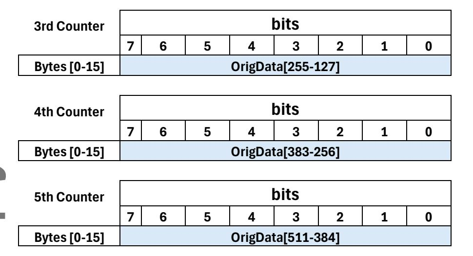

[JSON Extraction](_page_34_Figure_2.json)

The table below describes the mapping **AAD** bits of **non-1st beat of the originator data**. The AAD size is 32-bits.

**Table 9-18 Mapping AAD bits for Originator data non 1st beat**

|         | AAD Orig Data other beats (not 1st) = 32b |  |  |             |  |  |             |                     |      |  |  |  |  |
|---------|-------------------------------------------|--|--|-------------|--|--|-------------|---------------------|------|--|--|--|--|
| bits    |                                           |  |  |             |  |  |             |                     |      |  |  |  |  |
|         | 7 6 5 4 3 2 1 0      |  |  |             |  |  |             |                     |      |  |  |  |  |
|         | 0                                         |  |  | 0`s Padding |  |  |             | OrigDataOffset[1:0] | Last |  |  |  |  |
| By      | 1                                         |  |  |             |  |  | 0`s Padding |                     |      |  |  |  |  |
| te s | 2                                         |  |  |             |  |  | 0`s Padding |                     |      |  |  |  |  |
|         | 3                                         |  |  |             |  |  | 0`s Padding |                     |      |  |  |  |  |

The table below describes the mapping **MSG** bits of **non-1st beat of the originator data non-full write word**. The MSG size is 640-bits

The first 128-bits of the MSG will consume the 1st 128-bits encrypted counter and contains the ByteEnable field mapped on the same location as in the 1st beat with the request. The rest of 512-bits of the Originator data fields will consume from the 2nd to the 5th 128-bits encrypted counters.

**Table 9-19 Mapping MSG bits for Full-word Wr Req (w. Byte Enable) non 1st beat**

**MSG Orig Data other beats (not 1st)**

|              |   |                   |   |   |                   | bits              |   |   |   |   |
|--------------|---|-------------------|---|---|-------------------|-------------------|---|---|---|---|
| 1st Counter  |   |                   | 7 | 6 | 5                 | 4                 | 3 | 2 | 1 | 0 |
|              |   | 0                 |   |   |                   | 0`s Padding       |   |   |   |   |
|              |   |                   |   |   |                   |                   |   |   |   |   |
|              |   | 1                 |   |   |                   | 0`s Padding       |   |   |   |   |
|              |   | 2                 |   |   |                   | 0`s Padding       |   |   |   |   |
|              |   | 3                 |   |   |                   | 0`s Padding       |   |   |   |   |
|              |   | 4                 |   |   |                   | ByteEnable[7:0]   |   |   |   |   |
|              |   | 5                 |   |   |                   | ByteEnable[15:8]  |   |   |   |   |
| By           |   | 6                 |   |   |                   | ByteEnable[23:16] |   |   |   |   |
| te           |   | 7                 |   |   |                   | ByteEnable[31:24] |   |   |   |   |
| s            |   | 8                 |   |   |                   | ByteEnable[39:32] |   |   |   |   |
|              |   | 9                 |   |   |                   | ByteEnable[47:40] |   |   |   |   |
|              |   | 10                |   |   |                   | ByteEnable[55:48] |   |   |   |   |
|              |   | 11                |   |   |                   | ByteEnable[63:56] |   |   |   |   |
|              |   | 12                |   |   |                   | 0`s Padding       |   |   |   |   |
|              |   | 13                |   |   |                   | 0`s Padding       |   |   |   |   |
|              |   | 14                |   |   |                   | 0`s Padding       |   |   |   |   |
|              |   | 15                |   |   |                   | 0`s Padding       |   |   |   |   |
|              |   |                   |   |   |                   |                   |   |   |   |   |
| 2nd Counter  |   |                   |   |   |                   | bits              |   |   |   |   |
|              | 7 | 6                 | 5 |   | 4                 | 3                 | 2 |   | 1 | 0 |
| Bytes [0-15] |   |                   |   |   | OrigData[127-0]   |                   |   |   |   |   |
|              |   |                   |   |   |                   |                   |   |   |   |   |
| 3rd Counter  |   |                   |   |   |                   | bits              |   |   |   |   |
|              | 7 | 6                 | 5 |   | 4                 | 3                 | 2 |   | 1 | 0 |
| Bytes [0-15] |   |                   |   |   | OrigData[255-127] |                   |   |   |   |   |
|              |   |                   |   |   |                   |                   |   |   |   |   |
| 4th Counter  |   |                   |   |   |                   | bits              |   |   |   |   |
|              | 7 | 6                 | 5 |   | 4                 | 3                 | 2 |   | 1 | 0 |
| Bytes [0-15] |   | OrigData[383-256] |   |   |                   |                   |   |   |   |   |
|              |   |                   |   |   |                   |                   |   |   |   |   |
| 5th Counter  |   |                   |   |   |                   | bits              |   |   |   |   |
|              | 7 | 6                 | 5 |   | 4                 | 3                 | 2 |   | 1 | 0 |
|              |   |                   |   |   |                   |                   |   |   |   |   |

The table below describes the mapping **MSG** bits of **non-1st beat of the originator data full write word**. The MSG size is 512-bits will consume 4 128-bits encrypted counters.

**Table 9-20 Mapping MSG bits for Full-word Wr Req (w/o Byte Enable) non 1st beat**

| 1st Counter | bits |
|-------------|------|
|             |      |

**Bytes [0-15] OrigData[511-384]**

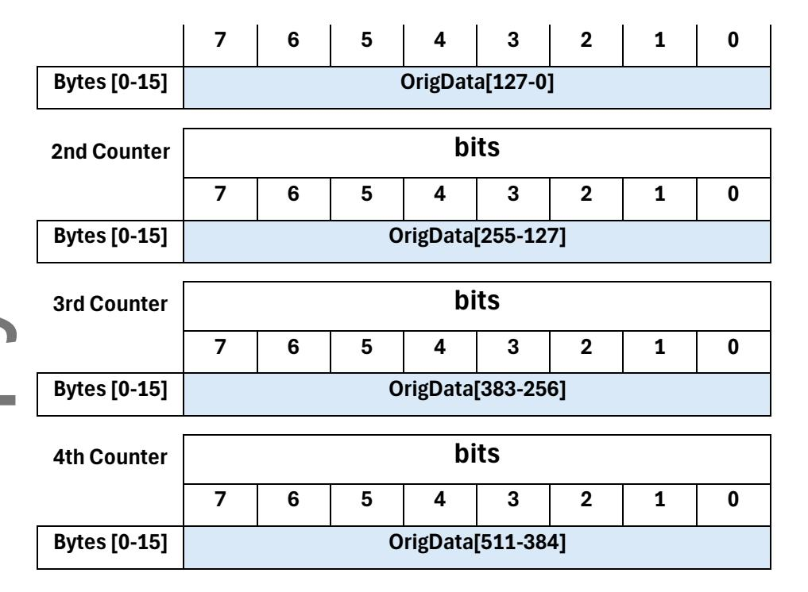

[JSON Extraction](_page_36_Figure_2.json)

The table below describes the mapping **AAD** bits for **read response**. The AAD size is 32-bits.

**Table 9-21 Mapping Read Response Channel AAD bits**

| AAD Read Response = 32b         |      |                                                |                                    |  |  |  |  |                  |      |  |  |
|---------------------------------|------|------------------------------------------------|------------------------------------|--|--|--|--|------------------|------|--|--|
|                                 | bits |                                                |                                    |  |  |  |  |                  |      |  |  |
| 7 6 5 4 3 2 1 |      |                                                |                                    |  |  |  |  |                  | 0    |  |  |
|                                 | 0    | Beats[0]                                       | RdRspStatus[3:0]                   |  |  |  |  | RdrspOffset[1:0] | Last |  |  |
| By                              | 1    |                                                | RdRspDstPhysAccID[6:0] Beats[1] |  |  |  |  |                  |      |  |  |
| te s                         | 2    | ReqSrcPhysAccID[4:0] RdRspDstPhysAccID[9:7] |                                    |  |  |  |  |                  |      |  |  |
|                                 | 3    | 0`s Padding RdRspSrcPhysAccID[9:5]          |                                    |  |  |  |  |                  |      |  |  |

The table below describes the mapping **MSG** bits for **Read Response**. The MSG size is 640-bits.

The first 128-bits of the MSG will consume the 1st 128-bits encrypted counter and contains only the WrRspTag field 0`s padded. The rest of 512-bits of the Originator data fields will consume from the 2nd to the 5th 128-bits encrypted counters.

**Table 9-22 Mapping MSG bits for Read Response**

## **MSG Read Response**

|              |    | bits               |   |             |   |               |   |                |   |  |  |
|--------------|----|--------------------|---|-------------|---|---------------|---|----------------|---|--|--|
| 1st Counter  |    | 7                  | 6 | 5           | 4 | 3             | 2 | 1              | 0 |  |  |
|              | 0  |                    |   |             |   | WrRspTag[7:0] |   |                |   |  |  |
|              | 1  |                    |   | 0`s Padding |   |               |   | WrRspTag[10:8] |   |  |  |
|              | 2  |                    |   |             |   | 0`s Padding   |   |                |   |  |  |
|              | 3  |                    |   |             |   | 0`s Padding   |   |                |   |  |  |
|              | 4  |                    |   |             |   | 0`s Padding   |   |                |   |  |  |
|              | 5  |                    |   |             |   | 0`s Padding   |   |                |   |  |  |
|              | 6  | 0`s Padding        |   |             |   |               |   |                |   |  |  |
| By           | 7  | 0`s Padding        |   |             |   |               |   |                |   |  |  |
| te s      | 8  | 0`s Padding        |   |             |   |               |   |                |   |  |  |
|              | 9  |                    |   |             |   | 0`s Padding   |   |                |   |  |  |
|              | 10 |                    |   |             |   | 0`s Padding   |   |                |   |  |  |
|              | 11 | 0`s Padding        |   |             |   |               |   |                |   |  |  |
|              | 12 | 0`s Padding        |   |             |   |               |   |                |   |  |  |
|              | 13 | 0`s Padding        |   |             |   |               |   |                |   |  |  |
|              | 14 | 0`s Padding        |   |             |   |               |   |                |   |  |  |
|              | 15 | 0`s Padding        |   |             |   |               |   |                |   |  |  |
| 2nd Counter  |    | bits               |   |             |   |               |   |                |   |  |  |
|              |    | 7                  | 6 | 5           | 4 | 3             | 2 | 1              | 0 |  |  |
| Bytes [0-15] |    | RdRspData[127-0]   |   |             |   |               |   |                |   |  |  |
| 3rd Counter  |    | bits               |   |             |   |               |   |                |   |  |  |
|              |    | 7                  | 6 | 5           | 4 | 3             | 2 | 1              | 0 |  |  |
| Bytes [0-15] |    | RdRspData[255-127] |   |             |   |               |   |                |   |  |  |
|              |    |                    |   |             |   |               |   |                |   |  |  |
| 4th Counter  |    | bits               |   |             |   |               |   |                |   |  |  |
|              | 7  | 6                  | 5 | 4           | 3 | 2             | 1 | 0              |   |  |  |
| Bytes [0-15] |    | RdRspData[383-256] |   |             |   |               |   |                |   |  |  |
| 5th Counter  |    |                    |   |             |   | bits          |   |                |   |  |  |
|              |    | 7                  | 6 | 5           | 4 | 3             | 2 | 1              | 0 |  |  |
|              |    |                    |   |             |   |               |   |                |   |  |  |

**Bytes [0-15] RdRspData[511-384]**

The table below describes the mapping **AAD** bits for **write response**. The AAD size is 32-bits.

**Table 9-23 Mapping Read Response Channel AAD bits**

| AAD Write response = 32b |   |                                                  |      |   |   |   |   |   |   |  |
|--------------------------|---|--------------------------------------------------|------|---|---|---|---|---|---|--|
|                          |   |                                                  | bits |   |   |   |   |   |   |  |
|                          |   | 7                                                | 6    | 5 | 4 | 3 | 2 | 1 | 0 |  |
|                          | 0 | WrRspDstPhysAccID[3:0] WrRspStatus[3:0]       |      |   |   |   |   |   |   |  |
| By                       | 1 | WrRspSrcPhysAccID[1:0] WrRspDstPhysAccID[9:4] |      |   |   |   |   |   |   |  |
| te s                  | 2 | WrRspSrcPhysAccID[9:2]                           |      |   |   |   |   |   |   |  |
|                          | 3 | 0`s Padding                                      |      |   |   |   |   |   |   |  |

The table below describes the mapping **MSG** bits for **Write Response**. The MSG size is 128-bits **Table 9-24 Mapping Write Response Channel MSG bits**

| MSG Write response = 128b |                    |             |   |             |                |   |   |   |   |  |  |
|---------------------------|--------------------|-------------|---|-------------|----------------|---|---|---|---|--|--|
|                           |                    | bits        |   |             |                |   |   |   |   |  |  |
|                           |                    | 7           | 6 | 5           | 4              | 3 | 2 | 1 | 0 |  |  |
|                           | 0 WrRspTag[7:0] |             |   |             |                |   |   |   |   |  |  |
|                           | 1                  |             |   | 0`s Padding | WrRspTag[10:8] |   |   |   |   |  |  |
|                           | 2                  | 0`s Padding |   |             |                |   |   |   |   |  |  |
|                           | 3                  | 0`s Padding |   |             |                |   |   |   |   |  |  |
|                           | 4                  | 0`s Padding |   |             |                |   |   |   |   |  |  |
|                           | 5                  | 0`s Padding |   |             |                |   |   |   |   |  |  |
|                           | 6                  | 0`s Padding |   |             |                |   |   |   |   |  |  |
| By                        | 7                  | 0`s Padding |   |             |                |   |   |   |   |  |  |
| te s                   | 8                  | 0`s Padding |   |             |                |   |   |   |   |  |  |
|                           | 9                  | 0`s Padding |   |             |                |   |   |   |   |  |  |
|                           | 10                 | 0`s Padding |   |             |                |   |   |   |   |  |  |
|                           | 11                 | 0`s Padding |   |             |                |   |   |   |   |  |  |
|                           | 12                 | 0`s Padding |   |             |                |   |   |   |   |  |  |
|                           | 13                 | 0`s Padding |   |             |                |   |   |   |   |  |  |
|                           | 14                 | 0`s Padding |   |             |                |   |   |   |   |  |  |
|                           | 15                 | 0`s Padding |   |             |                |   |   |   |   |  |  |

## **9.5.10 Initializing encrypted and authenticated transmission and reception**

For UALink 1.0, It is assumed that encryption (and optionally, authentication) is enabled on a per virtual Pod basis. This means that all traffic transmitted or received by a port belonging to that pod will be encrypted and optionally authenticated. In addition, it is assumed that no valid transactions are sent out by an UALink TX prior to configuring and enabling encryption and authentication. This ensures that the very first transaction that an RX receives is an encrypted (and optionally authenticated) transaction. With these assumptions, the trusted SW (i.e., CCM within a TVM) is expected to do the following for initialization of encrypted (and optionally authenticated) transmission and reception:

- 1. Generate active and alternate master keys for each TX-RX pair in the virtual POD.
- 2. Program the derived key expiry threshold in each TX and RX.
- 3. Program the master key expiry threshold in each TX and (optionally) in RX.
- 4. Set the active bit to 1 for the active master key for each UALink RX and TX.
- 5. Set the active bit to 0 for the alternate master key for each UALlink TX and RX.

An example flow for initialization is as follows:

- For each UALink TX in the pod:
  - o The CCM in the lead node of the virtual POD instructs the CCM of the sub-ordinate node which has the accelerator containing the UALink TX to do the security related programming. The lead CCM also provides the master keys (active and alternate), the master key expiry threshold and derived key expiry threshold
    - Keys are generated for each source accelerator TX/destination accelerator RX pair for which a path exists through the UALink fabric. Destination accelerator keys in source accelerator TX and source accelerator keys in the destination accelerator RX are identical for a given TX/RX pair.
  - o The sub-ordinate node CCM that manages the accelerator containing the UALink TX does the following:
    - The CCM SW configures the active master key value and alternate master key value registers in UALink TX for each destination accelerator. It sets the active bit to 1 for the active master key and 0 for the alternate master key. It sets the valid bit to 1 for both active and alternate master keys. It sets a bit to trigger a key derivation using the active master key in preparation for enabling encrypted transmission.
    - For each destination accelerator, CCM configures the derived key expiry threshold for all three streams.
    - For each destination accelerator, CCM programs the master key expiry threshold
  - o Once these steps are completed, the sub-ordinate node CCM that manages the accelerator containing the UALink TX informs the lead CCM that programming is complete.
- For each UALink RX in the pod the following flow is used:
  - o The CCM in the lead node of the virtual POD instructs the CCM of the sub-ordinate node which has the accelerator containing the UALink RX to do the security related programming. It also provides the master keys (active and alternate), the master key expiry threshold and derived key expiry threshold.

- o The sub-ordinate node CCM that manages the accelerator containing the UAL RX does the following:
  - The CCM SW configures the active master key and the alternate master key in UALink RX for each source accelerator. It sets the active bit to 1 for the active master key and 0 for the alternate master key. It sets the valid bit to 1 for both active and alternate master keys It sets a bit to trigger a key derivation using the active master key in preparation for enabling encrypted reception.
  - For each source accelerator, CCM configures the derived key expiry threshold for all three streams.
  - For each source accelerator, CCM programs the master key expiry threshold.
- o Once these steps are completed, the sub-ordinate node CCM that manages the accelerator containing the UALink RX informs the lead CCM that programming is complete.
  - Note that transmission shall not start until key derivation is complete.
- Once these steps are complete for all TX and RX pairs in the Virtual Pod, the lead CCM instructs the sub-ordinate CCMs in the Virtual Pod of all accelerators in the pod to enable encrypted and (optionally) authenticated transaction reception in all UALink ports.
- Once reception is enabled in all accelerators, the lead CCM instructs the sub-ordinate CCMs of all accelerators in the pod to enable encrypted and (optionally) authenticated transaction transmission in all UALink ports.
- The very first valid transaction that a RX receives will be encrypted and (optionally) authenticated transaction.

## **9.5.11 Refreshing an expired key**

The following is an example flow for refreshing an expired key.

- An active master key for a specific destination accelerator hits a key expiry threshold (SW configured threshold or the HW threshold) in TX of an accelerator. The TX HW executes the key swap flow and clears the valid bit and active bit of the active master key and sets the active bit of the alternate master key (if the alternate master key has its valid bit set; else it will report an error to security processor) . This means that the TX alternate master key is now invalid.
- The TX informs the accelerators security processor via an interrupt. The status register corresponding to the interrupt event shall indicate the destination accelerator for which the active master key has expired.
- The security processor firmware handler for this event informs the node CCM instance which manages the accelerator. The report will include the exact source accelerator ID, destination accelerator ID, source port ID within the source accelerator for which this expiry event occurred.
- The node CCM will co-ordinate with the lead node CCM to generate a new key and program it into the UALink TX that reported the expiry event as the new alternate master key. It will also set the valid bit for the newly programmed key.
- Node CCM will co-ordinate via the lead node CCM with the node CCM responsible for the destination accelerator to do the following for the destination accelerator:
  - o Determine the specific UALink port whose RX to be programmed.
  - o Program the new alternate master key for the source accelerator in the appropriate UALink RX and set its valid bit to 1. Note that the key programmed in the UALink TX and UALink RX are identical.

## **9.5.12 Safeguarding UALink configuration to ensure confidentiality and integrity**

From a security perspective, registers in the UALink port/station can be classified into two categories

- A. Registers that only trusted SW/FW shall configure. E.g., the Active master key register. To ensure confidentiality and integrity, such registers shall have restricted access such that only SW/FW that are trusted can write to them.
- B. Registers (and configuration storage arrays/lookup tables) that should be configured by untrusted SW/FW (e.g., address decoding related registers), but can cause loss of confidentiality and/or integrity and/or execution corruption if maliciously modified. These registers shall have a "lock" mechanism which ensures that only secure software/firmware has write access once the register/array is in locked state. This ensures that untrusted SW/FW can configure these registers and then trusted SW/FW can lock the register (preventing further updates by untrusted SW/FW), verify the configuration's validity and then enable secure transmission/reception. The "lock" shall be set by the DSM by writing to one or more registers that only DSM can access.

It is the implementers responsibility to conduct a security audit of all configuration registers (and configuration storage arrays/look up tables) and decide which registers need to be in category A and which needs to be in category B.

## **9.5.13 Integrity failure handling**

As soon as an integrity check failure is detected for a transaction within a stream, the receiver shall drop the failing transaction and stop processing new transactions from that source (all streams). In addition, the receiver will report a security failure to the security processor within the accelerator via hardware/firmware means that cannot be manipulated by untrusted HW/SW/FW. The security processor within the accelerator is responsible for informing the TVM (essentially CCM) of the failure.

## **9.5.14 Switch requirements**

Switches need to support the following:

- 1. Detecting that the control flit has an associated tag half flit at ingress ports.
- 2. Unpacking of tag half flits and associating each control half flit request/response with its tag
- 3. Packing the tag of a transaction into a tag half flit at egress.
- 4. Maintaining the order for each stream between a source accelerator port and destination accelerator port. Note that the traffic between a SrcID, DstID pair would include KeyRollMSG requests and corresponding responses.

## **9.5.15 Key Derivation Function Requirements**

To ensure UALinkSec provides strong cryptographic protection the derivation of the key material used by the AES-GCM-256 encryption shall be performed using a strong and NIST approved Key Derivation Function (KDF). The NIST Special Publication SP 800-56 provides several options. As of this writing, the publication is on its second revision

[https://nvlpubs.nist.gov/nistpubs/SpecialPublications/NIST.SP.800-56Cr2.pdf.](https://nvlpubs.nist.gov/nistpubs/SpecialPublications/NIST.SP.800-56Cr2.pdf) The key derivation function for UA Link shall be KMAC256 as specified in SP800-56 Section 4.1, Option 3.