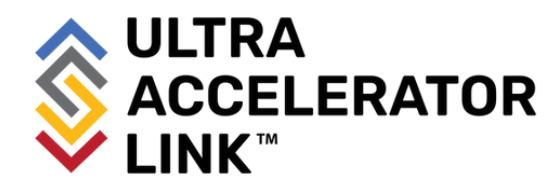

Ultra Accelerator Link Consortium, Inc. Specification

> UALink\_200 Rev 1.0

### LEGAL NOTICE FOR THIS PUBLICLY-AVAILABLE SPECIFICATION FROM ULTRA ACCELERATOR LINK CONSORTIUM, INC.

## © 2024-2025 ULTRA ACCELERATOR LINK CONSORTIUM, INC. ALL RIGHTS RESERVED.

This Ultra Accelerator Link Consortium, Inc. **Specification UALink\_200 Rev 1.0** (this "<u>UALink Specification</u>" or this "<u>document</u>") is owned by and is proprietary to Ultra Accelerator Link Consortium, Inc., a Delaware nonprofit corporation (sometimes referred to as "<u>UALink</u>" or the "<u>UALink</u>" or the "<u>Company</u>") and/or its successors and assigns.

#### NOTICE TO USERS WHO ARE MEMBERS OF THE UALINK CONSORTIUM:

If you are a Member of the UALink Consortium (sometimes referred to as a "<u>UALink Member</u>"), and even if you have received this publicly-available version of this UALink Specification after agreeing to UALink Consortium's Evaluation Copy Agreement (a copy of which is available at (<a href="https://ualinkconsortium.org/specification/">https://ualinkconsortium.org/specification/</a>) each such UALink Member must also be in compliance with all of the following UALink Consortium documents, policies and/or procedures (collectively, the "<u>UALink Governing Documents</u>") in order for such UALink Member's use and/or implementation of this UALink Specification to receive and enjoy all of the rights, benefits, privileges and protections of UALink Consortium member ship: (i) UALink Consortium's Intellectual Property Policy; (ii) UALink Consortium's Bylaws; (iii) any and all other UALink Consortium policies and procedures; and (iv) the UALink Member's Participation Agreement.

#### NOTICE TO NON-MEMBERS OF THE UALINK CONSORTIUM:

If you are <u>not</u> a UALink Member and have received this publicly-available version of this UALink Specification, your use of this document is subject to your compliance with, and is limited by, all of the terms and conditions of the UALink Consortium's Evaluation Copy Agreement (a copy of which is available at (https://ualinkconsortium.org/specification/).

In addition to the restrictions set forth in the UALink Consortium's Evaluation Copy Agreement, any references or citations to this document must acknowledge the Ultra Accelerator Link Consortium, Inc.'s sole and exclusive copyright ownership of this UALink Specification. The proper copyright citation or reference is as follows: "© 2024-2025 ULTRA ACCELERATOR LINK CONSORTIUM, INC. ALL RIGHTS RESERVED." When making any such citation or reference to this document you are not permitted to revise, alter, modify, make any derivatives of, or otherwise amend the referenced portion of this document in any way without the prior express written permission of the Ultra Accelerator Link Consortium, Inc.

Except for the limited rights explicitly given to a non-UALink Member pursuant to the explicit provisions of the UALink Consortium's Evaluation Copy Agreement which governs the publicly-available version of this UALink Specification, nothing contained in this UALink Specification shall be deemed as granting (either expressly or impliedly) to any party that is <u>not</u> a UALink Member: (ii) any kind of license to implement or use this UALink Specification or any portion or content described or contained therein, or any kind of license in or to any other intellectual property owned or controlled by the UALink Consortium, including without limitation any trademarks of the UALink Consortium.; or (ii) any benefits and/or rights as a UALink Member under any UALink Governing Documents.

For clarify, and without limiting the foregoing notice in any way, if you are <u>not</u> a UALink Member but still elect to implement this UALink Specification or any portion described herein, you are hereby given notice that your election to do so does not give you any of the rights, benefits, and/or protections of the UALink Members, including without limitation any of the rights, benefits, privileges or protections given to a UALink Member under the UALink Consortium's Intellectual Property Policy.

# LEGAL DISCLAIMERS AND ADDITIONAL NOTICE FOR ALL PARTIES:

THIS DOCUMENT AND ALL SPECIFICATIONS AND/OR OTHER CONTENT PROVIDED HEREIN ARE PROVIDED ON AN "AS IS" BASIS. TO THE MAXIMUM EXTENT PERMITTED BY APPLICABLE LAW, ULTRA ACCELERATOR LINK CONSORTIUM, INC. (ALONG WITH THE CONTRIBUTORS TO THIS DOCUMENT) HEREBY DISCLAIM ALL REPRESENTATIONS, WARRANTIES AND/OR COVENANTS, EITHER EXPRESS OR IMPLIED, STATUTORY OR AT COMMON LAW, INCLUDING, BUT NOT LIMITED TO, THE IMPLIED WARRANTIES OF MERCHANTABILITY, FITNESS FOR A PARTICULAR PURPOSE, TITLE, VALIDITY, AND/OR NON-INFRINGEMENT.

In the event this UALink Specification makes any references (including without limitation any incorporation by reference) to another standard's setting organization's or any other party's ("Third Party") content or work, including without limitation any specifications or standards of any such Third Party ("Third Party Specification"), you are hereby notified that your use or implementation of any Third Party Specification: (i) is not governed by any of the UALink Governing Documents; (ii) may require your use of a Third Party's patents, copyrights or other intellectual property rights, which in turn may require you to independently obtain a license or other consent from that Third Party in order to have full rights to implement or use that Third Party Specification; and/or (iii) may be governed by the intellectual property policy or other policies or procedures of the Third Party which owns the Third Party Specification. Any trademarks or service marks of any Third Party which may be referenced in this UALink Specification is owned by the respective owner of such marks.

The **UALINK™** trademark, the **ULTRA ACCELERATOR LINK CONSORTIUM™** trademark, and related logos (the "<u>UALINK Trademarks</u>") are trademarks owned by Ultra Accelerator Link Consortium, Inc., a Delaware corporation, and it hereby reserves all rights, title and interest in and to all of its UALINK

Trademarks. This document does **not** confer (and shall **not** be construed to be an agreement or instrument which does confer) any rights or license to use any UALink Trademarks.

# **NOTICE TO ALL PARTIES REGARDING THE PCI-SIG UNIQUE VALUE PROVIDED IN THIS UALINK SPECIFICATION**:

NOTICE TO USERS: THE UNIQUE VALUE THAT IS PROVIDED IN THIS UALINK SPECIFICATION IS FOR USE IN VENDOR DEFINED MESSAGE FIELDS, DESIGNATED VENDOR SPECIFIC EXTENDED CAPABILITIES, AND ALTERNATE PROTOCOL NEGOTIATION ONLY AND MAY NOT BE USED IN ANY OTHER MANNER, AND A USER OF THE UNIQUE VALUE MAY NOT USE THE UNIQUE VALUE IN A MANNER THAT (A) ALTERS, MODIFIES, HARMS OR DAMAGES THE TECHNICAL FUNCTIONING, SAFETY OR SECURITY OF THE PCI-SIG ECOSYSTEM OR ANY PORTION THEREOF, OR (B) COULD OR WOULD REASONABLY BE DETERMINED TO ALTER, MODIFY, HARM OR DAMAGE THE TECHNICAL FUNCTIONING, SAFETY OR SECURITY OF THE PCI-SIG ECOSYSTEM OR ANY PORTION THEREOF (FOR PURPOSES OF THIS NOTICE, "**PCI-SIG ECOSYSTEM**" MEANS THE PCI-SIG SPECIFICATIONS, MEMBERS OF PCI-SIG AND THEIR ASSOCIATED PRODUCTS AND SERVICES THAT INCORPORATE ALL OR A PORTION OF A PCI-SIG SPECIFICATION AND EXTENDS TO THOSE PRODUCTS AND SERVICES INTERFACING WITH PCI-SIG MEMBER PRODUCTS AND SERVICES).