Ultra Accelerator Link Consortium, Inc. Specification

> UALink\_200 Rev 1.0

### LEGAL NOTICE FOR THIS PUBLICLY-AVAILABLE SPECIFICATION FROM ULTRA ACCELERATOR LINK CONSORTIUM, INC.

### © 2024-2025 ULTRA ACCELERATOR LINK CONSORTIUM, INC. ALL RIGHTS RESERVED.

This Ultra Accelerator Link Consortium, Inc. **Specification UALink\_200 Rev 1.0** (this "<u>UALink Specification</u>" or this "<u>document</u>") is owned by and is proprietary to Ultra Accelerator Link Consortium, Inc., a Delaware nonprofit corporation (sometimes referred to as "<u>UALink</u>" or the "<u>UALink</u>" or the "<u>Company</u>") and/or its successors and assigns.

### NOTICE TO USERS WHO ARE MEMBERS OF THE UALINK CONSORTIUM:

If you are a Member of the UALink Consortium (sometimes referred to as a "<u>UALink Member</u>"), and even if you have received this publicly-available version of this UALink Specification after agreeing to UALink Consortium's Evaluation Copy Agreement (a copy of which is available at (<a href="https://ualinkconsortium.org/specification/">https://ualinkconsortium.org/specification/</a>) each such UALink Member must also be in compliance with all of the following UALink Consortium documents, policies and/or procedures (collectively, the "<u>UALink Governing Documents</u>") in order for such UALink Member's use and/or implementation of this UALink Specification to receive and enjoy all of the rights, benefits, privileges and protections of UALink Consortium member ship: (i) UALink Consortium's Intellectual Property Policy; (ii) UALink Consortium's Bylaws; (iii) any and all other UALink Consortium policies and procedures; and (iv) the UALink Member's Participation Agreement.

### NOTICE TO NON-MEMBERS OF THE UALINK CONSORTIUM:

If you are <u>not</u> a UALink Member and have received this publicly-available version of this UALink Specification, your use of this document is subject to your compliance with, and is limited by, all of the terms and conditions of the UALink Consortium's Evaluation Copy Agreement (a copy of which is available at (https://ualinkconsortium.org/specification/).

In addition to the restrictions set forth in the UALink Consortium's Evaluation Copy Agreement, any references or citations to this document must acknowledge the Ultra Accelerator Link Consortium, Inc.'s sole and exclusive copyright ownership of this UALink Specification. The proper copyright citation or reference is as follows: "© 2024-2025 ULTRA ACCELERATOR LINK CONSORTIUM, INC. ALL RIGHTS RESERVED." When making any such citation or reference to this document you are not permitted to revise, alter, modify, make any derivatives of, or otherwise amend the referenced portion of this document in any way without the prior express written permission of the Ultra Accelerator Link Consortium, Inc.

Except for the limited rights explicitly given to a non-UALink Member pursuant to the explicit provisions of the UALink Consortium's Evaluation Copy Agreement which governs the publicly-available version of this UALink Specification, nothing contained in this UALink Specification shall be deemed as granting (either expressly or impliedly) to any party that is <u>not</u> a UALink Member: (ii) any kind of license to implement or use this UALink Specification or any portion or content described or contained therein, or any kind of license in or to any other intellectual property owned or controlled by the UALink Consortium, including without limitation any trademarks of the UALink Consortium.; or (ii) any benefits and/or rights as a UALink Member under any UALink Governing Documents.

For clarify, and without limiting the foregoing notice in any way, if you are <u>not</u> a UALink Member but still elect to implement this UALink Specification or any portion described herein, you are hereby given notice that your election to do so does not give you any of the rights, benefits, and/or protections of the UALink Members, including without limitation any of the rights, benefits, privileges or protections given to a UALink Member under the UALink Consortium's Intellectual Property Policy.

# LEGAL DISCLAIMERS AND ADDITIONAL NOTICE FOR ALL PARTIES:

THIS DOCUMENT AND ALL SPECIFICATIONS AND/OR OTHER CONTENT PROVIDED HEREIN ARE PROVIDED ON AN "AS IS" BASIS. TO THE MAXIMUM EXTENT PERMITTED BY APPLICABLE LAW, ULTRA ACCELERATOR LINK CONSORTIUM, INC. (ALONG WITH THE CONTRIBUTORS TO THIS DOCUMENT) HEREBY DISCLAIM ALL REPRESENTATIONS, WARRANTIES AND/OR COVENANTS, EITHER EXPRESS OR IMPLIED, STATUTORY OR AT COMMON LAW, INCLUDING, BUT NOT LIMITED TO, THE IMPLIED WARRANTIES OF MERCHANTABILITY, FITNESS FOR A PARTICULAR PURPOSE, TITLE, VALIDITY, AND/OR NON-INFRINGEMENT.

In the event this UALink Specification makes any references (including without limitation any incorporation by reference) to another standard's setting organization's or any other party's ("Third Party") content or work, including without limitation any specifications or standards of any such Third Party ("Third Party Specification"), you are hereby notified that your use or implementation of any Third Party Specification: (i) is not governed by any of the UALink Governing Documents; (ii) may require your use of a Third Party's patents, copyrights or other intellectual property rights, which in turn may require you to independently obtain a license or other consent from that Third Party in order to have full rights to implement or use that Third Party Specification; and/or (iii) may be governed by the intellectual property policy or other policies or procedures of the Third Party which owns the Third Party Specification. Any trademarks or service marks of any Third Party which may be referenced in this UALink Specification is owned by the respective owner of such marks.

The **UALINK™** trademark, the **ULTRA ACCELERATOR LINK CONSORTIUM™** trademark, and related logos (the "<u>UALINK Trademarks</u>") are trademarks owned by Ultra Accelerator Link Consortium, Inc., a Delaware corporation, and it hereby reserves all rights, title and interest in and to all of its UALINK

Trademarks. This document does **not** confer (and shall **not** be construed to be an agreement or instrument which does confer) any rights or license to use any UALink Trademarks.

### **NOTICE TO ALL PARTIES REGARDING THE PCI-SIG UNIQUE VALUE PROVIDED IN THIS UALINK SPECIFICATION**:

NOTICE TO USERS: THE UNIQUE VALUE THAT IS PROVIDED IN THIS UALINK SPECIFICATION IS FOR USE IN VENDOR DEFINED MESSAGE FIELDS, DESIGNATED VENDOR SPECIFIC EXTENDED CAPABILITIES, AND ALTERNATE PROTOCOL NEGOTIATION ONLY AND MAY NOT BE USED IN ANY OTHER MANNER, AND A USER OF THE UNIQUE VALUE MAY NOT USE THE UNIQUE VALUE IN A MANNER THAT (A) ALTERS, MODIFIES, HARMS OR DAMAGES THE TECHNICAL FUNCTIONING, SAFETY OR SECURITY OF THE PCI-SIG ECOSYSTEM OR ANY PORTION THEREOF, OR (B) COULD OR WOULD REASONABLY BE DETERMINED TO ALTER, MODIFY, HARM OR DAMAGE THE TECHNICAL FUNCTIONING, SAFETY OR SECURITY OF THE PCI-SIG ECOSYSTEM OR ANY PORTION THEREOF (FOR PURPOSES OF THIS NOTICE, "**PCI-SIG ECOSYSTEM**" MEANS THE PCI-SIG SPECIFICATIONS, MEMBERS OF PCI-SIG AND THEIR ASSOCIATED PRODUCTS AND SERVICES THAT INCORPORATE ALL OR A PORTION OF A PCI-SIG SPECIFICATION AND EXTENDS TO THOSE PRODUCTS AND SERVICES INTERFACING WITH PCI-SIG MEMBER PRODUCTS AND SERVICES).

# **Table of Contents**

| Legal Not   | ice                                                                          | 2  |
|-------------|------------------------------------------------------------------------------|----|
| Table of C  | Contents                                                                     | 4  |
| List of Fig | gures                                                                        | 10 |
| List of Ta  | bles                                                                         | 13 |
| Revision 1  | History                                                                      | 16 |
| Preface     |                                                                              | 18 |
| About 7     | This Specification                                                           | 18 |
| Termin      | ology                                                                        | 20 |
| 1 Intro     | ductionduction                                                               | 22 |
| 1.1         | Multi-Node Accelerator System                                                | 22 |
| 1.2         | Accelerator System Node                                                      | 24 |
| 1.3         | UALink Stack Interface Layers                                                | 25 |
| 1.3.1       | Protocol Layer                                                               | 25 |
| 1.3.2       | Transaction Layer                                                            | 25 |
| 1.3.3       | Data Link Layer                                                              | 26 |
| 1.3.4       | Physical Layer                                                               | 26 |
| 1.4         | UALink Address Translation Model                                             | 27 |
| 1.4.1       | Remote Memory Access (RMA)                                                   | 27 |
| 1.5         | UALink Coherency                                                             | 29 |
| 2 UPLI      | Interface Definition and Operation Rules                                     | 30 |
| 2.1         | UPLI Interface                                                               | 30 |
| 2.2         | UALink Stack Component                                                       | 34 |
| 2.3         | UALink UPLI Request and Response Paths                                       | 36 |
| 2.4         | Routing a Transaction from End-to-End                                        | 38 |
| 2.5         | UPLI Channel Time Division Multiplexing (TDM)                                | 42 |
| 2.6         | UALink Protocol Level Interface Flow Control and overall UALink Flow control | 44 |
| 2.7         | Interface Signals                                                            | 47 |
| 2.7.1       | Signal Groups                                                                | 47 |
| 2.7.2       | Common Signals                                                               | 47 |
| 2.7.3       | UPLI Transactions/Channel usage                                              | 47 |
| 2.7.4       | Request Channel                                                              | 50 |
| 2.7.5       | Read Response/Data Channel                                                   | 58 |
| 2.7.6       | Write Response Channel                                                       | 62 |
| 2.7.7       | Originator Data Channel                                                      | 65 |
|             | Table of Contents                                                            | 4  |

|   | 2.7.8  | Relationships between UPLI Channels and requirements within the Channels66 |  |
|---|--------|----------------------------------------------------------------------------|--|
|   | 2.7.9  | UPLI Request, Read Response, and Write Response ordering68                 |  |
|   | 2.7.10 | UPLI Request Single-Copy Atomicity69                                       |  |
|   | 2.8    | Data/Atomic Operands Transfer 69                                        |  |
| 3 |        | Reliability, Availability, and Serviceability (RAS)80                      |  |
|   | 3.1    | RAS Requirements 80                                                     |  |
|   | 3.1.1  | End to End Data Protection81                                               |  |
|   | 3.1.2  | RAS Error Types 82                                                      |  |
|   | 3.1.3  | RAS Error Handling Mechanisms 83                                        |  |
|   | 3.1.4  | UALink RAS Error Handling86                                                |  |
| 4 |        | UPLI Interface Reset, Signaling, and Connection94                          |  |
|   | 4.1    | UPLI Interface Reset94                                                     |  |
|   | 4.2    | UPLI Interface Signaling Requirements 95                                |  |
|   | 4.3    | UPLI Interface Control96                                                   |  |
| 5 |        | Transaction Layer (TL)98                                                   |  |
|   | 5.1    | TL Flit and Half Flit formats 98                                        |  |
|   | 5.1.1  | TL Flit and TL Control and Data Half-Flit formats and Sequencing 98     |  |
|   | 5.1.2  | TL Message Flit Format and Sequencing101                                   |  |
|   | 5.2    | TL Flit Sequencing and Packing Examples102                                 |  |
|   | 5.3    | Indicating Data Corruption in TL Data Half-Flits. 107                   |  |
|   | 5.4    | TL Write Flit Sequence Encoding Efficiency Examples108                     |  |
|   | 5.4.1  | Single WriteFull Request and Single WriteFull Response109                  |  |
|   | 5.4.2  | WriteFull Requests and Compressed WriteFull Responses 109               |  |
|   | 5.4.3  | Compressed WriteFull Requests and Compressed WriteFull Responses110        |  |
|   | 5.4.4  | Maximum Efficiency WriteFulls111                                           |  |
|   | 5.4.5  | Maximum Efficiency WriteFulls with Authentication112                       |  |
|   | 5.4.6  | Maximum Efficiency Reads. 113                                           |  |
|   | 5.4.7  | Maximum Efficiency Reads with Authentication. 114                       |  |
|   | 5.4.8  | Maximum Efficiency With Mixed Reads and Writes115                          |  |
|   | 5.5    | TL Tx and Rx Dataflow and Tx and Rx Compression Caches117                  |  |
|   | 5.6    | TL Tx and Rx Address Cache Synchronization. 120                         |  |
|   | 5.6.1  | CLOAD and CWAY control signals121                                          |  |
|   | 5.6.2  | Address Cache sequencing at the Tx Address Cache and Rx Address Cache121   |  |
|   | 5.7    | TL Control Half-Flit Request/Response Field packing limits122              |  |
|   | 5.8    | TL Flow Control126                                                         |  |

|   | >        |  |
|---|----------|--|
|   | 0        |  |
|   | C        |  |
|   |          |  |
| • | ati      |  |
|   |          |  |
|   | <u>a</u> |  |
|   | Ú        |  |

|   | 5.9   | TL Control Field Bit Assignments and Legal TL Message Flit Types  | 129 |
|---|-------|-------------------------------------------------------------------|-----|
|   | 5.9.1 | Uncompressed Request Field                                        | 130 |
|   | 5.9.2 | Uncompressed Response Field                                       | 131 |
|   | 5.9.3 | Compressed Request Field                                          | 133 |
|   | 5.9.4 | Compressed Response Field for Single Beat Read Response           | 135 |
|   | 5.9.5 | Compressed Response Field for a Write or Multi-Beat Read Response | 136 |
|   | 5.9.6 | Flow Control/NOP Field                                            | 137 |
|   | 5.10  | Recommended TL backoff modes                                      | 138 |
| 6 | Data  | Link                                                              | 139 |
|   | 6.1   | Overview                                                          | 139 |
|   | 6.2   | Data Link Features                                                | 140 |
|   | 6.2.1 | Packing Flits                                                     | 140 |
|   | 6.2.2 | DL message service                                                | 140 |
|   | 6.2.3 | UART                                                              | 140 |
|   | 6.2.4 | Tx Pacing, Rx Rate Adaptation                                     | 141 |
|   | 6.3   | Flit Format                                                       | 142 |
|   | 6.3.1 | DL Flit Overview                                                  | 142 |
|   | 6.3.2 | Flit Header                                                       | 143 |
|   | 6.3.3 | Segment Header                                                    | 143 |
|   | 6.3.4 | Flit packing rules                                                | 144 |
|   | 6.3.5 | TL Flit to DL Flit Mapping                                        | 147 |
|   | 6.3.6 | DL Flit to 64B/66B encoding                                       | 149 |
|   | 6.3.7 | CRC                                                               | 149 |
|   | 6.4   | DL messages                                                       | 150 |
|   | 6.4.1 | Message Overview                                                  | 150 |
|   | 6.4.2 | Basic Messages                                                    | 150 |
|   | 6.4.3 | Control Messages                                                  | 154 |
|   | 6.4.4 | UART Messages                                                     | 159 |
|   | 6.5   | Transmitter Pacing                                                | 164 |
|   | 6.5.1 | Overview                                                          | 164 |
|   | 6.5.2 | Switch                                                            | 164 |
|   | 6.5.3 | Accelerator                                                       | 165 |
|   | 6.5.4 | Sequence                                                          | 165 |
|   | 6.6   | Link Level Replay                                                 | 165 |
|   | 6.6.1 | Overview                                                          | 165 |
|   |       |                                                                   |     |

|   | U             |
|---|---------------|
|   |               |
|   |               |
|   |               |
|   |               |
|   |               |
|   |               |
| _ |               |
|   |               |
|   |               |
|   | U             |
|   | $\overline{}$ |
|   |               |
|   |               |
|   | (U)           |
|   |               |
| _ |               |
|   |               |
|   |               |

|   | 6.6.2 | Flit Header                       | 166 |
|---|-------|-----------------------------------|-----|
|   | 6.6.3 | Term Definitions                  | 167 |
|   | 6.6.4 | Rx Flags and Counters             | 168 |
|   | 6.6.5 | Tx Flags and Counters             | 169 |
|   | 6.6.6 | General Rules                     | 170 |
|   | 6.6.7 | Round Trip Time                   | 176 |
|   | 6.7   | Link State and Errors             | 177 |
|   | 6.7.1 | DL Link States                    | 177 |
|   | 6.7.2 | Correctable Errors                | 178 |
|   | 6.7.3 | Uncorrectable Errors              | 178 |
|   | 6.7.4 | Error Containment                 | 178 |
| 7 | Physi | cal Layer                         | 180 |
|   | 7.1   | Introduction                      | 180 |
|   | 7.2   | Reconciliation Sublayer (RS)      | 183 |
|   | 7.2.1 | Introduction                      | 183 |
|   | 7.2.2 | Data Flow                         | 183 |
|   | 7.2.3 | DL Flits                          | 183 |
|   | 7.2.4 | Control Flits                     | 184 |
|   | 7.2.5 | Data and Control Blocks and Codes | 185 |
|   | 7.2.6 | Link fault signaling              | 186 |
|   | 7.2.7 | Flit and Lane Alignment           | 187 |
|   | 7.2.8 | Receive State Machine             | 188 |
|   | 7.3   | PCS/PMA modifications             | 188 |
|   | 7.3.1 | Introduction                      | 188 |
|   | 7.3.2 | DL Flit to PCS codeword alignment | 188 |
|   | 7.3.3 | Reduced FEC interleave            | 189 |
|   | 7.3.4 | Decode Encode                     | 189 |
|   | 7.3.5 | Rate Matching                     | 189 |
|   | 7.3.6 | Back-to-Back DL Flits             | 190 |
|   | 7.4   | PCS and FEC for 100GBASE-R        | 191 |
|   | 7.4.1 | Removed functional Blocks         | 191 |
|   | 7.4.2 | Transmit Function                 | 192 |
|   | 7.4.3 | Receive Function                  | 192 |
|   | 7.5   | PCS for 200GBASE-R and 400GBASE-R | 194 |
|   | 7.5.1 | Transmit Function                 | 194 |

|   |   | ) |
|---|---|---|
|   |   |   |
|   | _ |   |
|   |   |   |
|   |   |   |
| 1 |   |   |
|   |   |   |
|   |   |   |
|   |   |   |
|   |   |   |
|   |   |   |
|   |   |   |
|   |   |   |
|   |   |   |
| - |   |   |
|   | - |   |
| " |   |   |
|   | 7 |   |
|   |   |   |
|   |   |   |
|   |   |   |
| " |   |   |
|   |   |   |
|   |   |   |
|   |   |   |
|   |   |   |
|   |   |   |

|   | 7.5.2  | Receive Function                                                          | 195 |
|---|--------|---------------------------------------------------------------------------|-----|
|   | 7.6    | PCS for 800GBASE-R                                                        | 196 |
|   | 7.6.1  | Transmit Function                                                         | 197 |
|   | 7.6.2  | Receive Function                                                          | 198 |
|   | 7.7    | Low Latency FEC Interleave                                                | 199 |
|   | 7.7.1  | 400GBASE-KR2/CR2 (2-way interleave)                                       | 199 |
|   | 7.7.2  | 200GBASE-KR1/CR1 (2-way interleave)                                       | 199 |
|   | 7.7.3  | 200GBASE-KR1/CR1 (1-way interleave)                                       | 199 |
| 8 | Mana   | geability Requirements                                                    | 203 |
|   | 8.1    | UALink Accelerators and System Nodes                                      | 203 |
|   | 8.2    | UALink Switches and Switch Platforms                                      | 203 |
|   | 8.3    | UALink Pod Controller                                                     | 204 |
|   | 8.4    | UALink Virtual Pods                                                       | 205 |
|   | 8.5    | Manageability Workflows                                                   | 206 |
| 9 | Secur  | ity                                                                       | 208 |
|   | 9.1    | References                                                                | 208 |
|   | 9.2    | System Overview                                                           | 208 |
|   | 9.3    | Security model                                                            | 209 |
|   | 9.3.1  | Security objectives:                                                      | 209 |
|   | 9.3.2  | Trusted Computing Base (TCB)                                              | 210 |
|   | 9.3.3  | Adversary profile and capabilities                                        | 210 |
|   | 9.3.4  | Security Assumptions                                                      | 211 |
|   | 9.3.5  | Threat model                                                              | 211 |
|   | 9.4    | UALink System Security                                                    | 212 |
|   | 9.5    | Encryption and authentication scheme for UALink                           | 215 |
|   | 9.5.1  | AES-GCM IV format                                                         | 216 |
|   | 9.5.2  | Control Half-Flit field encryption                                        | 217 |
|   | 9.5.3  | Control Half-Flit field authentication                                    | 217 |
|   | 9.5.4  | Data authentication and encryption                                        | 221 |
|   | 9.5.5  | Poisoned data handling with security enabled                              | 221 |
|   | 9.5.6  | ISOLATE response handling                                                 | 222 |
|   | 9.5.7  | Modes of operation                                                        | 222 |
|   | 9.5.8  | Ordering requirements imposed due to AES-GCM                              | 222 |
|   | 9.5.9  | Authentication and Encryption/Decryption Implementation in an UALink port | 223 |
|   | 9.5.10 | Initializing encrypted and authenticated transmission and reception       | 247 |
|   |        |                                                                           |     |

# Evaluation Copy

| .5.1  | 1 Refreshing an expired key                                                                    | 248                                                                                                        |
|-------|------------------------------------------------------------------------------------------------|------------------------------------------------------------------------------------------------------------|
| .5.12 | 2 Safeguarding UALink configuration to ensure confidentiality and integrity                    | 249                                                                                                        |
| .5.13 | 3 Integrity failure handling                                                                   | 249                                                                                                        |
| .5.14 | 4 Switch requirements                                                                          | 249                                                                                                        |
| .5.1  | 5 Key Derivation Function Requirements                                                         | 249                                                                                                        |
| U     | ALink Switch Requirements                                                                      | 250                                                                                                        |
| 1     | Overview                                                                                       |                                                                                                            |
| 2     | Bifurcation support                                                                            | 250                                                                                                        |
| 3     | Lossless Request and Response delivery                                                         | 250                                                                                                        |
| 4     | Non-blocking architecture                                                                      | 251                                                                                                        |
| 5     | Forward progress guarantee                                                                     | 251                                                                                                        |
| 6     | Ordering and Virtual Channels                                                                  | 251                                                                                                        |
| 7     | Routing Table Structure                                                                        | 251                                                                                                        |
| 0.7.  | 1 Routing Table Instances                                                                      | 252                                                                                                        |
| 0.7.2 | 2 Egress port reachability                                                                     | 252                                                                                                        |
| 3     | Configuration                                                                                  | 252                                                                                                        |
| 9     | UALink Switch Recommendations and Goals                                                        | 252                                                                                                        |
| 0.9.  | 1 Debug                                                                                        | 252                                                                                                        |
| 0.9.2 | 2 Latency goals                                                                                | 253                                                                                                        |
| 0.9.3 | 3 Performance goals                                                                            | 253                                                                                                        |
|       | .5.1 .5.1 .5.1 .5.1 U 1 2 3 4 5 6 7 0.7. 3 9 0.9. | Safeguarding UALink configuration to ensure confidentiality and integrity  5.13 Integrity failure handling |

# **List of Figures**

| Figure 0-1 UALink Connectivity Overview 18                                                 |    |
|-----------------------------------------------------------------------------------------------|----|
| Figure 1-1 UALink Based Multi-Accelerator System 22                                        |    |
| Figure 1-2 Accelerator communication over a direct link and over a Switch24                   |    |
| Figure 1-3 UALink Stack25                                                                     |    |
| Figure 1-4 UALink cross-domain address translation model27                                    |    |
| Figure 1-5 Translation Process28                                                              |    |
| Figure 2-1 UALink Protocol Level Interface30                                                  |    |
| Figure 2-2 Extending a UPLI interface through Intermediate UPLI Interfaces 31              |    |
| Figure 2-3 UALink Protocol Level Interface Channels and control signals 32                 |    |
| Figure 2-4 UALink Stack Component34                                                           |    |
| Figure 2-5 Connected UALink Stack Components 35                                            |    |
| Figure 2-6 End-to End UALink Connection Between two Accelerators36                            |    |
| Figure 2-7 UPLI Request and Response Flows37                                                  |    |
| Figure 2-8 Example system with 32 Accelerators with 32 x1 UALink Links38                      |    |
| Figure 2-9 Read Request end-to-end flow with Response39                                       |    |
| Figure 2-10 UALink Station with x1 bifurcation42                                              |    |
| Figure 2-11 Flow control loops 46                                                          |    |
| Figure 2-12 Four DoubleWorld Read Request Not Straddling a 64-Byte Boundary71                 |    |
| Figure 2-13 Four DoubleWord Read Request Straddling a 64-byte boundary 71                  |    |
| Figure 2-14 Single Byte Read72                                                                |    |
| Figure 2-15 Six Byte Read Access Not Straddling a 64-Byte Boundary72                          |    |
| Figure 2-16 Four Byte Read Access Straddling a 64-Byte Boundary73                             |    |
| Figure 2-17 Four Doubleword Write Request Not Straddling a 64 Byte Boundary74                 |    |
| Figure 2-18 Sixteen Doubleword Write Request Not Straddling a 64-Byte Bounday 74           |    |
| Figure 2-19 Three Doubleword Write Request Straddling a 64 Byte Boundary75                    |    |
| Figure 2-20 A 128 Byte Write Full Request (Requires Two Beats)75                              |    |
| Figure 2-21 Single Operand (Eight-Byte Operands) Atomic 77                                 |    |
| Figure 2-22 Single Operand (Four-Byte Operands) Atomic 77                                  |    |
| Figure 2-23 Double Operand (Eight-Byte Operands) Atomic, Data Returned in High 32 Bytes.      | 78 |
| Figure 2-24 Double Operand (Four-Byte Operands) Atomic, Data Returned in Low 32 Bytes79       |    |
| Figure 3-1 UALink End to End Data Protection 81                                            |    |
| Figure 3-2 UPLI Control Error detected at an Originator or Completer not on a UALink TL on an |    |
| Accelerators87                                                                                |    |
| Figure 3-3 UPLI Control Error detected at a UALink TL on an Accelerator 88                 |    |
| Figure 3-4 UPLI Interface Control Error detected at the UALink TL on the Switch89             |    |
| Figure 3-5 UPLI Control Error detected at the UPLI Completer on a Switch89                    |    |
| Figure 3-6 UPLI Control Error detected within the Switch Core at the UPLI Originator90        |    |
| Figure 3-7 UALink Link goes down91                                                            |    |
| Figure 3-8 PHYs Inform UALink TLs in Accelerator and Switch Which Enter Drop Mode91           |    |
| Figure 3-9 Placing the Accelerator UPLI Originator Into Isolation Mode 92                  |    |
| Figure 3-10 Other Accelerators Time Out92                                                     |    |
| Figure 3-11 Link Down Error Processing Complete93                                             |    |
| Figure 4-1 UPLI Interface Reset Requirements. 94                                           |    |
| Figure 4-2 UPLI Connection Handshake Protocol – Originator connects first97                |    |
| Figure 4-3 UPLI Connection Handshake Protocol – Completer connects first 97             |    |
| Figure 4-4 UPLI Connection Handshake Protocol – Originator and Completer connecting        |    |
| concurrently 97                                                                            |    |
| List of Figures                                                                               | 10 |

| 0  |
|----|
| O  |
|    |
|    |
|    |
| 0  |
| Ţ  |
| a  |
|    |
|    |
| (0 |
|    |
| Ш  |
|    |

| rigure 5-1: 1L filt connections to OPLI interfaces                                                                                   | 90  |
|--------------------------------------------------------------------------------------------------------------------------------------|-----|
| Figure 5-2: UALink TL Tx Dataflow                                                                                                    |     |
| Figure 5-3: UALink TL Rx Dataflow                                                                                                    |     |
| Figure 5-4: Indexing of Accelerator Tx Address Caches/Switch Rx Address Caches                                                       |     |
| Figure 5-5: Indexing of Switch Tx Address Caches/Accelerator Rx Address Caches                                                       |     |
| Figure 5-6 TL Receive Catch Buffer Dataflow                                                                                          |     |
| Figure 5-7: Flow Control Field Relation to Credit Channels.                                                                          | 126 |
| Figure 6-1 DL block Diagram                                                                                                          |     |
| Figure 6-2 UART                                                                                                                      |     |
| Figure 6-3 DL 640-Byte Flit Overview                                                                                                 |     |
| Figure 6-4 DL Flit with segment details                                                                                              |     |
| Figure 6-5 Flit packing flow chart                                                                                                   |     |
| Figure 6-6 TL Flit[0] example 1                                                                                                      |     |
| Figure 6-7 TL Flit[1] example 1                                                                                                      |     |
| Figure 6-8 TL Flit[0] example 2                                                                                                      |     |
| Figure 6-9 DL Flit to 64B/66B Encoding                                                                                               | 140 |
| Figure 6-10 Single Request Flow                                                                                                      |     |
| Figure 6-11 Two Requests Flow                                                                                                        |     |
| Figure 6-12 Single Successful Request Flow                                                                                           |     |
| Figure 6-13 Single Unsuccessful Request Flow                                                                                         |     |
| Figure 6-14 Single decision pending Request Flow                                                                                     |     |
| Figure 6-15 Conflicting request flow                                                                                                 |     |
| Figure 6-16 Identical Request Flow                                                                                                   |     |
| Figure 6-17 Vendor Defined Packet                                                                                                    |     |
| Figure 6-18 Pacing                                                                                                                   |     |
| Figure 6-19 Ack Replay Request valid range                                                                                           |     |
| Figure 6-20 Rx Flow Chart                                                                                                            | 17/ |
| Figure 6-21 Tx Flow Chart                                                                                                            |     |
| Figure 6-22 Round Trip Time                                                                                                          |     |
| Figure 6-23 DL Link State                                                                                                            |     |
| Figure 7-1 Physical Layer Block Diagram                                                                                              |     |
| Figure 7-2 64B/66B Block Codes                                                                                                       |     |
| Figure 7-3 100GBASE-R                                                                                                                |     |
| Figure 7-4 200GBASE-R & 400GBASE-R                                                                                                   |     |
| Figure 7-5 800GBASE-R                                                                                                                |     |
| Figure 7-6 200GBASE-KR1/CR1, 1-Way Interleave                                                                                        | 201 |
| Figure 8-1 UALink System Node                                                                                                        |     |
| Figure 8-2. A UALink Switch Platform                                                                                                 |     |
| Figure 8-3. A UALink Pod managed by a Pod Controller                                                                                 |     |
|                                                                                                                                      |     |
| Figure 8-4. A UALink Pod partitioned into three Virtual Pods                                                                         |     |
| Figure 9-1 System level view of confidential computing in a podFigure 9-2 Encryption and Authentication touch points in UALink stack |     |
|                                                                                                                                      |     |
| Figure 9-3 Example of UALink TL flit with the "Tag" half flit                                                                        |     |
| Figure 9-4 Security related state elements in UALink port TX for a 1024 accelerator system                                           |     |
| Figure 9-5 Security related state elements in UALink RX for a 1024 accelerator system                                                |     |
| Figure 9-6 Illustration of master keys maintained by UALink Port RX and TX in a UALink sy                                            |     |
| Figure 9-7 A 4 accelerator UALink system example                                                                                     |     |
| Figure 9-8 Stream-Key derivation flow in UALink port TX                                                                              |     |
| Figure 9-9 Key swap flow in UALink port TX                                                                                           |     |
| List of Figures                                                                                                                      | 11  |

| Figure 9-10 Key derivation flow in UALink Port RX 234                                             |  |
|------------------------------------------------------------------------------------------------------|--|
| Figure 9-11 Key switch flow in UALink port RX235                                                     |  |
| Figure 9-12 Source accelerator - Destination accelerator interactions for key swap flow 236 |  |

# **List of Tables**

| Table 2-1 Common Signals 47                                                                    |     |
|---------------------------------------------------------------------------------------------------|-----|
| Table 2-2 Request Channel Signals 50                                                           |     |
| Table 2-3 Read, ReqAttr Usage 53                                                               |     |
| Table 2-4 Atomic Request ReqAttr Usage 53                                                      |     |
| Table 2-5 Atomic OpSize Encoding 53                                                            |     |
| Table 2-6 Commands 54                                                                          |     |
| Table 2-7 UPLI Write Message Request Types57                                                      |     |
| Table 2-8 Read Response/Data Channel Signals58                                                 |     |
| Table 2-9 RdRspStatus [3:0] Encoding for Predefined Commands60                                    |     |
| Table 2-10 RdRspStatus[3:0] Encoding for Vendor Defined Command60                                 |     |
| Table 2-11 Write Response Channel Signals62                                                       |     |
| Table 2-12 WrRspStatus[3:0] Encoding for Predefined Commands 64                             |     |
| Table 2-13 WrRspStatus[3:0] Encoding for Vendor Defined Commands64                                |     |
|                                                                                                   |     |
| Table 2-14 Originator Data Channel Signals 65                                                  |     |
| Table 5-1: TL Flit organization99                                                                 |     |
| Table 5-2: Control Half Flit Field Footprints and Sizes99                                         |     |
| Table 5-3: TL Flit with Message Indicator Bits102                                                 |     |
| Table 5-4: Message TL Half-Flit102                                                                |     |
| Table 5-5: An 8-sector Request (Read) followed by a Mandatory NOP Half Flit. 103               |     |
| Table 5-6: A 4 sector Request (WriteFull 256 bytes) followed by a Control Half Flit with Flow     |     |
| Control. 103                                                                                   |     |
| Table 5-7: A 4 sector Request (Write 192 bytes) followed by a Control Half Flit with Flow Control |     |
| 104                                                                                               |     |
| Table 5-8: A 2-sector Request (64 byte write), NOP, FC, and 4-sector AtomicR request104           |     |
| Table 5-9: A 2-sector Request (64 byte write), NOP, FC, and 4-sector AtomicR request105           |     |
| Table 5-10: A 2-sector Request (256 byte write), 2-sector Request (256-byte WriteFull), and a 4-  |     |
| sector AtomicNR105                                                                                |     |
| Table 5-11: Authentication mode example matching the prior example. 106                        |     |
| Table 5-12: Read Requests and Associated Read Responses107                                        |     |
| Table 5-13: 256-byte WriteFull with corrupt second 64-byte beat. 108                           |     |
| Table 5-14: An example illustrating corrupted Atomic Operand data108                              |     |
| Table 5-15 A single 4-sector Request (WriteFull 256 bytes) and a 2-sector Write Response109       |     |
| Table 5-16 Three 4 sector WriteFull 256 byte Requests and three Compressed Write Responses.110 |     |
| Table 5-17 Four 2 sector WriteFull 256-byte Requests and four Compressed Write Responses.      | 111 |
| Table 5-18: Five 2 sector WriteFull 256-byte Requests and Five Compressed Write Responses112      |     |
| Table 5-19: Two 2 sector WriteFull 256-byte Requests and Two Compressed Write Responses.          | 113 |
| Table 5-20: Five 2 sector Read 256-byte Requests and Five Compressed Read Responses114            |     |
| Table 5-21: Two 2-sector Read 256-byte Requests and Two Compressed Read Responses. 115         |     |
| Table 5-22 Three Write, Two Read Maximum Efficiency Example 116                                |     |
| Table 5-23 Address Cache Loading Request Availability121                                          |     |
| Table 5-24 Request Packing without Data Half-Flits123                                             |     |
| Table 5-25 Request Pacing with Data Half-Flits 123                                             |     |
| Table 5-26: Flow Control Field Signals127                                                         |     |
| Table 5-27: TL Control Half-Flit Message Type Values129                                           |     |
| Table 5-28: Legal TL Message Half-Flits 129                                                    |     |
| Table 5-29 Uncompressed Request Field Signals 130                                              |     |
| Table 5-30 Uncompressed Response Field Signals 131                                          |     |
| List of Tables                                                                                    | 13  |
|                                                                                                   |     |

| Table 5-31 Compressed Request Field Signals 133                                            |     |
|-----------------------------------------------------------------------------------------------|-----|
| Table 5-32 Compressed Request Usage Restrictions. 134                                      |     |
| Table 5-33 Compressed Request Command Encoding134                                             |     |
| Table 5-34 Compressed Response for Single Beat Read Field Signals135                       |     |
| Table 5-35 Compressed Response for Single-Beat Read Response Usage Restrictions. 135       |     |
| Table 5-36 Compressed Response for Write or Multi-Beat Read Field Signals136                  |     |
| Table 5-37 Compressed Response for Write or Multi-Beat Read Response Usage Restrictions.      | 136 |
| Table 5-38 Flow Control/NOP Field137                                                          |     |
| Table 6-1 Sector Allocation per Segment142                                                 |     |
| Table 6-2 Segment Header 144                                                               |     |
| Table 6-3 DL Message Types150                                                                 |     |
| Table 6-4 TL Rate Notification152                                                             |     |
| Table 6-5 Device ID Request153                                                                |     |
| Table 6-6 Port ID Request154                                                                  |     |
| Table 6-7 No-Op Message 154                                                                |     |
| Table 6-8 Channel Negotiation 159                                                          |     |
| Table 6-9 Vendor Defined Packet Type Length (TL) DWord 162                                 |     |
| Table 6-10 UART Stream Reset Request162                                                       |     |
| Table 6-11 UART Stream Reset Response163                                                      |     |
| Table 6-12 UART Stream transport message163                                                   |     |
| Table 6-13 UART Stream Credit Update 163                                                   |     |
| Table 6-14 Explicit Sequence Number Flit Header 167                                        |     |
| Table 6-15 Command Flit Header167                                                             |     |
| Table 7-1 100Gbps Serial Clauses182                                                           |     |
| Table 7-2 200Gbps Serial Clauses182                                                           |     |
| Table 7-3 Sequential Ordered Sets186                                                          |     |
| Table 7-4 Reduced Interleave FEC 189                                                    |     |
| Table 9-1 Possible attack types 210                                                        |     |
| Table 9-2 Threat model212                                                                     |     |
| Table 9-3 IV Format216                                                                        |     |
| Table 9-4 Request channel signals that are encrypted and authenticated217                     |     |
| Table 9-5 Read response channel signals that are authenticated and encrypted218               |     |
| Table 9-6 Write response channel signals that are authenticated and encrypted220              |     |
| Table 9-7 Originator data channel signals that are authenticated and encrypted220             |     |
| Table 9-8 Request Channel Fields for AAD and MSG - Non Write or UPLI Write Message Request | 237 |
| Table 9-9 Originator Data Channel Fields for AAD and MSG (partial-word write or UPLI Write    |     |
| Message Request)237                                                                           |     |
| Table 9-10 Originator Data Channel Fields for AAD and MSG (Full Write) 237                 |     |
| Table 9-11 Read Response channel fields for AAD and MSG 238                                |     |
| Table 9-12 Write Response channel fields for AAD and MSG238                                   |     |
| Table 9-13 Mapping Request Channel AAD bits238                                                |     |
| Table 9-14 Mapping Request Channel MSG bits for non write and non UPLI Write Message          | 239 |
| Table 9-15 Mapping Request and Originator Data channels AAD bits for Wr Req or UPLI Write     |     |
| Message 239                                                                                |     |
| Table 9-16 Mapping MSG bits for Write Request w. Byte Enable or UPLI Write Message of the 1st |     |
| beat240                                                                                       |     |
| Table 9-17 Mapping MSG bits for Full-word Wr Req (w/o Byte Enable) of the 1st beat241         |     |
| Table 9-18 Mapping AAD bits for Originator data non 1st beat 242                           |     |
| Table 9-19 Mapping MSG bits for Full-word Wr Req (w. Byte Enable) non 1st beat242             |     |
| List of Tables                                                                                | 14  |

# Evaluation Copy

| Table 9-20 Mapping MSG bits for Full-word Wr Req (w/o Byte Enable) non 1st beat243 |  |
|------------------------------------------------------------------------------------|--|
| Table 9-21 Mapping Read Response Channel AAD bits 244                           |  |
| Table 9-22 Mapping MSG bits for Read Response 244                            |  |
| Table 9-23 Mapping Read Response Channel AAD bits 246                           |  |
| Table 9-24 Mapping Write Response Channel MSG bits246                              |  |

# **Revision History**

| Rev        | Date       | Changes                                                                                                                                                                                                                                                                                                                                                                                                                                                                                                                                                                                                     |
|------------|------------|-------------------------------------------------------------------------------------------------------------------------------------------------------------------------------------------------------------------------------------------------------------------------------------------------------------------------------------------------------------------------------------------------------------------------------------------------------------------------------------------------------------------------------------------------------------------------------------------------------------|
| UALink 200 |            |                                                                                                                                                                                                                                                                                                                                                                                                                                                                                                                                                                                                             |
| 0.49       | 10/23/2024 | Initial pre-release of UALink200 specification to test new Word template.                                                                                                                                                                                                                                                                                                                                                                                                                                                                                                                                |
| 0.50       | 10/28/2024 | Added initial Fault Management and Telemetry section.                                                                                                                                                                                                                                                                                                                                                                                                                                                                                                                                                       |
| 0.70       | 12/01/2024 | Added TL Chapter details. Various Changes in other sections.                                                                                                                                                                                                                                                                                                                                                                                                                                                                                                                                                |
| 0.71       | 12/9/2024  | Reworked Credit Return interfaces for UPLI and clarified Credit Return interface for TL. Other small changes in TL section.                                                                                                                                                                                                                                                                                                                                                                                                                                                                              |
| 0.90       | 1/5/2025   | Added new Security and Switch Requirements Sections. Added Authentication tag support in UPLI/TL. UALink operation Single Copy-Atomicity defined. DL Link Level Replay support and other DL changes. Restructured the Manageability Requirements section.                                                                                                                                                                                                                                                                                                                                       |
| 0.91       | 1/8/2025   | Rebuild of 0.90 to include the TL section after the mis-build in 0.90                                                                                                                                                                                                                                                                                                                                                                                                                                                                                                                                    |
| 0.92       | 2/4/2025   | Added support in UPLI section for Authorization Tags and UPLI Write Message Requests. Additional detail on Vendor Defined Commands (to be completed in next release). Clarifications on Ordering and Single-Copy-Atomicity of UPLI Requests. Corrections to TL Flit packing and additional examples in TL section. Manageability/Security chapters content reorganized to remove redundancy and terminology harmonized. Details for handling poisoning of data in security modes. Clarifications in security chapter on various implementation flows and implementation details. |
| 0.93       | 2/16/2025  | Clarifications on Vendor Defined Command Semantics. Clarification on Ordering Rules (particularly with regard to Vendor Defined Commands). Additional TL Flit packing examples (including Reads and mixtures of Reads and Writes). UPLI and TL Credit Return Interfaces restructured and significantly simplified. ISOLATE Write Response further clarified. Definitions for Pod/Virtual Pod/Switch/Physical Switch. Added Vendor Defined UPLI Write Messages. Suggested backoff modes for TL Control Half-Flit packing.                                                            |
| 1.0RC      | 2/19/2025  | Various corrections to terminology. Corrections to Terminology Table. Clarifications on initial credit release done signals on UPLI interface. Bit lanes and FTYPEs assigned for TL Flit packets. Minor corrections in security an PHY sections.                                                                                                                                                                                                                                                                                                                                                   |
| 1.0        | 4/1/2025   | Minor bug fixes and modifications for normative language.                                                                                                                                                                                                                                                                                                                                                                                                                                                                                                                                                   |

# **Preface**

# **About This Specification**

This specification is intended to define a set of protocols and interfaces that enable the creation of systems comprised of multiple System Nodes targeting AI applications. A System Node typically contains one or more Host CPUs and one or more Accelerators connected within the System Node utilizing an implementation specific set of interconnects such as CXL ®, PCIe ®, XGMI, CHI c2c, AMD Infinity Fabric ®, etc. These System Nodes can be and often are coherent within the System Node, meaning that each Accelerator and each Host CPU can directly and coherently access all Host and Accelerator memory within the given System Node though this is not required. The exact configuration and number of Accelerators and Hosts within a System Node and the nature of the coherence and accessibly to memory within the node is implementation specific and is not mandated by this specification. Each System Node is typically managed under the control of a single OS image (System Nodes are also referred to as "OS Domains").

The protocols and interfaces defined in this specification are intended to support low latency Accelerator-to-Accelerator communication across System Nodes using direct read, write, and atomics transactions. These protocols and interfaces do not, however, allow for Host CPU accesses to memory attached to device or host in another remote System Node.

The interfaces described in this specification are the UALink Protocol Level Interface (UPLI) and the Ultra Accelerator Link (UALink) interface. The UALink Protocol Level Interface is a point-to-point, on-chip interface comprised of various channels that transfer UPLI transactions consisting of Requests, Read data, Write data, and Request Responses between an Originator and a Completer. The Ultra Accelerator Link is a high-bandwidth point-to-point serial interface providing a connection between Accelerators and Switches that allows UPLI transactions to be transferred between Originators and Completers in Accelerators within and across System Nodes. This specification is primarily intended to create a switching ecosystem for Accelerators.

The figure below Figure 0-1 [UALink Connectivity Overview,](#page-17-2) illustrates a portion of a simple example system illustrating two (of possibly many) System Nodes (SN0 and SN1) each illustrating one (of possibly many) Host/Acc pairs in each of the System Nodes.

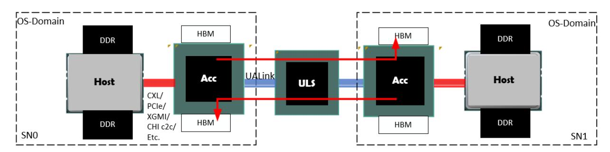

**Figure 0-1 UALink Connectivity Overview**

The illustrated Host and Accelerator (Acc) in each of the system nodes are connected using an implementation chosen interconnect such as CXL, PCIe, AMD Infinity Fabric, XGMI, CHI c2c, etc. (red) that can and often allows for Host and Acc access to all memory within the node or at least on the connected Host and Accelerator. The Accelerator is further attached to a set of UALink Links (blue) that connect to a Switch and then on to another set of UALink links to the remote Accelerator allowing UPLI transactions to be routed between Accelerators in different System Nodes (accesses can also be routed between Accelerators in the same System Node).

In a typical system, Requests from a given Accelerator in one System Node to a remote Accelerator in a different System Node may access any Accelerator memory or Host Memory in the Remote System node. This is illustrated above by red arrows above showing each Accelerator accessing the remote Accelerator's memory (Host and Accelerator accesses to local Host and Accelerator memory are not shown). Hosts accessing any memory in any remote System Nodes shall not be supported.

This version of the specification does not define or enable attaching devices to the Switches. It does not define or enable how to perform in-network, in-memory, or near-memory compute.

# **Terminology**

The following terms are used in this specification:

| Term Definition UALink Ultra Accelerator Link UPLI UALink Protocol Level Interface DL Data Link Layer DL Channel Logical channels with in DL, one for TL Flits, one for DL UART messages SH Segment header, used with in a DL Flit FH Flit Header, for DL Flit DL alternative sector Sectors in a DL Flit that are sued for non TL Flits DL message Message that starts and terminates at the DL CRC Cyclic redundancy check RS Reconciliation Layer, interface between PCA and DL AM Alignment marker, used for alignment of PCS lanes PCS Physical Coding Sublayer FEC Forward error correction PMA Physical Medium Attachment Interface GAUI Gigabit unit attachment VDCI Voltage Domain Crossing Interface SPA System Physical Address Field A group of one or more signals that share a name and encode a specific piece of information. Signals within a field are numbered according to binary significance. SOC System on Chip. SPC Symbols Per Clock Word Two Bytes Doubleword Four Bytes UART Universal Anonymous Receiver Transmitter. A DL mechanism for F/W on either end of the link to exchange information. Pod The collection of all the Accelerators and Switches physically connected though UALink via Switches. Virtual Pod A non-overlapping partition of a Pod where the Acclerators within the Virtual Pod may communicate with other Accelerators in the Virtual Pod, but no other Accelerators in the Pod. Availability Security objective ensuring a resource (e.g., network) is functioning and data is accessible when needed UALink Network The physical network of UALink Links and Switches connecting the Accelerators in a Pod. CC Confidential Computing Confidentiality Security objective ensuring data are only readable by an authorized party Front end network Network used by OS domains to communicate and establish a Tenant TCB. Infrastructure provider An organization that maintains computing resources such as servers, storage, networking and virtualization and provides them to the users on demand. Integrity Security objective ensuring data are only writeable and modifiable by an authorized party Pod Controller Central controller software responsible for managing the lifecycle of the Pod including topology discovery, configuration, resource management, virtual pod creation and management and Pod health monitoring. The Pod Controller is typically owned by the Infrastructure provider. Port encryption engine A port encryption engine has at least one association (key, IV/count/sequence #, etc.) and enough encryption/decryption capability to keep up with line rates. Additionally, based on implementation, the port encryption engine may have buffering associated with each association such that it can pre compute counter encryption values. An accelerator requires a port encryption engine per port. Switch An entity that can switch UALink traffic between a set of Ports equal in number to the number of Accelerators in the Pod. Physical Switch A physical hardware entity that can be used to implement a Switch and which can have Ports equal to he number of Accelerators in the Pod or Ports equal to an integer multiple greater than one of the number of Accelerators in the Pod. TCB Trusted Computing Base – The set of hardware and software components that are trusted to meet the security objectives of a feature. TEE Trusted Execution Environment. It is responsible for bringing an accelerator into the TCB and for UALsec configuration (e.g., key establishment). In the context of CC, TEE examples include Intel TDX, AMD SEV and ARM CCA). Tenant User of the infrastructure computing resources such as AI Cluster. In an AI cluster, the Tenant is typically assigned a set of accelerators (i.e., a Virtual Pod) to run its workload. TVM Trusted Execution Environment Virtual Machine. This is a confidential computing VM running in a TEE. One or more accelerators are assigned to a TVM which is responsible for secure configuration and management of those accelerators. |  |
|---------------------------------------------------------------------------------------------------------------------------------------------------------------------------------------------------------------------------------------------------------------------------------------------------------------------------------------------------------------------------------------------------------------------------------------------------------------------------------------------------------------------------------------------------------------------------------------------------------------------------------------------------------------------------------------------------------------------------------------------------------------------------------------------------------------------------------------------------------------------------------------------------------------------------------------------------------------------------------------------------------------------------------------------------------------------------------------------------------------------------------------------------------------------------------------------------------------------------------------------------------------------------------------------------------------------------------------------------------------------------------------------------------------------------------------------------------------------------------------------------------------------------------------------------------------------------------------------------------------------------------------------------------------------------------------------------------------------------------------------------------------------------------------------------------------------------------------------------------------------------------------------------------------------------------------------------------------------------------------------------------------------------------------------------------------------------------------------------------------------------------------------------------------------------------------------------------------------------------------------------------------------------------------------------------------------------------------------------------------------------------------------------------------------------------------------------------------------------------------------------------------------------------------------------------------------------------------------------------------------------------------------------------------------------------------------------------------------------------------------------------------------------------------------------------------------------------------------------------------------------------------------------------------------------------------------------------------------------------------------------------------------------------------------------------------------------------------------------------------------------------------------------------------------------------------------------------------------------------------------------------------------------------------------------------------------------------------------------------------------------------------------------------------------------------------------------------------------------------------------------------------------------------------------------------------------------------------------------------------------------------------------------------------------------------------------------------------------------------------------------------------------------------------------------------------------------------------------------------------------------------------------------------------------------------------------------------------------------------------------------------------------------------------------------------------------------------------------------------------------------------------------------------------------------------------------------------------------------------------------------------------------------------------------------------------------------------------------------------------------------------------------------------------------------|--|
|                                                                                                                                                                                                                                                                                                                                                                                                                                                                                                                                                                                                                                                                                                                                                                                                                                                                                                                                                                                                                                                                                                                                                                                                                                                                                                                                                                                                                                                                                                                                                                                                                                                                                                                                                                                                                                                                                                                                                                                                                                                                                                                                                                                                                                                                                                                                                                                                                                                                                                                                                                                                                                                                                                                                                                                                                                                                                                                                                                                                                                                                                                                                                                                                                                                                                                                                                                                                                                                                                                                                                                                                                                                                                                                                                                                                                                                                                                                                                                                                                                                                                                                                                                                                                                                                                                                                                                                                                           |  |
|                                                                                                                                                                                                                                                                                                                                                                                                                                                                                                                                                                                                                                                                                                                                                                                                                                                                                                                                                                                                                                                                                                                                                                                                                                                                                                                                                                                                                                                                                                                                                                                                                                                                                                                                                                                                                                                                                                                                                                                                                                                                                                                                                                                                                                                                                                                                                                                                                                                                                                                                                                                                                                                                                                                                                                                                                                                                                                                                                                                                                                                                                                                                                                                                                                                                                                                                                                                                                                                                                                                                                                                                                                                                                                                                                                                                                                                                                                                                                                                                                                                                                                                                                                                                                                                                                                                                                                                                                           |  |
|                                                                                                                                                                                                                                                                                                                                                                                                                                                                                                                                                                                                                                                                                                                                                                                                                                                                                                                                                                                                                                                                                                                                                                                                                                                                                                                                                                                                                                                                                                                                                                                                                                                                                                                                                                                                                                                                                                                                                                                                                                                                                                                                                                                                                                                                                                                                                                                                                                                                                                                                                                                                                                                                                                                                                                                                                                                                                                                                                                                                                                                                                                                                                                                                                                                                                                                                                                                                                                                                                                                                                                                                                                                                                                                                                                                                                                                                                                                                                                                                                                                                                                                                                                                                                                                                                                                                                                                                                           |  |
|                                                                                                                                                                                                                                                                                                                                                                                                                                                                                                                                                                                                                                                                                                                                                                                                                                                                                                                                                                                                                                                                                                                                                                                                                                                                                                                                                                                                                                                                                                                                                                                                                                                                                                                                                                                                                                                                                                                                                                                                                                                                                                                                                                                                                                                                                                                                                                                                                                                                                                                                                                                                                                                                                                                                                                                                                                                                                                                                                                                                                                                                                                                                                                                                                                                                                                                                                                                                                                                                                                                                                                                                                                                                                                                                                                                                                                                                                                                                                                                                                                                                                                                                                                                                                                                                                                                                                                                                                           |  |
|                                                                                                                                                                                                                                                                                                                                                                                                                                                                                                                                                                                                                                                                                                                                                                                                                                                                                                                                                                                                                                                                                                                                                                                                                                                                                                                                                                                                                                                                                                                                                                                                                                                                                                                                                                                                                                                                                                                                                                                                                                                                                                                                                                                                                                                                                                                                                                                                                                                                                                                                                                                                                                                                                                                                                                                                                                                                                                                                                                                                                                                                                                                                                                                                                                                                                                                                                                                                                                                                                                                                                                                                                                                                                                                                                                                                                                                                                                                                                                                                                                                                                                                                                                                                                                                                                                                                                                                                                           |  |
|                                                                                                                                                                                                                                                                                                                                                                                                                                                                                                                                                                                                                                                                                                                                                                                                                                                                                                                                                                                                                                                                                                                                                                                                                                                                                                                                                                                                                                                                                                                                                                                                                                                                                                                                                                                                                                                                                                                                                                                                                                                                                                                                                                                                                                                                                                                                                                                                                                                                                                                                                                                                                                                                                                                                                                                                                                                                                                                                                                                                                                                                                                                                                                                                                                                                                                                                                                                                                                                                                                                                                                                                                                                                                                                                                                                                                                                                                                                                                                                                                                                                                                                                                                                                                                                                                                                                                                                                                           |  |
|                                                                                                                                                                                                                                                                                                                                                                                                                                                                                                                                                                                                                                                                                                                                                                                                                                                                                                                                                                                                                                                                                                                                                                                                                                                                                                                                                                                                                                                                                                                                                                                                                                                                                                                                                                                                                                                                                                                                                                                                                                                                                                                                                                                                                                                                                                                                                                                                                                                                                                                                                                                                                                                                                                                                                                                                                                                                                                                                                                                                                                                                                                                                                                                                                                                                                                                                                                                                                                                                                                                                                                                                                                                                                                                                                                                                                                                                                                                                                                                                                                                                                                                                                                                                                                                                                                                                                                                                                           |  |
|                                                                                                                                                                                                                                                                                                                                                                                                                                                                                                                                                                                                                                                                                                                                                                                                                                                                                                                                                                                                                                                                                                                                                                                                                                                                                                                                                                                                                                                                                                                                                                                                                                                                                                                                                                                                                                                                                                                                                                                                                                                                                                                                                                                                                                                                                                                                                                                                                                                                                                                                                                                                                                                                                                                                                                                                                                                                                                                                                                                                                                                                                                                                                                                                                                                                                                                                                                                                                                                                                                                                                                                                                                                                                                                                                                                                                                                                                                                                                                                                                                                                                                                                                                                                                                                                                                                                                                                                                           |  |
|                                                                                                                                                                                                                                                                                                                                                                                                                                                                                                                                                                                                                                                                                                                                                                                                                                                                                                                                                                                                                                                                                                                                                                                                                                                                                                                                                                                                                                                                                                                                                                                                                                                                                                                                                                                                                                                                                                                                                                                                                                                                                                                                                                                                                                                                                                                                                                                                                                                                                                                                                                                                                                                                                                                                                                                                                                                                                                                                                                                                                                                                                                                                                                                                                                                                                                                                                                                                                                                                                                                                                                                                                                                                                                                                                                                                                                                                                                                                                                                                                                                                                                                                                                                                                                                                                                                                                                                                                           |  |
|                                                                                                                                                                                                                                                                                                                                                                                                                                                                                                                                                                                                                                                                                                                                                                                                                                                                                                                                                                                                                                                                                                                                                                                                                                                                                                                                                                                                                                                                                                                                                                                                                                                                                                                                                                                                                                                                                                                                                                                                                                                                                                                                                                                                                                                                                                                                                                                                                                                                                                                                                                                                                                                                                                                                                                                                                                                                                                                                                                                                                                                                                                                                                                                                                                                                                                                                                                                                                                                                                                                                                                                                                                                                                                                                                                                                                                                                                                                                                                                                                                                                                                                                                                                                                                                                                                                                                                                                                           |  |
|                                                                                                                                                                                                                                                                                                                                                                                                                                                                                                                                                                                                                                                                                                                                                                                                                                                                                                                                                                                                                                                                                                                                                                                                                                                                                                                                                                                                                                                                                                                                                                                                                                                                                                                                                                                                                                                                                                                                                                                                                                                                                                                                                                                                                                                                                                                                                                                                                                                                                                                                                                                                                                                                                                                                                                                                                                                                                                                                                                                                                                                                                                                                                                                                                                                                                                                                                                                                                                                                                                                                                                                                                                                                                                                                                                                                                                                                                                                                                                                                                                                                                                                                                                                                                                                                                                                                                                                                                           |  |
|                                                                                                                                                                                                                                                                                                                                                                                                                                                                                                                                                                                                                                                                                                                                                                                                                                                                                                                                                                                                                                                                                                                                                                                                                                                                                                                                                                                                                                                                                                                                                                                                                                                                                                                                                                                                                                                                                                                                                                                                                                                                                                                                                                                                                                                                                                                                                                                                                                                                                                                                                                                                                                                                                                                                                                                                                                                                                                                                                                                                                                                                                                                                                                                                                                                                                                                                                                                                                                                                                                                                                                                                                                                                                                                                                                                                                                                                                                                                                                                                                                                                                                                                                                                                                                                                                                                                                                                                                           |  |
|                                                                                                                                                                                                                                                                                                                                                                                                                                                                                                                                                                                                                                                                                                                                                                                                                                                                                                                                                                                                                                                                                                                                                                                                                                                                                                                                                                                                                                                                                                                                                                                                                                                                                                                                                                                                                                                                                                                                                                                                                                                                                                                                                                                                                                                                                                                                                                                                                                                                                                                                                                                                                                                                                                                                                                                                                                                                                                                                                                                                                                                                                                                                                                                                                                                                                                                                                                                                                                                                                                                                                                                                                                                                                                                                                                                                                                                                                                                                                                                                                                                                                                                                                                                                                                                                                                                                                                                                                           |  |
|                                                                                                                                                                                                                                                                                                                                                                                                                                                                                                                                                                                                                                                                                                                                                                                                                                                                                                                                                                                                                                                                                                                                                                                                                                                                                                                                                                                                                                                                                                                                                                                                                                                                                                                                                                                                                                                                                                                                                                                                                                                                                                                                                                                                                                                                                                                                                                                                                                                                                                                                                                                                                                                                                                                                                                                                                                                                                                                                                                                                                                                                                                                                                                                                                                                                                                                                                                                                                                                                                                                                                                                                                                                                                                                                                                                                                                                                                                                                                                                                                                                                                                                                                                                                                                                                                                                                                                                                                           |  |
|                                                                                                                                                                                                                                                                                                                                                                                                                                                                                                                                                                                                                                                                                                                                                                                                                                                                                                                                                                                                                                                                                                                                                                                                                                                                                                                                                                                                                                                                                                                                                                                                                                                                                                                                                                                                                                                                                                                                                                                                                                                                                                                                                                                                                                                                                                                                                                                                                                                                                                                                                                                                                                                                                                                                                                                                                                                                                                                                                                                                                                                                                                                                                                                                                                                                                                                                                                                                                                                                                                                                                                                                                                                                                                                                                                                                                                                                                                                                                                                                                                                                                                                                                                                                                                                                                                                                                                                                                           |  |
|                                                                                                                                                                                                                                                                                                                                                                                                                                                                                                                                                                                                                                                                                                                                                                                                                                                                                                                                                                                                                                                                                                                                                                                                                                                                                                                                                                                                                                                                                                                                                                                                                                                                                                                                                                                                                                                                                                                                                                                                                                                                                                                                                                                                                                                                                                                                                                                                                                                                                                                                                                                                                                                                                                                                                                                                                                                                                                                                                                                                                                                                                                                                                                                                                                                                                                                                                                                                                                                                                                                                                                                                                                                                                                                                                                                                                                                                                                                                                                                                                                                                                                                                                                                                                                                                                                                                                                                                                           |  |
|                                                                                                                                                                                                                                                                                                                                                                                                                                                                                                                                                                                                                                                                                                                                                                                                                                                                                                                                                                                                                                                                                                                                                                                                                                                                                                                                                                                                                                                                                                                                                                                                                                                                                                                                                                                                                                                                                                                                                                                                                                                                                                                                                                                                                                                                                                                                                                                                                                                                                                                                                                                                                                                                                                                                                                                                                                                                                                                                                                                                                                                                                                                                                                                                                                                                                                                                                                                                                                                                                                                                                                                                                                                                                                                                                                                                                                                                                                                                                                                                                                                                                                                                                                                                                                                                                                                                                                                                                           |  |
|                                                                                                                                                                                                                                                                                                                                                                                                                                                                                                                                                                                                                                                                                                                                                                                                                                                                                                                                                                                                                                                                                                                                                                                                                                                                                                                                                                                                                                                                                                                                                                                                                                                                                                                                                                                                                                                                                                                                                                                                                                                                                                                                                                                                                                                                                                                                                                                                                                                                                                                                                                                                                                                                                                                                                                                                                                                                                                                                                                                                                                                                                                                                                                                                                                                                                                                                                                                                                                                                                                                                                                                                                                                                                                                                                                                                                                                                                                                                                                                                                                                                                                                                                                                                                                                                                                                                                                                                                           |  |
|                                                                                                                                                                                                                                                                                                                                                                                                                                                                                                                                                                                                                                                                                                                                                                                                                                                                                                                                                                                                                                                                                                                                                                                                                                                                                                                                                                                                                                                                                                                                                                                                                                                                                                                                                                                                                                                                                                                                                                                                                                                                                                                                                                                                                                                                                                                                                                                                                                                                                                                                                                                                                                                                                                                                                                                                                                                                                                                                                                                                                                                                                                                                                                                                                                                                                                                                                                                                                                                                                                                                                                                                                                                                                                                                                                                                                                                                                                                                                                                                                                                                                                                                                                                                                                                                                                                                                                                                                           |  |
|                                                                                                                                                                                                                                                                                                                                                                                                                                                                                                                                                                                                                                                                                                                                                                                                                                                                                                                                                                                                                                                                                                                                                                                                                                                                                                                                                                                                                                                                                                                                                                                                                                                                                                                                                                                                                                                                                                                                                                                                                                                                                                                                                                                                                                                                                                                                                                                                                                                                                                                                                                                                                                                                                                                                                                                                                                                                                                                                                                                                                                                                                                                                                                                                                                                                                                                                                                                                                                                                                                                                                                                                                                                                                                                                                                                                                                                                                                                                                                                                                                                                                                                                                                                                                                                                                                                                                                                                                           |  |
|                                                                                                                                                                                                                                                                                                                                                                                                                                                                                                                                                                                                                                                                                                                                                                                                                                                                                                                                                                                                                                                                                                                                                                                                                                                                                                                                                                                                                                                                                                                                                                                                                                                                                                                                                                                                                                                                                                                                                                                                                                                                                                                                                                                                                                                                                                                                                                                                                                                                                                                                                                                                                                                                                                                                                                                                                                                                                                                                                                                                                                                                                                                                                                                                                                                                                                                                                                                                                                                                                                                                                                                                                                                                                                                                                                                                                                                                                                                                                                                                                                                                                                                                                                                                                                                                                                                                                                                                                           |  |
|                                                                                                                                                                                                                                                                                                                                                                                                                                                                                                                                                                                                                                                                                                                                                                                                                                                                                                                                                                                                                                                                                                                                                                                                                                                                                                                                                                                                                                                                                                                                                                                                                                                                                                                                                                                                                                                                                                                                                                                                                                                                                                                                                                                                                                                                                                                                                                                                                                                                                                                                                                                                                                                                                                                                                                                                                                                                                                                                                                                                                                                                                                                                                                                                                                                                                                                                                                                                                                                                                                                                                                                                                                                                                                                                                                                                                                                                                                                                                                                                                                                                                                                                                                                                                                                                                                                                                                                                                           |  |
|                                                                                                                                                                                                                                                                                                                                                                                                                                                                                                                                                                                                                                                                                                                                                                                                                                                                                                                                                                                                                                                                                                                                                                                                                                                                                                                                                                                                                                                                                                                                                                                                                                                                                                                                                                                                                                                                                                                                                                                                                                                                                                                                                                                                                                                                                                                                                                                                                                                                                                                                                                                                                                                                                                                                                                                                                                                                                                                                                                                                                                                                                                                                                                                                                                                                                                                                                                                                                                                                                                                                                                                                                                                                                                                                                                                                                                                                                                                                                                                                                                                                                                                                                                                                                                                                                                                                                                                                                           |  |
|                                                                                                                                                                                                                                                                                                                                                                                                                                                                                                                                                                                                                                                                                                                                                                                                                                                                                                                                                                                                                                                                                                                                                                                                                                                                                                                                                                                                                                                                                                                                                                                                                                                                                                                                                                                                                                                                                                                                                                                                                                                                                                                                                                                                                                                                                                                                                                                                                                                                                                                                                                                                                                                                                                                                                                                                                                                                                                                                                                                                                                                                                                                                                                                                                                                                                                                                                                                                                                                                                                                                                                                                                                                                                                                                                                                                                                                                                                                                                                                                                                                                                                                                                                                                                                                                                                                                                                                                                           |  |
|                                                                                                                                                                                                                                                                                                                                                                                                                                                                                                                                                                                                                                                                                                                                                                                                                                                                                                                                                                                                                                                                                                                                                                                                                                                                                                                                                                                                                                                                                                                                                                                                                                                                                                                                                                                                                                                                                                                                                                                                                                                                                                                                                                                                                                                                                                                                                                                                                                                                                                                                                                                                                                                                                                                                                                                                                                                                                                                                                                                                                                                                                                                                                                                                                                                                                                                                                                                                                                                                                                                                                                                                                                                                                                                                                                                                                                                                                                                                                                                                                                                                                                                                                                                                                                                                                                                                                                                                                           |  |
|                                                                                                                                                                                                                                                                                                                                                                                                                                                                                                                                                                                                                                                                                                                                                                                                                                                                                                                                                                                                                                                                                                                                                                                                                                                                                                                                                                                                                                                                                                                                                                                                                                                                                                                                                                                                                                                                                                                                                                                                                                                                                                                                                                                                                                                                                                                                                                                                                                                                                                                                                                                                                                                                                                                                                                                                                                                                                                                                                                                                                                                                                                                                                                                                                                                                                                                                                                                                                                                                                                                                                                                                                                                                                                                                                                                                                                                                                                                                                                                                                                                                                                                                                                                                                                                                                                                                                                                                                           |  |
|                                                                                                                                                                                                                                                                                                                                                                                                                                                                                                                                                                                                                                                                                                                                                                                                                                                                                                                                                                                                                                                                                                                                                                                                                                                                                                                                                                                                                                                                                                                                                                                                                                                                                                                                                                                                                                                                                                                                                                                                                                                                                                                                                                                                                                                                                                                                                                                                                                                                                                                                                                                                                                                                                                                                                                                                                                                                                                                                                                                                                                                                                                                                                                                                                                                                                                                                                                                                                                                                                                                                                                                                                                                                                                                                                                                                                                                                                                                                                                                                                                                                                                                                                                                                                                                                                                                                                                                                                           |  |
|                                                                                                                                                                                                                                                                                                                                                                                                                                                                                                                                                                                                                                                                                                                                                                                                                                                                                                                                                                                                                                                                                                                                                                                                                                                                                                                                                                                                                                                                                                                                                                                                                                                                                                                                                                                                                                                                                                                                                                                                                                                                                                                                                                                                                                                                                                                                                                                                                                                                                                                                                                                                                                                                                                                                                                                                                                                                                                                                                                                                                                                                                                                                                                                                                                                                                                                                                                                                                                                                                                                                                                                                                                                                                                                                                                                                                                                                                                                                                                                                                                                                                                                                                                                                                                                                                                                                                                                                                           |  |
|                                                                                                                                                                                                                                                                                                                                                                                                                                                                                                                                                                                                                                                                                                                                                                                                                                                                                                                                                                                                                                                                                                                                                                                                                                                                                                                                                                                                                                                                                                                                                                                                                                                                                                                                                                                                                                                                                                                                                                                                                                                                                                                                                                                                                                                                                                                                                                                                                                                                                                                                                                                                                                                                                                                                                                                                                                                                                                                                                                                                                                                                                                                                                                                                                                                                                                                                                                                                                                                                                                                                                                                                                                                                                                                                                                                                                                                                                                                                                                                                                                                                                                                                                                                                                                                                                                                                                                                                                           |  |
|                                                                                                                                                                                                                                                                                                                                                                                                                                                                                                                                                                                                                                                                                                                                                                                                                                                                                                                                                                                                                                                                                                                                                                                                                                                                                                                                                                                                                                                                                                                                                                                                                                                                                                                                                                                                                                                                                                                                                                                                                                                                                                                                                                                                                                                                                                                                                                                                                                                                                                                                                                                                                                                                                                                                                                                                                                                                                                                                                                                                                                                                                                                                                                                                                                                                                                                                                                                                                                                                                                                                                                                                                                                                                                                                                                                                                                                                                                                                                                                                                                                                                                                                                                                                                                                                                                                                                                                                                           |  |
|                                                                                                                                                                                                                                                                                                                                                                                                                                                                                                                                                                                                                                                                                                                                                                                                                                                                                                                                                                                                                                                                                                                                                                                                                                                                                                                                                                                                                                                                                                                                                                                                                                                                                                                                                                                                                                                                                                                                                                                                                                                                                                                                                                                                                                                                                                                                                                                                                                                                                                                                                                                                                                                                                                                                                                                                                                                                                                                                                                                                                                                                                                                                                                                                                                                                                                                                                                                                                                                                                                                                                                                                                                                                                                                                                                                                                                                                                                                                                                                                                                                                                                                                                                                                                                                                                                                                                                                                                           |  |
|                                                                                                                                                                                                                                                                                                                                                                                                                                                                                                                                                                                                                                                                                                                                                                                                                                                                                                                                                                                                                                                                                                                                                                                                                                                                                                                                                                                                                                                                                                                                                                                                                                                                                                                                                                                                                                                                                                                                                                                                                                                                                                                                                                                                                                                                                                                                                                                                                                                                                                                                                                                                                                                                                                                                                                                                                                                                                                                                                                                                                                                                                                                                                                                                                                                                                                                                                                                                                                                                                                                                                                                                                                                                                                                                                                                                                                                                                                                                                                                                                                                                                                                                                                                                                                                                                                                                                                                                                           |  |
|                                                                                                                                                                                                                                                                                                                                                                                                                                                                                                                                                                                                                                                                                                                                                                                                                                                                                                                                                                                                                                                                                                                                                                                                                                                                                                                                                                                                                                                                                                                                                                                                                                                                                                                                                                                                                                                                                                                                                                                                                                                                                                                                                                                                                                                                                                                                                                                                                                                                                                                                                                                                                                                                                                                                                                                                                                                                                                                                                                                                                                                                                                                                                                                                                                                                                                                                                                                                                                                                                                                                                                                                                                                                                                                                                                                                                                                                                                                                                                                                                                                                                                                                                                                                                                                                                                                                                                                                                           |  |
|                                                                                                                                                                                                                                                                                                                                                                                                                                                                                                                                                                                                                                                                                                                                                                                                                                                                                                                                                                                                                                                                                                                                                                                                                                                                                                                                                                                                                                                                                                                                                                                                                                                                                                                                                                                                                                                                                                                                                                                                                                                                                                                                                                                                                                                                                                                                                                                                                                                                                                                                                                                                                                                                                                                                                                                                                                                                                                                                                                                                                                                                                                                                                                                                                                                                                                                                                                                                                                                                                                                                                                                                                                                                                                                                                                                                                                                                                                                                                                                                                                                                                                                                                                                                                                                                                                                                                                                                                           |  |
|                                                                                                                                                                                                                                                                                                                                                                                                                                                                                                                                                                                                                                                                                                                                                                                                                                                                                                                                                                                                                                                                                                                                                                                                                                                                                                                                                                                                                                                                                                                                                                                                                                                                                                                                                                                                                                                                                                                                                                                                                                                                                                                                                                                                                                                                                                                                                                                                                                                                                                                                                                                                                                                                                                                                                                                                                                                                                                                                                                                                                                                                                                                                                                                                                                                                                                                                                                                                                                                                                                                                                                                                                                                                                                                                                                                                                                                                                                                                                                                                                                                                                                                                                                                                                                                                                                                                                                                                                           |  |
|                                                                                                                                                                                                                                                                                                                                                                                                                                                                                                                                                                                                                                                                                                                                                                                                                                                                                                                                                                                                                                                                                                                                                                                                                                                                                                                                                                                                                                                                                                                                                                                                                                                                                                                                                                                                                                                                                                                                                                                                                                                                                                                                                                                                                                                                                                                                                                                                                                                                                                                                                                                                                                                                                                                                                                                                                                                                                                                                                                                                                                                                                                                                                                                                                                                                                                                                                                                                                                                                                                                                                                                                                                                                                                                                                                                                                                                                                                                                                                                                                                                                                                                                                                                                                                                                                                                                                                                                                           |  |
|                                                                                                                                                                                                                                                                                                                                                                                                                                                                                                                                                                                                                                                                                                                                                                                                                                                                                                                                                                                                                                                                                                                                                                                                                                                                                                                                                                                                                                                                                                                                                                                                                                                                                                                                                                                                                                                                                                                                                                                                                                                                                                                                                                                                                                                                                                                                                                                                                                                                                                                                                                                                                                                                                                                                                                                                                                                                                                                                                                                                                                                                                                                                                                                                                                                                                                                                                                                                                                                                                                                                                                                                                                                                                                                                                                                                                                                                                                                                                                                                                                                                                                                                                                                                                                                                                                                                                                                                                           |  |
|                                                                                                                                                                                                                                                                                                                                                                                                                                                                                                                                                                                                                                                                                                                                                                                                                                                                                                                                                                                                                                                                                                                                                                                                                                                                                                                                                                                                                                                                                                                                                                                                                                                                                                                                                                                                                                                                                                                                                                                                                                                                                                                                                                                                                                                                                                                                                                                                                                                                                                                                                                                                                                                                                                                                                                                                                                                                                                                                                                                                                                                                                                                                                                                                                                                                                                                                                                                                                                                                                                                                                                                                                                                                                                                                                                                                                                                                                                                                                                                                                                                                                                                                                                                                                                                                                                                                                                                                                           |  |
|                                                                                                                                                                                                                                                                                                                                                                                                                                                                                                                                                                                                                                                                                                                                                                                                                                                                                                                                                                                                                                                                                                                                                                                                                                                                                                                                                                                                                                                                                                                                                                                                                                                                                                                                                                                                                                                                                                                                                                                                                                                                                                                                                                                                                                                                                                                                                                                                                                                                                                                                                                                                                                                                                                                                                                                                                                                                                                                                                                                                                                                                                                                                                                                                                                                                                                                                                                                                                                                                                                                                                                                                                                                                                                                                                                                                                                                                                                                                                                                                                                                                                                                                                                                                                                                                                                                                                                                                                           |  |
|                                                                                                                                                                                                                                                                                                                                                                                                                                                                                                                                                                                                                                                                                                                                                                                                                                                                                                                                                                                                                                                                                                                                                                                                                                                                                                                                                                                                                                                                                                                                                                                                                                                                                                                                                                                                                                                                                                                                                                                                                                                                                                                                                                                                                                                                                                                                                                                                                                                                                                                                                                                                                                                                                                                                                                                                                                                                                                                                                                                                                                                                                                                                                                                                                                                                                                                                                                                                                                                                                                                                                                                                                                                                                                                                                                                                                                                                                                                                                                                                                                                                                                                                                                                                                                                                                                                                                                                                                           |  |
|                                                                                                                                                                                                                                                                                                                                                                                                                                                                                                                                                                                                                                                                                                                                                                                                                                                                                                                                                                                                                                                                                                                                                                                                                                                                                                                                                                                                                                                                                                                                                                                                                                                                                                                                                                                                                                                                                                                                                                                                                                                                                                                                                                                                                                                                                                                                                                                                                                                                                                                                                                                                                                                                                                                                                                                                                                                                                                                                                                                                                                                                                                                                                                                                                                                                                                                                                                                                                                                                                                                                                                                                                                                                                                                                                                                                                                                                                                                                                                                                                                                                                                                                                                                                                                                                                                                                                                                                                           |  |
|                                                                                                                                                                                                                                                                                                                                                                                                                                                                                                                                                                                                                                                                                                                                                                                                                                                                                                                                                                                                                                                                                                                                                                                                                                                                                                                                                                                                                                                                                                                                                                                                                                                                                                                                                                                                                                                                                                                                                                                                                                                                                                                                                                                                                                                                                                                                                                                                                                                                                                                                                                                                                                                                                                                                                                                                                                                                                                                                                                                                                                                                                                                                                                                                                                                                                                                                                                                                                                                                                                                                                                                                                                                                                                                                                                                                                                                                                                                                                                                                                                                                                                                                                                                                                                                                                                                                                                                                                           |  |
|                                                                                                                                                                                                                                                                                                                                                                                                                                                                                                                                                                                                                                                                                                                                                                                                                                                                                                                                                                                                                                                                                                                                                                                                                                                                                                                                                                                                                                                                                                                                                                                                                                                                                                                                                                                                                                                                                                                                                                                                                                                                                                                                                                                                                                                                                                                                                                                                                                                                                                                                                                                                                                                                                                                                                                                                                                                                                                                                                                                                                                                                                                                                                                                                                                                                                                                                                                                                                                                                                                                                                                                                                                                                                                                                                                                                                                                                                                                                                                                                                                                                                                                                                                                                                                                                                                                                                                                                                           |  |
|                                                                                                                                                                                                                                                                                                                                                                                                                                                                                                                                                                                                                                                                                                                                                                                                                                                                                                                                                                                                                                                                                                                                                                                                                                                                                                                                                                                                                                                                                                                                                                                                                                                                                                                                                                                                                                                                                                                                                                                                                                                                                                                                                                                                                                                                                                                                                                                                                                                                                                                                                                                                                                                                                                                                                                                                                                                                                                                                                                                                                                                                                                                                                                                                                                                                                                                                                                                                                                                                                                                                                                                                                                                                                                                                                                                                                                                                                                                                                                                                                                                                                                                                                                                                                                                                                                                                                                                                                           |  |
|                                                                                                                                                                                                                                                                                                                                                                                                                                                                                                                                                                                                                                                                                                                                                                                                                                                                                                                                                                                                                                                                                                                                                                                                                                                                                                                                                                                                                                                                                                                                                                                                                                                                                                                                                                                                                                                                                                                                                                                                                                                                                                                                                                                                                                                                                                                                                                                                                                                                                                                                                                                                                                                                                                                                                                                                                                                                                                                                                                                                                                                                                                                                                                                                                                                                                                                                                                                                                                                                                                                                                                                                                                                                                                                                                                                                                                                                                                                                                                                                                                                                                                                                                                                                                                                                                                                                                                                                                           |  |
|                                                                                                                                                                                                                                                                                                                                                                                                                                                                                                                                                                                                                                                                                                                                                                                                                                                                                                                                                                                                                                                                                                                                                                                                                                                                                                                                                                                                                                                                                                                                                                                                                                                                                                                                                                                                                                                                                                                                                                                                                                                                                                                                                                                                                                                                                                                                                                                                                                                                                                                                                                                                                                                                                                                                                                                                                                                                                                                                                                                                                                                                                                                                                                                                                                                                                                                                                                                                                                                                                                                                                                                                                                                                                                                                                                                                                                                                                                                                                                                                                                                                                                                                                                                                                                                                                                                                                                                                                           |  |
|                                                                                                                                                                                                                                                                                                                                                                                                                                                                                                                                                                                                                                                                                                                                                                                                                                                                                                                                                                                                                                                                                                                                                                                                                                                                                                                                                                                                                                                                                                                                                                                                                                                                                                                                                                                                                                                                                                                                                                                                                                                                                                                                                                                                                                                                                                                                                                                                                                                                                                                                                                                                                                                                                                                                                                                                                                                                                                                                                                                                                                                                                                                                                                                                                                                                                                                                                                                                                                                                                                                                                                                                                                                                                                                                                                                                                                                                                                                                                                                                                                                                                                                                                                                                                                                                                                                                                                                                                           |  |
|                                                                                                                                                                                                                                                                                                                                                                                                                                                                                                                                                                                                                                                                                                                                                                                                                                                                                                                                                                                                                                                                                                                                                                                                                                                                                                                                                                                                                                                                                                                                                                                                                                                                                                                                                                                                                                                                                                                                                                                                                                                                                                                                                                                                                                                                                                                                                                                                                                                                                                                                                                                                                                                                                                                                                                                                                                                                                                                                                                                                                                                                                                                                                                                                                                                                                                                                                                                                                                                                                                                                                                                                                                                                                                                                                                                                                                                                                                                                                                                                                                                                                                                                                                                                                                                                                                                                                                                                                           |  |
|                                                                                                                                                                                                                                                                                                                                                                                                                                                                                                                                                                                                                                                                                                                                                                                                                                                                                                                                                                                                                                                                                                                                                                                                                                                                                                                                                                                                                                                                                                                                                                                                                                                                                                                                                                                                                                                                                                                                                                                                                                                                                                                                                                                                                                                                                                                                                                                                                                                                                                                                                                                                                                                                                                                                                                                                                                                                                                                                                                                                                                                                                                                                                                                                                                                                                                                                                                                                                                                                                                                                                                                                                                                                                                                                                                                                                                                                                                                                                                                                                                                                                                                                                                                                                                                                                                                                                                                                                           |  |
|                                                                                                                                                                                                                                                                                                                                                                                                                                                                                                                                                                                                                                                                                                                                                                                                                                                                                                                                                                                                                                                                                                                                                                                                                                                                                                                                                                                                                                                                                                                                                                                                                                                                                                                                                                                                                                                                                                                                                                                                                                                                                                                                                                                                                                                                                                                                                                                                                                                                                                                                                                                                                                                                                                                                                                                                                                                                                                                                                                                                                                                                                                                                                                                                                                                                                                                                                                                                                                                                                                                                                                                                                                                                                                                                                                                                                                                                                                                                                                                                                                                                                                                                                                                                                                                                                                                                                                                                                           |  |
|                                                                                                                                                                                                                                                                                                                                                                                                                                                                                                                                                                                                                                                                                                                                                                                                                                                                                                                                                                                                                                                                                                                                                                                                                                                                                                                                                                                                                                                                                                                                                                                                                                                                                                                                                                                                                                                                                                                                                                                                                                                                                                                                                                                                                                                                                                                                                                                                                                                                                                                                                                                                                                                                                                                                                                                                                                                                                                                                                                                                                                                                                                                                                                                                                                                                                                                                                                                                                                                                                                                                                                                                                                                                                                                                                                                                                                                                                                                                                                                                                                                                                                                                                                                                                                                                                                                                                                                                                           |  |
|                                                                                                                                                                                                                                                                                                                                                                                                                                                                                                                                                                                                                                                                                                                                                                                                                                                                                                                                                                                                                                                                                                                                                                                                                                                                                                                                                                                                                                                                                                                                                                                                                                                                                                                                                                                                                                                                                                                                                                                                                                                                                                                                                                                                                                                                                                                                                                                                                                                                                                                                                                                                                                                                                                                                                                                                                                                                                                                                                                                                                                                                                                                                                                                                                                                                                                                                                                                                                                                                                                                                                                                                                                                                                                                                                                                                                                                                                                                                                                                                                                                                                                                                                                                                                                                                                                                                                                                                                           |  |
|                                                                                                                                                                                                                                                                                                                                                                                                                                                                                                                                                                                                                                                                                                                                                                                                                                                                                                                                                                                                                                                                                                                                                                                                                                                                                                                                                                                                                                                                                                                                                                                                                                                                                                                                                                                                                                                                                                                                                                                                                                                                                                                                                                                                                                                                                                                                                                                                                                                                                                                                                                                                                                                                                                                                                                                                                                                                                                                                                                                                                                                                                                                                                                                                                                                                                                                                                                                                                                                                                                                                                                                                                                                                                                                                                                                                                                                                                                                                                                                                                                                                                                                                                                                                                                                                                                                                                                                                                           |  |
|                                                                                                                                                                                                                                                                                                                                                                                                                                                                                                                                                                                                                                                                                                                                                                                                                                                                                                                                                                                                                                                                                                                                                                                                                                                                                                                                                                                                                                                                                                                                                                                                                                                                                                                                                                                                                                                                                                                                                                                                                                                                                                                                                                                                                                                                                                                                                                                                                                                                                                                                                                                                                                                                                                                                                                                                                                                                                                                                                                                                                                                                                                                                                                                                                                                                                                                                                                                                                                                                                                                                                                                                                                                                                                                                                                                                                                                                                                                                                                                                                                                                                                                                                                                                                                                                                                                                                                                                                           |  |
|                                                                                                                                                                                                                                                                                                                                                                                                                                                                                                                                                                                                                                                                                                                                                                                                                                                                                                                                                                                                                                                                                                                                                                                                                                                                                                                                                                                                                                                                                                                                                                                                                                                                                                                                                                                                                                                                                                                                                                                                                                                                                                                                                                                                                                                                                                                                                                                                                                                                                                                                                                                                                                                                                                                                                                                                                                                                                                                                                                                                                                                                                                                                                                                                                                                                                                                                                                                                                                                                                                                                                                                                                                                                                                                                                                                                                                                                                                                                                                                                                                                                                                                                                                                                                                                                                                                                                                                                                           |  |
|                                                                                                                                                                                                                                                                                                                                                                                                                                                                                                                                                                                                                                                                                                                                                                                                                                                                                                                                                                                                                                                                                                                                                                                                                                                                                                                                                                                                                                                                                                                                                                                                                                                                                                                                                                                                                                                                                                                                                                                                                                                                                                                                                                                                                                                                                                                                                                                                                                                                                                                                                                                                                                                                                                                                                                                                                                                                                                                                                                                                                                                                                                                                                                                                                                                                                                                                                                                                                                                                                                                                                                                                                                                                                                                                                                                                                                                                                                                                                                                                                                                                                                                                                                                                                                                                                                                                                                                                                           |  |
|                                                                                                                                                                                                                                                                                                                                                                                                                                                                                                                                                                                                                                                                                                                                                                                                                                                                                                                                                                                                                                                                                                                                                                                                                                                                                                                                                                                                                                                                                                                                                                                                                                                                                                                                                                                                                                                                                                                                                                                                                                                                                                                                                                                                                                                                                                                                                                                                                                                                                                                                                                                                                                                                                                                                                                                                                                                                                                                                                                                                                                                                                                                                                                                                                                                                                                                                                                                                                                                                                                                                                                                                                                                                                                                                                                                                                                                                                                                                                                                                                                                                                                                                                                                                                                                                                                                                                                                                                           |  |
|                                                                                                                                                                                                                                                                                                                                                                                                                                                                                                                                                                                                                                                                                                                                                                                                                                                                                                                                                                                                                                                                                                                                                                                                                                                                                                                                                                                                                                                                                                                                                                                                                                                                                                                                                                                                                                                                                                                                                                                                                                                                                                                                                                                                                                                                                                                                                                                                                                                                                                                                                                                                                                                                                                                                                                                                                                                                                                                                                                                                                                                                                                                                                                                                                                                                                                                                                                                                                                                                                                                                                                                                                                                                                                                                                                                                                                                                                                                                                                                                                                                                                                                                                                                                                                                                                                                                                                                                                           |  |
| Virtual Pod The logical subset of a physical pod connected over UAL. A virtual pod belongs to one user (aka Tenant).                                                                                                                                                                                                                                                                                                                                                                                                                                                                                                                                                                                                                                                                                                                                                                                                                                                                                                                                                                                                                                                                                                                                                                                                                                                                                                                                                                                                                                                                                                                                                                                                                                                                                                                                                                                                                                                                                                                                                                                                                                                                                                                                                                                                                                                                                                                                                                                                                                                                                                                                                                                                                                                                                                                                                                                                                                                                                                                                                                                                                                                                                                                                                                                                                                                                                                                                                                                                                                                                                                                                                                                                                                                                                                                                                                                                                                                                                                                                                                                                                                                                                                                                                                                                                                                                                                   |  |
| A physical pod can be partitioned into multiple, concurrent virtual pods, each presumably owned by                                                                                                                                                                                                                                                                                                                                                                                                                                                                                                                                                                                                                                                                                                                                                                                                                                                                                                                                                                                                                                                                                                                                                                                                                                                                                                                                                                                                                                                                                                                                                                                                                                                                                                                                                                                                                                                                                                                                                                                                                                                                                                                                                                                                                                                                                                                                                                                                                                                                                                                                                                                                                                                                                                                                                                                                                                                                                                                                                                                                                                                                                                                                                                                                                                                                                                                                                                                                                                                                                                                                                                                                                                                                                                                                                                                                                                                                                                                                                                                                                                                                                                                                                                                                                                                                                                                        |  |

|                            | distinct Tenants. One virtual pod can be created and torn down without impacting other running virtual pods in the physical pod                                                                                                                      |
|----------------------------|---------------------------------------------------------------------------------------------------------------------------------------------------------------------------------------------------------------------------------------------------------|
| TSM                        | TEE Security Manager. This is SW/FW component on the host which establishes secure interface with the device and is responsible for configuring and helping enfoce TEE IO security policies on the host side. It is in the TCB of all TVMs        |
| DSM                        | Device Security Manager. This is a FW component on the device that enforces device security policies. It communicates with the TSM over a secure channel and receives commands from TSM for configuring and enforcing device security policies.   |
| System Node                | Hardware platform that hosts Accelerators, alongside one or more Central Processing Unit(s) (CPU(s)) and one or more network interface(s). The System Node is the boundary of an OS Domain, and UALink System Nodes host a Node Management Agent. |
| Switch Platform            | Hardware platform that hosts Switches, a Switch Management Agent, and a network interface. When present, Switch Platforms are distinct from System Nodes.                                                                                            |
| Node Management Agent   | Firmware/Software component that manages Accelerators in a System Node under the direction of the Pod Controller.                                                                                                                                    |
| Switch Management Agent | Firmware/Software component that manages Switches under the direction of the Pod Controller.                                                                                                                                                            |

In addition to the hardware requirements laid out by this specification, the complementary *Ultra Accelerator Link Manageability Specification* documents the requirements for firmware and software to manage and operate an Ultra Accelerator Link Pod.

# **1 Introduction**

# **1.1 Multi-Node Accelerator System**

The main purpose of this specification is to enable low latency and efficient communication between Accelerators. The Accelerators and the bandwidth allocated to each Accelerator can scale to meet the requirements of AI applications. illustrates an example system with multiple nodes, where each node has a Host processor and four Accelerators. The system has 'M' Accelerators in total and each Accelerator has 'N' Ports. The 'N' Ports are assumed to be symmetric, and traffic is spread across all the ports. Usually, a single OS image controls and manages each System Node (System Nodes are also called "OS Domains"). A set of UALink Switches connects the Accelerators together.

The UPLI allows up to 1024 Accelerators or endpoints in a system to communicate using a 10-bit Identifier. The 10-bit Source and Destination Accelerator Identifiers are used by the Switch to route Requests and Responses between a sender and a receiver. All Requests shall carry Source and Destination Accelerator Identifiers, Responses also carry Source and Destination Accelerator Identifiers, but only need the Destination Identifier for routing, the Source Identifier is retained to aid in debugging.

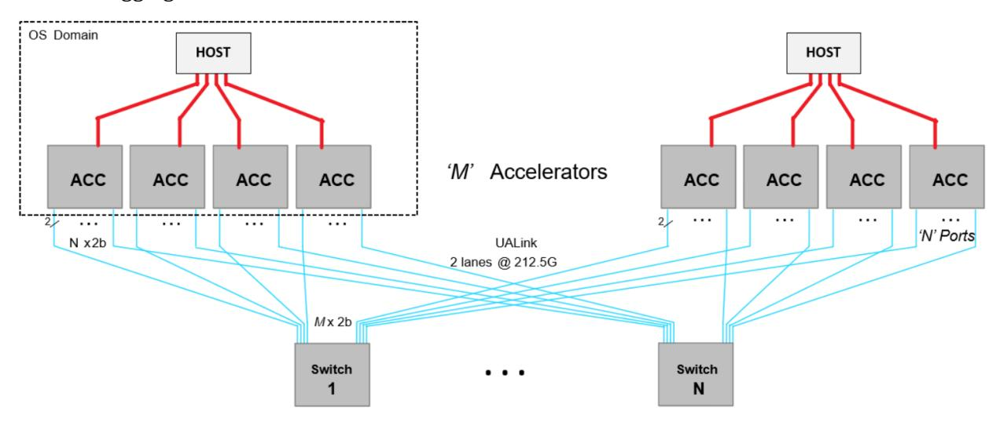

**Figure 1-1 UALink Based Multi-Accelerator System**

As shown i[n Figure 1-1,](#page-21-2) the Accelerator Fabric Switch connects 'M' Accelerators through UALink Links that consist of UALink Lanes. A Lane is a pair of signals, one for transmit and one for receive, and UALink Lanes can be grouped into a one Lane Link (a x1 Link), two Lane Link (a x2 Link), and a four Lane Link (a x4 Link). The number of Lanes per Switch and the bifurcation capability of the Switches and Accelerators shall determine how many Accelerators can be connected per Switch.

A Pod consists of the largest number of Accelerators that are to be connected via UALink Switches. A Switch is defined as a logical entity having a number of ports (radix) equal to the number of Accelerators in the Pod. Each Port on the Switch shall connect to a distinct Accelerator. Unless partitioned, a Switch can connect any Port on the Switch to any other Port on the Switch. The number of Switches shall equal the number of Ports on the Accelerators (all Accelerators in the Pod should have the same number of Ports).

# Evaluation Copy

### **Ultra Accelerator Link Consortium Inc. (UALink) - UALink\_200 Rev 1.0 Specification**

With these constraints, the UALink Switches connect the Accelerators in a Pod in a way that each Port on an Accelerator may intercommunicate with only a single port on each other Accelerator.

A Virtual Pod is a group of one or more Accelerators in the Pod that may communicate amongst themselves but not with any other Accelerator in the Pod. The Pod may be divided into Virtual Pods by partitioning the Switches into non-overlapping subsets of Ports on each Switch. The Ports within a subset can communicate with one another but not with any Port outside the subset. Switches shall provide a mechanism to configure partitions.

The Switches in a Pod may be realized in hardware utilizing Physical Switches that have a Radix equal to the number of Accelerators in the Pod in which case the partitioning of the Physical Switch directly creates the Virtual Pods. If, however, the Physical Switch has a radix equal to an integer multiple greater than one of the number of Accelerators in the Pod, the Physical Switch shall first be partitioned into a number of Switches. These Switches may then be further partitioned to create the Virtual Pods.

All Accelerators in a Pod have a unique Accelerator ID, regardless of Physical Switch partitioning or Virtual Pod partitioning. All Accelerator Ports, and thus also all Switch Ports, in a Virtual Pod, share identical security (encryption/authentication) settings.

This Specification shall supports a max data rate of 200 GT/s per Lane and a max link width of 4 Lanes. A UALink Station (or simply Station) is defined as a group of 4 UALink Lanes. A UALink Station may be bifurcated to connect to one x4-UALink Links (or simply Link), two x2 Links, or four x1 Links. The UALink Links shall attach between UALink ports on two different Devices (in this figure, a port at the ACC and a port at the UALink Switch). The maximum bandwidth for each UALink Station shall be 800 Gigabits /s (Gbps).

The signaling rate is usually higher (212.5 GT/s) to accommodate the bandwidth consumed by Ethernet Layer1 for Forward Error Correction Code (FEC) and additional Layer1 encoding.

# **1.2 Accelerator System Node**

An Accelerator System Node may be comprised of one or more host processors, one or more Accelerators, and devices under a single OS domain. An Accelerator can communicate to another Accelerator either through a direct UALink link or through a UALink Switch. Communication between Accelerators inside a system node is called in-domain communication, i.e. within an OSdomain. Communication between Accelerators in differing system nodes is referred to as crossdomain communication.

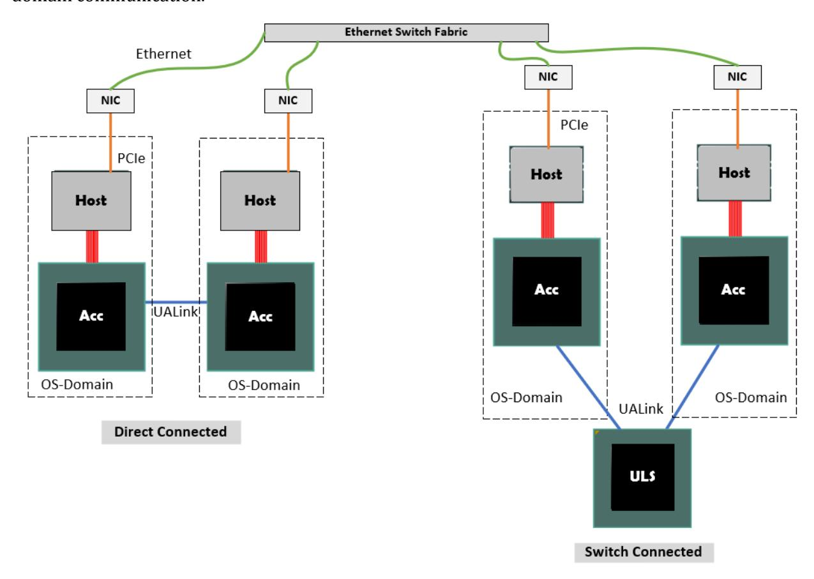

**Figure 1-2 Accelerator communication over a direct link and over a Switch**

UALink Switches shall enable a direct load/store access model for a scale-up Accelerator Pod with up to 1024 Accelerators. An Ethernet switched network shall enable the data center scale-out cluster of many thousands of Accelerators through Ethernet switches. This may be enabled through a front-side NIC attached to the host.

# **1.3 UALink Stack Interface Layers**

The UALink Link carries messages between a sender and receiver. UALink is a symmetrical protocol with the same set of messages and channels supported in both transmit and receive paths. These messages traverse through multiple functional layers of the UALink stack.

A UALink stack shall be comprised of a

- Protocol Layer
- Transaction Layer
- Data Link Layer and
- Physical Layer

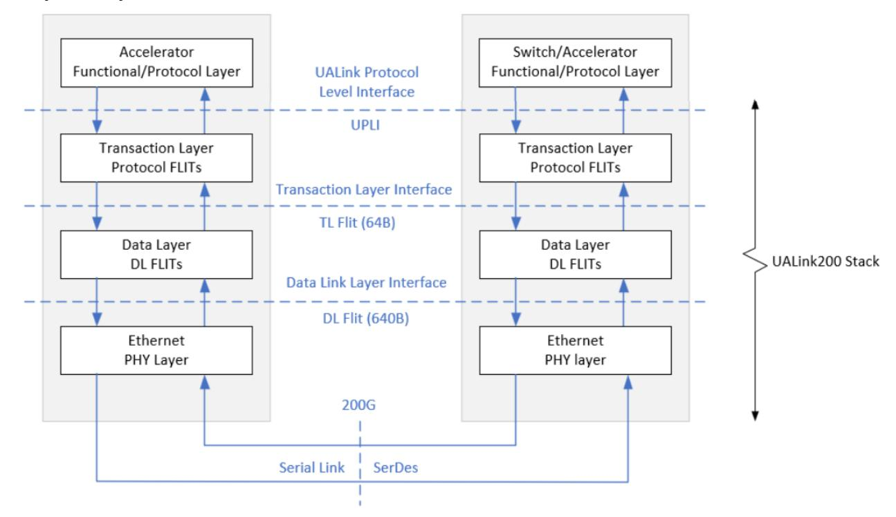

**Figure 1-3 UALink Stack**

# **1.3.1 Protocol Layer**

•

The protocol layer for UALink is called UALink Protocol Level Interface (UPLI). UPLI defines a logical signaling interface and a protocol by which devices can exchange data and control information through a set of Request and Response messages. The UALink Specification fully defines the UPLI Protocol and expects that implementations that follow this protocol will be compatible with UALink Switches. The UPLI Protocol has built-in flexibility to allow vendors to create custom protocol messages for communication between Accelerators that are the same kind without any modification to the UALink Switches. The UALink Protocol Level Interface is the primary interface which implementations may develop to while typically using third party vendor supplied IP for the rest of the stack.

# **1.3.2 Transaction Layer**

The Transaction Layer (TL) shall connect to two UPLI Interfaces, one sourced from a UPLI Originator and one sourced from a UPLI Completer. The TL shall drive a 64-byte Outbound

Transmit (Tx) Flit to the UALink DL and shall receive from the UALink DL a 64-byte Inbound Receive (Rx) Flit from the UALink DL. The UPLI channels driven into the TL from both UPLI interfaces shall be packaged into 64-byte Outbound Transmit (Tx) Flit which shall be transmitted to the UALink DL. Similarly, the Receive (Rx) 64-byte TL Flit from the UALink DL shall be unpacked into Request, Read Response/Data, Orig Data, and Write Response channels for the two attached UPLI Interfaces.

# **1.3.3 Data Link Layer**

The data link layer receives 64-Byte Flits from the Transaction Layer (TL) and shall package these Flits into 640-Byte Flits in the egress direction and shall send them to the Physical layer (PL). Similarly, in the ingress direction the Data Link Layer (DL) shall receive 640-Byte Flits from the PL and shall unpack then into 64-Byte Flits and then shall send them to the transaction layer (TL). The DL shall provide a control message service used for coordinating changes to the link, i.e., online/offline, and other features. The DL shall provide a UART mechanism for firmware-controlled sequences to be passed across the link.

# **1.3.4 Physical Layer**

The Physical Layer (PL) is based on IEEE 802.3dj (D1.4 at the time of writing). The PL shall support the following rates based on 200G serial: 200GBASE-KR1/CR1, 400GBASE-KR2/CR2, and 800GBASE-KR4/CR4. The PL shall also support the following rates based on 100G serial, 100 GBASE-KR1/CR1, 200 GBASE-KR2/CR2, 400 GBASE-KR4/CR4. To reduce latency at the 200G serial rates, 1-way and 2-way code word interleave modes are optionally supported, in addition to the standard 4-way interleave. To improve latency each 640-Byte DL Flit shall be packed uniquely into a single 680-Byte code word. The additional 40-bytes shall be for FEC overhead and 256B/257B line coding. Achieving DL Flit to code word alignment does require changes to a standard Ethernet PCS, regarding alignment marker insertion and removal. The alignment markers on the wire are unchanged from IEEE 802.3 definition, only the mechanism for how the alignment markers are inserted and removed changes. Ethernet Retimers shall be compatible with UALink provided they use the recovered clock for forwarding the data. This is the most common mechanism. Adding or removing Idle codes would require FEC decode and encode and a large latency penalty. In addition, this would break the DL Flit to code word association required for UALink. Auto negotiation and link training is unchanged from 802.3.

# **1.4 UALink Address Translation Model**

[Figure 1-4](#page-26-2) shows the UALink network, which allows data to move between devices. It supports data transfers within and across system nodes. Accelerators may use a System Physical Address (SPA) to access memory within a System domain and may use a Network Physical Address (NPA) to access memory in a different System domain. An implementation can also opt for a global addressing model that is flat to simplify the translation process. This section provides a brief overview of a cross-domain address translation model. It is only for illustration. This specification leaves the address translation as an implementation choice as Switches use identifier-based routing. In this example, the source Accelerator uses the Memory Management Unit (MMU) to translate a Guest Virtual Address (GVA) to a Network Physical Address (NPA). At the destination node, a link MMU is used to translate NPA to a local SPA.

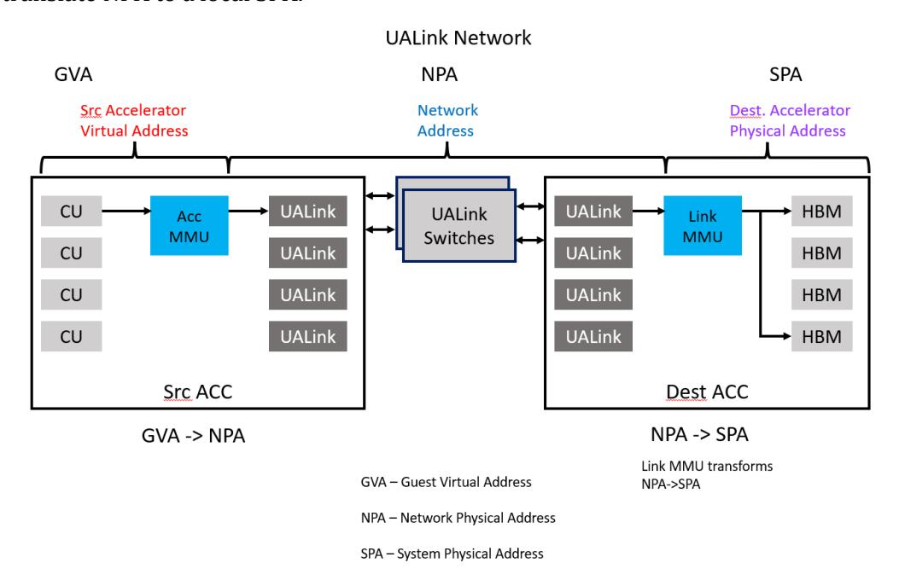

**Figure 1-4 UALink cross-domain address translation model**

# **1.4.1 Remote Memory Access (RMA)**

Distributed applications which span many Accelerators need the ability to securely access memory on remote system nodes. The first step in this process is the ability to import memory from a target node. This usually happens through an OpenSHMEM or a custom shared memory library that can exchange pointers between an importer and an exporter. The library handles a partitioned global address space (PGAS) that covers memory across multiple system nodes. The exchanged pointer between a receiver and sender consists of an address handle and physical Accelerator identifier within a Pod. The use of an address handle instead of an actual address provides more security. The pointer exchange process is expected to take place through the front side Ethernet network connected to the host.

In [Figure 1-5,](#page-27-0) the source Accelerator, which imports memory, creates a Page Table Entry (PTE) in the Accelerator's memory management unit (MMU) which includes the address handle and the Accelerator identifier. The exporting or destination Accelerator creates a new page table entry in its link MMU. This includes the address handle and the source Accelerator identifier.

[Figure 1-5](#page-27-0) below illustrates the translation process at the source and the destination Accelerators. Applications running on the compute elements use Guest Virtual Address. These accesses from the Compute Unit (CU) with many compute elements go through the MMU to translate virtual address to a physical address.

**Figure 1-5 Translation Process**

In addition to the address, the PTE also adds a bit to identify the type of physical address. The two types of physical address supported are System Physical Address (SPA) which is the local address within a domain to access system memory and the other is Network Physical Address (NPA) which contains the address handle and target identifier. The UALink network routs Requests and Responses using the source and destination identifiers. Accelerators must drive the identifiers for both in-domain and cross-domain accesses. At the destination Accelerator, NPA is translated through an UALink link MMU to the local SPA of the target system node.

# **1.5 UALink Coherency**

UALink does not support snoop transactions for keeping hardware coherence among Accelerators. Hardware coherence between host processors and Accelerators within a system node shall be handled through host side connections. Since AI/ML workloads typically involve many Accelerators, software coherence enables applications to scale efficiently across scale-up Pods and scale-out clusters. There is no significant benefit in adding complexity to carry snoop messages on UALink to only enable hardware coherence amongst Accelerators within a system node. Hence Accelerators that cache data from a peer memory within or across system nodes shall be expected to keep coherence through software by clearing caches at the right kernel boundaries.

UALink shall support an I/O coherency model with the following semantics:

- Read from a peer memory shall get the most recent coherent copy of data from memory or a cache within its system node.
- Writes to a peer memory shall invalidate all cache copies within its system node. Partial writes shall fetch any cached data in the system and merge with the data from write. The most recent copy of the data shall be written back to memory.

Hardware coherency within a system node (OS-domain) amongst the host processors and Accelerators is not specified by UALink. Implementations are expected to handle coherency through implementation-specific hardware or software methods.

# **2 UPLI Interface Definition and Operation Rules**

# **2.1 UPLI Interface**

The UPLI defines a logical signaling interface and a protocol by which devices can exchange data and control information through a variety of Request and Response messages. The UPLI Protocol has the following features and benefits:

- Split Requests / Responses improve utilization of interface bandwidth.
- Per UPLI interface port transaction identification tags to support multiple outstanding Requests on the interface port.
- Reads, Writes, and Atomic memory operations

Data transfer is effected through Request / Response message pairs. A Request and its subsequent Response form a Transaction. The following figure illustrates a UPLI Interface:

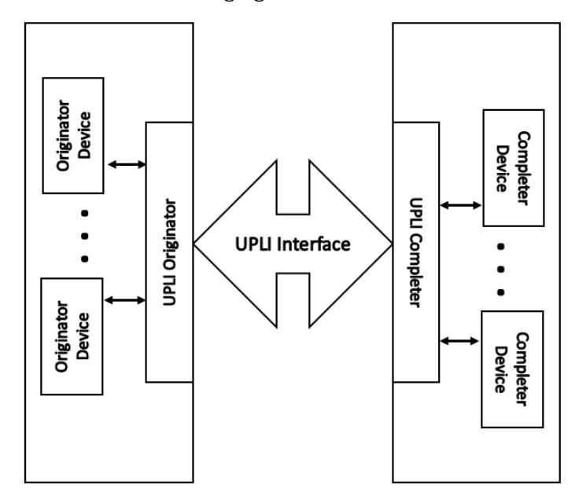

**Figure 2-1 UALink Protocol Level Interface**

In the UALink Protocol Level Interface, a device that initiates a Transaction by making a Request is called an Originator Device. A device that can respond to a Request is called a Completer Device. Requests are also called Commands. The terms Command and Request are used interchangeably in this specification.

The UALink Protocol Level Interface defines the Requests that can be issued by an Originator and the Responses that shall be returned to the Originator for each Request type.

An Originator Device attaches to the UALink Protocol Level Interface via a UPLI Originator. Similarly, a Completer Device attaches to the UALink Protocol Level Interface via a UPLI Completer.

The Originator Device shall initiate a transaction by issuing a Read, Write, Atomic, UPLI Write Message, or Vendor Defined Command Request. When the Request is completed, the Completer Device shall issue a Response to the Originator Device. Transaction Tags allow the Originator Device to pair Requests with subsequent Responses. All Requests shall require a Response. In most of the figures in this specification, the Originator Devices and Completer Devices will not be shown for clarity.

# Evaluation Copy

### **Ultra Accelerator Link Consortium Inc. (UALink) - UALink\_200 Rev 1.0 Specification**

A UPLI interface can be (and is typically) extend through a series of intermediate UPLI interfaces with Intermediate Logic Blocks as show in Figure 2-2 [Extending a UPLI interface through](#page-30-0)  [Intermediate UPLI Interfaces](#page-30-0) below:

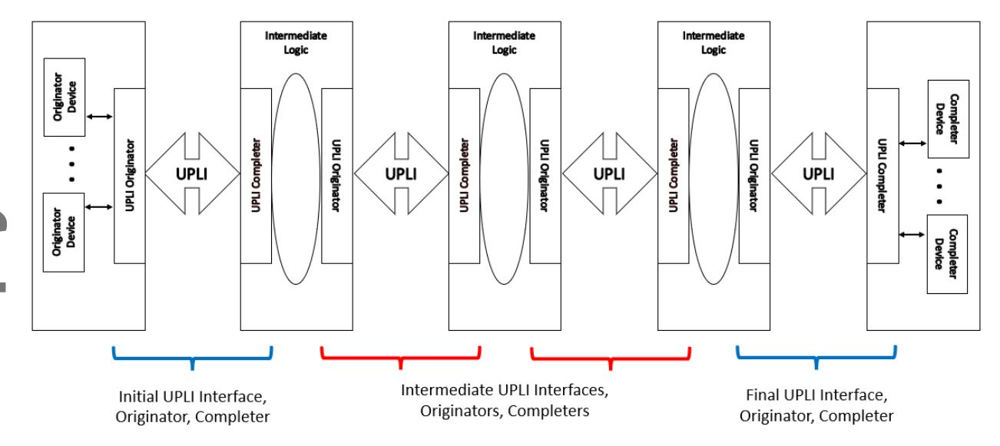

**Figure 2-2 Extending a UPLI interface through Intermediate UPLI Interfaces**

The Initial UPLI Interface connected to the Originator Devices is connected to a set of Intermediate Logic Blocks and Intermediate UPLI Interfaces that then ultimately connect to the Final UPLI Interface which is connected to the Completer Devices.

As a typical use case, Figure 2-2 [Extending a UPLI interface through Intermediate UPLI Interfaces](#page-30-0)  corresponds to the single path from a specific Source Accelerator to a specific Destination Accelerator in a UALink use case utilizing a Switch. The first Intermediate Logic Block above represents the logic between a Source Accelerator and a Switch to implement a Transaction Layer Interface, a Data Link Layer Interface, a Physical Interface, and then another Data Link Layer and Transaction Layer Interface between the Source Accelerator and the Switch. The second Intermediate Logic Block represents the Switch core that routes UPLI Requests and Responses. While this figure represents only one path through the Switch from a specific Source Accelerator to a specific Destination Accelerator, the Switch core generally connects to multiple UPLI interfaces, not shown here, from multiple Source Accelerators. The third Intermediate Logic Block represents the Transaction Layer, Data Link Layer, and Physical Interfaces connecting the Switch to the Destination Accelerator.

Generally speaking, but subject to rules explained later in [2.7.9](#page-67-0) , an Intermediate Logic Block may reorder Requests and Responses received from one attached UPLI Interface before forwarding them on to the other attached UPLI Interface.

The UALink Protocol Level Interface contains four channels: The Request (Req) Channel, the Read Response/Data (RdRsp) Channel, the Originator Data (OrigData) Channel, and the Write Response (WrRsp) Channel.

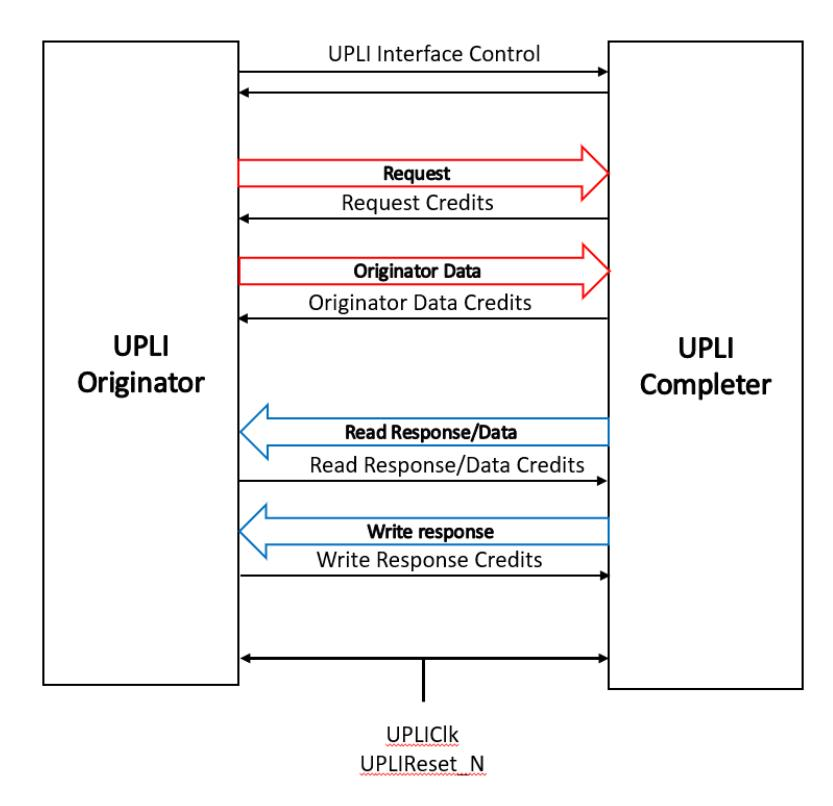

**Figure 2-3 UALink Protocol Level Interface Channels and control signals**

The Request Channel shall contain a Request Address, the Request Type (Read, Write, Atomic, UPLI Write Message, Vendor Defined Command), fields controlling the size of the Request, a Source Accelerator Identifier, a Destination Accelerator Identifier, a Transaction Tag to uniquely identify the Request among outstanding Requests on the Request Channel, and various additional control and parity signals.

The Originator Data Channel shall contain 64 bytes of data for a Beat of a Write Request, Vendor Defined Write class Request, or UPLI Write Message Request (a Write Request, Vendor Defined Write class Request or UPLI Write Message Request may require up to four Beats) or Operand data for an Atomic Request or Vendor Defined Atomic class Request, Byte Enables for data or Operand Data, an indication of which Beat is present, and various additional control and parity signals. The Source Accelerator and Destination Accelerator for the Request are specified by the Request in the Request Channel associated with the Data Beats.

The Read Response/Data Channel shall contain 64 bytes of data for a Beat of the Read Response (a Read Response may require up to four Beats), a Source Accelerator Identifier, a Destination Accelerator Identifier (a swap of the original Request Source and Destination values), a Transaction Tag to identify the Request among outstanding Read Requests from the Request Channel, indicators of the Read Response status, an indication of which Beat is present, and various additional control and parity signals.

The Write Response Channel shall contain a Source Accelerator Identifier, a Destination Accelerator Identifier (a swap of the original Request Source and Destination values), a Transaction Tag to identify the Request among outstanding write Requests from the Request Channel, indicators of the Write Response status, and various additional control and parity signals.

For each of these channels, there is a subset of signals for Credit Management. These signals flow from the Receiver of the Channel to the Source of the Channel. These Credit Management Signals

# Evaluation Copy

### **Ultra Accelerator Link Consortium Inc. (UALink) - UALink\_200 Rev 1.0 Specification**

return Credits from the Receiver of the Channel to the Source of the Channel to allow the source to emit new valid Beats on the Channel. The source of the Channel shall not emit a new Beat without possessing the appropriate Credit(s).

The UPLIClk signal is the clock delineating the cycle boundaries on the clock synchronous UALink Protocol Level Interface. The UPLIReset\_N signal is a low-active signal to reset the UALink Protocol Level Interface.

In this specification, similar signals that occur in different channels may be referred to using a shorthand notation. For example, The ReqVld signal in the Request Channel, the RdRspVld signal in the Read Response/Data Channel, the WrRspVld signal in the Write Response Channel, and the OrigDataVld signal in the Originator Data Channel are collectively referred to by the following notation: \*Vld. These signals indicate, in each channel, whether a valid "Beat" of information is present on the channel.

Other examples include:

\*Data: (RdRspData signal in the Read Response/Data Channel; OrigData signal in the Originator Data Channel)

\*CreditVld: (ReqCreditVld signal in the Request Channel; RdRspCreditVld signal in the Read Response/Data Channel; WrRspCreditVld signal in the Write Response Channel; OrigDataCreditVld signal in the Originator Data Channel).

# **2.2 UALink Stack Component**

[Figure 2-4,](#page-33-1) below illustrates the UALink Stack Component which consists of an independent UPLI Originator and an independent UPLI Completer and logic units to implement the UALink Protocol Layers. The UPLI Completer and UPLI Originator within a given UALink Stack shall not communicate directly with one another. Rather, the UPLI Completer and UPLI Originator are connected to an UALink TL (Transport Layer).

**Figure 2-4 UALink Stack Component**

The UALink TL converts the UPLI Protocol Channels driven by the UPLI Originator and UPLI Completer (Req and OrigData for the UPLI Originator and Rd Rsp/Data and Wr Rsp for the UPLI Completer) into a TL Flit that is passed to the UALink DL Layer. Similarly, the UALink TL receives a TL Flit from the UALink DL that is unpacked into the UPLI Protocol Channels received by the UPLI Completer and the UPLI Originator (Req and OrigData for the Completer and Rd Rsp/Data and Wr Rsp for the Originator).

The UALink DL receives several TL Flits and adds CRC protection and a header to the Flit to form a DL Flit and passes this DL Flit on to the UALink PL. Similarly, the UALink DL receives DL Flits from the UALink PL, strips the CRC and header from that Flit, and forms TL Flits that are passed on to the UALink TL.

The UALink PL receives DL Flits and produces a code word with FEC encoding that is serialized and transmitted to a UALink PL in a connected UALink PL Stack Component. Similarly, the UAlink PL receives a serialized code word with FEC from the UALink PL in the connected UALink Stack Component performs FEC decode and converts that into DL Flit.

To create an interface between an Accelerator and the Switch, two UALink Stack Components are connected as shown below in [Figure 2-5,](#page-34-0) this overall interface shall be bi-directional and symmetric with the UPLI Originator in the Accelerator communicating with the UPLI Completer in the Switch and the UPLI Originator in the Switch communicating with the UPLI Completer in the Accelerator.

**Figure 2-5 Connected UALink Stack Components**

# **2.3 UALink UPLI Request and Response Paths**

[Figure 2-6](#page-35-1), shows a logical representation of two different Accelerators (ACC "A" and ACC "B") connected through different pairs of UALink Stack Components through a Switch:

**Figure 2-6 End-to End UALink Connection Between two Accelerators**

To issue a Request from Accelerator A to Accelerator B, the UPLI Originator in Accelerator A shall issue a Request on the Request Channel (and if the Request is a Write, UPLI Write Message, Vendor Defined write Class Command also issues the first Beat of data on the Originator Data Channel. Atomic or Vendor Defined Atomic write Class Commands issue Operand Data on the Originator Data Channel on the first Beat of data on the Originator Data Channel). The UALink TL receives the Request and shall package it into a TL Control Half-Flit (Data Beats shall be packaged as subsequent Data Half-Flits). TL Half-Flits are combined to create a TL Flit and a TL Flit shall consist of two TL Half-Flits. The TL Flit is then modified by the UALink DL to add FEC and CRC and becomes a DL Flit which is then passed through the PHY on Accelerator A as a bitstream to PHY A on the Switch. The PHY A on the Switch is one of several possible PHYs on the Switch where traffic from Accelerator A can be received. The bitstream is reconstituted into the DL Flit by PHY A and passed through UALink DL A and converted to a TL Flit. Finally, the TL Flit passes through UALink TL A and is presented to the UPLI Completer in the Switch attached to UALink TL A.

The UPLI Completer at the Switch attached to UALink TL A shall package the UPLI Protocol elements and the Switch Core shall route these elements to the UPLI Originator attached to UALink TL B that can deliver the Request to Accelerator B. The process of transiting the two UALink Stack Components to reach Accelerator B from the Switch shall be the same process as transiting from Accelerator A to the Switch and terminates at the UPLI Completer in Accelerator B.

When the Request has been processed in Accelerator B, Responses (and data for Read , Vendor Defined Read class Commands , Atomic Requests, or Vendor Defined Atomic class Commands) shall be issued by the UPLI Completer on Accelerator B and pass through the two UALink Stack Components to reach the UPLI Originator connected to UALink TL B. These Responses are routed through the Switch Core and then pass through the two UALink Stack Components starting at the Switch UPLI Completer attached to UALink TL A and terminate at the UPLI Originator in Accelerator A.

The following diagram[, Figure 2-7,](#page-36-0) illustrates the flow of Responses and Requests for a pair of Accelerators. For clarity, this figure omits the UALink DL and UALink PHY blocks. Requests initiated by the Accelerator A UPLI Originator are ultimately sent to the UPLI Completer in Accelerator B. However, the Accelerator A Request is first received by the UPLI Completer in the Switch and is then routed to the UPLI Originator in the Switch ultimately connected to Accelerator B which passes the Request on to Accelerator B's UPLI Completer.

In a similar fashion, the Response for Accelerator A's Request is ultimately sent from the UPLI Completer in Accelerator B to the UPLI Originator in Accelerator A via first the UPLI Originator at the Switch connected to Accelerator B and then the UPLI Completer in the Switch ultimately connected to Accelerator A.

The requests and Responses for Accelerator B's Requests and Responses follow paths that are symmetrical to Accelerator A's requests and Responses, but in the opposite direction.

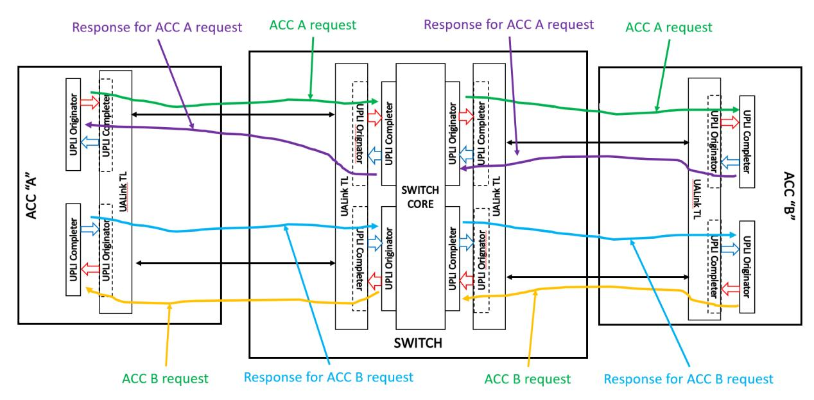

**Figure 2-7 UPLI Request and Response Flows**

# **2.4 Routing a Transaction from End-to-End**

This Section illustrates the flow of a Request from an Originator Device to a Completer Device and the corresponding Response from the Completer Device to the Originator Device.

A UALink station has four UALink lanes which can be bifurcated into one x4, two x2, or four x1 UALink Ports. All UALink stations in a Pod (both on the Switches and at the Accelerators) must be bifurcated in the same manner.

The number of UALink Ports on each Accelerator shall be equal. The Port identifier within a station shall start at 0 and shall be numbered consecutively. UALink Stations shall be numbered contiguously, and a Request or Response is routed from a Source Port of a Switch to a Destination Port of a Switch by routing from the Source Port on the Source Station to the Target Station and then to the Target Port within the station. How a Request or Response is routed from within a Switch is ultimately up to the implementation.

In a Pod, a Physical Switch shall have at least as many Ports as the number of Accelerators in the Pod and the number of Ports on a Physical Switch should equal the Number of Accelerators in the Pod (when the number of Ports on a Physical Switch matches the Number of Accelerators in the system – as shown below in Figure 2-8 [Example system with 32 Accelerators with 32 x1 UALink](#page-37-1)  [Links](#page-37-1) -- the concept of Switch and Physical Switch are equivalent) . This lets each Switch connect to every Accelerator in the Pod via a specific Port. The example system shown below in [Figure 2-8](#page-37-1) illustrates a Pod with 32 Accelerators numbered Accelerators 0, 1, to 31 and 32 Switches numbered 0, 1, to 31.For clarity, certain of the UALink Links have been shown while the other links are omitted.

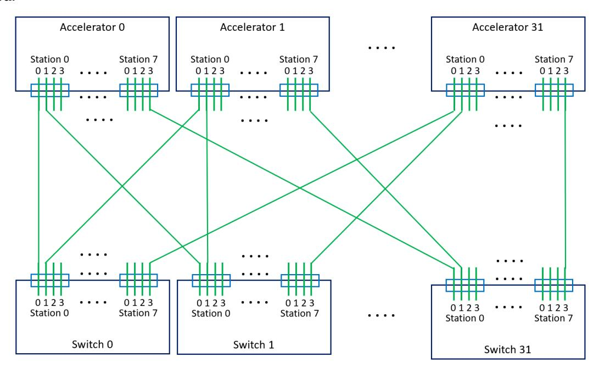

**Figure 2-8 Example system with 32 Accelerators with 32 x1 UALink Links**

The Accelerators and Switches shall use a specific subset of signals in the various UPLI Channels to route and process Requests and data through the system. The rest of the signals within a Channel are conveyed, usually unmodified, with the Transaction. However, specific signals may be modified at various points as the Transaction progresses through the Pod. In addition to the routing signals and the other signals, a set of Credit Management signals shall provide flow control within a each UALink Channel within any given UALink Protocol Level Interface.

Specifically, the Request Channel (Req) shall contain two 10-bit signals, "ReqSrcPhysAccID" and "ReqDstPhysAccID" that specify the Source Accelerator and Destination Accelerator of the Request. In addition, the Request Channel shall contain a 2-bit signal "ReqPortID" that shall control, at certain UALink Protocol Level Interfaces, the routing of the Request onto the bifurcated UALink Links at the associated UALink Stack Component and shall control the Time Division Multiplexing (TDM) of the UALink Protocol Level Interfaces, as described in a later section, at all UALink Protocol Level Interfaces.

The Read Response/Data (RdRsp) Channel shall contain signals "RdRspSrcPhysAccID", "RdRspDstPhysAccID", and "RdRspPortID" and the Write Response (WrRsp) Channel shall contain signals "WrRspSrcPhysAccID", "WrRspDstPhysAccID", and " WrRspPortID". These signals shall function in those UPLI Channels in an analogous way to the respective signals in the Request Channel.

A sample Read Request to address "X" from an Accelerator A (numbered "0") to an Accelerator B (numbered "31") in a Pod connected as shown above (Figure 2-8 [Example system with 32](#page-37-1)  [Accelerators with 32 x1 UALink Links\)](#page-37-1) will be used to illustrate the processing of a transaction using the following figure (Figure 2-9 [Read Request end-to-end flow with Response\)](#page-38-0):

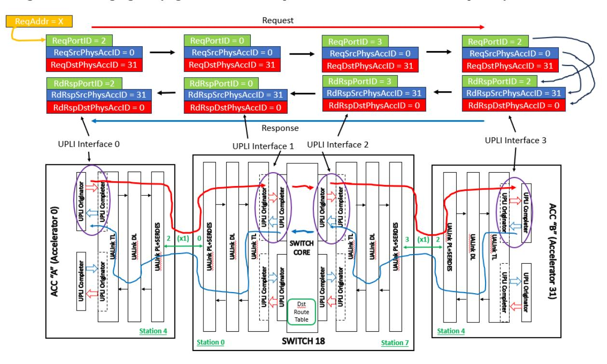

**Figure 2-9 Read Request end-to-end flow with Response**

The Read Request begins with an Originator Device (not shown) forming a Read Request to address "X". Conceptually, Requests can go out any UALink Link on the Accelerator (each UALink Link is attached to a Switch which is capable of routing any Request to any Destination Accelerator). However, generally speaking, to enforce ordering for Requests all accesses within any given 256 byte region of memory must be routed out the same UALink Port (in this example, arbitrarily chosen to be Station 4, Port 2 for the address "X" – see section [2.7.9](#page-67-0) for complete details).

The Read Request is formed at the Originator Device and is issued to the UPLI Originator at Station 4 with an indication to use UALink Port 2, an indication of the Source Accelerator (0 in this example), an indication of the Destination Accelerator (31 in this example), and any other

information associated with the Read Request. The UPLI Originator issues the Request on UALink Protocol Level Interface 0 with ReqPortID set to '2', ReqSrcPhysAccID set to '0' and ReqDstPhysAccID set to '31'. The ReqSrcPhysAccID and ReqDstPhysAccID fields shall remain unchanged from the initial Originator in the Source Accelerator A to the final UPLI Completer in the Destination Accelerator B.

The Read Request is then conveyed across the UALink Link attached to Station 4, Port 2 (as controlled by the ReqPortID value) on Accelerator 0. The ReqPortID value shall not propagated over the UALink Link but rather instead be locally generated at the Switch based on the Port the Read Request entered the Switch. The Read Request enters Switch 18 (the UALink Link at Station 4, Port 2 on all Accelerators are attached to Switch 18 in this example topology) at Station 0, Port 0 (The UALink Links at Station 0, Port 0 on all Switches are attached to Accelerator 0 in this example topology). Based on the entry port at the Switch, a new value for ReqPortID of 0 is assigned and used at UALink Protocol Level Interface 1 in the Switch. The ReqPortID value at Ultra Link Protocol Interface 1 only controls the TDM for the Read Request while transiting UALink Protocol Level Interface 1 into the Switch core.

Once in the Switch core, a look up, based on the ReqDstPhysAccID signal, is performed in the Destination Route Table (Dst Route Table) to determine the proper Station and Port the Read Request should be routed through to get to the destination Accelerator (in this case, Station 7, Port 3 – Accelerator 31 is connected to Station 7, Port 3 on all Switches in this example topology) and routes the Read Request to that station (Station 7) and presents the Read Request on UALink Protocol Level Interface 2 with the newly assigned ReqPortID value of 3.

The UPLI Originator at UALink Protocol Level Interface 2 issues the Read Request which exits the Switch on Port 3 and drops the ReqPortID value. The Read Request then enters Accelerator 31 at Station 4, Port 2 and the value of ReqPortID is regenerated to a value of '2' indicating the Port on which this Request entered Accelerator 31. This regenerated ReqPortID value is used when the Request is issued on UALink Protocol Level Interface 3 and controls the TDM for that interface. The UPLI Completer at UALink Protocol Level Interface 3 retains the value of ReqPortID, ReqSrcPhysAccID, and ReqDstPhysAccID while the Request is being processed by a Completer Device in the Destination Accelerator.

When the information for a Read Response is ready (Read Responses may contain more than one Response Beat), the UPLI Completer at UALink Protocol Level Interface 3 forms a Response Beat with RdRspPortID set to the retained ReqPortID value of '2' and uses the retained Station value to deliver the Response Beat to Station 4. This allows the Completer at UALink Protocol Level Interface 3 to route the Response Beat to the correct output Port and Station without referring to the address of the original Read Request. At UALink Protocol Level Interface 2, the RdRspPortID signal has the regenerated value of '3' reflecting the port the Read Response entered the Switch on.

At UALink Protocol Level Interface 1, the RdRspPortID signal value '0' indicates the Port on Station 0 where the Read Response should exit. This value is obtained from a lookup of the Destination Route Table indexed by RdRspDstAccPhysID at UALink Protocol Level Interface 2 which indicates the destination Accelerator is connected to Port 0, Station 0 on this Switch. Finally, the value of RdRspPortID at UALink Protocol Level Interface 0 is '2', matching the Port the Read Response entered the Source Accelerator. For Read Responses containing more than one Beat of Data, the same process is followed for each Beat.

Writes Requests shall act similarly to Read Requests with the exception that data is issued on the Originator Data Channel to the Destination Accelerator with a single Beat Write Response containing no data being returned.

# **2.5 UPLI Channel Time Division Multiplexing (TDM)**

Each UALink Station driven by an UALink Stack Component can interface to 4 UALink Lanes that can be bifurcated into four x1 UALink Links, two x2 UALink Links, or one x4 UALink Link. The UALink Ports attached to the UALink Links shall be numbered "0" for a x4 bifurcation, "0, 1" for a x2 bifurcation, and "0, 1, 2 ,3" for a x1 bifurcation.

Each Channel in an UALink Protocol Level Interface shall be Time Division Multiplexed (TDM), meaning that for a given cycle, the signals within the UALink Protocol Level Interface channel (aside from the Credit Management signals) are associated with a specific bifurcated Port on the UALink Stack Component attached to a UALink Link. [Figure 2-10](#page-41-1) illustrates an example UALink Stack Component with two associated UALink Protocol Level Interfaces with the UALink station bifurcated into four x1 UALink Links:

**Figure 2-10 UALink Station with x1 bifurcation**

Each Channel in the UALink Protocol Level Interface in the UALink Stack Component shall have a unique "Valid" signal ("ReqVld" for the Request Channels, "OrigDataVld" for the Originator Data Channels, "RdRspVld" for the Rd Response/Data Channels, and "WrRspVld" for the Write Response Channels) that indicates when valid data is being driven onto the Channel. The "PortID" signal ("ReqPortID" for the Request Channels, "OrigDataPortID" for the Originator Data Channels, "RdRspPortID" for the Rd Response/Data Channels, and "WrRspPortID" for the Write Response Channels) for a given UALink Protocol Level Interface channel shall signify the TDM value for the current cycle when the "Valid" signal for that Channel is asserted and shall be ignored otherwise.

The TDM value shall cycle through a sequence of all the possible Port values (based on the bifurcation) in ascending order, wrapping back to 0 at the maximum value, every 'N' cycles, where N is the number of ports in the station. Valid cycles for a given PortID may only be presented on any UALink Protocol Level Interface Channel every N cycles.

The TDM cycle for the Request Channel and the Originator Data Channel shall be set by the "PortID" signal value on the first ReqVld Beat for that Request Channel (whether the Request is a Read or Vendor Defined Read class Command where the OrigData field is unused or is a Write, Atomic, UPLI

*UPLI Interface Definition and Operation Rules* 42

# Evaluation Copy

### **Ultra Accelerator Link Consortium Inc. (UALink) - UALink\_200 Rev 1.0 Specification**

Write Message, Vendor Defined Write class Command, Vendor Defined Atomic class Command, or Atomic Request where the OrigData field is used) and shall remain fixed thereafter for those channels (the Request and Originator Data Channel must be on the same TDM phase to allow the Req and OrigData Channel to both be valid for the first beat of any Request that issues data on the Originator Data Channel). For example, if after reset, if the first valid packet on a Request Channel has a ReqPortID value of '2', the TDM for that Request Channel and Originator Data starts on that cycle with a value of 2 and cycles through the values in the following fashion: 2, 3, 0, 1, 2, 3, 0, 1, . . . thereafter (for a x1 bifurcation. For a x2 bifurcation, the sequence is 0, 1, 0, 1, …. and for a x4 bifurcation the sequence is 0, 0, 0…….). The TDM cycle for the Read Response/Data and Write Response Channels shall be set independently based on the PortID value for the initial Read and Write Response Beats respectively.

The PortID signal for any subsequent "Valid" cycle on the Channel shall match the established TDM value for the current cycle. The explicit PortID signal removes the need for an explicit synchronization sequence to establish the TDM value and allows a receiver to simply use PortID to identify the TDM cycle without having to explicitly track the current TDM cycle (though the receiver implementation can choose to track the TDM cycle to check for the correct TDM cycle value on received Beats). Finally, an explicit PortID signal is useful for debug.

The UALink TL shall be responsible for assembling the various valid packets for differing Ports on the differing UPLI Channels into outbound TL Flits and placing the various received TL Flits onto the correct UPLI TDM cycles on each UPLI Interface.

# **2.6 UALink Protocol Level Interface Flow Control and overall UALink Flow control**

Flow control in the UALink Protocol Level Interface shall utilize a Credit-based control mechanism with Credits being per Port, per UPLI Channel. At initialization or after reset of the UPLI Interface, the Sender side of a UPLI Channel shall have no Credits and the Receiver side of a UPLI channel shall issue an initial set of Credits to the Sender side.

The Receiver shall indicate a Credit or Credits is being initially issued (or, after initialization, being returned) using the following signals:

- A \*CreditVld[3:0] signal (ReqCreditVld[3:0], OrigDataCreditVld[3:0], RdRspCreditVld[3:0], WrRspCreditVld[3:0]) shall indicate a Credit or Credits is being returned to the Sender and for what port (\*CreditVal[0]=1 indicates Port 0 and so on). Credits may be returned on any Port of set of Ports simultaneously by asserting the appropriate signals within \*CreditVld[3:0]. Credit returns shall be independent of the Time Division Multiplexing of the UPLI interface (i.e. Credits for any Port may be returned in any cycle).
- A \*CreditPool[3:0] signal (ReqCreditPool[3:0], OrigDataCreditPool[3:0], RdRspCreditPool[3:0], WrRspCreditPool[3:0]) shall indicate the "type" of the Credit being returned ('0' indicates a VC Credit, '1' indicates a Pool Credit) and for what Port (\*CreditPool[0] indicates the Credit Type for Port0 and so on). This signal shall only be considered valid when the corresponding \*CreditVld[3:0] signal is asserted.
- A set of \*CreditPort[0,1,2,3]VC[1:0] signals (ReqCreditPort0VC[1:0], ReqCreditPort1VC[1:0], ReqCreditPort2VC[1:0], ReqCreditPort3VC[1:0], OrigDataPort0VC[1:0], OrigDataPort1VC[1:0], OrigDataPort2VC[1:0], OrigDataPort3VC[1:0], RdRspCreditPort0VC[1:0], RdRspCreditPort1VC[1:0], RdRspCreditPort2VC[1:0], RdRspCreditPort3VC[1:0], WrRspCreditPort0VC[1:0], WrRspCreditPort1VC[1:0], WrRspCreditPort2VC[1:0], WrRspCreditPort3VC[1:0]) shall indicate the Virtual Channel of the credit being returned for the Channel and Port associated with the signal (for example, ReqCreditPort0VC[1:0] is the Virtual Channel of the credit being returned for the Request Channel on Port0 and similarly for the other signals). This signal shall only be considered valid when the corresponding \*CreditVld[3:0] signal is asserted.
- A set of \*CreditPort[0,1,2,3]Num[1:0] signals (ReqCreditPort0Num[1:0], ReqCreditPort1Num[1:0], ReqCreditPort2Num[1:0], ReqCreditPort3Num[1:0], OrigDataPort0Num[1:0], OrigDataPort1Num[1:0], OrigDataPort2Num[1:0], OrigDataPort3Num[1:0], RdRspCreditPort0Num[1:0], RdRspCreditPort1Num[1:0], RdRspCreditPort2Num[1:0], RdRspCreditPort3Num[1:0], WrRspCreditPort0Num[1:0], WrRspCreditPort1Num[1:0], WrRspCreditPort2Num[1:0], WrRspCreditPort3Num[1:0]) that shall indicate the number of Credits being returned for the channel and port associated with the signal (for example ReqCreditPort0Num[1:0]+1 is the number of Credits being returned for the Request Channel on Port0 and similarly for the other signals).. This signal shall only be considered valid when the corresponding \*CreditVld[3:0] signal is asserted.

At initialization or after Reset, the Receive Side of the UPLI Channel will release a set of Credits corresponding to the available buffering at the Receive side of the UPLI Channel.

The Receive side may issue a set of Pool credits equal to the number of Pool buffers in the Receive side. The Receive side Pool buffers indicated by these Credits shall be able to process UPLI beats for any Virtual Channel. The Receive side may issue a set of VC credits associated with specific Virtual

# Evaluation Copy

### **Ultra Accelerator Link Consortium Inc. (UALink) - UALink\_200 Rev 1.0 Specification**

Channels equal to the number of VC buffers in the Receive side for each of the Virtual Channels supported by the Receive side VC buffers. A Receive Side VC buffer need only process UPLI beats for a specific Virtual Channel.

The Receiver Side shall release one of only Pool Credits, only Virtual Channel Credits, or some combination of Pool Credits and Virtual Channel Credits.

When the Receiver side is done releasing the initial Credits, the Receiver side asserts the \*CreditInitDone[3:0] signals (ReqCreditInitDone[3:0], OrigDataCreditInitDone[3:0], RdRspCreditInitDone[3:0], WrRspCreditInitDone[3:0]) as each port finishes. Each signal in \*CreditInitDone[3:0] is associated with a given Port (\*CreditInitDone[2] corresponds to Port 2 on the associated Channel). The \*CreditInitDone[3:0] signals may be asserted independently and once asserted shall remain asserted until the UPLI Interface is reset or powered off.

The Sender side shall monitor the \*CreditInitDone signal until that signal has been asserted an implementation specific number of cycles greater than 1. Once that has occurred, the Sender side shall consider the initial issuance of the Credits to be complete and shall no longer monitor the signal.

The monitoring of the signal for an implementation specific sized burst of asserted values ensures that an error on this signal shorter in duration that the burst length will not errantly terminate the initial credit release early. Further, ignoring the signal after this burst will ensure any subsequent errors on the signal do not impact the Channel.

Once the initial credit release is complete for a given port and Channel, the Send side may start issuing UPLI Beats for that Port and Channel if all other constraints are met. For example, when the Sender wishes to issue a write, it shall have the necessary credits in both the Request Channel (to issue the Request) and the Originator Data Channel (to issue the Beats contiguously and starting with the Request) before the Request can be issued. When a Beat is issued, the Send side shall set the \*VC[1:0] signal (ReqVC[1:0], OrigDataVC[1:s0], RdRspVC[1:0], WrRspVC[1:0]) to indicate the Virtual Channel of the Beat and shall set the \*Pool signal (ReqPool, OrigDataPool, RdRspPool, WrRspPool) to indicate if a Virtual Channel Credit or a Pool Credit was used to issue the beat.

If any Pool Credits were initially released, the sender side shall issue UPLI beats for differing Virtual Channels using those Pool Credits (indicated by setting \*Pool = b'1') according to an allocation of those Pool Credits to the various Virtual Channels that the Sender selects (and which the Sender may vary over time). If any Virtual Channel Credits were initially released, the Sender side shall issue UPLI beats using Virtual Channel Credits for the Virtual Channels (indicated by setting \*Pool = b'0') in accordance with the number of Virtual Channel Credits initially released for each Virtual Channel.

When a UPLI Beat is received at the Receive side, the Virtual Channel of the Beat (\*VC[1:0]) and the Pool indication (\*Pool) shall be recorded by the Receive side and these values are played back to the Sender when returning the Credit for that beat. The Sender side shall return the Credit to the appropriate Pool or Virtual Credit count.

**Figure 2-11 Flow control loops**

The figure above [\(Figure 2-11\)](#page-45-0) illustrates the various flow control Credit loops in the full path between two Accelerators. UALink Protocol Level Interface Credit controls are used at each instance of the UALink Protocol Level Interface along the path. A distinct independent Credit loop mechanism from one UALink TL to the next UALink TL is used to pace Requests and Responses between the UALink TL's.

# **2.7 Interface Signals**

This section describes the signals that make up the UALink Protocol Level Interface and how transactions are conveyed on the various channels of the UALink Protocol Level Interface.

# **2.7.1 Signal Groups**

The UALink Protocol Level Interface shall be organized in the following groups of signals:

- Common signals
- UALink Protocol Level Interface Control signals
- Request Channel
- Read Response/Data Channel
- Write Response Channel
- Originator Data Channel

In this specification, similar signals that occur in different channels may be referred to using a shorthand notation. For example, The ReqVld signal in the Request Channel, the RdRspVld signal in the Read Response/Data Channel, the WrRspVld signal in the Write Response Channel, and the OrigDataVld signal in the Originator Data Channel are collectively referred to by the following notation: \*Vld. These signals shall indicate, in each Channel, whether a valid Beat of information is present on the Channel.

Other examples include:

\*Data: (RdRspData signal in the Read Response/Data Channel; OrigData signal in the Originator Data Channel)

\*CreditVld: (ReqCreditVld signal in the Request Channel; RdRspCreditVld signal in the Read Response/Data Channel; WrRspCreditVld signal in the Write Response Channel; OrigDataCreditVld signal in the Originator Data Channel).

# **2.7.2 Common Signals**

[Table 2-1](#page-46-4) lists the signals that make up the Common Signal group. SOC-pervasive logic shall supply these to each UALink Protocol Level Interface.

**Table 2-1 Common Signals**

| Name        | Size | Description                                                                                    |
|-------------|------|------------------------------------------------------------------------------------------------|
| UPLIClk     | 1    | Interface clock, sourced from the SOC pervasive logic. UALink Protocol Level Interface signals |
|             |      | are synchronous to this clock as well as the UPLIReset_N,                                      |
|             |      | *ClkReq, and *ClkAck signals.                                                                  |
| UPLIReset_N | 1    | Interface reset signal, active LOW and is asserted and de-asserted and asserted synchronously  |
|             |      | to UPLIClk.                                                                                    |

The rising edge of UPLIClk shall determine the timing of information transfer across the interface. In general, all signals shall be stable prior to and immediately following the rising edge of UPLIClk.

UPLIReset\_N shall be a negative-active signal (that is, the signal is asserted when the voltage level of the signal is low.) and may be asserted at any time.

# **2.7.3 UPLI Transactions/Channel usage**

A Transaction on the UALink Protocol Level Interface can contain a Read, Write, a Vendor Defined Command, a UPLI Write Message Request, a Vendor Defined UPLI Write Message Request, or an Atomic. These Transactions read from memory, write to memory, atomically modify memory while

optionally returning the original value in memory, or deliver a UPLI message, or performs a Vendor defined operation.

A UPLI transaction consists of multiple cycles (also called "Beats"), which shall occur in a specific order on a specific subset of the UPLI channels (Request, Read Response/Data, Write Response, Originator Data) in the UALink Protocol Level Interface depending on the type of the UPLI Transaction. Transactions shall be issued at the UPLI Originator and shall be processed at the UPLI Completer. The UPLI Completer shall return a Response to the Request on either the Read Response/Data Channel or the Write Response Channel, but not both. Which Channel is used to return a Response shall depends on the transaction type.

Each UPLI transaction shall be initiated by a Request in the Request Channel indicated by the assertion of the Valid Signal (ReqVld) in the Request Channel (a Beat). A Request Beat shall contain other information about the Request involved with routing and identifying the Request such as the Port ID (ReqPortID), the Source Accelerator and Destination Accelerator physical IDs (ReqSrcPhysAccID and ReqDstPhysAccID), and a Transaction Tag to identify the Request from among other Requests (ReqTag). In addition, the Request Beat shall also contains information about the Request such as the Address (ReqAddr), the Command Type (ReqCmd), an indication of the number of doublewords to transfer (ReqLen), and attributes about the Request (ReqAttr) among other fields.

The data returned for a Read Transaction shall be conveyed from the Completer to the Originator as data Beats on the Read Response/Data Channel along with fields providing additional information about the Read Response. This information shall include the status of the Read Transaction (RdRspStatus), which Beat of data is being returned in this beat (RdRspOffset), the total number of Data Beats in the Response (RdRspNumBeats), whether the Beat has been corrupted (RdRspDataError), and if the current Beat is the last Beat to be transmitted (RdRspLast), A Read Response may contain one to four Data Beats.

Read Response Beats shall occur on the Read Response/Data Channel after the Read Request has been received and processed by the Final Completer.

For Write Transactions, the Data shall be conveyed from the Initial Originator to the Final Completer as one to four Data Beat(s) on the Originator Data Channel, each Beat shall Contain the Port ID (OrigPortID) field to provide partial routing information. The first Originator Data Beat for a given transaction shall occur in the same cycle as the Request for the Write. This shall allow the Originator Data beats to inherit the remaining routing and identifying information (ReqSrcPhysAccID, ReqDstPhysAccID, ReqTag) from the Write Request in the Request Channel as well as the number of Data Beats in the Transaction (ReqNumBeats).

A Write Request Beat shall also include information such as a set of Byte Enables to indicate the bytes to be updated in memory (OrigDataByteEn), which Beat of Data is being sent in this Beat (OrigDataOffset), whether this Beat has been corrupted (OrigDataError), and if the current Beat is the last Beat to be transmitted (OrigDataLast).

In the UALink Protocol Level Interface, an Atomic Request can either return the initial value of memory before the modification and atomically modify memory (referred to as an AtomicR command) or only perform the modification of memory (referred to in UPLI as an AtomicNR command).

In addition, all atomic commands (AtomicR and AtomicNR) shall require one or two operands to control the atomic update of memory. For example, an "Atomic add" would require one parameter to specify the value to Atomically add to memory location(s) and a "Compare-and-Swap" would require two parameters: one for the value to initially compare the memory location to, and a value

# Evaluation Copy

### **Ultra Accelerator Link Consortium Inc. (UALink) - UALink\_200 Rev 1.0 Specification**

to swap into the memory location if the initial comparison matched. The exact semantics of the various AtomicR/AtomicNR Commands and the number of parameters they need is not specified by this Specification; however all Atomic Commands shall be limited to no more than two parameters.

In the case of an Atomic Request for either an AtomicR Command or an AtomicNR Command, the Transaction proceeds as described above for a Write Request with the exception that the OrigData Channel shall be used to transfer operand data for the Atomic instead of transferring write data. For an AtomicNR Command, the Completer shall provide a Response on the Write Response Channel. For an AtomicR command, the Completer shall return the values initially read from memory as data on the Read Response/Data Channel along with status information about the transaction.

# **2.7.4 Request Channel**

An Originator shall use the Request Channel to request that data be written to or read from the system memory space. [Table 2-2,](#page-49-1) Request Channel Signals, lists the signals that shall make up a Request Channel.

The column labeled Driver indicates whether the Originator or the Completer drives the signal.

**Table 2-2 Request Channel Signals**

| Name                                            | Size (bits) | Driver     | Description                                                                                                                                                                                                                                                                                                                                                                                                                                                                                                                                                                                                                                                                                                                                                                                                                                                                                                                                                                                                                                                                                                                                                                          |  |  |  |  |  |
|-------------------------------------------------|----------------|------------|--------------------------------------------------------------------------------------------------------------------------------------------------------------------------------------------------------------------------------------------------------------------------------------------------------------------------------------------------------------------------------------------------------------------------------------------------------------------------------------------------------------------------------------------------------------------------------------------------------------------------------------------------------------------------------------------------------------------------------------------------------------------------------------------------------------------------------------------------------------------------------------------------------------------------------------------------------------------------------------------------------------------------------------------------------------------------------------------------------------------------------------------------------------------------------------|--|--|--|--|--|
| Request Channel Information and Control Signals |                |            | These signals are Time Division Multiplexed (TDMed) according to ReqPortID value.                                                                                                                                                                                                                                                                                                                                                                                                                                                                                                                                                                                                                                                                                                                                                                                                                                                                                                                                                                                                                                                                                                    |  |  |  |  |  |
| ReqVld                                          | 1              | Originator | Request valid. This signal indicates that the Originator is presenting valid information (a Beat) on this channel.                                                                                                                                                                                                                                                                                                                                                                                                                                                                                                                                                                                                                                                                                                                                                                                                                                                                                                                                                                                                                                                                |  |  |  |  |  |
| ReqPortID                                       | 2              | Originator | Request Port ID. Where the Originator drives the Request Channel to a TL, indicates the Port associated with that TL that the Request Channel Beat is to be presented on. For all Originators, ReqPortID indicates the TDM cycle for the Request Channel.                                                                                                                                                                                                                                                                                                                                                                                                                                                                                                                                                                                                                                                                                                                                                                                                                                                                                                                   |  |  |  |  |  |
| ReqASI                                          | 2              | Originator | Request Address Space Identifier. For any Request that is not a UPLI Write Message Request or Vendor Defined Command, identifies the address space. For a UPLI Write Message Request, this field is either Reserved or specifies a specific function for the type of the UPLI Write Message Request (the type of UPLI Write Message is specified in the ReqMetaData field) and for a Vendor Defined Command this signal is vendor defined.                                                                                                                                                                                                                                                                                                                                                                                                                                                                                                                                                                                                                                                                                                                            |  |  |  |  |  |
| ReqAuthTag                                      | 64             | Originator | Request Authorization Tag. Authorization Tag for the Request. See the Chapter on Security for more details about this signal and Authorization. When Authorization is not active for the Request or ReqVld is de-asserted, this field shall be driven to zero.                                                                                                                                                                                                                                                                                                                                                                                                                                                                                                                                                                                                                                                                                                                                                                                                                                                                                                              |  |  |  |  |  |
| ReqSrcPhysAccID                                 | 10             | Originator | Request Source Physical Accelerator ID. Physical Accelerator ID for the Source Accelerator of the Request (i.e. the Accelerator with the Initial UPLI Originator that initiated the Request).                                                                                                                                                                                                                                                                                                                                                                                                                                                                                                                                                                                                                                                                                                                                                                                                                                                                                                                                                                                  |  |  |  |  |  |
| ReqDstPhysAccID                                 | 10             | Originator | Request Destination Physical Accelerator ID Physical Accelerator ID for the Destination Accelerator of the Request (i.e. the Accelerator with the Final UPLI Completer that will satisfy the Request)                                                                                                                                                                                                                                                                                                                                                                                                                                                                                                                                                                                                                                                                                                                                                                                                                                                                                                                                                                          |  |  |  |  |  |
| ReqTag                                          | 11             | Originator | Request Tag. This field is the Transaction Tag used to uniquely identify each outstanding Request (tag shared across all command types) from the Source Accelerator UALink Port within the Station that issued the Request.                                                                                                                                                                                                                                                                                                                                                                                                                                                                                                                                                                                                                                                                                                                                                                                                                                                                                                                                                    |  |  |  |  |  |
| ReqNumBeats                                     | 2              | Originator | Request Number of Data Beats. Indicates the number of Data Beats transferred on the OrigData Channel for this Request for a Write, Vendor Defined Write class Command, Atomic, Vendor Defined Atomic class Command or UPLI Write Message. The number of Data Beats transferred is (ReqNumBeats+1). This field is intended to relieve Switches of the need to compute the number of Beats transferred on the OrigData Channel for the Request from other fields in the interface. Switches shall rely on this field to determine the number of Beats for Requests transferred on the OrigData Channel. This field shall only valid for Requests with ReqCmd[5] = 1 (Atomics, Writes, Vendor Defined Write class Commands, UPLI Write Message Requests, and Vendor Defined UPLI Write Message Requests). For Requests with ReqCmd[5] = 0 that are not Read class Vendor Defined Commands (Reads), this field shall be driven to 0. For Requests that are Read class Vendor Defined Commands, this signal shall be valid and may be, but is not required to be, used to compute the number of Data Beats returned on the Read Response. |  |  |  |  |  |
| ReqAddr                                         | 57             | Originator | Request Address. For any Request that is not a UPLI Write Message Request, Vendor Defined Command, or Vendor Defined UPLI Write Message, this field shall specify the Request address. For a UPLI Write Message Request, this field is either Reserved or specifies control information for the UPLI Write Message (the type of the UPLI Write Message shall be specified in the ReqMetadata field). Unless the type of UPLI Write Message defines this field as carrying an address, this field does not specify an address for the UPLI Write Message. UPLI Write Message data is issued as one, two, three, or four 64-byte beats of data without regard to the value in the ReqAddress field. For a Vendor Defined Command, this signal is vendor defined. For Vendor                                                                                                                                                                                                                                                                                                                                                                                 |  |  |  |  |  |

| Name                                  | Size (bits) | Driver     | Description                                                                                                                                                                                                                                                                                                                                                                                                                                                                                                                                                                                                                                                                                                                                                                                                                |  |  |  |
|---------------------------------------|----------------|------------|----------------------------------------------------------------------------------------------------------------------------------------------------------------------------------------------------------------------------------------------------------------------------------------------------------------------------------------------------------------------------------------------------------------------------------------------------------------------------------------------------------------------------------------------------------------------------------------------------------------------------------------------------------------------------------------------------------------------------------------------------------------------------------------------------------------------------|--|--|--|
|                                       |                |            | Defined Commands, Vendor Defined UPLI Write Messages, this field is Vendor Defined.                                                                                                                                                                                                                                                                                                                                                                                                                                                                                                                                                                                                                                                                                                                                     |  |  |  |
| ReqCmd                                | 6              | Originator | Request command. This field indicates the Command for this Request and is detailed below.                                                                                                                                                                                                                                                                                                                                                                                                                                                                                                                                                                                                                                                                                                                               |  |  |  |
| ReqLen                                | 6              | Originator | Request Length. For any Request that is not a UPLI Write Message, Vendor Defined UPLI Write Message or Vendor Defined Command, this field indicates number of doublewords of data to be transferred by the transaction Request. The requested transfer size is (ReqLen + 1) doublewords. For a WriteFull Request , this field shall indicate a transfer of either 64, 128, 192, or 256 bytes corresponding to one, two, three or four 64-byte data beats. For a UPLI Write Message Request, this field is either Reserved or specifies a specific function for the type of the UPLI Write Message Request (the type of UPLI Write Message is specified in the ReadMetaData field). For a Vendor Defined Command or Vendor Defined UPLI Write Message Request, this signal is vendor defined. |  |  |  |
| ReqAttr                               | 8              | Originator | Request Attributes. For any Request that is not a UPLI Write Message, a Vendor Defined UPLI Write Message, or a Vendor Defined Command, this field shall specify extended transaction attributes to be used at the Destination Accelerator. The encoding of this field depends on the Request and is detailed below. For a UPLI Write Message Request, this field is either Reserved or specifies a specific function for the type of the UPLI Write Request (the type of the UPLI Write Message is defined by the ReqMetadata field). For a Vendor Defined Command or Vendor Defined UPLI Write Message, this field is vendor defined.                                                                                                                                                            |  |  |  |
| ReqMetaData                           | 8              | Originator | For any Request that is not a UPLI Write Message Request, Vendor Defined UPLI Write Message Request or a Vendor Defined Command, this field shall be an implementation defined control information field conveyed to the Final Completer with the Request. For a UPLI Write Message or Vendor Defined UPLI Write Message, this field specifies the type of the UPLI Write Message as described below. For a Vendor Defined Command, this field is Vendor Defined.                                                                                                                                                                                                                                                                                                                                        |  |  |  |
| ReqVC                                 | 2              | Originator | Request Virtual Channel. Specifies the Virtual Channel of the Request. In UALink 1.0, this field is informational only to the Switch with the exception that this value is returned to the Originator in the Credit Return signals. The Switch has one virtual channel and passes this field through to the Destination Accelerator unchanged.                                                                                                                                                                                                                                                                                                                                                                                                                                                                 |  |  |  |
| ReqPool                               | 1              | Originator | Request Pool. Specifies whether the Request was issued using a Pool Credit (ReqPool = 1) or a Virtual Channel Credit (ReqPool = 0).                                                                                                                                                                                                                                                                                                                                                                                                                                                                                                                                                                                                                                                                                     |  |  |  |
| Request Channel Credit Return signals |                |            | These signals are not Time Division Multiplexed (TDMed). A Credit or Credits for any port may be returned on any cycle.                                                                                                                                                                                                                                                                                                                                                                                                                                                                                                                                                                                                                                                                                                    |  |  |  |
| ReqCreditInitDone                     | 4              | Completer  | Request Credit Initialization Done. When Asserted, indicates to Originator that the initial Credit release for the Port associated with the individual signal is complete (ReqCreditInitDone[2] indicates Port 2 is complete). The individual "done" signals can be asserted independently and once asserted remain asserted until the interface is reset or powered off.                                                                                                                                                                                                                                                                                                                                                                                                                                      |  |  |  |
| ReqCreditVld                          | 4              | Completer  | Request Credit Valid. Indicates a Credit or Credits is being released to the Originator. Credits are per port and a Station may have 1, 2 or 4 ports. ReqCreditVld[n] corresponds to Port[n]. Credits can be released on more than one port simultaneously.                                                                                                                                                                                                                                                                                                                                                                                                                                                                                                                                                       |  |  |  |
| ReqCreditPool                         | 4              | Completer  | Request Credit Pool. Indicates the type of Credit indicated on ReqPool for the Request that consumed the Pool or Virtual Channel Credit or Credits being released. If '0', the Credit or Credits being released is a Virtual Channel Credit and if '1', the Credit or Credits released is a Pool Credit. The ReqVC value for the Request corresponding to the returned Credit or Credits is placed on the appropriate ReqCreditPort[0,1,2,3]VC signal.                                                                                                                                                                                                                                                                                                                                                      |  |  |  |
| ReqCreditPort0VC                      | 2              | Completer  | Request Credit Port 0 Virtual Channel. Indicates the Virtual Channel indicated on ReqVC for the Request that consumed the Pool or Virtual Channel Credit or Credits being released for Port0. Valid when ReqCreditVld[0] is asserted.                                                                                                                                                                                                                                                                                                                                                                                                                                                                                                                                                                                |  |  |  |
| ReqCreditPort1VC                      | 2              | Completer  | Request Credit Port 1 Virtual Channel. Indicates the Virtual Channel indicated on ReqVC for the Request that consumed the Pool or Virtual Channel Credit or Credits being released for Port1. Valid when ReqCreditVld[1] is asserted.                                                                                                                                                                                                                                                                                                                                                                                                                                                                                                                                                                                |  |  |  |
| ReqCreditPort2VC                      | 2              | Completer  | Request Credit Port 2 Virtual Channel. Indicates the Virtual Channel indicated on ReqVC for the Request that consumed the Pool or Virtual Channel Credit or Credits being released for Port2. Valid when ReqCreditVld[2] is asserted.                                                                                                                                                                                                                                                                                                                                                                                                                                                                                                                                                                                |  |  |  |

| Name                           | Size (bits) | Driver     | Description                                                                                                                                                                                                                                                                   |  |  |
|--------------------------------|----------------|------------|-------------------------------------------------------------------------------------------------------------------------------------------------------------------------------------------------------------------------------------------------------------------------------|--|--|
| ReqCreditPort3VC               | 2              | Completer  | Request Credit Port 3 Virtual Channel. Indicates the Virtual Channel indicated on ReqVC for the Request that consumed the Pool or Virtual Channel Credit or Credits being released for Port3. Valid when ReqCreditVld[3] is asserted.                                   |  |  |
| ReqCreditPort0Num              | 2              | Completer  | Request Credit Port 0 Number of Credits. Indicates the number of Credits being returned for Port0 (up to 4, ReqCreditPort0Num+1). Only valid when ReqCreditVld[0] is asserted.                                                                                          |  |  |
| ReqCreditPort1Num              | 2              | Completer  | Request Credit Port 1 Number of Credits. Indicates the number of Credits being returned for Port0 (up to 4, ReqCreditPort1Num+1). Only valid when ReqCreditVld[1] is asserted.                                                                                          |  |  |
| ReqCreditPort2Num              | 2              | Completer  | Request Credit Port 2 Number of Credits. Indicates the number of Credits being returned for Port0 (up to 4, ReqCreditPort2Num+1). Only valid when ReqCreditVld[2] is asserted.                                                                                          |  |  |
| ReqCreditPort3Num              | 2              | Completer  | Request Credit Port 3 Number of Credits. Indicates the number of Credits being returned for Port0 (up to 4, ReqCreditPort3Num+1). Only valid when ReqCreditVld[3] is asserted.                                                                                          |  |  |
| Request Channel Parity Signals |                |            |                                                                                                                                                                                                                                                                               |  |  |
| ReqVldParity                   | 1              | Originator | Request Valid Parity. Even parity across ReqVld. Checked every cycle.                                                                                                                                                                                                         |  |  |
| ReqAddrParity                  | 1              | Originator | Request Address Parity. Even Parity across ReqAddr. Checked only when ReqVld is asserted.                                                                                                                                                                                  |  |  |
| ReqParity                      | 1              | Originator | Request Parity. ReqParity provides even parity over ReqTag, ReqLen, ReqAttr, ReqCmd, ReqMetaData, ReqVC, ReqSrcPhysAccID, ReqDstPhysAccID, ReqPortID, ReqNumBeats. Checked only when ReqVld is asserted.                                                             |  |  |
| ReqCreditVldParity             | 1              | Completer  | Request Credit Valid Parity. Even parity across ReqCreditVld. Checked every cycle.                                                                                                                                                                                         |  |  |
| ReqCreditParity                | 1              | Completer  | Request Credit Parity. Even parity across ReqCreditPort0VC, ReqCreditPort1VC, ReqCreditPort2VC, ReqCreditPort3VC, ReqCreditPort0Num, ReqCreditPort1Num, ReqCreditPort2Num, ReqCreditPort3Num, and ReqCreditPool. Checked in beats where ReqCreditVld is non-zero. |  |  |

An Originator Device shall use the Request Channel to request the transfer of data to or from the system memory space. The amount of data requested shall be no more than 256 bytes and shall not cross a 256-byte boundary. Up to 64 bytes of data can be transferred in one clock cycle, referred to as a Beat. Transfers larger than 64 bytes are transferred in a series of Beats (also referred to as a Burst).

### **2.7.4.1 ReqASI**

The use of the ReqASI (Request Address Space Identifier) field shall be defined by the Accelerators and is implementation dependent. A possible use of the ReqASI field is to identify Requests that are in-node communication vs cross-node communication. This allows the Accelerators, for example, to identify the different sets of Requests and process translation, protection restrictions, maximum address sizes, etc. differently for the different sets of Requests.

### **2.7.4.2 ReqTag**

Each Originating Device may not reuse a ReqTag (Request Tag) until the last Beat of the Response has been received. Request Tags shall be unique per port.

### **2.7.4.3 ReqAddr**

The ReqAddr (Request Address) field shall provide the byte address of the first doubleword being transferred.

### **2.7.4.4 ReqLen**

The ReqLen (Request Length) field shall specify the number of doublewords to be transferred. The transfer size indicated shall be (ReqLen + 1).

### **2.7.4.5 ReqAttr**

ReqAttr (Request Attributes) shall provide specific attribute information about the Transaction Request. Encoding shall depend on the type of the Request as shown in the following tables.

**Table 2-3 Read, ReqAttr Usage**

| Bit Range    | Sub-field                                                           |
|--------------|---------------------------------------------------------------------|
| ReqAttr[7:4] | Byte enables, last DW. Ignored if the last DW is also the first DW. |
| ReqAttr[3:0] | Byte enables, first DW                                              |

**Table 2-4 Atomic Request ReqAttr Usage**

| Bit Range    | Sub-field                     |
|--------------|-------------------------------|
| ReqAttr[7:4] | Operation Type (OpType[3:0]). |
| ReqAttr[3:2] | Operand Size (OpSize).        |
| ReqAttr[1]   | Reserved                      |
| ReqAttr[0]   | Operation Type (OpType[4]).   |

The Operation Type for the atomic read-modify-write is encoded in OpType[4:0] (ReqAttr[0] concatenated with ReqAttr[7:4]). The precise semantics for the read-modify-write and whether the read-modify-write uses one or two operations is implementation defined.

The operand size OpSize is encoded in ReqAttr[3:2] field as shown below.

**Table 2-5 Atomic OpSize Encoding**

| OpSize | Operand Size |
|--------|--------------|
| 00b    | 32 bits      |
| 01b    | 64 bits      |
| 10b    | 16-bits      |
| 11b    | 8-bits       |

For Writes, the ReqAttr field may be used in an implementation specific manner to convey additional metadata for writes.

For Vendor Defined Commands, the ReqAttr field shall be Vendor Defined.

For UPLI Write Message Requests and Vender Defined UPLI Write Message Requests, the ReqAttr field shall be defined as shown below i[n Table 2-7.](#page-56-0)

### **2.7.4.6 ReqCmd**

The ReqCmd (Request Command) field shall indicate the Command for this Request. When ReqCmd[5] is 1b, the Originator shall transfer data on an Originator Data Channel. For such Commands, in addition to obtaining a Credit from the Request Channel flow control to issue the Request, one or more Credits shall be obtained for the Originator Data Channel.

The legal Command types and legal encoding for the ReqCmd field of the Request Channel is shown i[n Table 2-6,](#page-53-0) below.

The column labeled "Data Channels" lists the Data Channel or Channels utilized by the command and for what purpose. The Resp Chan column indicates whether the Response to the command is returned to the Originator on a Read Response/Data Channel or a Write Response Channel.

ReqCmd [5] = 1 indicates that the command will transfer data on an Originator Data Channel.

• ReqCmd [5:4] = 00 indicates Read type Requests (i.e. Requests that do not have data or byte masks with the Request).

- ReqCmd [5:4] = 10 indicates Write type Requests (i.e. Requests that provide data and possibly byte masks with the Request).
- ReqCmd [5:4] = 11 indicates Atomic type Requests (i.e. Requests that provide Operand Data and byte masks with the Request).

**Table 2-6 Commands**

| UPLI Command                            | ReqCmd            | Data Channels              | Resp  | Description                                                                                             |
|-----------------------------------------|-------------------|----------------------------|-------|---------------------------------------------------------------------------------------------------------|
|                                         |                   |                            | Chan  |                                                                                                         |
| Reserved                                | 00 0000b/00h      |                            |       |                                                                                                         |
|                                         | -                 |                            |       |                                                                                                         |
|                                         | 00-0010b/02h      |                            |       |                                                                                                         |
| Read                                    | 00 0011b/03h      | Rd Rsp/Data (read data) | Read  | Read. I/O Coherent read, up to 256 bytes (4 beats).                                                  |
| Reserved                                | 00 0100b/04h      |                            |       |                                                                                                         |
|                                         | -                 |                            |       |                                                                                                         |
|                                         | 00 0111b/07h      |                            |       |                                                                                                         |
| Reserved for Vendor                     | 00 1000b/08h      |                            |       | Command encodings reserved for Read class                                                               |
| Defined Commands                        | - 00 1111b/0Fh |                            |       | Vendor Defined Commands.                                                                                |
| Reserved                                | 01 0000b/10h      |                            |       |                                                                                                         |
|                                         | -                 |                            |       |                                                                                                         |
|                                         | 10-0111b/27h      |                            |       |                                                                                                         |
| Write                                   | 10 1000b/28h      | Orig Data                  | Write | Write. I/O Coherent write, up to 256 bytes (4                                                           |
|                                         |                   | (write data)               |       | beats).                                                                                                 |
| WriteFull                               | 10 1001b/29h      | Orig Data (write data)  | Write | WriteFull. I/O Coherent store of one or more full (i.e. all Byte Enables for all Beats are asserted) |
|                                         |                   |                            |       | Data Beats.                                                                                             |
| UPLI Write Message                      | 10 1010b/2Ah      | Orig Data                  | Read  | UPLI Write Message, issues a UPLI message from                                                          |
|                                         |                   | (write data)               | or    | the Source Accelerator Originator to the                                                                |
|                                         |                   |                            | Write | Destination Accelerator Completer. The type of                                                          |
|                                         |                   |                            |       | the UPLI message is encoded in the ReqMetaData                                                          |
|                                         |                   |                            |       | field. Depending on the type of UPLI message, the Response is returned on the Read or Write          |
|                                         |                   |                            |       | Response Channel.                                                                                       |
| Reserved                                | 10 1011b/2Bh      |                            |       |                                                                                                         |
|                                         | -                 |                            |       |                                                                                                         |
|                                         | 10-1011b/2Bh      |                            |       |                                                                                                         |
| Reserved for Vendor Defined Commands | 10-1100b/2Ch - |                            |       | Command encodings reserved for Write class Vendor Defined Commands.                                  |
|                                         | 10-1111b/2Fh      |                            |       |                                                                                                         |
| AtomicR                                 | 11 0000b/30h      | Rd Rsp/Data                | Read  | Atomic Return Data. I/O Coherent atomic read                                                            |
|                                         |                   | (returned read             |       | modify-write with data returned.                                                                        |
|                                         |                   | data)                      |       |                                                                                                         |
|                                         |                   | OrigData                   |       |                                                                                                         |
|                                         |                   | (atomic operands)       |       |                                                                                                         |
| Reserved                                | 11-0001b/31h      |                            |       |                                                                                                         |
| AtomicNR                                | 11 0010b/32h      | OrigData                   | Write | Atomic No-Return Data. I/O Coherent atomic                                                              |
|                                         |                   | (atomic                    |       | read-modify-write with no data returned.                                                                |
|                                         |                   | operands)                  |       |                                                                                                         |
| Reserved                                | 11-0011b/33h      |                            |       |                                                                                                         |
|                                         | - 11-0110b/3Bh |                            |       |                                                                                                         |
| Reserved for Vendor                     | 11-1100b/3Ch      |                            |       | Command encodings reserved for Atomic                                                                   |
| Defined Commands.                       | -                 |                            |       | classVendor Defined Commands.                                                                           |
|                                         | 11-1111b/3Fh      |                            |       |                                                                                                         |

### **Reads**

The Read Command shall be the following:

• Read

# Evaluation Copy

### **Ultra Accelerator Link Consortium Inc. (UALink) - UALink\_200 Rev 1.0 Specification**

Originators shall perform Read Requests to read data. Requests shall be up to 256 bytes in size and shall not cross a 256-byte boundary. Read Requests shall be considered complete on UPLI when the read Response is returned.

A Read Request shall participate in the local coherence protocol in the Destination Accelerator and shall return a coherent value for the read from that Accelerator.

### **Writes**

The Write Commands shall be the following:

- Write
- WriteFull

Originators shall perform Writes to write data to system memory on the destination Accelerator. Data shall be sent on the Originator Data Channel with valid bytes indicated by the OrigDataByteEn field. Write Requests shall be up to 256 bytes (4 OrigData beats), and shall not cross a 256-byte boundary.

WriteFull Requests shall be Writes that are restricted to being 64, 128, 192, or 256 bytes in length and shall have all Byte Enables active for all the bytes referenced by the WriteFull Request (this allows the Transaction Layer to not transmit the Byte Enables for the write and have the TL at the Destination Accelerator reconstruct the Byte Enables saving link bandwidth).

Write Requests and WriteFull Requests shall participate in the local coherence protocol in the Destination Accelerator and shall update memory and those caches, if any, necessary to perform a coherent update at the Destination Accelerator.

### **Atomics**

The Atomics Commands are the following:

- AtomicR
- AtomicNR

Originators shall issue Atomic Commands to perform atomic (at the Completer) read-modify-write operations. The AtomicR command shall performs an atomic read-modify-write operation and shall return the initial value read from memory. The AtomicNR Command performs an atomic readmodify-write operation in memory and shall not return the initial value read from memory. The exact semantics of how memory is modified and whether the Atomic command requires one or two operands is implementation specific and not defined in this specification.

An Atomic Request shall participate in the local coherence protocol in the Destination Accelerator and shall update memory and whatever caches necessary to perform a coherent update at the Destination Accelerator. If the Atomic is an AtomicR, a coherent value for the location(s) before the update shall be returned.

### **UPLI Write Messages**

The UPLI Write Messages shall consist of the following command:

• UPLI Write Message

The UPLI Write Message shall be a message from the UPLI Originator in the Source Accelerator to the UPLI Completer in the Destination Accelerator. This message shall be conveyed as a Request with semantics similar to an Atomic. The UPLI Write Message shall convey a one to four 64-byte Data Beat payload on the OrigData Channel that may contain no content, the ReqMetaData field shall be used to signify which specific UPLI Write Message type the message is (up to 256 choices).

# Evaluation Copy

### **Ultra Accelerator Link Consortium Inc. (UALink) - UALink\_200 Rev 1.0 Specification**

For each UPLI Write Message the required Response for the UPLI Write Message shall be conveyed on either the Read Response/Data Channel or the Write Response Channel based on the UPLI Write Message type (similar to how AtomicR and AtomicNR requests are handled). If the Response to the Write UPLI Message is conveyed on the Read Response/Data Channel, the number of 64-byte Data Beats in the Response is specific to the type of the UPLI Write Message, may vary from a minimum of one Beat to four Beats, and does not have to match the number of 64-byte Data Beats transferred with the UPLI Write Message Request. A set of the values of the ReqMetaData field (0xF0-0xFF) for a UPLI Write Message Request specify Vendor Defined UPLI Write Message types.

The semantic effect(s), if any, in the Source Accelerator or Destination Accelerator due the UPLI Write Message or Vendor Defined UPLI Write Message and/or the associated Response are specific to the particular type of the UPLI Write Message or Vendor Defined UPLI Write Message.

### **Vendor Defined Commands**

The UPLI Interface defines three different classes of Vendor Defined Commands (VDCs): Read class VDCs (ReqCMD = 0x08h-0x0Fh), Write class VDCs (ReqCMD = 0x2Ch-0x2Fh), and Atomic class VDCs (ReqCMD = 0x3Ch-0x3Fh). For each Vendor Defined Command, the following UPLI Request Interface signals shall be Vendor defined: ReqASI, ReqAddr, ReqLen, ReqAttr, and ReqMetaData. The remaining signals in the UPLI Request Interface shall retain the same functionality as for a non-VDC.

The number of UPLI Data Beats transferred on the OrigData channel for a Write class or for an Atomic Class Vendor Defined Request shall be controlled solely by the value of the ReqNumBeats signal in the Vendor Defined Request.

For a Read class Vendor Defined Command or for an Atomic class Vendor Defined Command that returns data, the number of Beats of data returned in the associated Read Response shall be an implementation specific function of signals (possibly including ReqCMD and ReqNumBeats) in the Vendor Defined Command. The number of Data Beats returned in the associated Read Response shall be controlled solely by the RdRspNumBeats signal.

The layout and contents of the Data Beats for Vendor Defined Commands are vendor defined.

Any VDC that accesses memory shall be issued on the same port on the Accelerator that the non-VDCs that have an address within the same 256-byte memory region accessed by the VDC.

No VDC shall access and/or alter more than one 256-byte region of memory.

Read class VDCs shall not issue Data Beat(s) on the OrigData channel and the Response for a Read class VDR shall be returned on the Read Response channel.

Write class VDCs shall issue Data Beat(s) (with associated Byte Enables) on the OrigData Channel and the Response for a Write class VDC shall be returned on the Write Response channel.

Atomic class VDCs shall issue Data Beat(s) on the OrigData Channel and the Response for an Atomic VDC shall be returned on either the Read Response Channel or the Write Response Channel.

### **2.7.4.7 ReqMetaData**

For Requests that are not UPLI Write Message Requests, the ReqMetaData field shall convey implementation defined control information.

For a UPLI Write Message Request, the ReqMetadata field shall indicate the particular type (up to 256) of the UPLI Write Message. The following table indicates the legal UPLI Write Message Request types, how the various fields that may be Reserved or use for the UPLI Write Message and defined for each type, and the number of 64-byte OrigData Beats are sent with the Request:

**Table 2-7 UPLI Write Message Request Types**

| ReqMetaData value | Type                                  | ReqAddr           | ReqASI            | ReqAttr           | # Write Beats/ Content | Response Channel/ # Beats if Read |
|----------------------|---------------------------------------|-------------------|-------------------|-------------------|---------------------------|--------------------------------------|
| 0x00                 | NOP                                   | Reserved          | Reserved          | Reserved          | 1 / Null (all zeros)   | Write                                |
| 0x01                 | KeyRollMsg.ReqChannel                 | Reserved          | Reserved          | Reserved          | 1 / Null (all zeros)   | Write                                |
| 0x02                 | KeyRollMsg.RdRspChannel               | Reserved          | Reserved          | Reserved          | 1 / Null (all zeros)   | Read                                 |
| 0x03                 | KeyRollMsg.WrRspChannel               | Reserved          | Reserved          | Reserved          | 1 / Null (all zeros)   | Write                                |
| 0x04-0xEF            | Reserved                              |                   |                   |                   |                           |                                      |
| 0xF0- 0xFF        | Vendor Defined UPLI Write Messages | Vendor Defined | Vendor Defined | Vendor Defined | Vendor Defined            | Vendor Defined                       |

To ease compatibility issues with future version of the UALink specification, implementations should consume bits of ReqMetaData from the low order bit and leave as many high-order bits of ReqMetaData unused as possible (this will allow future version of the UALink specification to more easily reclaim bits of ReqMetaData for new predefined uses if necessary).

# **2.7.5 Read Response/Data Channel**

The Read Response/Data Channel shall provide the Read Response and Read Response Data for a specific Read Request.

Data shall be returned in the RdRspData field in one or more Beats. A Response shall be matched to the Request that evoked it based on the information in the RdRspTag fields. For a Read Response to correspond to a Read Request the RdRspTag shall match the ReqTag of the Request that initiated the Data Transfer.

The column labeled Driver indicates whether the Originator or the Completer drives the signal.

**Table 2-8 Read Response/Data Channel Signals**

| Name                                                           | Size | Driver    | Description                                                                                                                                                     |
|----------------------------------------------------------------|------|-----------|-----------------------------------------------------------------------------------------------------------------------------------------------------------------|
| Read Response and Data Channel Information and Control signals |      |           |                                                                                                                                                                 |
|                                                                |      |           | These signals are Time Division Multiplexed (TDMed) according the RdRspPortID value.                                                                            |
| RdRspVld                                                       | 1    | Completer | Read Response Valid. This signal indicates that the Completer is presenting valid                                                                               |
|                                                                |      |           | information (a Data Beat) on this Channel.                                                                                                                      |
| RdRspPortID                                                    | 2    | Completer | Read Response/Data Port ID. Where the Completer drives the Read                                                                                                 |
|                                                                |      |           | Response/Data Channel to a TL, indicates the Port associated with that TL that                                                                                  |
|                                                                |      |           | the Read Response/Data Channel Beat is to be presented on. For all Completers,                                                                                  |
|                                                                |      |           | RdRspPortID indicates the TDM cycle for the Read Response/Data Channel.                                                                                         |
| RdRspAuthTag                                                   | 64   | Completer | Read Response Authorization Tag. Authorization Tag for the Read Response. See                                                                                   |
|                                                                |      |           | the Chapter on Security for more details about this signal and Authorization.                                                                                   |
|                                                                |      |           | When Authorization is not active for the Response or RdRspVld is de-asserted, this field shall be driven to zero.                                            |
|                                                                |      |           |                                                                                                                                                                 |
| RdRspSrcPhysAccID                                              | 10   | Completer | Read Response Source Physical Accelerator ID. The source Accelerator ID of the Read Response. This field should contain the value of ReqDstPhysAccID for the |
|                                                                |      |           | Request that caused this Read Response (the Destination Accelerator of the                                                                                      |
|                                                                |      |           | original Request is the source Accelerator of the Read Response). This                                                                                          |
|                                                                |      |           | information is not required for functionality but is useful for debug (the Read                                                                                 |
|                                                                |      |           | Response is routed using the RdRspDstPhysAccID field). Carrying a correct value                                                                                 |
|                                                                |      |           | in this field is optional (i.e. UALink TL or UALink DL may compress this field                                                                                  |
|                                                                |      |           | out). When the field does not contain an accurate value, the field should be                                                                                    |
|                                                                |      |           | driven to zero. Because this field may be inaccurate, it may not be used for a                                                                                  |
|                                                                |      |           | functional purpose.                                                                                                                                             |
| RdRspDstPhysAccID                                              | 10   | Completer | Read Response Destination Physical Accelerator ID. The Destination Accelerator                                                                                  |
|                                                                |      |           | ID of the Read Response. This field shall contain the value of ReqSrcPhysAccID                                                                                  |
|                                                                |      |           | for the Request that caused this Read Response (the Source Accelerator of the                                                                                   |
|                                                                |      |           | original Request is the Destination Accelerator of the Read Response). This field                                                                               |
|                                                                |      |           | is used to route the Read Response back to the Accelerator that originally                                                                                      |
|                                                                |      |           | sourced the Request.                                                                                                                                            |
| RdRspTag                                                       | 11   | Completer | Read Response Transaction Tag. This field contains the value of ReqTag field                                                                                    |
|                                                                |      |           | from the initial Request.                                                                                                                                       |
| RdRspNumBeats                                                  | 2    | Completer | Read Response Number of Data Beats. Indicates the number of Beats for this                                                                                      |
|                                                                |      |           | Read Response. The number of beats transferred is (RdRspNumBeats+1). This                                                                                       |
|                                                                |      |           | signal is intended to allow Switches to gather multiple Beats together more                                                                                     |
|                                                                |      |           | easily into a larger entity for routing and relieve Switches of the need to                                                                                     |
|                                                                |      |           | compute the number of Beats being transferred.                                                                                                                  |
|                                                                |      |           | Switches shall rely on this field to determine the number of beats being                                                                                        |
|                                                                |      |           | transferred for Read Responses.                                                                                                                                 |
| RdRspData                                                      | 512  | Completer | Read Response Data. If the Read was successful, this field carries the requested                                                                                |
|                                                                |      |           | data. The transfer of the requested data may require more than one Data Beat.                                                                                   |
| RdRspStatus                                                    | 4    | Completer | Read Response status. This field indicates the status of the Read Request.                                                                                      |
|                                                                |      |           | RdRspStatus is required to be the same across all beats of a Response.                                                                                          |
| RdRspOffset                                                    | 2    | Completer | Read Response Offset. Indicates the index of the current Data Beat. Data to be                                                                                  |
|                                                                |      |           | returned to the Originator is transferred from the Completer in the RdRspData                                                                                   |
|                                                                |      |           | field in one or more Data Beats. Each Beat is sequentially assigned a number                                                                                    |
|                                                                |      |           | starting at 0 and ending with n-1, based on the order of the data in memory; n is                                                                               |
|                                                                |      |           | the total number of Beats required to transfer the data to be returned. When the                                                                                |
|                                                                |      |           | transfer requires more than one Beat and the transfer is in Multi-Beat Mode, the                                                                                |
|                                                                |      |           | Completer must begin with RdRspOffset 0 and continue in Beat order. In single                                                                                   |
|                                                                |      |           | beat mode, the Beats may come in any order. This field provides the number of                                                                                   |
|                                                                |      |           | the Beat being presented on this transfer cycle.                                                                                                                |

| Name                                                 | Size | Driver     | Description                                                                                                                                                                                                                                                                                                                                                                                                                                                                                        |
|------------------------------------------------------|------|------------|----------------------------------------------------------------------------------------------------------------------------------------------------------------------------------------------------------------------------------------------------------------------------------------------------------------------------------------------------------------------------------------------------------------------------------------------------------------------------------------------------|
| RdRspLast                                            | 1    | Completer  | Read Response Last. This signal is asserted with the last Response Data Beat of a data transfer.                                                                                                                                                                                                                                                                                                                                                                                                |
| RdRspDataError                                       | 1    | Completer  | Read Response Data Error. This field is sent with the same timing as RdRspData and indicates the status (error – or "poisoned" – or not) of the Beat This field shall be ignored when RdRspVld is not asserted. This field may have differing values in the different beats unlike RdRspStatus and this field shall not be used to indicate errors other than parity issues with Data or Byte Enable fields. As one example, Data Response Beats with a RdRspStatus of DECODE_ERROR |
|                                                      |      |            | should provide beats of a fixed data pattern – say all 0xF's – and have RdRspDataError = 0 for these Beats unless a parity error occurred during transmission. The DECODE ERROR is indicated solely by the RdRspStatus field.                                                                                                                                                                                                                                                                |
| RdRspVC                                              | 2    | Completer  | Read Response Virtual Channel. Specifies the Virtual Channel of the read Response. Matches the Virtual Channel of the originating Request (ReqVC). In UALink 1.0, this field is informational only to the Switch with the exception that this value is returned to the Sender in the Credit Return signals. The Switch has one virtual channel and passes this field through to the source Accelerator unchanged.                                                                   |
| RdRspPool                                            | 1    | Completer  | Read Response Pool. Specifies whether the Read Response was issued using a Pool Credit (RdRspPool = 1) or a Virtual Channel Credit (RdRspPool = 0).                                                                                                                                                                                                                                                                                                                                             |
| Read Response and Data Channel Credit Return signals |      |            | These signals are not Time Division Multiplexed (TDMed). A Credit or Credits for any port may be returned on any cycle.                                                                                                                                                                                                                                                                                                                                                                            |
| RdRspCreditInitDone                                  | 4    | Originator | Read Response Credit Initialization Done. When Asserted, indicates to Completer that the initial Credit release for the port associated with the individual signal is complete (RdRspCreditInitDone[2] indicates port 2 is complete). The individual "done" signals can be asserted independently and once asserted remain asserted until the interface is reset or powered off.                                                                                                       |
| RdRspCreditVld                                       | 4    | Originator | Read Response Credit Valid. Indicates a Credit or Credits is being released to the Completer. Credits are per port and a Station may have 1, 2 or 4 ports. RdRspCreditVld[n] corresponds to Port[n]. Credits can be released on more than one port simultaneously.                                                                                                                                                                                                                        |
| RdRspCreditPool                                      | 4    | Originator | Read Response Credit Pool. Indicates the type of Credit indicated on RdRspPool for the Read Response that consumed the Pool or Virtual Channel Credit or Credits being released. If '0', the Credit or Credits being released is a Virtual Channel Credit and if '1', the Credit or Credits released is a Pool Credit. The RdRspVC value for the Write Response corresponding to the returned Credit or Credits is placed on the appropriate RdRspCreditPort[0,1,2,3]VC signal.     |
| RdRspCreditPort0VC                                   | 2    | Originator | Read Response Credit Port 0 Virtual Channel. Indicates the Virtual Channel indicated on RdRspVC for the Read Response that consumed the Pool or Virtual Channel Credit or Credits being released for Port0. Valid when RdRspCreditVld[0] is asserted.                                                                                                                                                                                                                                     |
| RdRspCreditPort1VC                                   | 2    | Originator | Read Response Credit Port 1 Virtual Channel. Indicates the Virtual Channel indicated on RdRspVC for the Read Response that consumed the Pool or Virtual Channel Credit or Credits being released for Port1. Valid when RdRspCreditVld[1] is asserted.                                                                                                                                                                                                                                     |
| RdRspCreditPort2VC                                   | 2    | Originator | Read Response Credit Port 2 Virtual Channel. Indicates the Virtual Channel indicated on RdRspVC for the Read Response that consumed the Pool or Virtual Channel Credit or Credits being released for Port2. Valid when RdRspCreditVld[2] is asserted.                                                                                                                                                                                                                                     |
| RdRspCreditPort3VC                                   | 2    | Originator | Read Response Credit Port 3 Virtual Channel. Indicates the Virtual Channel indicated on RdRspVC for the Read Response that consumed the Pool or Virtual Channel Credit or Credits being released for Port3. Valid when RdRspCreditVld[3] is asserted.                                                                                                                                                                                                                                     |
| RdRspCreditPort0Num                                  | 2    | Originator | Read Response Credit Port 0 Number of Credits. Indicates the number of Credits being returned for Port0 (up to 4, RdRspCreditPort0Num+1). Only valid when RdRspCreditVld[0] is asserted.                                                                                                                                                                                                                                                                                                     |
| RdRspCreditPort1Num                                  | 2    | Originator | Read Response Credit Port 1 Number of Credits. Indicates the number of Credits being returned for Port1 (up to 4, RdRspCreditPort1Num+1). Only valid when RdRspCreditVld[1] is asserted.                                                                                                                                                                                                                                                                                                     |
| RdRspCreditPort2Num                                  | 2    | Originator | Read Response Credit Port 2 Number of Credits. Indicates the number of Credits being returned for Port2 (up to 4, RdRspCreditPort2Num+1). Only valid when RdRspCreditVld[2] is asserted.                                                                                                                                                                                                                                                                                                     |
| RdRspCreditPort3Num                                  | 2    | Originator | Read Response Credit Port 3 Number of Credits. Indicates the number of Credits being returned for Port3 (up to 4, RdRspCreditPort3Num+1). Only valid when RdRspCreditVld[3] is asserted.                                                                                                                                                                                                                                                                                                     |
| Read Response and Data Channel Parity signals        |      |            |                                                                                                                                                                                                                                                                                                                                                                                                                                                                                                    |
| RdRspVldParity                                       | 1    | Completer  | Read Response Valid Parity. Even parity across RdRspVld. Checked every cycle.                                                                                                                                                                                                                                                                                                                                                                                                                      |
|                                                      |      |            |                                                                                                                                                                                                                                                                                                                                                                                                                                                                                                    |

*UPLI Interface Definition and Operation Rules* 59

| Name                 | Size                             | Driver     | Description                                                                                                                                                                                                                                                                                                                                                                                                                                                                                                                                  |
|----------------------|----------------------------------|------------|----------------------------------------------------------------------------------------------------------------------------------------------------------------------------------------------------------------------------------------------------------------------------------------------------------------------------------------------------------------------------------------------------------------------------------------------------------------------------------------------------------------------------------------------|
| RdRspDataParity      | 8 Completer 1 Completer |            | Read Response Data Parity. Each bit in RdRspDataParity provides even parity based error protection for 64 bits of the RdRspData field. The number of set bits in RdRspDataParity[i] and RdRspData[((i+1)*64-1):(i*64)] is always even. Even parity must be provided by the completer, including cases when read data was masked due to the length or the address of the command, and beats where RdRspDataError is asserted. Checked only when RdRspVld is asserted. This field is sent with the same timing as RdRspData. |
| RdRspParity          |                                  |            | Read Response Parity. RdRspParity provides even parity over RdRspTag, RdRspStatus, RdRspOffset, RdRspLast, RdRspNumBeats, RdRspVC, RdRspSrcPhysAccID, RdRspDstPhysAccID, RdRspPortID, RdRspDataError. Checked only when RdRspVld is asserted.                                                                                                                                                                                                                                                                                       |
| RdRspCreditVldParity | 1                                |            | Read Response Credit Valid Pairty. Even parity across RdRspCreditVld. Checked every cycle.                                                                                                                                                                                                                                                                                                                                                                                                                                                |
| RdRspCreditParity    | 1                                | Originator | Read Response Credit Parity. Even parity across RdRspCreditPort0VC, RdRspCreditPort1VC, RdRspCreditPort2VC, RdRspCreditPort3VC, RdRspCreditPort0Num, RdRspCreditPort1Num, RdRspCreditPort2Num, RdRspCreditPort3Num, and RdRspCreditPool. Checked in beats where RdRspCreditVld is non-zero.                                                                                                                                                                                                                                      |

### **2.7.5.1 RdRspStatus**

The four-bit RdRspStatus field shall provide a success/fail indication of the read Response. The encoding of RdRspStatus[3:0] field shall be encoded as shown i[n Table 2-9](#page-59-0) an[d Table 2-10.](#page-59-1) The Switch shall deliver the RdRspStatus to the Initial UPLI Originator of the Request.

**Table 2-9 RdRspStatus [3:0] Encoding for Predefined Commands**

| RdRspStatus[3:0] | Response                   | Comment                                                                                                                                                   |
|------------------|----------------------------|-----------------------------------------------------------------------------------------------------------------------------------------------------------|
| 0000b            | OKAY (Normal completion)   | The transaction completed normally.                                                                                                                       |
| 0001b            | Reserved                   |                                                                                                                                                           |
| 0010b            | TARGET ABORT               | Indicates that the end-target of the transaction had an error while handling the transaction or is otherwise unable to complete the transaction.    |
| 0011b            | DECODE ERROR               | Address Decode Error                                                                                                                                      |
| 0100b-0101b      | Reserved                   |                                                                                                                                                           |
| 0110b            | PROTECTION VIOLATION       | Protection violation. Indicates that certain security or protection checks caused the transaction to be aborted. This error is normally persistent. |
| 0111b            | Reserved                   |                                                                                                                                                           |
| 1000b            | CMPTO (Completion Timeout) | The Completer in the destination Accelerator was unable to complete the Request and timed out.                                                         |
| 1001b-1111b      | Reserved                   |                                                                                                                                                           |

**Table 2-10 RdRspStatus[3:0] Encoding for Vendor Defined Command**

| RdRspStatus[3:0] | Response                 | Comment                             |
|------------------|--------------------------|-------------------------------------|
| 0000b            | OKAY (Normal completion) | The transaction completed normally. |
| 0001b-1111b      | Vendor Defined           |                                     |

If RdRspStatus shall indicate an error (TARGET ABORT, DECODE ERROR, PROTECTION VIOLATION, CMPTO), the Completer shall transfer all requested data beats including the assertion of RdRspLast, using Manufactured Data if there is no data available due to the error. A Manufactured Data pattern of all ones (0xFF) is recommended.

If the Data for a Read Response would otherwise be cached in some cache in the Accelerator, this shall be prevented for Read Responses with RdRspStatus indicating an error. The Originator shall not cache the returned Data. In general, any transaction that completes with RdRspStatus indicating

# Evaluation Copy

### **Ultra Accelerator Link Consortium Inc. (UALink) - UALink\_200 Rev 1.0 Specification**

an error does shall not alter the cache state of the requested cache line(s) in the Accelerator that is the Source Accelerator for the Request associated with this Response.

For UPLI Write Message Requests that utilize a Read Response but for which the ReqAddr field is either defined as Reserved or used to convey information other than an address, the DECODE ERROR and PROTECTION VIOLATION Response Status values shall not be legal.

### **2.7.5.2 RdRspDataError**

The RdRspDataError (Read Response Data Error) signal is a data "poison" indicator that shall be asserted at any UALink Protocol Level Interface on a Switch or on an Accelerator that detects a parity error on the RdRsp Data Beat, or by the Switch Core detecting an error on Read Response Data (data only, not control signals) according to the Switch soft error detection scheme. This signal is asserted individually for each Beat according to the error state of that Beat.

### **2.7.5.3 RdRspOffset**

The RdRspOffset (Read Response Offset) shall be used to indicate the position of the current Beat in the Read Data being Returned to the originator in the RdRspData field. Each Beat required for a Response shall be sequentially assigned a number starting at 0 and ending with 3 in ascending address order or as defined by a Vendor Defined Command.

Beat 0 (RdRspOffset = 0) shall always contain the initial (lowest addressed) byte of the requested data payload for non-Vendor Defined Commands. Beats 1-3 (if present) shall provide the data in ascending address order for non-Vendor Defined Commands. For Vendor Defined Commands the ordering of the Data Beats shall be Vendor Defined.

# **2.7.6 Write Response Channel**

The Write Response Channel shall provide feedback to the Initial Originator of a Write Request indicating the outcome and completion of the Request at the Final Completer. Responses are matched with Requests based on the Request tag of the Request[. Table 2-11](#page-61-1) lists the signals that make up a Write Response Channel.

The column labeled **Driver** indicates whether the Originator or the Completer drives the signal.

**Table 2-11 Write Response Channel Signals**

| Name                                                   | Size (bits) | Driver    | Description                                                                                                                                                                                                                                                                                                                                                                                                                                                                                                                                                                                                                                                                                                                                                                                                                                                                                                                                               |
|--------------------------------------------------------|----------------|-----------|-----------------------------------------------------------------------------------------------------------------------------------------------------------------------------------------------------------------------------------------------------------------------------------------------------------------------------------------------------------------------------------------------------------------------------------------------------------------------------------------------------------------------------------------------------------------------------------------------------------------------------------------------------------------------------------------------------------------------------------------------------------------------------------------------------------------------------------------------------------------------------------------------------------------------------------------------------------|
| Write Response Channel Information and Control signals |                |           | These signals are Time Division Multiplexed (TDMed) according the WrRspPortID value.                                                                                                                                                                                                                                                                                                                                                                                                                                                                                                                                                                                                                                                                                                                                                                                                                                                                      |
| WrRspVld                                               | 1              | Completer | Write Response Valid. This signal indicates that the Completer is presenting valid information (a Beat) on this channel.                                                                                                                                                                                                                                                                                                                                                                                                                                                                                                                                                                                                                                                                                                                                                                                                                               |
| WrRspPortID                                            | 2              | Completer | Write Response Port ID. Where the Completer drives the Write Response Channel to a TL, indicates the Port associated with that TL that the Write Response Channel Beat is to be presented on. For all Completers, WrRspPortID indicates the TDM cycle for the Write Response Channel.                                                                                                                                                                                                                                                                                                                                                                                                                                                                                                                                                                                                                                                         |
| WrRspAuthTag                                           | 64             | Completer | Write Response Authorization Tag. If the WrRspStatus indicates a value other than ISOLATE, this field shall contain the Authorization Tag for the Write Response. See the Chapter on Security for more details about this signal and Authorization. When Authorization is not active for the Response or WrRspVld is de-asserted, this field is driven to zero. If the WrRspStatus field indicates ISOLATE, this field is a don't care and shall be ignored by the Completer and no Authentication failure shall be generated.                                                                                                                                                                                                                                                                                                                                                                                                       |
| WrRspSrcPhysAccID                                      | 10             | Completer | Write Response Source Physical Accelerator ID. The source Accelerator ID of the Write Response. If the WrRspStatus indicates a value other than ISOLATE, this field shall contain the value of ReqDstPhysAccID for the Request that caused this Write Response (the destination Accelerator of the original Request is the Source Accelerator of the Write Response). This information is not required for functionality but is useful for debug (the Write Response is routed using the WrRspDstPhysAccID). Carrying a correct value in this field is optional (i.e. UALink TL or UALink DL may compress this field out). When the field does not contain an accurate value, the field should be driven to zero. Because this field may be inaccurate, it may not be used for a functional purpose. If the WrRspStatus field indicates ISOLATE, this field is a don't care and shall be ignored by the Completer. |
| WrRspDstPhysAccID                                      | 10             | Completer | Write Response Destination Physical Accelerator ID. The destination Accelerator ID of the Write Response. If the WrRspStatus indicates a value other than ISOLATE, this field shall contain the value of ReqSrcPhysAccID for the Request that caused this Write Response (the Source Accelerator of the original Request is the destination Accelerator of the Write Response). This field is used to route the Write Response back to the Accelerator that originally sourced the Request. If the WrRspStatus field indicates ISOLATE, this field is a don't care and shall be ignored by the Completer.                                                                                                                                                                                                                                                                                                                         |
| WrRspTag                                               | 11             | Completer | Write Response Transaction Tag. If the WrRspStatus indicates a value other than ISOLATE, this field shall contain the value of the ReqTag field from the Request that caused this Write Response. If the WrRspStatus field indicates ISOLATE, this field is a don't care and shall be ignored by the Completer.                                                                                                                                                                                                                                                                                                                                                                                                                                                                                                                                                                                                                               |
| WrRspStatus                                            | 4              | Completer | Write Response status. This field shall indicate the status of the Write Request.                                                                                                                                                                                                                                                                                                                                                                                                                                                                                                                                                                                                                                                                                                                                                                                                                                                                      |
| WrRspVC                                                | 2              | Completer | Write Response Virtual Channel. If the WrRspStatus indicates a value other than ISOLATE, this field shall specify the virtual channel of the Write Response. This signal shall matche the virtual channel of the originating Request (ReqVC). In UALink 1.0, this field is informational only to the Switch with the exception that this value is returned to the Sender in the Credit Return signals. The Switch has one virtual channel and passes this field through to the source Accelerator                                                                                                                                                                                                                                                                                                                                                                                                                                       |

| Name                                         | Size (bits) | Driver     | Description                                                                                                                                                                                                                                                                                                                                                                                                                                                                                         |
|----------------------------------------------|----------------|------------|-----------------------------------------------------------------------------------------------------------------------------------------------------------------------------------------------------------------------------------------------------------------------------------------------------------------------------------------------------------------------------------------------------------------------------------------------------------------------------------------------------|
|                                              |                |            | unchanged. If the WrRspStatus field indicates ISOLATE, this field shall indicate the Virtual Channel Credit used to issue the command if WrRspPool=0.                                                                                                                                                                                                                                                                                                                                         |
| WrRspPool                                    | 1              | Completer  | Write Response Pool. Specifies whether the Write Response was issued using a Pool Credit (WrRspPool = 1) or a Virtual Channel Credit (WrRspPool = 0).                                                                                                                                                                                                                                                                                                                                         |
| Write Response Channel Credit Return signals |                |            |                                                                                                                                                                                                                                                                                                                                                                                                                                                                                                     |
| WrRspCreditInitDone                          | 4              | Originator | These signals are not Time Division Multiplexed (TDMed). A Credit or Credits for any port may be returned on any cycle. Write Response Credit Initialization Done. When Asserted, indicates                                                                                                                                                                                                                                                                                                      |
|                                              |                |            | to Completer that the initial Credit release for the port associated with the individual signal is complete (WrRspCreditInitDone[2] indicates port 2 is complete). The individual "done" signals can be asserted independently and once asserted remain asserted until the interface is reset or powered off.                                                                                                                                                                           |
| WrRspCreditVld                               | 4              | Originator | Write Response Credit Valid. Indicates a Credit or Credits is being released to the Completer. Credits are per port and a Station may have 1, 2 or 4 ports. WrRspCreditVld[n] corresponds to Port[n]. Credits can be released on more than one port simultaneously.                                                                                                                                                                                                                        |
| WrRspCreditPool                              | 4              | Originator | Write Response Credit Pool. Indicates the type of Credit indicated on WrRspPool for the Write Response that consumed the Pool or Virtual Channel Credit or Credits being released. If '0', the Credit or Credits being released is a Virtual Channel Credit and if '1', the Credit or Credits released is a Pool Credit. The WrRspVC value for the Write Response corresponding to the returned Credit or Credits is placed on the appropriate WrRspCreditPort[0,1,2,3]VC signal. |
| WrRspCreditPort0VC                           | 2              | Originator | Write Response Credit Port 0 Virtual Channel. Indicates the Virtual Channel indicated on WrRspVC for the Write Response that consumed the Pool or Virtual Channel Credit or Credits being released for Port0. Valid when RdRspCreditVld[0] is asserted.                                                                                                                                                                                                                                    |
| WrRspCreditPort1VC                           | 2              | Originator | Write Response Credit Port 1 Virtual Channel. Indicates the Virtual Channel indicated on WrRspVC for the Write Response that consumed the Pool or Virtual Channel Credit or Credits being released for Port1. Valid when WrRspCreditVld[1] is asserted.                                                                                                                                                                                                                                    |
| WrRspCreditPort2VC                           | 2              | Originator | Write Response Credit Port 2 Virtual Channel. Indicates the Virtual Channel indicated on WrRspVC for the Write Response that consumed the Pool or Virtual Channel Credit or Credits being released for Port2. Valid when WrRspCreditVld[2] is asserted.                                                                                                                                                                                                                                    |
| WrRspCreditPort3VC                           | 2              | Originator | Write Response Credit Port 3 Virtual Channel. Indicates the Virtual Channel indicated on WrRspVC for the Write Response that consumed the Pool or Virtual Channel Credit or Credits being released for Port3. Valid when WrRspCreditVld[3] is asserted.                                                                                                                                                                                                                                    |
| WrRspCreditPort0Num                          | 2              | Originator | Write Response Credit Port 0 Number of Credits. Indicates the number of Credits being returned for Port0 (up to 4, WrRspCreditPort0Num+1). Only valid when WrRspCreditVld[0] is asserted.                                                                                                                                                                                                                                                                                                  |
| WrRspCreditPort1Num                          | 2              | Originator | Write Response Credit Port 1 Number of Credits. Indicates the number of Credits being returned for Port1 (up to 4, WrRspCreditPort1Num+1). Only valid when WrRspCreditVld[1] is asserted.                                                                                                                                                                                                                                                                                                  |
| WrRspCreditPort2Num                          | 2              | Originator | Write Response Credit Port 2 Number of Credits. Indicates the number of Credits being returned for Port2 (up to 4, WrRspCreditPort2Num+1). Only valid when WrRspCreditVld[2] is asserted.                                                                                                                                                                                                                                                                                                  |
| WrRspCreditPort3Num                          | 2              | Originator | Write Response Credit Port 3 Number of Credits. Indicates the number of credits being returned for Port3 (up to 4, WrRspCreditPort3Num+1). Only valid when WrRspCreditVld[3] is asserted.                                                                                                                                                                                                                                                                                                  |
| Write Response Channel Parity signals        |                |            |                                                                                                                                                                                                                                                                                                                                                                                                                                                                                                     |
| WrRspVldParity                               | 1              | Completer  | Write Response Valid Parity. Even parity across WrRspVld. Checked every cycle.                                                                                                                                                                                                                                                                                                                                                                                                                   |
| WrRspParity                                  | 1              | Completer  | Write Response Parity. WrRspParity provides even parity over WrRspTag, WrRspStatus, WrRspSrcPhysAccID, WrRspDstPhysAccID, WrRspPortID, WrRspVC. Checked only when WrRspVld is asserted.                                                                                                                                                                                                                                                                                                       |
| WrRspCreditVldParity                         | 1              | Originator | Write Response Credit Valid Parity. Even parity across WrRspCreditVld. Checked every cycle.4                                                                                                                                                                                                                                                                                                                                                                                                     |

*UPLI Interface Definition and Operation Rules* 63

| Name              | Size   | Driver     | Description                                                 |
|-------------------|--------|------------|-------------------------------------------------------------|
|                   | (bits) |            |                                                             |
| WrRspCreditParity | 1      | Originator | Write Response Credit Parity. Even parity across            |
|                   |        |            | WrRspCreditPort0VC, WrRspCreditPort1VC, WrRspCreditPort2VC, |
|                   |        |            | WrRspCreditPort3VC, WrRspCreditPort0Num,                    |
|                   |        |            | WrRspCreditPort1Num, WrRspCreditPort2Num,                   |
|                   |        |            | WrRspCreditPort3Num, and WrRspCreditPool. Checked in beats  |
|                   |        |            | where WrRspCreditVld is non-zero.                           |

### **2.7.6.1 WrRspStatus**

### **Table 2-12 WrRspStatus[3:0] Encoding for Predefined Commands**

| WrRspStatus[3:0] | Response                   | Comment                                                                                                                                                                                                         |
|------------------|----------------------------|-----------------------------------------------------------------------------------------------------------------------------------------------------------------------------------------------------------------|
| 0000b            | OKAY (Normal Completion)   | The transaction completed normally                                                                                                                                                                              |
| 0001b            | Reserved                   |                                                                                                                                                                                                                 |
| 0010b            | TARGET ABORT               | Indicates that the end-target of the transaction had an error while handling the transaction or is otherwise unable to complete the transaction.                                                          |
| 0011b            | DECODE ERROR               | Address Decode Error                                                                                                                                                                                            |
| 0100b-0101b      | Reserved                   |                                                                                                                                                                                                                 |
| 0110b            | PROTECTION VIOLATION       | Protection Violation. Indicates that certain security or protection checks caused the transaction to be aborted. This error is normally persistent.                                                       |
| 0111b            | Reserved                   |                                                                                                                                                                                                                 |
| 1000b            | CMPTO (Completion Timeout) | The Completer in the destination Accelerator was unable to complete the Request and timed out.                                                                                                               |
| 1001b-1110b      | Reserved                   |                                                                                                                                                                                                                 |
| 1111b            | ISOLATE                    | Write Response from UALink TL to an Accelerator UPLI Originator to place the UPLI Originator into Isolation Mode. Valid only for UALink TL to UPLI Completer Write Response channel on an Accelerator. |

### **Table 2-13 WrRspStatus[3:0] Encoding for Vendor Defined Commands**

| WrRspStatus[3:0] | Response                 | Comment                                                                                                                                                                                        |
|------------------|--------------------------|------------------------------------------------------------------------------------------------------------------------------------------------------------------------------------------------|
| 0000b            | OKAY (Normal Completion) | The transaction completed normally                                                                                                                                                             |
| 0001b-1110b      | Vendor Defined           |                                                                                                                                                                                                |
| 1111b            | RESERVED                 | A Vendor defined Command shall not use this WrRspStatus encoding. This encoding is used for ISOLATE responses only which is not a legal status response for a Vendor Defined Command. |

# **2.7.7 Originator Data Channel**

The Originator Data Channel shall be utilized to transmit Write Data for Write Requests, Write Data for Vendor Defined Write class Commands, operand data for Atomic Requests, Vendor Defined Atomic class Commands, Message Data for UPLI Write Message Requests and Vendor Defined UPLI Write Requests.

The column labeled **Driver** indicates whether the Originator or the Completer drives the signal.

**Table 2-14 Originator Data Channel Signals**

| Name                                                    | Size (bits)              | Driver     | Description                                                                                                                                                                                                                                                                                                                                                                                                                                                                                                                                                                                          |
|---------------------------------------------------------|-----------------------------|------------|------------------------------------------------------------------------------------------------------------------------------------------------------------------------------------------------------------------------------------------------------------------------------------------------------------------------------------------------------------------------------------------------------------------------------------------------------------------------------------------------------------------------------------------------------------------------------------------------------|
| Originator Data Channel Information and Control signals |                             |            | These signals are Time Division Multiplexed (TDMed) according the OrigDataPortID value.                                                                                                                                                                                                                                                                                                                                                                                                                                                                                                              |
| OrigDataVld                                             | 1                           | Originator | Originator Data Valid. This signal indicates that the Originator is presenting valid information (a data beat) on this channel.                                                                                                                                                                                                                                                                                                                                                                                                                                                                   |
| OrigDataPortID                                          | 2                           | Originator | Originator Data Port ID. Where the Originator drives the Originator Data Channel to a TL, indicates the Port associated with that TL that the Originator Data Channel Beat is to be presented on. For all Originators, OrigDataPortID indicates the TDM cycle for the Originator Data Channel.                                                                                                                                                                                                                                                                                              |
| OrigData                                                | 512                         | Originator | Originator Data. This field contains the data for Writes, Vendor Defined Write class Commands, UPLI Write Message Requests, and Vendor Defined UPLI Write Message Requests. This field also contains the Operand Data for Atomics and Vendor Define Atomic class Commands.                                                                                                                                                                                                                                                                                                                  |
| OrigDataByteEn                                          | 64 (one bit per byte) | Originator | Originator Data Byte Enables. OrigDataByteEn bit for each eight bits of the OrigData field. These signals indicate which byte lanes of OrigData hold valid information.                                                                                                                                                                                                                                                                                                                                                                                                                           |
| OrigDataOffset                                          | 2                           | Originator | Originator Data Offset. Indicates the index of the current Data Beat. Data to be written is transferred from the Originator in the OrigData field in one or more Beats. Each beat is sequentially assigned a number starting at 0 and ending with n-1, based on the order of the data in memory; n is the total number of beats required to transfer the data to be written. When the transfer requires more than one Beat, the originator shall begin with beat 0 and continue in Beat order. This field indicates the number of the Beat being presented on this transfer cycle. |
| OrigDataLast                                            | 1                           | Originator | Originator Data Last. This signal is asserted with the last Data Beat of an Originator Data Transfer.                                                                                                                                                                                                                                                                                                                                                                                                                                                                                             |
| OrigDataError                                           | 1                           | Originator | Originator Data Error. When asserted this signal indicates that the current Data Beat contains a data error.                                                                                                                                                                                                                                                                                                                                                                                                                                                                                      |
| OrigDataVC                                              | 2                           | Originator | Originator Data Virtual Channel. Specifies the Virtual Channel of the Originator Data Beat. Matches the Virtual Channel of the original Request (ReqVC). In UALink 1.0, this field is informational only to the Switch with the exception that this value is returned to the Sender in the Credit Return signals. The Switch has one virtual channel and passes this field through to the Destination Accelerator unchanged.                                                                                                                                                             |
| OrigDataPool                                            | 1                           | Originator | Originator Data Pool. Specifies whether the Originator Data Beat was issued using a Pool Credit (OrigDataPool = 1) or a Virtual Channel Credit (OrigDataPool = 0).                                                                                                                                                                                                                                                                                                                                                                                                                                |
| Originator Data Channel Credit Return signals           |                             |            |                                                                                                                                                                                                                                                                                                                                                                                                                                                                                                                                                                                                      |
|                                                         |                             |            | These signals are not Time Division Multiplexed (TDMed). A Credit or Credits for any port may be returned on any cycle.                                                                                                                                                                                                                                                                                                                                                                                                                                                                              |
| OrigDataCreditInitDone                                  | 4                           | Completer  | Originator Data Credit Initialization Done. When Asserted, indicates to Originator that the initial Credit release for the port associated with the individual signal is complete (OrigDataCreditInitDone[2] indicates port 2 is complete). The individual "done" signals can be asserted independently and once asserted remain asserted until the interface is reset or powered off.                                                                                                                                                                                                   |
| OrigDataCreditVld                                       | 4                           | Completer  | Originator Data Credit Valid. Indicates a Credit or Credits is being released to the Originator. Credits are per port. A Station may have 1, 2 or 4 ports. OrigDataCreditVld[n] corresponds to Port[n]. Credits can be released on more than one port simultaneously.                                                                                                                                                                                                                                                                                                                       |
| OrigDataCreditPool                                      | 4                           | Completer  | Indicates the type of Credit indicated on OrigDataPool for the Originator Data Beat that consumed the Pool or Virtual Channel Credit of Credits being released. If '0', the Credit or Credits being released is a Virtual Channel Credit and if '1', the Credit or Credits released is a Pool Credit. The OrigDataVC value for the Originator Data Beat corresponding to the returned Credit or Credits is placed on the appropriate OrigDataCreditPort[0,1,2,3]VC signal.                                                                                                            |
| OrigDataCreditPort0VC                                   | 2                           | Completer  | Originator Data Credit Port 0 Virtual Channel. Indicates the Virtual Channel indicated on OrigDataVC for the Originator Data Beat that consumed the Pool or Virtual Channel Credit or Credits being released for Port0. Valid when OrigDataCreditVld[0] is asserted.                                                                                                                                                                                                                                                                                                                        |

**Driver Description**

|                                        | (bits)         |            |                                                                                                                                                                                                                                                                                                                                                                                                            |  |  |  |  |
|----------------------------------------|----------------|------------|------------------------------------------------------------------------------------------------------------------------------------------------------------------------------------------------------------------------------------------------------------------------------------------------------------------------------------------------------------------------------------------------------------|--|--|--|--|
| OrigDataCreditPort1VC                  | 2              | Completer  | Originator Data Credit Port 1 Virtual Channel. Indicates the Virtual Channel indicated on OrigDataVC for the Originator Data Beat that consumed the Pool or Virtual Channel Credit or Credits being released for Port1. Valid when OrigDataCreditVld[1] is asserted.                                                                                                                              |  |  |  |  |
| OrigDataCreditPort2VC                  | 2              | Completer  | Originator Data Credit Port 2 Virtual Channel. Indicates the Virtual Channel indicated on OrigDataVC for the Originator Data Beat that consumed the Pool or Virtual Channel Credit or Credits being released for Port2. Valid when OrigDataCreditVld[2] is asserted.                                                                                                                              |  |  |  |  |
| OrigDataCreditPort3VC                  | 2              | Completer  | Originator Data Credit Port 3 Virtual Channel. Indicates the Virtual Channel indicated on OrigDataVC for the Originator Data Beat that consumed the Pool or Virtual Channel Credit or Credits being released for Port3. Valid when OrigDataCreditVld[3] is asserted.                                                                                                                              |  |  |  |  |
| OrigDataCreditPort0Num                 | 2              | Completer  | Originator Data Credit Port 0 Number of Credits. Indicates the number of Credits being returned for Port0 (up to 4, OrigDataCreditPort0Num+1). Only valid when OrigDataCreditVld[0] is asserted.                                                                                                                                                                                                     |  |  |  |  |
| OrigDataCreditPort1Num                 | 2              | Completer  | Originator Data Credit Port 1 Number of Credits. Indicates the number of Credits being returned for Port1 (up to 4, OrigDataCreditPort1Num+1). Only valid when OrigDataCreditVld[1] is asserted.                                                                                                                                                                                                     |  |  |  |  |
| OrigDataCreditPort2Num                 | 2              | Completer  | Originator Data Credit Port 2 Number of Credits. Indicates the number of Credits being returned for Port2 (up to 4, OrigDataCreditPort2Num+1). Only valid when OrigDataCreditVld[2] is asserted.                                                                                                                                                                                                     |  |  |  |  |
| OrigDataCreditPort3Num                 | 2 Completer |            | Originator Data Credit Port 3 Number of Credits. Indicates the number of Credits being returned for Port3 (up to 4, OrigDataCreditPort3Num+1). Only valid when OrigDataCreditVld[3] is asserted.                                                                                                                                                                                                     |  |  |  |  |
| Originator Data Channel Parity signals |                |            |                                                                                                                                                                                                                                                                                                                                                                                                            |  |  |  |  |
| OrigDataVldParity                      | 1              | Originator | Originator Data Valid Parity. Even parity across OrigDataVld. Checked every cycle.                                                                                                                                                                                                                                                                                                                         |  |  |  |  |
| OrigDataParity                         | 8              | Originator | Originator Data Parity. Originator data parity. Each bit in OrigDataParity provides even-parity based error protection for 64 bits of the OrigData field. The number of set bits in OrigDataParity[i] and OrigData[((i+1)*64-1):(i*64)] is always even, including data bytes where the OrigDataByteEn masks some or all bytes in that parity group. Checked only when OrigDataVld is asserted. |  |  |  |  |
| OrigDataByteEnParity                   | 1              | Originator | Originator Data Byte Enables Parity. Even parity across OrigDataByteEnParity. Checked only when OrigDataVld is asserted.                                                                                                                                                                                                                                                                                |  |  |  |  |
| OrigDataFieldsParity                   | 1              | Originator | Originator Data Fields Parity. OrigDataFieldsParity provides even parity over OrigDataLast, OrigDataError, OrigDataOffset, OrigDataPortID, OrigDataVC. Checked only when OrigDataVld is asserted.                                                                                                                                                                                                    |  |  |  |  |
| OrigDataCreditVldParity                | 1              | Completer  | Originator Data Credit Valid Parity. Even parity across OrigDataCreditVld. Checked every cycle.                                                                                                                                                                                                                                                                                                         |  |  |  |  |
| OrigDataCreditParity 1 Completer |                |            | Originator Data Credit Parity. Even parity across OrigDataCreditPort0VC, OrigDataCreditPort1VC, OrigDataCreditPort2VC, OrigDataCreditPort3VC, OrigDataCreditPort0Num, OrigDataCreditPort1Num, OrigDataCreditPort2Num, OrigDataCreditPort3Num, and OrigDataCreditPool. Checked in beats where OrigDataCreditVld is non-zero.                                                                    |  |  |  |  |

### **2.7.7.1 OrigDataError**

**Name Size** 

The OrigDataError (Originator Data Error) signal is a data "poison" indicator that shall be set at any UALink Protocol Level Interface that detects a parity error on the Originator Data, or by the Switch detecting an error on data (data only, not control signals including Byte Enables) according to the Switch soft error detection scheme.

# **2.7.8 Relationships between UPLI Channels and requirements within the Channels**

The following dependencies and rules shall exist between Channel Types and within Channels:

• A UPLI Originator or UPLI Completer shall not transfer any information, including Credits or Request/Response/Data Beats on any channel until it has completed the UALink Protocol Level Interface control handshake.

- A UPLI Originator or UPLI Completer shall not issue a Request Beat, a Read Response/Data Beat, a Write Response Beat, or an Originator Data Beat without having sufficient Credit(s) signaled by the other agent.
- The sender side of a UPLI channel shall be able to unconditionally receive returned Credits for that Channel.
- The first Beat of Originator Data (whether for an Atomic operation, a Write operation, a Write Full, or a UPLI Write Message) for a Request shall be issued on the same cycle as the Request is issued on the Request Channel (i.e. ReqVld and OrigDataVld shall be asserted in the same cycle for all Write and Atomic Requests).
- All Originator Data Beats for any given Write, Write Full, or Atomic Request shall occur as a contiguous series of Data Beats, shall be in ascending address order (i.e. OrigDataOffset starts at 0 and is incremented for each of the up to four Beats in the Originator Data transfer), and the final Beat of an Originator Data transfer shall be indicated by the assertion of OrigDataLast. A consequence of this rule is that an Originator shall obtain Request Channel and Originator Data Channel Credits sufficient to issuing a Write or Atomic Request before issuing the Write or Atomic Request (e.g. a 256-byte Write would require one Request Channel Credit and four Originator Data Channel Credits).
- A consequence of the prior two rules is that Write and Atomic transactions shall not be pipelined on the Request and Originator Data Channels (i.e. when an Originator issues a Write or Atomic Request, the entire set of Originator Data Beats for that Request must be issued before any subsequent Write or Atomic Request may be issued).
- Read Requests may be issued in cycles where Originator Data Beats for a prior Write or Atomic Request are present on the Originator Data Channel (i.e. Read Requests can be pipelined on top of Write and Atomic Request Originator Data Beats).
- To avoid deadlock, once an Originator on an Accelerator has issued a Request, it shall be able to process (or "sink") the Response Beat(s) associated with that Request without any requirements that the Completer processes any other transaction.
- Read Responses may take two different forms which may be freely chosen on each transaction's Read Response:
  - o **Multi-Beat mode**: In this mode, like OrigData transfers, the Read Response/Data Beat(s) shall occurs as a contiguous group of Beats, in ascending address order (i.e. RdRspOffset starts with an initial value of 0 and increments for each of the up to four Beats in the transfer), and the last Read Response/Data beat shall be indicated by the assertion of RdRspLast. In addition, the RdRspNumBeats field shall indicate the number of beats -1 involved in the transfer and is the same for all beats (i.e. RdRspNumBeats=0 indicates one beat and RdRspNumBeats=3 indicates four beats).
  - o **Single Beat mode**: In this mode, the Read Response/Data beat(s) shall be returned as individual Read Response/Data Beats. These individual Beats can occur in any address order but shall include all values necessary for the size of the transfer. The individual Responses can have arbitrary gaps and may be interleaved with unrelated Data Beats. The final Read Response/Data beat to be transferred shall be indicated by the assertion of RdRspLast. A Switch shall keep all single beat read Responses from the same ingress port to egress port in order and shall pass along RdRspLast without modifying it. The RdRspNumBeats shall equal 0 (1 Beat transfer) for all the Beats for a given tag in a Single-Beat mode.
  - o The Read Response/Data Response for a Read transaction that only Requests one Beat of data is the same on the UALink Protocol Level Interface in either mode.
  - o The Switch is not expected to attempt to "gather" the various beats of a Single Beat mode transfer, but rather to individually forward each beat immediately.

• Write Response beats and Read Response/Data beats shall not be blocked from making progress in returning to the Originator.

# **2.7.9 UPLI Request, Read Response, and Write Response ordering.**

The ordering of UPLI Requests is defined independently for each Source/Destination Accelerator pair in terms of the set of Requests issued on an initial UPLI Interface on the given Source Accelerator that are destined for the final UPLI Interface on the Destination Accelerator.

The ordering of UPLI Responses is defined independently for Read and Write Responses and independently for each Destination/Source Accelerator pair in terms of the set of Responses issued from the final UPLI Interface on the given Destination Accelerator that are destined for the initial UPLI Interface on the given Source Accelerator.

If a Vendor Defined Command or a Vendor Defined UPLI Write Message Request requires an address and has semantics that require the Vendor Defined Request to be ordered with other Requests that have an address, the ReqAddr field shall be used to specify that address in the same manner as is used for the other non-vendor defined Requests with an address.

All Requests, whether they have an address or not, shall be ordered based on the ReqAddr signal value as if it that signal contained an address to memory.

All Requests with an address (non-Vendor Defined Reqests with address and Vendor Defined Requests that define the ReqAddr field to be an address and how semantics require they are ordered with other Requests with an address) whose address fall within a given 256-byte region of memory shall egress the Accelerator on the same Port.

In what follows, the term "Strict Ordering Mode" is defined to mean Authentication and Encryption is enabled or Encryption alone is enabled.

When not in Strict Ordering Mode, the set of all-Requests within each 256-byte aligned region of memory issued on the initial UPLI Interface on the Source Accelerator for a given Virtual Channel shall appear on the final UPLI Interface on the Destination Accelerator in that same order (i.e. remain ordered). Implementations may also choose to keep all Requests ordered when not in Strict Ordering Mode.

In Strict Ordering Mode, all Requests issued on the initial UPLI Interface on the Source Accelerator shall remain ordered.

The order that the initial Originator issues Requests on the Source Accelerator and the processing of those Requests on the Destination Accelerator after the final Completer are implementation specific characteristics of the Accelerator not specified by the UALink specification. However, if an Accelerator wishes to maintain coherence – the property that all writes to a given memory location are serialized in some order agreed to by all participants – the Accelerator will need to order at least those Requests addressing overlapping memory locations.

When not in Strict Ordering Mode, Read Responses shall have no ordering requirements among themselves and therefore may appear on the initial UPLI Interface on the Source Accelerator in a different order than they were issued by the Destination Accelerator on the final UPLI Interface (i.e. they may be freely reordered). Write Reponses shall also have no ordering requirements among themselves and may also be freely reordered. There are no ordering requirements between Read Responses and Write Responses when not in Strict Ordering Mode.

When in Strict Ordering Mode, Read Responses shall remain in order amongst themselves, and Write Responses shall remain in order amongst themselves. There are no ordering requirements between Read Responses and Write Responses in Strict Ordering Mode.

A UPLI Originator on the initial UPLI Interface may issue multiple Read, Write, WriteFull or Atomic Requests to a given 256-byte aligned region of memory location before the Responses for previous Requests to the same 256-byte region have been returned.

No ordering between Requests from different Accelerators is guaranteed even if it is known by other means that these Requests were initiated in some order.

# **2.7.10 UPLI Request Single-Copy Atomicity**

A UPLI access is Single-Copy atomic if it is always performed (i.e., the memory locations are updated for writes, and the values to be returned are bound for reads) in its entirety with no visible fragmentation.

That is, if a given set of locations is accessed only by Single-Copy atomic Reads, Single-Copy atomic Writes, or Single-Copy atomic Atomics, each of which accesses all the locations in the set, the values observed by a given Read or the read portion of the Atomic will be the values written by exactly one of the Writes or the write portion of one Atomic, and never a combination of the values written by more than one of the Writes or Atomics or both.

If an operation is not declared to be Single-Copy atomic, it may be decomposed into and performed as a set of smaller disjoint Single-Copy atomic operations, possibly of different sizes. For example, a 64-byte Write could be decomposed into a set of eight 8-byte Single-Copy atomic Write operations that are performed in some arbitrary order. As another example, a 64-byte Read could be decomposed into a set of four 8-byte Single-Copy atomic Read operations and eight 4-byte Single-Copy atomic Read operations that are performed in some arbitrary order.

Any given Read, Write, or Atomic operation not declared to be Single-Copy atomic can be performed in a Single-Copy atomic fashion or can be decomposed (i.e. the decomposition is not mandatory for a non-Single-Copy atomic operation, just allowed).

An Atomic operation that is not Single-Copy atomic can only be decomposed into some subset of operations having sizes that are multiples of the element size of the Atomic.

While a non-Single-Copy atomic operation may be decomposed into a set of smaller disjoint Single-Copy atomic accesses, if two non-Single-Copy atomic operations are ordered for whatever reason (for example due to being in the same 256-byte memory region), all of the constituent decomposed operations of the first non-Single-Copy atomic operation shall be performed before the Response for the non-Single-Copy atomic operation is returned.

While the UPLI and TL interfaces are required to deliver a UPLI operation from the Source accelerator to the Destination accelerator without any decomposition, the Single-Copy atomicity of any given UPLI operation, and the decomposition applied, if any, if the operation is not Single-Copy atomic are implementation specific characteristics of the Destination Accelerator and are not specified by the UALink Specification.

# **2.8 Data/Atomic Operands Transfer**

The UALink Protocol Level Interface has an Originator Data Channel that is sourced from the Originator to the Completer. The Originator Data Channel is used to transfer Write data or Atomic operand data to the Completer. The UALink Protocol Level Interface also has a Read Response/Data Channel which is used to transmit Read data or Atomic read data (for AtomicR Requests) from the Completer to the Originator.

### **Reads**

# Evaluation Copy

### **Ultra Accelerator Link Consortium Inc. (UALink) - UALink\_200 Rev 1.0 Specification**

The data transferred for a Read Request consists of a contiguous block of one or more aligned doublewords in a byte addressable system memory address space. The initial address of this block (the address of the least-significant byte of the first doubleword) is equal to the ReqAddr field of the Read Request. Since the address is doubleword aligned, ReqAddr[1:0] is always 2'b00.

The ReqLen field specifies the requested number of doublewords minus one to be transferred (e.g. ReqLen = 0 implies transferring 1 doubleword, the minimum, and ReqLen = 63 implies transferring 64 doublewords, the maximum). The maximum size of a Read Request is 256 bytes (64 doublewords) and a Read Request may not cross a 256-byte boundary.

Data is transferred on the Read Response/Data Channel within the 64-byte RdRspData field. The byte lanes within the RdRspData field are numbered 0 to 63 with byte lane 0 being the low order address. Data bytes transferred on the RdRspData field are placed in their naturally aligned byte lane within the 64-byte RdRspData field (e.g. a byte at address X is always placed in byte lane X mod 64 – for example address 0 is placed in byte lane 0 and address 129 is placed in byte lane 1). Transfers that span a 64-byte boundary or boundaries are transferred using multiple 64-byte Read Response beats. For example, an 8-byte read at address 60 will consist of two beats, one transferring addresses 60-63 on the high order byte lanes 60-63 and one transferring addresses 64-67 on the low order byte lanes 0-3). Each beat in such a multi-beat data Response is transferred exactly once. The beats are ordered from low address to high address in multi-beat mode and in single beat mode may come in any order. Beats are labeled by the RdRspOffset field with a value of 0, 1, 2, or 3 indicating the data beat number in ascending address order (RdRspOffset is 0 for the beat containing the initial doubleword).

To allow for arbitrarily sized and arbitrarily aligned Read accesses down to a single byte, byte enables for the first and last doubleword of the Read access are provided in the ReqAttr[7:0] field. ReqAttr[3:0] provides byte enables to specify the bytes(s) being accessed in the first doubleword (with ReqAttr[3] specifying the enable for the high-order byte in the doubleword and ReqAttr[0] specifying the enable for the low-order byte in the doubleword). ReqAttr[7:4] similarly specifies the bytes being accessed in the last doubleword for accesses of two or more doublewords. For an access of one doubleword, ReqAttr[7:4] is ignored. For accesses of three or more doublewords, all bytes in doublewords that are not the first and last doubleword are assumed to be accessed (i.e. byte enables are provided only for the first and last doublewords).

Bytes within the 64 byte RdRspData field that are masked out by ReqAttr[7:0] or are outside the range called out by ReqAddr/ReqLen are not valid and are ignored by the Originator, however these bytes still participate in the data parity computation.

The following figure illustrates the beat and byte lane assignments for a 16-byte transfer starting at address 0:

**Figure 2-12 Four DoubleWorld Read Request Not Straddling a 64-Byte Boundary**

Bytes 0 through 15 are transferred in a single beat. The ReqAttr byte enables are all 1's to transfer all bytes in the first and last beat.

The next figure illustrates another 16 byte transfer but starting at byte 56:

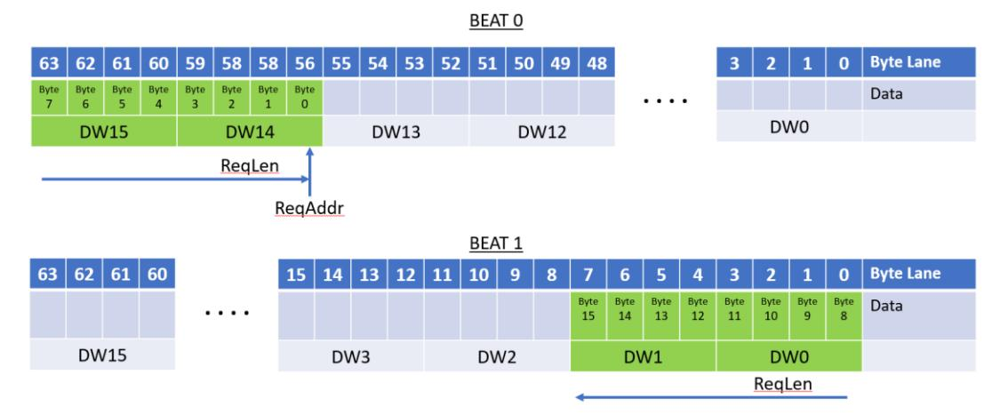

**Figure 2-13 Four DoubleWord Read Request Straddling a 64-byte boundary**

Unlike the previous transfer, this transfer spans a 64-byte boundary and therefore must be transferred using multiple data beats.

The next figure illustrates accessing a single byte (byte 54):

**Figure 2-14 Single Byte Read**

The ReqAddr/ReqLen fields call out a single double word (DW13 at address 52 in the data field), and ReqAttr[3:0] selects the byte (byte 54) to be accessed. ReqAttr[7:4] is ignored.

The next figure illustrates a six byte access necessitating the use of both ReqAttr[7:4] and ReqAttr[3:0]:

**Figure 2-15 Six Byte Read Access Not Straddling a 64-Byte Boundary**

In a two doubleword transfer, the ReqAttr[7:0] bit control the bytes within the two doublewords that are valid.

The next figure illustrates another two double word transfer, but one that spans a 64-byte boundary:

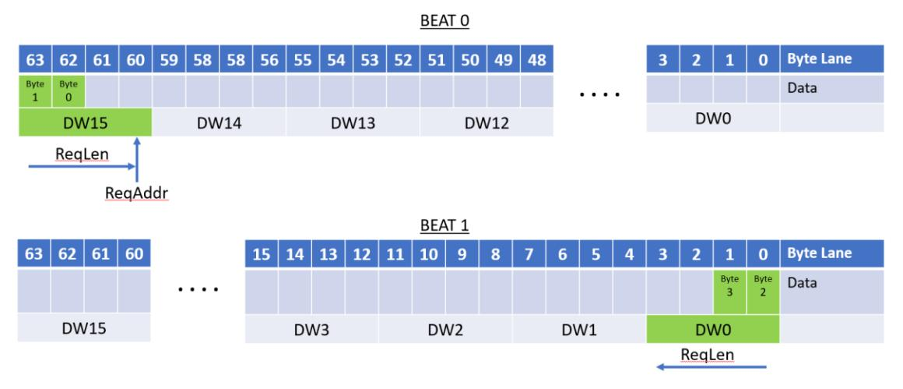

**Figure 2-16 Four Byte Read Access Straddling a 64-Byte Boundary**

Because the transfer spans a 64-byte boundary, the transfer is broken up into two data beats. The ReqAttr[7:0] field controls which bytes are valid in the two doublewords spread across the two beats.

### **Writes**

Transfers of write data occur on a 64-byte OrigData field in the Originator Data Channel. Like the RdRspData field, the byte lanes of the OrigData field are numbered 0 to 63 from the low order address to the high order address and any given byte of data in a write is transported on the byte lane of the OrigData field that matches the alignment for the byte's address. The ReqAddr/ReqLen fields are defined for Writes as they are for Reads: the address is a doubleword address (ReqAddr[1:0] are 2'b00) and the ReqLen field is the number of doublewords to be transferred minus one. As with Reads, writes can be up to a maximum of 256 bytes and may not cross a 256 byte boundary.

As with Reads, if a Write spans a 64-byte boundary or boundaries (that is not a 256 byte boundary), the transfer utilizes multiple 64 byte beats to transfer the data and each beat is transferred exactly once. The "wrapping" of write data in a beat is not permitted. The first beat of a Write (OrigDataVld asserted) must occur on the same cycle as the Request for that write (ReqVld) and the subsequent data beats (if any) must occur in consecutive cycles in ascending address order. Write data beats are labeled by the OrigDataOffset field with a value of 0, 1, 2, or 3 indicating the data beat number in ascending address order (OrigDataOffset is 0 for the beat containing the initial doubleword).

Write transfers have an additional 64-bit byte enable field – OrigDataByteEn -- that allows for individual bytes within a data beat to written or not in a write transfer. The OrigDataByteEn[0] signal indicates if byte lane 0 is to be written, OrigDataByteEn[1] indicates that byte lane 1 is to be written, and so on. For Write commands (not WriteFull commands), byte enables for byte lanes outside the region called out by ReqAddr/ReqLen must be set to 0. All other byte enables (within the region called out by ReqAddr/ReqLen) may be '0' or '1'. These other byte enables may be sparse – that is there is no requirement that the byte enables must be consecutively set nor is there a requirement that any byte enables be set.

For WriteFull commands, the transfers are restricted to starting on a 64-byte boundary, being a multiple of 64 bytes in length, and not crossing a 256-byte boundary. For these transfers, all byte enables in the beats must be set to '1'.

The follow figure shows the beat and byte lane assignments and the OrigDataByteEn values for a 16-byte write starting at address 0:

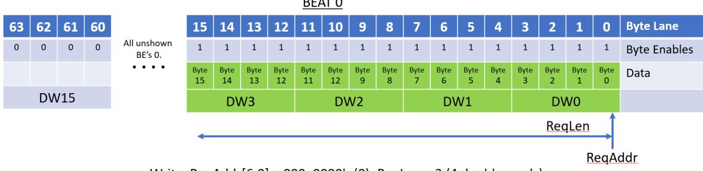

**Figure 2-17 Four Doubleword Write Request Not Straddling a 64 Byte Boundary**

The sixteen asserted byte enables starting at OrigDataByteEn[0] cause the first 16 bytes to be written.

The following figure shows a sparse write contained within one beat:

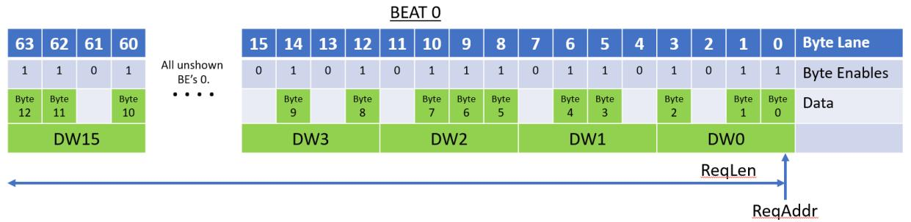

**Figure 2-18 Sixteen Doubleword Write Request Not Straddling a 64-Byte Bounday**

The various byte enables being on or off produce a sparse write. The ReqAddr/ReqLen are such that the write stays within a single beat.

The following figure shows a sparse write spread across two beats:

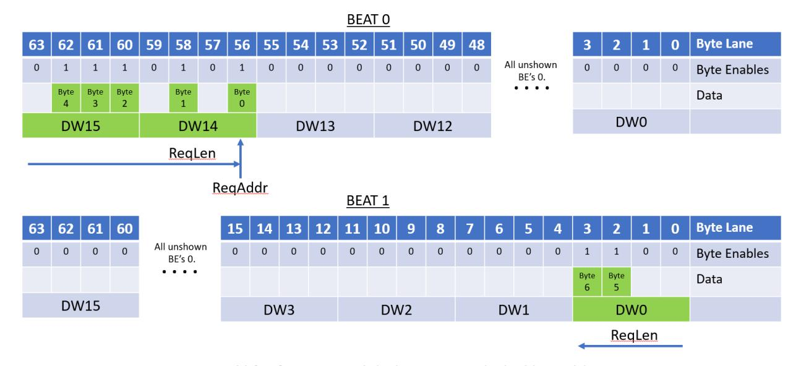

**Figure 2-19 Three Doubleword Write Request Straddling a 64 Byte Boundary**

The various byte enables being on or off produce a sparse write. The ReqAddr/ReqLen are such that the write spreads across two beats. A sparse write can spread across up to four beats.

Unshown in these figures is the case where no byte enables are asserted. In such a case, the beats are still transferred on the OrigData field, but no updates are made to memory.

The following figure shows a 128-byte WriteFull to address 0:

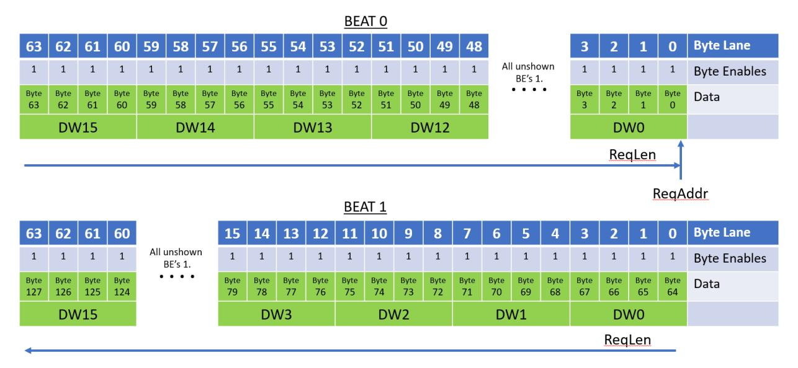

**Figure 2-20 A 128 Byte Write Full Request (Requires Two Beats)**

The WriteFull command allows the TL and PHY layers the option to compress out the byte enables. The byte enables must still appear on the UALink Protocol Level Interface.

### **Atomics**

# Evaluation Copy

### **Ultra Accelerator Link Consortium Inc. (UALink) - UALink\_200 Rev 1.0 Specification**

Originators issue Atomic commands to perform I/O coherent atomic (at the completer) readmodify-write operations. The AtomicR commands return the value read in the read-modify-write operation and AtomicNR commands do not return data. The semantics of the various AtomicR or AtomicNR operations are called out by the OpType sub-field in ReqAttr field and the size of the element(s) in memory (4-byte or 8-byte) that the Atomic operates on is specified by the OpSize sub-field in the ReqAttr field. The exact semantics for a given OpType field value is implementation specific as is whether the Atomic needs one operand (a single-operand atomic with one "Op1" operand) or two operands (a double-operand atomic with "Op1" and "Op2" operands).

For all Atomics, the operand data is conveyed on the OrigData bus to the completer. For an AtomicR Atomic, the returned data and Response is conveyed on the Read Response/Data Channel. For an AtomicNR command, the status Response (without any data) is conveyed on the Write Response Channel.

For all Atomics, each aligned 64-byte region of memory is divided into 16 aligned 4-byte elements for a 4-byte atomic or 8 aligned 8-byte elements for an 8-byte atomic. For single operand atomics, ReqAddr must be aligned to the size of the element operated on (4-byte or 8-byte), ReqLen must specify a length that is a multiple of the element size, and the Request may not cross a 64-byte boundary (i.e. all single operand atomics transfer their operand data in a single data beat). The operand value in each element in the OrigData field is used to perform the atomic read-modifywrite for the corresponding location in memory. Similarly, data returned for a given element by an AtomicR Request is placed in the corresponding locations in the RdRspData field.

Each 4 or 8 element in the 64 byte region of memory may be updated or not independently by setting or not setting all the byte enables for the element. All byte enables for each element must either be set to '1' or '0'. Partial byte enables within an element are not permitted. The elements that are updated may be sparse, that is there is no requirement that the elements that are updated are contiguous, nor is there a requirement that any element be updated at all. For an AtomicR Request, data for the elements read are returned in their naturally aligned positions in the RdRspData field. The data returned for an element whose byte enables were not set must be ignored by the Originator and should be driven to all '0's or all '1's by the Completer to prevent security leaks.

The following figure illustrates the byte lane allocation for the Operands and (if present) returned data for an 8-byte single-operand Atomic. The ReqAddr is offset from address '0' and two sparse elements are operated on:

**Figure 2-21 Single Operand (Eight-Byte Operands) Atomic**

The data elements, for an AtomicR, are returned in their naturally aligned byte lanes.

The following figure illustrates the byte lane allocation for the Operands and (if present) returned data for a 4-byte single-operand Atomic. The ReqAddr is at address '0' and five sparse elements are operated on:

**Figure 2-22 Single Operand (Four-Byte Operands) Atomic**

The data elements, for an AtomicR, are returned in their naturally aligned byte lanes.

The handling of double-operand Atomics is different than single-operand Atomics. The ReqLen for a double-operand always specifies a 64-byte transfer (ReqLen = 15) and the ReqAddr must be aligned on a 32-byte boundary. The double-operand atomic updates the 32 bytes of memory located at the address specified by ReqAddr. The operand data for a double-operand atomic, however, is transferred in one data beat with the Op1 operand data always occurring on byte lanes

0 to 31 on the OrigData field and the Op2 operand data occurring on bytes lanes 32 to 63 on the OrigData field. The placement of the Op1 and Op2 Operand data is unaffected by ReqAddr.

The 32-byte Operand Data fields Op1 and Op2 are each broken up into 8 aligned 4-byte elements in memory for a 4-byte atomic or 4 aligned 8-byte elements for an 8-byte atomic. Corresponding Op1 and Op2 elements, by address, are utilized by the atomic to update the corresponding element in the 32-byte memory region specified by ReqAddr.

As with single-operand Atomics, byte, the OrigDataByteEn byte enables are used to determine if a given element is to be updated and the byte enables may be sparse (dis-contiguous elements may be updated and no element may updated). Similarly to single-operand Atomics, the byte enables for the Op1 and Op2 operands for each element must all be asserted, or none asserted. No partial enables within an element's operands are permitted (a consequence of this condition is that the Op1 operand data byte enables must have the same values as the Op2 operand data byte enables).

The following figure illustrates the byte lane allocation for the Operands and (if present) returned data for an 8-byte double-operand Atomic. The ReqAddr is offset from address '0x20h' and two sparse elements are operated on:

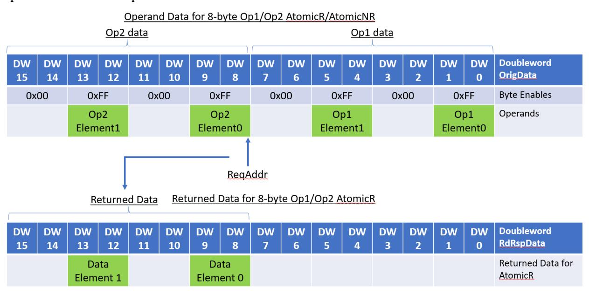

**Figure 2-23 Double Operand (Eight-Byte Operands) Atomic, Data Returned in High 32 Bytes.**

The data elements, for an AtomicR, are returned in their naturally aligned byte lanes relative to the address specified by ReqAddr.

The following figure illustrates the byte lane allocation for the Operands and (if present) returned data for a 4-byte double-operand Atomic. The ReqAddr is at address '0' and four sparse elements are operated on:

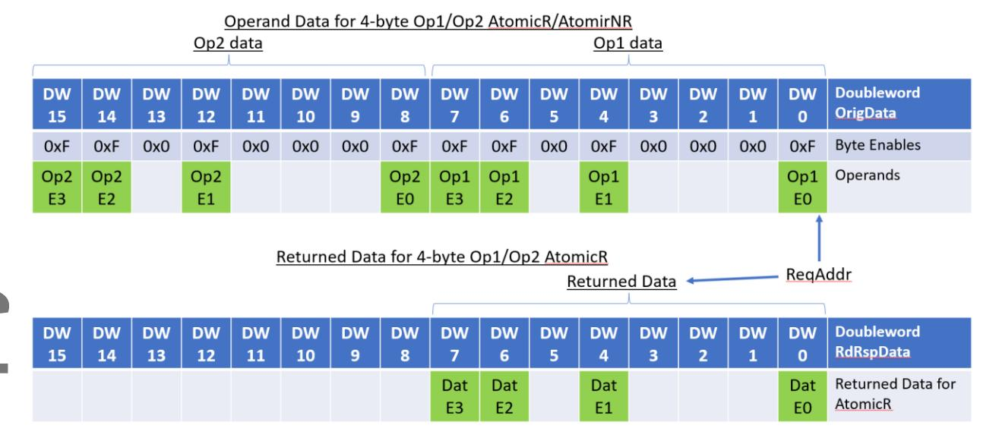

**Figure 2-24 Double Operand (Four-Byte Operands) Atomic, Data Returned in Low 32 Bytes.**

The data elements, for an AtomicR, are returned in their naturally aligned byte lanes relative to the address specified by ReqAddr.

While the examples above do not explicitly illustrate one-byte and two-byte Elements in Atomic operations, the obvious substitutions for byte enables, operands and data, and their alignments for one and two-byte elements apply.

A Completer Device that does not support a given Atomic Request returns a SLVERR Response on the appropriate Read Response Channel (for AtomicR Requests) or Write Response Channel (for AtomicNR Requests).

# **3 Reliability, Availability, and Serviceability (RAS)**

# **3.1 RAS Requirements**

Accelerator Pods require a robust fault management system to identify hardware failures and restore normal operations after errors with minimal disruption. This specification defines the Reliability, Availability and Serviceability requirements for Accelerators and Switches that use Ultra Accelerator Link technology.

This specification considers three broad classes of errors,

- Accelerator errors
- Link Down errors
- Switch errors.

and a set of RAS requirements and assumptions:

- A System Node is recommended as the smallest unit of allocation for a Virtual Pod. This recommendation is for simplicity, but implementations may vary. An Accelerator shall be the smallest allowable unit of allocation for a Virtual Pod.
- System Node errors (an error in one of the components in a System Node, e.g. CPU, GPU, PCIe, and other components) should not 'spread' beyond a virtual pod, however in the case where a System Node spans more than one Virtual Pod, the error may spread to all Virtual Pods associated with the System Node.
- Link Down errors shall not 'spread' beyond a Virtual Pod.
- An Accelerator attempts to handle Link Down errors and Switch errors without requiring a reboot of the associated System Node(s), Accelerator(s), or the associated Switch.
- Switches shall be stateless (i.e., Switches do not track Requests nor Responses once sent) and shall not be expected to implement any timeout detection. Accelerators shall implement timers, and timeout detection.
- Since UALink is a network that uses load-store operations (memory-semantic operations), it shall be acceptable for applications to be terminated and restarted when there is a Link Down error, a Switch error or an Accelerator error.
- UALink Data payloads shall be protected with parity or ECC and shall detect data errors that are uncorrectable. On such a detection, that data shall be marked as "poisoned".
- The UALink control path shall be protected and errors shall be isolated to a given port where required (such as Link Down errors – to avoid propagating an error outside the virtual Pod), but are otherwise handled at a coarser grain (i.e. at a given station or possibly all links on a Switch or an Accelerator).
- Component errors on a Switch Platform which may contain one or more Switches, CPU, FPGA, etc., may impact all the Switches in the Switch Platform and require a reset of the Switch Platform. However, Accelerators and other Switches in the Pod shall be able to recover/restart and continue to operate.
- The recovery process from a RAS error shall be controlled by fault management software and firmware running on BMC and host processors. Details of the fault management software may be found in the separate *Ultra Accelerator Link Manageability Specification.*

This specification attempts to simplify the hardware requirements for Switches while placing more responsibility for RAS error handling on Accelerators.

# **3.1.1 End to End Data Protection**

End to End protection of control and data buses shall be provided in UALink from a Source Accelerator to the Destination Accelerator. The protection mechanisms used by various components along this path does not need to be the same. However, an explicit overlap on the protection mechanisms at abutment points between components where the protection mechanism changes shall be required. In other words, the protection mechanism in a prior component along the path shall continue to be checked until the protection mechanism in the subsequent component is established without error on the prior component. This is conceptually shown in [Figure 3-1.](#page-80-1)

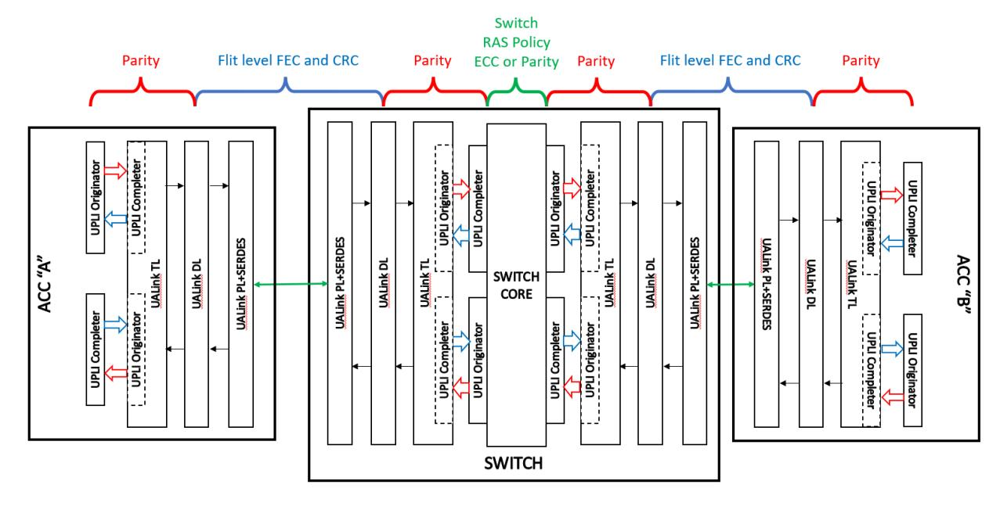

**Figure 3-1 UALink End to End Data Protection**

The UALink Protocol Level Interfaces shall be protected by even parity bits (the number of set bits in a protected group including the parity bit itself is even). Each channel within a UALink Protocol Level Interface shall have a separate set of parity signals for the individual channel. Each channel that has a \*Vld signal shall protect the \*Vld signal with a single parity bit. These parity bits shall be checked every cycle to detect extraneous or missing \*Vld assertions.

All other parity bits in the channel (not including the Credit Return Interface) shall be checked in cycles where \*Vld is asserted. For channels with data or byte enables, those fields (OrigData OrigDataByteEn, RdRspData) shall be protected with distinct parity bits to allow for the detection of data errors and poisoning of Beats by setting RdRspDataError or OrigDataError fields in the respective channels.

Each channel shall have one parity bit for the control information, except the Request Channel which shall have a separate bit for the Request address and one parity bit for the other control fields.

Each channel shall have a Credit Return Interface consisting of four \*CreditVld bits and some control fields. The \*CreditVld bits shall be protected by a single \*CreditVldParity signal that shall be checked every cycle to detect extraneous and missing \*CreditVld assertions. The control fields in the Credit Return Interface shall have a single parity bit that shall be checked in cycles that \*CreditVld is asserted.

# Evaluation Copy

### **Ultra Accelerator Link Consortium Inc. (UALink) - UALink\_200 Rev 1.0 Specification**

The DL and PHY layers shall protect DL and TL Flits through FEC (Forward Error Correction) and CRC (Cyclic Redundancy Checks). The UALink Protocol Level Interfaces shall be protected by Parity. However, within the Switch Core, a distinct Error Protection mechanism (possibly utilizing ECC) may be used. If the Switch Core error protection scheme is unable to distinguish between errors involving the data and control fields, the error shall be assumed to have occurred in a control field.

# **3.1.2 RAS Error Types**

UALink RAS errors are divided into several categories:

- 1. UPLI Control Errors
- 2. UPLI Data Errors
- 3. UPLI Protocol Errors
- 4. Switch Core Control Errors
- 5. Switch Core Data Errors
- 6. Link Down Error.

The UALink Protocol Level Interface errors (Control, Data, Protocol) shall be defined as errors that occur at the UALink Protocol Level Interfaces on the Accelerators or on the UALink Protocol Level Interfaces on a Switch. The Link Down error shall be defined as the error that occurs when a UALink Link is disconnected or takes some other failure that renders it inoperable.

A UPLI Control Error shall be defined as a parity error involving the ReqVldParity, RdRspVldParity, WrRspVldParity, or OrigDataVldParity signals (i.e. the parity check signals for the one bit \*Vld signal in each channel), a parity error involving the ReqParity, ReqAddrParity, RdRspParity, WrRspParity, or OrigDataFieldsParity signals (i.e. the parity check signals for the "control" information in each channel), a parity error involving the ReqCreditVldParity, RdRspCreditVldParity, WrRspCreditVldParity, OrigDataCreditVldParity signals (i.e. the parity check signals for the four bit \*CreditVld signals), or a parity error involving the ReqCreditParity, RdRspCreditParity, WrRspCreditParity, OrigDataCreditParity signals (i.e. the parity check signals for the "information" fields in the Credit return interface).

A UPLI Data Error shall be defined as a parity error involving the OrigDataParity, OrigDataByteEnParity, RdRspDataParity signals (i.e. the parity bits protecting the Read Response Channel data field, the Originator Data Channel data field, or the byte enables for the Originator Data Channel).

A UPLI Protocol Error shall be defined as an error where the UPLI protocol is not followed and no UPLI Interface Control or UPLI Data Error occurs. As an example, a Request Channel Beat with a ReqAddr and ReqLen field that calls for a transaction that crosses a 256-byte boundary is a UPLI Protocol Error. Many other possible UPLI Protocol Errors exist and the Switch is shall not be required to check for any given protocol error.

UPLI errors (Control/Data/Protocol) shall be checked at the receiving end of a given UPLI Channel.

A Switch Core Control error shall be defined as an error occurring on control fields in a beat or beats or an error occurring on the data fields (OrigData, RdRspData, OrigDataByteEn) when the Switch error protection mechanism cannot isolate that error to the data fields (e.g. an error on a data field where a Switch ECC protection scheme that mixes data and control fields in a way that an error in the data field is indistinguishable from an error in a control field).

A Switch Core Data error shall be defined as an error occurring on data fields that the Switch can isolate to the data fields (OrigData, RdRspData, OrigDataByteEn) in one or more Beats.

# **3.1.3 RAS Error Handling Mechanisms**

There are three primary RAS error handling mechanisms:

- 1. A TL Drop Mode implemented at the TL's on both the Switch and the Accelerator.
- 2. An Originator Drop Mode implemented at the UPLI Originators and a Completer Drop Mode implemented at the UPLI Completers in the Accelerator and UPLI Completers in the Switch that are not in the TLs.
- 3. An Isolation Mode implemented only at the UPLI Originators in the Accelerators.

Generally speaking, any Drop Mode not in the TL shall cause all traffic for all channels for all ports at the Originator or Completer to be dropped (implementations may choose to limit drop mode to the Channel with the error and/or the port with the error). Drop mode for the TL shall cause all traffic on all channels for either a given port or all ports at both the Completer and the Originator in the TL to be dropped. Whether all ports are dropped or a single port is dropped shall depend on whether the error is a Control Error (generally all ports, but an implementation may choose to only drop the affected port) or a Link Down Error (single port).

Isolation Mode shall be a distinct mechanism from Drop Mode that shall be implemented only at the UPLI Originator in the Accelerators. These UPLI Originators shall be stateful and maintain a history of all the Requests that have been issued by the Originator or that are queued to be issued. This state shall be maintained until the Request has received all Response Beats associated with the Request. Within this state, each Request shall be expected to have a Watch Dog Timer that monitors the amount of time the Request has been outstanding.

When a programmable time limit is reached, the Watch Dog Timer expires and shall cause the UPLI Originator to enter Isolation Mode. Isolation Mode shall block all outbound Request and Originator data traffic for all ports in the Originator and shall discard any inbound Response or Request traffic. In addition, the Originator shall provide "dummy" Completion Timeout Responses for all outstanding Requests. Because the "dummy" Completion Time Out Responses will quickly lead to the termination of processing on the Accelerator, there is no meaningful advantage to perform Isolation Mode to anything less than all ports in the station.

Isolation Mode and Drop Mode at the UPLI Originator on the Accelerator shall be distinct mechanisms though both modes do drop traffic. The UPLI Originator on the Accelerator can be in neither mode, either mode, or both modes.

The following actions occur in Isolation Mode:

- 1. The UPLI Originator shall stop issuing new Requests to the TL (either outstanding Requests in the UPLI Originator or newly arriving Requests at the UPLI Originator) for all ports.
- 2. The UPLI Originator shall provide "dummy" Completion Timeout Responses to all outstanding or newly arriving Requests for all ports in the Originator.
- 3. The UPLI Originator shall discard any Responses, for all ports, received from the UALink TL (the "dummy" Completion Timeout Responses replace the Responses from the Completers).
- 4. The UPLI Originator shall continue to accept returned Credits and shall return any outstanding Credits as normal.
- 5. Implementations may terminate unfinished bursts (Read Responses or Originator Data) due to entering Isolation mode.

The UPLI Originator Isolation Mode shall return a "dummy" Completion Time Out Response to any pending Originator Devices with a Request for that UPLI Originator which shall cause that Originator Device to transition to an "idle" state. This allows that Originator Device to be able to be

used again once management software takes appropriate clean up actions and begins executing programs after the error, as specified in the *Ultra Accelerator Link Manageability Specification.*

In contrast to Isolation Mode, the Drop Mode implemented at a UALink TL (whether at the Switch or Accelerator) can apply to an individual port, a subset of the ports, or all the ports in the station depending on the error that invoked UALink TL Drop Mode and which UALink TL (Switch or Accelerator) the error occurred at. UALink TL Drop Mode, whether for a given port or all ports in the UALink TL, shall always apply to all channels for the port or ports affected.

For example, for a Link Down error detected on a Switch, the UALink TL is only allowed to enter UALink TL Drop Mode for the port that whose Link entered a Link Down state. This is to prevent a Link Down error from propagating to other Virtual Pods (if a single Link Down at a station on the Switch were to put all the ports on that Station into UALink TL Drop Mode, that could impact other Virtual Pods associated with the other links in the Station). More than one Link taking a Link Down error in a single station results in a subset of Links in a Station being in UALink TL Drop Mode.

If, however, instead of a Link Down, a UPLI Control error is detected at a UALink TL on the Switch, the UALink TL shall be placed in Drop Mode for all ports. This is because it is impossible, in general, to determine which port is involved in a UPLI Control Error from the signals present in the Beat that took an error: either the parity signal protecting the \*Vld is corrupt and the entire beat including port information is suspect or the \*Vld is correct, but the parity field for the other control fields took an error and the port information is again suspect (with the sole exception of the case of a parity error on the ReqAddr field which is not worth creating an exception for).

While is it conceptually possible to infer the port that took an error from the TDM phase in some cases, this technique will not work for errors on the Credit Return Interfaces that are not managed by TDM. These techniques are not prohibited, but they are not recommended because UPLI Control Errors will typically be handled at a coarser grain by the recovery management software (i.e. UPLI Control Errors on the Switch will typically be handled at at least a Station level if not by resetting the entire Switch Platform, therefore isolating the Drop Mode to a port for these errors provides no meaningful advantage).

When a TL enters into TL Drop Mode at a given port, the following actions occur:

- 1. All traffic (inbound or outbound) for that port between the TL and DL shall be dropped.
- 2. All UPLI traffic inbound to the TL -- the Read Response and Write Response Channels received at the Originator in the TL and the Request and OrigData Channels received at the Completer in the TL-- shall be dropped.
- 3. All UPLI traffic outbound from the UALink TL the Request and Originator Data Channels driven at the TL Originator and the Read Response and Write Response Channels driven at the TL Completer-- shall be dropped.
- 4. The UPLI Originator and the UPLI Completer in the TL may continue to accept returned Credits and may return any outstanding Credits as normal where possible. Certain errors that cause drop mode corrupt information necessary to return credits accurately.
- 5. Implementations may terminate outbound unfinished bursts (Read Responses or Originator Data) due to entering TL Drop mode.

If entering TL Drop Mode due to a UPLI Control Error, the TL shall ensure that corruption does not occur in the system by preventing subsequent Beats for the given channel and port from being delivered.

UPLI Originator Drop Mode and UPLI Completer Drop Mode are similar to TL Drop Mode but shall occur at UPLI Completers and Originators that are not part of a UALink TL and shall be entered as a result of a UPLI Control Error. The UPLI Originator/UPLI Completer Drop Modes can also be limited

to a specific port (implementations can also choose to limit the drop mode to the specific Channel that took the error). However, as explained above, it is not possible to always determine the port that took the UPLI Control Error and therefore these drop modes are typically implemented to affect all ports associated with the Originator or Completer (in contrast, the Link Down events that cause the TL Drop Mode to be invoked for a specific port shall be limited to the specific port because the involved port can be trivially determined by which port took the error).

When a UPLI Originator or UPLI Completer not on a UALink TL enters Originator Drop Mode or Completer Drop Mode, the following actions shall occur:

- 1. All subsequent traffic Beats for the Completer or Originator for the channel and port that detected the UPLI Control Error shall be dropped (if the channel is in the middle of an incomplete burst, that burst shall be terminated).
- 2. All subsequent traffic Beats for the other channels and all other ports for the Completer or the Originator shall also be dropped (unless the implementation chooses to limit the drop mode to the port and/or channel detecting the error), however implementations are permitted to complete outstanding bursts on these channels.
- 3. The UPLI Originator or the UPLI Completer may continue to accept returned Credits and may return any outstanding Credits as normal where possible. Certain errors that cause drop mode corrupt information necessary to return credits accurately.

# **3.1.4 UALink RAS Error Handling**

The following sections provides more detailed descriptions of the error handling sequences for the various classes of UALink RAS errors. The table below provides an overview or errors and actions:

|                  |                                                                                                                                                                                                                                                                                                                                                                                                                                                                                                                                                                                                                                                                                                      | Errors and Actions                                                                                                                                                                                                                                                                                                          |                                                                                                                                                                                                                                                                                                                                                                                                                                                                                                                                                                                                                                                                                                 |
|------------------|------------------------------------------------------------------------------------------------------------------------------------------------------------------------------------------------------------------------------------------------------------------------------------------------------------------------------------------------------------------------------------------------------------------------------------------------------------------------------------------------------------------------------------------------------------------------------------------------------------------------------------------------------------------------------------------------------|-----------------------------------------------------------------------------------------------------------------------------------------------------------------------------------------------------------------------------------------------------------------------------------------------------------------------------|-------------------------------------------------------------------------------------------------------------------------------------------------------------------------------------------------------------------------------------------------------------------------------------------------------------------------------------------------------------------------------------------------------------------------------------------------------------------------------------------------------------------------------------------------------------------------------------------------------------------------------------------------------------------------------------------------|
|                  | Link Down                                                                                                                                                                                                                                                                                                                                                                                                                                                                                                                                                                                                                                                                                            | Data Error                                                                                                                                                                                                                                                                                                                  | Control & Protocol Errors                                                                                                                                                                                                                                                                                                                                                                                                                                                                                                                                                                                                                                                                       |
| Switch UALink | - The Switch shall enter Drop Mode at the affected Switch TL for the affected port only. – The TL shall drop traffic in both directions on all channels for the affected port. - The Switch shall notify firmware which will log the error. - All ports on the Station except the port attached to the dropped link shall continue to function. - Returning the Link to an active state shall not have any impact to other ports on the Station. - All UPLI channels attached to the Switch TL shall remain active and maintain their credits throughout the link going down and being returned to                                                   |                                                                                                                                                                                                                                                                                                                             | - Protocol and Control errors shall be handled similarly at the Switch. - Drop Mode shall be entered at the Completer, Originator, or TL that detected the error for all ports. - Traffic shall be dropped in both directions on all channels for the affected ports. - The Switch shall notify firmware which will log the error. - Recovery may require a full reset of the Station or possibly the full Switch to resume operation.                                                                                                                                                                                                                   |
| Switch Core   | an active state. - No action needed in the switch core. - Handled by the Switch TL, Accelerator TL, and the Accelerator Originator.                                                                                                                                                                                                                                                                                                                                                                                                                                                                                                                                                      | - The Data Error signal shall be asserted to indicate poisoned or corrupted data for the corrupted beat. - Good parity shall be generated for the Beat and the data shall be forwarded with the asserted Data Error Signal. - The Switch Core shall Notify firmware which will log the error. | - The Switch shall enter Drop Mode at the egress Originator for all ports. - The Originator shall drop traffic in both directions on all channels for the affected ports. - Log error and notify firmware. - Protocol and Control Errors detected within a switch Core may impact the entire Switch and all virtual Pods, however implementations may choose to reduce the impact, where possible, to a given Station or Stations. - The Switch shall go through a full Reset to resume operation.                                                                                                                                                 |
| Accelerator      | - The affected Accelerator TL shall enter Drop Mode for all ports in the TL (station). - Drop traffic in both directions on all channels for the affected ports. - The affected TL shall issue an ISOLATE Write Response to Originator to cause Originator to enter Isolation Mode. - The affected TL shall notify firmware which will log the error. All UPLI channels attached to the Accelerator TL shall remain active and maintain their credits throughout the link going down and being returned to an active state. - Firmware may choose to reduce the number of active Links before resuming the applications on the Accelerator. |                                                                                                                                                                                                                                                                                                                             | - Protocol and Control Errors at the Accelerator should be handled similarly. - The Originator or Completer that detected the Error shall Enter Drop Mode at the Originator or Completer. - Traffic shall be dropped in both directions on all channels for the affected ports. - The Switch shall notify firmware which will log the error. - Protocol and Control Errors are low probability event and implementations are expected to impact the entire Accelerator for these errors. However, implementations may be able to isolate and recover errors more precisely. - The level of Reset required to resume operation is |

Firmware handling for error log notifications and software interfaces for Station, Accelerator, and Switch resets are specified in the separate *Ultra Accelerator Link Manageability Specification*.

### **3.1.4.1 UPLI Data Error Processing**

A UPLI Data Error (a parity error in the OrigData, RdRspData, or OrigDataByteEn fields) is handled by setting the OrigDataError or RdRspDataError field to indicate the beat has "poisoned" data, replacing the bad parity with good parity, and letting the beat continue through the system to deliver it to the destination Originator Device (Reads) or Completer Device (Writes). Implementations may choose to implement a mode where Data Errors are treated as Control Errors.

### **3.1.4.2 UPLI Control Error Processing**

### **Accelerator UPLI Control Error processing**

The processing of a UPLI Control Error shall depend on whether the error is taken on the Accelerator or on the Switch and at what interface boundary. The next figure illustrates the processing involved in handling a UPLI Control Error that occurs on an Accelerator UALink Protocol Level Interface on an Accelerator.

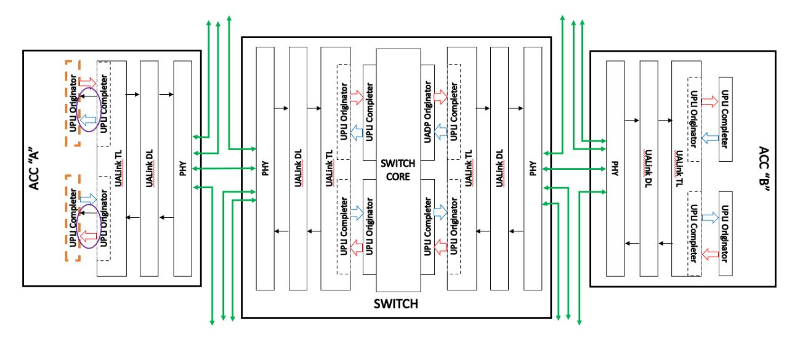

**Figure 3-2 UPLI Control Error detected at an Originator or Completer not on a UALink TL on an Accelerators**

In [Figure 3-2](#page-86-0) above, the processing for a UPLI Control Error detected at a UPLI Originator or UPLI Completer in an Accelerator is shown (errors are detected on both the received Channels and the received Credit Return Interfaces). Processing these Control Errors involves dropping the bad Deat or returned Credit, placing the detecting UPLI Originator or UPLI Completer into Drop Mode for all channels for all ports (implementations can chose to limit Drop Mode to the specific channel with the error), and signaling firmware by an implementation specific means that the error has occurred. Implementations may choose, either through implementation specific hardware means or in the RAS recovery sequence in firmware to place other TLs, Originators, or Completers in this or other Stations into Drop Mode and to possibly take various links into a link down state (up to and including all Stations and links on the Accelerator). It is acceptable to place all links on an Accelerator into a link down state on a Control Error because these links can only communicate with other Accelerators in the same Virtual Pod.

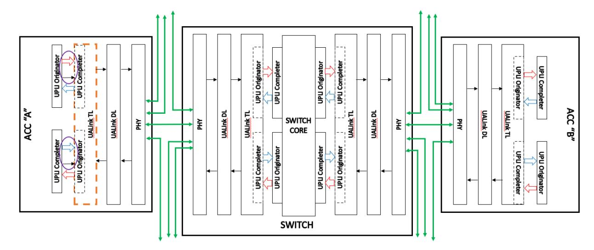

**Figure 3-3 UPLI Control Error detected at a UALink TL on an Accelerator**

As shown i[n Figure 3-3](#page-87-0) above, the processing of a UPLI Control Error detected at the UALink TL (either at the Originator or Completer) on an Accelerator involves dropping the bad Beat or returned Credit, placing the TL into Drop Mode for all ports and all Channels on both UPLI interfaces (implementations can choose to apply Drop Mode to only one port) and signaling the firmware by an implementation specific means of the error. Implementations may choose, either through implementation specific hardware means or in the RAS recovery sequence in firmware, to place other TLs, Originators, or Completers in this or other Stations into Drop Mode and to possibly take various links into a link down state (up to and including all Stations and links on the Accelerator). Like Control Errors detected on the Accelerator Completers and Originators, it is acceptable to place all links on the Accelerator into a link down state because these Accelerator links can only communicate with Accelerators in the same Virtual Pod. The TL being in Drop Mode will block Responses to the UPLI Originators in the Accelerators in the Virtual Pod causing them to eventually enter Isolation Mode.

### **Switch UPLI Control Errors on the Switch UALink Protocol Level Interfaces**

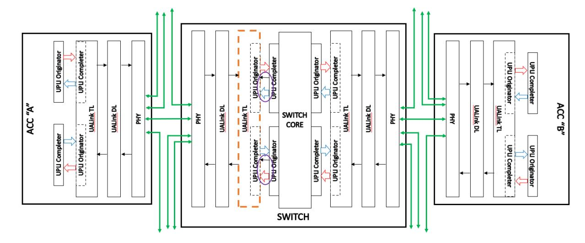

**Figure 3-4 UPLI Interface Control Error detected at the UALink TL on the Switch**

As shown i[n Figure 3-4](#page-88-0) above, the processing of a UPLI Control Error detected at the UALink TL (either at the Originator or Completer) on the Switch is the same as processing the same error on the Accelerator: the bad Beat is dropped and the TL detecting the error enters Drop Mode for all channels, on all ports, for both UPLI interfaces (implementations may limit this to a port on both interfaces). Implementations may also, either through implementation specific hardware means or in the RAS recovery sequence in firmware, place other TLs, Originators, or Completers in this or other Stations in the Switch into Drop Mode, and to possibly take various links into a link down state (up to and including all Stations and links on the Switch). This is possible because this is a UPLI Control Error and not a Link Down error. For Link Down errors, only the involved port may be affected. The TL being in Drop Mode will block Responses to the UPLI Originators in the Accelerators in the Virtual Pod causing them to eventually enter Isolation Mode.

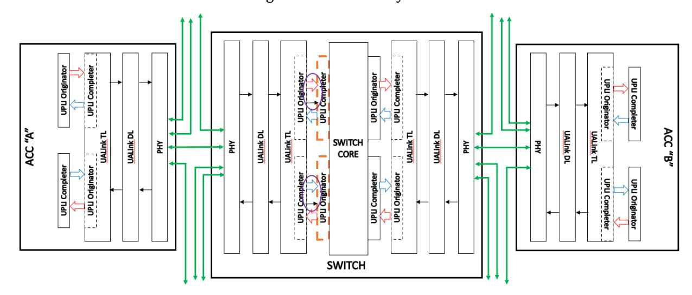

**Figure 3-5 UPLI Control Error detected at the UPLI Completer on a Switch**

[Figure 3-5](#page-88-1) above illustrates the processing for a UPLI Control Error detected at the UPLI Completer or UPLI Originator at the Switch Core (errors are detected on both the received Channels and the received Credit Return Interfaces). The processing involves dropping the bad Beat or returned

Credit, placing the detecting UPLI Completer or UPLI Originator into Drop Mode for all ports (implementations can choose to limit Drop Mode to the specific channel with the error), and signaling firmware by an implementation specific means that the error has occurred. Implementations may choose, either through implementation specific hardware means or in the RAS recovery sequence in firmware to place other TLs, Originators, or Completers in this or other Stations into Drop Mode and to possibly take various links into a link down state (up to and including all Stations and links on the Switch). It is acceptable to place all links on a Switch into a link down state on a Control Error because the Switch is treated as a single point of failure for these errors.

### **Switch UPLI Control Errors within the Switch Core**

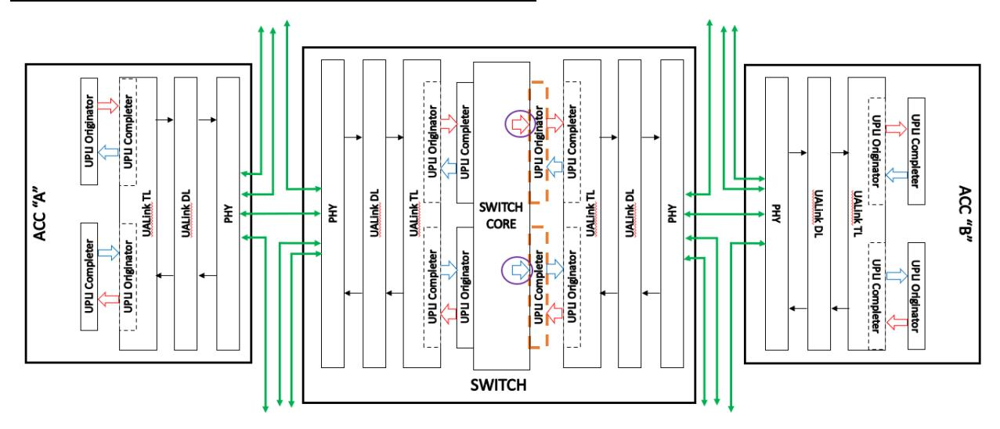

**Figure 3-6 UPLI Control Error detected within the Switch Core at the UPLI Originator**

As shown i[n Figure 3-6](#page-89-0) above, the processing for a UALink Interface Control Error detected at Switch egress at the UPLI Originator drops the bad Beat, causes the UPLI Originator to enter Drop Mode for at least the channel on which the error was detected, and signals firmware by an implementation specific means.

### **3.1.4.3 Link Down Error Processing**

The following section describes the sequencing to process a Link Down Error. In UALink, a Link Down Error is intended to be recoverable without resetting the Accelerator or Switch and shall not impact Virtual Pods not utilizing the affected Link.

The various applications running on the Accelerator shall be terminated (as UALink is a load/store architecture, application termination on a Link Down Error is unavoidable), rolled back to a checkpoint, and restarted.

The sequencing for a Link Down Error is described below:

**Figure 3-7 UALink Link goes down**

As shown i[n Figure 3-7](#page-90-0) above, the process begins with a UALink Link going down.

**Figure 3-8 PHYs Inform UALink TLs in Accelerator and Switch Which Enter Drop Mode**

As shown i[n Figure 3-8](#page-90-1) above, the PHYs at both ends of the down UALink Link shall determine the link is down and communicate to the two UALink TLs indicating which port has gone into a Link Down state.

The UALink TL in the Accelerator shall go in Drop Mode for all ports. The UPLI Originator will be going into Isolation Mode in the next step, and therefore it is not useful in this case to enter Drop Mode in the UALink TL on the Accelerator only for the port associated with the dropped link.

On the Switch, however, the UALink TL shall go into Drop Mode only for the affected port. Going into Drop Mode for any other ports could impact Accelerators not in the Virtual Pods which shall not be permitted for a Link Down Error.

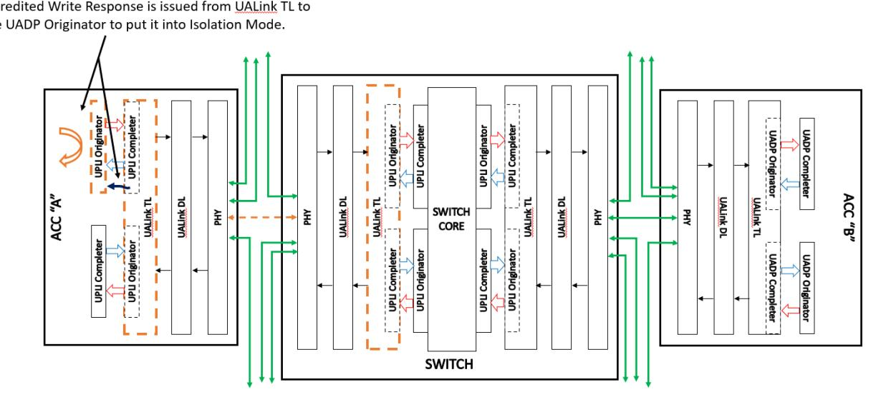

**Figure 3-9 Placing the Accelerator UPLI Originator Into Isolation Mode**

As shown above in [Figure 3-9,](#page-91-0) the UALink TL shall issue a credited Write Response of "Isolate" to the UPLI Originator which shall cause the UPLI Originator to enter Isolation Mode. This shall prevent the Accelerator from creating new traffic for the dropped link (an all links in the Station).

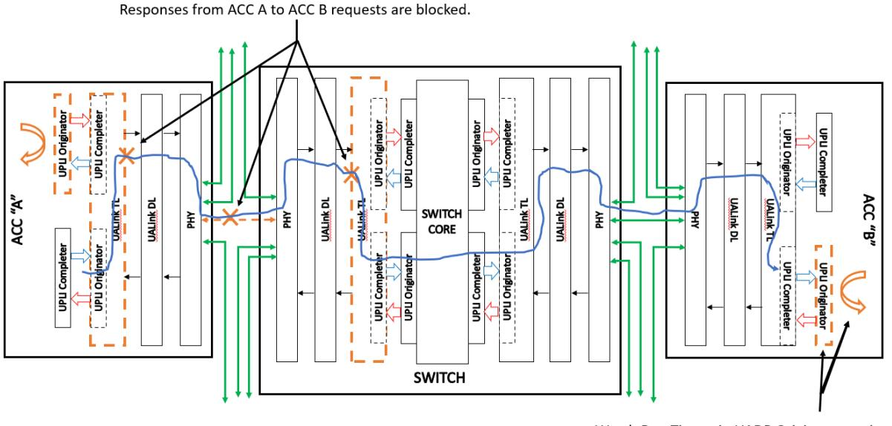

**Figure 3-10 Other Accelerators Time Out**

As shown i[n Figure 3-10](#page-91-1) above, once the Accelerator UPLI Originator is in Isolation Mode, the Accelerator UALink TL is in Drop Mode, the link is down, and the UALink TL on the Switch is in Drop Mode for the affected ports, Responses from Accelerator A to Accelerator B's Requests may be blocked. This shall cause the Watch Dog Timers in Accelerator B's UPLI Originator(s) to time out and enter Isolation Mode.

**Figure 3-11 Link Down Error Processing Complete**

The final state of the system for a Link Down Error is shown above i[n Figure 3-11.](#page-92-0) The UPLI Originators in both Accelerators shall be in a "safe" state (both in Isolation Mode) and no new traffic shall be generated by these Accelerators (including the other Accelerators in the Virtual Pod, not shown in the figure, that have also timed out). At this point, system management software can gain control of the Accelerators and recover the system, and redispatch applications on the Accelerators. The relevant interfaces for system management software are documented in the separate *Ultra Accelerator Link Manageability Specification.*

# **4 UPLI Interface Reset, Signaling, and Connection**

# **4.1 UPLI Interface Reset**

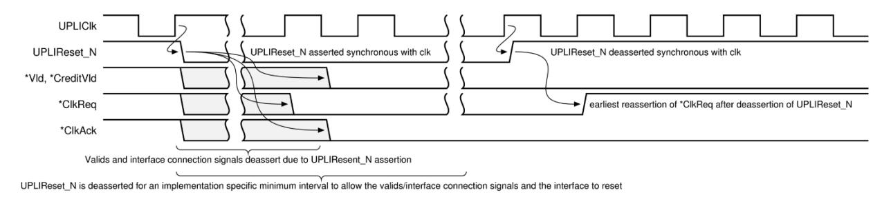

**Figure 4-1 UPLI Interface Reset Requirements.**

The system reset signal UPLIReset\_N shall be a negative-active signal that shall be used to initialize the interface logic. No state information shall be retained across a reset event (an assertion followed by a de-assertion of UPLIReset\_N). Any established Credits shall be reset and any outstanding transactions shall be terminated and shall not receive a Response.

The assertion (negative-going edge) of UPLIReset\_N and the de-assertion (rising edge) of UPLIReset\_N shall be synchronous to the clock: UPLIClk. When the UPLIReset\_N signal is first asserted, the \*Vld, \*CreditVLD and interface control signals \*ClkReq and \*ClkAck signals shall transition to their inactive values in an implementation specific number of cycles which may vary for each signal, but shall be before the UPLIReset\_N signal is de-asserted. The UPLIReset\_N signal shall remain asserted for an implementation specific minimum interval to allow the interface to reset and the valid signals and interface connection signals to transition to their de-asserted values before UPLIReset\_N is de-asserted.

Any attempt to reconnect the interface by asserting either of the \*ClkReq signals (described below) shall not occur until at least one cycle after the de-assertion of UPLIReset\_N signal as shown in Figure 4-1 [UPLI Interface Reset Requirements.](#page-93-2)

# **4.2 UPLI Interface Signaling Requirements**

When the Source Originator or Completer has not asserted its \*Vld signal for a given channel, all of the command and data information on that channel is not valid and shall be ignored. For example, there is no requirement that ReqCmd has a valid encoding when ReqVld is de-asserted or that the parity signals on the OrigData or RdRsp Channels are consistent with the data on those channels when OrigDatVld or RdRspVld, respectively, is de-asserted. The validity of the \*CreditVld signals and associated Credit management signals (driven from the receiver Completer or Originator side of the UPLI interface) shall not be impacted by the \*Vld signal.

All signals on the UPLI interface shall be synchronous to a common clock (UPLIClk) supplied by system pervasive logic. Source logic switching and signal propagation times shall be expected to be such that there is sufficient time margin to the next rising clock edge to allow simple combinatorial logic on the receiving side of the interface.

# **4.3 UPLI Interface Control**

A UALink Protocol Level Interface shall provide signals that allow the interface to be connected (brought into an active state), either at power up or after a reset of the interface, in an ordered sequence (the Connection Handshake Protocol) that eliminates race conditions that might corrupt the transfer of information across the interface. The Connection Handshake Protocol may be orchestrated by state machines on both sides of the interface or coordinated directly by SOC-level logic and/or management firmware. Both the Originator and Completer shall be powered and actively clocked for the Connection Handshake Protocol to proceed.

In the following diagrams and discussion, "Originator" shall refer to the Originator for the UALink Protocol Level Interface and "Completer" shall refer to the Completer for the UALink Protocol Level Interface. The interface control signals used in the Connection Handshake Protocol shall be the OrigClkReq, OrigClkAck, CompClkReq, and CompClkAck signals.

An Originator shall use the OrigClkReq signal to request the connection of the Originator to Completer Channels and Credit Return Interfaces (the Request Channel, Originator Data Channel, Read Response/Data Credit Return Interface, and Write Response Credit Return Interface). The Completer shall respond with the CompClkAck signal to acknowledge the Originator's request and indicate the Completer's ability to accept information on those Channels and Credit Return Interfaces. Once the Originator is connected to the Completer, the Originator may transfer Credits to the Completer, but the Completer shall not send Beats to the Originator until the Completer to Originator connection is also completed. Finally, the Originator shall not send Beats to the Completer until the Originator has Credits to do so. The Completer to Originator connection shall be completed before the Credits from the Completer can be transferred to the Originator.

The Completer shall use the CompClkReq signal to request the connection of the Completer to Originator Channels and Credit Return Interfaces (the Read Response/Data Channel, Write Response Channel, Request Credit Return Interface, Originator Data Credit Return Interface). The Originator shall respond with the OrigClkAck signal to acknowledge the Completer's request and indicate the Originator's ability to accept information on those Channels and Credit Return Interfaces. Once the Completer is connected to the Originator, the Completer may transfer Credits to the Originator, but the Originator may not send Beats to the Completer until the Originator to Completer connection is also completed. Finally, the Completer shall not send Beats to the Originator until the Completer has Credits to do so. The Originator to Completer connection shall be completed before the Credits from the Originator can be transferred to the Completer.

In order to transfer Beats, the Originator shall be connected to the Completer and the Completer shall be connected to the Originator (and appropriate Credits transferred) implying all four interface control signals: \*ClkReq and \*ClkAck shall be asserted before Beats can be transferred across the interface.

Either the Completer or the Originator may hold off the completion of the connection by delaying its \*ClkAck response or deferring its assertion of \*ClkReq. Prior to asserting \*ClkAck the acknowledging Completer or Originator shall be prepared to latch valid information presented by the requesting agent on any of the requesting agent's outbound channels. Once an Originator or Completer asserts any of \*ClkReq or \*ClkAck, it shall not de-assert that signal until UPLIReset\_N is asserted. The Completer may wait for the Originator to establish the connection first, or both sides may independently connect. It shall not be legal for the Originator to wait for a Completer to establish the connection first.

The following figures show the UPLI Connection Handshake Protocol with the Originator connecting first [\(Figure 4-2\)](#page-96-0), the Completer connecting first [\(Figure 4-3\)](#page-96-1), and finally, both Originator and Completer connecting concurrently [\(Figure 4-4\)](#page-96-2).

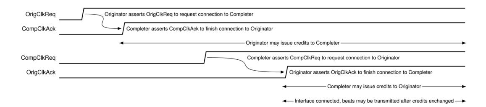

**Figure 4-2 UPLI Connection Handshake Protocol – Originator connects first**

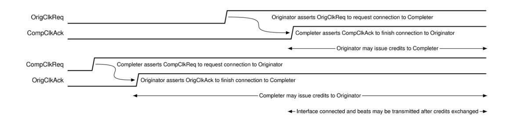

**Figure 4-3 UPLI Connection Handshake Protocol – Completer connects first**

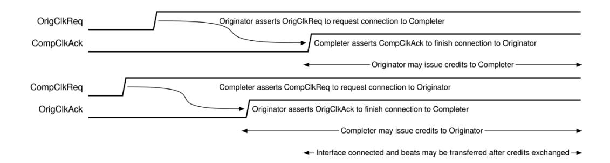

**Figure 4-4 UPLI Connection Handshake Protocol – Originator and Completer connecting concurrently**

# **5 Transaction Layer (TL)**

The UALink Transaction Layer (TL Layer) is responsible for converting UPLI beats from the inbound (to the TL) channels from the two UPLI interfaces connected to the UALink TL into TL Flits on the outbound or Transmit (Tx) TL Flit Channel. The TL also converts TL Flits received from the inbound or Receive (Rx) TL Flit Channel into UPLI beats for the outbound (from the TL) UPLI channels on the two UPLI interfaces connected to the UALink TL.

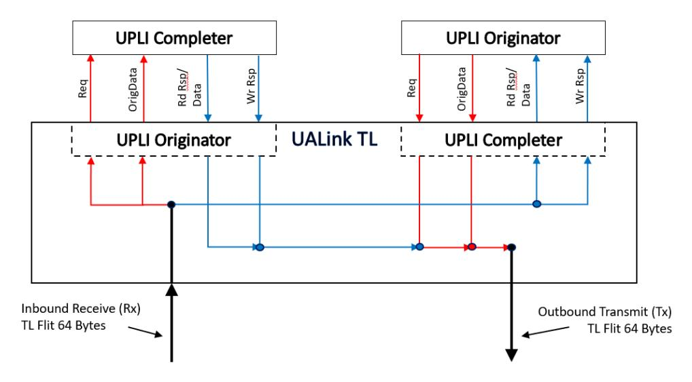

**Figure 5-1: TL Flit connections to UPLI interfaces**

The figure above[, TL Flit connections to UPLI interfaces,](#page-97-4) schematically illustrates the connections between the various channels for the two UPLI interfaces attached to a UALink TL and their relationship to the Tx and Rx TL Flit Channels. Because of the symmetry of the interfaces, the format for both the Receive and Transmit Flits are the same. The 64-byte Transmit Flit and Receive Flit Channels each encode the information for a UPLI Request Channel, Originator Data Channel, Read Response/Data Channel, and Write Response Channel.

# **5.1 TL Flit and Half Flit formats**

# **5.1.1 TL Flit and TL Control and Data Half-Flit formats and Sequencing**

Each 64-byte TL Flit is divided into an Upper and a Lower 32-byte Half-Flit and the 64-byte TL Flit is also divided into sixteen 4-byte Sectors numbered from the least-significant 4-byte sector in the TL Flit as shown below in [Table 5-1: TL Flit organization:](#page-98-0)

|                                            | 64-byte TL Flit    |  |  |  |  |  |  |   |   |   |                    |   |   |   |   |  |
|--------------------------------------------|--------------------|--|--|--|--|--|--|---|---|---|--------------------|---|---|---|---|--|
|                                            | Upper TL Half-Flit |  |  |  |  |  |  |   |   |   | Lower TL Half-Flit |   |   |   |   |  |
| 15 14 13 12 11 10 9 8 |                    |  |  |  |  |  |  | 7 | 6 | 5 | 4                  | 3 | 2 | 1 | 0 |  |

### **Table 5-1: TL Flit organization**

A TL Half-Flit may be a Control Half-Flit, a Data Half-Flit, a Message Half-Flit, or an Authentication Tags (AuthTags) Half-Flit.

The Control Half-Flit shall be used to encode the following information:

- Requests (Reads, Writes, AtomicR, AtomicNR)
- Read Responses (but not the data associated with them note that an AtomicR Request causes a Read Response)
- Write Responses (Note that an AtomicNR Request causes a Write Response).
- Flow Control/NOP information.

In the Control Half-Flit, Requests can be encoded in 4 or 2 sector fields, the Responses can be encoded in 2 or 1 sector Fields, and the Flow Control (FC) information and the NOP indications are each encoded using one sector. A special control Half-Flit called the NOP Half Flit consists of eight NOP indications. The alignment of Control Half-Flit fields shall be according to the table below:

| Field Type                   | Legal Sector Footprint               |
|------------------------------|--------------------------------------|
| 4 sector Request             | 7654 or 3210                         |
| 2 sector Compressed Request  | 76 or 54 or 32 or 10                 |
| 2 sector Response            | 76 or 54 or 32 or 10                 |
| 1 sector Compressed Response | 7 or 6 or 5 or 4 or 3 or 2 or 1 or 0 |
| Flow Control/NOP Information | 7 or 6 or 5 or 4 or 3 or 2 or 1 or 0 |

**Table 5-2: Control Half Flit Field Footprints and Sizes**

Within the Control Half-Flit, the various field types, subject to the footprints and sizes indicated above, may be freely intermingled. Any unused sector in the Control Half-Flit shall be a NOP field.

The Flow Control Field shall consist of four multi-bit signals:

- Request CMD: indicates Credits for Requests in TL Control Half-Flits.
- Response CMD: indicates Credits for Read Responses (not the associated data) or Writes Responses.
- Request Data: indicates Credits for 64-byte data buffers to hold data for TL Requests for Write, WriteFull, AtomicR/AtomicNR Operand Data, and UPLI Write Message UPLI Requests.
- Response Data: indicates Credits for 64-byte data buffers to hold data for TL Read Reponses.

Each of these signals independently indicates a number of credits being returned and furthermore each signal independently indicates if the credits are Pool Credits or Credits associated with a specific Virtual Channel. While a Control Half-Flit may contain more than one Flow Control (FC) Field, only one Flow Control Field in the Control Half-Flit shall contain a non-zero number of Credits value for any Virtual Channel or Pool Credits for each of the above signals. This is intended to allow the logic updating credit values to logically OR the Credit count values in the various signals from all the FC sectors together when forming an update value for a specific Pool or Virtual Channel Credit type rather than having to logically ADD the differing count values together.

A Data Half-Flit is used to encode the following information:

• Read Response Data (Read and AtomicR operations)

- Write Data (Write, WriteFull, UPLI Write Message, and AtomicNR operations)
- Byte Enables (Write and AtomicR/AtomicNR operations).
- Atomic Operand Data (AtomicR and AtomicNR operations),

A series of 32-byte Data Half-Flits shall be used to encode the data for a Read Response or a Write Request. Read Response Data and Write Data on the UPLI interface are 1, 2, 3 or 4 64-byte beats (64, 128, 196, 256 bytes in total) which are transferred in 2, 4, 6, or 8 32-byte TL Data Half-Flits that convey data in the same order as the UPLI beats, respectively, as shown in the examples below. For Write and Vendor Defined Commands that issue data beats on the UPLI OrigData Channel, a 32 byte Write Data Half-Flit containing the Byte Enables shall be appended to the end of the Data Half-Flits for the Request. For WriteFulls, no such Data Half-Flit shall be appended. A full 32-byte Half-Flit, capable of transferring byte enables for up to 256-byte transfers, shall be used regardless of the data transfer width. No effort is made to optimize the Byte Enable overhead for Writes or Vendor Defined Commands. WriteFulls, that do not require Byte Enables, are the overwhelmingly common use case.

Atomic Operands and Byte Enables for both AtomicR and AtomicNR operations are transferred on the UPLI interface in a single 64-byte data beat on the UPLI OrigData Channel which shall then be encoded into three consecutive 32-byte TL Data Half-Flits. The first two 32-byte TL Data Half-Flits shall be the Operand Data and the third TL Data Half Flit shall contain the Byte Enables for the Atomic. The Operands for an Atomic shall be aligned in the two 32-byte TL Data Half-Flits in the same manner as the Operand Data is aligned on the UPLI OrigData Channel. The Byte Enables shall be aligned within the 32-byte Half-Flit according to the bytes within the 256-byte memory block that the Atomic is altering (e.g. the byte enables for a 64-byte Atomic at address 128 would occupy bytes 16 through 23 in the Data Half-Flit). The Read Response Data for an AtomicR shall be transferred as two ascending 32-byte TL Data Half-Flits for both OP1 and OP1/OP2 AtomicR operations.

An Authentication Tags (AuthTags) Half-Flit shall be used to convey up to four 8-byte Authentication Tags, one for each of the, up to total of four, Requests, Read Responses, or Write Responses in a Control Half-Flit when the TL channel is operating in a security mode that enables Authentication or Encryption. When an Authentication Tag is unused in an AuthTags Half-Flit it shall be set to a value of zero. See the Security Section for details on how Authentication and/or Encryption is enabled and how Authentication Tags are generated. A given TL Channel shall either have Authentication enabled for all the traffic within the TL Channel or none of the traffic in the TL Channel.

The determination of whether a given Half Flit is a Control Half-Flit, a Data Half-Flit, or an AuthTags Half-Flit is not indicated within the Half-Flit itself but instead shall be inferred from the sequencing of the Half-Flits on the interface.

In the mode where Authentication is disabled, the first Half-Flit (in the Lower TL Half-Flit) shall be interpreted as a Control Half-Flit. If this Control Half Flit calls for Data Half-Flits (contains a Read Response Field, Write Request Field, UPLI Write Message, Vendor Defined Command that issues data beats on the UPLI OrigData Channel or AtomicR/AtomicNR Request Field: these will be referred to hereafter as "Data Request Fields"), the subsequent Half-Flits shall be interpreted as Data Half-Flits until the appropriate number of Half-Flits have occurred to satisfy the Data Request Fields in the Control Half-Flit (unless the final Data Half-Flit called for occurs in the lower Half-Flit). The order of the data Half-Flits shall correspond to the order for the Data Request Fields in the Control Half-Flit starting with the low order (lowest numbered sector) Data Request Field and then following though the remaining Data Request Field(s) in ascending order.

If the final Data Half-Flit implied by a Control Half-Flit would occur in a lower Half-Flit in the TL Flit, that final Data Half-Flit shall be "swapped" into the upper Half-Flit in the TL Flit and the lower Half-Flit shall be interpreted as the next Control Half-Flit. This "swapping" causes the non-NOP Control Half-Flit, if present, to always be in the lower Half-Flit of the overall TL Flit.

More generally, a TL Flit may only contain one non-NOP Control Half-Flit and that non-NOP Control Half-Flit shall be in the lower TL Half-Flit. Therefore, if the lower Half-Flit of a TL Flit is a non-NOP Control Half-Flit that does not imply subsequent Data Half-Flits, the upper Flit shall be a NOP Control Half-Flit (when Authentication is disabled). When a NOP Control Half-Flit is required by the TL protocol, as in this case, the NOP Half-Flit is referred to as a MANDATORY NOP Half-Flit. These restrictions on the number and placement of non-NOP Control Half-Flits significantly reduce complexity in the decoder logic and the catch buffer logic (described below in [5.7\)](#page-121-0).

If Authentication is enabled, the TL Half-Flit immediately following a TL Control Half-Flit that contains Requests or Responses shall be an AuthTags Half-Flit containing the Authentication Tags for the Requests and Responses in the TL Control Half-Flit. The Control Half-Flit and its corresponding AuthTag Half-Flit shall always occur in the same TL Flit.

However, in Authentication mode if the final Data Half-Flit implied by the most recent Control Half-Flit is swapped into the upper Half-Flit as described above, the Control Half-Flit in the lower Half-Flit shall only contain Flow Control or NOPs Fields. The upper Half-Flit of this "swapped" Flit is already occupied by the trailing Data Half-Flit and therefore the AuthTags Flit cannot be put there. Any pending Requests or Responses may be placed in the Control Half-Flit in the next (or a subsequent) TL Flit.

Because an AuthTags Half-Flit cannot contain more than four Authentication Tags, in Authentication mode, the non-NOP Control Half-Flit shall be limited to having a total of at most four Requests, Read Responses, and/or Write Responses.

The order of the Authentication Tags in the AuthTags Half-Flit shall follow the order of the Requests and Responses in the control Half-Flit. That is, the low-order AuthTag corresponds to the lowerorder Request or Response and so on through the Control Half-Flit and AuthTags Half-Flit. If any Authorization Tags in the AuthTags Half-Flit are not used, they shall be set to zero.

# **5.1.2 TL Message Flit Format and Sequencing**

In addition to the two 32-byte Half-Flits in a TL Flit, a one-bit Message Indicator shall be included for each of the two Half-Flits as shown below (M1 for the Upper TL Half-Flit and M0 for the Lower TL Half-Flit):

|     |                                                                  |    |    |    |    |    |   |   | 64-byte TL Flit |   |   |   |   |   |   |   |   |
|-----|------------------------------------------------------------------|----|----|----|----|----|---|---|-----------------|---|---|---|---|---|---|---|---|
| Msg | Upper TL Half-Flit 32bytes Msg Lower TL Half-Flit 32 bytes |    |    |    |    |    |   |   |                 |   |   |   |   |   |   |   |   |
| M1  | 15                                                               | 14 | 13 | 12 | 11 | 10 | 9 | 8 | M0              | 7 | 6 | 5 | 4 | 3 | 2 | 1 | 0 |

### **Table 5-3: TL Flit with Message Indicator Bits**

When the Message Indicator is b'1', a TL Half-Flit is interpreted as a Message TL Half-Flit as shown below in [Table 5-4: Message TL Half-Flit:](#page-101-2)

| Msg                                | 32-byte TL Half-Flit             |                       |
|------------------------------------|----------------------------------|-----------------------|
| Msg Indicator Bit (M1/M0) | 31-byte Message Specific Payload | 1-byte Msg Type |

**Table 5-4: Message TL Half-Flit**

If the Msg Indication Bit is set to b'1', the low order byte (not sector) of the 32-byte TL Half-Flit shall be interpreted as a Msg Type indication allowing for 256 distinct message types. The remaining 31 bytes in the TL Half Flit are the Message Specific Payload.

When a TL Message Half-Flit occurs in the stream of TL Flits the sequencing of the Half-Flits shall be delayed for any inserted TL Message Half-Flits with two exceptions.

The first exception is when an implementation chooses to have a TL Message Flit in the Lower Half-Flit of the TL Flit that would have otherwise been a Control Half-Flit. In this case, the Control Half-Flit that would otherwise have been in that lower Half-Flit cannot be delayed into the upper Half-Flit. The Upper Half-Flit will either be another TL Message Flit, a MANDATORY NOP TL Half-Flit, or be the final Data-Half Flit from the immediately preceding Control Half-Flit that implied Data Half-Flits that is being swapped into the upper Half-Flit.

The second exception is a "Data Poisoned" TL Message Half-Flit that is used to indicate corrupt Data Half-Flits. As explained below in [5.3,](#page-106-0) rather than delaying the TL Half-Flits, the Data Poisoned TL Message Half-Flit instead indicates the poisoned Half-Flit by replacing the Data Half-Flit that is corrupted. Data Poisoned TL Message Half-Flit's are only legal in TL Half-Flits that would otherwise have been Data Half-Flits delivering data or Atomic Operands (but not Byte Enables).

When Authentication is enabled, a TL Message Half-Flit shall not replace an AuthTags TL Half-Flit.

# **5.2 TL Flit Sequencing and Packing Examples**

In the Flit Sequence examples shown below, the examples are constructed in a way that the lower TL Half Flit in the TL Flit immediately after the last illustrated TL Flit will be interpreted as a Control Half-Flit (i.e. the examples stop when the next Control Half-Flit would occur).

The following example, [Table 5-5,](#page-102-0) illustrates a single 4-sector Read Request Followed by the Mandatory NOP Half Flit (a Control Half-Flit that consists of only NOPs and is required to be present in the given TL Half-Flit for protocol reasons, as opposed to a Control Half-Flit that also consists only of NOPs, but could have contained Requests, Responses, or Flow Control Fields).

|      |    |                    |    |               |    |    |   | 64-byte TL Flit |   |   |                    |   |     |     |     |     |
|------|----|--------------------|----|---------------|----|----|---|-----------------|---|---|--------------------|---|-----|-----|-----|-----|
|      |    | Upper TL Half-Flit |    |               |    |    |   |                 |   |   | Lower TL Half-Flit |   |     |     |     |     |
|      | 15 | 14                 | 13 | 12            | 11 | 10 | 9 | 8               | 7 | 6 | 5                  | 4 | 3   | 2   | 1   | 0   |
| Flit |    |                    |    |               |    |    |   |                 |   |   |                    |   |     |     |     |     |
| 0    |    |                    |    | MANDATORY NOP |    |    |   |                 |   |   | Req0 (Read)        |   | NOP | NOP | NOP | NOP |

**Table 5-5: An 8-sector Request (Read) followed by a Mandatory NOP Half Flit.**

The following example, [Table 5-6,](#page-102-1) illustrates a 4-sector 256-byte WriteFull request. As a WriteFull Request, no byte enables need to be appended to the Data Half-Flits. The last Data Half-Flit is swapped to the upper TL Half-Flit and the next Control Half Flit is placed in the lower TL Half-Flit of the final TL Flit. The Control Half-Flit is shown (arbitrarily) containing a Flow Control (FC) indicator in sector 3.

|      |    |                    |    |             |    |    |   | 64-byte TL Flit |     |     |                    |             |     |     |     |     |
|------|----|--------------------|----|-------------|----|----|---|-----------------|-----|-----|--------------------|-------------|-----|-----|-----|-----|
|      |    | Upper TL Half-Flit |    |             |    |    |   |                 |     |     | Lower TL Half-Flit |             |     |     |     |     |
|      | 15 | 14                 | 13 | 12          | 11 | 10 | 9 | 8               | 7   | 6   | 5                  | 4           | 3   | 2   | 1   | 0   |
| Flit |    |                    |    |             |    |    |   |                 |     |     |                    |             |     |     |     |     |
| 0    |    |                    |    | Req0.Data.0 |    |    |   |                 |     |     | Req0 (WriteFull)   |             | NOP | NOP | NOP | NOP |
| 1    |    |                    |    | Req0.Data.2 |    |    |   |                 |     |     |                    | Req0.Data.1 |     |     |     |     |
| 2    |    |                    |    | Req0.Data.4 |    |    |   |                 |     |     |                    | Req0.Data.3 |     |     |     |     |
| 3    |    |                    |    | Req0.Data.6 |    |    |   |                 |     |     |                    | Req0.Data.5 |     |     |     |     |
| 4    |    |                    |    | Req0.Data.7 |    |    |   |                 | NOP | NOP | NOP                | NO          | FC  | NOP | NOP | NOP |

**Table 5-6: A 4 sector Request (WriteFull 256 bytes) followed by a Control Half Flit with Flow Control.**

The following example, [Table 5-7,](#page-103-0) illustrates a 4-sector 192-byte Write request. As a Write Request, a byte enable Data Half-Flit is appended to the end of the Data Half-Flits conveying the data for the Write.

|      |    |                    |    |                  |             |    |   | 64-byte TL Flit |     |     |                    |             |   |   |             |   |
|------|----|--------------------|----|------------------|-------------|----|---|-----------------|-----|-----|--------------------|-------------|---|---|-------------|---|
|      |    | Upper TL Half-Flit |    |                  |             |    |   |                 |     |     | Lower TL Half-Flit |             |   |   |             |   |
|      | 15 | 14                 | 13 | 12               | 11          | 10 | 9 | 8               | 7   | 6   | 5                  | 4           | 3 | 2 | 1           | 0 |
| Flit |    |                    |    |                  |             |    |   |                 |     |     |                    |             |   |   |             |   |
| 0    |    |                    |    |                  | Req0.Data.0 |    |   |                 | NOP | NOP | NOP                | NOP         |   |   | Req0(Write) |   |
| 1    |    |                    |    |                  | Req0.Data.2 |    |   |                 |     |     |                    | Req0.Data.1 |   |   |             |   |
| 2    |    |                    |    |                  | Req0.Data.4 |    |   |                 |     |     |                    | Req0.Data.3 |   |   |             |   |
| 3    |    |                    |    | Req0.ByteEnables |             |    |   |                 |     |     |                    | Req0.Data.5 |   |   |             |   |

**Table 5-7: A 4 sector Request (Write 192 bytes) followed by a Control Half Flit with Flow Control**

The following example, [Table 5-8,](#page-103-1) illustrates a 2-sector 64-byte Write request (Req0) which will require byte enables, a NOP (sector 2), a Flow Control (FC) indication (sector 3), and finally a 4 sector AtomicR request. The first two Half-Flits control the Req0 data, followed by the Byte Enables for Req0. The next Half-Flits contain the Operands for the Req1 Atomic. The Byte Enables for the Req1 Atomic are swapped into the upper TL Half-Flit and the Control Half-Flit in the lower TL Half Flit illustrates multiple Flow Control Fields in a single Control Half-Flit.

|      |    |                    |    |                        |             |    |   | 64-byte TL Flit |     |                    |    |                       |    |     |     |      |
|------|----|--------------------|----|------------------------|-------------|----|---|-----------------|-----|--------------------|----|-----------------------|----|-----|-----|------|
|      |    | Upper TL Half-Flit |    |                        |             |    |   |                 |     | Lower TL Half-Flit |    |                       |    |     |     |      |
|      | 15 | 14                 | 13 | 12                     | 11          | 10 | 9 | 8               | 7   | 6                  | 5  | 4                     | 3  | 2   | 1   | 0    |
| Flit |    |                    |    |                        |             |    |   |                 |     |                    |    |                       |    |     |     |      |
| 0    |    |                    |    |                        | Req0.Data.0 |    |   |                 |     | Req1 (AtomicR)     |    |                       | FC | NOP |     | Req0 |
| 1    |    |                    |    | Req0.ByteEnables       |             |    |   |                 |     |                    |    | Req0.Data.1           |    |     |     |      |
| 2    |    |                    |    | Req1.AtomicOperands.1  |             |    |   |                 |     |                    |    | Req1.AtomicOperands.0 |    |     |     |      |
|      |    |                    |    | Req1.AtomicByteEnables |             |    |   |                 | NOP | NOP                | FC | NOP                   | FC | FC  | NOP | NOP  |

**Table 5-8: A 2-sector Request (64 byte write), NOP, FC, and 4-sector AtomicR request**

The following example, [Table 5-9,](#page-104-0) illustrates a 4-sector AtomicNR Req0, and a 4-sector AtomicR request. Req1. Req0 and Req1 each requires two TL Half-Flits to convey the Operands and one TL Half-Flit to convey the Byte Enables. The Req1 Atomic Byte Enables are swapped into the upper TL Half-Flit.

|      |    |                                                            |                        |                       |    |    |   | 64-byte TL Flit |     |                    |     |     |     |                       |     |     |
|------|----|------------------------------------------------------------|------------------------|-----------------------|----|----|---|-----------------|-----|--------------------|-----|-----|-----|-----------------------|-----|-----|
|      |    |                                                            | Upper TL Half-Flit     |                       |    |    |   |                 |     | Lower TL Half-Flit |     |     |     |                       |     |     |
|      | 15 | 14                                                         | 13                     | 12                    | 11 | 10 | 9 | 8               | 7   | 6                  | 5   | 4   | 3   | 2                     | 1   | 0   |
| Flit |    | Req0.AtomicOperands.0 Req1 (AtomicR) Req0 (AtomicNR) |                        |                       |    |    |   |                 |     |                    |     |     |     |                       |     |     |
| 0    |    |                                                            |                        |                       |    |    |   |                 |     |                    |     |     |     |                       |     |     |
| 1    |    |                                                            | Req0.AtomicByteEnables |                       |    |    |   |                 |     |                    |     |     |     | Req0.AtomicOperands.1 |     |     |
| 2    |    |                                                            |                        | Req1.AtomicOperands.1 |    |    |   |                 |     |                    |     |     |     | Req1.AtomicOperands.0 |     |     |
|      |    |                                                            | Req1.AtomicByteEnables |                       |    |    |   |                 | NOP | NOP                | NOP | NOP | NOP | NOP                   | NOP | NOP |

**Table 5-9: A 2-sector Request (64 byte write), NOP, FC, and 4-sector AtomicR request**

The following example, [Table 5-10,](#page-104-1) illustrates a 2-sector 256-byte Write request (Req0 which will require byte enables), a 256-byte WriteFull request (Req1 which will not require byte enables), and finally, a 4-sector AtomicNR Request (Req2). The last Data Half-Flits called for by the Control Half-Flit is swapped into the upper Half-Flit in the final TL Flit and the lower Half-Flit is shown containing a Flow Control Field.

|      |    |                    |    |                        |             |    |   | 64-byte TL Flit |    |     |                    |                       |     |      |     |      |
|------|----|--------------------|----|------------------------|-------------|----|---|-----------------|----|-----|--------------------|-----------------------|-----|------|-----|------|
|      |    | Upper TL Half-Flit |    |                        |             |    |   |                 |    |     | Lower TL Half-Flit |                       |     |      |     |      |
|      | 15 | 14                 | 13 | 12                     | 11          | 10 | 9 | 8               | 7  | 6   | 5                  | 4                     | 3   | 2    | 1   | 0    |
| Flit |    |                    |    |                        |             |    |   |                 |    |     |                    |                       |     |      |     |      |
| 0    |    |                    |    |                        | Req0.Data.0 |    |   |                 |    |     | Req2 (AtomicNR)    |                       |     | Req1 |     | Req0 |
| 1    |    |                    |    |                        | Req0.Data.2 |    |   |                 |    |     |                    | Req0.Data.1           |     |      |     |      |
| 2    |    |                    |    |                        | Req0.Data.4 |    |   |                 |    |     |                    | Req0.Data.3           |     |      |     |      |
| 3    |    |                    |    |                        | Req0.Data.6 |    |   |                 |    |     |                    | Req0.Data.5           |     |      |     |      |
| 4    |    |                    |    | Req0.ByteEnables       |             |    |   |                 |    |     |                    | Req0.Data.7           |     |      |     |      |
| 5    |    |                    |    |                        | Req1.Data.1 |    |   |                 |    |     |                    | Req1.Data.0           |     |      |     |      |
| 6    |    |                    |    |                        | Req1.Data.3 |    |   |                 |    |     |                    | Req1.Data.2           |     |      |     |      |
| 7    |    |                    |    |                        | Req1.Data.5 |    |   |                 |    |     |                    | Req1.Data.4           |     |      |     |      |
| 8    |    |                    |    |                        | Req1.Data.7 |    |   |                 |    |     |                    | Req1.Data.6           |     |      |     |      |
| 9    |    |                    |    | Req2.AtomicOperands.1  |             |    |   |                 |    |     |                    | Req2.AtomicOperands.0 |     |      |     |      |
| 10   |    |                    |    | Req2.AtomicByteEnables |             |    |   |                 | FC | NOP | NOP                | NOP                   | NOP | NOP  | NOP | NOP  |

**Table 5-10: A 2-sector Request (256 byte write), 2-sector Request (256-byte WriteFull), and a 4-sector AtomicNR**

The following example, [Table 5-11,](#page-105-0) illustrates an example with Authentication enabled. The AuthTags Half-Flit is shown with Authentication Tags (AuthTag0, AuthTag1, AuthTag2) for the three Requests (two WriteFulls and an AtomicNR) in the Lower TL Half-Flit and the final AuthTag has a value of '0'. The final Data Half-Flit called out by the Control Half-Flit is swapped into the upper Half-Flit in Flit 10.

|      |    |                    |    |                        |             |          |   | 64-byte TL Flit |     |     |                    |                       |    |      |     |      |
|------|----|--------------------|----|------------------------|-------------|----------|---|-----------------|-----|-----|--------------------|-----------------------|----|------|-----|------|
|      |    | Upper TL Half-Flit |    |                        |             |          |   |                 |     |     | Lower TL Half-Flit |                       |    |      |     |      |
|      | 15 | 14                 | 13 | 12                     | 11          | 10       | 9 | 8               | 7   | 6   | 5                  | 4                     | 3  | 2    | 1   | 0    |
| Flit |    |                    |    |                        |             |          |   |                 |     |     |                    |                       |    |      |     |      |
| 0    |    | 0                  |    | AuthTag2               |             | AuthTag1 |   | AuthTag0        |     |     | Req2 (AtomicNR)    |                       |    | Req1 |     | Req0 |
| 1    |    |                    |    |                        | Req0.Data.1 |          |   |                 |     |     |                    | Req0.Data.0           |    |      |     |      |
| 2    |    |                    |    |                        | Req0.Data.3 |          |   |                 |     |     |                    | Req0.Data.2           |    |      |     |      |
| 3    |    |                    |    |                        | Req0.Data.5 |          |   |                 |     |     |                    | Req0.Data.4           |    |      |     |      |
| 4    |    |                    |    |                        | Req0.Data.7 |          |   |                 |     |     |                    | Req0.Data.6           |    |      |     |      |
| 5    |    |                    |    |                        | Req1.Data.1 |          |   |                 |     |     |                    | Req1.Data.0           |    |      |     |      |
| 6    |    |                    |    |                        | Req1.Data.3 |          |   |                 |     |     |                    | Req1.Data.2           |    |      |     |      |
| 7    |    |                    |    |                        | Req1.Data.5 |          |   |                 |     |     |                    | Req1.Data.4           |    |      |     |      |
| 8    |    |                    |    |                        | Req1.Data.7 |          |   |                 |     |     |                    | Req1.Data.6           |    |      |     |      |
| 9    |    |                    |    | Req2.AtomicOperands.1  |             |          |   |                 |     |     |                    | Req2.AtomicOperands.0 |    |      |     |      |
| 10   |    |                    |    | Req2.AtomicByteEnables |             |          |   |                 | NOP | NOP | FC                 | NOP                   | FC | FC   | NOP | NOP  |

**Table 5-11: Authentication mode example matching the prior example.**

The following example, [Table 5-12,](#page-106-1) illustrates a single 4-sector Read Request and two 2-sector Compressed Read Requests each accessing 128 bytes on the Tx TL Channel and the subsequent Mandatory NOP Half Flit followed by the corresponding Read Responses and data on the Rx Channel for the TL which occur later in time.

|      |                                          |                                                                              |  |  |               |  |  | (Tx Channel) 64-byte TL Flit |  |  |             |  |  |      |  |      |
|------|------------------------------------------|------------------------------------------------------------------------------|--|--|---------------|--|--|---------------------------------|--|--|-------------|--|--|------|--|------|
|      | Upper TL Half-Flit Lower TL Half-Flit |                                                                              |  |  |               |  |  |                                 |  |  |             |  |  |      |  |      |
|      | 15                                       | 14 13 12 11 10 9 8 7 6 5 4 3 2 1 0 |  |  |               |  |  |                                 |  |  |             |  |  |      |  |      |
| Flit |                                          |                                                                              |  |  |               |  |  |                                 |  |  |             |  |  |      |  |      |
| 0    |                                          |                                                                              |  |  | MANDATORY NOP |  |  |                                 |  |  | Req2 (Read) |  |  | Req1 |  | Req0 |

|      |    |                    |    |    |             |    |   | (Rx Channel) 64-byte TL Flit |     |                    |     |             |     |          |     |     |
|------|----|--------------------|----|----|-------------|----|---|---------------------------------|-----|--------------------|-----|-------------|-----|----------|-----|-----|
|      |    | Upper TL Half-Flit |    |    |             |    |   |                                 |     | Lower TL Half-Flit |     |             |     |          |     |     |
|      | 15 | 14                 | 13 | 12 | 11          | 10 | 9 | 8                               | 7   | 6                  | 5   | 4           | 3   | 2        | 1   | 0   |
| Flit |    |                    |    |    |             |    |   |                                 |     |                    |     |             |     |          |     |     |
| 0    |    |                    |    |    | Rsp0.Data.0 |    |   |                                 |     | RdRsp1             |     | RdRsp2      | NOP | CRR 0 | NOP | NOP |
| 1    |    |                    |    |    | Rsp0.Data.2 |    |   |                                 |     |                    |     | Rsp0.Data.1 |     |          |     |     |
| 2    |    |                    |    |    | Rsp2.Data.0 |    |   |                                 |     |                    |     | Rsp0.Data.3 |     |          |     |     |
| 3    |    |                    |    |    | Rsp2.Data.2 |    |   |                                 |     |                    |     | Rsp2.Data.1 |     |          |     |     |
| 4    |    |                    |    |    | Rsp1.Data.0 |    |   |                                 |     |                    |     | Rsp2.Data.3 |     |          |     |     |
| 5    |    |                    |    |    | Rsp1.Data.2 |    |   |                                 |     |                    |     | Rsp1.Data.1 |     |          |     |     |
| 6    |    |                    |    |    | Rsp1.Data.3 |    |   |                                 | NOP | NOP                | NOP | NOP         | NOP | NOP      | NOP | NOP |

**Table 5-12: Read Requests and Associated Read Responses.**

# **5.3 Indicating Data Corruption in TL Data Half-Flits.**

When an error occurs on a UPLI Data Beat (either a Read Response Data Beat or an Originator Data Beat as indicated by the UPLI RdRspDataError or UPLI OrigDataError signal) any subsequent TL Data Half-Flit carrying that data shall indicate that the Data Half-Flit is corrupted An Accelerator may mark any received corrupted data as "poisoned" in any caching structures or take whatever actions are required at the Accelerator for corrupted data. The corrupt data indication shall be carried through the various subsequent TL interfaces and UPLI interfaces (via the UPLI RdRspDataError signal or the UPLI OrigDataError signal) until the data reaches the Accelerator ultimately receiving the data.

To avoid significant buffering complexity and an acknowledgement protocol loop, this indication shall be carried coincident with the data Half-Flit that is corrupted on the TL Flits (the UPLI RdRspDataError signal and the UPLI OrigDataError signal in the UPLI Interfaces are already coincident with the corrupted data beat).

To indicate corrupt data in the TL Flits, the Data Half-Flit that would be carrying the corrupted data shall be replaced with a TL Flit Message with Message Type 0x20 (Poisoned Data). The remaining bytes aside from the low-order byte indicating the Message Type in the Corrupted Data-Half Flit are undefined and may, for example, be whatever the current value of the data was for those bytes or may be set to any value. The TL Flit Message with Message Type 0x20 (Poisoned Data) shall only be used in TL Half-Flits that would have been Data Half-Flits conveying data. Because the UPLI Interface indications for corrupted data (RdRspDataError or OrigDataError) cover a 64-byte UPLI data beat, pairs of TL Data Half-Flits (each with 32 bytes of data) shall be replaced with TL Message Flits indicating Poisoned data when an error occurs.

Any errors occurring on the TL Rx interface (detected by an implementation specific error detection scheme) are uncorrectable and constitute a fatal error that cannot be addressed by poisoning data. The Rx TL interface on which the error occurs stops forwarding all received TL Flits after an error is detected. Errors detected on the TL Tx interface are managed by the UALink DL.

The example below, [Table 5-13,](#page-107-1) illustrates a 256-byte WriteFull whose second 64-byte UPLI beat has been corrupted. The Req0.Data.2 and Req0.Data.3 TL Half Flits are replaced with TL Message Flits to indicate the corrupted Half-Flits (Data Half-Flits for Write/WriteFull/Read Response Data are always corrupted in pairs corresponding to the Half-Flits for the corrupted 64-byte UPLI Data Beat). When the Data arrives at the Accelerator that is consuming the data, the OrigDataError signal for the second UPLI beat will be set based on the TL Messages.

|      |    |                    |    |    |                            |    |   | 64-byte TL Flit |     |     |                    |             |     |                            |     |     |
|------|----|--------------------|----|----|----------------------------|----|---|-----------------|-----|-----|--------------------|-------------|-----|----------------------------|-----|-----|
|      |    | Upper TL Half-Flit |    |    |                            |    |   |                 |     |     | Lower TL Half-Flit |             |     |                            |     |     |
|      | 15 | 14                 | 13 | 12 | 11                         | 10 | 9 | 8               | 7   | 6   | 5                  | 4           | 3   | 2                          | 1   | 0   |
| Flit |    |                    |    |    |                            |    |   |                 |     |     |                    |             |     |                            |     |     |
| 0    |    |                    |    |    | Req0.Data.0                |    |   |                 |     |     | Req0 (WriteFull)   |             | NOP | NOP                        | NOP | NOP |
| 1    |    |                    |    |    | TL Msg: Data Poisoned 0x20 |    |   |                 |     |     |                    | Req0.Data.1 |     |                            |     |     |
| 2    |    |                    |    |    | Req0.Data.4                |    |   |                 |     |     |                    |             |     | TL Msg: Data Poisoned 0x20 |     |     |
| 3    |    |                    |    |    | Req0.Data.6                |    |   |                 |     |     |                    | Req0.Data.5 |     |                            |     |     |
| 4    |    |                    |    |    | Req0.Data.7                |    |   |                 | NOP | NOP | NOP                | NOP         | FC  | NOP                        | NOP | NOP |

**Table 5-13: 256-byte WriteFull with corrupt second 64-byte beat.**

The following example, [Table 5-14,](#page-107-2) illustrates a corrupted Operand Data for an Atomic. The Req1.AtomicOperands.1 and Req1.AtomicOperands.0 Half-Flits are both replaced with TL Msgs to indicated Poisoned Beats (all Operand Data for Atomic is 64 bytes on a single UPLI Data beat, so both are corrupted or neither are corrupted). Byte Enables for Atomics are considered part of information conveyed on the UPLI Request Channel and therefore are not subject to poisoning. Errors on Control signals cause the various UPLI Interfaces to enter Drop Mode instead.

|      |    |                    |    |                            |    |    |   |   | 64-byte TL Flit |                    |    |                            |    |     |     |      |
|------|----|--------------------|----|----------------------------|----|----|---|---|-----------------|--------------------|----|----------------------------|----|-----|-----|------|
|      |    | Upper TL Half-Flit |    |                            |    |    |   |   |                 | Lower TL Half-Flit |    |                            |    |     |     |      |
|      | 15 | 14                 | 13 | 12                         | 11 | 10 | 9 | 8 | 7               | 6                  | 5  | 4                          | 3  | 2   | 1   | 0    |
| Flit |    |                    |    |                            |    |    |   |   |                 |                    |    |                            |    |     |     |      |
| 0    |    |                    |    | Req0.Data.0                |    |    |   |   |                 | Req1 (AtomicR)     |    |                            | FC | NOP |     | Req0 |
| 1    |    |                    |    | Req0.ByteEnables           |    |    |   |   |                 |                    |    | Req0.Data.1                |    |     |     |      |
| 2    |    |                    |    | TL Msg: Data Poisoned 0x20 |    |    |   |   |                 |                    |    | TL Msg: Data Poisoned 0x20 |    |     |     |      |
|      |    |                    |    | Req1.AtomicByteEnables     |    |    |   |   | NOP             | NOP                | FC | NOP                        | FC | FC  | NOP | NOP  |

**Table 5-14: An example illustrating corrupted Atomic Operand data.**

# **5.4 TL Write Flit Sequence Encoding Efficiency Examples.**

This section shows some examples of WriteFull requests and response with various packing efficiencies. These examples assume symmetric write traffic between Accelerators where both Accelerators send an equal number of WriteFull requests to the other accelerator. Consequently, each Accelerator will return a Write Response for each WriteFull Request received and therefore the number of Write Responses received at each Accelerator in the pair will match. This symmetric WriteFull pattern is the most common use case for UALink.

The efficiency of the link is defined as the number data bytes transferred divided by the number of data bytes transferred plus all other bytes transferred.

Note that in all the write efficiency examples below, the Write Responses shown in the example are not related to the WriteFull Requests showing in the example (hence the Requests being labeled with numbers 0, 1, 2 … and the Responses being labeled with letters A, B, C….). The Responses correspond to Requests that were sent earlier in time and are not shown in the examples.

# **5.4.1 Single WriteFull Request and Single WriteFull Response**

The following example, [Table 5-15,](#page-108-2) illustrates a single 4-sector 256-byte WriteFull Request, Req0, and a single 2-sector Write Response, WrRspA, in the first Control Half Flit along with a NOP sector and a Flow Control Indicator sector and similar Control Half-Flit with a WriteFull Request, Req1, and a Write Response, WrRspB. The transfer for both Writes and the Write Responses and Flow Control/NOPs takes nine flits for 9\*64=576 total bytes transferred with 8\*64=512 bytes of data transferred for an efficiency of 512/576 = 88.89%.

|      |    |                    |    |    |             |    |   | 64-byte TL Flit |   |   |                    |   |             |        |     |    |
|------|----|--------------------|----|----|-------------|----|---|-----------------|---|---|--------------------|---|-------------|--------|-----|----|
|      |    | Upper TL Half-Flit |    |    |             |    |   |                 |   |   | Lower TL Half-Flit |   |             |        |     |    |
|      | 15 | 14                 | 13 | 12 | 11          | 10 | 9 | 8               | 7 | 6 | 5                  | 4 | 3           | 2      | 1   | 0  |
| Flit |    |                    |    |    |             |    |   |                 |   |   |                    |   |             |        |     |    |
| 0    |    |                    |    |    | Req0.Data.0 |    |   |                 |   |   | Req0 (WriteFull)   |   |             | WrRspA | NOP | FC |
| 1    |    |                    |    |    | Req0.Data.2 |    |   |                 |   |   |                    |   | Req0.Data.1 |        |     |    |
| 2    |    |                    |    |    | Req0.Data.4 |    |   |                 |   |   |                    |   | Req0.Data.3 |        |     |    |
| 3    |    |                    |    |    | Req0.Data.6 |    |   |                 |   |   |                    |   | Req0.Data.5 |        |     |    |
| 4    |    |                    |    |    | Req0.Data.7 |    |   |                 |   |   | Req1 (Write Full)  |   |             | WrRspB | NOP | FC |
| 5    |    |                    |    |    | Req1.Data.1 |    |   |                 |   |   |                    |   | Req1.Data.0 |        |     |    |
| 6    |    |                    |    |    | Req1.Data.3 |    |   |                 |   |   |                    |   | Req1.Data.2 |        |     |    |
| 7    |    |                    |    |    | Req1.Data.5 |    |   |                 |   |   |                    |   | Req1.Data.4 |        |     |    |
| 8    |    |                    |    |    | Req1.Data.7 |    |   |                 |   |   |                    |   | Req1.Data.6 |        |     |    |

**Table 5-15 A single 4-sector Request (WriteFull 256 bytes) and a 2-sector Write Response.**

# **5.4.2 WriteFull Requests and Compressed WriteFull Responses**

The following example, [Table 5-16,](#page-109-1) illustrates three 4-sector 256-byte WriteFull Requests (Req0, Req1, Req2) and three unrelated single-sector Write Responses (CWR A, CWR B, CWR C) for previous (unshown) Write Requests, and a Flow Control Sector in two Control Half Flits. This packing allows for three 256-byte WriteFull Requests to be controlled by two Control Half Flits. The transfer for all three Writes and the Write Responses and Flow Control takes thirteen flits for 13\*64= 832 total bytes transferred with 12\*64=768 bytes of data transferred for an efficiency of 768/832 = 92.31%.

|      |             |                    |    |    |             |    |   |   | 64-byte TL Flit |                    |   |   |             |          |                  |    |
|------|-------------|--------------------|----|----|-------------|----|---|---|-----------------|--------------------|---|---|-------------|----------|------------------|----|
|      |             | Upper TL Half-Flit |    |    |             |    |   |   |                 | Lower TL Half-Flit |   |   |             |          |                  |    |
|      | 15          | 14                 | 13 | 12 | 11          | 10 | 9 | 8 | 7               | 6                  | 5 | 4 | 3           | 2        | 1                | 0  |
| Flit |             |                    |    |    |             |    |   |   |                 |                    |   |   |             |          |                  |    |
| 0    |             |                    |    |    | Req0.Data.0 |    |   |   |                 | Req1 (WriteFull)   |   |   |             |          | Req0 (WriteFull) |    |
| 1    | Req0.Data.2 |                    |    |    |             |    |   |   |                 |                    |   |   | Req0.Data.1 |          |                  |    |
| 2    | Req0.Data.4 |                    |    |    |             |    |   |   |                 |                    |   |   | Req0.Data.3 |          |                  |    |
| 3    | Req0.Data.6 |                    |    |    |             |    |   |   |                 |                    |   |   | Req0.Data.5 |          |                  |    |
| 4    | Req1.Data.0 |                    |    |    |             |    |   |   |                 |                    |   |   | Req0.Data.7 |          |                  |    |
| 5    |             |                    |    |    | Req1.Data.2 |    |   |   |                 |                    |   |   | Req1.Data.1 |          |                  |    |
| 6    |             |                    |    |    | Req1.Data.4 |    |   |   |                 |                    |   |   | Req1.Data.3 |          |                  |    |
| 7    |             |                    |    |    | Req1.Data.6 |    |   |   |                 |                    |   |   | Req1.Data.5 |          |                  |    |
| 8    |             |                    |    |    | Req1.Data.7 |    |   |   |                 | Req2 (Write Full)  |   |   | CWR C    | CWR B | CWR A         | FC |
| 9    |             |                    |    |    | Req2.Data.1 |    |   |   |                 |                    |   |   | Req2.Data.0 |          |                  |    |
| 10   |             |                    |    |    | Req2.Data.3 |    |   |   |                 |                    |   |   | Req2.Data.2 |          |                  |    |
| 11   |             |                    |    |    | Req2.Data.5 |    |   |   |                 |                    |   |   | Req2.Data.4 |          |                  |    |
| 12   |             |                    |    |    | Req2.Data.7 |    |   |   |                 |                    |   |   | Req2.Data.6 |          |                  |    |

**Table 5-16 Three 4 sector WriteFull 256 byte Requests and three Compressed Write Responses.**

# **5.4.3 Compressed WriteFull Requests and Compressed WriteFull Responses**

The efficiency can be further increased by resorting to Compressed (2-sector) WriteFull Requests and Compressed (1-sector) Write Responses. The following example[, Table 5-17](#page-110-1) illustrates four 2 sector 256-byte Compressed WriteFull Requests (CWReq3, CWReq2, CWReq1, CWReq0) and four single-sector Compressed Write Responses (CWR A, CWR B, CWR C, CWR D) and two Flow Control Sectors in two Control Half Flits. This packing allows for four 256-byte WriteFull Requests to be controlled by two Control Half Flits. The transfer for all four Writes and the Write Responses and Flow Control takes seventeen flits for 17\*64= 1088 total bytes transferred with 16\*64=1024 bytes of data transferred for an efficiency of 1024/1088 = 94.12%.

|      |    |                    |    |    |             |    |   |   | 64-byte TL Flit |                    |   |        |             |          |     |    |
|------|----|--------------------|----|----|-------------|----|---|---|-----------------|--------------------|---|--------|-------------|----------|-----|----|
|      |    | Upper TL Half-Flit |    |    |             |    |   |   |                 | Lower TL Half-Flit |   |        |             |          |     |    |
|      | 15 | 14                 | 13 | 12 | 11          | 10 | 9 | 8 | 7               | 6                  | 5 | 4      | 3           | 2        | 1   | 0  |
| Flit |    |                    |    |    |             |    |   |   |                 |                    |   |        |             |          |     |    |
| 0    |    |                    |    |    | Req0.Data.0 |    |   |   | CWReq1          |                    |   | CWReq0 | CWR B    | CWR A | NOP | FC |
| 1    |    |                    |    |    | Req0.Data.2 |    |   |   |                 |                    |   |        | Req0.Data.1 |          |     |    |
| 2    |    | Req0.Data.4        |    |    |             |    |   |   |                 |                    |   |        | Req0.Data.3 |          |     |    |
| 3    |    | Req0.Data.6        |    |    |             |    |   |   |                 |                    |   |        | Req0.Data.5 |          |     |    |
| 4    |    | Req1.Data.0        |    |    |             |    |   |   |                 |                    |   |        | Req0.Data.7 |          |     |    |
| 5    |    | Req1.Data.2        |    |    |             |    |   |   |                 |                    |   |        | Req1.Data.1 |          |     |    |
| 6    |    |                    |    |    | Req1.Data.4 |    |   |   |                 |                    |   |        | Req1.Data.3 |          |     |    |
| 7    |    |                    |    |    | Req1.Data.6 |    |   |   |                 |                    |   |        | Req1.Data.5 |          |     |    |
| 8    |    |                    |    |    | Req1.Data.7 |    |   |   | CWReq3          |                    |   | CWReq2 | CWR D    | CWR C | NOP | FC |
| 9    |    |                    |    |    | Req2.Data.1 |    |   |   |                 |                    |   |        | Req2.Data.0 |          |     |    |
| 10   |    |                    |    |    | Req2.Data.3 |    |   |   |                 |                    |   |        | Req2.Data.2 |          |     |    |
| 11   |    |                    |    |    | Req2.Data.5 |    |   |   |                 |                    |   |        | Req2.Data.4 |          |     |    |
| 12   |    |                    |    |    | Req2.Data.7 |    |   |   |                 |                    |   |        | Req2.Data.6 |          |     |    |
| 13   |    |                    |    |    | Req3.Data.1 |    |   |   |                 |                    |   |        | Req3.Data.0 |          |     |    |
| 14   |    |                    |    |    | Req3.Data.3 |    |   |   |                 |                    |   |        | Req2.Data.2 |          |     |    |
| 15   |    |                    |    |    | Req3.Data.5 |    |   |   |                 |                    |   |        | Req3.Data.4 |          |     |    |
| 16   |    |                    |    |    | Req3.Data.7 |    |   |   |                 |                    |   |        | Req3.Data6  |          |     |    |

**Table 5-17 Four 2 sector WriteFull 256-byte Requests and four Compressed Write Responses.**

# **5.4.4 Maximum Efficiency WriteFulls.**

This example, [Table 5-18,](#page-111-1) removes both NOP Sectors and one Flow Control Indicator Sector from the prior example and replaces them with another Compressed (2-sector) WriteFull Request and a Compressed (1-sector) Write Response. This allows the two Control Half Flits to effect five 256-byte writes in 20 Flits for 21\*64=1344 total bytes transferred with 5\*256=1280 data bytes transferred for an efficiency of 1280/1344=95.24%. This is the maximum efficiency for WriteFull requests.

|      |    |             |                    |    |             |    |   |   | 64-byte TL Flit |        |                    |        |             |          |          |    |
|------|----|-------------|--------------------|----|-------------|----|---|---|-----------------|--------|--------------------|--------|-------------|----------|----------|----|
|      |    |             | Upper TL Half-Flit |    |             |    |   |   |                 |        | Lower TL Half-Flit |        |             |          |          |    |
|      | 15 | 14          | 13                 | 12 | 11          | 10 | 9 | 8 | 7               | 6      | 5                  | 4      | 3           | 2        | 1        | 0  |
| Flit |    |             |                    |    |             |    |   |   |                 |        |                    |        |             |          |          |    |
| 0    |    |             |                    |    | Req0.Data.0 |    |   |   |                 | CWReq2 |                    | CWReq1 | CWR B    | CWR A | CWReq0   |    |
| 1    |    |             |                    |    | Req0.Data.2 |    |   |   |                 |        |                    |        | Req0.Data.1 |          |          |    |
| 2    |    |             |                    |    | Req0.Data.4 |    |   |   |                 |        |                    |        | Req0.Data.3 |          |          |    |
| 3    |    |             |                    |    | Req0.Data.6 |    |   |   |                 |        |                    |        | Req0.Data.5 |          |          |    |
| 4    |    | Req1.Data.0 |                    |    |             |    |   |   |                 |        |                    |        | Req0.Data.7 |          |          |    |
| 5    |    | Req1.Data.2 |                    |    |             |    |   |   |                 |        |                    |        | Req1.Data.1 |          |          |    |
| 6    |    | Req1.Data.4 |                    |    |             |    |   |   |                 |        |                    |        | Req1.Data.3 |          |          |    |
| 7    |    | Req1.Data.6 |                    |    |             |    |   |   |                 |        |                    |        | Req1.Data.5 |          |          |    |
| 8    |    |             |                    |    | Req2.Data.0 |    |   |   |                 |        |                    |        | Req1.Data.7 |          |          |    |
| 9    |    |             |                    |    | Req2.Data.2 |    |   |   |                 |        |                    |        | Req2.Data.1 |          |          |    |
| 10   |    |             |                    |    | Req2.Data.4 |    |   |   |                 |        |                    |        | Req2.Data.3 |          |          |    |
| 11   |    |             |                    |    | Req2.Data.6 |    |   |   |                 |        |                    |        | Req2.Data.5 |          |          |    |
| 12   |    |             |                    |    | Req2.Data.7 |    |   |   |                 | CWReq4 |                    | CWReq3 | CWR E    | CWR D | CWR C | FC |
| 13   |    |             |                    |    | Req3.Data.1 |    |   |   |                 |        |                    |        | Req3.Data.0 |          |          |    |
| 14   |    |             |                    |    | Req3.Data.3 |    |   |   |                 |        |                    |        | Req3.Data.2 |          |          |    |
| 15   |    |             |                    |    | Req3.Data.5 |    |   |   |                 |        |                    |        | Req3.Data.4 |          |          |    |
| 16   |    |             |                    |    | Req3.Data.7 |    |   |   |                 |        |                    |        | Req3.Data.6 |          |          |    |
| 17   |    |             |                    |    | Req4.Data.1 |    |   |   |                 |        |                    |        | Req4.Data.0 |          |          |    |
| 18   |    |             |                    |    | Req4.Data.3 |    |   |   |                 |        |                    |        | Req4.Data.2 |          |          |    |
| 19   |    |             |                    |    | Req4.Data.5 |    |   |   |                 |        |                    |        | Req4.Data.4 |          |          |    |
| 20   |    |             |                    |    | Req4.Data.7 |    |   |   |                 |        |                    |        | Req4.Data6  |          |          |    |

**Table 5-18: Five 2 sector WriteFull 256-byte Requests and Five Compressed Write Responses.**

# **5.4.5 Maximum Efficiency WriteFulls with Authentication.**

This example, [Table 5-19,](#page-112-1) illustrates the maximum efficiency possible for Write Full Requests with Authentication Enabled. Two Compressed Write Requests and two Compressed Write Responses with a NOP and a Flow Control Field make up the Control Half-Flit. Another sixteen Half-Flits deliver the Write Data for both Write Requests allowing for the transfer of 512 bytes of data in nine 64-byte TL Flits (9\*64 = 576 total bytes transferred) for an efficiency of 512/576 = 88.89%, or a net loss of (95.24 – 88.89) = 6.35% over the max efficiency case without Authentication enabled.

|      |                                                             |                    |    |    |             |    |   | 64-byte TL Flit |   |        |                    |        |             |          |     |    |
|------|-------------------------------------------------------------|--------------------|----|----|-------------|----|---|-----------------|---|--------|--------------------|--------|-------------|----------|-----|----|
|      |                                                             | Upper TL Half-Flit |    |    |             |    |   |                 |   |        | Lower TL Half-Flit |        |             |          |     |    |
|      | 15                                                          | 14                 | 13 | 12 | 11          | 10 | 9 | 8               | 7 | 6      | 5                  | 4      | 3           | 2        | 1   | 0  |
| Flit |                                                             |                    |    |    |             |    |   |                 |   |        |                    |        |             |          |     |    |
| 0    | AuthTag1 AuthTag0 AuthTagB AuthTagA Req0.Data.1 |                    |    |    |             |    |   |                 |   | CWReq1 |                    | CWReq0 | CWR B    | CWR A | NOP | FC |
| 1    |                                                             |                    |    |    |             |    |   |                 |   |        |                    |        | Req0.Data.0 |          |     |    |
| 2    |                                                             |                    |    |    | Req0.Data.3 |    |   |                 |   |        |                    |        | Req0.Data.2 |          |     |    |
| 3    |                                                             |                    |    |    | Req0.Data.5 |    |   |                 |   |        |                    |        | Req0.Data.4 |          |     |    |
| 4    |                                                             |                    |    |    | Req0.Data.7 |    |   |                 |   |        |                    |        | Req0.Data.6 |          |     |    |
| 5    |                                                             |                    |    |    | Req1.Data.1 |    |   |                 |   |        |                    |        | Req1.Data.0 |          |     |    |
| 6    | Req1.Data.3                                                 |                    |    |    |             |    |   |                 |   |        |                    |        | Req1.Data.2 |          |     |    |
| 7    |                                                             |                    |    |    | Req1.Data.5 |    |   |                 |   |        |                    |        | Req1.Data.4 |          |     |    |
| 8    |                                                             |                    |    |    | Req1.Data.7 |    |   |                 |   |        |                    |        | Req1.Data.6 |          |     |    |

**Table 5-19: Two 2 sector WriteFull 256-byte Requests and Two Compressed Write Responses.**

# **5.4.6 Maximum Efficiency Reads.**

This example, [Table 5-20,](#page-113-1) shows the maximum efficiency achievable with all Reads, which matches the efficiency achievable with WriteFulls. Only one TL Flit stream is shown and the five Compressed Read Responses (CRR0, CRR1, CRR2, CRR3, CRR4) are for Requests issued on the Tx Flit stream for this TL and are returned on this Rx Flit Stream. The Compressed Read Requests (CRReq0, CRReq1, CRReq2, CRReq3) are Read Requests issued by this TL on the Tx Flit stream ands will have Responses (unshown) later in time. The total number of bytes transferred is 1344 bytes and the

useful data transferred is 1280 bytes for an efficiency of 1280/1344 = 95.24% as it was for WriteFull case.

|      |             |    |                    |             |             |    |   |   | 64-byte TL Flit |        |                    |        |             |          |          |    |
|------|-------------|----|--------------------|-------------|-------------|----|---|---|-----------------|--------|--------------------|--------|-------------|----------|----------|----|
|      |             |    | Upper TL Half-Flit |             |             |    |   |   |                 |        | Lower TL Half-Flit |        |             |          |          |    |
|      | 15          | 14 | 13                 | 12          | 11          | 10 | 9 | 8 | 7               | 6      | 5                  | 4      | 3           | 2        | 1        | 0  |
| Flit |             |    |                    |             |             |    |   |   |                 |        |                    |        |             |          |          |    |
| 0    |             |    |                    |             | Rsp0.Data.0 |    |   |   |                 | CRReqB |                    | CRReqA | CRR 2    | CRR 1 | CRR 0 | FC |
| 1    |             |    |                    |             | Rsp0.Data.2 |    |   |   |                 |        |                    |        | Rsp0.Data.1 |          |          |    |
| 2    |             |    |                    |             | Rsp0.Data.4 |    |   |   |                 |        |                    |        | Rsp0.Data.3 |          |          |    |
| 3    | Rsp0.Data.6 |    |                    |             |             |    |   |   |                 |        |                    |        | Rsp0.Data.5 |          |          |    |
| 4    | Rsp1.Data.0 |    |                    |             |             |    |   |   |                 |        |                    |        | Rsp0.Data.7 |          |          |    |
| 5    | Rsp1.Data.2 |    |                    |             |             |    |   |   |                 |        |                    |        | Rsp1.Data.1 |          |          |    |
| 6    | Rsp1.Data.4 |    |                    |             |             |    |   |   |                 |        |                    |        | Rsp1.Data.3 |          |          |    |
| 7    |             |    |                    | Rsp1.Data.6 |             |    |   |   |                 |        | Rsp1.Data.5        |        |             |          |          |    |
| 8    |             |    |                    |             | Rsp2.Data.0 |    |   |   |                 |        |                    |        | Rsp1.Data.7 |          |          |    |
| 9    |             |    |                    |             | Rsp2.Data.2 |    |   |   |                 |        |                    |        | Rsp2.Data.1 |          |          |    |
| 10   |             |    |                    |             | Rsp2.Data.4 |    |   |   |                 |        |                    |        | Rsp2.Data.3 |          |          |    |
| 11   |             |    |                    |             | Rsp2.Data.6 |    |   |   |                 |        |                    |        | Rsp2.Data.5 |          |          |    |
| 12   |             |    |                    |             | Rsp2.Data.7 |    |   |   |                 | CRReqE |                    | CRReqD | CRR 4    | CRR 3 | CRReqC   |    |
| 13   |             |    |                    |             | Rsp3.Data.1 |    |   |   |                 |        |                    |        | Rsp3.Data.0 |          |          |    |
| 14   |             |    |                    |             | Rsp3.Data.3 |    |   |   |                 |        |                    |        | Rsp3.Data.2 |          |          |    |
| 15   |             |    |                    |             | Rsp3.Data.5 |    |   |   |                 |        |                    |        | Rsp3.Data.4 |          |          |    |
| 16   |             |    |                    |             | Rsp3.Data.7 |    |   |   |                 |        |                    |        | Rsp3.Data.6 |          |          |    |
| 17   |             |    |                    |             | Rsp4.Data.1 |    |   |   |                 |        |                    |        | Rsp4.Data.0 |          |          |    |
| 18   |             |    |                    |             | Rsp4.Data.3 |    |   |   |                 |        |                    |        | Rsp4.Data.2 |          |          |    |
| 19   |             |    |                    |             | Rsp4.Data.5 |    |   |   |                 |        |                    |        | Rsp4.Data.4 |          |          |    |
| 20   |             |    |                    |             | Rsp4.Data.7 |    |   |   |                 |        |                    |        | Rsp4.Data6  |          |          |    |

**Table 5-20: Five 2 sector Read 256-byte Requests and Five Compressed Read Responses.**

# **5.4.7 Maximum Efficiency Reads with Authentication.**

The following example, [Table 5-21,](#page-114-1) illustrates the maximum efficiency possible for Read Requests with Authentication Enabled (using 256- byte Read Requests). Two Compressed Read Requests and two Compressed Read Responses with a NOP and a Flow Control Field make up the Control Half-Flit. Another sixteen Half-Flits deliver the Read Data for both the Write Requests allowing for the transfer of 512 bytes of data in nine 64-byte TL Flits (9\*64 = 576 total bytes transferred) for an

efficiency of 512/576 = 88.89%, or a net loss of (95.24 – 88.89) = 6.35% over the max efficiency case without Authentication enabled.

|      |                                                             |    |                    |    |             |    |   | 64-byte TL Flit |        |   |                    |   |             |          |     |    |
|------|-------------------------------------------------------------|----|--------------------|----|-------------|----|---|-----------------|--------|---|--------------------|---|-------------|----------|-----|----|
|      |                                                             |    | Upper TL Half-Flit |    |             |    |   |                 |        |   | Lower TL Half-Flit |   |             |          |     |    |
|      | 15                                                          | 14 | 13                 | 12 | 11          | 10 | 9 | 8               | 7      | 6 | 5                  | 4 | 3           | 2        | 1   | 0  |
| Flit |                                                             |    |                    |    |             |    |   |                 |        |   |                    |   |             |          |     |    |
| 0    | AuthTag1 AuthTag0 AuthTagB AuthTagA Rsp0.Data.1 |    |                    |    |             |    |   |                 | CRReqB |   | CRReqA             |   | CRR 1    | CRR 0 | NOP | FC |
| 1    |                                                             |    |                    |    |             |    |   |                 |        |   |                    |   | Rsp0.Data.0 |          |     |    |
| 2    |                                                             |    |                    |    | Rsp0.Data.3 |    |   |                 |        |   |                    |   | Rsp0.Data.2 |          |     |    |
| 3    |                                                             |    |                    |    | Rsp0.Data.5 |    |   |                 |        |   |                    |   | Rsp0.Data.4 |          |     |    |
| 4    |                                                             |    |                    |    | Rsp0.Data.7 |    |   |                 |        |   |                    |   | Rsp0.Data.6 |          |     |    |
| 5    |                                                             |    |                    |    | Rsp1.Data.1 |    |   |                 |        |   |                    |   | Rsp1.Data.0 |          |     |    |
| 6    | Rsp1.Data.3                                                 |    |                    |    |             |    |   |                 |        |   |                    |   | Rsp1.Data.2 |          |     |    |
| 7    |                                                             |    |                    |    | Rsp1.Data.5 |    |   |                 |        |   |                    |   | Rsp1.Data.4 |          |     |    |
| 8    |                                                             |    |                    |    | Rsp1.Data.7 |    |   |                 |        |   |                    |   | Rsp1.Data.6 |          |     |    |

**Table 5-21: Two 2-sector Read 256-byte Requests and Two Compressed Read Responses.**

# **5.4.8 Maximum Efficiency With Mixed Reads and Writes.**

The following example, [Table 5-22,](#page-115-0) shows a maximum efficiency achievable with a mixture of Reads and WriteFulls, which matches the efficiency achievable with WriteFulls. Only one TL Flit stream is shown with Write Requests 1, 2, and 4, Read Requests 0 and 3, Write Responses B, D, and E, and Read Responses A and C. The total number of bytes transferred is 1344 bytes and the useful data transferred is 1280 bytes for an efficiency of 1280/1344 = 95.24% as it was for WriteFull case.

**Table 5-22 Three Write, Two Read Maximum Efficiency Example**

|      |             |                            |                    |    |             |    |   |   | 64-byte TL Flit |                    |   |         |                 |                 |                 |    |
|------|-------------|----------------------------|--------------------|----|-------------|----|---|---|-----------------|--------------------|---|---------|-----------------|-----------------|-----------------|----|
|      |             |                            | Upper TL Half-Flit |    |             |    |   |   |                 | Lower TL Half-Flit |   |         |                 |                 |                 |    |
|      | 15          | 14                         | 13                 | 12 | 11          | 10 | 9 | 8 | 7               | 6                  | 5 | 4       | 3               | 2               | 1               | 0  |
| Flit |             |                            |                    |    |             |    |   |   |                 |                    |   |         |                 |                 |                 |    |
| 0    |             |                            |                    |    | RspA.Data.0 |    |   |   |                 | CWrReq2            |   | CWrReq1 | CWr Rsp B | CRd Rsp A | CRdReq0         |    |
| 1    |             |                            |                    |    | RspA.Data.2 |    |   |   |                 |                    |   |         | RspA.Data.1     |                 |                 |    |
| 2    |             |                            |                    |    | RspA.Data.4 |    |   |   |                 |                    |   |         | RspA.Data.3     |                 |                 |    |
| 3    |             |                            |                    |    | RspA.Data.6 |    |   |   |                 |                    |   |         | RspA.Data.5     |                 |                 |    |
| 4    |             | Req1.Data.0 Req1.Data.2 |                    |    |             |    |   |   |                 |                    |   |         | RspA.Data.7     |                 |                 |    |
| 5    |             |                            |                    |    |             |    |   |   |                 |                    |   |         | Req1.Data.1     |                 |                 |    |
| 6    | Req1.Data.4 |                            |                    |    |             |    |   |   |                 |                    |   |         | Req1.Data.3     |                 |                 |    |
| 7    | Req1.Data.6 |                            |                    |    |             |    |   |   |                 |                    |   |         | Req1.Data.5     |                 |                 |    |
| 8    |             |                            |                    |    | Req2.Data.0 |    |   |   |                 |                    |   |         | Req1.Data.7     |                 |                 |    |
| 9    |             |                            |                    |    | Req2.Data.2 |    |   |   |                 |                    |   |         | Req2.Data.1     |                 |                 |    |
| 10   |             |                            |                    |    | Req2.Data.4 |    |   |   |                 |                    |   |         | Req2.Data.3     |                 |                 |    |
| 11   |             |                            |                    |    | Req2.Data.6 |    |   |   |                 |                    |   |         | Req2.Data.5     |                 |                 |    |
| 12   |             |                            |                    |    | Req2.Data.7 |    |   |   |                 | CWReq4             |   | CRdReq3 | CW Rsp E  | CW Rsp D  | CRd Rsp C | FC |
| 13   |             |                            |                    |    | RspD.Data.1 |    |   |   |                 |                    |   |         | RspD.Data.0     |                 |                 |    |
| 14   |             |                            |                    |    | RspD.Data.3 |    |   |   |                 |                    |   |         | RspD.Data.2     |                 |                 |    |
| 15   |             |                            |                    |    | RspD.Data.5 |    |   |   |                 |                    |   |         | RspD.Data.4     |                 |                 |    |
| 16   |             |                            |                    |    | RspD.Data.7 |    |   |   |                 |                    |   |         | RspD.Data.6     |                 |                 |    |
| 17   |             |                            |                    |    | Req4.Data.1 |    |   |   |                 |                    |   |         | Req4.Data.0     |                 |                 |    |
| 18   |             |                            |                    |    | Req4.Data.3 |    |   |   |                 |                    |   |         | Req4.Data.2     |                 |                 |    |
| 19   |             |                            |                    |    | Req4.Data.5 |    |   |   |                 |                    |   |         | Req4.Data.4     |                 |                 |    |
| 20   |             |                            |                    |    | Req4.Data.7 |    |   |   |                 |                    |   |         | Req4.Data6      |                 |                 |    |

# **5.5 TL Tx and Rx Dataflow and Tx and Rx Compression Caches**

The following figure gives a more detailed schematic description of a representative datapath in the UALink TL for the Outbound Tx Flit interface.

**Figure 5-2: UALink TL Tx Dataflow.**

Outbound Requests are routed to a Request Queue and the Tx Address Cache Request is referenced to determine if the address of the Request has been sent previously and is cached in the Receiver Rx cache in the UALink TL on the other end of the UALink (if present – the Tx and Rx Address Caches are optional and if they are not implemented, the interface only uses Uncompressed Requests that are marked to not load the absent Rx Address Cache). If the Tx Address Cache hits, a Compressed Request that omits many of the address bits and some other information may be used for the Request. If not, and this Request address can be cached, the Request address is typically, but not always, loaded in the Tx Address Cache and the uncompressed Request will indicate whether or not to load the cache at the receiving end of the UALink. If the Tx Address Cache is loaded, future Requests may then be issued as Compressed Requests and the Receive Address Cache will reconstitute the omitted address bits. If, however, for implementation specific reasons, the Transmit cache cannot be loaded or the implementations chooses not to load the Transmit cache for this specific Request, an Uncompressed Request indicating to not load the Rx Address Cache shall be sent.

The Receive cache shall be controlled by the Transmit cache and shall be kept in lockstep with the Transmit cache (the Transmit cache may be cleared at any time and no Compressed Requests will be sent until the Transmit cache is reloaded which will also reload the Receive Cache; Individual entries in the Transmit cache may be invalidated at any time).

Requests are kept in order between the Transmit cache and the Receive cache by the intervening UALink DL and PHY layers, therefore guaranteeing that Requests arrive at the Receive Cache in the order they were processed at the Transmit cache.

The Read Responses (not data) and Write Responses are queued in a Response queue. These can be drained opportunistically and out of order to fill in slots in the Control Half Flit.

The Responses (Read and Write) as well as the Requests are selected by Picking Logic and passed through the Packing Arbitration Mux into an 8-sector Packing Buffer to produce the next Control Half-Flit.

The Read Response Data, Write Data, Byte Enables for Atomics and Writes, and Atomic Operands are held in a Data Buffer and drained in the order required by the sequence of the Data Request Fields in the Control Half Flit. The data buffer consists of 64-byte buffers holding two TL Half-Flits. The Write and Atomic Byte Enables may be held in a set of parallel 8-byte buffers per 64-byte data buffer (in the limit, all the data could be for 64-byte Writes that each need byte enables). An alternative implementation could place the Byte Enables in the Request queue instead of in the data queues.

A final mux stage selects between the 8-Sector Packing Buffer and the Data Buffer to emit Control Half Flits or Data Half Flits onto the interface.

The following figure[, Figure 5-3: UALink TL Rx Dataflow,](#page-117-0) gives a more detailed schematic description of a representative datapath in the UALink TL for the Inbound Rx Flit interface.

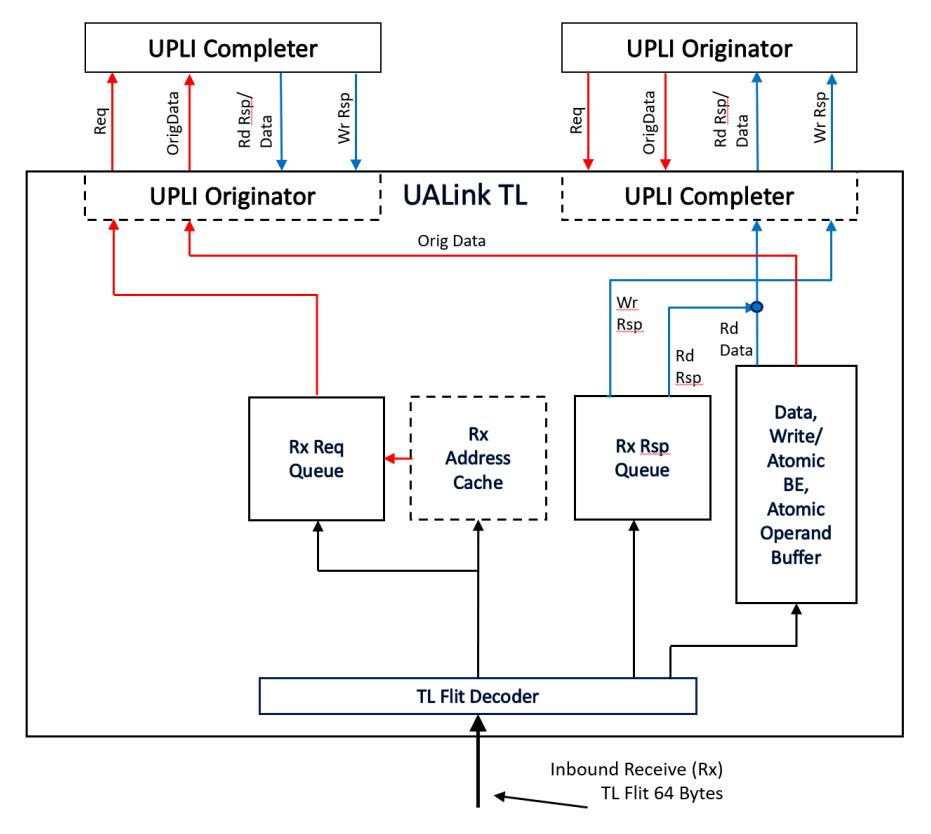

**Figure 5-3: UALink TL Rx Dataflow**

The Inbound TL Rx Flit interface is first processed by a TL Flit Decoder which decodes the Flit into Read Response and Write Data, Write and Atomic Byte Enables, Atomic Operand Data, Requests, and Responses. The Requests (and their Authorization Tags if present) are passed to the Rx

*Transaction Layer (TL)* 118

Address Cache and Request (Req) Queue for processing. If the Request is an uncompressed Request the Request is placed directly into the Req Queue and if the uncompressed Request is marked to load the Rx Cache for future accesses, the appropriate Rx Address Cache Entry is loaded and validated. If the Request is a compressed request, the Rx Address Cache provides the untransmitted address bits which are loaded with the Request into the Req Queue. The Read Responses (not Data) and the Write Responses are placed in a Response (Rsp) Queue. The Read Response and WriteData and Atomic Operand Data are loaded into 64-byte buffers holding two TL Half-Flits (the Atomic Operand Data only occupies half of the 64-byte buffer). The Write and Atomic Byte Enables are held in a set of parallel 8-byte buffers per 64-byte data buffer (in the limit, all the data could be for 64-byte Writes that each need byte enables).

Requests are loaded into the Request queue in the order they are received from the TL Flit Decoder. The Requests are unloaded from the Rx Request Queue onto the UPLI Request interface according to the current UPLI Ordering mode (either strictly in order or in at least 256-byte region order). The Responses are unloaded into the Rx Rsp Queue and then onto the appropriate Read or Write Response interface in any order (the Read Response and Write Data as well as Write and Atomic Byte Enables and Atomic Operand Data are unloaded as needed with their corresponding Requests or Responses).

The Tx and Rx Address Caches shall conform to the following characteristics which allow for four concurrently active streams between any two Accelerators:

- The caches are up to (and are typically) 4-way set associative.
- The caches control up to 1024 congruence classes (cache rows), one per supported Accelerator. The caches on a Switch shall be sized to match the maximum number of ports the Switch may accommodate (the maximum number of ports a switch may accommodate sets the limit on the maximum number of Accelerators in the Pod). The caches on an Accelerator shall be sized to accommodate the maximum number of Accelerators expected in the Pod in which the Accelerator may occur.
- The caches can process at least one lookup or update of a cache entry per cycle. The lookup result is available an implementation defined fixed number of cycles later. The result of an update is available to a subsequent lookup a defined fixed number of cycles later (that may be different than the cache read latency).
- The Tx and Rx caches are indexed by the SRCACCID and DSTACCID field values in the UPLI Request Channel.
- The indexing of a given Tx cache/Rx cache pair is controlled by the Tx cache.
- Address Caches must meet resiliency requirements (Bit Error Rate) of the product. Any errors detected shall initiate a link down and/or Drop Mode for the TL containing the Address Cache.

The figure below, [Figure 5-4: Indexing of Accelerator Tx Address Caches/Switch Rx Address Caches](#page-119-1) , illustrates the indexing of the Accelerator Tx Address Caches and Switch Rx Address Caches:

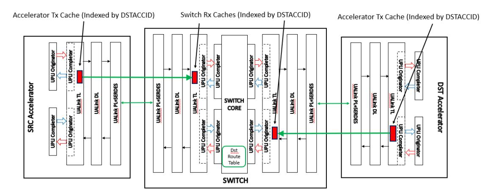

**Figure 5-4: Indexing of Accelerator Tx Address Caches/Switch Rx Address Caches**

All Requests issued by a given Accelerator will have only one value for the ReqSrcPhysAccID[9:0] signal: the identifier of the given Accelerator. This renders the ReqSrcPhysAccID field unsuitable to index the Accelerator Tx Address Cache. Instead, the Tx Address Caches on the Accelerators (and therefore the Rx Address Caches on the Switch) shall be indexed by the ReqDstPhysAccID[9:0] signal value in the UPLI Reqest Interface in order to fully populate the caches.

**Figure 5-5: Indexing of Switch Tx Address Caches/Accelerator Rx Address Caches**

The figure above[, Figure 5-5: Indexing of Switch Tx Address Caches/Accelerator Rx Address Caches](#page-119-2)  , illustrates the indexing of the Switch Tx Address Caches and Accelerator Rx Address Caches. The Requests issued by a Switch TL will have at most four values for ReqDstPhysAccID[9:0] – depending on bifurcation, for the up to four Accelerators attached to the given UALink TL instance. This renders the ReqDstPhysAccID signal unsuitable to index the Switch Tx Address Cache. Instead, the Tx Caches on the Switch (and therefore the Rx Caches on the Accelerators) shall be indexed by the ReqSrcPhysAccID[9:0] signal value in the UPLI Request Interface in order to fully populate the caches.

# **5.6 TL Tx and Rx Address Cache Synchronization.**

This section describes a set of rules in the TL Flit protocol that ensure that the Tx and Rx Address Caches remain synchronized.

# **5.6.1 CLOAD and CWAY control signals**

Uncompressed Requests have a 1-bit signal called CLOAD (or Cache Load) that indicates to the Rx Address Cache that the address in the Uncompressed Request shall be loaded into the Rx Cache (when CLOAD=1). An additional 2-bit signal CWAY (Cache Way) shall indicate what way in the Congruence Class (row) in the Rx Cache shall be loaded with the address.

The Congruence Class shall be selected by the SRCACCID[9:0] signal value (for Tx caches in the Switch and their corresponding Rx Address Caches in the Accelerators) or by the DSTACCID[9:0] signal value (for Tx caches in the Accelerators and their corresponding Rx Address Caches in the Switches) as explained above.

The CWAY signal value in an uncompressed Request shall only have meaning if the CLOAD signal is b'1'.

Compressed Requests also have a 2-bit CWAY signal that indicates the way in the Congruence Class indexed by SRCACCID[9:0] or DSTACCID[9:0] that should be utilized to reconstitute the rest of the address bits not transmitted in a Compressed Request.

As shown below in Table 5-23 [Address Cache Loading Request Availability](#page-120-2) , a Request that loads the RX Address Cache shall be available to all subsequent Compressed Requests even in the same Control Half-Flit (i.e. Req0's loaded value of the cache must be available to Compressed Requests Req1/Req2/Req3) until that entry is overwritten in the Address Rx Cache. This does not mean the address cache itself must immediately hit on a write as described below with respect to the optional Address CAM logic in Figure 5-6 [TL Receive Catch Buffer Dataflow.](#page-123-0)

|      |                                                                                                    |                                          |  |  |               |  |  | 64-byte TL Flit |     |     |     |     |     |     |                           |
|------|----------------------------------------------------------------------------------------------------|------------------------------------------|--|--|---------------|--|--|-----------------|-----|-----|-----|-----|-----|-----|---------------------------|
|      |                                                                                                    | Upper TL Half-Flit Lower TL Half-Flit |  |  |               |  |  |                 |     |     |     |     |     |     |                           |
|      | 15 14 13 12 11 10 9 8 7 6 5 4 3 2 1 0                 |                                          |  |  |               |  |  |                 |     |     |     |     |     |     |                           |
| Flit |                                                                                                    |                                          |  |  |               |  |  |                 |     |     |     |     |     |     |                           |
| 0    | Compressed Compressed Req0(Read A) MANDATORY NOP Req2 (Rd A) Req1 (Rd A) CLOAD=1 |                                          |  |  |               |  |  |                 |     |     |     |     |     |     |                           |
| 1    |                                                                                                    |                                          |  |  | MANDATORY NOP |  |  |                 | NOP | NOP | NOP | NOP | NOP | NOP | Compressed Req3 (Rd A) |

**Table 5-23 Address Cache Loading Request Availability**

# **5.6.2 Address Cache sequencing at the Tx Address Cache and Rx Address Cache**

The Tx and Rx Address Caches shall follow a set of rules to ensure the Address Caches are properly synchronized:

- A TL Tx cache may always issue an Uncompressed Request (with CLOAD=0) regardless of whether the address of the Request is valid or invalid in the TL Tx cache.
- If a TL Tx cache issues an Uncompressed Request with CLOAD=1, the entry at the appropriate congruence class and way (CWAY) shall be loaded (or invalidated) in the Tx cache and not be overwritten by another Request before the Uncompressed Request is issued in the TL Tx Channel.
- A TL Tx may not issue a Compressed Request unless the address for that Request hits in the Tx cache and the matching entry in the Tx Cache will not be overwritten by another Request before the Compressed Request is issued in the TL Tx Channel.

- Requests are ordered within a Control Half-Flit from the low order byte to the high order byte.
- A Request is considered "issued" when it is placed in the Control Half-Flit in the position in which it will appear on the TL Tx Channel.
- The Rx cache shall update the entry specified by CWAY and SRCACCID[9:0] or DSTACCID[9:0] for any Uncompressed Request that has CLOAD=1.
- The results of a CLOAD = 1 Request that updates the TL Rx Cache shall be available to any subsequent matching Compressed Request within the TL Control Half-Flit or any later TL Control Half-Flit until that entry is overwritten in the TL Rx cache (this requires that writes to the Rx Address Cache are available in the next cycle or external Address CAM logic, as described above, provide the newly written value until the Address Cache can directly provide the written value).
- Once an entry is loaded into the TL Rx Cache, it may not be invalidated, but instead it may only be replaced by a subsequent CLOAD=1 Uncompressed Request.

# **5.7 TL Control Half-Flit Request/Response Field packing limits.**

This section describes TL Flit protocol rules that limit the number of Requests and Responses in the TL Control Half-Flits generated at the Transmit TL to prevent the Transmit TL from overrunning the Request/Response queuing structures in the Receive TL. In particular, the number of Requests and Responses the Transmit TL can issue in any given TL Flit shall be source rate limited to match the capacity of the Receive TL to absorb those Requests and Responses.

At the Transmit TL, Requests that can be issued in any Flit shall be limited to a maximum of four including outstanding Requests issued in the previous TL Flits that have not been retired plus any Requests to be issued in the current TL Flit. Requests shall be retired at the rate of one Request per TL Flit at the Receive TL. Therefore, in any given Flit, at least one Flit may be issued).

Responses shall be similarly rate limited with a limit of eight including outstanding Responses issued in the previous TL Flits that have not been retired plus any Responses to be issued in the current TL Flit. Responses shall be retired at a rate of one Response per TL Flit at the Receive TL. Therefore, in any given Flit, at least one Flit may be issued.

For example, as shown below in Table 5-24 [Request Packing without Data Half-Flits,](#page-122-0) if four Requests are legally issued in a given TL Flit, at most one Request may be issued in the following TL Flit. One of the four Requests issued in the first TL Flit will have been retired when the second TL Flit arrives at the Receiver TL. Similarly, a third TL Flit in such a sequence could again issue one Request. For any TL Flit that does not issue a Request, the number of allowable Requests increases by one Request (up to a maximum of four). The "Req Cnt" column below indicates the maximum allowable number of Requests that may be issued in that TL Flit:

|      |    |                                                                        |    |    |               |    |   | 64-byte TL Flit |     |                    |           |           |            |           |     |           |   |
|------|----|------------------------------------------------------------------------|----|----|---------------|----|---|-----------------|-----|--------------------|-----------|-----------|------------|-----------|-----|-----------|---|
|      |    | Upper TL Half-Flit                                                     |    |    |               |    |   |                 |     | Lower TL Half-Flit |           |           |            |           |     |           |   |
|      | 15 | 14                                                                     | 13 | 12 | 11            | 10 | 9 | 8               | 7   | 6                  | 5         | 4         | 3          | 2         | 1   | 0         |   |
| Flit |    |                                                                        |    |    |               |    |   |                 |     |                    |           |           | Req Cnt |           |     |           |   |
| 0    |    | MANDATORY NOP 4 Req3 (Rd) Req2 (Rd) Req1 (Rd) Req0 (Rd) |    |    |               |    |   |                 |     |                    |           |           |            |           |     |           |   |
| 1    |    |                                                                        |    |    | MANDATORY NOP |    |   |                 | NOP | NOP                |           | Req4 (Rd) | NOP        | NOP       | NOP | NOP       | 1 |
| 2    |    |                                                                        |    |    | MANDATORY NOP |    |   |                 | NOP | NOP                | NOP       | NOP       | NOP        | NOP       |     | Req5 (Rd) | 1 |
| 3    |    |                                                                        |    |    | MANDATORY NOP |    |   |                 | NOP | NOP                | NOP       | NOP       | NOP        | NOP       | NOP | NOP       | 1 |
| 4    |    |                                                                        |    |    | MANDATORY NOP |    |   |                 |     |                    | Req7 (Rd) |           |            | Req6 (Rd) | NOP | NOP       | 2 |
| 5    |    |                                                                        |    |    | MANDATORY NOP |    |   |                 |     |                    | Req8 (Rd) |           | NOP        | NOP       | NOP | NOP       | 1 |

**Table 5-24 Request Packing without Data Half-Flits**

The following table, Table 5-25 [Request Pacing with Data Half-Flits,](#page-122-1) illustrates the behavior of the allowable number of Requests in a given TL Flit when data tenures are present. The Control Half-Flit consists of two 64-byte WriteFull Requests (Req0/Req1) followed by two 64-byte Write Requests (which each need ByteEnables). Even in this extreme case of only 64 bytes being transferred per Requests, the Data Half-Flits necessary to transfer the 64 bytes provide time for the Receiver TL to retire the Requests and be able to receive fully populated Control Half-Flits on the next Control Half-Flit (the Read Example above does not directly illustrate this pattern because the Read Data Responses occur later in time, but in the aggregate, each Request Requires at least 64 bytes of Data which requires one TL Flit which allows for the Receive TL to retire the Request). With larger transfer sizes (128 to 256 Bytes) per request, the Control Half-Flits are naturally spaced out farther allowing the Receive TL more than adequate time to unpack Control Half-Flits.

|      |    |                    |    |    |                  |    |   |   | 64-byte TL Flit |                    |            |             |     |      |     |      |   |
|------|----|--------------------|----|----|------------------|----|---|---|-----------------|--------------------|------------|-------------|-----|------|-----|------|---|
|      |    | Upper TL Half-Flit |    |    |                  |    |   |   |                 | Lower TL Half-Flit |            |             |     |      |     |      |   |
|      | 15 | 14                 | 13 | 12 | 11               | 10 | 9 | 8 | 7               | 6                  | 5          | 4           | 3   | 2    | 1   | 0    |   |
| Flit |    |                    |    |    |                  |    |   |   |                 |                    | Req Cnt |             |     |      |     |      |   |
| 0    |    | Req0.Data.0        |    |    |                  |    |   |   | Req3            |                    | Req2       |             |     | Req1 |     | Req0 | 4 |
| 1    |    |                    |    |    | Req1.Data.0      |    |   |   |                 |                    |            | Req0.Data.1 |     |      |     |      | 1 |
| 2    |    |                    |    |    | Req2.Data.0      |    |   |   |                 |                    |            | Req1.Data.1 |     |      |     |      | 2 |
| 3    |    |                    |    |    | Req2.ByteEnalbes |    |   |   |                 |                    |            | Req2.Data.1 |     |      |     |      | 3 |
| 4    |    |                    |    |    | Req3.Data.1      |    |   |   |                 |                    |            | Req3.Data.0 |     |      |     |      | 4 |
| 5    |    |                    |    |    | Req3.ByteEnables |    |   |   | NOP             | NOP                | NOP        | NOP         | NOP | NOP  | NOP | NOP  | 4 |

**Table 5-25 Request Pacing with Data Half-Flits**

The source rate limitations for Responses shall follow the same behavior as described above for Requests with the exception that the maximum allowable number of Responses is eight instead of fourC.

The following figure, Figure 5-6 [TL Receive Catch Buffer Dataflow,](#page-123-0) provides a more detailed schematic representation of the "catch buffers" for processing Inbound Receive (Rx) TL Flits in the Receive TL.

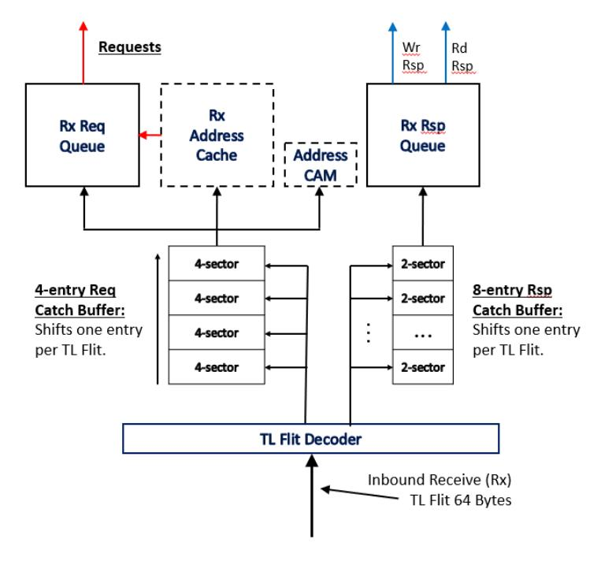

**Figure 5-6 TL Receive Catch Buffer Dataflow**

The TL Flit Decoder processes the non-NOP Control Half-Flit to produce an ordered list of the Responses and Requests that are present. The Catch Buffers shift one entry into the Rx Req and Rx Rsp Queues per incoming TL Flit.

The Requests are loaded in order into the Request Catch Buffer starting at the first non-empty entry in the buffer (accounting for the buffer shift per TL Flit) and Responses are similarly loaded into the Response Catch Buffer. Each entry in the catch buffer is sized to accommodate the largest Request or Response to allow for the case where the given Catch Buffer is full, but a series of TL Flits containing maximum sized Requests or Responses (or both) occur. This will fill the Catch Buffer with maximum sized entries.

The Address CAM is an optional address pipeline of the last "n" addresses that have been entered into the Rx Address Cache but are not yet available to a subsequent read of the Rx Address Cache (if the value written to the cache can be read in the cycle immediately after the write, the Address CAM is not necessary). Reads of the address cache preferentially take the value from the Address CAM. As writes become available from the Rx Address Cache, they fall out of the Address CAM, if implemented.

The Transmitter TL source rate limitations allow a TL Control Half-Flit to be fully populated with either the maximum number of Requests (four) or Responses (eight) provided there are no outstanding Requests or Responses, respectively. The source rate limitations shall be independent of the limitations placed on the Transmitter TL by Flow Credits (described in [5.8\)](#page-125-0). The source rate limitations prevent the Transmitter TL from overrunning the catch buffers in the Receiver TL. The Flow Control limitations prevent the Transmitter TL from overrunning the Req/Rsp/Data queues that are after the catch buffers in the Receiver TL.

A one-sector Flow Control Field (described in more detail below in [5.9.6\)](#page-136-0) in a Control Half-Flit contains indications for 4 classes of Credits and each class of Credit may independently return Credits for a given one of four Virtual Channel or a Pool Credit (usable for a transfer for any Virtual Credit). A TL Control Half-Flit may be fully populated with up to eight Flow Control Fields. A Receiving TL shall process all Credit counter updates at the rate of the incoming TL Flits (i.e. all updates for a given TL Flit shall be processed in a manner that places no restrictions on the number of Flow Control Fields in the next TL Flit).

To facilitate this per TL-Flit processing rate, no more than one of the Credit Class indications across all the Flow Control Fields present in a given Control Half-Flit may have a non-zero value for a given Virtual Channel or Pool. This allows the Credit Class values for all Flow Control Fields to be OR reduced into a set of Pool and Virtual Channel update values per Credit Class which can then be applied simultaneously to the Credit counters (i.e. the Flow Control Fields have no catch buffer structures like the Requests and Responses).

# **5.8 TL Flow Control**

The Flow Control between UALink TLs shall be managed by means of Credits for the Request and Response Fields in TL Control Half-Flits, and Credits for pairs of TL Data Half-Flits carrying data (Read Response Data, Write Data, and Atomic Operands). Byte Enables for Writes, while delivered in a TL Data Half-Flit, are presumed to be held in dedicated side buffers associated with either the data or the Request and therefore do not require separate Credits. A Data Credit shall reserve a 64 byte data Buffer.

A Credit is either a Pool Credit that can be used with a Request, Response, or Data on any Virtual Channel or a Virtual Channel Credit that shall only be used with a Request, Response, or Data specifically associated with one of the four Virtual Channels.

**Figure 5-7: Flow Control Field Relation to Credit Channels.**

The Figure above, [Figure 5-7: Flow Control Field Relation to Credit Channels.,](#page-125-1) illustrates the relationship between a Flow Control Field received on the Inbound Receive (Rx) TL Flit Channel and the information on the outgoing UPLI Channels this Flow Control Field manages.

The Flow Control Field consists of signals for four classes of Credits: Request CMD, Response CMD, Request Data, Response Data as shown in the following table:

|               | Flow Control Field Signals                                                                                                                                                                                                                                                                                                                    |
|---------------|-----------------------------------------------------------------------------------------------------------------------------------------------------------------------------------------------------------------------------------------------------------------------------------------------------------------------------------------------|
| Request CMD   | Credits for Uncompressed or Compressed Requests in TL Control Half Flits.                                                                                                                                                                                                                                                                  |
| Response CMD  | Credits for Uncompressed or Compressed Read Reponses (not the Data for the Read Responses) or Uncompressed or Compressed Write Responses in the TL Control Half-Flits.                                                                                                                                                                  |
| Request Data  | Credits for 64-byte data buffers used to hold data for Write and WriteFull Requests, Operand Data for AtomicR/AtomicNR Requests, Vendor Defined Commands with Data, andUPLI Write Message Requests. Byte Enables are held in dedicated buffers associated with the Data or Request and therefore do not require explicit Credits. |
| Response Data | Credits for 64-byte data buffers used to hold data for Read Responses (which have no associated Byte Enables).                                                                                                                                                                                                                             |

**Table 5-26: Flow Control Field Signals**

To allow for the worst case Write Example (se[e 5.4.4\)](#page-110-0) a single Flow Control Field must be able to return at least 20 Data Credits each and 5 CMD Credits each. Therefore, the Flow Control Field signals returning the Request Data Credits and Response Data Credits are 8 bits each (5 bit to allow returning 20 credits, 2 bits to identify the virtual channel, and 1 bit to identify if these are Pool Credits or Virtual Channel Credits). The Flow Control Field signals returning the Request CMD and Response CMD Credits are 6 bits each (3 bits to return 5 credits, 2 bits to indicate the virtual channel, and 1 bit to identify if these are Pool Credits or Virtual Channel Credits). All four signals together consume 28 bits (the upper 4 bits of the Field are used to indicate the Field Type – FTYPE, explained below), filling the 32-bit single Sector Flow Control Field.

In summary, a single Flow Control Field can return up to 31 Credits for each of the Request Data Credits and Response Data Credits and up to 7 Credits for each of the Request CMD Credits and Response CMD Credits and each of these signals may independently choose to indicate Pool or Virtual Channel Credits.

At initialization, both UALink TLs connected together through DL and PHY blocks shall be programmed by an implementation specific means with the number of Credits and their types (Pool or Virtual Credit) for the Requests, Responses, and Data that the Rx portion of that TL can hold. Both UALink TLs shall have no Credits to issue TL Control Half-Flit Fields or Data Half-Flits. Each UALink TL shall issue one or more Flow Control Fields on their Outbound Transmit (Tx) Flit Channel to indicate the available buffering that the issuing TL has to receive Control Half-Flit Fields and Data Half-Flits for each class (Request CMD, Response CMD, Request Data, Response Data) of TL Credits. The receiving TL shall record the number of Credits, their class, virtual channel if necessary, and type (Pool or Virtual Channel). When the initial issuance of the Credits has been completed, an Initial Credit Release Complete TL Message Half-Flit indicating that the initial Credit release is complete shall be issued by the TL.

The set of Credits issued for each class may be Pool Credits, Virtual Channel Credits, or a combination of Pool and Virtual Channel Credits. A Pool Credit may be used to issue a Request, Response, or data associated with any Virtual Channel according to an allocation of pool credits to Virtual Channels controlled by the transmitting TL. The transmitting TL may vary the allocation of Pool Credits to Virtual Channels over time but shall never have more Pool Credits outstanding than

were initially issued. A Virtual Channel Credit shall be used to issue a Request, Response, or data only for the Virtual Channel associated with the Credit.

Once the initial Credits are completely issued, the TL may start issuing Requests, Responses, or Data. Each Request or Response has a "Pool" signal that indicates, when set to b'1', that the Request or Response was issued using a Pool Credit and when set to b'0' and indicates a Virtual Channel Credit associated with the Virtual Channel (VCHAN) field in that Request or Response when set to b'1'. The TL Receiving the Request or the Response shall record the value of the Virtual Channel and Pool signals on the Request or Response and shall use those values to form the values in the Flow Control Field to return the Credit back to the originator of the Request or Response.

The Data Credits for any Data or Atomic Operand Data shall inherit the Pool and Virtual Channel values from their associated Request or Rd Response. The Virtual Channel and Pool values are not indicated directly in the Data Half-Flits.

The UALink TL may optionally support a Shared Data Buffer mode. In Shared Data Buffer mode, the Pool Credits for the Request Data and Response Data buffers may be shared. In other words, the Pool Credits initially issued for Request Data may be used to issue TL Data Half-Flits for Response Data and vice-versa. In Shared Data Buffer mode, the initial issuance of the Data Credits may be all for one class (Request Data or Response Data) or the other (or Credits may be released in both classes). The TL issuing Credits indicates to the TL receiving the Credits whether Shared Data Buffer mode is supported or not by an indication in the Initial Credit Release Complete TL Message Half-Flit. The low-order bit of the 31-byte Message Specific Payload for the TL message shall be a flag indicating that Shared Data Buffer mode is supported when the bit is set to b'1' and not supported when the bit is set to b'0'. The transmit side of a TL shall accommodate being issued zero credits for one class of Data Credits or another if the Shared Data Buffer mode is enabled. If Shared Data Buffer mode is not enabled, the TL initially issuing Credits shall issue at least some credits for both classes of Data Credits.

The Flow Control Field that returns zero pool credits for all 4 classes of Credits has a value of x'0000\_0000' and is the NOP Field.

# **5.9 TL Control Field Bit Assignments and Legal TL Message Flit Types**

The Fields within a TL Control Half-Flit may be any of the following Field Types:

| • | Uncompressed Requests                            | 4 sectors  |
|---|--------------------------------------------------|------------|
| • | Uncompressed Responses                           | 2 sectors. |
| • | Compressed Request                               | 2 sectors  |
| • | Compressed Response for Single-Beat Read         | 1 sector   |
| • | Compressed Response for Write or Multi-Beat Read | 1 sector   |
| • | Flow Control/NOP Indication                      | 1 sector   |

The high-order 4 bits (providing for 16 possible Field Types) of a field indicate the Field Type and implicitly the number of sectors contained within the Field.

The following table lists the legal values for the Field Type high-order 4 bit of the Control Field:

|       | TL Control Half-Flit Field legal Field Type Encodings (upper 4 bits of Control Field). |
|-------|----------------------------------------------------------------------------------------|
| Value | Message Type                                                                           |
| 0x0   | Flow Control Pool/NOP Indication.                                                      |
| 0x1   | Uncompressed Request                                                                   |
| 0x2   | Uncompressed Response                                                                  |
| 0x3   | Compressed Request                                                                     |
| 0x4   | Compressed Response for Single-Beat Read Response                                      |
| 0x5   | Compressed Response for Write or Multi-Beat Read Response                              |

**Table 5-27: TL Control Half-Flit Message Type Values**

The following table lists the legal TL Message Half-Flits:

| Defined TL Message Half-Flits |                                                       |  |  |
|-------------------------------|-------------------------------------------------------|--|--|
| Value                         | Message Type                                          |  |  |
| 0x00                          | NOP TL Message Half-Flit                              |  |  |
| 0x20                          | Poisoned Data TL Message Half-Flit                    |  |  |
| 0x01                          | Initial Credit Release Complete TL Message Half-Flit. |  |  |

**Table 5-28: Legal TL Message Half-Flits**

# **5.9.1 Uncompressed Request Field**

An uncompressed Request can be used to indicate any of the legal UPLI Requests without conditions (Compressed Requests can be utilized for only a subset of the legal UPLI Requests). An Uncompressed Requests consists of 4 sectors.

**Table 5-29 Uncompressed Request Field Signals**

| Uncompressed Request Field (FTYPE = 0x01) signals |                |           |                                                                                                                                                                                                                                                                                                                                                                                                      |
|---------------------------------------------------|----------------|-----------|------------------------------------------------------------------------------------------------------------------------------------------------------------------------------------------------------------------------------------------------------------------------------------------------------------------------------------------------------------------------------------------------------|
| Name                                              | Size (bits) | Position  | Description                                                                                                                                                                                                                                                                                                                                                                                          |
| FTYPE                                             | 4              | [127:124] | Field Type. This signal, with a value of 0x01, indicates the Field is an Uncompressed Request Field.                                                                                                                                                                                                                                                                                              |
| CMD                                               | 6              | [123:118] | Command. This signal carries the UPLI ReqCmd signal value for this Request.                                                                                                                                                                                                                                                                                                                       |
| VCHAN                                             | 2              | [117:116] | Virtual Channel. This signal carries the UPLI ReqVC signal value for this Request.                                                                                                                                                                                                                                                                                                                |
| ASI                                               | 2              | [115:114] | Address Space Identifier. This signal carries the UPLI ReqASI signal value for this Request.                                                                                                                                                                                                                                                                                                      |
| TAG                                               | 11             | [113:103] | Tag. This signal carries the UPLI ReqTag signal value for this Request.                                                                                                                                                                                                                                                                                                                           |
| POOL                                              | 1              | [102]     | Pool. This signal indicates whether the TL is utilizing a Pool Credit to issue this Request or a Virtual Channel Credit. The value on this signal is independent of the ReqPool signal on the UPLI interface (TL Credit management is independent of UPLI Credit Management).                                                                                                            |
| ATTR                                              | 8              | [101:94]  | Attribute. This signal carries the UPLI ReqAttr signal for this Request.                                                                                                                                                                                                                                                                                                                          |
| LEN                                               | 6              | [93:88]   | Length. This signal carries the UPLI ReqLen signal value for this Request.                                                                                                                                                                                                                                                                                                                        |
| METADATA                                          | 8              | [87:80]   | Metadata. This signal carries the UPLI ReqMetadata signal value for this Request.                                                                                                                                                                                                                                                                                                                 |
| ADDR                                              | 55             | [79:25]   | Address. This signal carries the UPLI ReqAddr[56:2] signal value for this Request. This is a doubleword aligned address.                                                                                                                                                                                                                                                                       |
| SRCACCID                                          | 10             | [24:15]   | Source Accelerator ID. This signal carries the UPLI ReqSrcPhysAccID signal value for this Request.                                                                                                                                                                                                                                                                                                |
| DSTACCID                                          | 10             | [14:5]    | Destination Accelerator ID. This signal carries the UPLI ReqDstPhysAccId signal value for this Request.                                                                                                                                                                                                                                                                                           |
| CLOAD                                             | 1              | [4]       | Cache Load. This signal, when equal to '1', indicates that the Receiver TL should load ReqAddr[56:20] (ADDR[54:18]) into the Rx Address Cache at the way indicated by CWAY and at the row indicated by either SRCACCID[9:0] (for Rx Caches on Accelerators) or DSTACCID[9:0] (for Rx Address Caches on Switches). When this signal equals '0', the Rx Address Cache is not loaded. |
| CWAY                                              | 2              | [3:2]     | Cache Way. Designates which way of the Address Cache to load the UPLI signal ReqAddr[56:20] (ADDR[54:18]) into when CLOAD='1'. This signal is only valid when CLOAD='1'.                                                                                                                                                                                                                       |
| NUMBEATS                                          | 2              | [1:0]     | Number of Beats. This signal indicates the number of Data Beats that will be transferred for this Request if CMD[5] = b'1' either to transport Atomic Operands, Data for a Write or Write Full, on any Vendor Defined Commands.                                                                                                                                                             |
| TOTAL BITS:                                       | 128            | 4 Sectors |                                                                                                                                                                                                                                                                                                                                                                                                      |

# **5.9.2 Uncompressed Response Field**

An uncompressed Response can be used to indicate any of the legal UPLI Responses without conditions (Compressed Responses can only be utilized for a subset of the legal UPLI Responses). An Uncompressed Requests consists of 2 sectors.

**Table 5-30 Uncompressed Response Field Signals**

| Uncompressed Response Field (FTYPE = 0x2) signals |                |          |                                                                                                                                                                                                                                                                                                                                                                                                                                                                                                                                                                                                                                                                                                                                  |
|---------------------------------------------------|----------------|----------|----------------------------------------------------------------------------------------------------------------------------------------------------------------------------------------------------------------------------------------------------------------------------------------------------------------------------------------------------------------------------------------------------------------------------------------------------------------------------------------------------------------------------------------------------------------------------------------------------------------------------------------------------------------------------------------------------------------------------------|
| Name                                              | Size (bits) | Position | Description                                                                                                                                                                                                                                                                                                                                                                                                                                                                                                                                                                                                                                                                                                                      |
| FTYPE                                             | 4              | [63:60]  | Field Type. This signal, with a value of0x2, indicates the Field is an Uncompressed Response Field.                                                                                                                                                                                                                                                                                                                                                                                                                                                                                                                                                                                                                           |
| VCHAN                                             | 2              | [59:58]  | Virtual Channel. This field carries the UPLI RdRspVC or WrRspVC signal value (determined by the RD/WR signal value).                                                                                                                                                                                                                                                                                                                                                                                                                                                                                                                                                                                                       |
| TAG                                               | 11             | [57:47]  | Tag. This field carries the UPLI RdRspTag or WrRspTag signal value (determined by the RD/WR signal value).                                                                                                                                                                                                                                                                                                                                                                                                                                                                                                                                                                                                                    |
| POOL                                              | 1              | [46]     | Pool. This signal indicates whether the TL is utilizing a Pool Credit or a Virtual Channel Credit to issue this Response. The value on this signal is independent of the RdRspCreditPool or WrRspCreditVC signal on the UPLI interface (TL Credit management is independent of UPLI Credit Management).                                                                                                                                                                                                                                                                                                                                                                                                              |
| LEN                                               | 2              | [45:44]  | Length. This signal carries the value of the UPLI RdRspNumBeats signal for Multi-Beat Read Responses. The LEN field is only meaningful for Multi-Beat Read Responses. Single Beat Read Responses and all Write Responses are always one beat, the LEN field is not valid, and this field should be set to b'00'.                                                                                                                                                                                                                                                                                                                                                                                                  |
| OFFSET                                            | 2              | [43:42]  | Offset. This signal carries the value of the UPLI RdRspOffset signal for Single-Beat Read Responses. For Write Responses (no data is returned with a Write Response) and Multi-Beat Read Responses (the TL is responsible for recreating the RdRspOffset values in the burst transfer), this signal is not valid and should be set to b'00'.                                                                                                                                                                                                                                                                                                                                                                      |
| STATUS                                            | 4              | [41:38]  | Status. This signal carries the value of the UPLI RdRspStatus or WrRspStatus signals (determined by the RD/WR signal value).                                                                                                                                                                                                                                                                                                                                                                                                                                                                                                                                                                                               |
| RD/WR                                             | 1              | [37]     | Read/Write Indicator. This signal indicates whether the Response is a Read or a Write Response (note: AtomicNR Requests cause a Write Response, and AtomicR Requests cause a Read Response).                                                                                                                                                                                                                                                                                                                                                                                                                                                                                                                            |
| LAST                                              | 1              | [36]     | Last. This signal carries the value of the UPLI RdRspLast signal. This signal is valid only for Read Responses and should be set to b'0' for Write Responses.                                                                                                                                                                                                                                                                                                                                                                                                                                                                                                                                                              |
| SRCACCID                                          | 10             | [35:26]  | Source Accelerator ID. This field carries the UPLI RdRspSrcPhysAccID or WrRspSrcPhysAccID signal value for this Response depending on whether the Response is for a Read, Write/WriteFull, or an Atomic/AtomicNR Request (identified by the TAG value for this Response). (Note: the SRCACCID signal value, if carried, on the Response is equal to the DSTACCID signal value on the corresponding Request). The SRCACCID value is not required functionally but is useful for debug. Implementations may choose to not carry the SRCACCID value through the TL and/or Switch. When the signal does not contain an accurate value, it should be drive to zero on corresponding UPLI interfaces. |
| DSTACCID                                          | 10             | [25:16]  | Destination Accelerator ID. This field carries the UPLI RdRspDstPhysAccID or WrRspDstPhysAccID signal depending on whether the Response is for a Read, Write/WriteFull, or an AtomicR/AtomicNR (identified by the TAG value). (Note: the DSTACCID signal value on the Response is equal to the SRCACCID signal value on the corresponding Request). This signal is used to route the Response back to the Accelerator that originally sourced the Request.                                                                                                                                                                                                                                               |

| Uncompressed Response Field (FTYPE = 0x2) signals |                                 |           |                                                   |
|---------------------------------------------------|---------------------------------|-----------|---------------------------------------------------|
| Name                                              | Size Position Description |           |                                                   |
|                                                   | (bits)                          |           |                                                   |
| SPARE(S)                                          | 16                              | [15:0]    | Sixteen bits are unassigned in this field format. |
| TOTAL BITS:                                       | 64                              | 2 Sectors |                                                   |

# **5.9.3 Compressed Request Field**

A Compressed Request may be used for a specific subset of UPLI Requests. If the Request is not in this specific subset (see Table 5-33 [Compressed Request Command Encoding](#page-133-1) below), an Uncompressed Request shall be used. To issue a compressed Request, the Request shall hit in the Tx Address Cache and the entry that hit shall not be removed or invalidated before the Request is issued to the Tx TL Flit Channel. A Compressed Request is 2 sectors as opposed to the 4 sectors for an Uncompressed Request. This is achieved by encoding the UPLI ReqCmd signal (by only supporting a subset of the Commands) and ReqLen signal (by insisting that the address of the Request is aligned on a 64 byte boundary and the request is a multiple of 64 bytes in length, and does not cross a 256 byte boundary) into smaller signals and omitting the ReqAttr, ReqAddr[56:20], and ReqMetaData[7:3] signals. The TL shall not be required to issue a Compressed Request and may choose to issue an Uncompressed Request even if conditions would otherwise have permitted the issuance of a Compressed Request.

**Table 5-31 Compressed Request Field Signals**

| Compressed Request Field (FTYPE = 0x3) signals |                |           |                                                                                                                                                                                                                                                                                                            |
|------------------------------------------------|----------------|-----------|------------------------------------------------------------------------------------------------------------------------------------------------------------------------------------------------------------------------------------------------------------------------------------------------------------|
| Name                                           | Size (bits) | Position  | Description                                                                                                                                                                                                                                                                                                |
| FTYPE                                          | 4              | [63:60]   | Field Type. This signal, with a value of 0x3, indicates the Field is a Compressed Request Field.                                                                                                                                                                                                        |
| CMD                                            | 3              | [59:57]   | Command. This signal carries a compressed version of the UPLI ReqCmd signal value for this Request. See Table 5-33 Compressed Request Command Encoding below for details.                                                                                                                            |
| VCHAN                                          | 2              | [56:55]   | Virtual Channel. This signal carries the UPLI ReqVC signal value for this Request.                                                                                                                                                                                                                      |
| ASI                                            | 2              | [54:53]   | Address Space Identifier. This signal carries the UPLI ReqASI signal value for this Request.                                                                                                                                                                                                            |
| TAG                                            | 11             | [52:42]   | Tag. This signal carries the UPLI ReqTag signal value for this Request.                                                                                                                                                                                                                                 |
| POOL                                           | 1              | [41]      | Pool. This signal indicates whether the TL is utilizing a Pool Credit to issue this Request or a Virtual Channel Credit. The value on this signal is independent of the ReqPool signal on the UPLI interface (TL Credit management is independent of UPLI Credit Management).                  |
| LEN                                            | 2              | [40:39]   | Length. This signal carries a compressed version of the UPLI ReqLen signal value for this Request. A value of '0' indicates a 64-byte transfer, a value of '1' indicates a 128- byte transfer, a value of '2' indicates a 192 byte transfer, and a value of '3' indicates a 256 byte transfer. |
| METADATA                                       | 3              | [38:36]   | Metadata. This signal carries the UPLI signal ReqMetaData[2:0]. The remaining bits of Metadata are not carried and must have a value of b'00000'.                                                                                                                                                    |
| ADDR                                           | 14             | [35:22]   | Address. This signal carries the UPLI ReqAddr[19:6] signal value indicating the aligned 64-byte block within the previously cached 1MB region for this Request that is being addressed. UPLI signal ReqAddr[56:20] are reconstituted from the Rx Address Cache.                                |
| SRCACCID                                       | 10             | [21:12]   | Source Accelerator ID. This field carries the UPLI ReqSrcPhysAccID signal value for this Request.                                                                                                                                                                                                       |
| DSTACCID                                       | 10             | [11:2]    | Destination Accelerator ID. This field carries the UPLI ReqDstPhysAccId signal value for this Request.                                                                                                                                                                                                  |
| CWAY                                           | 2              | [1:0]     | Cache Way. Designates which way of the Address Cache to use to reconstitute UPLI signal ReqAddr[56:20] for this Request.                                                                                                                                                                             |
| TOTAL BITS:                                    | 64             | 2 Sectors |                                                                                                                                                                                                                                                                                                            |

The following table lists the set of conditions that shall be met in order to issue a Compressed Request:

**Table 5-32 Compressed Request Usage Restrictions.**

|               | Compressed Request Useage Restrictions                                                                                                                                                                     |
|---------------|------------------------------------------------------------------------------------------------------------------------------------------------------------------------------------------------------------|
| CMD           | The command requested shall be compressible (i.e. must be one of the command types listed in the table)                                                                                              |
| ATTR          | Reads: The UPLI ReqAttr field shall have a value 0xFF (i.e. all bytes are enabled). Writes: The ReqAttr field shall have a value of 0x00. Atomics are not supported in Compressed Requests. |
| LEN           | The access must be 64, 128, 192, or 256 bytes.                                                                                                                                                          |
| ADDR          | The address of the Request must be on a 64 byte alignment and the transfer must not cross a 256 byte boundary.                                                                                       |
| METADATA      | ReqMetadata[7:2] shall be b'000000'.                                                                                                                                                                       |
| Address Cache | The Address of the Request shall hit in the Address Cache and the entry in the Address Cache shall not be overwritten (or invalidated) before the Compressed Request is issued.                |

The following table lists the encodings and legal Commands for the Compressed Request CMD signal. Commands outside of those listed below shall not be supported in Compressed Requests (including Vender Defined Commands which are never Compressed).

**Table 5-33 Compressed Request Command Encoding**

| Compressed Request Command Encoding |           |  |
|-------------------------------------|-----------|--|
| 000                                 | Read      |  |
| 001                                 | Reserved  |  |
| 010                                 | Reserved  |  |
| 011                                 | Reserved  |  |
| 100                                 | Write     |  |
| 101                                 | Reserved  |  |
| 110                                 | WriteFull |  |
| 111                                 | Reserved  |  |

# **5.9.4 Compressed Response Field for Single Beat Read Response**

The following table illustrates the signals within a Compressed Response for a Single Beat Read Response:

**Table 5-34 Compressed Response for Single Beat Read Field Signals**

|             | Compressed Response Field (FTYPE = 0x4) signals |          |                                                                                                                                                                                                                                                                                                                                     |  |
|-------------|-------------------------------------------------|----------|-------------------------------------------------------------------------------------------------------------------------------------------------------------------------------------------------------------------------------------------------------------------------------------------------------------------------------------|--|
| Name        | Size (bits)                                  | Position | Description                                                                                                                                                                                                                                                                                                                         |  |
| FTYPE       | 4                                               | [31:28]  | Field Type. This signal, with a value of 0x4, indicates the Field is a Compressed Response for a Single Beat Read Response.                                                                                                                                                                                                   |  |
| VCHAN       | 2                                               | [27:26]  | Virtual Channel. This signal carries the UPLI RdRspVC signal value.                                                                                                                                                                                                                                                              |  |
| TAG         | 11                                              | [25:15]  | Tag. This signal carries the UPLI RdRspTag signal value.                                                                                                                                                                                                                                                                            |  |
| POOL        | 1                                               | [14]     | Pool. This signal indicates whether the TL is utilizing a Pool Credit or a Virtual Channel Credit to issue this Response. The value on this signal is independent of the RdRspCreditPool or WrRspCreditVC signal on the UPLI interface (TL Credit management is independent of UPLI Credit Management).              |  |
| DSTACCID    | 10                                              | [13:4]   | Destination Accelerator ID. This signal carries the UPLI RdRspDstPhysAccID signal value (Note: the DSTACCID signal value on the Response is equal to the SRCACCID signal value on the corresponding Request). This signal is used to route the Response back to the Accelerator that originally sourced the Request. |  |
| OFFSET      | 2                                               | [3:2]    | Offset. This signal carries the value of the UPLI RdRspOffset signal.                                                                                                                                                                                                                                                            |  |
| LAST        | 1                                               | [1]      | Last. This signal carries the value of the UPLI RdRspLast signal.                                                                                                                                                                                                                                                                |  |
| SPARE(S)    | 1                                               | [0]      | One bit is unassigned in this field format.                                                                                                                                                                                                                                                                                         |  |
| TOTAL BITS: | 32                                              | 1 Sector |                                                                                                                                                                                                                                                                                                                                     |  |

The TL shall not be required to issue a Compressed Response. Even if the conditions to issue a Compressed Response are met, the TL may issue an Uncompressed Response. The following table lists the set of conditions that shall be met to issue a Compressed Request for a Single-Beat Read Response:

**Table 5-35 Compressed Response for Single-Beat Read Response Usage Restrictions.**

| Compressed Response for Single-Beat Read Response Usage Restrictions |                                                                                                  |  |
|-------------------------------------------------------------------------|--------------------------------------------------------------------------------------------------|--|
| STATUS                                                                  | The STATUS field of the response must have a value of b'0000': "OKAY (Normal Completion)". |  |

# **5.9.5 Compressed Response Field for a Write or Multi-Beat Read Response**

The following table illustrates the signals within a Compressed Response for a Write Response or a Multi-Beat Read Response:

**Table 5-36 Compressed Response for Write or Multi-Beat Read Field Signals**

| Compressed Response Field (FTYPE = 0x5) signals Name | Size   | Position | Description                                                                                                                                                                                                                                                                                                                                              |
|---------------------------------------------------------|--------|----------|----------------------------------------------------------------------------------------------------------------------------------------------------------------------------------------------------------------------------------------------------------------------------------------------------------------------------------------------------------|
|                                                         | (bits) |          |                                                                                                                                                                                                                                                                                                                                                          |
| FTYPE                                                   | 4      | [31:28]  | Field Type. This signal, with a value of 0x5, indicates the Field is a Compressed Response for a Single Beat Read Response.                                                                                                                                                                                                                        |
| VCHAN                                                   | 2      | [27:26]  | Virtual Channel. This signal carries the UPLI RdRspVC or WrRspVC signal value.                                                                                                                                                                                                                                                                        |
| TAG                                                     | 11     | [25:15]  | Tag. This signal carries the UPLI RdRspTag or WrRspTag signal value.                                                                                                                                                                                                                                                                                  |
| POOL                                                    | 1      | [14]     | Pool. This signal indicates whether the TL is utilizing a Pool Credit or a Virtual Channel Credit to issue this Response. The value on this signal is independent of the RdRspCreditPool or WrRspCreditVC signal on the UPLI interface (TL Credit management is independent of UPLI Credit Management).                                   |
| DSTACCID                                                | 10     | [13:4]   | Destination Accelerator ID. This signal carries the UPLI RdRspDstPhysAccID or WrRspDstPhysAccID signal value (Note: the DSTACCID signal value on the Response is equal to the SRCACCID signal value on the corresponding Request). This signal is used to route the Response back to the Accelerator that originally sourced the Request. |
| LEN                                                     | 2      | [3:2]    | Length. This signal carries the values for the UPLI RdRspNumBeats signal for a Read Response and b'00' for a Write Response. This signal is only valid for a Read Response and indicates the number of contiguous 64-byte data beats to be returned.                                                                                         |
| RD/WR                                                   | 1      | [1]      | This signal indicates whether the Response is a Read Response or a Write Response (b'1' is a Read, b'0' is a Write)                                                                                                                                                                                                                                |
| SPARE(S)                                                | 1      | [0]      | One bit is unassigned in this field format.                                                                                                                                                                                                                                                                                                              |
| TOTAL BITS:                                             | 32     | 1 Sector |                                                                                                                                                                                                                                                                                                                                                          |

The TL shall not be required to issue a Compressed Response. Even if the conditions to issue a Compressed Response are met, the TL may issue an Uncompressed Response. The following table lists the set of conditions that shall be met to issue a Compressed Request for a Single-Beat Read Response:

**Table 5-37 Compressed Response for Write or Multi-Beat Read Response Usage Restrictions.**

| Compressed Response for Single-Beat Read Response Usage Restrictions |                                                                                                  |  |
|-------------------------------------------------------------------------|--------------------------------------------------------------------------------------------------|--|
| STATUS                                                                  | The STATUS field of the response must have a value of b'0000': "OKAY (Normal Completion)". |  |

# **5.9.6 Flow Control/NOP Field.**

The following table illustrates the signals within a Flow Control/NOP Field.

**Table 5-38 Flow Control/NOP Field**

| Name    | Size (bits) | Position | Description                                                                                                                                                                                                                                                                                                                                                                                                                               |
|---------|----------------|----------|-------------------------------------------------------------------------------------------------------------------------------------------------------------------------------------------------------------------------------------------------------------------------------------------------------------------------------------------------------------------------------------------------------------------------------------------|
| FTYPE   | 4              | [31:28]  | Field Type. This signal, with a value of 0, indicates the Field is a Flow Control/NOP field.                                                                                                                                                                                                                                                                                                                                           |
| ReqCmd  | 6              | [27:22]  | Request Cmd. Returns the Request Command Credits (i.e. Credits for Requests from the UPLI Request Channel). The field format is 'tvvccc' where 't' is a type field (0=pool, 1=VC) of the Credits, 'vv' is the Virtual Channel of the Credits (valid only if t = 1), and 'ccc' is the number of Credits being returned (0 to 7).                                                                                            |
| RspCmd  | 6              | [21:16]  | Response Cmd. Returns the Response Command Credits (i.e. Credits for Rd Responses (not data) and the Wr Responses from the Requests from the UPLI Rd Response/Data and Write Response Channels). The field format is 'tvvccc' where 't' is a type field (0=pool, 1=VC) of the Credits, 'vv' is the Virtual Channel of the Credits (valid only if t = 1), and 'ccc' is the number of Credits being returned (0 to 7). |
| ReqData | 8              | [15:8]   | Request Data. Returns the Request Data Credits (i.e. Credits for data from the UPLI OrigData Channel). The field format is 'tvvccccc' where 't' is a type field (0=pool, 1=VC) of the Credits, 'vv' is the Virtual Channel of the Credits (valid only if t = 1), and 'ccccc' is the number of Credits being returned (0 to 31).                                                                                            |
| RspData | 8              | [7:0]    | Response Data. Returns the Respopnse Data Credits (i.e. Credits for data from the UPLI Read Response/Data Channel). The field format is 'tvvccccc' where 't' is a type field (0=pool, 1=VC) of the Credits, 'vv' is the Virtual Channel of the Credits (valid only if t = 1), and 'ccccc' is the number of Credits being returned (0 to 31).                                                                               |

# **5.10 Recommended TL backoff modes.**

The following is a list of backoff modes that are recommended to be implemented in a UALink TL:

- A mode to limit the number of Uncompressed Requests that can be packed into a Control Half-Flit to be 1 (at most 2 Uncompressed Requests can be packed into a Control Half-Flit).
- A mode to limit the number of Compressed Requests that can be packed into a Control Half-Flit to be 1, 2, or 3 (at most 4 Compressed Requests can be packed into a Control Half-Flit).
- A mode to limit the number of Uncompressed Responses that can be packed into a Control Half-Flit to be 1, 2, or 3 (at most 4 Uncompressed Responses can be packed in a Control Half-Flit).
- A mode to control the number of Compressed Responses that can be packed into a Control Half-Flit to be 1, 2, 3, 4, 5, 6, or 7 (at most 8 Compressed Responses can be packed into a Control Half-Flit).
- A mode to control the number of Flow Control/NOP indications that can be packed into a Control Half-Flit to be 1, 2, 3, 4, 5, 6, or 7 (at most 8 Compressed Responses can be packed into a Control Half-Flit).

The above modes are only meant to limit the number of the type of item that may be packed into a Control Half-Flit. The allowed placements of the items within a Control Half-Flit are not affected.

- A mode to disable the TL Tx Address Cache.
- A mode to disable the TL Rx Address Cache.

# **6 Data Link**

# **6.1 Overview**

The Block diagram is shown below. The Data Link sits between the Transaction layer and the Physical Layer. The Data Link packs 64-byte Flits from the transaction layer into 640 Bytes Flits for the Physical Layer. The Data Link also provides a message service between link partners that originates and terminates at the Data Link layer. The message service is used for advertising the Transaction Layer rate, querying device and port ID on connected Link Partner, and other functions. The message service also provides for a UART style communication between link partners, intended for F/W communications. Link level replay is provided on a 640 Byte Flit basis. A 32-bit CRC is computed and checked and is part of the 640 Byte Flit.

> Physical Layer Data Link Transaction Layer Link Level Replay Flit Packing DL Message Service Tx Pacing/Rx rate adaptaion

**Figure 6-1 DL block Diagram** 

# **6.2 Data Link Features**

# **6.2.1 Packing Flits**

The main function of the Data Link in the egress direction is to pack 64-byte Flits from the Transaction Layer into 640-byte DL Flits and unpack 640-byte DL Flits into 64-byte Flits for the transaction layer in the ingress direction. DL messages are also packed into DL Flits.

# **6.2.2 DL message service**

In band DL to DL messages are supported via alternate segments that are packed into the 640-byte DL Flit payload, along with the TL Flits data. DL to DL messages provide support for the following:

- F/W message sequencing via UART
- Negotiating Channel online/offline.
  - o Channel 0 For TL Flits
  - o Channel 4 For DL UART messages
- Advertising transaction layer rates
- Requesting Link Partners Device ID and port number

# **6.2.3 UART**

The UART provides a communication path between firmware agents on both sides of a given link. Hardware driven credit-based flow control is provided across the link via DL messages to prevent Rx buffer overflow.

The initial use case for the UART is to enable vendor defined communication between link partners. Security may also make use of the UART. Future version may define additional standard-based communication.

Se[e Figure 6-2,](#page-140-1) Firmware writes to the UART Tx buffer, and the data is inserted into the DL Flit and transmitted to the link partner. The receiving DL removes the data from the DL Flit and places it in the UART Rx buffer. Firmware on the receiving side reads the data.

Figure 6-2 UART

## 6.2.4 Tx Pacing, Rx Rate Adaptation

Tx Pacing provides a mechanism for a link partner to limit the transmission rate of TL Flits from its link partner. This enables Accelerators to operate their UPLI Clock at lower than line rate and not overflow its Rx FIFO in the Rx rate adaption logic.

# **6.3 Flit Format**

# **6.3.1 DL Flit Overview**

The 640B Flit is comprised of five segments. Each segment is comprised of an integer number of sectors. A sector is 4 bytes. The number of sectors per segment varies based on header and CRC placement in the segment and is described below. The half segment allocation is also described and defines how far to zero fill when there is no TL Flit to pack, see [Figure 6-5.](#page-146-1)

| Segment Header | Number of payload Sectors | Number of payload bytes | Half Segment Sector ranges |
|-------------------|------------------------------------|-------------------------------|-------------------------------|
| SH0               | 32 Sectors                         | 128-bytes                     | [0:15], [16:31]               |
| SH1               | 32 Sectors                         | 128-bytes                     | [32:47], [48:63]              |
| SH2               | 32 Sectors                         | 128-bytes                     | [64:79],[80:95]               |
| SH3               | 31 Sectors                         | 124-bytes                     | [96:111],[112:126]            |
| SH4               | 30 Sectors                         | 120-bytes                     | [127:142],[143:156]           |

**Table 6-1 Sector Allocation per Segment**

The FH[2:0] fields contain the Flit Header information. This indicates the type of Flit, and sequence number to aid in link level replay, and other information. This is described in detail in sectio[n 6.3.2.](#page-142-0)

The segment header (SH) defines the starting content for that segment.

The 4-byte CRC is calculated over the entire contents of the DL Flit.

The diagram below describes the placement different non data fields of the DL Flit:

- FH[2:0] Flit header
- SH[4:0] segment headers
- CRC
- Segment payload

**Figure 6-3 DL 640-Byte Flit Overview**

# **6.3.2 Flit Header**

See sectio[n 6.6.2.](#page-165-0) 

# **6.3.3 Segment Header**

The segment header describes the TL Flit sequence that starts in the segment. Up to two 64-byte TL Flits are contained in a TL Flit sequence. The Segment payload may be less than the 128-bytes, and some segments may contain alternative sectors, therefore some of the TL Flit sequence will carry over into the next segment.

The segment header is 8 bits. The field encodings are shown below. TL Flit[0] and Message[0], indicate the presence of a TL Flit and message data associated with the first TL Flit that is packed into the segment, if present, se[e Figure 6-5.](#page-146-1) TL Flit[1] and Message[1] are associated with the second TL Flit if present.

| Field Name  | Position | Description                                                                                                    |
|-------------|----------|----------------------------------------------------------------------------------------------------------------|
| DLAltSector | [0]      | DL Alternative sector 0b-No alternative sector in segment 1b-DL alternative sector in segment            |
| Reserved    | [1]      | Reserved                                                                                                       |
| Message[0]  | [3:2]    | TL Flit[0] Message bit indicators if TL Flit[0] is not present then reserved else Message bit indicators |
| TL Flit[0]  | [4]      | TL Flit[0] present 0b - TL Flit[0] not present 1b - TL Flit[0] present                             |
| Message[1]  | [6:5]    | TL Flit[1] Message bit indicators if TL Flit[1] is not present then reserved else Message bit indicators |
| TL Flit[1]  | [7]      | TL Flit present 0b - TL[1] Flit not present 1b - TL[1] Flit present                                |

**Table 6-2 Segment Header**

### **6.3.3.1 DL Alternative Sector**

When the DLAltSector bit is set, this indicates that the segment contains an alternative sector. A sector is 4 bytes. The Alternative sectors are used for carrying DL-DL messages, see section [6.3.4.](#page-143-0) 

### **6.3.3.2 TL Flit Present**

When this bit is set it indicates that there is TL Flit that starts in this segment.

### **6.3.3.3 Message**

When there is TL Flit that starts in this segment, this field contains the 2-bit message bits with it, 1 bit for each ½ TL Flit. The message data is simply meta data that is carried transparently over the DL, with the associated TL Flit.

# **6.3.4 Flit packing rules**

The diagram below describes the DL Flit field locations including segment payload details. The Sx.By describes the sector number in the segment (Sx), and the byte number in the segment(By).

Figure 6-4 DL Flit with segment details

The following describe the Flit packing rules.

- The DL Flit packer operates on a sector basis, a sector is 4 bytes.
- DL Alternative sectors have priority, if an DL alternative sector is indicated then it is placed in the first sector of the segment, before the current TL Flit, or carry over from a previous TL Flit. The first sector is the lowest sector number in the segment see Table 6-1.
- A TL Flit takes up sixteen sectors (64-bytes).
- A DL message (Alternative sectors) takes up one sector (4-bytes).
- There shall be at least one unallocated sector in the segment to start adding a TL Flit.
- If a TL Flit does not pack into the current segment the remainder is carried over to the next segment.
- The SH is encoded as 0x00 when no TL Flits and no DL message start in the segment.
- TL Flits shall be packed in the order received.
- Up to 2 TL Flits start packing into a segment.

- TL Flits shall be packed on the fly to reduce transmitter latency, the first tick of the packer may not have a TL Flit[0] to pack, the remaining ½ segment is zero filled, the 2'nd tick of the packer may have a TL Flit[1] available, and that starts to pack, if sectors are available. See [Table 6-2](#page-143-1) for ½ segment definition.
- In the special case where the first ½ segment is filled with a previous TL Flit carry over and an alternative sector, and there is a TL Flit to add, it is designated TL Flit[0].
- Note: with a 512-bit (64-byte) data path, a DL Flit is packed every 10 clock ticks. DL overhead of 12 bytes (and occasional DL messages) is such that TL Flits cannot be continuously packed every 2 ticks. Other data widths are possible, the same packing behavior shall be met.

Packing flow described below (see [Figure 6-5\)](#page-146-1):

- 1. Start packing a segment.
- 2. If there is a DL ALT sector, it is placed in the first sector of the segment and continue.
- 3. If there is carry over from the previous Segment pack it in sector order and continue.
- 4. If TL Flit[0] is available, on this clock tick, then start packing it in sector order into the current segment and continue, else zero unallocated sectors to the end of the half segment and goto [\(6\)](#page-145-0).
- 5. If TL Flit[0] completes packing continue, else save remaining TL Flit[0] in carry over and done.
- 6. If there are unallocated sectors continue, else done.
- 7. If TL Flit[1] is available, on this clock tick, then start packing it in sector order into the current segment else zero remaining unallocated sectors and done.
- 8. If TL Flit[1] packing is completed then done, else save remaining TL Flit[1] in carry over and done.
- 9. goto [\(1\)](#page-145-1)

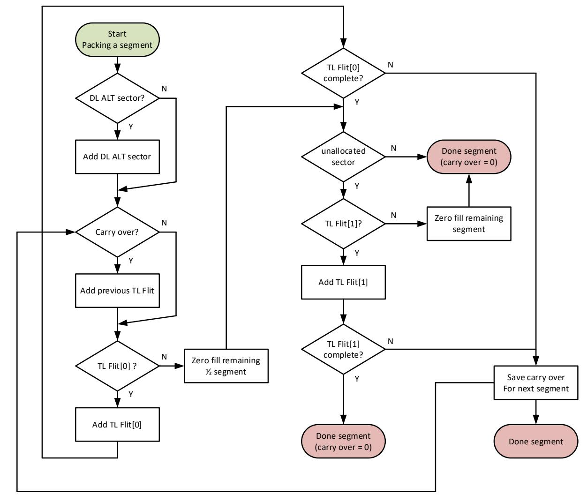

**Figure 6-5 Flit packing flow chart**

# **6.3.5 TL Flit to DL Flit Mapping**

In the following examples the TL Flit is shown in mirrored view so that it aligns with the logical view of the DL Flit. The DL Flit sequential ordering is left to right, top to bottom, i.e., in the order of sector and byte numbering.

[Figure 6-6](#page-147-0) describes that TL Flit[0] starts packing into segment[0]. The message bits[1:0] along with TL Flit[0] present is encoded into SH0. TL Flit sector[0] maps to DL Flit sector[0], and so on.

In this example there is no carry over from a previous TL Flit.

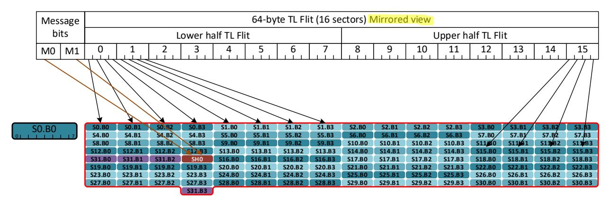

**Figure 6-6 TL Flit[0] example 1**

[Figure 6-7](#page-147-1) describes that TL Flit[1] starts packing into segment[0]. The message bits[1:0] along with TL Flit[1] present is encoded into SH0. TL Flit sector[0] maps to DL Flit sector[16], and so on.

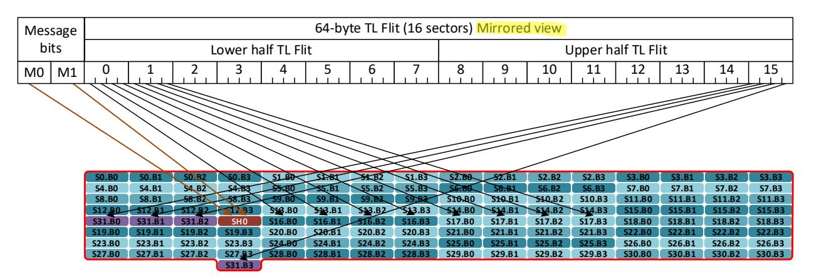

**Figure 6-7 TL Flit[1] example 1**

[Figure 6-8](#page-148-2) describes that TL Flit[0] starts packing into segment[4]. The message bits[1:0] along with TL Flit[0] present is encoded into SH4. TL Flit sector[0] maps to DL Flit sector[143], and so on, into the next segment and DL Flit.

There is no space for TL Flit[1].

In this example there is an alternative sector and a previous carry over up to sector[142].

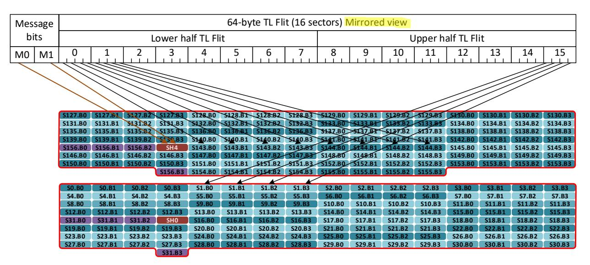

Figure 6-8 TL Flit[0] example 2

### 6.3.6 DL Flit to 64B/66B encoding

The DI Flit to 64B/66B encoding is shown below. The DL Flit is redrawn with the same width as the 64-bit PCS interface, and show reflected in the x-axis. The sequence is left to right, bottom to top, i.e., in sector order. The Sync Header (SH) is set to 0b01 for data code.

• Note: The Sync Header is added in the RS layer. The DL only transmits and receives data Flits.

Figure 6-9 DL Flit to 64B/66B Encoding

### 6.3.7 CRC

A 4-byte CRC is calculated and placed in the last bytes in the DL Flit.

The CRC calculation follows 802.3, see clause 3.2.9 Frame Check Sequence (FCS) field. The CRC is calculated over the entire 640Bytes, with the CRC field padded to 0x0.

The CRC is transmitted in the following order: x0, x1, … x31. This is the reverse order compared to IEEE 802.3 FCS. CRC[0] contains bits x0, x1, … x7, CRC[1] contains bits x8, x1, … x15, etc.

# **6.4 DL messages**

Reserved fields shall be set to 0x0 and shall be ignored by receiving link partner.

# **6.4.1 Message Overview**

### **6.4.1.1 Message Types**

Any Segment of the DL Flit may contain an DL alternative sector (DLAltSector ). The DLAltSector is used to send DL messages. DL messages originate at the DL and terminate at the DL.

All messages have bit 0 as a reserved.

A summary of the message classes and types are shown below.

| Message class (mclass) | code   | Message Type (mtype)           | code  |
|---------------------------|--------|-----------------------------------|-------|
| Basic Messages            | 0b0000 | No-Op message                     | 0b000 |
|                           |        | TL Rate Notification              | 0b100 |
|                           |        | Device ID Request                 | 0b101 |
|                           |        | Port Number Request and Response  | 0b110 |
| Control Messages          | 0b1000 | DL Channel On/Offline negotiation | 0b100 |
| UART Messages             | 0b0001 | UART Stream Transport Message     | 0b000 |
|                           |        | UART Stream Credit Update         | 0b001 |
|                           |        | UART Stream Reset Request         | 0b110 |
|                           |        | UART Stream Reset Response        | 0b111 |

**Table 6-3 DL Message Types**

### **6.4.1.2 Message arbitration**

There are several sources of messages. All messages are a single DWord sequence, except for UART Stream Transport Message. This can be up to 33 Dwords. UART Stream Transport Message shall be packed sequentially into each Segment, which may span multiple Flits. Other DL message shall be blocked while the UART Stream Transport Message is transmitted.

There are two levels of arbitration. The first Level is within each Message type. Round Robin is used between each of the Basic Messages, to select a potential winner for the group. Round Robin is used between each of the Control Messages, to select a potential winner for the group. Round Robin is used between each of the UART Messages, to select a potential winner for the group. The final level of arbitration is round robin between the Basic Message group, the Control Message group, and the UART Message group.

# **6.4.2 Basic Messages**

Basic messages are used to send information from one link partner to another, or to request information from one link partner to another. There is no negotiation.

### **6.4.2.1 Generic Flow**

### **6.4.2.1.1 Single Request**

The single request flow is shown below. In this case the local link partner makes a request, and the remote link partner shall accept the request with an Ack response.

**Figure 6-10 Single Request Flow**

### **6.4.2.1.2 Two Requests**

It is possible that two request are made at the same time with the same mclass and mtype. These requests are independent and thus operate as two independent sequences. This is shown below.

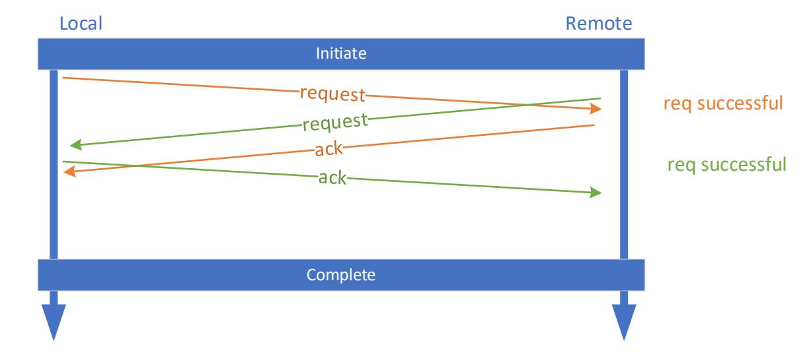

**Figure 6-11 Two Requests Flow**

### **6.4.2.2 TL Rate Notification**

The TL Rate Notification Message is a message used to convey change in the TL rate (clock frequency) to a connected link partner. The use case of this message is described in section [6.5](#page-163-0)[6.4.4.](#page-158-0) It is a unidirectional message only for notification. The link partner shall respond with an Ack with in 1us of the request.

| Field      | Bit   | Description                                                     |
|------------|-------|-----------------------------------------------------------------|
| Compressed | 0     | Set to 0, not supported                                         |
| Reserved   | 1     | Reserved                                                        |
| mclass     | 5:2   | Message Class                                                   |
| mtype      | 8:6   | Message Type                                                    |
| Reserved   | 11:9  | Reserved                                                        |
| Ack        | 12    | 0: Request message                                              |
|            |       | 1: Response message                                             |
| Reserved   | 15:13 | Reserved                                                        |
| Rate       | 31:16 | TL rate, only valid for Request message, reserved otherwise. |

**Table 6-4 TL Rate Notification**

Rate is expressed as 50.0 KHz per lsb. Full rate at 1562.5 MHz is coded at 31, 250, decimal. The reference clock rate 156.25 MHz would be coded as 3,125, decimal. The reference clock rate is the minimum rate that shall be supported.

A 1x4, 800G DL is assumed to be 512 bits wide at 1562.5 MHz, and thus 512 \* 1562.5 MHz = 800Gbps. Other data widths are possible and shall normalize to 512-bit width. A 2x2, 400G DL per link is assumed to be 256 bits wide at 1562.5 MHz, and thus 256 \* 1562.5 MHz = 400Gbps. Other data widths are possible and shall normalize to 256-bit width. A 4x1, 200G DL per link is assumed to be 128 bits wide at 1562.5 MHz, and thus 128 \* 1562.5 MHz = 200Gbps. Other data widths are possible and shall normalize to 128-bit width. **Note**: There is overhead in the DL Flit, 4 bytes CRC, 3 bytes Flit header, and 5 bytes segment header. There are 628-bytes of TL payload per 640-byte DL Flit. Backpressure from the Tx pipeline will naturally limit the throughput to (628/640)\*200 = 196.25 Gbps. This is equivalent to a register setting of 30,664, decimal, or 1533.20 MHz.

### **6.4.2.3 Device ID Request**

To aid in the determination of the scale out network topology a Link partner can request the ID of its link partner. The link partner shall respond within 1.0 us of the request. If the Link partner has not been configured with an ID, then it returns 0x0 in the Valid bit, as well as the ID field. The requesting link partner advertises its ID if known, in the request.

When the Ack field is Request:

- Valid indicates if the ID is valid.
- Type indicates switch or Accelerator.
- ID indicates the requestor ID, set to 0x0 if valid is set to 0x0.

When the Ack field is Response:

- Valid indicates if the ID is valid.
- Type indicates switch or Accelerator.
- ID indicates the responder ID, set to 0x0 if valid is set to 0x0.

| Field      | Bit   | Description                               |
|------------|-------|-------------------------------------------|
| Compressed | 0     | Set to 0, not supported                   |
| Reserved   | 1     | Reserved                                  |
| mclass     | 5:2   | Message Class                             |
| mtype      | 8:6   | Message Type                              |
| Reserved   | 11:9  | Reserved                                  |
| Ack        | 12    | 0: Request message 1: Response message |
| Reserved   | 15:13 | Reserved                                  |
| ID         | 25:16 | 10-bit Switch or accelerator ID           |
| Reserved   | 28:26 | Reserved                                  |
| Type       | 30:29 | 0: for a switch                           |
|            |       | 1: for an accelerator other reserved   |
| Valid      | 31    | 0: if ID is not valid                     |
|            |       | 1: if ID is valid                         |

**Table 6-5 Device ID Request**

### **6.4.2.4 Port Number Request and Response**

To aid in the determination of the scale up network topology a Link partner can request the port number of its partner, attached on the link. The link partner shall respond with in 1us of the request. If the Link partner has not been configured with its port number, then it returns 0x0 in the Valid bit, and the port number field is undefined and set to 0x0. The requesting link partner advertises its port number if known, in the request.

When the Ack field is Request:

- Valid indicates if the number is valid.
- Port number indicates the port number of the device, if valid is set.

When the Ack field is Response:

- Valid indicates if the number is valid.
- Port number indicates the port number of the device, if valid is set .

| Field      | Bit  | Description             |
|------------|------|-------------------------|
| Compressed | 0    | Set to 0, not supported |
| Reserved   | 1    | Reserved                |
| mclass     | 5:2  | Message Class           |
| mtype      | 8:6  | Message Type            |
| Reserved   | 11:9 | Reserved                |

| Ack         | 12    | 0: Request message 1: Response message                    |
|-------------|-------|--------------------------------------------------------------|
| Reserved    | 15:13 | Reserved                                                     |
| Port number | 27:16 | 10-bit port number.                                          |
| Reserved    | 30:28 | Reserved                                                     |
| Valid       | 31    | 0: if port number is not valid 1: if port number is valid |

**Table 6-6 Port ID Request**

### **6.4.2.5 No-OP Message**

No-Op messages are used only in UART reset sequences. 40 No-Op messages shall be transmitted during UART reset sequence to flush any data between the transmitter and receiver. The mtype and mclass fields are set according to [Table 6-3.](#page-149-3) No-Op messages are not ACK'd.

| Field      | Bit  | Description             |
|------------|------|-------------------------|
| Compressed | 0    | Set to 0, not supported |
| Reserved   | 1    | Reserved                |
| mclass     | 5:2  | Message Class           |
| mtype      | 8:6  | Message Type            |
| Reserved   | 31:9 | Reserved                |

**Table 6-7 No-Op Message**

# **6.4.3 Control Messages**

Control messages are used by the DL to negotiate a change in operation on the Link. Once the Negotiation completes successfully the change takes place. If the negotiation unsuccessfully completes , then no change occurs. The Link is peer to peer and either link partner may request a change. Some link partner types (i.e., Switches) are not permitted to initiate some requests.

Once a link partner receives a request it shall not schedule a request of the same mclass and mtype, until the current request completes. It is possible for two requests to occur at the same time, or near the same time, such that two conflicting or identical request exists, of the same mclass and mtype. When a request is made any subsequent request of the same mclass mtype that is received the link partner shall not respond with a decision pending, it shall respond with an Ack or Nack.

There is a resolution function, for each mtype, such that conflicting requests resolve to one request being Ack'd and the other request being Nack'd.

### **6.4.3.1 Generic Flow**

### **6.4.3.1.1 Single Successful Request Flow**

The single successful request flow is shown below. In this case the local link partner makes a request, and the remote link partner accepts the request with an Ack. The local link partner transmits a confirming ACK to the remote link partner.

**Figure 6-12 Single Successful Request Flow**

### **6.4.3.1.2 Single Unsuccessful Request Flow**

The single unsuccessful request flow is shown below. In this case the local link partner makes a request, and the remote link partner rejects the request with an Nack.

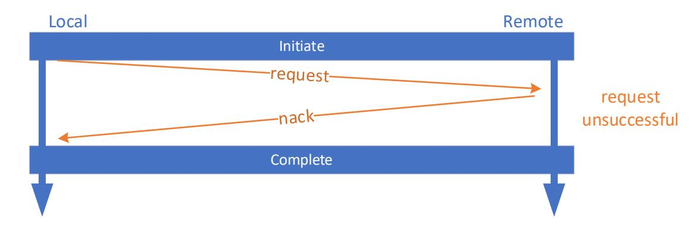

**Figure 6-13 Single Unsuccessful Request Flow**

### **6.4.3.1.3 Single decision pending Request Flow**

The single decision pending request flow is shown below. In this case the local link partner makes a request, and the remote link partner responds with decision pending Decision. The Remote link partner is required to issue a request later. The Local link partner shall not issue the same mclass mtype request until after the Remote link partner issues a new request of the decision pending mclass and mtype and it is completed.

**Figure 6-14 Single decision pending Request Flow**

### **6.4.3.1.4 Conflicting Request Flow**

The conflicting request flow is shown below. In this scenario both local and remote link partners make a request before they have received the conflicting request. The remote link partner compares its transmitted request to the received request, and determines that the received request should be acknowledged, and sends the Ack. The Loal link partner compares its transmitted request to the received request and determines that the received request should not be acknowledged and sends the Nack. The local link partner receives the Ack and sends the confirming Ack to the remote link partner.

The local link partner is required to transmit the Nack and Ack in the order shown. Responses relating to received requests or responses shall be in the order received. The resolution function is the same in both link partners, so that they both decide consistently how to resolve the conflict.

# Complete Initiate req successful req unsuccessful Local Remote

**Figure 6-15 Conflicting request flow**

### **6.4.3.1.5 Identical Request Flow**

The identical request flow is shown below. In this scenario both local and remote link partners make a request before they have received the same request. The remote link partner compares its request to the received request, and determines that the received request should be acknowledged, and sends the Ack. The Loal link partner compares its request to the received request, and determines that the received request should be acknowledged and sends the Ack. The local link partner receives the Ack and sends the confirming Ack to the remote link partner. The remote link partner receives the Ack and sends the confirming Ack to the local link partner.

Both local/remote link partners are required to send the Acks in the order shown. Responses relating to received requests or responses shall be in the order received. The resolution function is the same in both link partners, so that they both decide consistently how to resolve the conflict.

**Figure 6-16 Identical Request Flow** 

## **6.4.3.2 DL Channel Online/Offline Negotiation Message**

The format is shown below. These messages are used to negotiate the Channel offline and online. By default, all Channels are offline after reset.

The Following Channel are defined:

- Channel 0: TL Flits
- Channel 4: DL UART

When a Channel is offline it shall not transmit data associated with that Channel. Received Channel data that are offline is silently discarded. When Channel 0 is offline, transmitted DL Flits shall have the TL Flit[1:0] set to 0 in the segment header. When Channel 4 is offline, transmitted DL Flits shall not have mtype set to 0b0001 in alternative sectors, i.e., UART Messages.

There are only two states online and offline, thus it is not possible to have conflicting requests from each link partner. Requests for the current state are not permitted. If a request is received for the current state, it is Ack'd, and an error is logged by the link partner that received the request.

When a request is received a response (Ack, Nack, or decision pending) shall be transmitted within 1.0 us. When a request is received for a Channel online (and the current state is offline for that Channel) the response shall be Ack or decision pending. The link partner that responded with decision pending to an online request shall transmit a request for Channel online with in 10ms. When a request is received for a Channel offline (and the current state is online for that Channel) the response shall be Ack.

When the Channel.Command field is Request:

- Channel.TargetState indicates the desired online/offline state of the transmitting linkpartner.
- Channel.Response is reserved and shall be set to 0x0.

When the Channel.Command field is decision pending:

- Channel.TargetState is reserved and shall be set to 0x0.
- Channel.Response is the requested Channel.TargetState that it received from the remote link-partner.

When the Channel.Command field is Ack or Nack:

- Channel.TargetState indicates the desired online/offline state of the transmitting linkpartner.
- Channel.Response is the requested Channel.TargetState that it received from the remote link-partner.

| Field               | Bit   | Description                                                                             |
|---------------------|-------|-----------------------------------------------------------------------------------------|
| Compressed          | 0     | Set to 0, not supported                                                                 |
| Reserved            | 1     | Reserved                                                                                |
| mclass              | 5:2   | Message Class                                                                           |
| mtype               | 8:6   | Message Type                                                                            |
| Reserved            | 15:9  | Reserved                                                                                |
| Channel.TargetState | 19:16 | 0xxx: Channel offline 1xxx: Channel online xNNN: Channel ID                       |
| Channel.Command     | 23:20 | 0100: Request 0110: Ack 0111: NAck 1000: decision pending others: reserved. |
| Channel.Response    | 27:24 | 0xxx: Channel offline 1xxx: Channel online xNNN: Channel ID                       |
| Reserved            | 31:28 | Reserved                                                                                |

**Table 6-8 Channel Negotiation** 

# **6.4.4 UART Messages**

## **6.4.4.1 Protocol Overview**

The UART provides a mechanism for sending data across a fraction of the link bandwidth between a UART Transmit Buffer on one end and a UART Receive Buffer on the other end. It is a bidirectional protocol. 32-bits may be sent as an alternative sector every segment. A segment is 1024 bit, thus approximately 3% of the link bandwidth could be utilized for UART Stream Transport Messages.

The UART Stream Transport Message has variable length, and the length is indicated in the first DWord of the UART Stream Transport Message. The First DWord is not stored in the UART Transmit Buffer or UART Receiver Buffer. The length of the UART Stream Transport Message is determined dynamically as a function of available credits and UART Transmit Buffer fill. Subsequent Dwords are the message data and is stored in the UART Transmit Buffer and UART Receiver Buffer.

# Evaluation Copy

### **Ultra Accelerator Link Consortium Inc. (UALink) - UALink\_200 Rev 1.0 Specification**

The recommended UART Transmit Buffer and UART Receive Buffer is 128 Dwords each, per stream. Currently a single stream is defined, however there is provision for up to 8 streams in the stream ID fields.

### **6.4.4.1.1 Initialization**

The initial state of the UART Transmit Buffer and UART Receive Buffer shall be empty. Channel 4 shall be enabled prior to operation. The initial state of the transmit and receive credit counters shall be 0, i.e., the transmitter has no credits to send data.

### **6.4.4.1.2 Stream Reset**

The stream reset sequence is described below:

- 1. Local F/W determines a UART stream reset is required.
- 2. The UART stream is disabled.
- 3. The UART Transmit Buffer and UART Receive Buffers for the affected stream is flushed.
- 4. The credit counts for the disabled stream are reset to 0x0.
- 5. Any subsequent writes to the disabled UART Transmit Buffer are discarded.
- 6. Any subsequent receive data from the link partner for the disabled stream is discarded. Error reporting on these discards are suppressed pending the completion of the reset handshake
- 7. all DL messages (all classes, all types) are blocked to prevent further pollution.
- 8. 40 DL No-Op Messages are transmitted to ensure run-out of any existing UART Stream Transport Message
- 9. A UART Stream Reset Request Message is transmitted.
- 10. DL messages (all classes, all types) are unblocked to allow forward progress.
- 11. Wait for UART Stream Reset Response with status = SUCCESS
  - a. After a 10ms timeout, if a Reset Response with status = SUCCESS is not returned, loop back to step [\(7\)](#page-159-0)
- 12. Normal operation resumes

The Remote link partner that receives the UART Stream Reset Request Message performs the following sequence:

- 1. The UART stream is disabled.
- 2. The UART Transmit Buffer and UART Receive Buffers for the affected stream is flushed.
- 3. The credit counts for the disabled stream are reset to 0x0.
- 4. Any subsequent writes to the disabled UART Transmit Buffer are discarded.
- 5. A UART Stream Reset Response Message is transmitted with status = SUCCESS.
- 6. Normal operation resumes.

### **6.4.4.1.3 Flow Control**

Flow control is managed by two modulo 2^12 Credit Counters, per direction one in the receiver (Receiver Credit Counter) and one in the transmitter (Transmit Credit Counter). During initialization both counters are set to 0x0. Each count value represents a DWord.

The Receiver Credit Counter rules are described below.

- Receiver Credit Counter is initialized to 0 during reset.
- When reset is released Receiver Credit Counter is updated to the size of the UART Receiver Buffer.

- When a DWord is read out of UART Receive Buffer, the Receiver Credit Counter is incremented by 1.
- If Channel 4 is enabled, then a UART Stream Credit Update is scheduled for transmission with the Receiver Credit Counter value in the DataFCSeq field under the following conditions:
  - o No UART Stream Credit Update have been scheduled since reset.
  - o When Receiver Credit Counter is incremented, and 4 Flits have been Transmitted.

The Transmit Credit Counter rules are described below.

- Transmit Credit Counter is initialized to 0 during reset.
- The Transmit Credit Counter is updated every time a UART Stram Transport Message is sent.

A UART Stream Transport Message shall be scheduled when all the following are true:

- Channel 4 is enabled.
- The UART Transmit Buffer has a DWord or more in it.
- The most recently received DataFCSeq field from the UART Stream Credit Update minus the local Transmit Credit Counter, using modulo 2^12 subtraction, is greater than 0. This indicates that there is room in the UART Receive Buffer.

The length field of the UART Stream Transport Message is set to the minimum of:

- The result of the modulo subtraction above minus 1
- The UART Transmitter Buffer fill minus 1
- 32 minus 1

### **6.4.4.1.4 Vendor Defined Packet TLV**

There is no relationship between the UART Stream transport Message length and the Length of the Vendor Defined Packet. Shown below illustrates a Vendor Defined Packet [i] that spans 3 UART Stream Transport Messages. The first DWord of the Vendor Defined Packet shown below, is a TL describing the Type and Length of Vendor Defined Packet, the subsequent 3 Dwords V[2:0] describe the Value of the message.

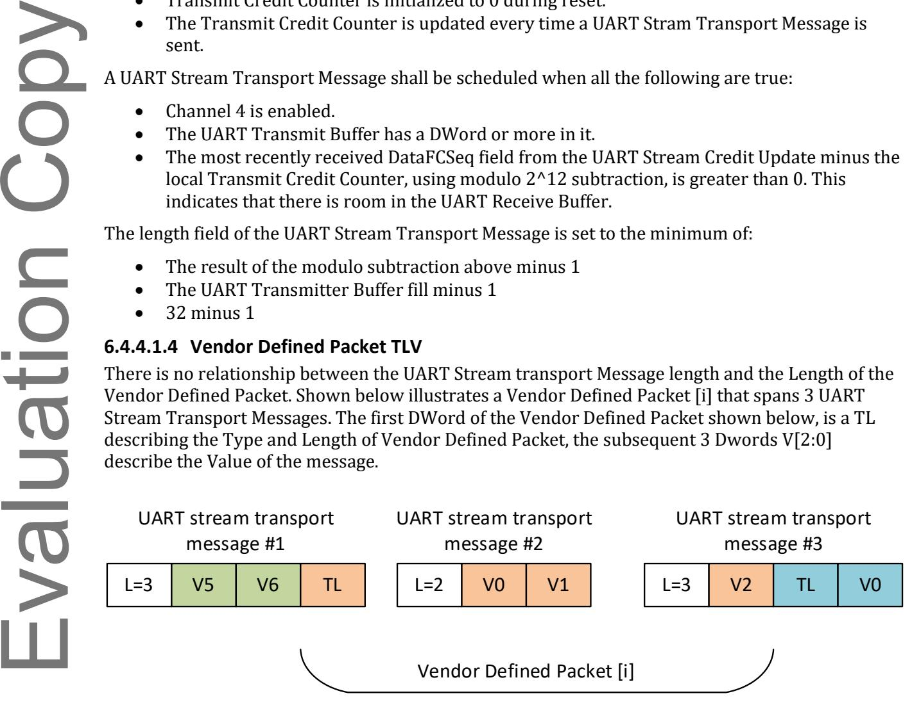

**Figure 6-17 Vendor Defined Packet**

The first DWord of the Vendor Defined Packet is described below.

| Field  | Bit | Description                                                                              |
|--------|-----|------------------------------------------------------------------------------------------|
| Length | 7:0 | Payload Length -1 0x00: payload length = 1 DWord 0XFF: payload length = 256 DWords |

| Type      | 15:8  | Message type                                                                                                             |
|-----------|-------|--------------------------------------------------------------------------------------------------------------------------|
| Vendor ID | 31:16 | The vendor ID assigned by the PCI-SIG to the vendor that defined this packet, or 0xFFFF for UALink defined packet. |

**Table 6-9 Vendor Defined Packet Type Length (TL) DWord**

### **6.4.4.2 UART Stream Reset Request**

The UART Stream Reset Request message is shown below. This is sent to initiate a reset sequence, either for a single stream, or all streams.

| Field      | Bit   | Description                                |
|------------|-------|--------------------------------------------|
| Compressed | 0     | Set to 0, not supported                    |
| Reserved   | 1     | Reserved                                   |
| mclass     | 5:2   | Message Class                              |
| mtype      | 8:6   | Message Type                               |
| Stream ID  | 11:9  | 000: stream 0 others reserved           |
| allStreams | 12    | 0: only stream indicated 1: all streams |
| Reserved   | 31:13 | Reserved                                   |

**Table 6-10 UART Stream Reset Request**

### **6.4.4.3 UART Stream Reset Response**

The UART Stream Reset Response message is shown below. This is sent to report the status of a reset sequence, either for a single stream, or all streams.

| Field      | Bit   | Description                                |
|------------|-------|--------------------------------------------|
| Compressed | 0     | Set to 0, not supported                    |
| Reserved   | 1     | Reserved                                   |
| mclass     | 5:2   | Message Class                              |
| mtype      | 8:6   | Message Type                               |
| Stream ID  | 11:9  | 000: stream 0 others reserved           |
| allStreams | 12    | 0: only stream indicated 1: all streams |
| Status     | 15:13 | 000: success others reserved            |
| Reserved   | 31:16 | Reserved                                   |

### **Table 6-11 UART Stream Reset Response**

### **6.4.4.4 UART Stream Transport Message**

The UART Stream Transport Message is shown below. The UART Stream Transport Message is transmitted a DWord at a time via 32-bits per segment. The message length is specified in Dwords as indicated. The maximum length of the payload is 32 DWords. The maximum length of the transport message is 33 Dwords. The UART Stream Transport Message shall be transmitted continuously, i.e., without another DL messages inserted between any of the UART Stream Transport Message Dwords.

| Field           | Bit                     | Description                                                            |
|-----------------|-------------------------|------------------------------------------------------------------------|
| Compressed      | 0                       | Set to 0, not supported                                                |
| Reserved        | 1                       | Reserved                                                               |
| mclass          | 5:2                     | Message Class                                                          |
| mtype           | 8:6                     | Message Type                                                           |
| Stream ID       | 11:9                    | 000: stream 0 others reserved                                       |
| Reserved        | 26:12                   | Reserved                                                               |
| Length          | 31:27                   | Length of payload +1 DWords, i.e. length = 0 means 1 DWord payload. |
| DWord payload 0 | 63:32                   | First payload DWord                                                    |
| DWord payload 1 | 95:64                   | Second payload DWord, if needed.                                       |
| DWord payload n | (n+2)*32- 1:(n+1)*32 | N'th payload DWord, if needed.                                         |

**Table 6-12 UART Stream transport message**

### **6.4.4.5 UART Stream Credit Update**

The UART Stream Credit Update message is shown below. This is used to advertise credit availability from receiver to transmitter.

| Field      | Bit   | Description                        |
|------------|-------|------------------------------------|
| Compressed | 0     | Set to 0, not supported            |
| Reserved   | 1     | Reserved                           |
| mclass     | 5:2   | Message Class                      |
| mtype      | 8:6   | Message Type                       |
| Stream ID  | 11:9  | 000: stream 0 others reserved   |
| Reserved   | 19:12 | Reserved                           |
| DataFCSeq  | 31:20 | Data flow control sequence update. |

**Table 6-13 UART Stream Credit Update**

# 6.5 Transmitter Pacing

### 6.5.1 Overview

The transaction buffers are in the TL, and credit-based flow control guarantees that there is always room in the receive TL buffers. The TL is clocked by the UPLI Clock. Accelerators are permitted to change their UPLI Clock to a lower frequency such that its throughput is lower than the physical layer throughput.

**Note**: Changing to a lower clock frequency is a power reduction mechanism often used in accelerators and CPUs.

Transmitter Pacing is required on the transmitting device to prevent the DL Rx FIFO overflow on the receiving device, when the receiving UPLI Clock is operating at a lower frequency. The Rx FIFO is written at a rate derived from the recovered clock. This rate is 800Gb/s by default and is implemented as 512-bits (64-byes) at 1562.5MHz = 800Gb/s. The read rate could be slower if the UPLI Clock has been reduced, thus causing the Rx FIFO to fill up.

Pacing is defined as the rate that a Tx Flit from the TL is admitted to the DL Tx FIFO. The DL modulates at "Ready" signal to the TL indicating on which of the clock ticks' data may transfer.

• Note: The "ready" signal is one possible implementation, others are possible. This is for illustration purposes only.

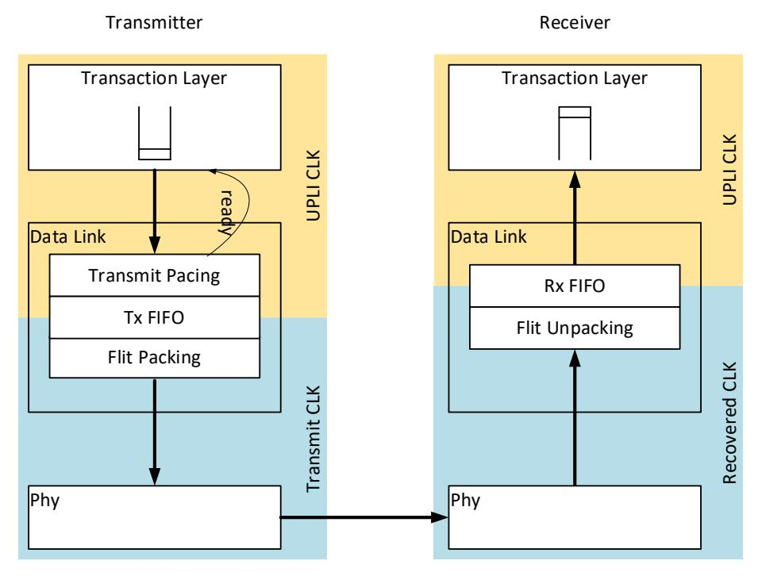

Figure 6-18 Pacing

### **6.5.2** Switch

Switches are required to run at a fixed UPLICLK, such that the throughput is 800Gb/s, 512-bits at 1562.5MHz. If the Accelerator changes its UPLICLK it sends a TL Rate Notification Message to the Switch. The Switch adjusts the transmit pacing rate to avoid Rx FIFO overflows in the accelerator based on receiving this message.

# **6.5.3 Accelerator**

Accelerators are permitted to change their UPLI Clock. If the Accelerator intends to change its UPLI Clock it shall inform its link partner of this via TL rate notification messages . It is permitted to have both accelerators on a link operating at different rates. It is permitted that accelerators independently changing their rates at the same time.

# **6.5.4 Sequence**

The following rules apply to UPLI Clock rate change:

- 1. Default rate is 800G bits/s or 1562.5MHz.
- 2. Only Accelerators may change their UPLI Clock frequency.
- 3. Changing the UPLI Clock frequency requires reprograming a PLL, therefore an intermediate UPLI Clock frequency between rates changes shall be to the reference clock of 156.25MHz. Switching between PLL derived clock and 156.25 MHz reference clock is performed with a glitchless clock mux.
- 4. When an accelerator intends to change its UPLI Clock frequency:
  - a. Adjust its Tx pacing to the reference clock rate.
  - b. Transmit a TL Rate Notification Message for the reference clock rate.
  - c. Wait for TL Rate Notification Message ACK.
  - d. Mux its UPLI Clock to the reference clock.
  - e. Adjust its PLL for the to the new UPLI Clock frequency.
  - f. Mux its UPLI Clock to the new PLL frequency, with Tx pacing set to the link partner's rate if it has a lower UPLI Clock rate.
  - g. Transmit a TL Rate Notification Message for the new clock rate.
  - h. Wait for TL Rate Notification Message ACK.
  - i. Done.
- 5. When a link partner receives a TL rate notification message:
  - a. It registers this value.
  - b. It adjusts its Tx pacing if needed (i.e., link partner has advertised a lower rate).
  - c. Transmits with a TL Rate Notification Message ACK within 1.0 us.
  - d. Done.

# **6.6 Link Level Replay**

# **6.6.1 Overview**

Link level replay ensures guaranteed in order delivery of DL Flits in the presence of bit errors that cannot be corrected by the physical layer FEC. The Transmitter keeps a copy of payload Flits (i.e., not NOP Flits), until the receiver positively acknowledges them. The unacknowledged Flits are stored in the TxReplay buffer. The TxReplay buffer shall be large enough to cover the round-trip time (RTT) of the link otherwise the link will not be able to run at full bandwidth. If the TxReplay buffer is full, waiting for positive acknowledgments (ACKs), new DL payload Flits shall not be transmitted. In their place NOP Flits are transmitted. If the TxReplay buffer is full or in a replay state, the DL shall back pressure the TL and not accept any additional TL Flits and ensure that no accepted TL Flits are lost.

The PCS Receiver performs FEC correction prior to forwarding the Flit to the DL, only Flits that pass FEC correction are forwarded to the DL. The CRC is check in the DL. If the CRC fails, then the DL Flit is deemed bad, and the Flit is discarded.

# Evaluation Copy

### **Ultra Accelerator Link Consortium Inc. (UALink) - UALink\_200 Rev 1.0 Specification**

If the CRC is good, then one of the following occur: a standard replay is scheduled by the Receiver via a Replay Request when the receiver determines the received sequence numbers are out of order or an Ack is scheduled when the receiver determines the received sequence numbers are in order.

When the Transmitter receives an Ack the TxReplay buffer removes entries up to and including the sequence number indicated by ackReqSeq field in the Ack. When the Transmitter receives a Standard Replay Request, it starts replaying all DL Payload Flits, currently held in the transmit replay buffer, starting with the sequence number indicated by the ackReqSeq field in the Replay Request . A Replay Request is not an implicit Ack; no entries are removed from the TxReplay buffer when a Replay Request is received.

When Replay Requests are sent, three Replay Requests shall be sent, to improve reliability, all requesting the same sequence number. Upon receiving a new Replay Request, the receiver shall ignore subsequent Replay Requests during the Replay Request Ignore Window. The three copies of the Replay Request shall be issued as quickly as possible such that no more than one copy of the Replay Request will be sent in each FEC-interleave group.

• Note: this ensures that the loss of any one FEC-interleave group will result in the loss of no more than one copy of the Replay Request.

There are two formats for Flit headers:

- 1. **Explicit Sequence Number Flit**: this Flit carries the full 9-bit sequence number, but no information regarding Ack or Replay Request
- 2. **Command Flit**: this Flit carries only the lower 3-bits of the sequence number, as well as Ack or Replay Request indication, and the full 9-bit sequence number that is being Acked or replay requested.

When a Command Flit is received, the full 9-bit sequence number can generally be calculated based on previously received full 9-bit sequence number (Explicit Flit), and subsequent 3-bit sequence numbers (command Flit). The receiver performs checks to ensure that this can be calculated unambiguously. If the sequence number cannot be unambiguously determined a replay is triggered. The transmitter schedules Explicit Flits every 7 Flits to aid the calculation being unambiguous.

# **6.6.2 Flit Header**

### **6.6.2.1 Explicit Sequence Number Flit Header**

The Explicit Sequence Number Flit (or "Explicit Flit" for short) header is shown below. This contains the full 9-bit sequence number. There is no Ack or Replay Request indication.

| Field    | Bit   | Description                                                                                                                                                                                          |
|----------|-------|------------------------------------------------------------------------------------------------------------------------------------------------------------------------------------------------------|
| op       | 23:21 | When payload ==0 (NOP): 0b000: NOP Flit others: Reserved When payload ==1: 0b000: Original transmission of payload Flit "org" 0b001: Replay of payload Flit "rpy" others: Reserved |
| payload  | 20    | 1: payload Flit 0: NOP Flit                                                                                                                                                                       |
| reserved | 19:17 | Reserved                                                                                                                                                                                             |

| flitSeqNo | 16:8 | Sequence number of Flit. This is the full 9-bit value. |
|-----------|------|--------------------------------------------------------|
| reserved  | 7:0  | Reserved                                               |

**Table 6-14 Explicit Sequence Number Flit Header**

### **6.6.2.2 Command Flit Header**

The Command header is shown below. This contains the full 9-bit sequence number for the Flits that is being acknowledged or not acknowledged, along with the lower 3-bits of the flitSeqNo, identified as flitSeqLo.

| Field     | Bit   | Description                                                                                                                                  |
|-----------|-------|----------------------------------------------------------------------------------------------------------------------------------------------|
| op        | 23:21 | 0b010: Ack 0b011: Standard Replay Request "rpy" others: Reserved                                                                       |
| payload   | 20    | 1: payload Flit 0: NOP Flit                                                                                                               |
| ackReqSeq | 19:11 | Full sequence number of Ack Flit that is being acknowledged or Sequence number of the Replay Request. This is the full 9-bit value. |
| flitSeqLo | 10:8  | Lower 3 bits of Flit Sequence Number.                                                                                                        |
| reserved  | 7:0   | Reserved                                                                                                                                     |

**Table 6-15 Command Flit Header**

# **6.6.3 Term Definitions**

### **6.6.3.1 Explicit Sequence Number Flit**

A Payload Flit with op equal to 0b000 or 0b001. A NOP Flit with op 0b000. This uses the format described in [Table 6-14.](#page-166-1) Explicit Flits contain the full 9-bit sequence number.

### **6.6.3.2 Command Flit**

A payload or NOP Flit with op equal 0b010 or 0b011. In other words, an Ack or Replay Request Flit.

### **6.6.3.3 Ack Flit**

A Flit with Replay op 0b010. This uses the format described i[n Table 6-15.](#page-166-2)

### **6.6.3.4 Standard Replay Request Flit**

A Flit with Replay op 0b011. This uses the format described i[n Table 6-15.](#page-166-2)

### **6.6.3.5 Standard Replay Request**

A Replay Request that requests a replay of all DL Payload Flits starting from a specified sequence number.

### **6.6.3.6 Tx Replay Buffer**

The buffer which stores information for transmitted DL Payload Flits until the DL Payload Flit has been acknowledged by the Link partner.

# Evaluation Copy

# **6.6.3.7 Rx Replay Buffer**

The buffer which stores information for received DL Payload Flits, until the DL Payload Flit has been released to and consumed by the Receiver.

**Ultra Accelerator Link Consortium Inc. (UALink) - UALink\_200 Rev 1.0 Specification**

### **6.6.3.8 Replay Request Ignore Window**

A time window in which received Replay Request Flits are ignored so that only a single replay action will be triggered from the multiple copies of the Replay Request that were issued.

# **6.6.4 Rx Flags and Counters**

### **6.6.4.1 Rx\_seq\_calc**

This 9-bit value is calculated based on the received Flit. Command or Explicit header type as follows.

If Flit is an Explicit Flit:

• Rx\_seq\_calc = flitSeqNo

Else: # Command Flit

• delta\_lo = (flitSeqLo - Rx\_last\_seq\_calc & 0x7) % 8

If delta\_lo == 0 and flit is payload:

- o delta\_lo = 8
- Rx\_seq\_calc = (Rx\_last\_seq\_calc + delta\_lo) % 512

Default value is 0x1FF.

### **6.6.4.2 Rx\_last\_seq\_calc**

This 9-bit value is updated based on the Rx\_seq\_calc calculation of the last Flit received. Default value is 0x1FF. Se[e Rx Enqueuing Rules.](#page-170-1)

### **6.6.4.3 Rx\_last\_ack**

This 9-bit value is updated based on the ackReqSeq field of the last Ack Flit received. Default value is 0x1FF. See [Rx Ack and Replay Request Processing Rules.](#page-169-1)

### **6.6.4.4 Rx\_bad\_crc\_count**

This 3-bit value incremented based receiving Flits with bad CRC. The counter does not roll over and saturates at 0x7. Bad CRC can lead to sequence number ambiguity resulting in a loss of sync between Rx\_last\_seq\_calc at the receiver and the actual sequence number that the Flit was created with. Default value is 0x0. Se[e Rx Ingress Rules.](#page-169-2)

### **6.6.4.5 Rx\_unexpected\_count**

This 8-bit value is incremented based on receiving Flits with unexpected sequence number while the Rx is in the replay state. The counter does not roll over and saturates at 0xFF. Default value is 0x0. See [Rx Enqueuing Rules.](#page-170-1) 

### **6.6.4.6 Rx\_replay\_limit**

This 8-bit value set the limit in Flit times that will trigger resending Replay Requests. Default value is 50. This should be set to twice the round-trip latency of the link, in Flit times. See [Rx Enqueuing](#page-170-1)  [Rules.](#page-170-1)

### **6.6.4.7 Rx\_ambiguous**

This flag indicates if the received flitSeqLo field is ambiguous. This occurs when too many CRC errors occur in a row declaring that future reception of a flitSeqLo field is untrustworthy. Default value is 0x0. See [Rx Ingress Rules.](#page-169-2)

### **6.6.4.8 Rx\_replay**

This flag indicates if the Rx is in a replay state or not. Default value is 0x0. See [Rx Enqueuing Rules.](#page-170-1)

### **6.6.4.9 Rx\_replay\_ignore\_count**

This 4-bit value defines the remaining number of flits for which a received Replay Request will be ignored. This counter counts down and saturates at 0x0. Default value is 0x0. See [Rx Ingress Rules.](#page-169-2) 

# **6.6.5 Tx Flags and Counters**

### **6.6.5.1 Tx\_replay\_req\_seq\_no**

This 9-bit value holds the sequence number that will be sent 3 times as replica Replay Requests. Default value is 0x0. See [Tx Scheduling.](#page-171-0)

### **6.6.5.2 Tx\_replay\_req\_count**

This 2-bit value indicates how many Replay Requests are left to send. This counter counts down and saturates at 0x0. Default value is 0x0. See [Rx Enqueuing Rules](#page-170-1) and [Tx Scheduling.](#page-171-0)

### **6.6.5.3 Tx\_last\_seq**

This 9-bit value indicates the last sequence number added to TxReplay. This number is incremented for each payload Flit added to the TxReplay buffer. A 9-bit value is stored in the TxReplay buffer along with the Flit, the transmitted Flit may ultimately use the 3-bit flitSeqLo field for a command Flit. Default value is 0x1FF. Se[e Flit sequence number rules,](#page-169-3) [Rx Ack and Replay Request Processing](#page-169-1)  [Rules,](#page-169-1) an[d Tx Source Flit Rules.](#page-171-1) 

### **6.6.5.4 Tx\_replay**

This 1-bit value indicates if the Tx is in a replay state or not. Default value is 0x0. See [Tx Enqueue](#page-171-2)  [Rules](#page-171-2) an[d Tx Source Flit Rules.](#page-171-1) 

### **6.6.5.5 Tx\_first\_replay**

This 1-bit value indicates the first Flit of a replay, and it shall be transmitted as an Explicit Sequence Number Flit . Default value is 0x0. See [Rx Ack and Replay Request Processing Rules](#page-169-1) an[d Tx](#page-171-0)  [Scheduling.](#page-171-0) 

### **6.6.5.6 Tx\_explicit\_count**

This 3-bit value determines when an Explicit Sequence Number Flit shall be sent. This down counter saturates at 0x0 forcing an Explicit Sequence Number Flit to be sent. Default value is 0x7. Se[e Tx Scheduling.](#page-171-0) 

### **6.6.5.7 Tx\_ack\_counter**

While unacknowledged DL Payload Flits are present in the Tx Replay Buffer, this 24-bit counter keeps track of the time, in Flit times, waiting since the last received ack . Default value is 0x0. See [Tx](#page-172-0)  [Forward progress.](#page-172-0)

### **6.6.5.8 Tx\_ack\_time\_out**

This 24-bit register is programed with the threshold for the Tx\_ack\_counter. Default value is calculated for 1ms. With 200AUI-1 Flit time is 25ns, and thus default setting is 40,000. See [Tx](#page-172-0)  [Forward progress.](#page-172-0)

# **6.6.6 General Rules**

### **6.6.6.1 Flit sequence number rules**

- Valid Flit Sequence Numbers are 1 to 511, 0 is reserved for future use. 511 wraps to 1.
  - o Any (sequence number expression)%511 implicitly wraps 511 to 1.
- NOP Flits do not consume a Flit Sequence Number.
- A NOP Flit uses Tx\_last\_seq for its sequence number.
- A payload Flit uses Tx\_last\_seq + 1 for its sequence number when it is added to the TxReplay buffer.

### **6.6.6.2 Rx Ingress Rules**

When an ingress Flit is received:

- Rx\_replay\_ignore\_count is decremented by 1, saturates at 0x0.
- If the CRC check passes, then proceed with both:
  - o [Rx Ack and Replay Request Processing Rules](#page-169-1) and
  - o [Rx Enqueuing Rules](#page-170-1)
- Else # the CRC fails
  - o Rx\_bad\_crc\_count += 1
  - o If Rx\_bad\_crc\_count >= 7 then set Rx\_ambiguous to 1
  - o If Rx\_replay = 1 then Rx\_unexpected\_count += 1
  - o Discard Flit
  - o increment CRC error counter

### **6.6.6.3 Rx Ack and Replay Request Processing Rules**

When an ingress Flit is received that passes CRC Check:

- A Command Flit with ackReqSeq equal to 0 is dropped and error is logged.
- If both of the following are true:
  - o The DL Flit is a Replay Request Flit
  - o Rx\_replay\_ignore\_count equals 0x0

### Then

- o If both are true:
  - (ackReqSeq Rx\_last\_ack -1)% 511 <=256
  - (Tx\_last\_seq ackReqSeq )%511<= 256

### Then

- Set TxReplay to 1
- Set Tx\_first\_replay to 1
- Set Rx\_replay\_ignore\_count to 12
- Schedule replay with the ackReqSeq from the received Flit as the next Flit to transmit

### Else

- Ignore the DL Replay Request command in the ingress DL Flit
- Optionally Log unexpected Replay Request

Else if the DL Flit contains an Ack command, then:

- o If both are true:
  - (ackReqSeq Rx\_last\_ack)% 511 <=256

▪ (Tx\_last\_seq – ackReqSeq)%511<= 256 Then

- Rx\_last\_ack = ackReqSeq
- Remove all DL payload Flits with sequence number lower than or equal to Rx\_last\_ack from the TxReplay buffer.

Else

- Ignore the DL Ack command in the ingress DL Flit
- Optionally Log unexpected Ack

The term ackReqSeq above is from the Flit header field for the received Flit.

An example is shown below of a TxReplay buffer with sequence numbers 5 through 9. The Rx\_last\_ack variable is set to 4 as that is the last Ack that was received. Tx\_last\_seq variable is set to 9 the most recent entry in the TxReplay buffer. Modulo math is ignored for simplicity.

The Ack should have an ackReqSeq number 4 or greater. An Ack could be sending the same ackReqSeq 4, for example that was the last DL Flit received. An ackReqSeq number lower than 4 would be unexpected. The Ack should have an ackReqSeq number 9 or less. It would be unexpected to receive an Ack for a higher sequence number than what the transmitter has sent.

The Replay Request should have an ackReqSeq number 5 or greater. A Replay Request could be sending ackReqSeq 5, which indicates to Replay all unacknowledged DL payload Filts with sequence number 5 and higher. An ackReqSeq number lower than 4 would be unexpected, those sequence numbers are not in the TxReplay buffer. The Replay Request should have an ackReqSeq number 9 or less. Sequence numbers 10 and higher are not in the TxReplay buffer.

The ackReqSeq that falls outside of the expected range are ignored.

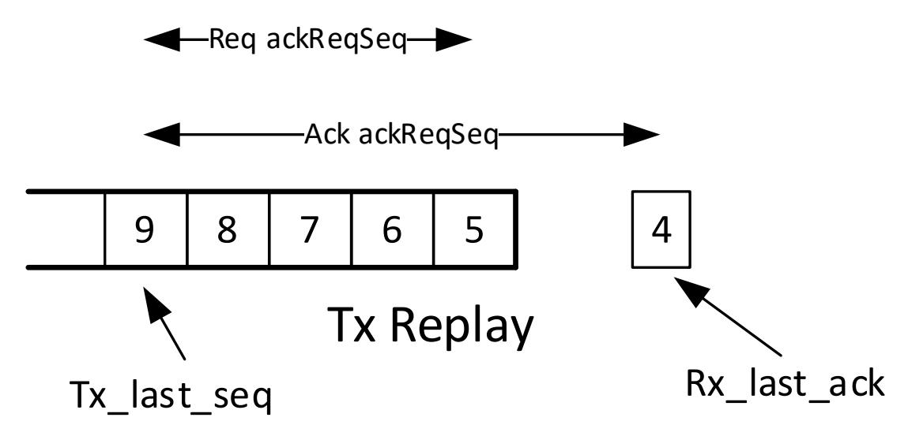

**Figure 6-19 Ack Replay Request valid range**

### **6.6.6.4 Rx Enqueuing Rules**

When an ingress Flit is received that passes CRC Check:

- An Explicit Flit with flitSeqNo equal to 0 is dropped and error is logged.
- If at least one of the following are true regarding the received Flit:

*Data Link* 171

Evaluation Copy

- o It is an Explicit Sequence Number Flit
- o Rx\_ambiguous == 0 and Rx\_replay == 0

### Then

- o If either of the following are true: # expected sequence number
  - Flit is NOP and Rx\_seq\_calc == Rx\_last\_seq\_calc
  - Flit is payload and Rx\_seq\_calc == Rx\_last\_seq\_calc +1

### Then:

- if payload Flit: add Flit to receive queue
- Clear Rx\_unexpected\_count to 0
- Rx\_last\_seq\_calc = Rx\_seq\_calc
- Clear Rx\_replay to 0
- Clear Rx\_ambiguous to 0
- Clear Rx\_bad\_crc\_count to 0

Else if Rx\_replay == 0 then: # unexpected sequence number and not in Replay

- Set Tx\_replay\_req\_count to 3
- Set Rx\_replay to 1
- Clear Rx\_unexpected\_count to 0

Else If Rx\_replay == 1 then:

- o Rx\_unexpected\_count += 1
- o If Rx\_unexpected\_count >= Rx\_replay\_limit
  - Set Tx\_replay\_req\_count to 3
  - Clear Rx\_bad\_crc\_count to 0

### **6.6.6.5 Tx Enqueue Rules**

All the following shall be true, for TxReplay to accept a Flit:

- Tx\_replay == 0
- TxReplay buffer is not full
- There are no more than 255 unacknowledged Flits in TxReplay

When the TxReplay is accepting Flits, the DL shall provide Flits back-to-back. Flits can be either payload or NOP.

### **6.6.6.6 Tx Source Flit Rules**

At every Flit interval a Flit shall be transmitted, assuming it is in the appropriate [DL Link States.](#page-176-1) Flits are be sourced from the TxReplay buffer, during a Standard Replay. Flits are sourced from the normal data flow when not in a Standard Replay. The following describe the rules:

- If Tx\_replay == 1 and there are Flits that are scheduled for replay, then:
  - o Send the next Replay Flit
  - o If all Flits are sent:
    - Set Tx\_replay to 0
- Else: # Tx\_replay == 0
  - o Send the Flit from the DL stream. If the Flit is a payload, then the Flit is added to TxReplay

### **6.6.6.7 Tx Scheduling**

The scheduler decides what type of Flit to send. The rules for this are described below.

- Update Tx\_explicit\_count -= 1
- If Tx\_first\_replay == 1 then:
  - o Clear Tx\_first\_replay to 0
  - o Set Tx\_explicit\_count to 0x7
  - o Set op to Replay (0b001)
- Else if Tx\_explicit\_count <= 0 then:
  - o Set Tx\_explicit\_count to 0x7
  - o If Tx\_replay ==1 then:
    - Set op to Replay (0b001)
  - o Else:
    - Set op to Original (0b000)
- Else if Tx\_replay\_req\_count > 0 and this is a new codeword group since last Replay Request was sent then:
  - o If Tx\_replay\_req\_count == 3 then:
    - Set Tx\_replay\_req\_seq\_no to Rx\_last\_seq\_calc + 1
  - o Tx\_replay\_req\_count -= 1
  - o Set op to Replay Request (0b011)
  - o Set ackReqSeq to Tx\_replay\_req\_seq\_no
- Else:
  - o Set op to Ack (0b010)
  - o Set ackReqSeq to Rx\_last\_seq\_calc

### **6.6.6.8 Tx Forward progress**

The Tx\_ack\_counter is decremented when there are unacknowledged Flits in the Tx Replay buffer, saturating at 0x0. The Tx\_ack\_counter is rearmed to Tx\_ack\_time\_out when an Ack is received that removes Flits from the Tx Replay buffer. If the Tx\_ack\_counter reaches 0 then the DL enters the DL Idle state.

### **6.6.6.9 Rx Flow Chart**

The Rx Flow chart is shown below. Implicit in sectio[n 6.6.6.4](#page-170-1) is that Flits are dropped unless they are explicitly enqueued. This diagram shows the explicit Flit drop and optional error counters being incremented.

**Figure 6-20 Rx Flow Chart**

### **6.6.6.10 Tx Flow Chart**

The Tx Flow chart is shown Below.

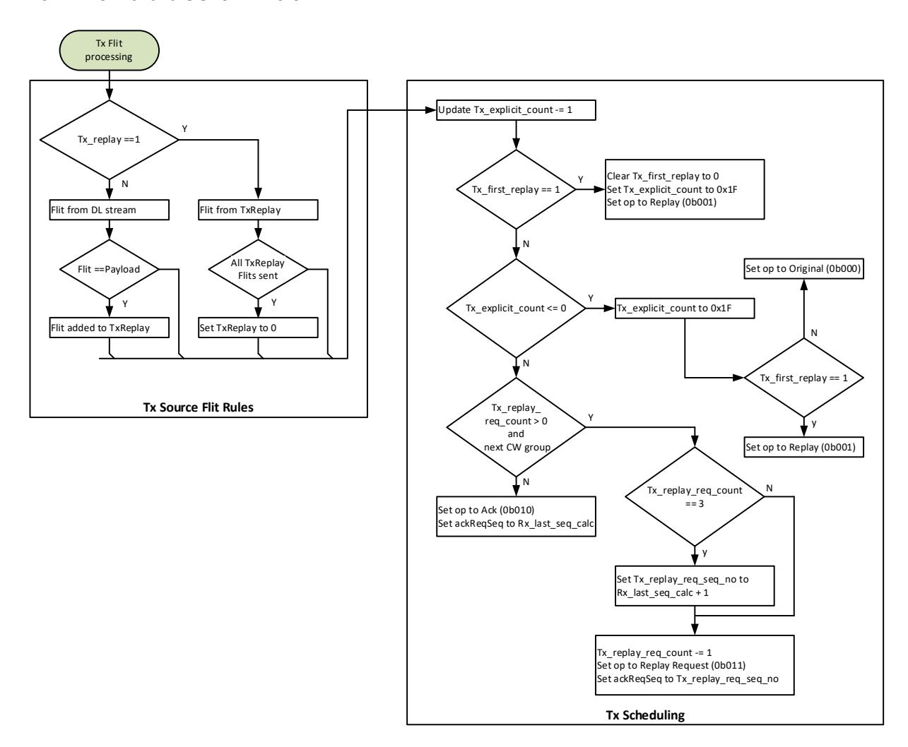

**Figure 6-21 Tx Flow Chart**

### 6.6.7 Round Trip Time

The TxReplay buffer should be sized to cover the round-trip time of the Link, to prevent stalling the transmit pipeline. Once the TxReplay buffer is full the DL will stop accepting data from the TL, and NOP DL Flits will be sent.

The diagram in Figure 6-22 depicts the elements of round-trip time.

Figure 6-22 Round Trip Time

**Ack Latency**: This is the time from the first bit of an Explicit Sequence Number Flit received to the first bit of the Ack Flit, for the indicated sequence number, transmitted. This shall include any worst-case scheduling delay see section 6.6.6.7. Measured at the package pins.

**Release Latency**: This is the time from the first bit of an Ack Flit received to the first bit of the Payload Flit transmitted, when the TxReplay buffer is in a stalled state due to lack of Ack Flits. Measured at the package pins.

**Channel Latency**: This is the propagation time through the channel. This could include up to two Retimers and includes cable and other interconnect delays.

The RRT is equal to the sum of the Ack Latency + Release Latency + 2x channel latency.

Device vendors should publish their Ack Latency and Release Latency on the data sheets, as well Retimer Vendors should publish their latency on the data sheets.

For example, a RTT = 1,000ns for 200GBASE-KR1/CR1 would equal 25,000 bytes, or 40 Flits, rounded up.

# **6.7 Link State and Errors**

# **6.7.1 DL Link States**

The DL link state diagram is shown below.

**Figure 6-23 DL Link State**

The DL has the flowing states:

### **6.7.1.1 DL Fault**

The transmitter shall send Idle if receiving remote fault or send remote fault if a local fault is detected, in accordance with the Link Fault Signaling state machine in the RS. DL Fault is the reset state and can be entered from any state if a local or remote fault is indicated via the Link Fault Signaling state machine in the RS. The DL is link down in this state.

• The next state is DL Idle if the RS is not indicating any fault condition. The RS indicates fault condition when receiving local or remote faults from the PCS.

### **6.7.1.2 DL Idle**

The transmitter shall send Idle. The DL is link down in this state.

- The next state is DL Fault if RS indicates a fault.
- The next state is DL NOP if enabled via a higher layer.

### **6.7.1.3 DL NOP**

The transmitter will send only NOP DL Flits. The RS will inject codewords containing alignment markers or all Idle into the data stream as required. The replay state machine shall not expect ACKs in this state, the link partner may only be transmitting Idle. The DL is link down in this state.

- The next state is DL Fault if RS indicates a fault.
- The next state is DL Up if ten NOP DL Flits have been sent and two consecutive DL flits are received, the received DL Flits may be NOP Flits or payload Flits.

### **6.7.1.4 DL Up**

The transmitter will send only NOP DL Flits or payload DL Flits. The RS will inject codewords containing alignment markers or all Idle into the data stream as required. The DL is link up in this state.

- The next state is DL Fault if RS indicates a fault.
- The next state is DL Idle if four consecutive control Flits are received by the RS.
- The next state is DL Idle if directed from an error containment event, se[e 6.7.4.](#page-177-2)
- The next state is DL Idle if directed from a time out event, see [6.6.6.8.](#page-172-0)

Note: four consecutive control Flits received by the RS, indicates that the link partner has moved to a link down state.

# **6.7.2 Correctable Errors**

Correctable errors are bit errors that may occur in the layers below the DL Replay function. These bit errors are either corrected by the PCS FEC or fail CRC and are replayed. FEC correction statistics are provided in the PCS FEC logic. CRC error counts, and replay counts are provided in the replay logic.

# **6.7.3 Uncorrectable Errors**

Uncorrectable errors may occur at layers above the DL replay function. These data and control paths shall have appropriate parity protection to detect soft or hard errors.

# **6.7.4 Error Containment**

The goal of error containment is to prevent propagation of data that is known to have errors.

### **6.7.4.1 RS and PCS**

Error containment below the DL replay, i.e., RS and PCS is covered by FEC and CRC replay. Only data that passes FEC correction and DL CRC check is forwarded to the TL.

### **6.7.4.2 Data Link**

Ingress Direction: After unpacking, the DL transfers TL Flits to the TL. If any TL Flits are determined to be in error, via parity error or other means, they are flagged as errored to the TL or dropped before transfer to the TL. Subsequent TL Flits are dropped.

Egress Direction: When the TL indicates an errored TL, or a parity error is detected during packing, the CRC for the DL Flit is inverted. This guarantees the DL Flit will fail CRC check at the link partner. Subsequent DL Flits are not sent to the RS, including NOP Flits.

In both cases above the DL goes link down, via a state transition to DL Idle.

# **7 Physical Layer**

# **7.1 Introduction**

UALink Phy is based on 802.3 Ethernet Phy. UALink is defined for 1, 2, or 4 serial lanes running at a serial rate of 212.5Gbps (200GBASE-KR1/CR1, 400GBASE-KR2/CR2, 800GBASE-KR4/CR4) , as well as a lower speed serial rate option of 106.25Gbps (100GBASE-KR1/CR1, 200GBASE-KR2/CR2, 400GBASE-KR4/CR4).

The block diagram is shown below, where \* indicates modifications from IEEE 802.3. The PCS/PMA operates in additional codeword interleave modes, with reduced interleave, to achieve better FEC latency at the cost of decreased burst error correction. The PMD is unmodified from 802.3. Auto Negotiation and Link Training AN/LT is unmodified from 802.3. The 64B/66B encoding is a subset of what 802.3 supports.

The PCS and RS require additional behavior to synchronize DL Flits to codewords, so that 640-byte Flits from the DL fit exactly into one RS(544, 514) codeword. This will optimize latency and minimize replay Flits. The DL generates a CRC as part of each 640-byte DL Flit.

**Figure 7-1 Physical Layer Block Diagram**

Each port of a station can operate at a different data rate under certain error conditions and shall be capable of operating at a different data rates. The expected normal operation is that all Links of a Pod operate at the same data rate. All ports of a station shall be configured to operate at the same width. Port configuration, i.e. 1x4, 2x2, or 4x1 is determined prior to link training via front side network. All bifurcation modes should be supported. At least one bifurcation mode shall be supported.

The RS/PCS/PMA clauses from the 802.3 spec for 100Gbps serial that are defined for UALink are shown below. 100Gbps operation shall be supported.

| Rate             | RS  | FEC, PCS | PMA | interleave |
|------------------|-----|----------|-----|------------|
| 100GBASE-KR1/CR1 | 81  | 82, 91   | 135 | 1-way      |
| 200GBASE-KR2/CR2 | 117 | 119      | 120 | 2-way      |
| 400GBASE-KR4/CR4 | 117 | 119      | 120 | 2-way      |

**Table 7-1 100Gbps Serial Clauses**

The PCS/PMA clauses from the 802.3 spec for 200Gbps serial are shown below. 200Gbps shall be supported. These include the standard interleaves for 802.3 as well as latency reduced modes. The additional UALink latency reduced modes are strongly encouraged but not required.

| Rate                | RS  | PCS | PMA | Codeword interleave |       |                        |  |
|---------------------|-----|-----|-----|---------------------|-------|------------------------|--|
|                     |     |     |     | 802.3               |       | UALink latency reduced |  |
| 200GBASE KR1/CR1 | 117 | 119 | 176 | 4-way               | 2-way | 1-way                  |  |
| 400GBASE KR2/CR2 | 117 | 119 | 176 | 4-way               | 2-way |                        |  |
| 800GBASE KR4/CR4 | 170 | 172 | 176 | 4-way               |       |                        |  |

**Table 7-2 200Gbps Serial Clauses**

# **7.2 Reconciliation Sublayer (RS)**

# **7.2.1 Introduction**

The 64B/66B block encoding is used between the RS and PCS to describe the optional logical interface between the DL sublayer and the physical layer device.

UALink RS supports a subset of functions based on 802.3 RS Clauses listed below for reference.

- Based on clause 81 for CGMII
- Based on clause 117 for 200GMII and 400GMII
- Based on clause 170 for 800GMII

UALink RS supports the following functionality:

- The RS adapts the Flit format of the DL into a stream of 64B/66B blocks.
- Each data direction is independent.
- The RS generates continuous data or control 64B/66B blocks on the transmit path and expects continuous data or control 64B/66B blocks on the receive path.
- The RS participates in link fault detection and reporting by monitoring the receive path for status reports that indicate an unreliable link and generating status reports on the transmit path to report detected link faults to the peer on the remote end of the connecting link.
- Indicate local/remote fault to the DL, to aid in DL link up, link down determination.
- Support only a subset of 802.3 64B/66B encodings.
- Provides DL Flit to codeword alignment. Each 640-byte Flit that the DL generates shall fit exactly into one RS(544,514) codeword.
- Indication to PCS when alignment markers shall be overwritten in the Tx direction, and indication of when alignment markers are received in the Rx direction.
- Indication to DL for start of receive Flit.
- Indication to DL if the received Flit is a control Flit or a data Flit. Only data Flits are passed to the DL. Receiving control Flits Vs Data Flits is used in the DL for link up, link down determination in the DL Link State Machine.

# **7.2.2 Data Flow**

The UALink RS transmits a continuous stream of data or control 64B/66B blocks in the transmit direction and expects a continuous flow of data or control 64B/66B blocks on the receive path. When transmitting Data 64B/66B blocks they are back-to-back, there is no start or terminates blocks demarking the beginning and end of the DL Flit. A transmitted "Flit Code Sequence" consists of 80 consecutive 64B/66B code blocks. A transmitted Flit Code Sequence will have all data code blocks or all control code blocks. Data Flit Code Sequences originate and terminate at the DL. Control Flit Code Sequences originate and terminate at the RS.

From the DL perspective a Data Flit consists of 20, 256 blocks (640 bytes). These are logically serialized/deserialized by the RS into 80, 64B/66B, a Flit Code Sequence.

# **7.2.3 DL Flits**

By default, DL Flit Code Sequences are transmitted by the RS, the DL shall always provide DL Flits (either NOP or payload) to the RS. Only under fault conditions, DL link down (Idle state) or for

alignment marker insertion or Idle Codes for rate adaptation, will the RS transmit a Control Flit Code Sequence and block the DL from sending a DL Flit Code Sequence.

# **7.2.4 Control Flits**

Control Flits Code Sequence are used for the following purposes:

- 1. Link fault signaling
  - a. Local fault
  - b. Remote fault
- 2. When to overwrite alignment markers in Tx Direction.
- 3. When a Flit contains alignment markers in Rx Direction.
- 4. Idle transmission or reception
  - a. for rate matching
  - b. in response to receiving remote fault.

### **7.2.4.1 Idle Flit Code Sequence**

An Idle Flit Code Sequence consists of 80 consecutive 64B/66B control blocks with a block type of 0x1E, and every control code is /I/ in the 64B/66B block.

Idle Flit Code Sequences are transmitted as follows:

- When receiving remote fault indication.
- When the DL is in DL idle link state
- When the DL is in DL up or DL NOP states, see sectio[n 7.3.5](#page-188-2) for rate matching

### **7.2.4.2 Idle Start Flit Code Sequence**

An Idle Start Flit Code Sequence consists of 80 consecutive 64B/66B control blocks with the same content as an Idle Flit Code Sequence except the first eight transmitted 64B/66B control block has a block type of 0x78, and all data bytes are set to 0x00.

Idle Start Flit Code Sequences are transmitted as follows:

• When the RS determines that it is time to send an alignment marker, and the RS determines that it should not be sending Fault Flits, i.e. it is sending data Flits.

### **7.2.4.3 Fault Flit Code Sequence**

A fault Flit Code Sequence consists of 80 consecutive 64B/66B control blocks with a block type of 0x4B, indicating a sequence ordered set. There are two types of fault Flit Code Sequences, local and remote.

Fault Flit Code Sequences are transmitted as follows:

• During certain fault states.

### **7.2.4.4 Fault Start Flit Code Sequence**

A Fault Start Flit Code Sequence consists of 80 consecutive 64B/66B control blocks with the same content as a Fault Flit Code Sequence except the first eight transmitted 64B/66B control block has a block type of 0x78, and all data bytes are set to 0x00.

Fault Start Flit Code Sequences are transmitted as follows:

• When the RS determines that it is time to send an alignment marker, and the RS also determines that it should be sending Fault Flits.

### **7.2.4.5 Start Flit Code Sequences**

There are 2 types of start Flit Code Sequences, Idle Start Flit Code Sequences and Fault Start Flit Code Sequences. These Start Flit Code Sequences are transmitted RS to PCS to indicate the start of a Flit Code Sequence, and to indicate to the PCS when to overwrite an alignment marker. The Flit that is transmitted by the PCS will have the alignment markers in the first four to sixteen 256B/256B block codes, as a function of PCS clause.

### **7.2.4.6 Alignment Marker (AM) Flit Code Sequence**

Alignment marker Flit Code Sequences are only used in the Rx direction PCS to RS and are used by the RS to determine receive Flit alignment. An AM Flit Code Sequence consists of 80 consecutive 64B/66B control blocks. The first n transmitted 64B/66B control blocks have a block type of 0x78, and all data bytes are set to 0xFF. The remaining 64B/66B blocks have a block type of 0x1E, and every control code is /I/ in the 64B/66B block.

The value of n is a function of the length of the alignment markers, which is Clause and data rate dependent:

- Clause 91, 100G: 5\*4 = 20 64B/66B blocks
- Clause 119, 200G: = 4\*4 = 16 64B/66B blocks
- Clause 119, 400G: = 8\*4 = 32 64B/66B blocks
- Clause 172, 800G: = 16\*4 = 64 64B/66B blocks

### AM Flits are transmitted as follows:

• AM flit Code Sequences are sent only when the PCS has achieved alignment lock. They are sent when the PCS is expected or does receive a codeword containing the alignment marker. Bit errors may impact alignment marker detection, this occurs prior to FEC decode. The AM Flit replaces the received Flit containing the alignment marker.

# **7.2.5 Data and Control Blocks and Codes**

A subset of control blocks and codes are supported from 802.3 Clause 82. The supported block codes are shown below.

| Input                      | Sync | Sync Block Payload |                |                |                |   |                |            |   |                |                |  |                |
|----------------------------|------|--------------------|----------------|----------------|----------------|---|----------------|------------|---|----------------|----------------|--|----------------|
| Data                       | 0    |                    |                |                |                |   |                |            |   |                |                |  | 65             |
| Data Block Format          |      |                    |                |                |                |   |                |            |   |                |                |  |                |
| $D_0D_1D_2D_3D_4D_5D_6D_7$ | 01   | $D_0$              | $D_1$          | D 2 | D              | 3 | D 4 |            |   | D 5 | $D_6$          |  | D 7 |
| Control Block Format       |      | Block Type         |                |                |                |   |                |            |   |                |                |  |                |
| $C_0C_1C_2C_3C_4C_5C_6C_7$ | 10   | 0x1E               | C 0 | C 1 | C 2 | ( | C 3 | C,         | 4 | C 5 | C 6 |  | C 7 |
| $S_0D_1D_2D_3D_4D_5D_6D_7$ | 10   | 0x78               | $D_1$          | D 2 | D              | 3 | D 4 |            |   | D 5 | $D_6$          |  | D 7 |
| $O_0D_1D_2D_3Z_4Z_5Z_6Z_7$ | 10   | 0x4B               | $D_1$          | D 2 | D 3 | 3 | O 0 | 0x000_0000 |   |                |                |  |                |

Figure 7-2 64B/66B Block Codes

Data blocks use Sync header 01. Control blocks use sync header 10.

- Block type 0x1E is used for:
  - o Idle, C0 to C7 contain control codes for /I/.
  - o Error, C0 to C7 contain control codes for /E/.
- Block type 0x78 is used for:
  - o start of Flit indication for Flits related to alignment markers, i.e., Idle Start Flit, Fault Start Flit, and AM Flit.
- Block type 0x4B is used for:
  - o sequential ordered sets to indicate local or remote fault.

The sequential ordered set definition is shown below.

| Lane0    | Lane1 | Lane2 | Lane3 | Lane4 | Lane5 | Lane6 | Lane7 | Description          |
|----------|-------|-------|-------|-------|-------|-------|-------|----------------------|
| Sequence | 0x00  | 0x00  | 0x00  | 0x00  | 0x00  | 0x00  | 0x00  | Reserved             |
| Sequence | 0x00  | 0x00  | 0x01  | 0x00  | 0x00  | 0x00  | 0x00  | Local fault          |
| Sequence | 0x00  | 0x00  | 0x02  | 0x00  | 0x00  | 0x00  | 0x00  | Remote fault         |
| Sequence | 0x00  | 0x00  | 0x03  | 0x00  | 0x00  | 0x00  | 0x00  | Link Interruption |

**Table 7-3 Sequential Ordered Sets** 

The following control codes are supported.

| Control Character | Notation | 64B/66B code |
|-------------------|----------|--------------|
| Idle              | /I/      | 0x00         |
| Error             | /E/      | 0x1E         |

### 7.2.6 Link fault signaling

Link fault signaling follows the 802.3 clause 81.3.4 with the exceptions described below.

Sublayers within the PHY are capable of detecting faults that render a link unreliable for communication. Upon recognition of a fault condition a PHY sublayer indicates Local Fault status on the data path. When this Local Fault status reaches an RS, the RS stops sending DL data Flits, and

Physical Layer

continuously generates a Remote Fault Flits on the transmit data path. When a Remote Fault Flit is received by an RS, the RS stops sending DL data Flits, and continuously generates Idle Flits. When the RS no longer receives fault status messages, it returns to normal operation, sending DL data Flits.

In the transmit direction all Link Fault indication shall transition on a Flit boundary. In the receive direction Link Fault indication is not required to transition on a Flit boundary, Retimers may not transition on a Flit boundary.

• Note: Standard Ethernet Retimers are not Flit aware.

The Link Fault sate diagram in 81.3.4 is modified as follows:

- When an AM Flit is received col\_cnt is not updated.
- 64B/66B encoding is used.

# **7.2.7 Flit and Lane Alignment**

In the transmit direction Start Flit Code Sequences are send at the interval required for the PCS to transmit alignment markers as a function of data rate:

- 100G: every 4,096 Flits
- 200G: every 4,096 Flits
- 400G: every 8,192 Flits
- 800G: every 16,384 Flits

The PCS shall overwrite the first n 257-bit blocks with alignment markers as a function of data rate:

- 100G: the first 5, 257-bit blocks
- 200G: the first 4, 257-bit blocks
- 400G: the first 8, 257-bit blocks
- 800G: the first 16, 257-bit blocks

The Start Flit Code Sequence in the transmit direction provides Flit synchronization to the PCS, so that each Flit is packed into a RS(5440, 5140) codeword.

In the Receive direction the alignment markers provide lane deskew and reorder to the PCS. In addition, the Start Flit Code Sequence is converted to an AM Flit Code Sequence by the PCS, and this provides Flit synchronization for the RS.

# **7.2.8 Receive State Machine**

The RS in the Rx direction shall determine the alignment of each group of 80 \* 64B/66B blocks that are destined for the DL. The receipt of the first 64B/66B block from the AM Flit indicates the nominal timing for each group of 80 \* 64B/66B blocks. Due to rate matching and Idle insertion or deletion this timing may need to be adjusted.

If Idles are inserted between DL Flits in the PCS for rate matching, then these Idles are consumed by the RS, the sync header indicates 0b10 for control codes. In addition, Idles are also found in the groups of the 80 \* 64B/66B blocks corresponding to Idle Flit Code Sequence, Idle Start Flit Code Sequence, or AM Flit Code Sequence . These are also consumed by the RS.

If Idles are removed from Idle Flit Code Sequence, Idle Start Flit Code Sequence, or AM Flit Code Sequence, the DL Flit will occur earlier than the nominal 80 \* 64B/66B block.

When the RS receives a sync header of 0b01 indicating data and the previous sync header was 0b10 indicating control, this always indicates the start of a Data Flit and all 80 \* 64B/66B blocks are sent to the DL. When the RS receives a sync header of 0b01 indicating data and a Data Flit was just received and sent to the DL, then the next 80 \* 64B/66B blocks are sent to the DL. This indicates the typical case of back-to-back DL Flits.

# **7.3 PCS/PMA modifications**

# **7.3.1 Introduction**

The various PCS/PMA clauses of 802.3 are modified in several ways:

- 1. Alignment markers frequency is determined by the RS, and they are used in the normal purpose of lane deskew and lane reorder, and in addition to align Flits to RS(544, 514) codewords.
- 2. Provide reduced codeword interleave ways to reduce latency.
- 3. No decode encode, the interface is specified at 64B/66B encoding.

# **7.3.2 DL Flit to PCS codeword alignment**

In Order to maintain DL Flit to PCS codeword alignment The RS designates an entire Flit for the purpose of transmitting the alignment markers. The PCS operation is slightly different than 802.3. Alignment markers are not inserted which would impact Flit to codeword alignment. Alignment markers are overwritten into the designated Start Flit Code Sequences.

In the transmit direction the PCS overwrites the first several 257-bit blocks (same step as alignment insertion) of the Start Flit Code Sequence with the alignment markers specified in the 802.3 clauses (91, 119, 172). The PCS uses the Start Flit Code Sequence to align groups of 80, 64B/66B blocks into one RS(544, 514) code word.

In the receive direction the Flit Code Sequences containing (or should contain) the alignment markers are converted to AM Flit Code Sequences in the PCS and used for Flit alignment by the RS. Flit Code Sequences are sent only when the PCS has achieved alignment. The AM Flit Code Sequence replaces the received Flit Code Sequence according to the alignment lock determined in the PCS.

The alignment markers on the wire are identical to 802.3, and serve the same purpose, lane deskew, and an additionally provide DL Flit alignment on Receive.

When developing the IP that exposes the 64B/66B interface between RS and PCS the DL Flit to PCS codeword alignment shall implement as specified in this chapter.

When developing IP that does not expose the 64B/66B interface, the DL Flit to codeword alignment may be implemented with a different mechanism, providing the behavior is identical on the wire, e.g. one DL Flit is contained in one codeword, and the codewords containing the alignment markers are as specified. For example, an implementation could have the PCS alignment insertion logic send a pulse to the RS indicating when it is inserting the alignment marker, and the RS would send the appropriate 256B/257B blocks, such that the insertion occurs just before the appropriate 256B/257B blocks. On the receive side the alignment markers are removed, and a side band signal indicates this, such that the RS can determine DL Flit alignment.

# **7.3.3 Reduced FEC interleave**

Additional PCS/PMA behavior at 200G and 400G that is different than 802.3 is defined as shown below. These options have less codeword interleave, and thus faster FEC decode time, with higher post FEC BER.

| Rate             | RS  | PCS  | PMA  | interleave |
|------------------|-----|------|------|------------|
| 200GBASE-KR1/CR1 | 117 | 119* | 176* | 1-way      |
| 200GBASE-KR1/CR1 | 117 | 119  | 176* | 2-way      |
| 400GBASE-KR2/CR2 | 117 | 172  | 176* | 2-way      |

**Table 7-4 Reduced Interleave FEC**

# **7.3.4 Decode Encode**

UALink is specified at the 64B/66B encoding level, and such encode/decode from xGMI is not defined.

# **7.3.5 Rate Matching**

The Tx RS injects Idle Flit code sequences at a rate of every 1024 codewords when the DL is in the DL up or DL NOP state, except when a codeword containing the alignment marker is sent. The codeword containing the alignment markers contain Idle Codes, which can be used for rate matching.

• Note: there are no natural idle code blocks with UALink as the DL Flits are packed exactly into a code word. With Ethernet there is IPG which results in sufficient idle code blocks for rate matching or clock compensation on the Rx.

When the DL is in the DL Idle or DL Fault state, there are continuous Idle codes, or sequence ordered sets to remove/add if needed for rate adaption.

See IEEE 802.3 clauses, 82.2.3.6 Idle (/I/) and 82.2.3.9 ordered set (/O/), for rules on rate matching.

Addition or removal of Idle codes or removal of sequence ordered sets shall occur on a 64B/66B block basis. This rule is more restrictive than clauses 82.2.3.6.

• Note: implementations that do not expose IP and the 64B/66B interface may choose to use a 256B/257B interface to skip the transcoding step. In this case the addition or removal of Idle codes or removal of sequence ordered sets shall occur on a four naturally aligned 64B/66B block or a single 256B/257B block.

\* Modified clauses for interleave.

# Evaluation Copy

### **Ultra Accelerator Link Consortium Inc. (UALink) - UALink\_200 Rev 1.0 Specification**

The insertion of Idle Codes may occur between Data Flits and shall not occur in the middle of a Data Flit. Idle codes may be deleted from codewords containing alignment markers, or from an Idle code sequence, as needed.

The following subsections describe the transmit sequence when the DL is in the DL up or DL NOP state.

### **7.3.5.1 Tx Sequence 200GBASE-KR1/CR1**

The Tx sequence is as follows; alignment markers sent every 4096 codewords.

- 1. Codeword 0: Idle Start Flit Code Sequence, i.e. alignment marker indication
- 2. Codeword 1-1023: NOP or payload Flits
- 3. Codeword 1024: Idle Flit Code Sequence
- 4. Codeword 1025- 2047: NOP or payload Flits
- 5. …
- 6. Codeword 4096: Idle Start Flit Code Sequence, i.e. alignment marker indication
- 7. …

### **7.3.5.2 Tx Sequence 400GBASE-KR2/CR2**

The Tx sequence is as follows; alignment markers sent every 8192 codewords.

- 1. Codeword 0: Idle Start Flit Code Sequence, i.e. alignment marker indication
- 2. Codeword 1-1023: NOP or payload Flits
- 3. Codeword 1024: Idle Flit Code Sequence
- 4. Codeword 1025- 2047: NOP or payload Flits
- 5. …
- 6. Codeword 8192: Idle Start Flit Code Sequence, i.e. alignment marker indication
- 7. …

### **7.3.5.3 Tx Sequence 800GBASE-KR4/CR4**

The Tx sequence is as follows; alignment markers sent every 16384 codewords.

- 1. Codeword 0: Idle Start Flit Code Sequence, i.e. alignment marker indication
- 2. Codeword 1-1023: NOP or payload Flits
- 3. Codeword 1024: Idle Flit Code Sequence
- 4. Codeword 1025- 2047: NOP or payload Flits
- 5. …
- 6. Codeword 16384: Idle Start Flit Code Sequence, i.e. alignment marker indication
- 7. …

# **7.3.6 Back-to-Back DL Flits**

640-byte DL Flits are sent continuously, there is no IPG, start or terminate between DL Flits. With the exceptions noted above for control Flits, i.e. alignment markers and rate matching.

# **7.4 PCS and FEC for 100GBASE-R**

802.3 PCS Clause 82 and FEC Clause 91 are used for 100GBASE-KR1/CR1. Shown below is a simplified block diagram. Simplified in that UALink does not include the conversion of 20 FEC lanes into 4 PCS lanes, and the mapping of alignment markers. Colored blocks indicate changes from 802.3.

**Figure 7-3 100GBASE-R**

# **7.4.1 Removed functional Blocks**

Several functional blocks are made redundant when Clause 91 is added to clause 82. These are not present with UALink.

*Physical Layer* 191

### **7.4.1.1 Transmit direction**

- Clause 82.2.6 Block distribution
- Clause 82.2.7 Alignment marker Insertion
- Clause 91.5.2.1 Lane block synchronization
- Clause 91.5.2.2 Alignment lock and deskew
- Clause 91.5.2.3 Lane reorder
- Clause 91.5.2.4 Alignment marker removal

### **7.4.1.2 Receive Direction**

- Clause 91.5.3.6 Block distribution
- Clause 91.5.3.7 Alignment marker mapping and insertion
- Clause 82.2.12 block synchronization
- Clause 82.2.13 PCS Lane deskew
- Clause 82.2.14 PCS Lane reorder
- Clause 82.2.15 alignment marker removal

# **7.4.2 Transmit Function**

## **7.4.2.1 Scrambler**

See 802.3 clause 82.2.5, with the following additional requirements. The Start Flit Code Sequence's first twenty 64B/66B blocks bypass the scrambler, and the scrambler is not advanced. This allows the Alignment Overwrite block to decode the Start Flit Code Sequence and overwrite the first five 256B/257B blocks with the required alignment marker.

### **7.4.2.2 Transcode**

See 802.3 clause 91.5.2.5.

### **7.4.2.3 Alignment Marker Overwrite**

When a Start Flit Code Sequence is detected the alignment marker overwrite replaces the first five 256B/257B blocks with the alignment marker specified in 91.5.2.6.

### **7.4.2.4 FEC Encode**

See 802.3 clause 91.5.2.7. Only RS(544, 514) is supported.

### **7.4.2.5 Symbol distribution**

See 802.3 clause 91.5.2.8.

### **7.4.2.6 Transmit bit ordering**

See 802.3 clause 91.5.2.9.

# **7.4.3 Receive Function**

### **7.4.3.1 Alignment Lock and Deskew**

See 802.3 91.5.3.1. Static and dynamic deskew not required, this is a single lane.

### **7.4.3.2 Lane Reorder**

See 802.3 clause 91.5.3.2.

### **7.4.3.3 FEC decode**

See 802.3 clause 91.5.3.3. Only RS(544, 514) is supported.

### **7.4.3.4 Alignment Overwrite**

The Flit Code Sequence that is expected to contain the alignment markers (there could be bit errors) based on the alignment lock, is converted to an AM Flit Code Sequence.

### **7.4.3.5 Transcoder**

See 802.3 clause 91.5.3.5.

### **7.4.3.6 Descrambler**

See 802.3 clause 82.2.16, with the following additional requirements. The first twenty 64B/66B blocks of an AM Flit Code Sequence bypass the descrambler, and the descrambler is not advanced. The remaining sixty 64B/66B blocks of an AM Flit Code Sequence are descrambled, and the descrambler is advanced. This enables the RS to decode the AM Flit, and the Rx descrambler to stay synchronized with the Tx scrambler.

# **7.5 PCS for 200GBASE-R and 400GBASE-R**

802.3 Clause 119 PCS is used for 200GBASE-KR1/CR1, 200GBASE-KR2/CR2, 400GBASE-KR2/CR2 and 400GBASE-KR4/CR4. Shown below is the modified block diagram to support UALink. Colored blocks indicate changes from 802.3.

**Figure 7-4 200GBASE-R & 400GBASE-R**

# **7.5.1 Transmit Function**

### **7.5.1.1 Transcode**

See 802.3 clause 119.2.4.2.

### **7.5.1.2 Scrambler**

See 802.3 clause 119.2.4.3, with the following additional requirements. The Start Flit Code Sequence's first four/eight 256B/257B blocks bypass the scrambler, for 200G/400G operation. This allows the Alignment Overwrite block to decode the Start Flit Code Sequence and overwrite the first four or eight 256B/257B blocks with the required alignment marker.

### **7.5.1.3 Alignment Marker Overwrite**

When a Start Flit Code Sequence is detected the alignment marker overwrite replaces the first four 256B/257B blocks with the alignment marker specified in 119.2.4.4.1 for 200GBASE-R, or the first eight 256B/257B blocks with the alignment marker specified in 119.2.4.4.2 for 400GBASE-R.

### **7.5.1.4 Pre-FEC distribution**

See 802.3 clause 119.2.4.5.

### **7.5.1.5 FEC Encoder**

See 802.3 clause 119.2.4.6.

### **7.5.1.6 Distribution and interleave**

See 802.3 clause 119.2.4.7.

### **7.5.1.7 Transmit bit ordering**

See 802.3 clause 119.2.4.8.

### **7.5.1.8 Test pattern generator**

See 802.3 clause 119.2.4.9.

# **7.5.2 Receive Function**

### **7.5.2.1 Alignment Lock and deskew**

See 802.3 clause 119.2.5.1.

### **7.5.2.2 Lane reorder and de-interleave**

See 802.3 clause 119.2.5.2.

### **7.5.2.3 FEC decoder**

See 802.3 clause 119.2.5.3.

### **7.5.2.4 Post FEC interleave**

See 802.3 clause 119.2.5.4.

### **7.5.2.5 Alignment Marker Overwrite**

The Flit Code Sequence that is expected to contain the alignment markers (there could be bit errors) based on the alignment lock, is converted to an AM Flit Code Sequence.

### **7.5.2.6 Descrambler**

See 802.3 clause 119.2.5.6, with the following additional requirements. The first four/eight 256B/257B blocks of an AM Flit Code Sequence bypass the descrambler, and the descrambler is not advanced, for 200G/400G operation. The remaining sixteen/twelve 256B/257B blocks of an AM Flit Code Sequence are descrambled, and the descrambler is advanced. This enables the RS to decode the AM Flit Code Sequence, and the Rx descrambler to stay synchronized with the Tx scrambler.

### **7.5.2.7 Transcoder**

See 802.3 clause 119.2.5.7.

# **7.6 PCS for 800GBASE-R**

802.3 Clause 172 PCS is used for 800GBASE-KR4/CR4. Shown below is the modified block diagram to support UALink. Colored blocks indicate changes from 802.3.

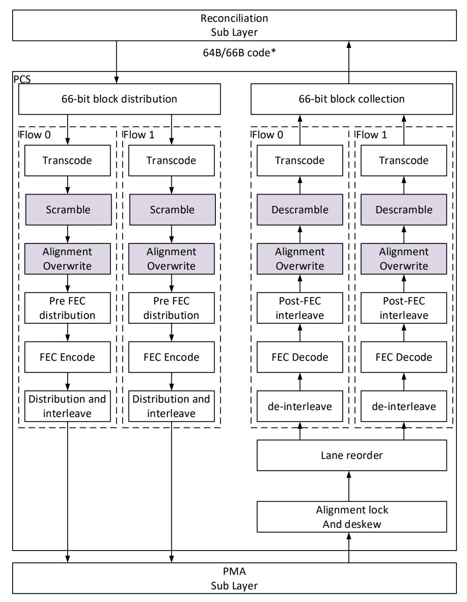

**Figure 7-5 800GBASE-R**

# **7.6.1 Transmit Function**

### **7.6.1.1 Block Distribution**

See 802.3 clause 172.2.4.3.

### **7.6.1.2 Transcoder**

See 802.3 clause 172.2.4.4.

### **7.6.1.3 Scrambler**

See 802.3 clause 172.2.4.5, with the following additional requirements. The Start Flit Code Sequence's first sixteen 256B/257B blocks bypass the scramblers. There are two flows, each flow bypasses the eight 256B/257B blocks. This allows the Alignment Overwrite block to decode the Start Flit Code Sequence and overwrite the first eight 256B/257B blocks (per flow) with the required alignment markers.

### **7.6.1.4 Alignment Marker Overwrite**

When a Start Flit Code Sequence is detected the alignment marker overwrites the first eight 256B/257B blocks with the alignment marker specified in 172.2.4.6. There are two flows, each flow overwrites the first eight 256B/257B blocks, see figure 172-3 in 802.3 spec.

### **7.6.1.5 Pre-FEC distribution**

See 802.3 clause 172.2.4.7.

### **7.6.1.6 FEC Encoder**

See 802.3 clause 172.2.4.8.

### **7.6.1.7 Symbol distribution**

See 802.3 clause 172.2.4.9.

### **7.6.1.8 Transmit bit ordering**

See 802.3 clause 172.2.4.10.

### **7.6.1.9 Test Pattern Generation**

See 802.3 clause 172.2.4.11.

Evaluation Copy

# **7.6.2 Receive Function**

### **7.6.2.1 Alignment lock and deskew**

See 802.3 clause 172.2.4.1.

### **7.6.2.2 Lane reorder and de-interleave**

See 802.3 clause 172.2.4.2.

### **7.6.2.3 FEC decode**

See 802.3 clause 172.2.4.3.

### **7.6.2.4 Post FEC interleave**

See 802.3 clause 172.2.4.4.

### **7.6.2.5 Alignment Marker Overwrite**

The Flit Code Sequence that is expected to contain the alignment markers (there could be bit errors) based on the alignment lock, is converted to an AM Flit Code Sequence. There are two flows, each flow creates ½ an Interleaved AM Flit Code Sequence. Even 64B/66B blocks on flow 0, odd 64B/66B blocks on flow 1. Each ½ AM Flit Code Sequence is identical and contains the following:

- Thirty-two 64B/66B block type of 0x78, and all data bytes are set to 0xF
  - o Transcoded to Eight 256B/257B blocks
- Eight 64B/66B block type of 0x78, and all data bytes are set to 0xFF
  - o Transcoded to Two 256B/257B blocks

### **7.6.2.6 Descrambler**

See 802.3 clause 172.2.4.6, with the following additional requirements. The first eight 256B/257B blocks (per flow) of an AM Flit Code Sequence bypass the descrambler, and the descrambler is not advanced. The remaining twelve 256B/257B blocks of an AM Flit Code Sequence are descrambled, and the descrambler is advanced. This enables the RS to decode the AM Flit, and the per flow Rx descrambler to stay synchronized with the per flow Tx scrambler.

### **7.6.2.7 Transcoder**

See 802.3 clause 172.2.4.7.

### **7.6.2.8 Block collection**

See 802.3 clause 172.2.4.8.

# **7.7 Low Latency FEC Interleave**

# **7.7.1 400GBASE-KR2/CR2 (2-way interleave)**

802.3 specification defines 4-way interleave of 400GBASE-KR2/CR2. 2-way interleave occurs in the PCS via 10-bit distribution to two FEC encoders, see Clause 119.2.4.8. An additional 2-way interleave occurs in the PMA via delaying odd symbols 2 codewords, see Clause 176.4.2.4.2, for a total of 4-way interleaving.

UALink defines a mode of operation for 2-way interleave.

- Clause 176.4.2.4.2 in the transmit direction is modified as follows: The PMA does not perform the additional two codeword delay.
- Clause 176.4.3.3 in the receive direction is modified as follows: The PMA adds a delay of only one FEC symbol to each even lane (not 69 FEC symbols).

# **7.7.2 200GBASE-KR1/CR1 (2-way interleave)**

802.3 specification defines 4-way interleave of 200GBASE-KR1/CR1. 2-way interleave occurs in the PCS via 10-bit distribution to two FEC encoders, see Clause 119.2.4.8. An additional 2-way interleave occurs in the PMA via delaying odd symbols 2 codewords, see Clause 176.4.2.4.2, for a total of 4-way interleaving.

UALink defines a mode of operation for 2-way interleave.

- Clause 176.4.2.4.2 in the transmit direction is modified as follows: The PMA does not perform the additional two codeword delay.
- Clause 176.4.3.3 in the receive direction is modified as follows: The PMA adds a delay of only one FEC symbol to each even lane (not 137 FEC symbols).

# **7.7.3 200GBASE-KR1/CR1 (1-way interleave)**

802.3 specification defines 4-way interleave of 200GBASE-KR1/CR1. 2-way interleave occurs in the PCS via 10-bit distribution to two FEC encoders, see Clause 119.2.4.8. An additional 2-way interleave occurs in the PMA via delaying odd symbols 2 codewords, see Clause 176.4.2.4.2, for a total of 4-way interleaving.

UALink defines a mode of operation for 1-way interleave.

• Clause 176.4.2.4.2 in the transmit direction is modified as follows: The PMA does not perform the additional two codeword delay.

• Clause 176.4.3.3 in the receive direction is modified as follows: The PMA adds a delay of one FEC symbol to each even lane (not 137 FEC symbols).

Note: RS symbols are interleaved in symbol-pairs (consistent with CL176).

In addition, the PCS does not perform 10-bit symbol distribution to two FEC encoders, to reduce to 1-way interleave.

### **7.7.3.1 PCS Transmit changes**

Clause 119.2.4.5 Pre-FEC distribution is not performed and a single FEC encoder is used. 802.3 figure 119-10 is updated as follows.

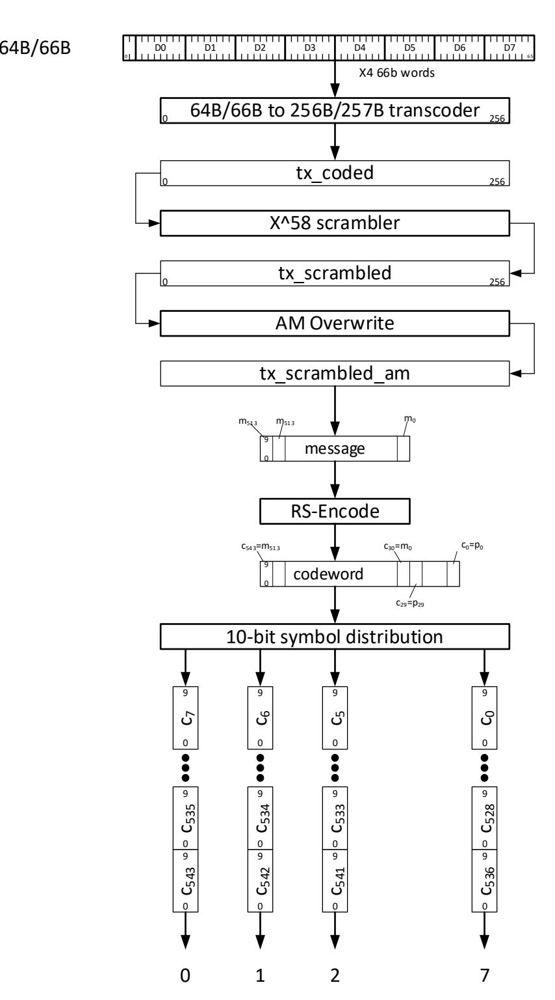

**Figure 7-6 200GBASE-KR1/CR1, 1-Way Interleave** 

### **7.7.3.2 PCS Receive changes**

The following Clauses of 802.3 are modified:

• Clause 119.2.5.2 Lane reorder and de-interleave, de-interleave is not performed, and the single stream is sent to a single FEC decode.

*Physical Layer* 201

• Clause 119.2.5.4 Post FEC interleave is not performed, there is a single stream from the FEC decode.

# **8 Manageability Requirements**

A UALink Pod is comprised of one or more UALink Accelerators connected via the UALink fabric, and managed by a UALink Pod Controller. Each Accelerator is hosted on a UALink System Node, and Accelerator traffic may be routed through the UALink fabric via UALink Switches. Multiple UALink Pods may be connected to create even larger Accelerator clusters; however, inter-Pod communication is outside the scope of this specification. While a brief overview of these components and their management interfaces is provided below, the full solution is documented in the separate *Ultra Accelerator Link Manageability Specification.*

# **8.1 UALink Accelerators and System Nodes**

UALink System Nodes shall contain at least one UALink Accelerator, at least one high-performance host CPU to schedule and launch compute jobs, and at least one network interface. Commonly, a System Node should also include a baseboard management controller (BMC) for chassis management tasks and an interface for out-of-band management. The System Node acts as an OS Domain in that a single instance of an operating system or hypervisor may utilize all Accelerators in the System Node, or assign them to tenant Virtual Machines (VMs).

Each System Node shall host one or more Node Management Agents that communicate with the Pod Controller as specified in the *Ultra Accelerator Link Manageability Specification.* Node Management Agents perform fabric management functions on the System Node such as adding Accelerator(s) on the System Node to a Virtual Pod by configuring the UALink ports. In the case of SR-IOV enabled Accelerators, the Node Management Agents shall only communicate with the Physical Function (PF) drivers that run in the host OS domain and are outside the trust boundary of any confidential VM.

In aggregate across the Pod, the System Nodes may host up to 1024 Accelerators. Accelerators targeted for a Confidential Compute[1](#page-202-4) use case must support a minimum baseline of security features.

The following figure illustrates one possible UALink System node with four UALink Accelerators (each with three ports), two host CPUs, a NIC, and a BMC.

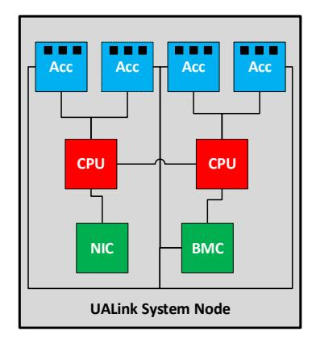

**Figure 8-1 UALink System Node**

# **8.2 UALink Switches and Switch Platforms**

*Manageability Requirements* 203

1 https://confidentialcomputing.io/

UALink Switches are responsible for routing traffic between Accelerators, and are managed by software/firmware called a Switch Management Agent. Physical Switches are implemented in hardware, but may be partitioned into multiple Switches for purposes of routing and creating Virtual Pods.

Often, Physical Switches are hosted on Switch Platforms that run the Switch Management Agent on a processor (such as an x86 CPU or a Baseboard Management Controller). The processor is attached to each Physical Switch via a high-speed interface such as PCIe, as well as to a network interface for communication with the Pod Controller. Commonly, for security and identity purposes, a Switch Platform contains one or more e/iRoTs (Root of Trust) and/or a trusted platform module (TPM). A Switch Platform may contain a separate BMC for platform management.

The Switch Management Agent shall interface with the Switches as specified in the *Ultra Accelerator Link Manageability Specification.* Detailed requirements for UALink Switches are included in the *Switch Requirements* chapter of this specification.

The following figure illustrates one possible UALink Switch Platform with a Switch Management Agent running on a processor, managing two Physical Switches each with six ports. In this implementation, the processor and Physical Switches are separate devices. The Switch Platform also contains a NIC, a TPM, and a BMC separate from the processor.

**Figure 8-2. A UALink Switch Platform**

# **8.3 UALink Pod Controller**

The UALink Pod Controller software shall act as the centralized manager of the Pod's resources, and should run external to the System Nodes and Switch Platforms under its management. Its responsibilities include:

- Pod resource configuration
- Validation of Pod wiring against UALink rules and user-defined policies
- Allocation and assignment of Accelerator IDs
- Setup and teardown for Switch routing
- Managing Pod RAS including error recovery and log collection
- Pod health management
- Pod telemetry collection

The Pod Controller interacts with several interfaces relating to the Pod:

- It connects with each Node Management Agent to assign Accelerator IDs.
- It connects with each Switch Management Agent to configure ports and set up routing information for the Pod.
- It may connect to each Switch Platform or System Node's BMC to do out-of-band management such as via Redfish[2](#page-203-2) .

*Manageability Requirements* 204

2 https://www.dmtf.org/standards/redfish

• It may present one or more Pod-external interfaces such as a REST API, GUI, or command terminal.

A singular Pod Controller manages the Pod at any given time. However, implementations should consider Pod Controller architectures that permit high availability/redundancy/failover.

The following figure illustrates a UALink Pod containing a Pod Controller, three Switch Platforms, and three System Nodes. Each Switch Platform features a single Physical Switch with twelve ports, managed by a Switch Management Agent. Each System Node features four Accelerators, each with three ports. The Pod Controller utilizes multiple logical interfaces for both managing the Pod as well as for interaction outside of the Pod.

**Figure 8-3. A UALink Pod managed by a Pod Controller**

# **8.4 UALink Virtual Pods**

A workload may require all the Accelerators in a Pod to meet its compute needs or it may require only a subset of the Accelerators. To use the Pod resources efficiently, the Pod Controller may permit partitioning the Pod into Virtual Pods. The Virtual Pods are assignable to individual tenants, allowing multiple tenants to share the Pod and run their workload in their respective partitions concurrently. These Virtual Pods may be restricted to a single Accelerator within a System Node,

may encompass multiple Accelerators within the same System Node, or may span multiple System Nodes (up to all the Accelerators in the Pod) via the Switches. Virtual Pods also require compute and network resources (i.e., for use by virtual machines that run on the System Node's host CPUs).

An Accelerator shall not belong to more than a single Virtual Pod at a given time. Further, Accelerators that are members of a Virtual Pod shall be assigned as a whole; fractional assignment of Accelerators is not permitted in a Virtual Pod. If SR-IOV is utilized on an SR-IOV capable Accelerator, only a single SR-IOV Virtual Function (VF) shall be configured (even when the Accelerator supports multiple VFs). The VF shall be assigned to the VM on the System Node to which the Accelerator is attached.

Each System Node participating in a Virtual Pod hosts the tenant VM, and the appropriate Accelerators on the System Node are assigned to that VM. The VM hosts the device driver, e.g. VF drivers for SR-IOV supported Accelerators, that send control messages to the Accelerator for configuring the Accelerator including the UALink ports (VM/VF specific configuration) and programming the device for data transfers between VM and Accelerator and between peer Accelerators in a Virtual Pod.

The following figure illustrates a UALink Pod that has been partitioned by the Pod Controller into three Virtual Pods. Virtual Pod 1 contains a subset of the Accelerators in System Node 1. Virtual Pod 2 contains a subset of the Accelerators in both System Nodes 1 and 2. Virtual Pod 3 contains all the accelerators in System Node 3. One Accelerator on System Node 2 is not part of any Virtual Pod and is excluded from routing tables on the Switches.

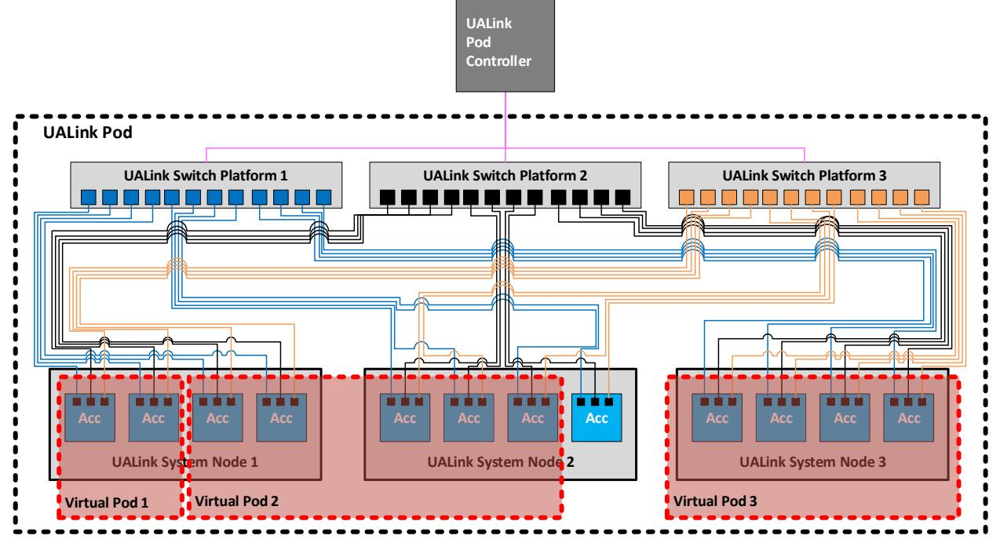

**Figure 8-4. A UALink Pod partitioned into three Virtual Pods**

# **8.5 Manageability Workflows**

The requirements for managing a UALink Pod are documented in the *Ultra Accelerator Link Manageability Specification*, including workflows for:

- Accelerator and Switch admission to the Pod
- Pod topology discovery and validation
- Switch configuration including partitioning and routing table setup
- Virtual Pod creation
- Link, Accelerator, and Switch failure and recovery
- Error reporting such as drop counters and link state changes
- Accelerator telemetry such as transmit/receive statistics
- Switch telemetry such as port-level statistics and Switch health reporting

# **9 Security**

The UALink link Protection feature, referred to as UALinkSec, is intended to protect traffic on a UALink network from a physically present adversary; the adversary might be present at the time of the attack or may have placed a device (e.g., an interposer) to snoop or tamper with the UALink traffic. Additionally, in platforms that support Confidential Computing (CC), UALinkSec protects the Tenant data on a UALink network from the infrastructure provider and from other Tenants potentially collocated on the same UALink cluster. CC implies that a Trusted Execution Environment (e.g., Intel TDX, AMD SEV and ARM CCA) exists on the platform; the TEE under the control of the Tenant is responsible for UALinkSec configuration. When enabled, UALinkSec minimally provides data confidentiality and optionally data integrity (including replay protection). The next section provides an example of system used to illustrate UALinkSec principles followed by the Security Model in Section [9.3.](#page-208-0)

# **9.1 References**

SPDM: Security Protocol and Data Model (SPDM) over MCTP Binding Specification:

<https://www.dmtf.org/dsp/DSP0275>

AES-GCM: NIST Special Publication 800-38D Recommendation for Block Cipher Modes of Operation- Galois/Counter Mode (GCM) and GMAC:

<https://nvlpubs.nist.gov/nistpubs/Legacy/SP/nistspecialpublication800-38d.pdf>

NIST Recommendation for Block Cipher Modes of Operation: Galois/Counter Mode (GCM) and GMAC:

<https://csrc.nist.gov/pubs/sp/800/38/d/final>

TDISP: Refer to PCIe Express specification for TDISP:

<https://pcisig.com/specifications>

Key Derivation Function: NIST reference for Key Derivation Functions<https://nvlpubs.nist.gov/nistpubs/SpecialPublications/NIST.SP.800-56Cr2.pdf>

# **9.2 System Overview**

An UALink Pod is comprised of a set of System Nodes each of which may have one or more accelerators. Each accelerator will have one or more UALink ports. The accelerators within the POD communicate with each other via a switch-based UALink fabric. It is assumed that every accelerator in a POD can communicate with every other accelerator in the POD. The Pod shall be managed by a central Pod Controller software, running on platform(s) outside of the Pod, that works in concert

# Evaluation Copy

### **Ultra Accelerator Link Consortium Inc. (UALink) - UALink\_200 Rev 1.0 Specification**

with Node Management Agents on the System Node. The system software such as host OS and hypervisor are responsible for performing actual resource management and scheduling on each System Node as directed by the Pod Controller.

When a tenant workload needs to run on a Pod, the Pod Controller may create a Virtual Pod that contains the number of accelerators needed by the tenant and configure the accelerator's UALink ports as well as the UALink switches for communication within that Virtual Pod. Each System Node shall run tenant software, such as a tenant VM, and the accelerators (including the UALink ports) that are part of tenant's Virtual Pod shall be assigned to the tenant VM, with the actual assignment tasks performed by the OS or hypervisor on the System Nodes.

The tenant VMs on each System Node shall configure the accelerators including programming of tenant specific keys. The tenant VMs belonging to different System Nodes may communicate using frontside networking regarding configuration and programming of accelerators in the Virtual Pod level.

There are two distinct role-based software execution domains; one is the infrastructure owner controlled remote and local management software (and firmware) that manage compute and networking resources at Pod and System Node level and the other is the tenant software that run on the compute resources assigned to it and use the UALink network to allow its accelerators to access each other's data. The UALink security for confidential computing use requires HW enforced isolation of these two execution domains to provide strong security assurance to the tenant application in presence of potential SW and HW exploits in the datacenter,

For more details on the manageability aspects of an UALink pod including virtual POD creation and POD lifecycle, refer to the manageability chapter in this specification.

# **9.3 Security model**

This section describes the security objectives for the UALink Link Protection feature, the corresponding TCB (Trusted Computing Base) and the adversary profile and capabilities.

One of the use cases for the UALink protection feature is Confidential Computing (CC). Confidential Computing mandates the most stringent threat model for the use cases envisioned, where the Infrastructure provider is not trusted. As such, the security model presented in this section is defined with CC in mind; UALinkSec aims at providing the owner of a Virtual Pod (called the Tenant hereafter) control over the security of its data, without reliance on the Infrastructure provider to meet the security objectives stated below.

# **9.3.1 Security objectives:**

The UALink link protection feature aims at providing confidentiality and optional integrity (including replay protection) for data exchanged between accelerators belonging to the same Virtual Pod.

These security objectives are qualified by the adversary profile and capabilities described in Section [9.3.3.](#page-209-1)

Note: Availability is not in scope for the UALink link protection feature, and it is considered the responsibility of the infrastructure provider.

# **9.3.2 Trusted Computing Base (TCB)**

The TCB describes the trusted elements that UALinkSec relies on to meet its security objectives:

- The *Tenant* is at the heart of the TCB as it deploys TVM (aka Trusted OS domains) that control the accelerators in the Virtual Pod assigned by the Pod controller
- All the accelerators (hardware and firmware) belonging to the Virtual Pod assigned to the Tenant are trusted, after they are brought in TCB. The accelerators in an OS domain are brought in TCB by the TVM through standard secure mechanisms for authentication and attestation (e.g., SPDM, DICE) that are out of scope for the UALinkSec specifications. For instance, if the accelerators are attached through PCIe to the Host CPUs running the TVM, the PCI SIG TDISP standard should be leveraged by the TVM to bring the accelerators in TCB.

For clarity, the untrusted agents are captured below. However, the list is not exhaustive, and any agents not listed as part of the TCB shall be considered untrusted:

- The UALink switch hardware and firmware are not trusted.
- All control and management firmware and software provided by the infrastructure provider are untrusted, including the hypervisor running on the Host CPU as well as the Pod controller software and firmware running on a BMC or potentially as a service process on Host CPUs.
  - o Note: Our threat model addresses the scenario where a host SW arbitrarily adds or removes a Virtual Pod member with malicious intent.

# **9.3.3 Adversary profile and capabilities**

[Table 9-1](#page-209-2) below describes the types of attack the adversary can attempt to mount an exploit.

**Table 9-1 Possible attack types**

| Adversary tools        | Description                                                                                                                      | Adversary goal                                                                                                                                          |
|------------------------|----------------------------------------------------------------------------------------------------------------------------------|---------------------------------------------------------------------------------------------------------------------------------------------------------|
| Transaction snooping   | The adversary extracts UALink packets at any accessible interface to read, analyze UALink traffic                          | Read cleartext. Retrieve ciphertext to observe and analyze patterns.                                                                                 |
| Transaction corruption | The adversary either replaces genuine packets on UALink link with chosen ones or flip specific bits of packets in transit. | The purpose of the adversary is to get the corrupted packets accepted and consumed at destination.                                                |
| Transaction replay     | The adversary records packets and injects them later on.                                                                      | The purpose of the adversary is to get the replayed packets accepted and consumed at destination.                                                 |
| Transaction deletion   | The adversary intercepts and drops a packet sent by a source in order for the destination to never receive it.             | The purpose of the adversary is to get the destination to consume stale data, for instance by preventing a memory location from being updated. |
| Transaction injection  | The adversary crafts a packet it injects toward an accelerator of its chance.                                                 | The purpose of the adversary is to get the injected packets accepted and consumed at destination.                                                 |
| Endpoint spoofing      | The adversary assumes the identity of a valid endpoint                                                                        | The purpose of the adversary is to steal sensitive data by sending read requests or receiving read response.                                      |

UALinkSec aims at countering two types of adversaries: physically present and remote adversaries.

# Evaluation Copy

### **Ultra Accelerator Link Consortium Inc. (UALink) - UALink\_200 Rev 1.0 Specification**

The *Physically present adversary* may be an Infrastructure provider employee, a system debugger or an intruder getting physical access to the UALink Network to perform the malicious operations specified in [Table 9-1](#page-209-2) and build a successful exploit. Such an adversary may:

- Perform a live attack while being physically present, e.g., by probing the UALink links
- Place an interposer to snoop or inject packets in live traffic at a later time
- Replace accelerators with vulnerable ones or from malicious manufacturers, untrusted by the Tenant

The *Remote adversary* typically leverages firmware or software vulnerabilities in the system to gain access to the UALink traffic and perform the malicious operations specified in [Table 9-1](#page-209-2) and build a successful exploit.

Note: An adversary may be a hybrid of the two profiles above, where a physically present adversary (e.g., system debugger) leverages a vulnerable firmware or software to build a successful exploit.

# **9.3.4 Security Assumptions**

UALinkSec has been defined with the following security assumptions:

- It is expected that the platform security solution and the accelerator design provide a mechanism for the Tenant to securely configure the UALink endpoint (e.g. configure encryption settings) and program the Tenant specific master key(s). The exact mechanism is out of scope for the UALink specification and is implementation specific.
- The UALink fabric is ordered, i.e., packets are processed cryptographically in the same order at the source and at the destination.
- Packet headers for both request and response are expected to be encrypted to meet the UALinkSec security objectives, except fields required for routing, request/response compression and flow control. When integrity protection is enabled, fields required for routing, request/response compression and flow control are integrity protected but shall remain in plaintext.
- When an accelerator is accepted by the Tenant as part of its Virtual Pod and UALinkSec is enabled, all the traffic is protected with UALinkSec, i.e., we do not support mixing protected and unprotected traffic.
- Key materials shall be adequately protected in the accelerator to minimally meet the threat model defined in this specification. How this is achieved is outside the scope of this specification and implementation specific.
- The firmware and software ingredients in TCB are free from vulnerabilities and are not exploitable by the adversary.
- The hardware ingredients in TCB are free from defects and their capabilities (e.g., privilege debug capability) cannot be exploited by the adversary.

# **9.3.5 Threat model**

Threat model is given i[n Table 9-2](#page-211-1) below:

**Table 9-2 Threat model**

| Threat description                                                                                                                                                             | Mitigation                                                                                                                                                                                                                                                                                                                                                                                                                                                                                                                                                                                                                                                                                                                                                                   |
|--------------------------------------------------------------------------------------------------------------------------------------------------------------------------------|------------------------------------------------------------------------------------------------------------------------------------------------------------------------------------------------------------------------------------------------------------------------------------------------------------------------------------------------------------------------------------------------------------------------------------------------------------------------------------------------------------------------------------------------------------------------------------------------------------------------------------------------------------------------------------------------------------------------------------------------------------------------------|
| 1. Adversary gets access to UALinkSec secrets (e.g., keys or encrypted traffic)                                                                                          | UALink traffic is encrypted on interfaces accessible to the adversary. Keys are kept inside the accelerators. It is the responsibility of the accelerator manufacturer to properly protect key storage and programing from Adversaries in scope for UALinkSec. The following requirements shall be met:                                                                                                                                                                                                                                                                                                                                                                                                                                                             |
|                                                                                                                                                                                | Secrets shall not be included in unencrypted headers A monotonic counter is used to generate the Invocation field of the IV Follow the recommended number of key invocation limit before refreshing the key.                                                                                                                                                                                                                                                                                                                                                                                                                                                                                                                                                           |
| 2. Adversary injects chosen UALink packets or corrupts packets between two UALink ports                                                                               | When integrity protection is enabled, an integrity tag is calculated at the destination port and verified against the integrity tag carried in the received packet. Since the adversary does not have the key, an injected or corrupted packet is detected by failure of the verification of the integrity tag. Note: when integrity protection is not enabled, the decryption of the injected or corrupted packet will likely result in unexpected behavior as decryption will use a different counter                                                                                                                                                                                                                                                       |
| 3. Adversary replays UALink packets                                                                                                                                         | value than the one used for encryption of the packet. When integrity protection is enabled, an integrity tag is verified at the destination port. The integrity tag computation is based on a counter (nonce) that is incremented for each packet received. When the adversary replays a packet, the counter used by the destination port for integrity tag calculation is different than the counter that was used for the tag carried with the replayed packet, resulting in a tag mismatch and replay detection. Note: when integrity protection is not enabled, the decryption of the replayed packet will likely result in unexpected behavior as decryption will use a different counter value than the one used for encryption of the packet. |
| 4. Adversary intercepts and drops packet(s) between two UALink ports                                                                                                     | When integrity protection is enabled, an integrity tag is verified at the destination port. The integrity tag computation is based on a counter (nonce) that is incremented for each packet received. The dropped packet is detected as soon as the next packet is received, as a counter mismatch triggers a failure of the integrity tag verification.                                                                                                                                                                                                                                                                                                                                                                                                            |
| 5. Adversary leverages a vulnerability in the switch to snoop on traffic or inject traffic                                                                               | The switch is outside the TCB and only sees encrypted and integrity protected traffic. It does not have the key required to properly encrypt and integrity protect UALink packets. As a result, any attack from the switch is mitigated in the same way as for Threat 1, 2, 3 and 4 above.                                                                                                                                                                                                                                                                                                                                                                                                                                                                          |
| 6. Adversary (i.e., infrastructure provider) includes a vulnerable accelerator (e.g., running known vulnerable firmware) in the Virtual Pod offered to the Tenant. | UALinkSec requires the Tenant to authenticate and attest the accelerators in the Virtual Pod before distributing the secret keys necessary to send and receive encrypted UALink traffic. Through authentication and attestation, the Tenant verifies the accelerators offered by the infrastructure provider meet its policy requirements.                                                                                                                                                                                                                                                                                                                                                                                                                          |
| 7. Adversary swaps an accelerator with malicious one after initial authentication and attestation                                                                     | UALinkSec provides runtime binding. The initial accelerator authentication and attestation at Virtual Pod creation/acceptance by the Tenant, is extended through the life of the Virtual Pod by establishing the shared secret used for traffic encryption. If the adversary swaps a genuine device with a malicious one, the malicious device cannot participate in the Virtual Pod traffic as it does not know the necessary secret key to send and receive traffic.                                                                                                                                                                                                                                                                                           |
| 8. Brute force attack by observing cipher text on UALink link and knowledge of plaintext from workload analysis. Goal of the adversary is to retrieve the key.     | UALinkSec uses AES-GCM with 256b following NIST recommendations – to prevent adversary from retrieving the secret key or plaintext from ciphertext.                                                                                                                                                                                                                                                                                                                                                                                                                                                                                                                                                                                                                       |

# **9.4 UALink System Security**

The confidential computing capable UALink system is assumed to have baseline TEE capabilities on each system node.

Following assumptions are made about the UALink system

- A Pod may have a mix of confidential and non-confidential Virtual Pods running concurrently
- An accelerator that is part of a multi-accelerator virtual POD shall be assigned to a single tenant e.g. single VM if virtualized. An accelerator that is partitioned into multiple virtual functions (i.e., multiple virtual accelerator instances) and assigned to multiple VMs shall not be added to a Virtual Pod and shall not be allowed to access the UALink fabric.

# Evaluation Copy

### **Ultra Accelerator Link Consortium Inc. (UALink) - UALink\_200 Rev 1.0 Specification**

- UALink subsystem shall be disabled and isolated from all other accelerator subsystems if the accelerator is not configured for communicating via UALink fabric. The accelerators that are not configured for scale-up shall not allow access to or from the UALink fabric to prevent network attacks
- CC and non-CC workloads shall be in separate virtual PODs

The following security features are assumed on the CPU:

- Shall be TEE capable allowing Tenant data and control on the host to be protected in a TVM.
- Shall support TEE-IO to allow bringing TEE capable accelerators into TVM's TCB.. While UALinkSec does not mandate it, it is recommended that CPU has TEE-IO support (for e.g., AMD SEV-IO and Intel TDX Connect) for devices that are TEE Device Interface Security Protocol (TDISP) compliant.
- Shall support accelerator authentication and link encryption on the link between host and device

The accelerator is assumed to be TEE capable with secure interface to the host to enable TEE-IO with TVM. Accelerator is assumed to have support for:

- TDISP version 1.2 or above or equivalent security protocol. It shall allow locking the device configuration, providing device report and status and enabling secure MMIO and DMA.
- A unique cryptographic device identifier and device attestation enabling establishment of authenticated secure session between host and the accelerator. It is recommended that The accelerator shall support DMTF defined SPDM protocol or equivalent for device attestation and secure session setup between TEE security manager (TSM) on the host and Device Security Manager (DSM) on the device.
- If virtualization is supported, device shall provide HW enforced isolation of PF and VF.

The system security architecture described below assumes accelerator to be TDISP compliant and describes the security workflow using TDISP context. If implementation uses some other device security protocol, the system security architecture shall be adapted accordingly. The choice of device security protocol does not affect UALinkSec directly but may affect security workflow such as UALink key programming.

[Figure 9-1](#page-213-0) shows a system level view of confidential computing in a pod. The components that are not in Tenant's TCB include Pod controllers, Node Management Agents, host OS, PF drivers and hypervisor. These perform resource management, allocation and scheduling as they would for a non-confidential computing use case. The TCB includes TVM, TSM and the accelerator, including the UALink ports. The switches are outside the TCB.

The TVM shall verify the attestation of Virtual Pod's compute elements and verify the correctness of Virtual Pod configuration before running its application. This may be done by a Confidential Cluster Manager (CCM) within the TVM as shown in [Figure 9-1.](#page-213-0)

Pod controller

Figure 9-1 System level view of confidential computing in a pod

A Tenant running a Virtual Pod spanning several System nodes shall have a TVM on each of its System nodes. The TVMs on different System nodes attest each other and establish cryptographically protected session with each other. All communication between TVMs shall occur via the front-end network and is encrypted and integrity protected. Pod controller

When creating a confidential computing Virtual Pod, the initial steps for creating a Virtual Pod maybe similar to a a non-CC Virtual Pod creation. TVMs shall perform a set of security steps to verify attestation of all devices in the TCB and verify the correct construction and configuration of the Virtual Pod. If verification succeeds, TVM shall lock the configuration of the accelerators (including the UALink port configurations) and program UALink keys in the UALink ports before starting the workload. A lead TVM, typically the one running on the System node where the workload was first initiated, should gather the security configuration of all accelerator members via the TVMs on other nodes and verify that they have been configured correctly as per Tenant's security policy. An important check includes ensuring all accelerators in the Virtual Pod have unique identifiers. The lead TVM should then generates the UALink master keys and distributes it to other TVMs over secure channel. All TVMs shall then program the keys into the UALink ports in the local accelerators via a secure interface.

The secure key programming interface shall provide confidentiality, integrity and replay protection of the keys in accordance with the security model described earlier. Secure key programming interface may be in the form of device specific interface exposed to the VF driver allowing TVM to program the keys through secure memory mapped interface in the virtual function hardware.

Alternately, the keys may be delivered from TVM to the UALink port using SPDM messages between TSM and DSM. These are implementation choices as long as the security requirements are met.

The accelerators shall be assigned accelerator identifiers by the Pod Controller when the pod comes up and is configured. This accelerator identifier serves as the identity of the transmitter and receiver in the UALink transactions and shall be unique across the virtual pod. Since Pod controller is outside the TCB and is not trusted to ensure uniqueness of accelerator identifiers, when a Virtual Pod is created, the lead TVM is responsible for getting accelerator identifiers of all accelerators in the Virtual Pod from all subordinate TVMs in the virtual Pod and ensuring they are unique.

# **9.5 Encryption and authentication scheme for UALink**

To meet the security objectives, UALink standard uses AES-GCM. AES-GCM data processing is performed in the protocol/functional layer as shown in [Figure 9-2](#page-214-1) below:

**Figure 9-2 Encryption and Authentication touch points in UALink stack**

AES-GCM for UALink will have the following parameters:

- A. Key size 256 Bit
- B. Tag size 8Bytes or 0B (i.e., Tag is optional).

Encryption is done on a per UALink transaction basis. The encrypted transaction along with the optional tag is sent over the UPLI interface to the transaction layer. The transaction layer is expected to send the transaction along with the tag by creating a tag half flit that accompanies the control half flit as illustrated in the example flit format i[n Figure 9-3](#page-215-1) below:

|      |                    | 64-byte TL Flit |    |          |    |          |             |                    |             |   |        |   |          |          |     |    |
|------|--------------------|-----------------|----|----------|----|----------|-------------|--------------------|-------------|---|--------|---|----------|----------|-----|----|
|      | Upper TL Half-Flit |                 |    |          |    |          |             | Lower TL Half-Flit |             |   |        |   |          |          |     |    |
|      | 15                 | 14              | 13 | 12       | 11 | 10       | 9           | 8                  | 7           | 6 | 5      | 4 | 3        | 2        | 1   | 0  |
| Flit |                    |                 |    |          |    |          |             |                    |             |   |        |   |          |          |     |    |
| 0    |                    | AuthTag1        |    | AuthTag0 |    | AuthTagB |             | AuthTagA           | CWReq1      |   | CWReq0 |   | CWR B | CWR A | NOP | FC |
| 1    |                    | Req0.Data.1     |    |          |    |          |             |                    | Req0.Data.0 |   |        |   |          |          |     |    |
| 2    |                    | Req0.Data.3     |    |          |    |          |             |                    | Req0.Data.2 |   |        |   |          |          |     |    |
| 3    |                    | Req0.Data.5     |    |          |    |          |             |                    | Req0.Data.4 |   |        |   |          |          |     |    |
| 4    |                    | Req0.Data.7     |    |          |    |          |             |                    | Req0.Data.6 |   |        |   |          |          |     |    |
| 5    |                    | Req1.Data.1     |    |          |    |          |             |                    | Req1.Data.0 |   |        |   |          |          |     |    |
| 6    | Req1.Data.3        |                 |    |          |    |          | Req1.Data.2 |                    |             |   |        |   |          |          |     |    |
| 7    | Req1.Data.5        |                 |    |          |    |          | Req1.Data.4 |                    |             |   |        |   |          |          |     |    |
| 8    |                    | Req1.Data.7     |    |          |    |          |             |                    | Req1.Data.6 |   |        |   |          |          |     |    |

**Figure 9-3 Example of UALink TL flit with the "Tag" half flit**

The order of the tags in the tag half flit shall be exactly same as the order of the requests/responses in control half flit. Note that the tag is for request + payload or response + payload in case the request or response has an accompanying payload.

# **9.5.1 AES-GCM IV format**

AES-GCM encryption and authentication needs a 96-bit Initialization vector (IV) concatenated with a 32-b block counter (as defined in the NIST AES-GCM specification) as input to the AES engine along with the key to perform encryption and authentication. The format of 96 bit IV for UALink is defined in [Table 9-3](#page-215-2) below:

**Table 9-3 IV Format**

| IV [95:0]   |                                               |  |  |  |  |
|-------------|-----------------------------------------------|--|--|--|--|
| FIXED FIELD | Invocation field                              |  |  |  |  |
| [95:32]     | [31:0]                                        |  |  |  |  |
|             | Counter ( Incremented for every new UALink |  |  |  |  |
| Set to 0    | transaction)                                  |  |  |  |  |

In UALink accelerators, the block counter is reset to 0 for each new transaction.

# **9.5.2 Control Half-Flit field encryption**

UALink Control Half-Flit fields are only partially encrypted as certain sub-fields are necessary for routing and flow control. The only sub-fields that are encrypted are Address [17:2] , UPLI transaction identifier Tag and ASI in requests. The only sub-field that is encrypted in responses is the UPLI transaction identifier Tag.

# **9.5.3 Control Half-Flit field authentication**

The following Control Half-Flit sub-fields are integrity protected:

Request channel signals that are encrypted and authenticated are given i[n Table 9-4](#page-216-2) below:

**Table 9-4 Request channel signals that are encrypted and authenticated**

| Name            | Authenticate                  | Encrypt | Visible on the wire?          | Reason for not authenticating | Reason for not encrypting                                                |
|-----------------|-------------------------------|---------|----------------------------------|----------------------------------|--------------------------------------------------------------------------------|
| ReqVld          | No                            | No      | No                               | Not visible on the wire       | Not visible on the wire                                                     |
| ReqPortID       | No                            | No      | No Not visible on the wire |                                  | Not visible on the wire                                                     |
| ReqASI          | Yes                           | No      | Yes                              | N/A                              | Potentially used by switch                                               |
| ReqAuthTag      | N/A                           | N/A     | Yes                              | N/A                              | N/A                                                                            |
| ReqSrcPhysAccID | Yes                           | No      | Yes                              | N/A                              | Used by switch                                                              |
| ReqDstPhysAccID | Yes                           | No      | Yes                              | N/A                              | Used by switch                                                              |
| ReqTag          | Yes                           | Yes     | Yes                              | N/A                              | N/A                                                                            |
| ReqNumBeats     | Yes                           | No      | Yes                              | N/A                              | Used by switch                                                              |
| ReqAddr         | All bits are authenticated | [17:2]  | Yes                              | N/A                              | Bits [56:18] may be removed by TL due to the compression scheme |

| Name        | Authenticate | Encrypt | Visible on the wire? | Reason for not authenticating | Reason for not encrypting                   |
|-------------|--------------|---------|-------------------------|----------------------------------|---------------------------------------------------|
| ReqCmd      | Yes          | No      | Yes                     | N/A                              | Used by switch                                 |
| ReqLen      | Yes          | No      | Yes                     | N/A                              | Used by switch                                 |
| ReqMetadata | Yes          | No      | Yes                     | N/A                              | Modified in TL due to compression scheme |
| ReqVC       | No           | No      | Yes                     | Modified by switch            | Modified by switch                             |
| ReqPool     | No           | No      | Yes                     | Modified by switch            | Modified by switch                             |

Read response channel signals that are encrypted and authenticated are given in [Table 9-5](#page-217-0) below:

**Table 9-5 Read response channel signals that are authenticated and encrypted**

| Name              | Authenticate | Encrypt | Visible on the wire? | Reason for not authenticating | Reason for not encrypting |
|-------------------|--------------|---------|----------------------------|----------------------------------|---------------------------------|
| RdRspVld          | No           | No      | No                         | Not visible on the wire       | Not visible on the wire      |
| RdRspPortID       | No           | No      | No                         | Not visible on the wire       | Not visible on the wire      |
| RdRspAuthTag      | N/A          | N/A     | Yes                        | N/A                              | N/A                             |
| RdRspSrcPhysAccID | Yes          | No      | Yes                        | N/A                              | Used by switch               |
| RdRspDstPhysAccID | Yes          | No      | Yes                        | N/A                              | Used by switch               |
| RdRspTag          | Yes          | Yes     | Yes                        | N/A                              | N/A                             |
| RdRspNumBeats     | Yes          | No      | Yes                        | N/A                              | Used by switch               |

| Name           | Authenticate | Encrypt | Visible on the wire? | Reason for not authenticating | Reason for not encrypting                   |
|----------------|--------------|---------|----------------------------|----------------------------------|---------------------------------------------------|
| RdRspData      | Yes          | Yes     | Yes                        | N/A                              | N/A                                               |
| RdRspStatus    | Yes          | No      | Yes                        | N/A                              | Modified in TL due to compression scheme |
| RdRspOffset    | Yes          | No      | Yes                        | N/A                              | Used by switch                                 |
| RdRspLast      | Yes          | No      | Yes                        | N/A                              | Used by switch                                 |
| RdRspDataError | No           | No      | Yes                        | Not visible on the wire       | Not visible on the wire                        |
| RdRspVC        | No           | No      | Yes                        | Modified by switch            | Modified by switch                             |
| RdRspPool      | No           | No      | Yes                        | Modified by switch            | Modified by switch                             |

# Evaluation Copy

### **Ultra Accelerator Link Consortium Inc. (UALink) - UALink\_200 Rev 1.0 Specification**

For the write response channel, signals that are encrypted and authenticated are given i[n Table 9-6](#page-219-0) below:

**Table 9-6 Write response channel signals that are authenticated and encrypted**

| Name              | Authenticate | Encrypt | Visible on the wire? | Reason for not authenticating | Reason for not encrypting                   |
|-------------------|--------------|---------|----------------------------|----------------------------------|---------------------------------------------------|
| WrRspVld          | No           | No      | No                         | Not visible on the wire       | Not visible on the wire                        |
| WrRspPortID       | No           | No      | No                         | Not visible on the wire       | Not visible on the wire                        |
| WrRspAuthTag      | N/A          | N/A     | Yes                        | N/A                              | N/A                                               |
| WrRspSrcPhysAccID | Yes          | No      | Yes                        | N/A                              | Used by switch                                 |
| WrRspDstPhysAccID | Yes          | No      | Yes                        | N/A                              | Used by switch                                 |
| WrRspTag          | Yes          | Yes     | Yes                        | N/A                              | N/A                                               |
| WrRspStatus       | Yes          | No      | Yes                        | N/A                              | Modified in TL due to compression scheme |
| WrRspVC           | No           | No      | Yes                        | Modified by switch            | Modified by switch                             |
| WrRspPool         | No           | No      | Yes                        | Modified by switch            | Modified by switch                             |

For the originator data channel, signals that are encrypted and authenticated are given i[n Table 9-7](#page-219-1) below:

**Table 9-7 Originator data channel signals that are authenticated and encrypted**

| Name        | Authenticate | Encrypt | Visible on the wire? | Reason for not authenticating | Reason for not encrypting |
|-------------|--------------|---------|----------------------------|----------------------------------|---------------------------------|
| OrigDataVld | No           | No      | No                         | Not visible on the wire       | Not visible on the wire      |

| Name           | Authenticate | Encrypt | Visible on the wire? | Reason for not authenticating | Reason for not encrypting |
|----------------|--------------|---------|----------------------------|----------------------------------|---------------------------------|
| OrigDataPortID | No           | No      | No                         | Not visible on the wire       | Not visible on the wire      |
| OrigData       | Yes          | Yes     | Yes                        | N/A                              | N/A                             |
| OrigDataByteEn | Yes          | Yes     | Yes                        | N/A                              | N/A                             |
| OrigDataOffset | Yes          | No      | Yes                        | N/A                              | Used by switch               |
| OrigDataLast   | Yes          | No      | Yes                        | N/A                              | Used by switch               |
| OrigDataError  | No           | No      | No                         | Not visible on the wire       | Not visible on the wire      |
| OrigDataVC     | No           | No      | Yes                        | Modified by switch            | Modified by switch           |
| OrigDataPool   | No           | No      | Yes                        | Modified by switch            | Modified by switch           |

# **9.5.4 Data authentication and encryption**

All bytes of data and associated Byte Enables (if any) are encrypted and (optionally) integrity protected for writes, atomic requests and read responses as described i[n Table 9-5](#page-217-0) and [Table 9-7.](#page-219-1)

# **9.5.5 Poisoned data handling with security enabled**

Encryption engine will skip the data beat that has poison indication set while doing encryption and authentication tag generation. Encryption engine shall include the poison indicator bits (4 bits in total for 256B) in the authentication tag generation process. The encryption engine shall set all bytes of the poisoned beat to 0 before sending it on UPLI interface. The poison indicator shall be passed along with each data beat to the transmit path of the TL. The TL shall replace each poisoned data beat with 2 32B "poison" messages.

On the receive path, TL will decode the poison messages and assert the poison indicator for the corresponding 64B data beat on the UPLI interface. TL shall ensure that all bytes of the 64B poisoned data beat is 0 on UPLI interface. The decryption engine will skip poisoned data bytes during the decryption and authentication tag check process. Decryption engine shall include the UPLI poison indicator bits in the authentication tag check process.

# Evaluation Copy

# **9.5.6 ISOLATE response handling**

Decryption engine shall ignore ISOLATE response – ISOLATE response shall not be decrypted or integrity checked.

# **9.5.7 Modes of operation**

An implementation can choose to support:

- 1. No security features
- 2. Encryption only
- 3. Encryption and integrity

In case an implementation has encryption only, then the following modes shall be supported:

- 1. Encryption enabled
- 2. Encryption disabled

In case an implementation has encryption and integrity, then the following modes shall be supported:

- 1. Encryption enabled
- 2. Encryption and integrity enabled
- 3. Encryption and integrity disabled

# **9.5.8 Ordering requirements imposed due to AES-GCM**

AES-GCM requires the sender and receiver to keep the varying part of the IV (essentially the 32-bit Invocation field) in lockstep with each other.

To achieve lockstep operation of sender (encryption) and receiver side (decryption), UALink transactions are grouped into three independent streams with transactions belonging to the same stream being kept strictly in order while travelling from a given source port to a given destination port through the UALink fabric.

The streams are defined as follows:

- A. Request stream this stream has Read requests, Write requests + associated payload and Atomic requests + associated payload.
- B. Read response stream this stream has Read responses + associated payload and atomic requests + associated payload.
- C. Write response stream this stream has write responses

### **9.5.8.1 Notes on ordering**

- There are no ordering requirements between different streams.
- There are no ordering requirements between traffic from different source ports to a given destination port.
- There are no ordering requirements between traffic from a given source port to different destination ports.

# **9.5.9 Authentication and Encryption/Decryption Implementation in an UALink port**

### **9.5.9.1 Key and other security state management**

An UALink port is assumed to have transmit logic (TX) and receive logic (RX)[. Figure 9-4](#page-223-0) below summarizes the per destination accelerator state elements maintained in TX of a port for authentication and encryption in a 1024 accelerator system:

**Figure 9-4 Security related state elements in UALink port TX for a 1024 accelerator system** 

# Evaluation Copy

### **Ultra Accelerator Link Consortium Inc. (UALink) - UALink\_200 Rev 1.0 Specification**

It is assumed that a given UALink port's TX can only reach a single port on a remote accelerator; therefore, the UALink port TX only needs to maintain state on a per destination accelerator basis. As shown i[n Figure 9-4,](#page-223-0) the TX of each UALink port will maintain an active master key and an alternate master key for each destination accelerator that it can reach. Note that these keys are unique for that port TX, destination accelerator combination – no other port TX will have the same key values. Secondly, it will maintain a per stream IV field counter for each destination accelerator. Thirdly, it will maintain a derived key per stream for each destination accelerator. Lastly, it will maintain an Epoch counter per stream for each destination accelerator. The per stream epoch counter counts the number of times a new key has been derived for a particular stream from the same active master key.

Note: Epoch counters shall be at least 32 bits in width. In this Specification, the illustrations assume counters with a width of 64 bits.

Note: It is assumed that an accelerator will not send transactions to itself through the UALink fabric.

[Figure 9-4](#page-223-0) below summarizes the security related state elements in an UALink RX for a 1024 accelerator system:

**Figure 9-5 Security related state elements in UALink RX for a 1024 accelerator system**

As shown i[n Figure 9-5](#page-225-0)[Figure 9-4,](#page-223-0) the RX of each UALink port will maintain an active master key and an alternate master key for each source UALink accelerator that it can get transactions from.

# Evaluation Copy

### **Ultra Accelerator Link Consortium Inc. (UALink) - UALink\_200 Rev 1.0 Specification**

Note that these keys are unique for that port RX, source accelerator combination – no other port TX will have the same key values. Secondly, it will maintain a per stream IV field counter for each source accelerator. Thirdly, it will maintain a per stream derived key for each source accelerator. Lastly, it will maintain an Epoch counter per stream for each source accelerator. The per stream epoch counter counts the number of times a new key has been derived for a particular stream from the same active master key.

### **9.5.9.1.1 Master key management**

As mentioned in previously, an UALink TX has an active master key and an alternate master key for each destination accelerator. Similarly, an UALink RX has an active master key and an alternate master key for each source accelerator. These keys are configured by secure SW/FW. UAlink RX and TX is expected to offer a secure interface to SW/FW for programming two master keys. At any instant, one of the two programmed keys is the "active" key and the other is the "alternate" key. Determination of whether a particular key is active or alternate in UALLink TX/RX is done in the following way:

- When the two keys are programmed in for the very first time and secure transmission enabled, hardware selects one of the two keys as the "active" key.
- Later, when a key swap flow is triggered, HW promotes the alternative key to become the active key. When this happens, the original active key is marked as stale by hardware and software is expected to program a new key replacing the stale key.

Hardware shall have mechanisms to ensure that a stale key is never selected as active key. If the key swap flow is triggered and alternate key is marked as stale, the hardware shall stop processing new transactions for that destination/from that source and report an error event to the security processor in the accelerator. The security processor upon receiving this error event, shall report to the CCM(TVM) that manages the accelerator with information about the Port number that reported the event.

• Hardware shall provide mechanisms for SW to replace a stale key with a fresh key.

### **9.5.9.1.2 Master keys maintained by RX and TX in an UALink system – an illustration**

As described previously, given a source accelerator A and a destination accelerator B, the active master key, alternate master key pair that accelerator B 's UALink port RX maintains for accelerator A as a source will be identical to the active master key, alternate master key pair maintained by UALink port TX on A for accelerator B as a destination. This is illustrated in [Figure](#page-227-0)  [9-6](#page-227-0) below:

**Figure 9-6 Illustration of master keys maintained by UALink Port RX and TX in a UALink system**

In [Figure 9-6](#page-227-0) , Accelerator 0 port 0 TX has key pair K001 for Accelerator 1 as the destination and Accelerator 1 port 0 RX has the same key pair K001 for Accelerator 0 as the source. Similarly, Accelerator 0 port 0 TX has key pair K002 for Accelerator 2 as the destination and Accelerator 2 port 0 RX has the same key pair K002 for Accelerator 0 as the source.

### **9.5.9.1.3 Illustration of security State requirements in TX and RX**

To understand the security state requirements in more detail, the 4-accelerator system example shown below i[n Figure 9-7](#page-228-0) is helpful:

**Figure 9-7 A 4 accelerator UALink system example**

In the system shown i[n Figure 9-7,](#page-228-0) accelerator 0 Port 0 TX has the following state:

- 1. Active Master Key for transactions to Accelerator 1, 2, and 3 (3 x 32B)
- 2. Alternate Master Key for transactions to Accelerator 1, 2, and 3 (3x32B)
- 3. Invocation field for stream 0 to Accelerator 1, 2, and 3 (3x4B)
- 4. Invocation field for stream 1 to Accelerator 1, 2, and 3 (3x4B)
- 5. Invocation field for stream 2 to Accelerator 1, 2, and 3 (3x4B)
- 6. Epoch counter for transactions on stream 0 to accelerator 1, 2, and 3 (3x4B)
- 7. Epoch counter for transactions on stream 1 to accelerator 1, 2, and 3 (3x4B)
- 8. Epoch counter for transactions on stream 2 to accelerator 1, 2, and 3 (3x4B)
- 9. Current derived key for stream 0 to Accelerator 1, 2, and 3 (3x32B)
- 10. Current derived key for stream 1 to Accelerator 1, 2, and 3 (3x32B)
- 11. Current derived key for stream 2 to Accelerator 1, 2, and 3 (3x32B)
- 12. Next derived key for stream 0 to Accelerator 1, 2, and 3 (3x32B)
- 13. Next derived key for stream 1 to Accelerator 1, 2, and 3 (3x32B)
- 14. Next derived key for stream 2 to Accelerator 1, 2, and 3 (3x32B)

In the system shown i[n Figure 9-7,](#page-228-0) accelerator 0 Port 0 RX has the following state:

- 1. Active Master Key for transactions from Accelerator 1, 2, and 3 (3 x 32B)
- *Security* 229 2. Alternate Master Key for transactions from Accelerator 1, 2, and 3 (3x32B)

# Evaluation Copy

### **Ultra Accelerator Link Consortium Inc. (UALink) - UALink\_200 Rev 1.0 Specification**

- 3. Invocation field for stream 0 from Accelerator 1, 2, and 3 (3x4B)
- 4. Invocation field for stream 1 from Accelerator 1, 2, and 3 (3x4B)
- 5. Invocation field for stream 2 from Accelerator 1, 2, and 3 (3x4B)
- 6. Epoch counter for transactions on stream 0 from accelerator 1, 2, and 3 (3x4B)
- 7. Epoch counter for transactions on stream 1 from accelerator 1, 2, and 3 (3x4B)
- 8. Epoch counter for transactions on stream 2 from accelerator 1, 2, and 3 (3x4B)
- 9. Current Derived key for stream 0 from Accelerator 1, 2, and 3 (3x32B)
- 10. Current Derived key for stream 1 from Accelerator 1, 2, and 3 (3x32B)
- 11. Current Derived key for stream 2 from Accelerator 1, 2, and 3 (3x32B)
- 12. Next derived key for stream 0 from Accelerator 1, 2, and 3 (3x32B)
- 13. Next derived key for stream 1 from Accelerator 1, 2, and 3 (3x32B)
- 14. Next derived key for stream 2 from Accelerator 1, 2, and 3 (3x32B)

Similar state requirements exist for Accelerator 0 port 1, Accelerator 1 port0, Accelerator 1 port 1, Accelerator 2 port0, Accelerator 2 port 1, Accelerator 3 port 0 and Accelerator 3 port 1 in this example system.

### **9.5.9.2 TX implementation**

As mentioned in section [9.5.9.1,](#page-222-1) in an UALink port TX, there will be an active master key and an alternate master key for each destination accelerator that is reachable from that TX. The active key is fed into a NIST approved Key Derivation Function (KDF) defined i[n 9.5.15](#page-248-3) to generate a derived key for each stream. This derived key is then used along with a per stream 96-bit IV defined i[n 9.5.1](#page-215-0)  to encrypt transactions belonging to each stream. If the invocation field counter (IV counter) value of a stream becomes equal to a software configured "derived key expiry" threshold or to the hardware threshold (if "derived key expiry" not configured by SW) of 2^32 -1, then a new key derivation is triggered for that stream, and that stream's "Epoch" counter is incremented. The key derivation flow requires a "context" input as defined in the NIST specification referenced in [9.5.15](#page-248-3) . The context input formation is detailed in section [9.5.9.4](#page-236-3) . The key derivation flow is detailed in Section [9.5.9.2.1](#page-229-0). If the sum of the three stream "Epoch" counter values reaches a software configured "Master key expiry" threshold or if one of the three Epoch counters is about to roll over (i.e., 2^n -1 for a n-bit Epoch counter), then a key swap is triggered where the alternate master key is made the active master key. As soon as master key swap is done, the epoch counter is reset for all three streams that uses the master key and a key derivation is done for all three streams with the new active master key as the input. The key swap flow is detailed in Section [9.5.9.2.2](#page-230-1) .. The key swap flow uses the "KeyRollMSG.ReqChannel" , "KeyRollMSG.RdRspChannel" and "KeyRollMSGWrRspChannel" Requests.For details of the three "KeyRollMSG" requests in terms of format, crediting etc., refer to the UPLI Interface chapter and Transaction layer chapter. The IV counter shall be 0 for the very first transaction that TX encrypts using a new derived key.

### **9.5.9.2.1 TX Stream-Key derivation flow**

A Stream key derivation flow can be triggered by SW during initialization by writing to a configuration register bit or by HW (whenever the derived key expiry threshold is hit or when the IV invocation field reaches 2^32 -1 – HW threshold) – the key derivation flow will take the key whose active bit is set to 1 as input to KDF and derive a new key. If a new stream key is required and the active key is not valid, then an error is signaled and all further processing of traffic to the destination accelerator is stopped.

The Stream-key derivation flow in TX is illustrated in [Figure 9-8](#page-230-0) below:

**Figure 9-8 Stream-Key derivation flow in UALink port TX**

The key derivation flow is done on a per stream basis for each destination accelerator.

Note: Programmers should ensure that the threshold is not programmed with too low a value – otherwise, key rolls and key derivations might be unsustainably frequent.

### **9.5.9.2.2 TX Master key swap flow**

The Master key swap flow actions in TX is illustrated i[n Figure 9-9](#page-231-0) below:

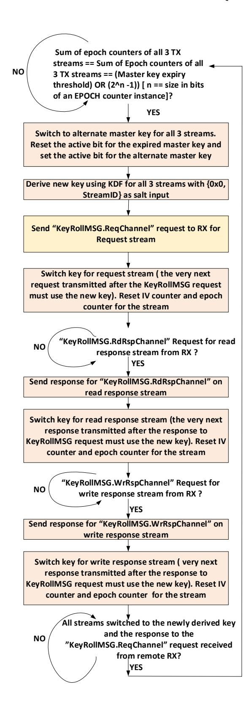

**Figure 9-9 Key swap flow in UALink port TX**

The key swap flow is done on a per stream basis for each destination accelerator.

# Evaluation Copy

### **Ultra Accelerator Link Consortium Inc. (UALink) - UALink\_200 Rev 1.0 Specification**

Note: if the TX times out on the KeyRollMSG request it sends as part of the key swap flow for a particular destination accelerator, then it will report an error to the security processor and stop processing of traffic to that destination accelerator.

In addition, a key swap results in an event being raised to the security processor in the accelerator to indicate that the active master key has expired. Please refer to Sectio[n 9.5.11](#page-247-1) for details on the actions that the security processor is expected to take upon receiving the active master key expiry event.

### **9.5.9.3 RX implementation**

As mentioned in section [9.5.9.1,](#page-222-1) in an UALink port RX, there will be an active master key and an alternate master key for each accelerator that can send transactions to it. The active key is fed into a NIST approved Key Derivation Function (KDF) to generate a derived key for each stream received from the corresponding accelerator. This derived stream specific key is then used along with a per stream IV to decrypt transactions belonging to each stream. If the Invocation field (IV counter) value becomes greater than a software configured "derived key expiry" threshold, then a new key derivation is triggered. The key derivation flow is detailed in Sectio[n 9.5.9.3.1.](#page-232-0) Key derivation requires a "context" input as defined in the NIST specification referenced in section [9.5.15](#page-248-3) . The context input formation is detailed in section [9.5.9.4](#page-236-3) The master key swap in RX is triggered by the source accelerator TX. The master key swap flow involves three "KeyRollMSG" request – response pairs – one for each stream from the source accelerator. When the RX receives a KeyRollMSG.ReqChannel request on the request stream, it shall switch to doing decryption using the key derived from the new active key on the very first request received after the "KeyRollMSG.ReqChannel" request. For the read response channel, the RX shall switch to doing decryption using the key derived from the new active key from the very first response received after the response for the "KeyRollMSG.RdRspChannel" request. For the write response channel, the RX shall switch to doing decryption using the key derived from the new active key from the very first response received after the response for the "KeyRollMSG.WrRspChannel" request. These sequence of actions are illustrated i[n Figure 9-11.](#page-234-0) To achieve this instantaneous switch, RX is expected to pre-compute and keep the derived key ready by running the KDF using the alternate master key long before the sum of stream epoch counters hit the master key expiry threshold – recommended method is to derive the new key as soon as valid bit of the alternate master key goes from 0 to 1. For creating a key swap for read response stream and write response stream, RX shall send a "KeyRollMSG.RdRspChannel" request for the read response stream and a "KeyRollMSG.WrRspChannel" request for the write response stream to the remote TX that sent the "KeyRollMSG.ReqChannel" request for request stream as shown in [Figure 9-12](#page-235-0) . The key swap flow actions within RX are detailed in Sectio[n 9.5.9.3.2](#page-233-1) below. The IV counter shall be 0 for the very first transaction decrypted by RX using a new derived key.

### **9.5.9.3.1 RX Stream Key derivation flow**

In the RX, there are two scenarios in which a stream key derivation is done:

1. Pre-computing a derived key using the alternate master key in preparation for a key swap. It is recommended that this is done when the valid bit of the alternate master key goes from

- 0 to 1. This means RX needs storage for two sets of derived keys for each stream. This precomputation ensures that upon a key swap, the derived key using the new active master key is instantaneously available.
- 2. When the derived key expiry threshold is hit for a stream or when the IV invocation field for a stream reaches 2^32 -1. This flow is detailed below i[n Figure 9-10.](#page-233-0). If a new stream key needs to be derived and the active key is not valid, then an error is signaled and all further processing of traffic from the source accelerator is stopped.

The key derivation flow is illustrated i[n Figure 9-10](#page-233-0) below:

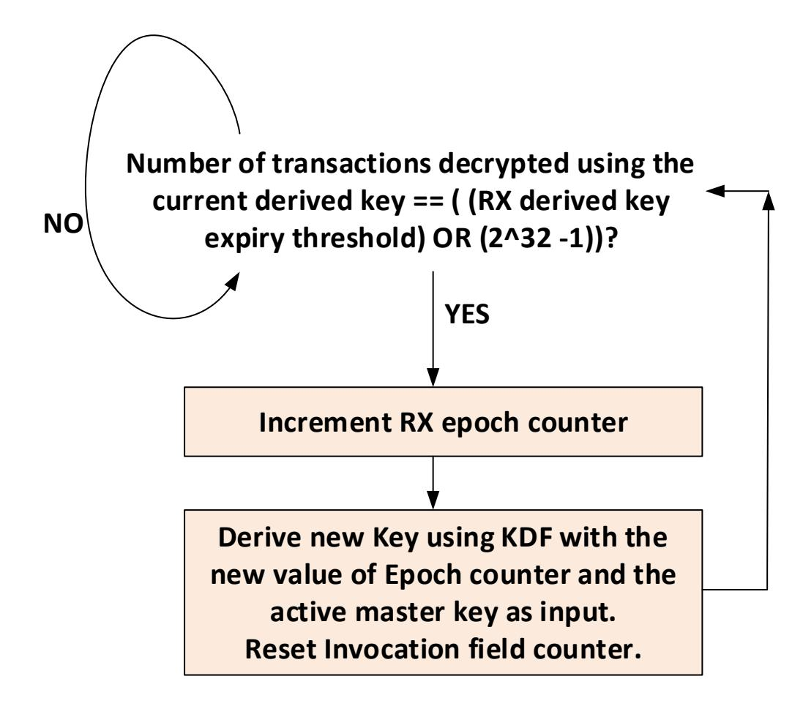

**Figure 9-10 Key derivation flow in UALink Port RX**

### **9.5.9.3.2 RX Key swap flow**

The key swap flow is illustrated i[n Figure 9-11](#page-234-0) below:

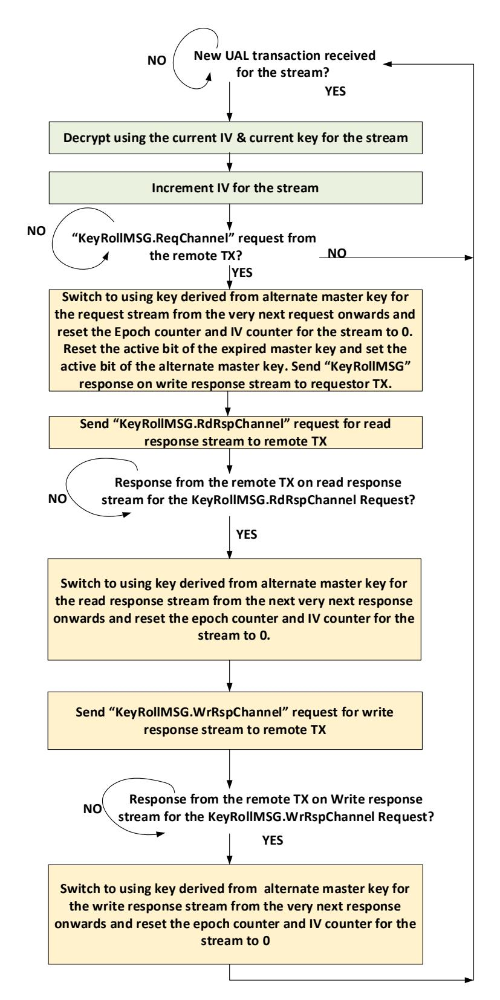

**Figure 9-11 Key switch flow in UALink port RX**

Note: If the RX times out on any of the KeyRollMSG requests it sends as part of the key switch flow for a particular source accelerator, then it will report an error to the security processor and stop processing of traffic from that source accelerator.

Note that RX can optionally raise an error if a HW threshold or a SW configured threshold is crossed before a key swap request is received.

The interactions between a source accelerator and a destination accelerator for the key swap flow is illustrated in Figure 9-12 below:

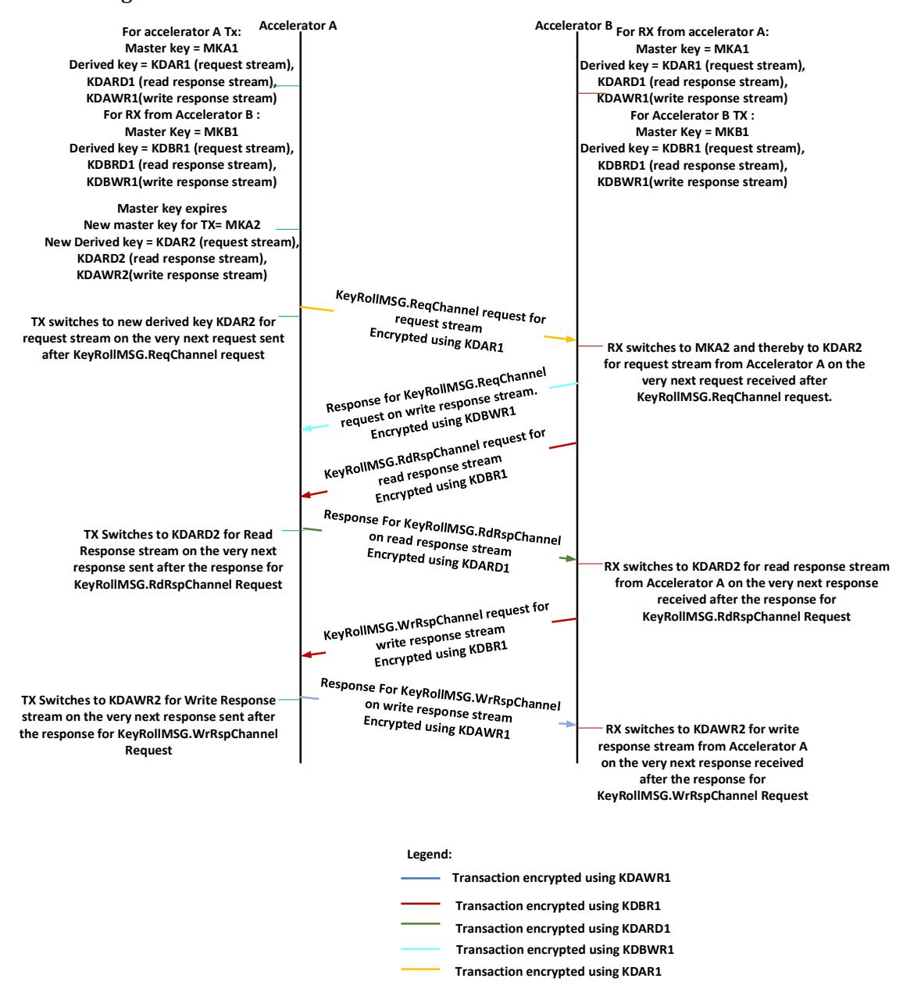

Figure 9-12 Source accelerator - Destination accelerator interactions for key swap flow

### 9.5.9.4 Context input for key derivation

Key derivation requires a "Context" input (considered as part of "FixedInfo" in NIST KDF specification) in both RX and TX.

There are two cases to consider:

- 1. When the master key is being swapped. In this case, the "Context" input shall be the following: {0x0, Stream ID}
- 2. When the master key is NOT being swapped. In this case, the Context input shall be the following: {Stream epoch counter value, Stream ID}

Note: The Stream ID field shall be two bits in width.

### 9.5.9.5 AES-GCM Message and Auxiliary Authentication Data

Table 9-8 Request Channel Fields for AAD and MSG - Non Write or UPLI Write Message Request

|     | riote. The                                                                                                                                                                               | ou cam                                                                                                                                                                                                                                                                                                                                                                                                                                   | ID field shall be                    | e two bits iii w | iuui.    |                                                                                                                 |               |             |             |              |                  |  |  |  |  |
|-----|------------------------------------------------------------------------------------------------------------------------------------------------------------------------------------------|------------------------------------------------------------------------------------------------------------------------------------------------------------------------------------------------------------------------------------------------------------------------------------------------------------------------------------------------------------------------------------------------------------------------------------------|--------------------------------------|------------------|----------|-----------------------------------------------------------------------------------------------------------------|---------------|-------------|-------------|--------------|------------------|--|--|--|--|
|     | 9.5.9.5 AES                                                                                                                                                                              | -GCM N                                                                                                                                                                                                                                                                                                                                                                                                                                   | lessage and Au                       | uxiliary Authe   | nticatio | on Data                                                                                                         |               |             |             |              |                  |  |  |  |  |
|     | This section specifies the mapping order of the UPLI channels fields for AES-GCM Auxiliary Authentication Data (AAD) and the Message (MSG) to be encrypted on TX or Decrypted on the RX. |                                                                                                                                                                                                                                                                                                                                                                                                                                          |                                      |                  |          |                                                                                                                 |               |             |             |              |                  |  |  |  |  |
|     | To simplify in multiple of 12 The receiving                                                                                                                                        | 'AG is the hashing of the AAD and the Cypher text after MSG Encryption. 'o simplify implementation and align to the AES block size of 128 bits, MSG size is always a nultiple of 128 bits, when the plaintext width is not a multiple of the 128-bit, it will be 0s-padded. The receiving side is responsible to reconstruct the padded portion of the Cypher text before ecalculating the TAG as padding is not transmitted on the link |                                      |                  |          |                                                                                                                 |               |             |             |              |                  |  |  |  |  |
| •   | The AAD is albits, it will be                                                                                                                                                            | -                                                                                                                                                                                                                                                                                                                                                                                                                                        | nultiple of 32 b led.             | its, when the w  | vidth of | concatenate                                                                                                     | e fields is   | not a m     | ultiple (   | of 32        |                  |  |  |  |  |
|     |                                                                                                                                                                                          | the req                                                                                                                                                                                                                                                                                                                                                                                                                                  | w the fields con uest type, the f |                  |          |                                                                                                                 |               |             | paralle     | 1            |                  |  |  |  |  |
|     | Table                                                                                                                                                                                    | : 9-8 Reqı                                                                                                                                                                                                                                                                                                                                                                                                                               | uest Channel Field                   | ds for AAD and M | SG - Non | Write or UPL                                                                                                    | I Write M     | essage Re   | quest       |              |                  |  |  |  |  |
|     | 1                                                                                                                                                                                        |                                                                                                                                                                                                                                                                                                                                                                                                                                          |                                      |                  | 1        | Size_padded ReqASI ReqSrcPhysAccID ReqDstPhysAccID ReqTag ReqNumBeats ReqAddr ReqCmd ReqLen ReqAttr ReqMetadata |               |             |             |              |                  |  |  |  |  |
|     | Size_padded                                                                                                                                                                              | ReqASI                                                                                                                                                                                                                                                                                                                                                                                                                                   | ReqSrcPhysAccID                      | ReqDstPhysAccID  | ReqTag   | ReqNumBeats                                                                                                     | ReqAddr       | ReqCmd      | ReqLen      | ReqAttr      | ReqMetadata      |  |  |  |  |
| AAD |                                                                                                                                                                                          | ReqASI 2                                                                                                                                                                                                                                                                                                                                                                                                                              | ReqSrcPhysAccID 10                | ReqDstPhysAccID  | ReqTag   | ReqNumBeats 2                                                                                                   | ReqAddr 39 | ReqCmd 6 | ReqLen 6 | ReqAttr 8 | ReqMetadata 8 |  |  |  |  |

### Table 9-9 Originator Data Channel Fields for AAD and MSG (partial-word write or UPLI Write Message Request)

|     | Size_padded | OrigDataByteEn | OrigData | OrigDataOffset | OrigDataLast |
|-----|-------------|----------------|----------|----------------|--------------|
| AAD | 32          |                |          | 2              | 1            |
| MSG | 640         | 64             | 512      |                |              |

### Table 9-10 Originator Data Channel Fields for AAD and MSG (Full Write)

|     | Size_padded | OrigData | OrigDataOffset | OrigDataLast |
|-----|-------------|----------|----------------|--------------|
| AAD | 32          |          | 2              | 1            |

| MSG | 512 | 512 |  |
|-----|-----|-----|--|

**Table 9-11 Read Response channel fields for AAD and MSG**

|     | Size_padded | RdRspSrcPhysAccID | RdRspDstPhysAccID | RdRspTag | RdRspNumBeats | RdRspData | RdRspStatus | RdRspOffset | RdRspLast |
|-----|-------------|-------------------|-------------------|----------|---------------|-----------|-------------|-------------|-----------|
| AAD | 32          | 10                | 10                |          | 2             |           | 4           | 2           | 1         |
| MSG | 640         |                   |                   | 11       |               | 512       |             |             |           |

**Table 9-12 Write Response channel fields for AAD and MSG**

|     | Size_padded | WrRspSrcPhysAccID | WrRspDstPhysAccID | WrRspTag | WrRspStatus | RdRspLast |
|-----|-------------|-------------------|-------------------|----------|-------------|-----------|
| AAD | 32          | 10                | 10                |          | 4           | 1         |
| MSG | 128         |                   |                   | 11       |             |           |

The table below describes the mapping of **AAD** bits for **request**. Address field is double-word aligned and Addr[1:0] are always 0. These 2 bits are not encrypted and neither authenticated. The AAD size is 96 bits with 6 padded zeroes.

**Table 9-13 Mapping Request Channel AAD bits**

|         | AAD for Req = 96bits |                                                                                                                            |                            |   |             |                  |   |             |   |  |
|---------|----------------------|----------------------------------------------------------------------------------------------------------------------------|----------------------------|---|-------------|------------------|---|-------------|---|--|
|         |                      |                                                                                                                            |                            |   |             | bits             |   |             |   |  |
|         |                      | 7                                                                                                                          | 6                          | 5 | 4           | 3                | 2 | 1           | 0 |  |
|         | 0                    |                                                                                                                            |                            |   |             | ReqMetadata[7:0] |   |             |   |  |
|         | 1                    |                                                                                                                            | ReqAttr[7:0]               |   |             |                  |   |             |   |  |
|         | 2                    |                                                                                                                            | ReqCmd[1:0]                |   | ReqLen[5:0] |                  |   |             |   |  |
|         | 3                    |                                                                                                                            | ReqAaddr[23:18]            |   |             |                  |   | ReqCmd[5:2] |   |  |
|         | 4                    | ReqAaddr[31:24]                                                                                                            |                            |   |             |                  |   |             |   |  |
| By      | 5                    |                                                                                                                            |                            |   |             | ReqAaddr[39:32]  |   |             |   |  |
| te s | 6                    |                                                                                                                            |                            |   |             | ReqAaddr[47:40]  |   |             |   |  |
|         | 7                    |                                                                                                                            |                            |   |             | ReqAaddr[55:48]  |   |             |   |  |
|         | 8                    | ReqDstPhysAccID[3:0] ReqNBeats[1:0] ReqAaddr[57:56] ReqSrcID[1:0] ReqDstPhysAccID[9:4] ReqSrcPhysAccID[9:2] |                            |   |             |                  |   |             |   |  |
|         | 9                    |                                                                                                                            |                            |   |             |                  |   |             |   |  |
|         | 10                   |                                                                                                                            |                            |   |             |                  |   |             |   |  |
|         | 11                   |                                                                                                                            | 0`s Padding ReqASI[0:1] |   |             |                  |   |             |   |  |

The table below describes the mapping of **MSG** bits **for non-write or UPLI non-write message request**. The MSG size is 128 bits.

**Table 9-14 Mapping Request Channel MSG bits for non write and non UPLI Write Message**

|         | MSG for Req (no write req.) |                             |               |   |                 |      |   |   |   |  |
|---------|-----------------------------|-----------------------------|---------------|---|-----------------|------|---|---|---|--|
|         |                             |                             |               |   |                 | bits |   |   |   |  |
|         |                             | 7                           | 6             | 5 | 4               | 3    | 2 | 1 | 0 |  |
|         | 0                           |                             | ReqAaddr[9:2] |   |                 |      |   |   |   |  |
|         | 1                           |                             |               |   | ReqAaddr[17:10] |      |   |   |   |  |
|         | 2                           |                             |               |   | ReqTag[7:0]     |      |   |   |   |  |
|         | 3                           | 0`s Padding ReqTag[10:8] |               |   |                 |      |   |   |   |  |
|         | 4                           | 0`s Padding                 |               |   |                 |      |   |   |   |  |
|         | 5                           | 0`s Padding                 |               |   |                 |      |   |   |   |  |
|         | 6                           |                             |               |   | 0`s Padding     |      |   |   |   |  |
| By      | 7                           |                             |               |   | 0`s Padding     |      |   |   |   |  |
| te s | 8                           |                             |               |   | 0`s Padding     |      |   |   |   |  |
|         | 9                           |                             |               |   | 0`s Padding     |      |   |   |   |  |
|         | 10                          |                             |               |   | 0`s Padding     |      |   |   |   |  |
|         | 11                          |                             |               |   | 0`s Padding     |      |   |   |   |  |
|         | 12                          | 0`s Padding                 |               |   |                 |      |   |   |   |  |
|         | 13                          | 0`s Padding                 |               |   |                 |      |   |   |   |  |
|         | 14                          |                             |               |   | 0`s Padding     |      |   |   |   |  |
|         | 15                          |                             |               |   | 0`s Padding     |      |   |   |   |  |

The table below describes the mapping of **AAD** bits for **Write Request or UPLI Write Message, with 1st beat of the Originator Data Channel**. The AAD size is 128 bits concatenating 96 bits from Request Channel`s fields and 32 bits from the field Originator Data Channel.

**Table 9-15 Mapping Request and Originator Data channels AAD bits for Wr Req or UPLI Write Message**

|         | AAD for Wr Req or UPLI Write Message |                  |                                    |  |  |                 |             |             |  |  |  |
|---------|--------------------------------------|------------------|------------------------------------|--|--|-----------------|-------------|-------------|--|--|--|
|         | 1st beat = 128 bits               |                  |                                    |  |  |                 |             |             |  |  |  |
|         | bits                                 |                  |                                    |  |  |                 |             |             |  |  |  |
|         | 7 6 5 4 3 2 1 0 |                  |                                    |  |  |                 |             |             |  |  |  |
|         | 0                                    | ReqMetadata[7:0] |                                    |  |  |                 |             |             |  |  |  |
|         | 1                                    |                  | ReqAttr[7:0]                       |  |  |                 |             |             |  |  |  |
|         | 2                                    |                  | ReqCmd[1:0]                        |  |  |                 | ReqLen[5:0] |             |  |  |  |
| By      | 3                                    |                  | ReqAaddr[23:18]                    |  |  |                 |             | ReqCmd[5:2] |  |  |  |
| te s | 4                                    |                  |                                    |  |  | ReqAaddr[31:24] |             |             |  |  |  |
|         | 5                                    |                  | ReqAaddr[39:32] ReqAaddr[47:40] |  |  |                 |             |             |  |  |  |
|         | 6                                    |                  |                                    |  |  |                 |             |             |  |  |  |
|         | 7                                    |                  |                                    |  |  | ReqAaddr[55:48] |             |             |  |  |  |

| 8  | ReqDstPhysAccID[3:0] |                            |             | ReqNBeats[1:0]       |  | ReqAaddr[57:56] |  |  |  |
|----|----------------------|----------------------------|-------------|----------------------|--|-----------------|--|--|--|
| 9  | ReqSrcID[1:0]        |                            |             | ReqDstPhysAccID[9:4] |  |                 |  |  |  |
| 10 |                      | ReqSrcPhysAccID[9:2]       |             |                      |  |                 |  |  |  |
| 11 |                      | 0`s Padding ReqASI[0:1] |             |                      |  |                 |  |  |  |
| 12 |                      | 0`s Padding                |             | OrigDataOffset[1:0]  |  | Last            |  |  |  |
| 13 |                      |                            | 0`s Padding |                      |  |                 |  |  |  |
| 14 |                      | 0`s Padding                |             |                      |  |                 |  |  |  |
| 15 |                      | 0`s Padding                |             |                      |  |                 |  |  |  |

The total MSG size is 640 bits. The tables below describe the mapping of MSG bits of the Channels` fields (Request and Originator Data) constructing the **1st 128 bits of MSG, for Write Request or UPLI Write Message with Byte enables field** (Table 9-16 below) **and Full word write requests**. (Table 9-17 below). This 128 bits of the MSG will consume the 1st 128 bits encrypted counter. The rest of 512 bits of the Originator data fields will consume from the 2nd to the 5th 128 bits encrypted counters.

**Table 9-16 Mapping MSG bits for Write Request w. Byte Enable or UPLI Write Message of the 1st beat**

|                 | MSG for Wr Req w. Byte Enable or UPLI Write Message of the 1st beat |                             |             |                  |                   |   |   |   |   |  |  |  |  |
|-----------------|------------------------------------------------------------------------|-----------------------------|-------------|------------------|-------------------|---|---|---|---|--|--|--|--|
|                 |                                                                        | Bits                        |             |                  |                   |   |   |   |   |  |  |  |  |
| st Counter 1 |                                                                        | 7                           | 6           | 5                | 4                 | 3 | 2 | 1 | 0 |  |  |  |  |
|                 | 0                                                                      |                             |             |                  | ReqAaddr[9:2]     |   |   |   |   |  |  |  |  |
|                 | 1                                                                      |                             |             |                  | ReqAaddr[17:10]   |   |   |   |   |  |  |  |  |
|                 | 2                                                                      |                             | ReqTag[7:0] |                  |                   |   |   |   |   |  |  |  |  |
|                 | 3                                                                      | 0`s Padding ReqTag[10:8] |             |                  |                   |   |   |   |   |  |  |  |  |
|                 | 4                                                                      | ByteEnable[7:0]             |             |                  |                   |   |   |   |   |  |  |  |  |
|                 | 5                                                                      |                             |             | ByteEnable[15:8] |                   |   |   |   |   |  |  |  |  |
|                 | 6                                                                      | ByteEnable[23:16]           |             |                  |                   |   |   |   |   |  |  |  |  |
| By              | 7                                                                      |                             |             |                  | ByteEnable[31:24] |   |   |   |   |  |  |  |  |
| te s         | 8                                                                      |                             |             |                  | ByteEnable[39:32] |   |   |   |   |  |  |  |  |
|                 | 9                                                                      |                             |             |                  | ByteEnable[47:40] |   |   |   |   |  |  |  |  |
|                 | 10                                                                     |                             |             |                  | ByteEnable[55:48] |   |   |   |   |  |  |  |  |
|                 | 11                                                                     |                             |             |                  | ByteEnable[63:56] |   |   |   |   |  |  |  |  |
|                 | 12                                                                     |                             |             |                  | 0`s Padding       |   |   |   |   |  |  |  |  |
|                 | 13                                                                     | 0`s Padding                 |             |                  |                   |   |   |   |   |  |  |  |  |
|                 | 14                                                                     | 0`s Padding                 |             |                  |                   |   |   |   |   |  |  |  |  |
|                 | 15                                                                     |                             |             |                  | 0`s Padding       |   |   |   |   |  |  |  |  |

| 2nd Counter  | bits            |   |   |   |   |   |   |   |  |  |
|--------------|-----------------|---|---|---|---|---|---|---|--|--|
|              | 7               | 6 | 5 | 4 | 3 | 2 | 1 | 0 |  |  |
| Bytes [0-15] | OrigData[127-0] |   |   |   |   |   |   |   |  |  |

| 3rd Counter  |                                      |   |   |   | bits              |   |   |   |  |  |
|--------------|--------------------------------------|---|---|---|-------------------|---|---|---|--|--|
|              | 7                                    | 6 | 5 | 4 | 3                 | 2 | 1 | 0 |  |  |
| Bytes [0-15] |                                      |   |   |   | OrigData[255-127] |   |   |   |  |  |
|              |                                      |   |   |   |                   |   |   |   |  |  |
| 4th Counter  | bits                                 |   |   |   |                   |   |   |   |  |  |
|              | 7 6 5 4 3 2 1 0 |   |   |   |                   |   |   |   |  |  |
| Bytes [0-15] |                                      |   |   |   | OrigData[383-256] |   |   |   |  |  |
|              |                                      |   |   |   |                   |   |   |   |  |  |
| 5th Counter  |                                      |   |   |   | bits              |   |   |   |  |  |
|              | 7 6 5 4 3 2 1 0 |   |   |   |                   |   |   |   |  |  |
| Bytes [0-15] |                                      |   |   |   | OrigData[511-384] |   |   |   |  |  |

**Table 9-17 Mapping MSG bits for Full-word Wr Req (w/o Byte Enable) of the 1st beat**

|         |    | MSG for Full-word Wr Req (w/o Byte Enable) of the 1st beat |  |  |  |  |  |  |  |  |  |  |  |
|---------|----|---------------------------------------------------------------|--|--|--|--|--|--|--|--|--|--|--|
|         |    | bits                                                          |  |  |  |  |  |  |  |  |  |  |  |
|         |    | 7 6 5 4 3 2 1 0                          |  |  |  |  |  |  |  |  |  |  |  |
|         | 0  | ReqAaddr[9:2]                                                 |  |  |  |  |  |  |  |  |  |  |  |
|         | 1  | ReqAaddr[17:10]                                               |  |  |  |  |  |  |  |  |  |  |  |
|         | 2  | ReqTag[7:0]                                                   |  |  |  |  |  |  |  |  |  |  |  |
|         | 3  | 0`s Padding ReqTag[10:8]                                   |  |  |  |  |  |  |  |  |  |  |  |
|         | 4  | 0`s Padding                                                   |  |  |  |  |  |  |  |  |  |  |  |
|         | 5  | 0`s Padding                                                   |  |  |  |  |  |  |  |  |  |  |  |
|         | 6  | 0`s Padding                                                   |  |  |  |  |  |  |  |  |  |  |  |
| By      | 7  | 0`s Padding                                                   |  |  |  |  |  |  |  |  |  |  |  |
| te s | 8  | 0`s Padding                                                   |  |  |  |  |  |  |  |  |  |  |  |
|         | 9  | 0`s Padding                                                   |  |  |  |  |  |  |  |  |  |  |  |
|         | 10 | 0`s Padding                                                   |  |  |  |  |  |  |  |  |  |  |  |
|         | 11 | 0`s Padding                                                   |  |  |  |  |  |  |  |  |  |  |  |
|         | 12 | 0`s Padding                                                   |  |  |  |  |  |  |  |  |  |  |  |
|         | 13 | 0`s Padding                                                   |  |  |  |  |  |  |  |  |  |  |  |
|         | 14 | 0`s Padding                                                   |  |  |  |  |  |  |  |  |  |  |  |
|         | 15 | 0`s Padding                                                   |  |  |  |  |  |  |  |  |  |  |  |

| 2nd Counter  | bits            |   |   |   |   |   |   |   |  |  |
|--------------|-----------------|---|---|---|---|---|---|---|--|--|
|              | 7               | 6 | 5 | 4 | 3 | 2 | 1 | 0 |  |  |
| Bytes [0-15] | OrigData[127-0] |   |   |   |   |   |   |   |  |  |

| 3rd Counter  |                                      |      |   |                   | bits |   |   |   |  |  |  |  |
|--------------|--------------------------------------|------|---|-------------------|------|---|---|---|--|--|--|--|
|              | 7                                    | 6    | 5 | 4                 | 3    | 2 | 1 | 0 |  |  |  |  |
| Bytes [0-15] |                                      |      |   | OrigData[255-127] |      |   |   |   |  |  |  |  |
|              |                                      |      |   |                   |      |   |   |   |  |  |  |  |
| 4th Counter  |                                      | bits |   |                   |      |   |   |   |  |  |  |  |
|              | 7                                    | 6    | 5 | 2                 | 1    | 0 |   |   |  |  |  |  |
| Bytes [0-15] |                                      |      |   | OrigData[383-256] |      |   |   |   |  |  |  |  |
|              |                                      |      |   |                   |      |   |   |   |  |  |  |  |
| 5th Counter  |                                      |      |   |                   | bits |   |   |   |  |  |  |  |
|              | 7 6 5 4 3 2 1 0 |      |   |                   |      |   |   |   |  |  |  |  |
| Bytes [0-15] | OrigData[511-384]                    |      |   |                   |      |   |   |   |  |  |  |  |

The table below describes the mapping **AAD** bits of **non-1st beat of the originator data**. The AAD size is 32-bits.

**Table 9-18 Mapping AAD bits for Originator data non 1st beat**

|                                 | AAD Orig Data other beats (not 1st) = 32b |             |  |             |  |  |             |                     |      |  |  |  |
|---------------------------------|-------------------------------------------|-------------|--|-------------|--|--|-------------|---------------------|------|--|--|--|
|                                 | bits                                      |             |  |             |  |  |             |                     |      |  |  |  |
| 7 6 5 4 3 2 1 |                                           |             |  |             |  |  |             |                     | 0    |  |  |  |
|                                 | 0                                         |             |  | 0`s Padding |  |  |             | OrigDataOffset[1:0] | Last |  |  |  |
| By                              | 1                                         |             |  |             |  |  | 0`s Padding |                     |      |  |  |  |
| te s                         | 2                                         | 0`s Padding |  |             |  |  |             |                     |      |  |  |  |
|                                 | 3                                         |             |  |             |  |  | 0`s Padding |                     |      |  |  |  |

The table below describes the mapping **MSG** bits of **non-1st beat of the originator data non-full write word**. The MSG size is 640-bits

The first 128-bits of the MSG will consume the 1st 128-bits encrypted counter and contains the ByteEnable field mapped on the same location as in the 1st beat with the request. The rest of 512-bits of the Originator data fields will consume from the 2nd to the 5th 128-bits encrypted counters.

**Table 9-19 Mapping MSG bits for Full-word Wr Req (w. Byte Enable) non 1st beat**

**MSG Orig Data other beats (not 1st)**

|              |                      |    |                   |             |                   | bits              |   |   |   |   |  |  |  |  |
|--------------|----------------------|----|-------------------|-------------|-------------------|-------------------|---|---|---|---|--|--|--|--|
| 1st Counter  |                      |    | 7                 | 6           | 5                 | 4                 | 3 | 2 | 1 | 0 |  |  |  |  |
|              |                      | 0  |                   |             |                   | 0`s Padding       |   |   |   |   |  |  |  |  |
|              |                      |    |                   |             |                   |                   |   |   |   |   |  |  |  |  |
|              |                      | 1  |                   |             |                   | 0`s Padding       |   |   |   |   |  |  |  |  |
|              |                      | 2  |                   |             |                   | 0`s Padding       |   |   |   |   |  |  |  |  |
|              |                      | 3  |                   |             |                   | 0`s Padding       |   |   |   |   |  |  |  |  |
|              |                      | 4  |                   |             |                   | ByteEnable[7:0]   |   |   |   |   |  |  |  |  |
|              |                      | 5  |                   |             |                   | ByteEnable[15:8]  |   |   |   |   |  |  |  |  |
| By           |                      | 6  |                   |             |                   | ByteEnable[23:16] |   |   |   |   |  |  |  |  |
| te           |                      | 7  |                   |             |                   | ByteEnable[31:24] |   |   |   |   |  |  |  |  |
| s            |                      | 8  |                   |             |                   | ByteEnable[39:32] |   |   |   |   |  |  |  |  |
|              |                      | 9  |                   |             |                   | ByteEnable[47:40] |   |   |   |   |  |  |  |  |
|              |                      | 10 | ByteEnable[55:48] |             |                   |                   |   |   |   |   |  |  |  |  |
|              |                      |    | ByteEnable[63:56] |             |                   |                   |   |   |   |   |  |  |  |  |
|              | 11 12 13 14 |    |                   | 0`s Padding |                   |                   |   |   |   |   |  |  |  |  |
|              |                      |    |                   |             |                   | 0`s Padding       |   |   |   |   |  |  |  |  |
|              |                      |    |                   |             |                   | 0`s Padding       |   |   |   |   |  |  |  |  |
|              |                      | 15 |                   |             |                   | 0`s Padding       |   |   |   |   |  |  |  |  |
|              |                      |    |                   |             |                   |                   |   |   |   |   |  |  |  |  |
| 2nd Counter  |                      |    |                   |             |                   | bits              |   |   |   |   |  |  |  |  |
|              | 7                    | 6  | 5                 |             | 4                 | 3                 | 2 |   | 1 | 0 |  |  |  |  |
| Bytes [0-15] |                      |    |                   |             | OrigData[127-0]   |                   |   |   |   |   |  |  |  |  |
|              |                      |    |                   |             |                   |                   |   |   |   |   |  |  |  |  |
| 3rd Counter  |                      |    |                   |             |                   | bits              |   |   |   |   |  |  |  |  |
|              | 7                    | 6  | 5                 |             | 4                 | 3                 | 2 |   | 1 | 0 |  |  |  |  |
| Bytes [0-15] |                      |    |                   |             | OrigData[255-127] |                   |   |   |   |   |  |  |  |  |
|              |                      |    |                   |             |                   |                   |   |   |   |   |  |  |  |  |
| 4th Counter  |                      |    |                   |             |                   | bits              |   |   |   |   |  |  |  |  |
|              | 7                    | 6  | 5                 |             | 4                 | 3                 | 2 |   | 1 | 0 |  |  |  |  |
| Bytes [0-15] |                      |    |                   |             | OrigData[383-256] |                   |   |   |   |   |  |  |  |  |
|              |                      |    |                   |             |                   |                   |   |   |   |   |  |  |  |  |
| 5th Counter  |                      |    |                   |             |                   | bits              |   |   |   |   |  |  |  |  |
|              | 7                    | 6  | 5                 |             | 4                 | 3                 | 2 |   | 1 | 0 |  |  |  |  |
|              |                      |    |                   |             |                   |                   |   |   |   |   |  |  |  |  |

The table below describes the mapping **MSG** bits of **non-1st beat of the originator data full write word**. The MSG size is 512-bits will consume 4 128-bits encrypted counters.

**Table 9-20 Mapping MSG bits for Full-word Wr Req (w/o Byte Enable) non 1st beat**

| 1st Counter | bits |
|-------------|------|
|             |      |

**Bytes [0-15] OrigData[511-384]**

The table below describes the mapping **AAD** bits for **read response**. The AAD size is 32-bits.

**Table 9-21 Mapping Read Response Channel AAD bits**

|         | AAD Read Response = 32b |                                    |                                                |                                       |  |  |  |                  |      |  |  |  |  |  |  |
|---------|-------------------------|------------------------------------|------------------------------------------------|---------------------------------------|--|--|--|------------------|------|--|--|--|--|--|--|
|         |                         | bits 6 5 4 3 2 1 |                                                |                                       |  |  |  |                  |      |  |  |  |  |  |  |
|         |                         | 7                                  | 0                                              |                                       |  |  |  |                  |      |  |  |  |  |  |  |
|         | 0                       | Beats[0]                           |                                                | RdRspStatus[3:0]                      |  |  |  | RdrspOffset[1:0] | Last |  |  |  |  |  |  |
| By      | 1                       |                                    | RdRspDstPhysAccID[6:0] Beats[1]             |                                       |  |  |  |                  |      |  |  |  |  |  |  |
| te s | 2                       |                                    | ReqSrcPhysAccID[4:0] RdRspDstPhysAccID[9:7] |                                       |  |  |  |                  |      |  |  |  |  |  |  |
|         | 3                       |                                    |                                                | 0`s Padding RdRspSrcPhysAccID[9:5] |  |  |  |                  |      |  |  |  |  |  |  |

The table below describes the mapping **MSG** bits for **Read Response**. The MSG size is 640-bits.

The first 128-bits of the MSG will consume the 1st 128-bits encrypted counter and contains only the WrRspTag field 0`s padded. The rest of 512-bits of the Originator data fields will consume from the 2nd to the 5th 128-bits encrypted counters.

**Table 9-22 Mapping MSG bits for Read Response**

# **MSG Read Response**

|              |    |                                           |   |             |   | bits               |                    |                |   |  |  |  |
|--------------|----|-------------------------------------------|---|-------------|---|--------------------|--------------------|----------------|---|--|--|--|
| 1st Counter  |    | 7                                         | 6 | 5           | 4 | 3                  | 2                  | 1              | 0 |  |  |  |
|              | 0  |                                           |   |             |   | WrRspTag[7:0]      |                    |                |   |  |  |  |
|              | 1  |                                           |   | 0`s Padding |   |                    |                    | WrRspTag[10:8] |   |  |  |  |
|              | 2  |                                           |   |             |   | 0`s Padding        |                    |                |   |  |  |  |
|              | 3  |                                           |   |             |   | 0`s Padding        |                    |                |   |  |  |  |
|              | 4  |                                           |   |             |   | 0`s Padding        |                    |                |   |  |  |  |
|              | 5  |                                           |   |             |   | 0`s Padding        |                    |                |   |  |  |  |
|              | 6  |                                           |   |             |   | 0`s Padding        |                    |                |   |  |  |  |
| By           | 7  |                                           |   |             |   | 0`s Padding        |                    |                |   |  |  |  |
| te s      | 8  |                                           |   |             |   | 0`s Padding        |                    |                |   |  |  |  |
|              | 9  |                                           |   |             |   | 0`s Padding        |                    |                |   |  |  |  |
|              | 10 |                                           |   |             |   | 0`s Padding        |                    |                |   |  |  |  |
|              | 11 |                                           |   |             |   | 0`s Padding        |                    |                |   |  |  |  |
|              | 12 |                                           |   |             |   | 0`s Padding        |                    |                |   |  |  |  |
|              | 13 | 0`s Padding 0`s Padding 0`s Padding |   |             |   |                    |                    |                |   |  |  |  |
|              | 14 |                                           |   |             |   |                    |                    |                |   |  |  |  |
|              | 15 |                                           |   |             |   |                    |                    |                |   |  |  |  |
| 2nd Counter  |    |                                           |   |             |   | bits               |                    |                |   |  |  |  |
|              |    | 7                                         | 6 | 5           | 4 | 3                  | 2                  | 1              | 0 |  |  |  |
| Bytes [0-15] |    |                                           |   |             |   | RdRspData[127-0]   |                    |                |   |  |  |  |
| 3rd Counter  |    |                                           |   |             |   | bits               |                    |                |   |  |  |  |
|              |    | 7                                         | 6 | 5           | 4 | 3                  | 2                  | 1              | 0 |  |  |  |
| Bytes [0-15] |    |                                           |   |             |   | RdRspData[255-127] |                    |                |   |  |  |  |
|              |    |                                           |   |             |   |                    |                    |                |   |  |  |  |
| 4th Counter  |    |                                           |   |             |   | bits               |                    |                |   |  |  |  |
|              |    | 7                                         | 6 | 5           | 4 | 3                  | 2 1 0        |                |   |  |  |  |
| Bytes [0-15] |    |                                           |   |             |   |                    | RdRspData[383-256] |                |   |  |  |  |
| 5th Counter  |    |                                           |   |             |   | bits               |                    |                |   |  |  |  |
|              |    | 7                                         | 6 | 5           | 4 | 3                  | 2                  | 1              | 0 |  |  |  |
|              |    |                                           |   |             |   |                    |                    |                |   |  |  |  |

**Bytes [0-15] RdRspData[511-384]**

The table below describes the mapping **AAD** bits for **write response**. The AAD size is 32-bits.

**Table 9-23 Mapping Read Response Channel AAD bits**

|         | AAD Write response = 32b |                        |                        |                        |             |   |                        |   |   |  |  |  |
|---------|--------------------------|------------------------|------------------------|------------------------|-------------|---|------------------------|---|---|--|--|--|
|         |                          |                        |                        |                        | bits        |   |                        |   |   |  |  |  |
|         |                          | 7                      | 6                      | 5                      | 4           | 3 | 2                      | 1 | 0 |  |  |  |
|         | 0                        |                        | WrRspDstPhysAccID[3:0] |                        |             |   | WrRspStatus[3:0]       |   |   |  |  |  |
| By      | 1                        | WrRspSrcPhysAccID[1:0] |                        |                        |             |   | WrRspDstPhysAccID[9:4] |   |   |  |  |  |
| te s | 2                        |                        |                        | WrRspSrcPhysAccID[9:2] |             |   |                        |   |   |  |  |  |
|         | 3                        |                        |                        |                        | 0`s Padding |   |                        |   |   |  |  |  |

The table below describes the mapping **MSG** bits for **Write Response**. The MSG size is 128-bits **Table 9-24 Mapping Write Response Channel MSG bits**

|         | MSG Write response = 128b |             |   |             |               |             |   |                |   |  |  |  |
|---------|---------------------------|-------------|---|-------------|---------------|-------------|---|----------------|---|--|--|--|
|         |                           |             |   |             |               | bits        |   |                |   |  |  |  |
|         |                           | 7           | 6 | 5           | 4             | 3           | 2 | 1              | 0 |  |  |  |
|         | 0                         |             |   |             | WrRspTag[7:0] |             |   |                |   |  |  |  |
|         | 1                         |             |   | 0`s Padding |               |             |   | WrRspTag[10:8] |   |  |  |  |
|         | 2                         |             |   |             |               | 0`s Padding |   |                |   |  |  |  |
|         | 3                         |             |   |             |               | 0`s Padding |   |                |   |  |  |  |
|         | 4                         | 0`s Padding |   |             |               |             |   |                |   |  |  |  |
|         | 5                         |             |   |             |               | 0`s Padding |   |                |   |  |  |  |
|         | 6                         |             |   |             |               | 0`s Padding |   |                |   |  |  |  |
| By      | 7                         |             |   |             |               | 0`s Padding |   |                |   |  |  |  |
| te s | 8                         |             |   |             |               | 0`s Padding |   |                |   |  |  |  |
|         | 9                         |             |   |             |               | 0`s Padding |   |                |   |  |  |  |
|         | 10                        |             |   |             |               | 0`s Padding |   |                |   |  |  |  |
|         | 11                        |             |   |             |               | 0`s Padding |   |                |   |  |  |  |
|         | 12                        |             |   |             |               | 0`s Padding |   |                |   |  |  |  |
|         | 13                        |             |   |             |               | 0`s Padding |   |                |   |  |  |  |
|         | 14                        |             |   |             |               | 0`s Padding |   |                |   |  |  |  |
|         | 15                        |             |   |             |               | 0`s Padding |   |                |   |  |  |  |

# **9.5.10 Initializing encrypted and authenticated transmission and reception**

For UALink 1.0, It is assumed that encryption (and optionally, authentication) is enabled on a per virtual Pod basis. This means that all traffic transmitted or received by a port belonging to that pod will be encrypted and optionally authenticated. In addition, it is assumed that no valid transactions are sent out by an UALink TX prior to configuring and enabling encryption and authentication. This ensures that the very first transaction that an RX receives is an encrypted (and optionally authenticated) transaction. With these assumptions, the trusted SW (i.e., CCM within a TVM) is expected to do the following for initialization of encrypted (and optionally authenticated) transmission and reception:

- 1. Generate active and alternate master keys for each TX-RX pair in the virtual POD.
- 2. Program the derived key expiry threshold in each TX and RX.
- 3. Program the master key expiry threshold in each TX and (optionally) in RX.
- 4. Set the active bit to 1 for the active master key for each UALink RX and TX.
- 5. Set the active bit to 0 for the alternate master key for each UALlink TX and RX.

An example flow for initialization is as follows:

- For each UALink TX in the pod:
  - o The CCM in the lead node of the virtual POD instructs the CCM of the sub-ordinate node which has the accelerator containing the UALink TX to do the security related programming. The lead CCM also provides the master keys (active and alternate), the master key expiry threshold and derived key expiry threshold
    - Keys are generated for each source accelerator TX/destination accelerator RX pair for which a path exists through the UALink fabric. Destination accelerator keys in source accelerator TX and source accelerator keys in the destination accelerator RX are identical for a given TX/RX pair.
  - o The sub-ordinate node CCM that manages the accelerator containing the UALink TX does the following:
    - The CCM SW configures the active master key value and alternate master key value registers in UALink TX for each destination accelerator. It sets the active bit to 1 for the active master key and 0 for the alternate master key. It sets the valid bit to 1 for both active and alternate master keys. It sets a bit to trigger a key derivation using the active master key in preparation for enabling encrypted transmission.
    - For each destination accelerator, CCM configures the derived key expiry threshold for all three streams.
    - For each destination accelerator, CCM programs the master key expiry threshold
  - o Once these steps are completed, the sub-ordinate node CCM that manages the accelerator containing the UALink TX informs the lead CCM that programming is complete.
- For each UALink RX in the pod the following flow is used:
  - o The CCM in the lead node of the virtual POD instructs the CCM of the sub-ordinate node which has the accelerator containing the UALink RX to do the security related programming. It also provides the master keys (active and alternate), the master key expiry threshold and derived key expiry threshold.

- o The sub-ordinate node CCM that manages the accelerator containing the UAL RX does the following:
  - The CCM SW configures the active master key and the alternate master key in UALink RX for each source accelerator. It sets the active bit to 1 for the active master key and 0 for the alternate master key. It sets the valid bit to 1 for both active and alternate master keys It sets a bit to trigger a key derivation using the active master key in preparation for enabling encrypted reception.
  - For each source accelerator, CCM configures the derived key expiry threshold for all three streams.
  - For each source accelerator, CCM programs the master key expiry threshold.
- o Once these steps are completed, the sub-ordinate node CCM that manages the accelerator containing the UALink RX informs the lead CCM that programming is complete.
  - Note that transmission shall not start until key derivation is complete.
- Once these steps are complete for all TX and RX pairs in the Virtual Pod, the lead CCM instructs the sub-ordinate CCMs in the Virtual Pod of all accelerators in the pod to enable encrypted and (optionally) authenticated transaction reception in all UALink ports.
- Once reception is enabled in all accelerators, the lead CCM instructs the sub-ordinate CCMs of all accelerators in the pod to enable encrypted and (optionally) authenticated transaction transmission in all UALink ports.
- The very first valid transaction that a RX receives will be encrypted and (optionally) authenticated transaction.

# **9.5.11 Refreshing an expired key**

The following is an example flow for refreshing an expired key.

- An active master key for a specific destination accelerator hits a key expiry threshold (SW configured threshold or the HW threshold) in TX of an accelerator. The TX HW executes the key swap flow and clears the valid bit and active bit of the active master key and sets the active bit of the alternate master key (if the alternate master key has its valid bit set; else it will report an error to security processor) . This means that the TX alternate master key is now invalid.
- The TX informs the accelerators security processor via an interrupt. The status register corresponding to the interrupt event shall indicate the destination accelerator for which the active master key has expired.
- The security processor firmware handler for this event informs the node CCM instance which manages the accelerator. The report will include the exact source accelerator ID, destination accelerator ID, source port ID within the source accelerator for which this expiry event occurred.
- The node CCM will co-ordinate with the lead node CCM to generate a new key and program it into the UALink TX that reported the expiry event as the new alternate master key. It will also set the valid bit for the newly programmed key.
- Node CCM will co-ordinate via the lead node CCM with the node CCM responsible for the destination accelerator to do the following for the destination accelerator:
  - o Determine the specific UALink port whose RX to be programmed.
  - o Program the new alternate master key for the source accelerator in the appropriate UALink RX and set its valid bit to 1. Note that the key programmed in the UALink TX and UALink RX are identical.

# **9.5.12 Safeguarding UALink configuration to ensure confidentiality and integrity**

From a security perspective, registers in the UALink port/station can be classified into two categories

- A. Registers that only trusted SW/FW shall configure. E.g., the Active master key register. To ensure confidentiality and integrity, such registers shall have restricted access such that only SW/FW that are trusted can write to them.
- B. Registers (and configuration storage arrays/lookup tables) that should be configured by untrusted SW/FW (e.g., address decoding related registers), but can cause loss of confidentiality and/or integrity and/or execution corruption if maliciously modified. These registers shall have a "lock" mechanism which ensures that only secure software/firmware has write access once the register/array is in locked state. This ensures that untrusted SW/FW can configure these registers and then trusted SW/FW can lock the register (preventing further updates by untrusted SW/FW), verify the configuration's validity and then enable secure transmission/reception. The "lock" shall be set by the DSM by writing to one or more registers that only DSM can access.

It is the implementers responsibility to conduct a security audit of all configuration registers (and configuration storage arrays/look up tables) and decide which registers need to be in category A and which needs to be in category B.

# **9.5.13 Integrity failure handling**

As soon as an integrity check failure is detected for a transaction within a stream, the receiver shall drop the failing transaction and stop processing new transactions from that source (all streams). In addition, the receiver will report a security failure to the security processor within the accelerator via hardware/firmware means that cannot be manipulated by untrusted HW/SW/FW. The security processor within the accelerator is responsible for informing the TVM (essentially CCM) of the failure.

# **9.5.14 Switch requirements**

Switches need to support the following:

- 1. Detecting that the control flit has an associated tag half flit at ingress ports.
- 2. Unpacking of tag half flits and associating each control half flit request/response with its tag
- 3. Packing the tag of a transaction into a tag half flit at egress.
- 4. Maintaining the order for each stream between a source accelerator port and destination accelerator port. Note that the traffic between a SrcID, DstID pair would include KeyRollMSG requests and corresponding responses.

# **9.5.15 Key Derivation Function Requirements**

To ensure UALinkSec provides strong cryptographic protection the derivation of the key material used by the AES-GCM-256 encryption shall be performed using a strong and NIST approved Key Derivation Function (KDF). The NIST Special Publication SP 800-56 provides several options. As of this writing, the publication is on its second revision

[https://nvlpubs.nist.gov/nistpubs/SpecialPublications/NIST.SP.800-56Cr2.pdf.](https://nvlpubs.nist.gov/nistpubs/SpecialPublications/NIST.SP.800-56Cr2.pdf) The key derivation function for UA Link shall be KMAC256 as specified in SP800-56 Section 4.1, Option 3.

# **10 UALink Switch Requirements**

# **10.1 Overview**

UALink Switches serve to relay UALink Requests and Responses between Accelerators.

All switch ports shall connect to Accelerators and Switch-to-switch links shall not be supported. Each Request or Response shall be produced by a Source Accelerator, shall enter the Switch via an ingress Link, shall be relayed by the Switch to a single egress Link, where it shall consumed by a Destination Accelerator. All Response and Request relaying shall be unicast.

A UALink Switch is shall only responsible for the delivery of Requests and Responses between accelerators. A UALink Switch shall not be required to decode the contents of these Requests or Responses beyond that necessary to deliver the Requests and Reponses, norshall the Switch track any Request/Response state.

Inbound DL flits arriving from the Source Accelerator shall be unpacked into TL flits, which shall then be further unpacked into individual Requests and Responses for forwarding between Ports. The Destination Accelerator ID field within each Request or Response shall index into a routing table to determine the egress Station and Port to which it must be forwarded. Once forwarded between ports, outbound Requests and Responses shall be packed into TL flits, which in turn shall be packed into DL flits and sent to the Destination Accelerator.

Each Request or Response shall be routed independently. Multiple Requests or Responses unpacked from the same inbound TL flit do not necessarily route to the same egress Station and Port and multiple Requests and Responses packed into the same outbound TL may have arrived from multiple ingress stations and ports.

The UALink Switch shall contain a complete implementation of the UALink DL and TL, similar to that found in an Accelerator. The nominal interface between TL and switch core shall be the UPLI Originator/Completer interface, although a Switch design may substitute any suitable vendordefined interface. Any vendor-defined interface replacing UPLI shall mimic any UPLI mandated Originator or Completer behaviors in this Specification, including but not limited to UPLI Drop modes (see 3.1.3) and Port ID field manipulation (See 2.4).

Flow control across an individual link between accelerator and switch, including the required independence of Requests vs Responses, shall be handled by the TL layer logic on each end of the link. Requests or Responses stalled by flow control shall wait within the outbound TL until they are eligible, at which time they may be included in a TL flit being packed and sent. Flow control for Requests or Responses being forwarded between Source and Destination Stations also respects the independence of Requests versus Responses, as does the UPLI interface between TL and switch core.

# **10.2 Bifurcation support**

Link bifurcation feature allows a station to split into multiple independent ports. Each ULS station has four lanes. Each station shall support independent configured as a single four-lane port, two two-lane ports, or four single-lane ports.

# **10.3 Lossless Request and Response delivery**

Except in error cases which explicitly require Requests or Responses to be dropped (see Section 3.1.3), all Requests or Responses shall be relayed through the switch in a lossless manner. Link level Retry (LLR) shall be used to ensure delivery from source Accelerator to the switch ingress

port, and from switch egress port to destination Accelerator. Flow control shall ensure that Requests and Responses are never dropped due to receive-buffer space limitations.

# **10.4 Non-blocking architecture**

Traffic between any one pair of Ports shall operate independently of traffic between any other pair of Ports. However, switch core architecture may share resources across ports within a station or even amongst multiple stations.

Ingress and egress traffic of a port shall operate independently of each other. Ingress Requests shall operate independently of ingress Responses, and egress Requests shall operate independently of egress Responses.

Stalled egress Requests or Responses to one port of a station may block same station egress Requests or Responses headed towards another port of the same station. Similarly, stalled ingress Requests or Responses from one port of a station may block like ingress Requests or Responses from another port of the same station. Under no circumstances shall stalled Requests be permitted to block Responses.

While such blocking is permitted, it should be minimized by switch designs to the extent reasonably possible. Non-blocking architecture is a crucial property of network switch design. Switches should incorporate sufficient buffering at the ingress and/or egress ports to prevent congestion and blocking.

# **10.5 Forward progress guarantee**

All arbitration within the ULS shall be starvation-free, to avoid livelock or starvation cases. This shall include but is not limited to arbitration between ingress ports within a station, arbitration between ingress stations competing for access to an egress station, and arbitration between Requests and Responses for access to available TL flit sectors.

Starvation-free arbitration may include simple round-robin, weighted and/or deficit round-robin, age-based oldest-first, etc.

# **10.6 Ordering and Virtual Channels**

Each port-to-port path through ULS shall follow Request or Response delivery ordering and Virtual Channel handling as defined for UPLI (see 2.7.9). Support for Strict Ordering mode is mandatory, and support for non-Strict Ordering mode is optional. If non-Strict Ordering mode is supported, it shall be selected on a per-port basis, with identical settings being used on ingress and egress ports.

# **10.7Routing Table Structure**

Routing decisions shall be made by looking up the 10-bit Destination Accelerator ID of inbound Requests and Responses in a route table. The number of entries in the table shall equal or exceed the maximum number of supported ports in the Switch with single-lane bifurcation. Each table entry shall contain the following information:

- For each port of a station, an indication of whether to deny routing matching Requests or Responses received by the port, versus allowing the matching Requests or Responses to be routed shall be provided. The Deny setting may be used to prevent routing Switches in a partitioned Physical Switch, and between Virtual Pods. Upon Switch reset, the Deny setting shall apply to all table entries.
- If not denied, an indication of the egress station and port to which the Request or Response shall be routed shall be provided. For example, in a switch with 64 stations, each

bifurcatable into at most four ports, each route table entry shall supply a 6-bit station number and a 2-bit port number.

Where the table contains fewer than 1,024 entries, Requests or Responses whose Destination Accelerator ID value exceeds the capacity of the table shall be denied routing. Requests or Responses which are denied routing shall be silently dropped and shall be logged by the management controller.

# **10.7.1 Routing Table Instances**

The switch shall contain a separate, independently programmable instance of the Routing Table for each station. Where a station contains multiple ports due to bifurcation, all ports within the station shall share the same routing table.

The independent programmability of different routing table instances, and of the independent deny controls for different ports within each bi-furcated station, allow a switch to be subdivided into multiple independent Virtual Switches , serving multiple Virtual Pods.

# **10.7.2 Egress port reachability**

All egress ports of all stations shall be reachable from any ingress port, with no arbitrary restrictions. This shall include allowing route-to-self (a.k.a. U-turn) cases, where the Requests and Responses ingress and egress via the same port.

# **10.8Configuration**

Configurability options are left up to the implementation. The list below is an incomplete but a useful list:

- Accelerator ID value associated with each port.
- Routing table associated with each port, as described in Section (se[e 10.7\)](#page-250-3)Bifurcation mode for each station.
- For each port, the Strict versus non-Strict ordering mode (se[e 10.6\)](#page-250-2).
- For each port, whether or not Authentication is enabled, which affects TL flit packing and unpacking.
- Ability to determine which stations are in drop mode, and in the case of port-granular modes, ability to determine which ports are in drop mode.
- Ability to reset drop modes to resume normal operation, with station granular or port granular control, as appropriate.

# **10.9 UALink Switch Recommendations and Goals**

The following subsections are recommendations and goals and are not meant to form UALink switch requirements but are meant to help guide implementors in areas of importance.

# **10.9.1 Debug**

It is recommended that UALink switches support both transaction injection with and without errors towards switch core and towards the UALink. Other vendor defined debug support is allowed, but none is required under this section. UALink switches are recommended to support injection of key errors (i.e. link errors, link down, at least one silicon ECC error) to allow for platform/system level testing of RAS. The Injection, if supported, shall be disabled by default during mission mode and shall have a mechanism to allow enabling injection through a secure FW switch.

# **10.9.2Latency goals**

UALink Switches are recommended to target the following idle and unloaded pin-to-pin latency for a 64 byte Write Request on a 4-lane non bifurcated port with FEC enabled based on size of the switch:

• 128 lane switch: <200ns • 256 lane switch: <250ns • 512 lane switch: <300ns

# **10.9.3 Performance goals**

It is recommended that UALink Switch core should maintain a post-FEC line rate of 200Gbps. Switches should be capable of maintaining line rate for pairwise communication as well as concurrent communication across a small group (8-to-32) of accelerators. DL and TL protocol overhead will lower the effective line rate based on the traffic pattern and security protocols.